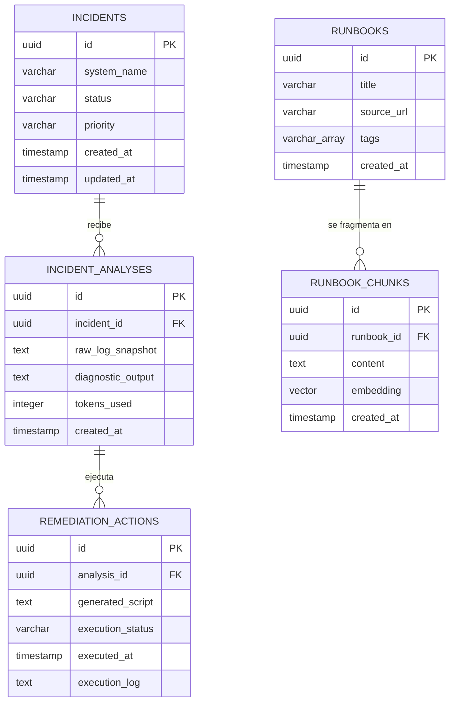

# Modelo de Datos Completo: LogSentinel

Para garantizar que el backend (*Spring Boot*) e infraestructura de persistencia (*PostgreSQL*) soporten de manera escalable las funcionalidades de orquestación RAG y auditoría SRE, se ha diseñado un modelo de datos relacional robusto que incorpora soporte nativo para vectores de alta dimensionalidad a través de la extensión `pgvector`.

---

## 1. Revisión de Diseño: "Honestidad Brutal" y Mejoras Aplicadas

Antes de consolidar el modelo final, se sometió un diseño preliminar a una crítica estricta de ingeniería para erradicar vicios comunes de arquitectura que penalizan el rendimiento y la mantenibilidad:

* **El Vicio del "Gran Objeto Incidente" (Antipatrón Blob):** * *Diseño Naive:* Almacenar en la tabla `Incident` los campos `raw_log`, `diagnostic` y `remediation_script` de forma directa como columnas de texto.
* *Crítica Brutal:* Un incidente real en producción es dinámico. El SRE puede ingresar nuevos fragmentos de logs a medida que evoluciona la crisis, y la IA puede generar múltiples diagnósticos secuenciales o scripts corregidos. Colapsar esto en una fila rompe la trazabilidad histórica de la remediación.
* *Solución:* Se normalizó la arquitectura extrayendo `IncidentAnalysis` e `RemediationAction` a tablas hijas de relación uní-a-muchos ($1:N$). Esto permite auditar cuántas veces se consultó a la IA para un mismo problema y qué scripts fallaron o tuvieron éxito.


* **Aproximación Ineficiente a RAG (Falta de Granularidad):**
* *Diseño Naive:* Guardar el campo vector (`embedding`) directamente en la tabla maestra de `Runbook`.
* *Crítica Brutal:* Los runbooks de ingeniería suelen ser documentos extensos. Si calculamos el embedding de un documento completo de 10 páginas, la semántica se diluye por completo, provocando que el motor de búsqueda vectorial devuelva falsos positivos.
* *Solución:* Se implementó el patrón de **Chunking**. La tabla `Runbook` actúa únicamente como cabecera/metadato del documento original, mientras que los fragmentos de texto normalizados y indexados vectorialmente residen en la tabla subordinada `RunbookChunk`.


* **Ausencia de Control de Costos y Telemetría:**
* *Diseño Naive:* Ignorar el consumo de la API de OpenAI en la base de datos.
* *Crítica Brutal:* En una aplicación de IA corporativa, no trazar los tokens consumidos imposibilita el análisis de costos (*FinOps*) y dificulta detectar bucles infinitos de agentes autónomos.
* *Solución:* Se incluyó de manera obligatoria la métrica `tokens_used` en cada transacción de análisis generado por el LLM.


---

## 2. Diagrama Entidad-Relación (DER)

A continuación, se representa la topología relacional optimizada mediante notación de patas de gallo (*Crow's Foot*):



---

## 3. Diccionario de Datos y Detalle Estructural

### Tabla: `incidents`

Representa el ciclo de vida del problema detectado en la plataforma bajo monitoreo.

| Campo | Tipo de Datos | Restricciones | Descripción |
| --- | --- | --- | --- |
| `id` | UUID | PRIMARY KEY, DEFAULT gen_random_uuid() | Identificador único global de la alerta. |
| `system_name` | VARCHAR(100) | NOT NULL | Nombre de la aplicación afectada (ej: `auth-service`). |
| `status` | VARCHAR(30) | NOT NULL | Estado (`OPEN`, `ANALYZING`, `RESOLVED`). |
| `priority` | VARCHAR(10) | NOT NULL | Criticidad del evento (`P1`, `P2`, `P3`). |
| `created_at` | TIMESTAMP | NOT NULL, DEFAULT NOW() | Fecha de apertura del incidente. |
| `updated_at` | TIMESTAMP | NOT NULL, DEFAULT NOW() | Última modificación del estado. |

### Tabla: `incident_analyses`

Historial de diagnósticos generados por el orquestador de IA basándose en ventanas de logs específicas proporcionadas por el usuario.

| Campo | Tipo de Datos | Restricciones | Descripción |
| --- | --- | --- | --- |
| `id` | UUID | PRIMARY KEY | Identificador de la consulta a la IA. |
| `incident_id` | UUID | FOREIGN KEY ➔ `incidents(id)` ON DELETE CASCADE | Relación con el incidente principal. |
| `raw_log_snapshot` | TEXT | NOT NULL | Volcado exacto de las líneas de log analizadas. |
| `diagnostic_output` | TEXT | NOT NULL | Explicación e hipótesis del error devuelta por el LLM. |
| `tokens_used` | INTEGER | NOT NULL | Consumo de tokens (Prompt + Completion) de esa llamada. |
| `created_at` | TIMESTAMP | NOT NULL, DEFAULT NOW() | Marca de tiempo de la respuesta del modelo. |

### Tabla: `remediation_actions`

Registro de auditoría de los scripts de código generados y la respuesta obtenida tras su ejecución en la consola SRE.

| Campo | Tipo de Datos | Restricciones | Descripción |
| --- | --- | --- | --- |
| `id` | UUID | PRIMARY KEY | Identificador único de la acción. |
| `analysis_id` | UUID | FOREIGN KEY ➔ `incident_analyses(id)` | Vínculo con el diagnóstico que originó el script. |
| `generated_script` | TEXT | NOT NULL | Código/Script ejecutable de remediación (Bash, SQL, etc). |
| `execution_status` | VARCHAR(30) | NOT NULL | Estado de aplicación (`SUCCESS`, `FAILED`, `DRY_RUN`). |
| `executed_at` | TIMESTAMP | DEFAULT NOW() | Momento exacto del disparo del script. |
| `execution_log` | TEXT |  | Output estándar/Error devuelto por la infraestructura. |

### Tabla: `runbooks`

Base de conocimiento de ingeniería cargada previamente para alimentar el contexto semántico del RAG.

| Campo | Tipo de Datos | Restricciones | Descripción |
| --- | --- | --- | --- |
| `id` | UUID | PRIMARY KEY | ID único del documento técnico de solución. |
| `title` | VARCHAR(255) | NOT NULL | Título indicativo (ej: "Mitigación OOM Killer en Java"). |
| `source_url` | VARCHAR(512) |  | Link al Wiki corporativo o repositorio original. |
| `tags` | VARCHAR(50)[] |  | Array indexable de tecnologías afectadas (ej: `['spring', 'k8s']`). |
| `created_at` | TIMESTAMP | DEFAULT NOW() | Fecha de ingesta al sistema. |

### Tabla: `runbook_chunks`

Segmentos vectorizados de los runbooks. Utiliza el tipo nativo `vector` provisto por la extensión externa de PostgreSQL.

| Campo | Tipo de Datos | Restricciones | Descripción |
| --- | --- | --- | --- |
| `id` | UUID | PRIMARY KEY | Identificador exclusivo del fragmento. |
| `runbook_id` | UUID | FOREIGN KEY ➔ `runbooks(id)` ON DELETE CASCADE | Relación de pertenencia con el Runbook padre. |
| `content` | TEXT | NOT NULL | Texto crudo del fragmento (párrafos aislados de la solución). |
| `embedding` | VECTOR(N) | NOT NULL | Vector embebido. Dimensión N según el proveedor de embeddings activo: 768 con Ollama/`nomic-embed-text` (default) o 1536 con OpenAI/`text-embedding-3-small` (perfil opcional). |
| `created_at` | TIMESTAMP | DEFAULT NOW() | Fecha de procesamiento vectorial. |

---

## 4. Estrategia de Índices de Base de Datos para Rendimiento

Para que el sistema sea eficiente bajo fuego durante un incidente masivo, el esquema DDL debe incluir los siguientes índices estratégicos:

1. **Búsqueda Vectorial por Coseno (RAG Fast-Path):**
```sql
CREATE INDEX idx_runbook_chunks_embedding 
ON runbook_chunks USING hnsw (embedding vector_cosine_ops);

```


*Explicación:* El uso del índice **HNSW (Hierarchical Navigable Small World)** permite realizar búsquedas por similitud de coseno extremadamente veloces a escala en la persistencia, acelerando la inyección de runbooks al prompt.

2. **Búsqueda Operativa Clave:**
```sql
CREATE INDEX idx_incidents_status_priority ON incidents (status, priority);
CREATE INDEX idx_analyses_incident_id ON incident_analyses (incident_id);

```


*Explicación:* Garantiza que los listados de incidentes abiertos y la recuperación de historiales en cascada para la interfaz de streaming se resuelvan en complejidad $O(1)$ u $O(\log N)$.
