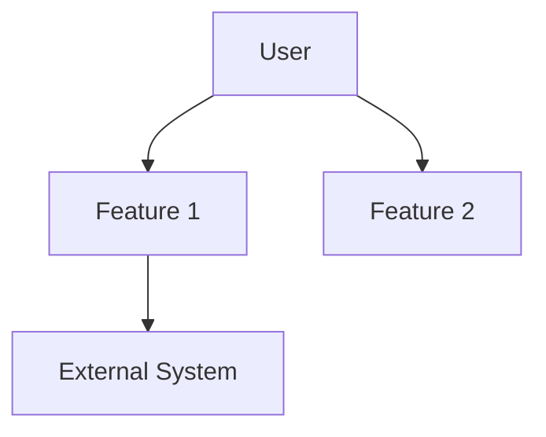

# Epic: {epic-name}

> ID: EP-{number}
> Source: {prd-name} — Section {section-ref}
> Status: Draft | In Progress | Approved
> Priority: Must | Should | Could | Won't

---

## Description
<!-- High-level description of the epic and its business purpose -->

## Business Objective
<!-- Which PRD objective this epic addresses. Direct reference to PRD section -->

---

## Features

| ID | Feature | Description | Priority | Complexity | Dependencies |
|----|---------|-------------|----------|------------|--------------|
| FT-{ep}-01 | {name} | {description} | Must/Should/Could | S/M/L/XL | {deps} |

---

## User Stories

| ID | Story | Type | Priority | Size | Status |
|----|-------|------|----------|------|--------|
| US-{ep}-01 | As {role} I want {action} so that {benefit} | fullstack/frontend/backend/infra/ux | Must | M | Draft |

---

## Epic Success Criteria
- [ ] {measurable criterion linked to PRD KPI}
- [ ] {measurable criterion}

---

## Effort Summary

| Metric | Value |
|--------|-------|
| Total Stories | {n} |
| Size Distribution | XS: _ · S: _ · M: _ · L: _ · XL: _ |
| Estimated Time | {min} – {max} days |
| Story Points | {min} – {max} |

---

## Context Diagram

---

## Dependencies with Other Epics

| Epic | Type | Description |
|------|------|-------------|
| EP-{x} | Blocking/Preferred/Informational | {description} |

---

## Decisions Log

| Date | Decision | Context | Discarded Alternatives |
|------|----------|---------|------------------------|
| {date} | {decision} | {rationale} | {alternatives} |
