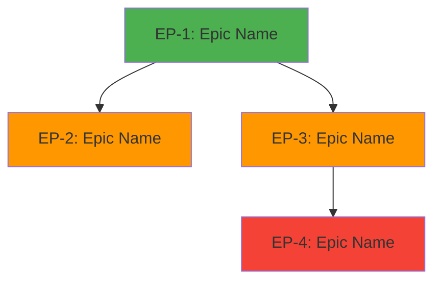

# Backlog Overview: {project-name}

> Generated: {date}
> Source Documents: {n} files from `docs/`
> Status: Draft | Approved

---

## Executive Summary

| Metric | Value |
|--------|-------|
| Total Epics | {n} |
| Total Stories | {n} |
| Total Subtasks | {n} |
| Estimated Effort | {min} – {max} weeks |
| Total Story Points | {min} – {max} |

---

## Epic Map

| ID | Epic | Priority | Stories | Points | Status |
|----|------|----------|---------|--------|--------|
| EP-1 | [{epic-name}](./{epic-id}/README.md) | Must | {n} | {points} | Draft |

---

## Complexity Heatmap

| Epic | Stories | Avg Size | Risk Level | Effort Weight |
|------|---------|----------|------------|---------------|
| EP-1 | {n} | M | 🟢 Low / 🟡 Medium / 🔴 High |  |
| Frontend | {n} |  |
| Infrastructure | {n} |  |

---

## Size Distribution

| Size | Count | Total Points |
|------|-------|-------------|
| XS | {n} | {points} |
| S | {n} | {points} |
| M | {n} | {points} |
| L | {n} | {points} |
| XL | {n} | ⚠️ {points} — consider splitting |

---

## Alerts

> ⚠️ {n} stories sized XL — review for splitting
> ⚠️ {n} stories with low confidence estimates — consider spikes
> ⚠️ Circular dependency detected between {stories} — restructure required

---

## File Index

### Epics
| Epic | Directory | Stories |
|------|-----------|---------|
| EP-1: {name} | [`EP-1/`](./EP-1/README.md) | {n} stories |

### Per-Epic Story Index
<!-- Auto-generated per epic -->

---

## Source Documents

| Document | Type | Path | Used For |
|----------|------|------|----------|
| {name} | PRD / Diagram / ADR / API Spec | {path} | {which epics/stories} |

---

## Generation Log

| Date | Action | Details |
|------|--------|---------|
| {date} | Initial generation | {n} epics, {m} stories from {k} source documents |
