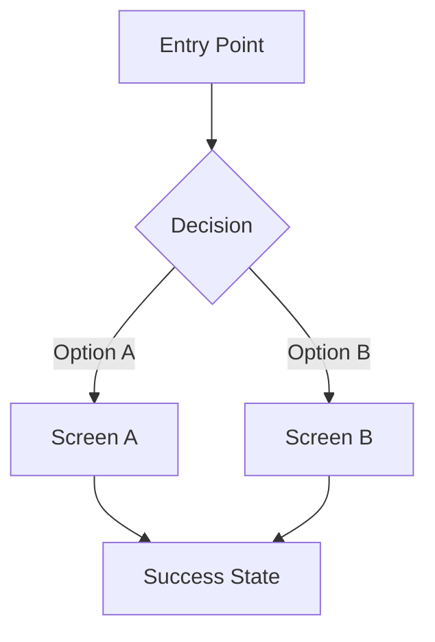

# User Story: {title}

> ID: US-{epic}-{number}
> Epic: EP-{number} — {epic-name}
> Feature: FT-{epic}-{number} — {feature-name}
> Type: ux
> Status: Draft | In Progress | Done
> Priority: Must | Should | Could | Won't

---

## Story

**As** {role/persona from PRD}
**I want** {desired action or capability}
**So that** {benefit or value obtained}

---

## Acceptance Criteria

### Scenario 1: {name — happy path}
**Given** {initial context / preconditions with concrete data}
**When** {specific user action}
**Then** {expected observable result}

### Scenario 2: {name — alternative case}
**Given** {context}
**When** {action}
**Then** {result}

### Scenario 3: {name — error case}
**Given** {context}
**When** {incorrect or unexpected action}
**Then** {error handling / user message}

---

## Prioritization

| Method | Value |
|--------|-------|
| MoSCoW | Must / Should / Could / Won't |

**Rationale**: {why this priority}

---

## Effort Estimation

**Assigned Size**: {size}
**Estimated Time**: {time_range}
**Story Points**: {points}
**Confidence**: High / Medium / Low

**Effort Rationale**: {why this estimate}

---

## Dependencies

| Story / Subtask | Type | Description |
|-----------------|------|-------------|
| US-{x}-{y} | Blocking / Preferred / Informational | {description} |

---

## UX/Design Specifications

### User Flow



### Screens / Views

| Screen | Purpose | Key Elements | Interactions |
|--------|---------|--------------|--------------|
| {screen-name} | {purpose} | {key UI elements} | {primary interactions} |

### Interaction Patterns

| Interaction | Trigger | Response | Feedback |
|-------------|---------|----------|----------|
| {interaction} | {user action} | {system response} | {visual/haptic feedback} |

### Design Tokens & Constraints
<!-- Reference to design system, brand guidelines, or visual constraints -->

| Token | Value | Usage |
|-------|-------|-------|
| Primary Color | {value} | {where used} |
| Typography | {font/size} | {context} |
| Spacing | {value} | {context} |

### Usability Heuristics Checklist
- [ ] Visibility of system status
- [ ] Match between system and real world
- [ ] User control and freedom (undo/redo)
- [ ] Consistency and standards
- [ ] Error prevention
- [ ] Recognition rather than recall
- [ ] Flexibility and efficiency of use
- [ ] Aesthetic and minimalist design

---

## INVEST Validation

| Criterion | Passes? | Observation |
|-----------|---------|-------------|
| **I**ndependent | ✅ / ⚠️ / ❌ | {observation} |
| **N**egotiable | ✅ / ⚠️ / ❌ | {observation} |
| **V**aluable | ✅ / ⚠️ / ❌ | {observation} |
| **E**stimable | ✅ / ⚠️ / ❌ | {observation} |
| **S**mall | ✅ / ⚠️ / ❌ | {observation} |
| **T**estable | ✅ / ⚠️ / ❌ | {observation} |

---

## Subtasks

<!-- Generated in Phase 3 -->

---

## Traceability

```mermaid
graph LR
    PRD[PRD] --> EP[EP-{n}]
    EP --> FT[FT-{ep}-{n}]
    FT --> US[US-{ep}-{n}]
    US --> AC1[AC: Scenario 1]
    US --> ST1[Subtask: User Flow Design]
    US --> ST2[Subtask: Wireframes]
    US --> ST3[Subtask: Prototype]
    US --> ST4[Subtask: Usability Testing]
```
