# Mermaid Diagram Types — Quick Syntax Reference

## Use Case (`usecase`)
```mermaid
graph TD
    Actor1((Usuario)) --> UC1[Iniciar sesión]
    Actor1 --> UC2[Ver perfil]
    UC1 ..> UC3[Validar credenciales] : <<include>>
    UC2 ..> UC4[Editar datos] : <<extend>>
```

## Sequence (`sequenceDiagram`)
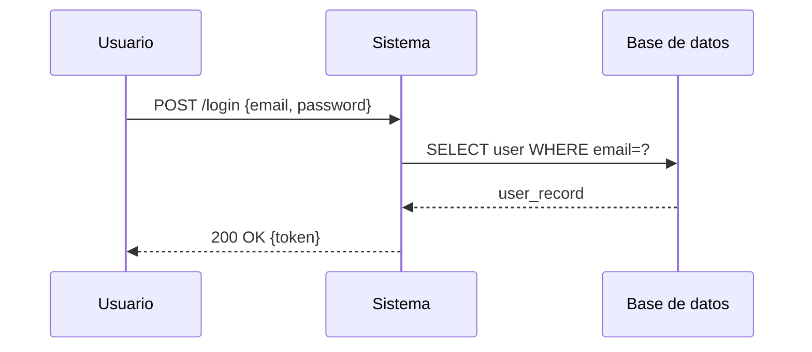

## Class (`classDiagram`)
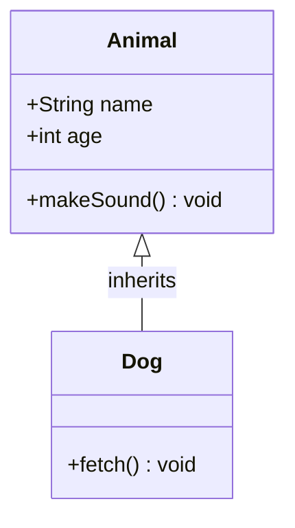

## Flowchart (`flowchart`)
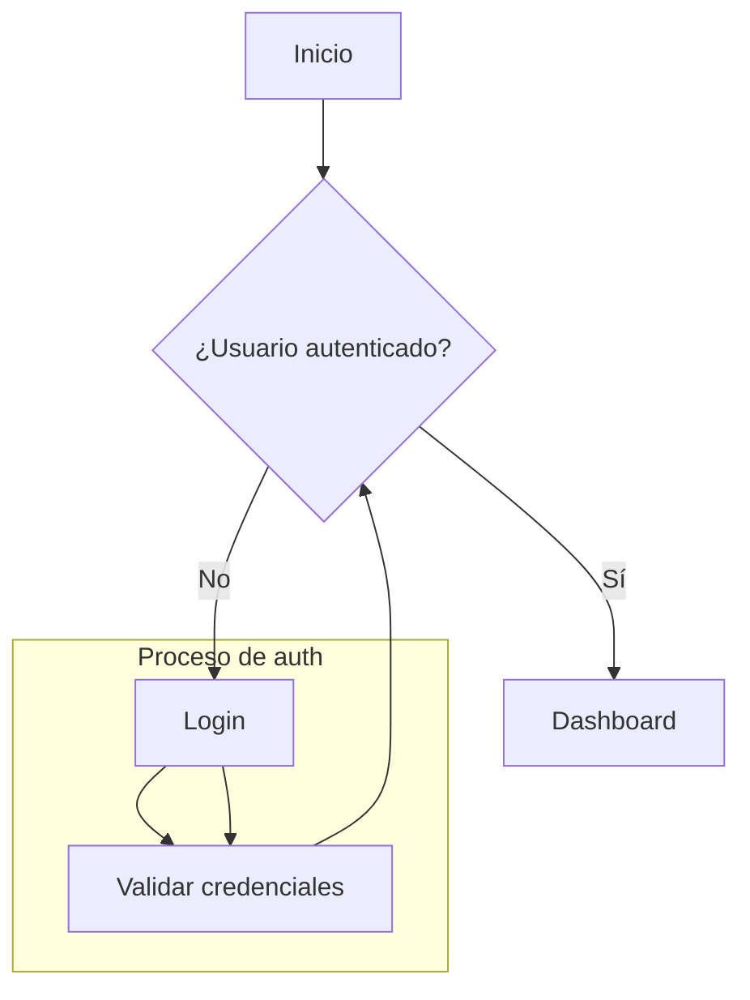

## Entity-Relationship (`erDiagram`)
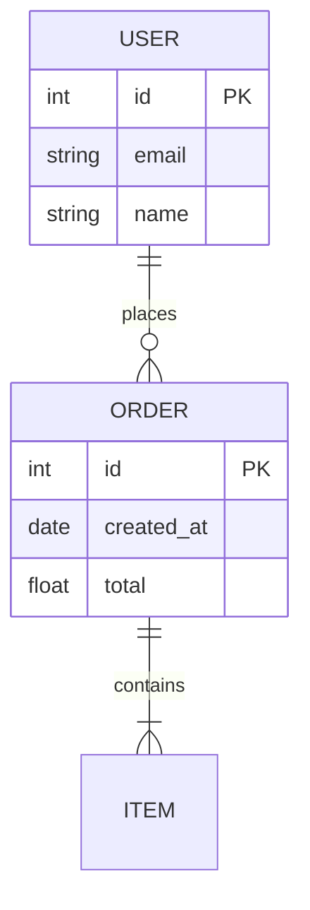

## State Diagram (`stateDiagram-v2`)
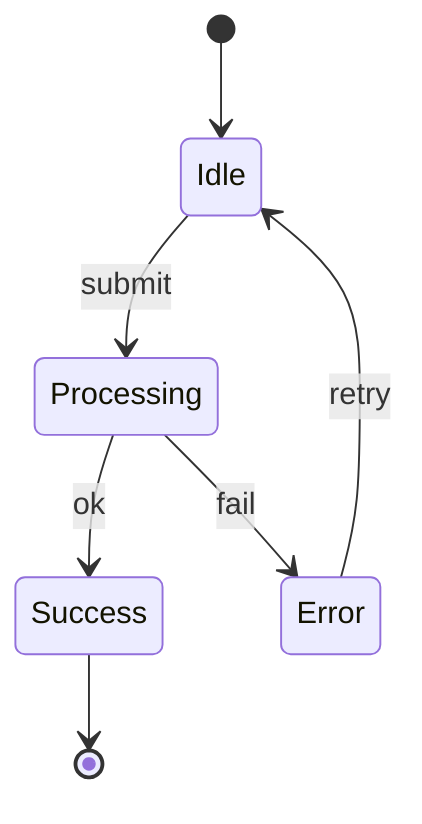

## Gantt (`gantt`)
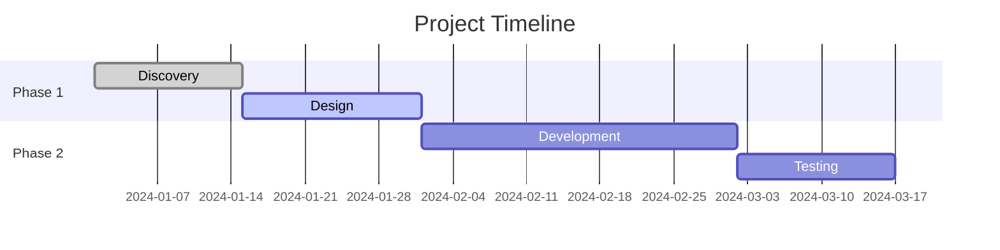

## Mindmap (`mindmap`)
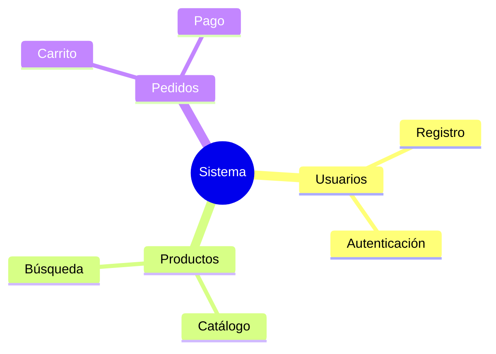

## Git Graph (`gitGraph`)
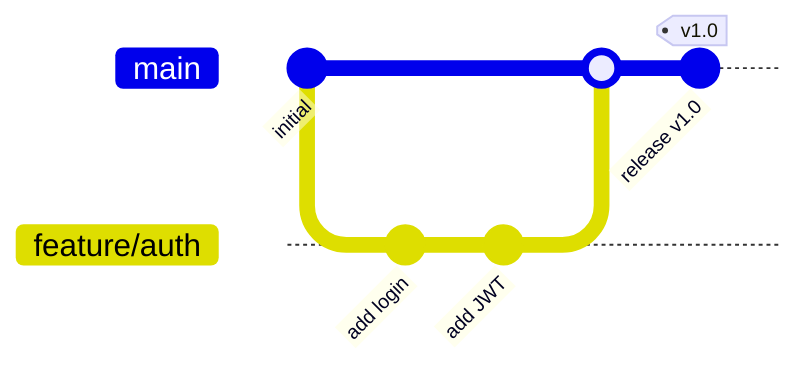

## C4 Context (`C4Context`)
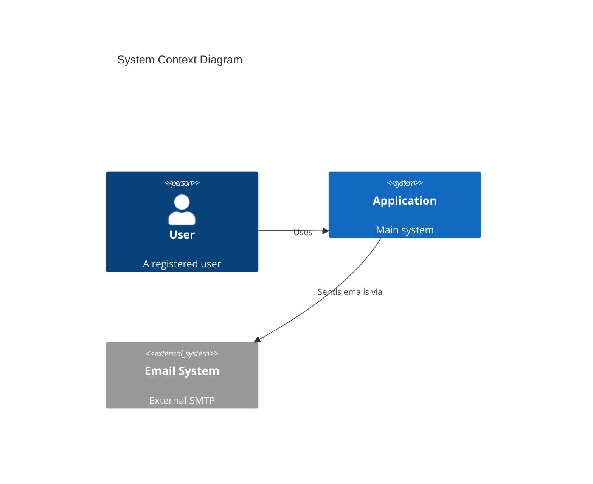

## C4 Container (`C4Container`)
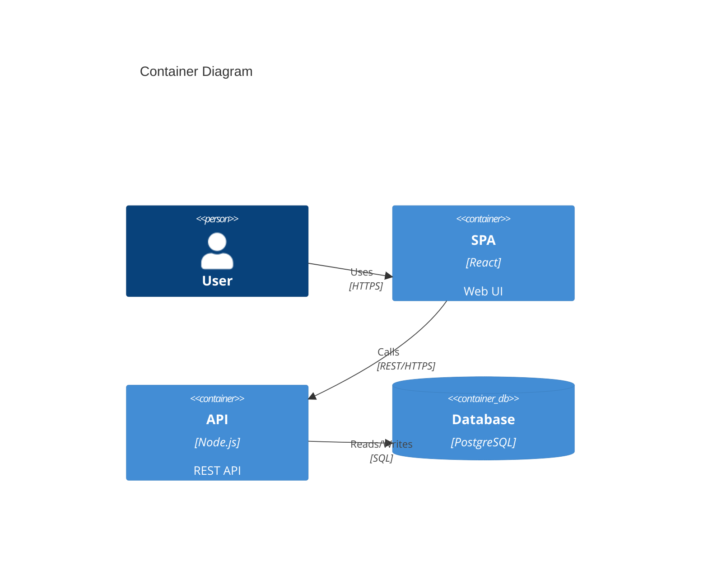

## C4 Component (`C4Component`)
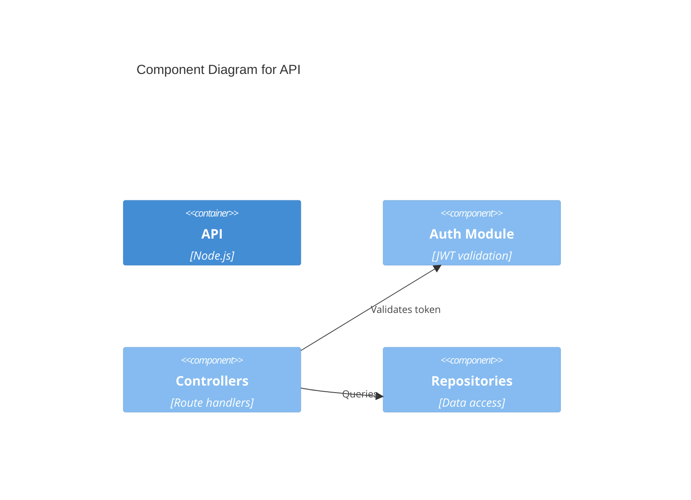

## Timeline (`timeline`)
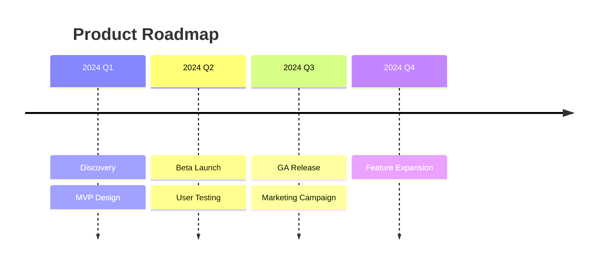

## Quadrant Chart (`quadrantChart`)
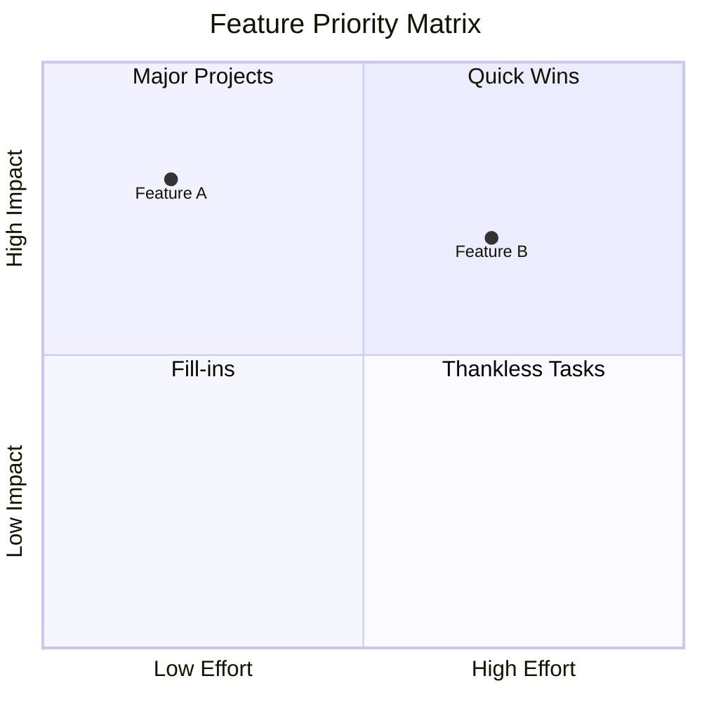

## XY Chart (`xychart-beta`)
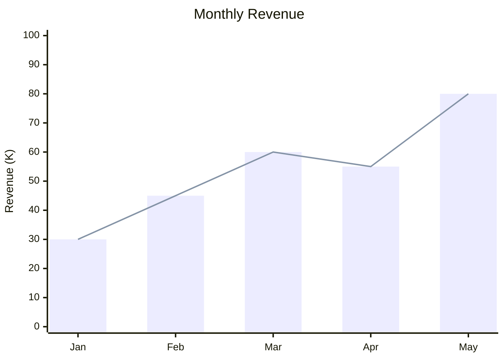

## Block Diagram (`block-beta`)
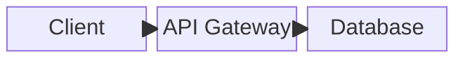
