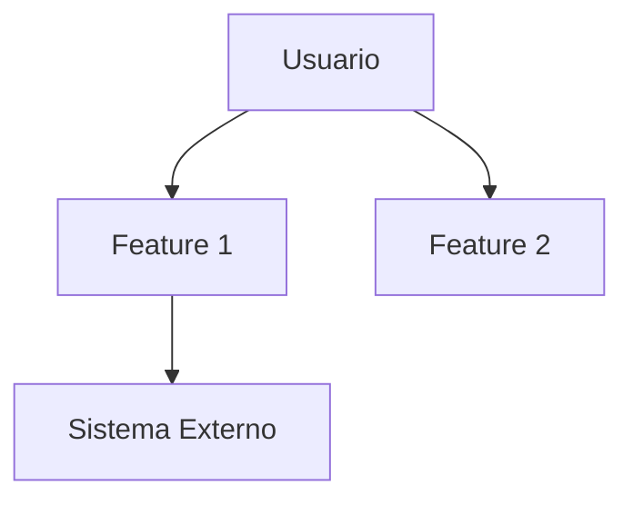

# Épica: {nombre-épica}

> Identificador: EP-{número}
> PRD: {nombre-prd}
> Estado: Pendiente | En Progreso | Completada
> Prioridad: Must | Should | Could | Won't

---

## Descripción
<!-- Descripción de alto nivel de la épica y su propósito -->

## Objetivo de Negocio
<!-- Qué objetivo del PRD cubre esta épica. Referencia directa a sección 4.1 del PRD -->

---

## Features

| ID | Feature | Descripción | Prioridad | Complejidad | Dependencias |
|----|---------|-------------|-----------|-------------|--------------|
| FT-{ep}-01 | {nombre} | {descripción} | Must/Should/Could | S/M/L/XL | {deps} |

---

## User Stories Asociadas

| ID | Historia | Prioridad | Estado |
|----|----------|-----------|--------|
| US-{ep}-01 | Como {rol} quiero {acción} para {beneficio} | Must | Pendiente |

---

## Criterios de Éxito de la Épica
- [ ] {criterio medible vinculado a KPI del PRD}
- [ ] {criterio medible}

---

## Diagrama de Contexto

---

## Dependencias con Otras Épicas

| Épica | Tipo | Descripción |
|-------|------|-------------|
| EP-{x} | Bloqueante/Preferente/Informativa | {descripción} |

---

## Notas y Decisiones

| Fecha | Decisión | Contexto | Alternativas Descartadas |
|-------|----------|----------|--------------------------|
| {fecha} | {decisión} | {por qué} | {alternativas} |
