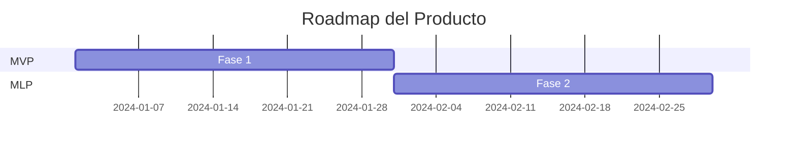

# PRD: {nombre-producto}

> Versión: {versión} | Fecha: {fecha} | Autor: Product Owner AI
> Estado: Borrador | En Revisión | Aprobado

---

## 1. Visión General

### 1.1 Propósito
<!-- Descripción concisa del producto y su razón de existir -->

### 1.2 Problema que Resuelve
<!-- Dolor o necesidad del usuario que aborda este producto -->

### 1.3 Propuesta de Valor
<!-- Por qué este producto es la mejor solución al problema -->

---

## 2. Usuarios Objetivo

### 2.1 Personas
| Persona | Descripción | Necesidades Clave | Dolor Principal |
|---------|-------------|-------------------|-----------------|
| {nombre} | {descripción} | {necesidades} | {dolor} |

### 2.2 Segmentos de Mercado
<!-- Segmentos principales y secundarios -->

---

## 3. Alcance del Producto

### 3.1 Funcionalidades Principales
<!-- Lista priorizada de las funcionalidades core -->

### 3.2 Fuera de Alcance
<!-- Qué NO incluye este producto explícitamente -->

### 3.3 Supuestos
<!-- Supuestos sobre los que se basa esta definición -->

---

## 4. Requisitos de Negocio

### 4.1 Objetivos de Negocio
| Objetivo | Métrica | Meta | Plazo |
|----------|---------|------|-------|
| {objetivo} | {métrica} | {meta} | {plazo} |

### 4.2 KPIs y Métricas de Éxito
<!-- Métricas cuantificables que definen el éxito del producto -->

### 4.3 Modelo de Negocio
<!-- Cómo genera valor/ingresos este producto -->

---

## 5. Contexto Competitivo

### 5.1 Competidores
| Competidor | Fortalezas | Debilidades | Diferencial Nuestro |
|------------|------------|-------------|---------------------|
| {nombre} | {fortalezas} | {debilidades} | {diferencial} |

### 5.2 Diferenciadores Clave
<!-- Ventajas competitivas únicas -->

---

## 6. Restricciones

### 6.1 Técnicas
<!-- Limitaciones tecnológicas, integraciones requeridas -->

### 6.2 De Negocio
<!-- Presupuesto, timeline, recursos -->

### 6.3 Regulatorias
<!-- Normativas, compliance, GDPR, etc. -->

---

## 7. Riesgos y Dependencias

| ID | Riesgo/Dependencia | Tipo | Probabilidad | Impacto | Mitigación |
|----|-------------------|------|--------------|---------|------------|
| R-1 | {descripción} | Riesgo | Alta/Media/Baja | Alto/Medio/Bajo | {mitigación} |
| D-1 | {descripción} | Dependencia | — | Alto/Medio/Bajo | {plan} |

---

## 8. Timeline y Fases

---

## Historial de Cambios

| Fecha | Versión | Cambio | Autor |
|-------|---------|--------|-------|
| {fecha} | 1.0 | Creación inicial | PO AI |
