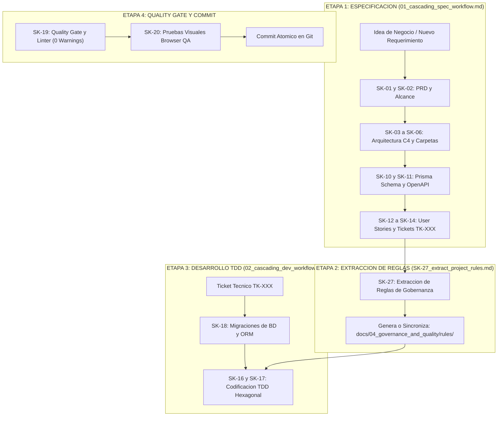

# 🗺️ Trazo Maestro del Ciclo de Vida VSDD (Idea ➔ Specs ➔ Rules ➔ Code ➔ Commit)

Este documento describe el flujo de trabajo end-to-end ejecutado por el asistente de IA en el repositorio, siguiendo la metodología **Verified Spec-Driven Development (VSDD)**.

---

## 🧭 Diagrama Arquitectónico del Ciclo Completo

---

## 🔍 Descripción Detallada de las Etapas

### 🟢 ETAPA 1: De la Idea a la Especificación Técnica (`01_cascading_spec_workflow.md`)
1. **Entrada:** Requerimiento de negocio suministrado por el usuario en lenguaje natural.
2. **Acción de la IA:** Asume los roles de **Software Architect** y **Product Owner** e invoca la secuencia de skills de `specs/` (de `SK-01` a `SK-15`):
   - **`SK-02`:** Registra las reglas de negocio en `docs/01_product_definition/` (PRD del producto).
   - **`SK-03` / `SK-05`:** Adapta las capas de arquitectura y estructura en `docs/02_architecture_design/`.
   - **`SK-06` / `SK-07`:** Modifica el modelo físico en `prisma/schema.prisma` y los contratos HTTP en `docs/03_persistence_and_api/` (Especificación de API y `openapi.yaml`).
   - **`SK-11` / `SK-12`:** Crea la User Story (`US-NNN.md`) y los Tickets Técnicos (`TK-NNN.md`) atómicos en `docs/05_agile_planning/`.
3. **Resultado:** El backlog y la documentación en `docs/` quedan 100% actualizados y trazables en el mapa Mermaid de `14_backlog_map.md`.

---

### 🟡 ETAPA 2: Extracción Dinámica de Reglas (`SK-27_extract_project_rules.md`)
1. **Entrada:** Inicio de la fase de desarrollo.
2. **Acción de la IA:** La skill `SK-27` lee la documentación recién actualizada en `docs/` y traduce las directivas técnicas a **archivos de reglas de gobernanza** en `docs/04_governance_and_quality/rules/`:
   - `domain_rules.md` (Pureza TypeScript, `decimal.js`).
   - `backend_rules.md` (Express, Zod, Controllers, Lock pesimista).
   - `frontend_rules.md` (Botones ≥48px, Modo Oscuro HSL, Offline).
   - `database_rules.md` (`snake_case`, `Decimal(12,4)`).
   - `testing_rules.md` (TDD, `InMemoryRepository` fakes).
   - `security_rules.md` (Bcrypt, JWT, OWASP).
   - `git_rules.md` (Conventional Commits).

---

### 🔵 ETAPA 3: De Ticket a Código Probado (`desarrollo_cascada.md`)
1. **Entrada:** Orden de implementar un ticket técnico específico (ej. *"Desarrolla el ticket TK-001"*).
2. **Acción de la IA:**
   - **Migración (`SK-18`):** Si el ticket cambia la BD, modifica `schema.prisma`, corre la migración local y regenera el cliente ORM.
   - **Codificación TDD (`SK-16` / `SK-17`):**
     - **RED:** Escribe primero la prueba automatizada que falla (usando `InMemoryRepository` en lugar de mocks frágiles).
     - **GREEN:** Escribe la implementación en las capas Hexagonales (`Domain` ➔ `Application` ➔ `Infrastructure`) hasta pasar el test.
     - **REFACTOR:** Limpia la solución independizando la lógica de frameworks.

---

### 🟣 ETAPA 4: Quality Gate, QA Visual y Commit
1. **Inspección de Código (`SK-19`):** Pasa el compilador de tipos (`tsc`) y linter (`eslint`/`oxlint`). Se exige estricto **0 errores y 0 advertencias**.
2. **QA Visual en Navegador (`SK-20`):** Si es un ticket de UI, abre el subagente de navegación interactivo, prueba los clics táctiles en botones de 48px y registra evidencias.
3. **Commit Atómico:** Realiza exactamente **1 commit en Git** vinculado al ticket `TK-XXX`.

---

## 🌟 Principios Fundamentales del Sistema

1. **Agnóstico y Portátil:** Toda la carpeta `.agents/` es 100% independiente del proyecto. Puede trasladarse a cualquier otro repositorio.
2. **Fuente Única de Verdad (`docs/`):** El proyecto se gobierna desde su propia documentación viva.
3. **Cero Vibe-Coding:** Ningún desarrollo se realiza improvisando. Todo responde a un ticket `TK-XXX` previamente diseñado.
