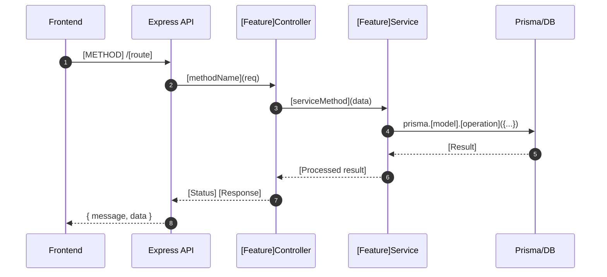

# [Feature Name] — Technical Documentation

> **Generated by:** Feature Documentation Generator skill
> **Date:** [DATE]
> **Author/Agent:** Claude

---

## 1. Feature Overview

[2–4 sentences: what the feature does, its business purpose, and primary users.]

**Assumptions made during documentation:**
- [List any inferred details the user should verify]

---

## 2. Core Files Map

| File Path | Role | Key Exports |
|-----------|------|-------------|
| `src/features/[name]/index.ts` | Entry point / router | `[FeatureName]Controller` |
| `src/features/[name]/service.ts` | Business logic | `[FeatureName]Service` |
| `src/features/[name]/repository.ts` | Data access layer | `[FeatureName]Repository` |
| `src/features/[name]/dto.ts` | Data transfer objects | `Create[X]Dto`, `Update[X]Dto` |
| `src/features/[name]/schema.ts` | Validation schemas | `create[X]Schema` |
| `prisma/schema.prisma` (L[N]–L[M]) | Database model | `model [X]` |

---

## 3. Architecture Diagram


*C4 Level 2 Container diagram showing the internal structure of [feature name].
Generated from `docs/diagrams/[feature_name]_containers.puml` using C4-PlantUML.*

---

## 4. Data Flow

*End-to-end flow of a typical [feature action] request:*



---

## 5. Domain Model

```mermaid
classDiagram
  class [MainEntity] {
    Int id
    String [field1]
    String [field2]
    DateTime createdAt
  }
  class [RelatedEntity] {
    Int id
    Int [mainEntityId]
    String [field]
  }
  [MainEntity] "1" --> "many" [RelatedEntity]
```

---

## 6. Key Dependencies

| Dependency | Version | Purpose |
|------------|---------|---------|
| [library] | ^[x.y.z] | [What it provides for this feature] |

---

## 7. Configuration Options

| Variable | Default | Description |
|----------|---------|-------------|
| `[ENV_VAR]` | `[default]` | [What it controls] |

---

## 8. Extension Points

- **Adding a new [X]:** Extend `[FeatureName]Service` → add method → expose in controller.
- **Custom validation:** Add rules to `src/features/[name]/schema.ts`.
- **New event handlers:** Subscribe to `[eventName]` in `src/events/`.

---

## 9. Implementation Patterns

This feature follows these established patterns (refer to linked docs for implementation details):

- **Authentication:** Routes protected via `authMiddleware` — see `@auth.md`
- **CRUD operations:** Standard repository pattern — see `@crud.md`
- **Error handling:** Centralized error middleware — see `@error.md`
- **Router setup:** Express/tRPC router conventions — see `@router.md`
- **Schema validation:** Zod schemas — see `@schema.md`
- **React Query:** Data fetching hooks — see `@trpc-react-query.md`

---

## 10. Failure Modes

| Scenario | Behavior | Recovery |
|----------|----------|----------|
| Database unavailable | Service throws `DatabaseException` | Retry with backoff; return 503 |
| Invalid payload | Zod validation fails | Return 400 with field-level errors |
| Auth token expired | Middleware returns 401 | Client refreshes token and retries |
| [Service dependency] down | [Exception type] | [Fallback behavior] |
