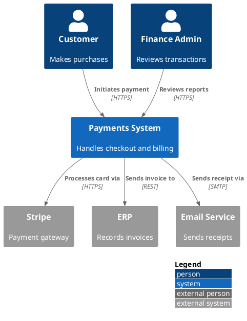
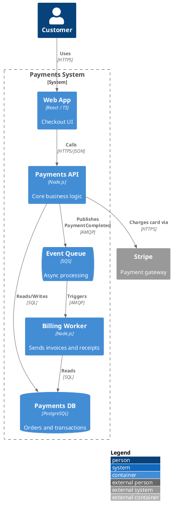
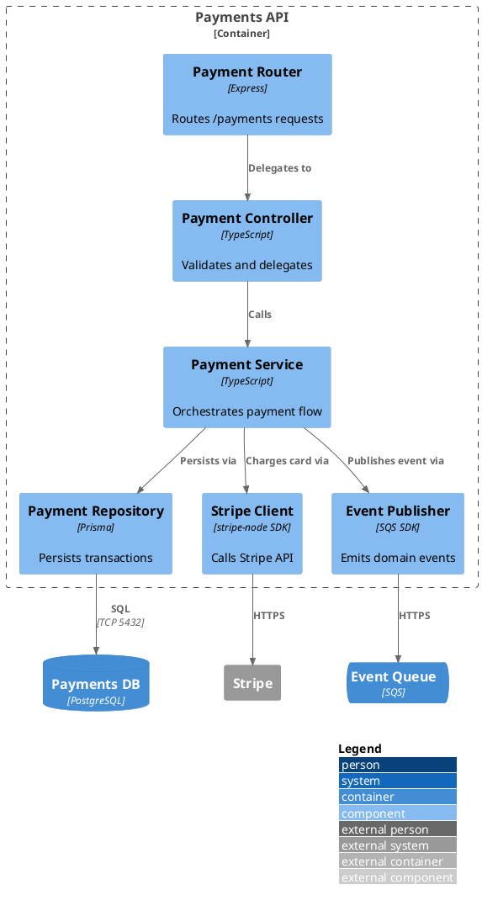
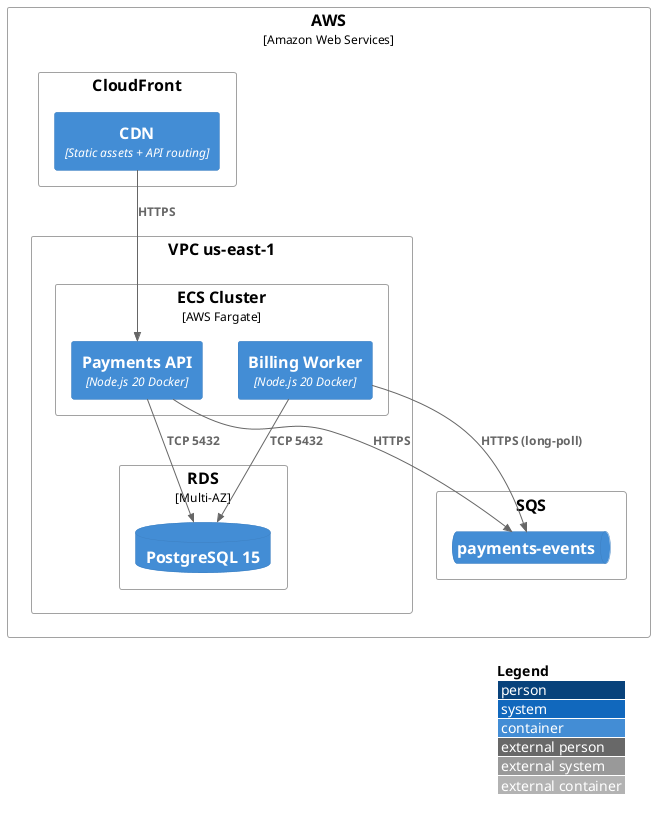
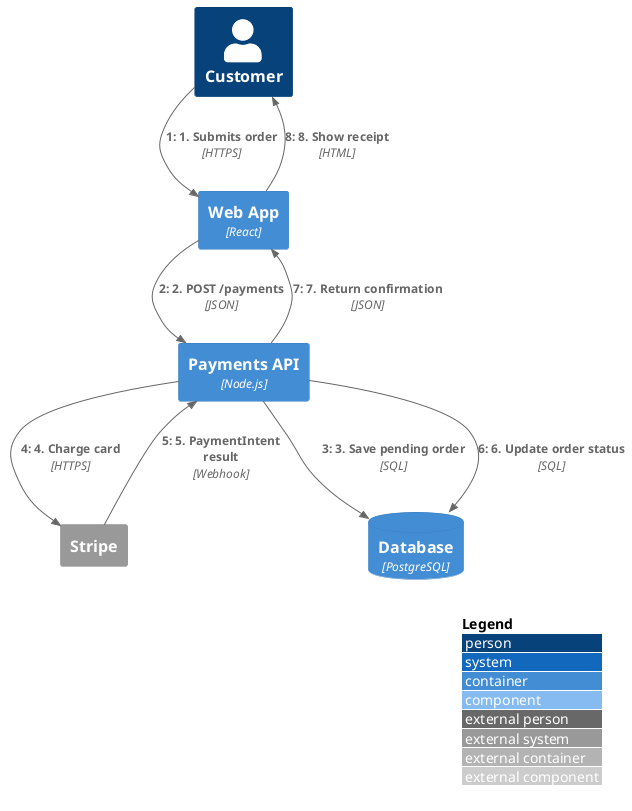

# C4-PlantUML Reference Guide

Based on the official library: https://github.com/plantuml-stdlib/C4-PlantUML

C4-PlantUML combines PlantUML with the C4 model to describe software architectures
at four levels of abstraction: Context → Container → Component → Code.

---

## Tooling Setup

### Option A — Online (no install required)
Use the PlantUML Web Server: https://www.plantuml.com/plantuml/
Paste any `.puml` snippet and render immediately.

### Option B — VS Code
1. Install the **PlantUML** extension (by jebbs).
2. Add to `settings.json`:
   ```json
   "plantuml.jarArgs": ["-DRELATIVE_INCLUDE=."]
   ```
3. Use `Alt+D` to preview `.puml` files.

### Option C — Local CLI
```bash
# Install PlantUML (requires Java)
brew install plantuml          # macOS
sudo apt-get install plantuml  # Linux

# Render a diagram
plantuml diagram.puml          # produces diagram.png
plantuml -tsvg diagram.puml    # SVG output
plantuml -tpng diagram.puml    # PNG output (default)
```

### Option D — Use bundled `generate_c4_diagram.py`
See `scripts/generate_c4_diagram.py` in this skill for automated rendering
via subprocess. Requires Java + PlantUML jar or system `plantuml` command.

---

## Including the Library

Every `.puml` file must include the appropriate C4 module at the top.
Use the **standard library** include (no internet required, bundled in PlantUML):

```plantuml
!include <C4/C4_Context>      ' Level 1
!include <C4/C4_Container>    ' Level 2
!include <C4/C4_Component>    ' Level 3
!include <C4/C4_Deployment>   ' Deployment view
!include <C4/C4_Dynamic>      ' Dynamic / numbered flow
!include <C4/C4_Sequence>     ' C4-styled sequence
```

Or use the always-up-to-date remote URL (requires internet at render time):

```plantuml
!include https://raw.githubusercontent.com/plantuml-stdlib/C4-PlantUML/master/C4_Context.puml
!include https://raw.githubusercontent.com/plantuml-stdlib/C4-PlantUML/master/C4_Container.puml
!include https://raw.githubusercontent.com/plantuml-stdlib/C4-PlantUML/master/C4_Component.puml
!include https://raw.githubusercontent.com/plantuml-stdlib/C4-PlantUML/master/C4_Deployment.puml
!include https://raw.githubusercontent.com/plantuml-stdlib/C4-PlantUML/master/C4_Dynamic.puml
!include https://raw.githubusercontent.com/plantuml-stdlib/C4-PlantUML/master/C4_Sequence.puml
```

**Recommendation:** Use standard library (`<C4/C4_*>`) for offline-safe, reproducible builds.
Use the raw URL include only when you need the absolute latest version.

---

## Diagram Types and When to Use Each

| C4 Level | File to include | Use when documenting... |
|----------|----------------|------------------------|
| L1 — System Context | `C4_Context.puml` | How the system fits in the world; external users and systems |
| L2 — Container | `C4_Container.puml` | Internal apps, databases, queues inside the system boundary |
| L3 — Component | `C4_Component.puml` | Internal components within a single container (e.g. the API) |
| Deployment | `C4_Deployment.puml` | Infrastructure nodes and how containers are deployed |
| Dynamic | `C4_Dynamic.puml` | Numbered interaction flows (like sequence diagrams with C4 style) |
| Sequence | `C4_Sequence.puml` | C4-styled sequence diagrams for interaction details |

---

## Macro Reference

### Argument notation
- `arg` = required
- `?arg` = optional (can also be set as `$arg=...` keyword without positional order)

### L1 — Context Diagram (`C4_Context.puml`)

```plantuml
Person(alias, label, ?descr, ?sprite, ?tags, ?link, ?type)
Person_Ext(alias, label, ?descr, ?sprite, ?tags, ?link, ?type)

System(alias, label, ?descr, ?sprite, ?tags, ?link, ?type, ?baseShape)
SystemDb(alias, label, ?descr, ?sprite, ?tags, ?link, ?type)
SystemQueue(alias, label, ?descr, ?sprite, ?tags, ?link, ?type)
System_Ext(alias, label, ?descr, ?sprite, ?tags, ?link, ?type, ?baseShape)
SystemDb_Ext(alias, label, ?descr, ?sprite, ?tags, ?link, ?type)
SystemQueue_Ext(alias, label, ?descr, ?sprite, ?tags, ?link, ?type)

Boundary(alias, label, ?type, ?tags, ?link, ?descr)
Enterprise_Boundary(alias, label, ?tags, ?link, ?descr)
System_Boundary(alias, label, ?tags, ?link, ?descr)
```

### L2 — Container Diagram (`C4_Container.puml`)

Includes all Context macros, plus:

```plantuml
Container(alias, label, ?techn, ?descr, ?sprite, ?tags, ?link, ?baseShape)
ContainerDb(alias, label, ?techn, ?descr, ?sprite, ?tags, ?link)
ContainerQueue(alias, label, ?techn, ?descr, ?sprite, ?tags, ?link)
Container_Ext(alias, label, ?techn, ?descr, ?sprite, ?tags, ?link, ?baseShape)
ContainerDb_Ext(alias, label, ?techn, ?descr, ?sprite, ?tags, ?link)
ContainerQueue_Ext(alias, label, ?techn, ?descr, ?sprite, ?tags, ?link)
Container_Boundary(alias, label, ?tags, ?link, ?descr)
```

### L3 — Component Diagram (`C4_Component.puml`)

Includes all Container macros, plus:

```plantuml
Component(alias, label, ?techn, ?descr, ?sprite, ?tags, ?link, ?baseShape)
ComponentDb(alias, label, ?techn, ?descr, ?sprite, ?tags, ?link)
ComponentQueue(alias, label, ?techn, ?descr, ?sprite, ?tags, ?link)
Component_Ext(alias, label, ?techn, ?descr, ?sprite, ?tags, ?link, ?baseShape)
ComponentDb_Ext(alias, label, ?techn, ?descr, ?sprite, ?tags, ?link)
ComponentQueue_Ext(alias, label, ?techn, ?descr, ?sprite, ?tags, ?link)
```

### Deployment Diagram (`C4_Deployment.puml`)

Based on Container macros, plus:

```plantuml
Deployment_Node(alias, label, ?type, ?descr, ?sprite, ?tags, ?link)
Node(alias, label, ?type, ?descr, ?sprite, ?tags, ?link)   ' short alias
Node_L(alias, label, ...)   ' left-aligned
Node_R(alias, label, ...)   ' right-aligned
```

---

## Relationships

```plantuml
' Standard directed relationship
Rel(from, to, label, ?techn, ?descr, ?sprite, ?tags, ?link)

' Bidirectional
BiRel(from, to, label, ?techn, ?descr, ?sprite, ?tags, ?link)

' Forced direction variants
Rel_Up(from, to, label, ...)     ' or Rel_U
Rel_Down(from, to, label, ...)   ' or Rel_D
Rel_Left(from, to, label, ...)   ' or Rel_L
Rel_Right(from, to, label, ...)  ' or Rel_R
```

---

## Layout Options

```plantuml
' Direction
LAYOUT_TOP_DOWN()      ' default
LAYOUT_LEFT_RIGHT()
LAYOUT_LANDSCAPE()

' Legend
LAYOUT_WITH_LEGEND()          ' auto legend below diagram
SHOW_LEGEND(?hideStereotype, ?details)
SHOW_FLOATING_LEGEND(?alias, ?hideStereotype, ?details)

' Positioning elements without relationships
Lay_U(from, to)   Lay_Up(from, to)
Lay_D(from, to)   Lay_Down(from, to)
Lay_L(from, to)   Lay_Left(from, to)
Lay_R(from, to)   Lay_Right(from, to)
Lay_Distance(from, to, ?distance)

' Style
LAYOUT_AS_SKETCH()            ' hand-drawn look
HIDE_STEREOTYPE()             ' hide [stereotype] labels

' Person icons
HIDE_PERSON_SPRITE()
SHOW_PERSON_SPRITE(?sprite)   ' sprites: person, person2, robot, robot2
SHOW_PERSON_PORTRAIT()
SHOW_PERSON_OUTLINE()
```

---

## Custom Tags and Styling

```plantuml
' Add element tag (affects appearance + legend)
AddElementTag("tagName",
  ?bgColor, ?fontColor, ?borderColor, ?shadowing,
  ?shape, ?sprite, ?techn, ?legendText, ?legendSprite,
  ?borderStyle, ?borderThickness)

' Add relationship tag
AddRelTag("tagName",
  ?textColor, ?lineColor, ?lineStyle,
  ?sprite, ?techn, ?legendText, ?legendSprite, ?lineThickness)

' Use tags on elements/relationships
Container(api, "API", "Node.js", $tags="v1.1")
Rel(api, db, "Reads/Writes", $tags="backup")

' Show computed legend (must be after all elements)
SHOW_LEGEND()
```

---

## Sprites and Icons

Built-in sprites:
```plantuml
Person(p, "User", $sprite="person")      ' stick figure
Person(p, "User", $sprite="person2")     ' alternative
System(r, "Bot",  $sprite="robot")
System(r, "Bot",  $sprite="robot2")
```

External icon libraries (DevIcons, FontAwesome):
```plantuml
!define DEVICONS https://raw.githubusercontent.com/tupadr3/plantuml-icon-font-sprites/master/devicons
!define FONTAWESOME https://raw.githubusercontent.com/tupadr3/plantuml-icon-font-sprites/master/font-awesome-5
!include DEVICONS/angular.puml
!include FONTAWESOME/users.puml

Container(spa, "SPA", "angular", $sprite="angular")
Person(user, "Customer", $sprite="users")
```

Images and OpenIconic:
```plantuml
' Image URL
System(s, "System", $sprite="img:https://example.com/icon.png{scale=0.3}")

' OpenIconic (prefix with &)
Container(c, "Container", $sprite="&folder,scale=5.0,color=gray")
```

---

## Complete Examples

### Example 1 — System Context (L1)



### Example 2 — Container Diagram (L2)



### Example 3 — Component Diagram (L3)



### Example 4 — Deployment Diagram



### Example 5 — Dynamic Diagram (numbered flow)



---

## Relationship Directions — Quick Reference

```plantuml
Rel(a, b, "label")       ' automatic direction
Rel_U(a, b, "label")     ' force upward
Rel_D(a, b, "label")     ' force downward
Rel_L(a, b, "label")     ' force leftward
Rel_R(a, b, "label")     ' force rightward
BiRel(a, b, "label")     ' bidirectional arrow
```

---

## Common Mistakes to Avoid

| Mistake | Correct approach |
|---------|-----------------|
| Using `C4Context` Mermaid keyword | C4-PlantUML uses `.puml` + PlantUML, not Mermaid |
| Forgetting `@startuml` / `@enduml` | Always wrap diagram in these tags |
| Using `{` `}` for boundaries in Sequence diagrams | In `C4_Sequence.puml`, use `Boundary_End()` instead of `}` |
| Mixing Container macros into a Context file | Include the correct level's `.puml` |
| Hardcoding remote URL in offline builds | Prefer `!include <C4/C4_Container>` (stdlib, no internet needed) |
| Placing `SHOW_LEGEND()` before elements | Call it last, after all elements and relationships |
