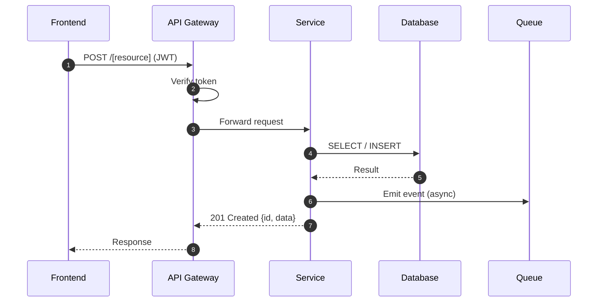
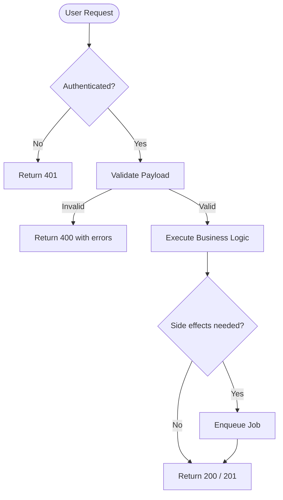
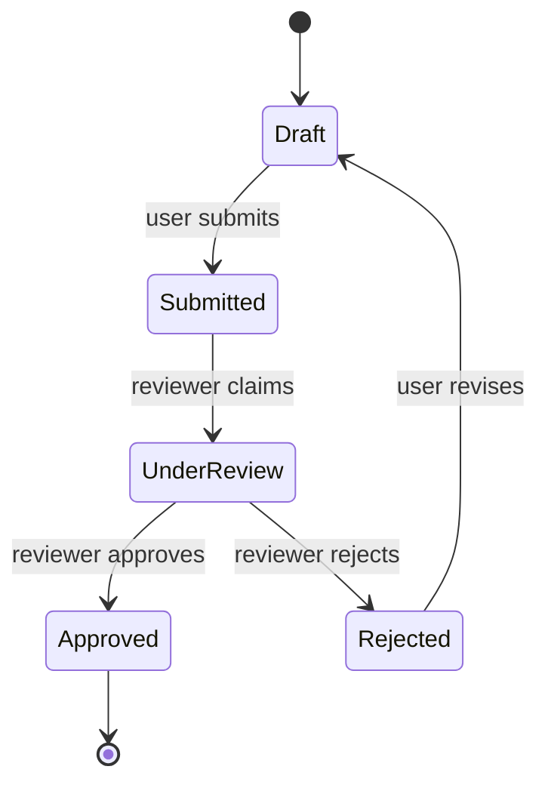
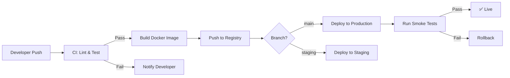

# Mermaid Diagram Templates

Use these templates for inline diagrams embedded in generated markdown documentation.
Choose the diagram type based on content — do not force a type.

---

## 1. Sequence Diagram — HTTP Request Lifecycle

Use for: request/response flows, service-to-service calls, async patterns.



---

## 2. Flowchart — High-Level Feature Data Flow

Use for: process flows, decision trees, validation pipelines.



---

## 3. Class / ER Diagram — Domain Model

Use for: entity relationships, database schemas, ORM models.

```mermaid
classDiagram
  class [Entity] {
    Int id
    String name
    DateTime createdAt
    DateTime? updatedAt
  }

  class [RelatedEntity] {
    Int id
    Int [entityId]
    String value
  }

  class [AuditLog] {
    Int id
    String action
    String actor
    DateTime timestamp
  }

  [Entity] "1" --> "many" [RelatedEntity] : has
  [Entity] "1" --> "many" [AuditLog] : produces
```

---

## 4. State Diagram — Entity Lifecycle

Use for: order states, document statuses, workflow transitions.



---

## 5. C4 Diagrams (C4-PlantUML — PlantUML, not Mermaid)

⚠️ **C4 diagrams use PlantUML syntax via C4-PlantUML, NOT Mermaid.**
Files use the `.puml` extension and are rendered by a PlantUML engine.
See `references/c4-plantuml-guide.md` for the full reference, macro catalog, and tooling setup.

### 5a — C4 Level 1: System Context

Use for: showing how the feature's system relates to users and external systems.
Import: `C4_Context.puml`

```plantuml
@startuml [Feature Name] — System Context
!include https://raw.githubusercontent.com/plantuml-stdlib/C4-PlantUML/master/C4_Context.puml

LAYOUT_WITH_LEGEND()

Person(user, "End User", "Uses the feature via browser or mobile app")
Person_Ext(admin, "Administrator", "Manages configuration")

System(system, "[Your System]", "Provides [feature] functionality")
System_Ext(auth, "Auth Provider", "Handles identity and tokens")
System_Ext(email, "Email Service", "Sends transactional emails")

Rel(user, system, "Uses", "HTTPS")
Rel(admin, system, "Configures", "HTTPS")
Rel(system, auth, "Validates tokens", "HTTPS/JWT")
Rel(system, email, "Sends emails via", "SMTP/API")
@enduml
```

### 5b — C4 Level 2: Container Diagram

Use for: showing internal containers (apps, DBs, queues) inside the system boundary.
Import: `C4_Container.puml`

```plantuml
@startuml [Feature Name] — Container Diagram
!include https://raw.githubusercontent.com/plantuml-stdlib/C4-PlantUML/master/C4_Container.puml

LAYOUT_WITH_LEGEND()

Person(user, "End User")
System_Ext(auth, "Auth Provider", "Identity & tokens")

System_Boundary(sys, "[Your System]") {
    Container(spa, "Web App", "React / TypeScript", "Browser-based UI")
    Container(api, "API Server", "Node.js / Express", "Handles business logic")
    ContainerDb(db, "Database", "PostgreSQL", "Stores feature data")
    ContainerQueue(queue, "Event Queue", "SQS / RabbitMQ", "Async job processing")
    Container(worker, "Worker", "Node.js", "Processes background jobs")
}

Rel(user, spa, "Uses", "HTTPS")
Rel(spa, auth, "Authenticates via", "HTTPS/OIDC")
Rel(spa, api, "Calls", "HTTPS/JSON")
Rel(api, db, "Reads/Writes", "TCP/SQL")
Rel(api, queue, "Enqueues jobs", "AMQP")
Rel(queue, worker, "Triggers", "AMQP")
Rel(worker, db, "Reads/Writes", "TCP/SQL")
@enduml
```

### 5c — C4 Level 3: Component Diagram

Use for: showing internal components within a single container (e.g. the API server).
Import: `C4_Component.puml`

```plantuml
@startuml [Feature Name] — Component Diagram
!include https://raw.githubusercontent.com/plantuml-stdlib/C4-PlantUML/master/C4_Component.puml

LAYOUT_WITH_LEGEND()

Container_Boundary(api, "API Server") {
    Component(router, "Feature Router", "Express Router", "Routes /[feature] requests")
    Component(ctrl, "Feature Controller", "TypeScript class", "Validates input, calls service")
    Component(svc, "Feature Service", "TypeScript class", "Executes business logic")
    Component(repo, "Feature Repository", "Prisma ORM", "Abstracts DB access")
    Component(events, "Event Publisher", "SQS SDK", "Publishes domain events")
}

ContainerDb(db, "Database", "PostgreSQL")
ContainerQueue(queue, "Event Queue", "SQS")
Container_Ext(auth, "Auth Middleware", "JWT validation")

Rel(router, auth, "Passes through")
Rel(router, ctrl, "Forwards request")
Rel(ctrl, svc, "Calls")
Rel(svc, repo, "Persists via")
Rel(svc, events, "Publishes via")
Rel(repo, db, "Reads/Writes", "SQL")
Rel(events, queue, "Sends to", "HTTPS")
@enduml
```

### 5d — C4 Deployment Diagram

Use for: showing how containers are deployed onto infrastructure.
Import: `C4_Deployment.puml`

```plantuml
@startuml [Feature Name] — Deployment Diagram
!include https://raw.githubusercontent.com/plantuml-stdlib/C4-PlantUML/master/C4_Deployment.puml

LAYOUT_WITH_LEGEND()

Deployment_Node(aws, "AWS Cloud", "Amazon Web Services") {
    Deployment_Node(vpc, "VPC") {
        Deployment_Node(ecs, "ECS Cluster", "AWS ECS / Fargate") {
            Container(api, "API Service", "Node.js 20", "Autoscaled task")
            Container(worker, "Worker Service", "Node.js 20", "SQS consumer")
        }
        Deployment_Node(rds_node, "RDS", "AWS RDS") {
            ContainerDb(db, "PostgreSQL", "v15", "Multi-AZ")
        }
    }
    Deployment_Node(sqs_node, "SQS", "AWS SQS") {
        ContainerQueue(queue, "Job Queue", "Standard queue")
    }
}

Rel(api, db, "Reads/Writes", "TCP 5432")
Rel(api, queue, "Enqueues", "HTTPS")
Rel(worker, queue, "Polls", "HTTPS")
Rel(worker, db, "Reads/Writes", "TCP 5432")
@enduml
```

---

## 6. Git / Deployment Flow

Use for: CI/CD pipelines, deployment sequences.



---

## Placement Rules

- **Sequence diagrams** → place after the "Data Flow" section.
- **Flowcharts** → place after the "Feature Overview" or "Data Flow" section.
- **Class/ER diagrams** → place after the "Domain Model" section.
- **State diagrams** → place after the "Domain Model" or relevant entity section.
- **C4 diagrams** → place in the "Architecture Diagram" section; use the level appropriate to the documentation scope (L1 for system overview, L2 for feature containers, L3 for internal components). Rendered as PNG/SVG by PlantUML — reference the output image in the markdown.
- Always add a one-sentence caption below each diagram explaining what it shows.
