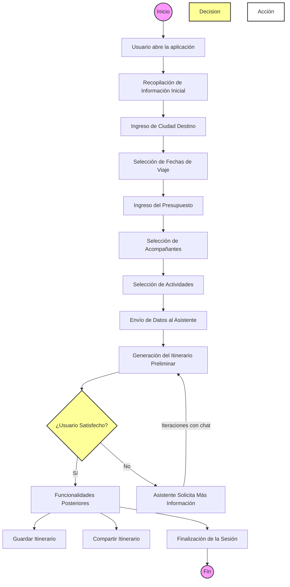

```mermaid  
flowchart TD
    style Inicio fill:#f9f,stroke:#333,stroke-width:2px
    style Fin fill:#f9f,stroke:#333,stroke-width:2px
    style Decision1 fill:#ff9,stroke:#333,stroke-width:2px,shape:diamond
    style Decision fill:#ff9,stroke:#333,stroke-width:2px
    style Acción fill:#FFF,stroke:#333,stroke-width:2px

    %% Inicio
    Inicio((Inicio))
    Inicio --> A[Usuario abre la aplicación]

    %% Recopilación de Información Inicial
    A --> B[Recopilación de Información Inicial]
    B --> B1[Ingreso de Ciudad Destino]
    B1 --> B2[Selección de Fechas de Viaje]
    B2 --> B3[Ingreso del Presupuesto]
    B3 --> B4[Selección de Acompañantes]
    B4 --> B5[Selección de Actividades]

    %% Envío de Datos al Asistente
    B5 --> C[Envío de Datos al Asistente]

    %% Generación del Itinerario Preliminar
    C --> D[Generación del Itinerario Preliminar]
    D --> Decision1{¿Usuario Satisfecho?}

    %% Decisión sobre información suficiente
    Decision1 -->|Sí| H[Funcionalidades Posteriores]
    Decision1 -->|No| F[Asistente Solicita Más Información]
    F --> |Iteraciones con chat| D

    %% Funcionalidades Posteriores
    H --> H1[Guardar Itinerario]
    H --> H2[Compartir Itinerario]

    %% Finalización de la Sesión
    H --> M[Finalización de la Sesión]
    M --> Fin((Fin))
```