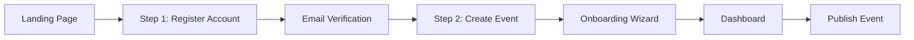
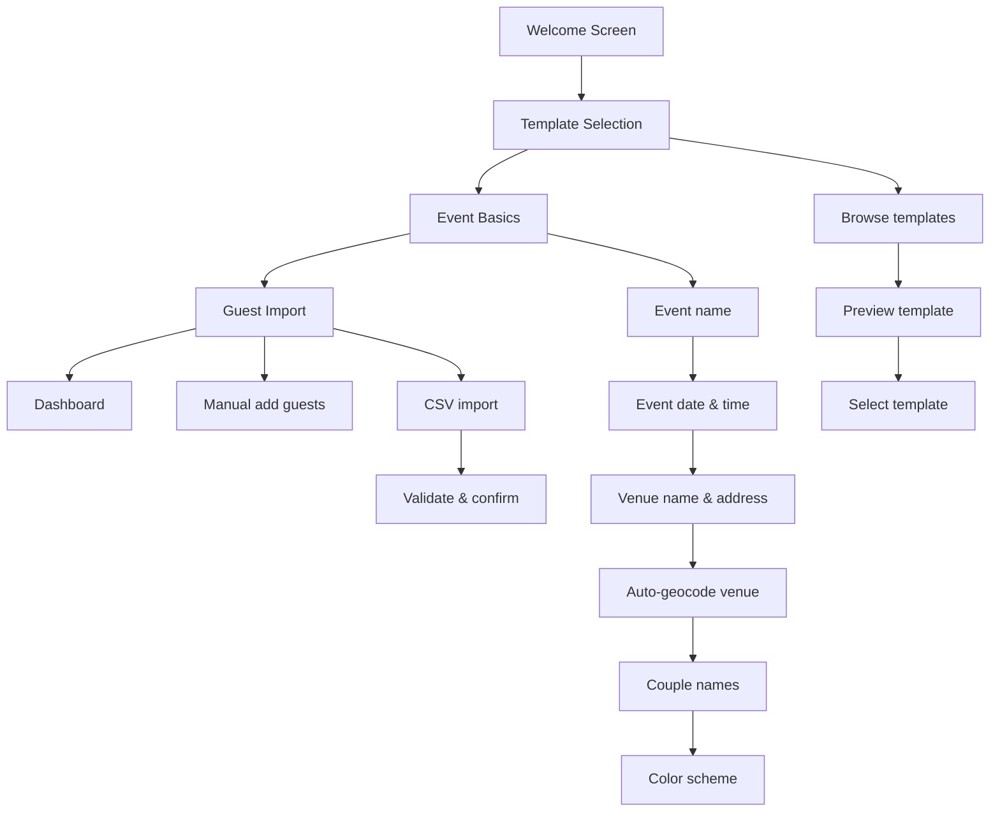

# Product Requirements Document (PRD)
# Aura Planning — Digital Invitations & Real-Time Event Storytelling

> **Version:** 1.0  
> **Date:** June 8, 2026  
> **Author:** Senior Product Manager  
> **Status:** Draft — Internal Review  
> **Source:** `business-documentation/Aura.MD` + Technical Architecture Analysis  
> **Audience:** Engineering, Design, Product, Leadership

---

## Table of Contents

1. [Executive Summary](#1-executive-summary)
2. [Problem Statement & Opportunity](#2-problem-statement--opportunity)
3. [User Personas](#3-user-personas)
4. [Product Vision & Strategy](#4-product-vision--strategy)
5. [Registration & Onboarding](#5-registration--onboarding)
6. [MVP Feature Specification](#6-mvp-feature-specification)
7. [Work Breakdown by Discipline](#7-work-breakdown-by-discipline)
8. [Success Metrics & KPIs](#8-success-metrics--kpis)
9. [Risks, Assumptions & Dependencies](#9-risks-assumptions--dependencies)
10. [Rollout Plan](#10-rollout-plan)
11. [Appendix](#11-appendix)

---

## 1. Executive Summary

### 1.1 What We're Building

**Aura Planning** is a SaaS platform that replaces paper wedding invitations with an interactive digital ecosystem. It combines three core capabilities:

1. **Design** — Beautiful, customizable invitation templates requiring no design skills
2. **Logistics** — Centralized guest management, RSVP tracking, dietary/transport coordination
3. **Communication** — Multi-channel invitations (email + WhatsApp) with automated reminders and a **Live Guest Journey** — real-time event-day storytelling managed by a trusted "accomplice"

**Slogan:** *"Design your event's narrative, manage the logistics effortlessly."*

### 1.2 Why It Matters

| Problem | Current State | Aura's Solution |
|---------|--------------|-----------------|
| Paper invitations cost €800–1,200 for 120 guests | Design + print + postage | One-time €29.99 payment — 97% cost savings |
| RSVP tracking via WhatsApp/phone is chaotic | Spreadsheets, lost messages | Real-time dashboard with dietary/transport tracking |
| Guests lack real-time event updates | Missed moments, constant questions | Live narrative via WhatsApp managed by an accomplice |
| Couples manage logistics on their wedding day | Stress, distraction from celebration | Accomplice handles all guest communication |

### 1.3 Key Differentiator

The **Live Guest Journey** — a WhatsApp-powered real-time storytelling feature — is our killer feature. No competitor (Zankyou, Bodas.net, WithJoy, Joy) offers this. It targets the hype and immediacy demanded by Millennials and Gen Z, while ensuring the couple can enjoy their day without technical distractions.

### 1.4 Business Model

| Tier | Price | Features |
|------|-------|----------|
| **Free (Draft)** | €0 | Full design access, 5 guests, no publishing |
| **Standard Publish** | €19 | Unlimited guests, static site, email invitations, RSVP tracking |
| **Premium Publish** | €29 | Standard + WhatsApp invitations + Live Guest Journey + Calendar sync |
| **Gift Registry** (V3) | 2% platform fee | Cash gifts via Stripe Connect |

**Strategy:** "Try-before-you-buy" (IKEA Effect). Users invest time configuring their event for free, creating high switching friction. Once invested, they prefer to pay rather than start elsewhere.

### 1.5 MVP Scope

The MVP delivers a complete digital invitation lifecycle:

```
Register → Create Event → Design → Add Guests → Pay → Publish → Guests RSVP → Track
```

**Target launch:** 8-week development timeline  
**Initial market:** Spain (Spanish language), weddings only  
**Future:** LATAM expansion, English language, other celebration types (V3)

---

## 2. Problem Statement & Opportunity

### 2.1 Core Problem

**For Couples (Hosts):**
Planning a wedding involves massive logistical overhead. Invitations alone require design decisions, printing costs, postage, address collection, and RSVP tracking — all while couples are already stressed with venue, catering, and vendor coordination. Paper invitations are expensive (€800–1,200 for 120 guests), environmentally wasteful, and provide zero real-time tracking. On the wedding day itself, couples are bombarded with guest questions about venue directions, schedule changes, and logistics — distracting them from their own celebration.

**For Guests:**
Receiving paper invitations means manually entering event details into calendars, searching for venue directions, and figuring out how to RSVP (call? text? email?). On the event day, guests miss key moments because they don't know when things are happening ("Is the ceremony starting?" "Where should I go next?").

### 2.2 Why Now?

| Trend | Evidence | Impact |
|-------|----------|--------|
| **Digital-first weddings** | 73% of couples under 35 prefer digital invitations (WeddingWire 2025) | Market ready for disruption |
| **WhatsApp dominance** | 93% of Spanish adults use WhatsApp daily | Perfect channel for live updates |
| **Eco-consciousness** | 68% of Millennials consider environmental impact in wedding planning | Digital = sustainable advantage |
| **Post-pandemic expectations** | Guests expect real-time communication and mobile-first experiences | Paper feels outdated |
| **SaaS adoption** | Couples already use digital tools for venue booking, registries, seating charts | Low friction to adopt new tool |

### 2.3 Market Size

| Metric | Definition | Estimate |
|--------|-----------|----------|
| **TAM** (Total Addressable Market) | Global wedding tech market (invitations, planning, registry) | **$18.5B** by 2028 (CAGR 6.2%) |
| **SAM** (Serviceable Addressable Market) | Digital wedding invitation market in Spanish-speaking countries (Spain + LATAM) | **$420M** (~1.2M weddings/year × $350 avg digital invitation spend) |
| **SOM** (Serviceable Obtainable Market) | Realistic Year 1–3 capture in Spain (primary market) | **$2.1M** Year 3 (~60K weddings/year × 3.5% penetration × €10 avg revenue) |

**Spain Wedding Market Context:**
- ~60,000 weddings per year (INE data)
- Average wedding budget: €25,000–35,000
- Invitation budget: 3–5% of total = €750–1,750 (paper)
- Digital alternative at €19–29 = 97% cost savings

### 2.4 Competitive Landscape

| Competitor | Strengths | Weaknesses | Aura's Advantage |
|-----------|-----------|------------|------------------|
| **Zankyou** (Spain/LATAM) | Market leader in Spain; full wedding suite; vendor marketplace | Bloated UI; slow; no real-time communication; subscription model | Simpler, faster, WhatsApp-native, one-time payment |
| **Bodas.net** (Spain) | Strong SEO; vendor directory; large user base | Outdated UX; no live features; paper-invitation mindset | Modern UX; Live Guest Journey; mobile-first |
| **WithJoy / Joy** (US/Global) | Beautiful templates; free tier; registry integration | English-only; no WhatsApp; no live event features | Spanish-first; WhatsApp integration; real-time storytelling |
| **Paperless Post** (US) | Premium designs; brand partnerships | Expensive per-invitation; no event management; no RSVP tracking | All-in-one platform; logistics + design + communication |
| **Greenvelope** (US) | Eco-friendly positioning; good templates | No WhatsApp; no live features; subscription model | One-time payment; WhatsApp-native; Live Guest Journey |

### 2.5 Competitive Positioning

```
                    High Logistics
                         │
              Zankyou    │    Aura Planning
              Bodas.net  │    (Live + WhatsApp)
                         │
    ─────────────────────┼────────────────────
                         │
              Paperless  │    WithJoy
              Post       │    Joy
                         │
                    Low Logistics
         ←─── Design Focus ───┼─── Experience Focus ───→
```

**Aura's White Space:** High logistics + high experience (real-time communication). No competitor currently owns this space.

---

## 3. User Personas

### 3.1 Persona 1: María & Juan — The Couple (Host)

| Attribute | Detail |
|-----------|--------|
| **Age** | 29 & 31 |
| **Location** | Madrid, Spain |
| **Occupation** | María: Marketing Manager; Juan: Software Engineer |
| **Tech Savviness** | High — both use smartphones daily, comfortable with SaaS |
| **Wedding Budget** | €28,000 |
| **Guest Count** | 120 |

#### Jobs-to-be-Done
1. *"Help us create beautiful invitations without hiring a designer"*
2. *"Let us track who's coming so we can plan seating and catering"*
3. *"Keep our guests informed on the wedding day without us having to manage it"*
4. *"Save money compared to paper invitations"*

#### Pain Points
- Paper invitations cost €800–1,200 for 120 guests (design + print + postage)
- Tracking RSVPs via WhatsApp/phone is chaotic and error-prone
- Guests constantly ask for venue directions and schedule details
- Couple wants to enjoy their day, not manage logistics

#### Success Criteria
- Invitations designed and sent in under 2 hours
- All RSVPs tracked in one dashboard
- Zero guest questions about logistics on the wedding day
- Total cost under €50 (vs. €1,000+ for paper)
- Guests feel excited and informed throughout the experience

#### User Stories
| ID | Story | Priority |
|----|-------|----------|
| US-H-01 | As a host, I want to select and customize an invitation template so that I can create a beautiful invitation without design skills | Must |
| US-H-02 | As a host, I want to import guests from a CSV file so that I can quickly add my guest list | Must |
| US-H-03 | As a host, I want to see real-time RSVP statistics so that I can plan catering and seating | Must |
| US-H-04 | As a host, I want to send invitations via email and WhatsApp so that guests receive them on their preferred channel | Should |
| US-H-05 | As a host, I want to designate an accomplice who can send live updates on the wedding day so that I can enjoy my day | Should |
| US-H-06 | As a host, I want to see which guests have dietary restrictions so that I can coordinate with the caterer | Must |
| US-H-07 | As a host, I want to send automated reminders to guests who haven't RSVP'd so that I don't have to follow up manually | Should |

---

### 3.2 Persona 2: Carlos — The Guest

| Attribute | Detail |
|-----------|--------|
| **Age** | 30 |
| **Location** | Barcelona, Spain |
| **Occupation** | Architect |
| **Tech Savviness** | Medium-High — uses WhatsApp daily, comfortable with web forms |
| **Relationship to Couple** | College friend of Juan |

#### Jobs-to-be-Done
1. *"Let me quickly RSVP without creating an account"*
2. *"Show me the venue location and how to get there"*
3. *"Let me add the event to my calendar with one click"*
4. *"Keep me updated on the wedding day so I don't miss anything"*

#### Pain Points
- Hates creating accounts for one-time interactions
- Often forgets event details after RSVPing
- Misses real-time updates (e.g., "ceremony starting now")
- Doesn't want to download an app for a single event

#### Success Criteria
- RSVP completed in under 60 seconds on mobile
- Venue directions accessible with one tap
- Event added to calendar automatically
- Receives timely WhatsApp updates on the day
- No app download required

#### User Stories
| ID | Story | Priority |
|----|-------|----------|
| US-G-01 | As a guest, I want to RSVP via a mobile-friendly form without creating an account so that I can respond quickly | Must |
| US-G-02 | As a guest, I want to see the venue on a map with directions so that I know how to get there | Must |
| US-G-03 | As a guest, I want to add the event to my calendar with one click so that I don't forget | Should |
| US-G-04 | As a guest, I want to receive live updates via WhatsApp on the event day so that I don't miss key moments | Should |
| US-G-05 | As a guest, I want to indicate my dietary restrictions so that the hosts can accommodate me | Must |
| US-G-06 | As a guest, I want to indicate if I need transportation so that the hosts can arrange it | Must |

---

### 3.3 Persona 3: Laura — The Accomplice

| Attribute | Detail |
|-----------|--------|
| **Age** | 28 |
| **Location** | Madrid, Spain |
| **Occupation** | Graphic Designer |
| **Tech Savviness** | High — early adopter, comfortable with new tools |
| **Relationship to Couple** | Maria's maid of honor |

#### Jobs-to-be-Done
1. *"Let me send live updates to guests on behalf of the couple"*
2. *"Make it impossible to accidentally send the wrong message"*
3. *"Give me a simple interface I can use while at the wedding"*
4. *"Let me access everything without remembering a password"*

#### Pain Points
- Couple is busy; guests keep asking Laura for updates
- Accidentally sending wrong messages would be embarrassing
- Needs to work on mobile while moving around the venue
- Doesn't want to manage another password

#### Success Criteria
- Access accomplice panel via magic link (no password)
- Send pre-configured messages with one swipe
- Zero accidental sends
- Works perfectly on mobile in any lighting condition
- Can see which messages have been delivered

#### User Stories
| ID | Story | Priority |
|----|-------|----------|
| US-A-01 | As an accomplice, I want to access my panel via a magic link so that I don't need to create a password | Must |
| US-A-02 | As an accomplice, I want to send pre-configured live messages with a swipe gesture so that I can't accidentally send them | Must |
| US-A-03 | As an accomplice, I want to see which messages have been delivered so that I know guests received updates | Should |
| US-A-04 | As an accomplice, I want to view the RSVP summary so that I can answer guest questions | Should |

---

### 3.4 Persona 4: Elena — The Wedding Planner (Future V3)

| Attribute | Detail |
|-----------|--------|
| **Age** | 35 |
| **Location** | Valencia, Spain |
| **Occupation** | Independent Wedding Planner |
| **Tech Savviness** | Medium — uses planning software but prefers simplicity |
| **Client Load** | 15–20 weddings per year |

#### Jobs-to-be-Done
1. *"Let me manage multiple couples' invitations from one dashboard"*
2. *"Give my clients a professional-looking invitation without me designing it"*
3. *"Track RSVPs across all my events in one place"*
4. *"Charge my clients for the invitation service as part of my package"*

#### Pain Points
- Currently uses different tools for each couple
- Spends 5–10 hours per couple on invitation logistics
- Clients expect digital solutions but she lacks the tools
- No unified view of all her events

#### Success Criteria (V3)
- Multi-event dashboard
- White-label option (planner's branding)
- Bulk operations across events
- Client billing integration
- Time savings: 50% reduction in invitation management time

> **Note:** This persona is out of scope for MVP. Architecture should be designed to support multi-event management in the future.

---

## 4. Product Vision & Strategy

### 4.1 North Star Metric

**"Number of guests who receive a live WhatsApp update on their event day"**

This metric captures the essence of our differentiation: real-time event storytelling. It aligns all teams toward delivering the Live Guest Journey experience.

### 4.2 Product Vision

> *Aura Planning becomes the default way couples create, manage, and share their celebration narrative — from the first invitation to the last dance.*

### 4.3 MVP Scope Boundaries

#### In Scope (MVP)
- User registration with magic links (passwordless)
- Event creation and management (single owner)
- Template editor (3 preset templates, basic customization)
- Guest manager (manual entry + CSV import, categories)
- RSVP form with dietary/transport needs
- Static site generation for guest microsites (JAMstack)
- Publishing paywall (Stripe one-time payment)
- Free mode with 5-guest limit for testing
- Email invitations via Gmail SMTP
- WhatsApp invitations via Meta Cloud API
- Automated reminders for non-responders
- Google Maps integration (embed + directions)
- Calendar sync (Google Calendar, Apple Calendar)
- Accomplice Mode with magic link access
- Live notification buttons with swipe-to-confirm
- Post-event thank you automation (email/WhatsApp)
- 30-day automated data deletion

#### Out of Scope (MVP)
- Photo upload by guests (V3)
- Corporate events, birthdays, baptisms (V3)
- Vendor/Planner dashboard (V3+)
- Multi-event management (V2)
- Custom domain support (V2)
- Gift registry / cash fund (V3)
- Seating chart builder (V2)
- Multi-language (English) (V2)
- Co-host / shared event ownership (V2)

### 4.4 Growth Roadmap

| Version | Timeline | Focus | Key Features |
|---------|----------|-------|--------------|
| **V1 (MVP)** | Weeks 1-8 | Weddings, Spain | Core invitation lifecycle, RSVP, email + WhatsApp, accomplice mode |
| **V1.1** | Weeks 9-12 | Optimization | Reminder automation, calendar sync, thank you cards, analytics |
| **V2** | Months 4-6 | Scale | Multi-event, co-hosts, custom domains, English language, seating charts |
| **V3** | Months 7-12 | Diversification | Gift registry, photo uploads, corporate events, planner dashboard |

### 4.5 Differentiation Strategy

| Dimension | Competitors | Aura |
|-----------|------------|------|
| **Pricing** | Subscription or per-invitation | One-time payment (EUR 19-29) |
| **Communication** | Email only | Email + WhatsApp (primary) |
| **Live Experience** | None | Real-time narrative via accomplice |
| **Architecture** | Server-rendered | JAMstack static sites (fast, cheap) |
| **Data Privacy** | Indefinite retention | 30-day auto-deletion |
| **Target Audience** | All ages | Millennials/Gen Z (mobile-first) |

---

## 5. Registration & Onboarding

### 5.1 Overview

Aura uses a **two-step flow**: Register Account -> Create Event. This minimizes friction by separating authentication from event creation, allowing users to focus on one task at a time.



### 5.2 Registration Flow

#### 5.2.1 Step 1: Email Capture & Magic Link

| Step | Action | System Response |
|------|--------|-----------------|
| 1 | User enters email on landing page | Frontend validates email format |
| 2 | User clicks "Continue" | `POST /api/auth/magic-link` with email |
| 3 | System checks if user exists | If new: creates User record (status=pending). If existing: updates LastLogin |
| 4 | System generates magic link token | 15-minute expiry, stored hashed in DB |
| 5 | System sends email via Gmail SMTP | Personalized email with magic link button |
| 6 | Frontend shows confirmation | "Check your email for your access link" |

**Rate Limiting:** 3 magic link requests per email per hour (429 response on exceed)

**Security:** Same response for new and existing users (prevents email enumeration)

#### 5.2.2 Step 2: Email Verification & Profile Setup

| Step | Action | System Response |
|------|--------|-----------------|
| 1 | User clicks magic link in email | Browser opens verification URL |
| 2 | Frontend calls `GET /api/auth/verify?token={token}` | System validates token, checks expiry |
| 3 | Token valid | System updates User status to active, generates 24-hour JWT, returns `isFirstLogin: true` |
| 4 | Token expired/invalid | System returns 401 with "Link expired" message, offers resend |
| 5 | First login detected | Frontend shows profile setup modal |
| 6 | User enters name, accepts terms, opts into marketing | `POST /api/auth/profile` saves profile |
| 7 | Profile saved | User redirected to onboarding wizard |

**Profile Setup Fields:**

| Field | Required | Validation |
|-------|----------|-----------|
| Name | Yes | 2-100 characters |
| Terms acceptance | Yes | Checkbox, version tracked |
| Marketing consent | No | Opt-in checkbox |
| Timezone | Yes | Auto-detected, editable |
| Locale | Yes | Default: es-ES |

#### 5.2.3 Account Recovery

The account recovery flow is identical to registration — the user enters their email and receives a new magic link. Key differences:

- Old tokens are invalidated when a new one is requested
- Session JWT is invalidated on new login (single session per user)
- Same rate limiting applies (3 requests/hour)
- Same anti-enumeration response (no indication of whether email exists)

**Resend Magic Link:** Available on the verification page with a 60-second cooldown timer.

### 5.3 Onboarding Wizard

After profile setup, first-time users enter a guided onboarding wizard:



#### Wizard Step Details

**Step 1: Template Selection**
- Fetch templates: `GET /api/templates?category=wedding&isPremium=false`
- Display template grid with live previews
- User selects one of 3 preset templates
- Selection stored in session

**Step 2: Event Basics**
- Create event: `POST /api/events` with name, date, venue, template, colors
- System auto-generates URL-safe slug (e.g., `maria-y-juan-2026`)
- System auto-geocodes venue address via Google Maps API
- System creates `DataRetentionJob` (EventDate + 30 days)
- Event created with status `draft`

**Step 3: Guest Import (Optional)**
- User can skip this step and add guests later
- Manual add: name, email, phone, category
- CSV import: validate, preview, confirm
- Draft mode: max 5 guests enforced

**Completion:** User is redirected to the event dashboard with a success message and guided tour.

### 5.4 User Stories & Acceptance Criteria

| ID | User Story | Acceptance Criteria (Given/When/Then) |
|----|-----------|--------------------------------------|
| US-R-01 | As a new user, I want to register with just my email so that I can start using Aura without creating a password | **Given** I am on the landing page, **When** I enter a valid email and click "Continue", **Then** I see "Check your email" and receive a magic link within 30 seconds |
| US-R-02 | As a user, I want my magic link to expire after 15 minutes so that my account stays secure | **Given** I received a magic link, **When** I click it after 16 minutes, **Then** I see "Link expired" with an option to request a new one |
| US-R-03 | As a user, I want to set up my profile on first login so that my account is personalized | **Given** I clicked a valid magic link for the first time, **When** I enter my name and accept terms, **Then** my profile is saved and I'm redirected to the onboarding wizard |
| US-R-04 | As a user, I want to resend a magic link if I didn't receive it so that I can complete registration | **Given** I requested a magic link, **When** I click "Resend" after 60 seconds, **Then** a new magic link is sent and the old one is invalidated |
| US-R-05 | As a returning user, I want to log in with the same email so that I can access my existing events | **Given** I have an existing account, **When** I enter my email and click "Continue", **Then** I receive a magic link and can access my dashboard |

### 5.5 Edge Cases

| Scenario | Handling |
|----------|----------|
| User enters invalid email format | Inline validation prevents submission |
| User requests 4th magic link within 1 hour | 429 response with "Please wait 20 minutes" message |
| Magic link email goes to spam | "Check spam folder" hint; resend option after 60s |
| User closes browser before clicking magic link | Link remains valid for 15 minutes; user can request new one |
| User tries to register with existing email | Same flow as login (no differentiation in response) |
| User skips onboarding wizard | Can access wizard later from dashboard; event remains in draft |
| User creates event without selecting template | Default template applied; can change later |
| Venue address cannot be geocoded | Event created without coordinates; user can update manually |

### 5.6 DECISION NEEDED: Accomplice Onboarding Flow

**Question:** How does an accomplice get onboarded? Do they need to create a full Aura account, or is their access purely event-scoped via magic link?

**Options:**
- **A.** Accomplice receives magic link -> accesses panel directly (no account needed)
- **B.** Accomplice receives magic link -> prompted to create account -> accesses panel
- **C.** Accomplice receives magic link -> creates lightweight profile (name only) -> accesses panel

**Recommendation:** Option A for MVP. Accomplices are one-time users tied to a single event. Forcing account creation adds friction. Option B/C can be evaluated for V2 if accomplices become repeat users.

---

## 6. MVP Feature Specification

### 6.1 Host Management Panel

#### 6.1.1 Template Editor

**Description:** A visual tool for customizing invitation templates. Users select from 3 preset templates and customize colors, typography, and hero images.

**Scope (MVP):**
- 3 preset wedding templates
- Customization: primary color, secondary color, font family, hero image upload
- Real-time preview
- Auto-save (2-second debounce)
- No drag-and-drop, no custom HTML/CSS

**User Stories:**

| ID | Story | Priority |
|----|-------|----------|
| US-T-01 | As a host, I want to select from preset templates so that I can start designing quickly | Must |
| US-T-02 | As a host, I want to customize colors so that the invitation matches my wedding theme | Must |
| US-T-03 | As a host, I want to change the font so that the invitation reflects my style | Must |
| US-T-04 | As a host, I want to upload a hero image so that the invitation is personal | Must |
| US-T-05 | As a host, I want to see changes in real-time so that I know how the invitation will look | Must |

**Acceptance Criteria:**

| # | Scenario | Given | When | Then |
|---|----------|-------|------|------|
| AC-T-01 | Select template | User is in the template editor | User selects one of 3 preset templates | Preview updates immediately; template is applied to the event |
| AC-T-02 | Customize colors | User has a template selected | User changes the primary color using a color picker | Preview updates in real-time; color is auto-saved |
| AC-T-03 | Customize typography | User has a template selected | User selects a different font family from the dropdown | Preview updates; font is auto-saved |
| AC-T-04 | Upload hero image | User has a template selected | User uploads an image file (JPG/PNG, max 5MB) | Image is uploaded, cropped to fit template, and displayed in preview |
| AC-T-05 | Auto-save | User makes any customization | User waits 2 seconds without further changes | Changes are saved to the database; UI shows "Saved" indicator |

**Edge Cases:**
- Image upload exceeds 5MB -> error message with size limit
- Image format not supported (e.g., .bmp) -> error with supported formats list
- Color picker returns invalid hex -> fallback to last valid color
- Network interruption during auto-save -> retry with offline indicator
- User navigates away before auto-save triggers -> force save on navigation

---

#### 6.1.2 Guest Manager

**Description:** Bulk import (CSV) and manual entry of guests with segmentation by category (family, friends, colleagues, other).

**Scope (MVP):**
- Manual guest entry: name, email, phone, category
- CSV import with validation and error preview
- Guest categorization (family, friends, colleagues, other)
- Guest list with search, filter, and pagination
- Free mode: max 5 guests (draft events)
- Published mode: unlimited guests

**User Stories:**

| ID | Story | Priority |
|----|-------|----------|
| US-GM-01 | As a host, I want to add guests manually so that I can build my guest list | Must |
| US-GM-02 | As a host, I want to import guests from a CSV file so that I can add many guests at once | Must |
| US-GM-03 | As a host, I want to categorize guests so that I can organize my list | Must |
| US-GM-04 | As a host, I want to see validation errors before importing so that I can fix them | Must |
| US-GM-05 | As a host, I want to search and filter my guest list so that I can find specific guests | Should |
| US-GM-06 | As a host, I want to delete guests so that I can correct mistakes | Must |

**Acceptance Criteria:**

| # | Scenario | Given | When | Then |
|---|----------|-------|------|------|
| AC-GM-01 | Add guest manually | User is on the guest manager page | User fills in name, email, phone, category and clicks "Add" | Guest is added to the list; appears in the guest table |
| AC-GM-02 | Import valid CSV | User has a CSV with columns: name, email, phone, category | User uploads the CSV | System validates all rows; shows preview with guest count; user confirms import; guests are added |
| AC-GM-03 | Import CSV with errors | User has a CSV with some invalid emails and missing names | User uploads the CSV | System highlights error rows; shows error messages; user can fix and re-upload or skip invalid rows |
| AC-GM-04 | Free mode limit | User is in free (unpublished) mode with 5 guests | User tries to add a 6th guest | System blocks the action; shows upgrade prompt: "Publish your event to add unlimited guests" |
| AC-GM-05 | Categorize guests | User has guests in the list | User filters by category (family/friends/work) | Only guests in that category are displayed |
| AC-GM-06 | Delete guest | User has a guest in the list | User clicks "Delete" and confirms | Guest is soft-deleted; removed from the list |

**Edge Cases:**
- CSV with duplicate emails -> deduplicated, warning shown
- CSV with missing required columns -> error with expected format
- Guest email already exists in event -> duplicate warning, option to skip or update
- Free mode limit reached during CSV import -> import blocked with upgrade prompt
- Large CSV (1000+ rows) -> progress indicator, background processing

---

#### 6.1.3 Control Dashboard

**Description:** Real-time tracking of RSVPs, no-shows, dietary restrictions, allergens, and transportation needs.

**Scope (MVP):**
- RSVP statistics: total invited, confirmed, declined, pending, maybe
- Dietary restrictions list (aggregated from RSVPs)
- Transportation needs count
- Plus-one count
- Guest list with RSVP status
- Export guest list as CSV

**User Stories:**

| ID | Story | Priority |
|----|-------|----------|
| US-CD-01 | As a host, I want to see real-time RSVP statistics so that I can track responses | Must |
| US-CD-02 | As a host, I want to see which guests have dietary restrictions so that I can coordinate with the caterer | Must |
| US-CD-03 | As a host, I want to see who needs transportation so that I can arrange it | Must |
| US-CD-04 | As a host, I want to export my guest list so that I can share it with vendors | Should |
| US-CD-05 | As a host, I want to see who hasn't responded so that I can follow up | Must |

**Acceptance Criteria:**

| # | Scenario | Given | When | Then |
|---|----------|-------|------|------|
| AC-CD-01 | View RSVP stats | Host is on the event dashboard | Host views the RSVP section | Dashboard shows: total invited, confirmed, declined, pending, dietary restrictions list, transport needs count |
| AC-CD-02 | Real-time update | A guest submits an RSVP | Host is viewing the dashboard | Dashboard stats update within 5 seconds (no manual refresh) |
| AC-CD-03 | View dietary restrictions | Host clicks "Dietary Restrictions" | System displays the list | List shows guest name and their dietary restrictions |
| AC-CD-04 | Export guest list | Host clicks "Export CSV" | System generates and downloads a CSV file | CSV contains: name, email, phone, category, RSVP status, dietary restrictions, transport needs |
| AC-CD-05 | Filter by RSVP status | Host filters by "Pending" | System updates the guest list | Only guests who haven't responded are displayed |

**Edge Cases:**
- No guests added yet -> empty state with "Add guests to get started"
- No RSVPs received yet -> stats show all zeros with "Waiting for responses"
- Guest updates RSVP -> stats update, previous response replaced
- RSVP submitted after event date -> accepted but flagged as "late"

---

### 6.2 Guest Microsite

#### 6.2.1 Static JAMstack Site

**Description:** Ultra-fast, mobile-first invitation page served via CDN. No app download required.

**Scope (MVP):**
- Static HTML/CSS/JS generated per published event
- Served via CDN (Cloudflare)
- Mobile-first responsive design
- Load time < 2 seconds on mobile 3G
- Lighthouse performance score > 90
- Event details: couple names, date, venue, schedule
- Embedded Google Maps venue
- RSVP link (token-based)
- Add-to-calendar buttons (Google Calendar, Apple Calendar)
- Directions links (Google Maps / Waze deep links)

**User Stories:**

| ID | Story | Priority |
|----|-------|----------|
| US-MS-01 | As a guest, I want to view the invitation on my mobile browser so that I don't need to download an app | Must |
| US-MS-02 | As a guest, I want the page to load quickly so that I can see the details immediately | Must |
| US-MS-03 | As a guest, I want to see the venue on a map so that I know where to go | Must |
| US-MS-04 | As a guest, I want to get directions with one tap so that I can navigate easily | Must |
| US-MS-05 | As a guest, I want to add the event to my calendar so that I don't forget | Should |

**Acceptance Criteria:**

| # | Scenario | Given | When | Then |
|---|----------|-------|------|------|
| AC-MS-01 | Load microsite | Event is published | Guest navigates to `aura.planning/e/{slug}` | Static site loads with event details, venue map, RSVP link |
| AC-MS-02 | Mobile responsiveness | Guest accesses the microsite on a mobile device | Guest views the page | Site is fully responsive; all elements are readable and tappable |
| AC-MS-03 | Performance | Guest accesses the microsite on mobile 3G | Page loads | Total load time is under 2 seconds; Lighthouse performance score > 90 |
| AC-MS-04 | Venue map | Guest views the microsite | Guest scrolls to the venue section | Google Maps embed shows the venue location |
| AC-MS-05 | Directions link | Guest clicks "Get Directions" | Browser opens | Google Maps or Waze app opens with the venue as destination |
| AC-MS-06 | Calendar sync | Guest clicks "Add to Calendar" | System generates | .ics file downloads or Google Calendar link opens with event details pre-filled |
| AC-MS-07 | Update after edit | Host updates event details after publishing | Host saves changes | Static site is regenerated; CDN cache is invalidated; new content is visible within 1 hour |

**Edge Cases:**
- Event not published -> 404 page with "This event is not yet available"
- Event deleted -> 404 page with "This event is no longer available"
- Invalid slug -> 404 page
- CDN cache miss during regeneration -> fallback to previous version or loading state
- Google Maps API quota exceeded -> static map image fallback

---

#### 6.2.2 Smart RSVP Form

**Description:** Mobile-optimized form for guests to respond to invitations. No account required.

**Scope (MVP):**
- Token-based access (unique per guest)
- Attendance: Yes / No / Maybe
- Dietary restrictions (free text)
- Transportation needs (checkbox)
- Plus-one (checkbox)
- Personal message to hosts (optional, free text)
- RSVP deadline (7 days before event)
- Confirmation page after submission
- Ability to update RSVP before deadline

**User Stories:**

| ID | Story | Priority |
|----|-------|----------|
| US-RSVP-01 | As a guest, I want to RSVP without creating an account so that I can respond quickly | Must |
| US-RSVP-02 | As a guest, I want to indicate my dietary restrictions so that the hosts can accommodate me | Must |
| US-RSVP-03 | As a guest, I want to indicate if I need transportation so that the hosts can arrange it | Must |
| US-RSVP-04 | As a guest, I want to update my RSVP before the deadline so that I can change my plans | Must |
| US-RSVP-05 | As a guest, I want to see a confirmation after submitting so that I know my response was received | Must |

**Acceptance Criteria:**

| # | Scenario | Given | When | Then |
|---|----------|-------|------|------|
| AC-RSVP-01 | Guest accesses RSVP | Guest receives an invitation link | Guest clicks the link | System displays the event details and RSVP form with guest name pre-filled |
| AC-RSVP-02 | Submit RSVP (attending) | Guest is on the RSVP form | Guest selects "Yes, I'll attend", fills dietary restrictions, and submits | RSVP is saved; guest sees confirmation message; host dashboard updates in real-time |
| AC-RSVP-03 | Submit RSVP (not attending) | Guest is on the RSVP form | Guest selects "No, I can't attend" and submits | RSVP is saved; guest sees thank you message; host dashboard shows declined count incremented |
| AC-RSVP-04 | Update RSVP | Guest previously submitted an RSVP | Guest clicks their invitation link again (more than 7 days before event) | Guest can modify their response; changes are saved |
| AC-RSVP-05 | RSVP deadline | Guest tries to update RSVP less than 7 days before event | Guest submits changes | System rejects the update; shows "RSVP deadline has passed" message |
| AC-RSVP-06 | Invalid token | Guest accesses an invalid or expired invitation link | System validates the token | System shows "This invitation link is not valid" with a contact link |

**Edge Cases:**
- Guest submits RSVP without selecting attendance -> validation error
- Guest submits RSVP after deadline -> rejected with message
- Guest shares their link with someone else -> RSVP is tied to the original guest name
- Network interruption during submission -> retry with saved form data
- Duplicate submission (double-click) -> idempotent handling, single RSVP recorded

---

### 6.3 Communication System

#### 6.3.1 Email + WhatsApp Invitations

**Description:** Multi-channel invitation sending via Gmail SMTP (email) and Meta WhatsApp Business API.

**Scope (MVP):**
- Email invitations: personalized template with RSVP link
- WhatsApp invitations: template message with RSVP link
- Delivery status tracking (sent, delivered, opened)
- Fallback: email if WhatsApp delivery fails after 2 retries
- Bounce/complaint handling for email (via SNS webhooks)

**User Stories:**

| ID | Story | Priority |
|----|-------|----------|
| US-COM-01 | As a host, I want to send invitations via email so that all guests receive them | Must |
| US-COM-02 | As a host, I want to send invitations via WhatsApp so that guests receive them on their preferred channel | Should |
| US-COM-03 | As a host, I want to see which invitations have been delivered so that I can follow up with non-receivers | Should |
| US-COM-04 | As a host, I want invitations to fall back to email if WhatsApp fails so that no guest is missed | Should |

**Acceptance Criteria:**

| # | Scenario | Given | When | Then |
|---|----------|-------|------|------|
| AC-COM-01 | Send email invitation | Host has guests with email addresses | Host clicks "Send Email Invitations" | Emails are sent via Gmail SMTP; delivery status updated to "sent" |
| AC-COM-02 | Send WhatsApp invitation | Host has guests with phone numbers | Host clicks "Send WhatsApp Invitations" | WhatsApp messages are sent via Meta API; delivery status updated |
| AC-COM-03 | WhatsApp delivery failure | WhatsApp message fails to deliver | System retries after 5 minutes, then 30 minutes | After 2 failed attempts, invitation is sent via email as fallback |
| AC-COM-04 | Email bounce | Email bounces (hard bounce) | SNS webhook notifies the system | Invitation status updated to "failed"; guest flagged; no retry |
| AC-COM-05 | Email complaint | Recipient marks email as spam | SNS webhook notifies the system | Email address suspended; no further emails sent to this address |

**Edge Cases:**
- Guest has neither email nor phone -> invitation marked as "cannot send"; host notified
- WhatsApp template not yet approved by Meta -> fallback to email only
- Gmail SMTP daily limit (500/day) -> monitor quota, plan Mailgun/Brevo migration
- Rate limit exceeded (WhatsApp 1K/hr) -> queue remaining messages for next window

---

#### 6.3.2 Automated Reminders

**Description:** Automated RSVP reminders for guests who haven't responded.

**Scope (MVP):**
- Configurable reminder schedule (default: 7 days before RSVP deadline)
- Reminder sent via same channel as original invitation (email or WhatsApp)
- Host can manually trigger reminders
- Reminder respects guest preferences (no reminders if guest opted out)

**User Stories:**

| ID | Story | Priority |
|----|-------|----------|
| US-REM-01 | As a host, I want automated reminders sent to non-responders so that I don't have to follow up manually | Should |
| US-REM-02 | As a host, I want to manually trigger reminders so that I can send them on my own schedule | Should |

**Acceptance Criteria:**

| # | Scenario | Given | When | Then |
|---|----------|-------|------|------|
| AC-REM-01 | Automated reminder | Event has guests who haven't RSVP'd | RSVP deadline approaches (configurable days before) | Reminder is sent to non-responders via their original channel |
| AC-REM-02 | Manual reminder | Host is on the guest manager | Host selects pending guests and clicks "Send Reminder" | Reminder is sent immediately to selected guests |
| AC-REM-03 | Guest responds before reminder | Guest submits RSVP | Reminder is scheduled | Reminder is canceled for that guest |

**Edge Cases:**
- Guest already responded -> reminder not sent
- Guest email bounced -> reminder not sent via email; try WhatsApp if available
- Reminder sent but guest still doesn't respond -> second reminder (configurable)
- Event date changed -> reminder schedule recalculated

---

#### 6.3.3 Post-Event Thank You Cards

**Description:** Automated digital thank you cards sent to attendees after the event.

**Scope (MVP):**
- Sent 1 day after event date
- Via email or WhatsApp (same channel as invitation)
- Personalized with guest name and event name
- Optional: link to external photo gallery (Drive, Pixieset)
- Host can customize the thank you message

**User Stories:**

| ID | Story | Priority |
|----|-------|----------|
| US-TY-01 | As a host, I want automated thank you cards sent to attendees so that I can thank them without manual effort | Could |
| US-TY-02 | As a host, I want to include a link to my photo gallery so that guests can see the photos | Could |

**Acceptance Criteria:**

| # | Scenario | Given | When | Then |
|---|----------|-------|------|------|
| AC-TY-01 | Automated thank you | Event date has passed | 1 day after event | Thank you cards are sent to all attendees via their original channel |
| AC-TY-02 | Custom message | Host has customized the thank you message | Thank you cards are sent | Custom message is used instead of default |
| AC-TY-03 | Photo gallery link | Host has added a photo gallery URL | Thank you cards are sent | Link is included in the thank you message |

**Edge Cases:**
- Event has no attendees -> no thank you cards sent
- Guest email bounced -> thank you not sent via email; try WhatsApp if available
- Host hasn't added photo gallery link -> thank you sent without link

---

### 6.4 Live Guest Journey (Killer Feature)

#### 6.4.1 Accomplice Magic-Link Panel

**Description:** Secure access via magic link for a trusted person (best man, bridesmaid) to send live event updates.

**Scope (MVP):**
- Host grants accomplice access via email
- Accomplice receives magic link (no password required)
- Accomplice panel: simplified mobile-first interface
- Pre-configured message templates (e.g., "The bride is leaving the hotel!")
- Swipe-to-send gesture to prevent accidental sends
- Delivery status tracking
- Accomplice access expires EventDate + 1 day
- Permissions: send messages, view RSVPs (configurable)

**User Stories:**

| ID | Story | Priority |
|----|-------|----------|
| US-LGJ-01 | As a host, I want to grant accomplice access to a trusted person so that they can send live updates | Must |
| US-LGJ-02 | As an accomplice, I want to access my panel via magic link so that I don't need a password | Must |
| US-LGJ-03 | As an accomplice, I want to send pre-configured messages with a swipe gesture so that I can't accidentally send them | Must |
| US-LGJ-04 | As an accomplice, I want to see which messages have been delivered so that I know guests received updates | Should |
| US-LGJ-05 | As a host, I want to configure the message templates so that the accomplice sends the right messages | Must |

**Acceptance Criteria:**

| # | Scenario | Given | When | Then |
|---|----------|-------|------|------|
| AC-LGJ-01 | Grant accomplice access | Host is on the event dashboard | Host enters accomplice email and selects permissions | Accomplice receives magic link email; access granted |
| AC-LGJ-02 | Accomplice access | Accomplice clicks magic link | System validates token | Accomplice panel opens with message templates and RSVP summary |
| AC-LGJ-03 | Send live message | Accomplice is on the panel | Accomplice swipes a message button | Message is queued for WhatsApp delivery; accomplice sees "Sending..." |
| AC-LGJ-04 | Accidental prevention | Accomplice is on the panel | Accomplice taps (not swipes) a message button | Message is NOT sent; hint shows "Swipe to send" |
| AC-LGJ-05 | Delivery confirmation | Message was sent | WhatsApp delivers the message | Accomplice panel shows "Delivered" status |
| AC-LGJ-06 | Access expiry | Accomplice tries to access panel after EventDate + 1 day | System validates token | System shows "Access has expired"; panel is unavailable |

**Edge Cases:**
- Accomplice loses magic link email -> host can resend from dashboard
- Accomplice token compromised -> host can revoke access from dashboard
- WhatsApp API unavailable during event -> message queued, sent when available
- Accomplice sends too many messages (rate limit) -> 429 response, cooldown message
- Multiple accomplices for same event -> supported; each has independent access
- Accomplice tries to send message before event date -> allowed (host may want pre-event updates)

---

#### 6.4.2 Pre-Configured Swipe-to-Send Buttons

**Description:** Simplified interface with pre-configured narrative buttons that require a swipe gesture to send.

**Scope (MVP):**
- 5-8 default message templates per event
- Customizable labels and messages by host
- Swipe gesture (left-to-right) to confirm send
- Visual feedback during swipe (progress indicator)
- Haptic feedback on mobile (if supported)
- Cannot be sent by tap alone

**Default Message Templates:**

| Label | Default Message | Icon |
|-------|----------------|------|
| Bride Leaving | "The bride is leaving the hotel!" | Bride |
| Ceremony Starting | "The ceremony is about to begin!" | Church |
| They Said Yes | "They said YES!" | Ring |
| Cocktail Hour | "Cocktail hour is starting!" | Champagne |
| Dinner Time | "Dinner is served!" | Plate |
| First Dance | "The first dance is starting!" | Dance |
| Cake Cutting | "Time for the cake!" | Cake |
| Party Time | "Let the dancing begin!" | Music |

**Acceptance Criteria:**

| # | Scenario | Given | When | Then |
|---|----------|-------|------|------|
| AC-SS-01 | Swipe to send | Accomplice is on the panel | Accomplice swipes a message button left-to-right | Message is sent; button shows "Sent" confirmation |
| AC-SS-02 | Tap prevention | Accomplice is on the panel | Accomplice taps (not swipes) a message button | Nothing happens; hint shows "Swipe to send" |
| AC-SS-03 | Partial swipe | Accomplice starts swiping but releases before completion | Accomplice releases finger before 80% swipe | Button returns to original position; message not sent |
| AC-SS-04 | Custom message | Host has customized a message template | Accomplice views the panel | Custom message is displayed instead of default |
| AC-SS-05 | Send history | Accomplice has sent messages | Accomplice scrolls down | Sent messages are listed with timestamps and delivery status |

**Edge Cases:**
- Accomplice on desktop (no touch) -> click-and-drag alternative for swipe
- Very slow swipe -> still registers if direction is correct
- Accidental swipe during phone movement -> 80% threshold + confirmation animation prevents most accidents
- Message template deleted by host while accomplice is viewing -> template removed from panel with notification

---

## 7. Work Breakdown by Discipline

### 7.1 UX

| Key Workstreams | Open Questions |
|----------------|----------------|
| User flows for 4 personas (Couple, Guest, Accomplice, Planner) | DECISION NEEDED: Accomplice onboarding flow - account vs. link-only access |
| RSVP form optimization (mobile-first, <60s completion) | DECISION NEEDED: RSVP form depth - minimum fields vs. comprehensive |
| Accomplice panel simplicity (swipe-to-send, mobile-first) | DECISION NEEDED: Number of default message templates (5 vs. 8) |
| Mobile-first guest journey (microsite, maps, calendar) | DECISION NEEDED: Calendar sync priority - Google Calendar only or Apple/Outlook too |
| Registration/onboarding flows (2-step wizard) | DECISION NEEDED: Onboarding wizard steps - mandatory vs. skippable |

### 7.2 UI

| Key Workstreams | Open Questions |
|----------------|----------------|
| Design system (tokens, components, typography, colors) | DECISION NEEDED: Template customization depth - colors/fonts only or layout too |
| Template editor builder (real-time preview, auto-save) | DECISION NEEDED: Number of templates at launch (3 vs. 5) |
| Responsive breakpoints (mobile-first, tablet, desktop) | DECISION NEEDED: Desktop support for accomplice panel (click-drag vs. swipe) |
| Accessibility (WCAG 2.1 AA compliance) | DECISION NEEDED: Accessibility scope for V1 - full AA or partial |
| Onboarding wizard screens (template selection, event basics) | DECISION NEEDED: Onboarding visual style - step-by-step vs. single-page |

### 7.3 Frontend (Angular 22)

| Key Workstreams | Open Questions |
|----------------|----------------|
| Host dashboard SPA (Angular 22, standalone components, signals) | DECISION NEEDED: State management - signals only or NgRx for complex state |
| Accomplice panel SPA (touch gestures, JWT auth) | DECISION NEEDED: Gesture library - Angular CDK or Hammer.js |
| Static site generator for guest microsites (Razor templates) | DECISION NEEDED: Static site build pipeline - Razor vs. string interpolation |
| Typed forms (registration, RSVP, guest import) | DECISION NEEDED: Form validation - reactive forms vs. template-driven |
| Auth/registration forms (magic link flow) | DECISION NEEDED: Session storage - httpOnly cookie vs. localStorage |
| Template editor (color picker, font selector, image upload) | DECISION NEEDED: Image upload handling - direct to API or presigned URL |

### 7.4 Backend (.NET 10)

| Key Workstreams | Open Questions |
|----------------|----------------|
| Auth (magic links + JWT, rate limiting, session management) | DECISION NEEDED: JWT storage - httpOnly cookie vs. Bearer token |
| Registration endpoint, profile management, terms acceptance | DECISION NEEDED: Terms versioning strategy - enforce re-acceptance on update |
| Events/Guests/Invitations/RSVPs CRUD | DECISION NEEDED: Slug generation algorithm - deterministic vs. random |
| CSV import (validation, deduplication, error handling) | DECISION NEEDED: CSV encoding - UTF-8 only or auto-detect |
| Payment webhook (Stripe, idempotent processing) | DECISION NEEDED: Webhook retry - Stripe built-in or custom queue |
| Background jobs (30-day deletion, reminders, email/WhatsApp dispatch) | DECISION NEEDED: Background service - single BackgroundService or distributed queue |

### 7.5 Database (PostgreSQL/EF Core)

| Key Workstreams | Open Questions |
|----------------|----------------|
| Schema for all entities (11 entities, relationships, constraints) | DECISION NEEDED: Primary key type - ULID vs. GUID vs. integer |
| Users table with profile fields (name, terms, timezone, locale) | DECISION NEEDED: User profile extensibility - JSON blob or dedicated columns |
| Soft deletes (IsDeleted flag, global query filters) | DECISION NEEDED: Soft delete cascade - automatic or manual per entity |
| Indexes for query patterns (16 indexes mapped to queries) | DECISION NEEDED: Composite indexes - which combinations for common queries |
| Migrations (EF Core, versioned, reversible) | DECISION NEEDED: Migration strategy - automatic or manual review |
| DECISION NEEDED: Encryption at rest approach - SQLCipher vs. application-level AES-256 |

### 7.6 Integrations

| Key Workstreams | Open Questions |
|----------------|----------------|
| WhatsApp Business API (templates, webhooks, rate limits, retry logic) | DECISION NEEDED: Direct Meta API vs. BSP (Twilio/MessageBird) |
| Gmail SMTP (templates, 500/day limit, no bounce webhooks) | DECISION NEEDED: IEmailService abstraction for future swap |
| Stripe Connect (publish payment, webhook, future gift registry) | DECISION NEEDED: Stripe Connect vs. standard Stripe for MVP |
| Google Maps (embed, geocoding, directions deep links) | DECISION NEEDED: Maps API key security - referrer vs. IP restriction |
| DECISION NEEDED: WhatsApp API approval timeline - pre-submit templates 1 week before launch |

### 7.7 Infrastructure/DevOps

| Key Workstreams | Open Questions |
|----------------|----------------|
| CDN for static sites (Cloudflare, MinIO origin, cache invalidation) | Resolved: Cloudflare |
| CI/CD pipeline (GitHub Actions, Docker build, GHCR, kubectl apply) | Resolved: Kustomize + kubectl |
| Environments (local, staging, production) | DECISION NEEDED: Staging environment - shared or per-PR |
| Observability (Serilog, OpenTelemetry, Sentry) | DECISION NEEDED: Error tracking - Sentry vs. Application Insights |
| Secrets management (environment variables, key rotation) | DECISION NEEDED: Secrets storage - GitHub Secrets vs. Azure Key Vault |

### 7.8 Security/Compliance

| Key Workstreams | Open Questions |
|----------------|----------------|
| AuthZ policies (EventOwner, AccompliceScoped, PublishedEvent, DraftGuestLimit) | DECISION NEEDED: Policy granularity - coarse (role-based) or fine (resource-based) |
| Rate limiting (5 endpoint categories, 429 responses) | DECISION NEEDED: Rate limit storage - in-memory vs. distributed (Redis) |
| PII handling (application-level AES-256 encryption) | DECISION NEEDED: SQLCipher vs. app-level encryption for MVP |
| 30-day auto-delete job (BackgroundService, transactional) | DECISION NEEDED: Deletion failure handling - alert vs. auto-retry |
| GDPR rights endpoints (access, rectify, erase, portability) | DECISION NEEDED: GDPR data export format - CSV vs. JSON vs. both |
| Consent tracking (terms version, timestamp, marketing opt-in) | DECISION NEEDED: Cookie consent banner - required or not (no third-party cookies) |

---

## 8. Success Metrics & KPIs

### 8.1 Activation Metrics

| Metric | Definition | Target | Measurement |
|--------|-----------|--------|-------------|
| **Registration Completion Rate** | % of users who enter email and verify via magic link | > 70% | Analytics funnel |
| **Event Creation Rate** | % of registered users who create at least one event | > 60% | Analytics funnel |
| **Onboarding Completion Rate** | % of users who complete the onboarding wizard | > 50% | Analytics funnel |
| **Time-to-First-Event** | Median time from registration to first event creation | < 10 minutes | Analytics |

### 8.2 Conversion Metrics

| Metric | Definition | Target | Measurement |
|--------|-----------|--------|-------------|
| **Draft to Publish Conversion** | % of draft events that are published (paid) | > 25% | Analytics + Stripe |
| **Average Guests per Event** | Mean number of guests per published event | > 80 | Database query |
| **Publish Revenue per Event** | Average revenue per published event | EUR 25-29 | Stripe data |
| **Time-to-Publish** | Median time from event creation to publishing | < 30 minutes | Analytics |

### 8.3 Engagement Metrics

| Metric | Definition | Target | Measurement |
|--------|-----------|--------|-------------|
| **RSVP Response Rate** | % of invited guests who submit an RSVP | > 70% | Database query |
| **RSVP Completion Time** | Median time from invitation to RSVP submission | < 48 hours | Database query |
| **WhatsApp Delivery Rate** | % of WhatsApp messages successfully delivered | > 95% | WhatsApp webhook data |
| **Email Open Rate** | % of emails opened (via tracking pixel) | > 60% | SES tracking |
| **Live Messages per Event** | Average number of live messages sent per event | > 5 | Database query |

### 8.4 Quality Metrics

| Metric | Definition | Target | Measurement |
|--------|-----------|--------|-------------|
| **Microsite Load Time** | 95th percentile load time on mobile 3G | < 2 seconds | Lighthouse / RUM |
| **API Error Rate** | % of API requests returning 5xx errors | < 1% | Monitoring |
| **RSVP Form Error Rate** | % of RSVP submissions that fail validation | < 5% | Analytics |
| **NPS Score** | Net Promoter Score from post-event survey | > 50 | Survey tool |

### 8.5 Business Metrics

| Metric | Definition | Target | Measurement |
|--------|-----------|--------|-------------|
| **Monthly Active Hosts** | Unique hosts who logged in this month | 500 (Month 3) | Analytics |
| **Monthly Published Events** | Events published per month | 150 (Month 3) | Database query |
| **Monthly Recurring Revenue** | Revenue from publishing fees | EUR 4,500 (Month 3) | Stripe data |
| **Customer Acquisition Cost** | Marketing spend / new registered users | < EUR 5 | Marketing analytics |
| **Churn Rate** | % of hosts who don't create a second event (N/A for weddings) | N/A (single-use) | - |

---

## 9. Risks, Assumptions & Dependencies

### 9.1 Technical Risks

| Risk | Likelihood | Impact | Mitigation | Owner |
|------|-----------|--------|------------|-------|
| WhatsApp API approval delays | Medium | High | Pre-submit templates 1 week before launch; email-only fallback for V1 | Backend |
| PostgreSQL connection pool exhaustion at scale | Low | Medium | Monitor connection pool; add PgBouncer; scale API pods | Backend |
| Static site regeneration slow for large events | Low | Medium | Full regeneration for MVP (fast enough for <200 guests); optimize later | Frontend |
| Stripe webhook failures | Low | High | Idempotent webhook handlers; retry logic; manual reconciliation dashboard | Backend |
| CDN cache not invalidating properly | Medium | Medium | File-based cache busting (timestamp in filename); manual invalidation endpoint | DevOps |
| Magic link email delivery failures (Gmail limit) | Medium | Medium | Gmail SMTP 500/day limit; plan swap to Mailgun/Brevo for production | Backend |

### 9.2 Business Risks

| Risk | Likelihood | Impact | Mitigation | Owner |
|------|-----------|--------|------------|-------|
| Low draft-to-publish conversion rate | Medium | High | Optimize paywall UX; offer limited-time discount; A/B test pricing | Product |
| Competitor copies Live Guest Journey | Medium | Medium | Build brand loyalty; iterate quickly; patent swipe-to-confirm UX if possible | Product |
| Pricing too high for Spanish market | Medium | High | Research competitor pricing; A/B test EUR 19 vs. EUR 29; offer early-bird discount | Product |
| Insufficient marketing reach | High | High | Partner with wedding planners; SEO optimization; social media presence | Marketing |
| Seasonal demand (wedding season peaks) | High | Medium | Auto-scaling infrastructure; load testing before peak season | DevOps |

### 9.3 Operational Risks

| Risk | Likelihood | Impact | Mitigation | Owner |
|------|-----------|--------|------------|-------|
| GDPR non-compliance | Low | Critical | Engage legal counsel early; implement data protection by design; DPA with vendors | Legal |
| Gmail SMTP daily limit (500 emails) during testing | High | Low | Use Mailtrap for development; monitor daily quota; plan Mailgun/Brevo migration | DevOps |
| WhatsApp template rejection by Meta | Medium | High | Submit templates early; have fallback email templates; follow Meta guidelines | Product |
| Data breach (PII exposure) | Low | Critical | Application-level encryption; least-privilege access; regular security audits | Security |
| Key personnel dependency | Medium | Medium | Documentation; code reviews; knowledge sharing; cross-training | Engineering |

### 9.4 Key Assumptions

| # | Assumption | Validation Plan |
|---|-----------|-----------------|
| A1 | Couples are willing to pay EUR 19-29 for digital invitations | Survey 50 engaged couples; A/B test pricing at launch |
| A2 | Guests will RSVP via a mobile web form (no app) | Usability testing with 10 guests; measure completion rate |
| A3 | WhatsApp is the preferred communication channel for Spanish weddings | Market research; survey target audience |
| A4 | Accomplices (best man/bridesmaid) will actively use the live panel | Interviews with 10 recent wedding party members |
| A5 | PostgreSQL on Kubernetes is sufficient for MVP scale | Load testing; monitor query performance; set scaling triggers |
| A6 | 30-day data deletion is acceptable to users | Include in Terms of Service; survey user acceptance |
| A7 | Static sites load in <2s on mobile 3G | Lighthouse testing; RUM monitoring post-launch |

### 9.5 External Dependencies

| Dependency | Provider | Status | Impact if Unavailable |
|-----------|----------|--------|----------------------|
| WhatsApp Business API | Meta | Approval needed | Cannot send WhatsApp invitations or live messages |
| Email SMTP | Gmail (free) | 500 emails/day limit | Cannot send emails beyond daily quota (magic links, invitations) |
| Stripe | Stripe | Account setup needed | Cannot process payments (publishing paywall) |
| Google Maps API | Google | API key needed | Cannot embed maps or provide directions |
| CDN | Cloudflare | Setup needed | Static sites served from origin (slower) |
| Domain & SSL | Registrar | DNS configuration needed | Cannot serve sites over HTTPS |

---

## 10. Rollout Plan

### 10.1 Phased Rollout

| Phase | Timeline | Users | Goals | Success Criteria |
|-------|----------|-------|-------|-----------------|
| **Alpha** | Week 1-3 | Internal team (5-10) | Validate core flows, identify critical bugs | Zero P0/P1 bugs; all user stories pass |
| **Beta** | Week 4-7 | 50 engaged couples | Validate conversion funnel, gather NPS feedback | > 20% conversion; NPS > 40; < 5% error rate |
| **GA** | Week 8+ | Public (Spain) | Achieve 500 MAH by Month 3 | > 25% conversion; NPS > 50; EUR 4,500 MRR |

### 10.2 Alpha (Internal Testing)

| Aspect | Detail |
|--------|--------|
| **Duration** | 2 weeks |
| **Users** | Internal team (5-10 people) |
| **Scope** | Full MVP feature set |
| **Goals** | Validate core flows, identify critical bugs, test performance |
| **Success Criteria** | Zero P0/P1 bugs; all user stories pass acceptance criteria |
| **Rollback Criteria** | Any data loss, security vulnerability, or critical flow broken |

### 10.3 Beta (Closed Beta)

| Aspect | Detail |
|--------|--------|
| **Duration** | 3 weeks |
| **Users** | 50 engaged couples (recruited via social media, wedding forums) |
| **Scope** | Full MVP + analytics tracking |
| **Goals** | Validate conversion funnel, gather NPS feedback, test at scale |
| **Success Criteria** | > 20% draft-to-publish conversion; NPS > 40; < 5% API error rate |
| **Rollback Criteria** | Conversion < 10%; NPS < 20; critical user complaints |
| **Feature Flags** | Live Guest Journey (on/off); WhatsApp invitations (on/off) |

### 10.4 General Availability (GA)

| Aspect | Detail |
|--------|--------|
| **Duration** | Ongoing |
| **Users** | Public (Spain, Spanish language) |
| **Scope** | Full MVP + marketing campaign |
| **Goals** | Achieve 500 MAH (Monthly Active Hosts) by Month 3 |
| **Success Criteria** | > 25% draft-to-publish conversion; NPS > 50; EUR 4,500 MRR by Month 3 |
| **Rollback Criteria** | Revenue < EUR 1,000 by Month 2; critical security issue |

### 10.5 Feature Flags

| Feature | Flag | Default | Rollout Strategy |
|---------|------|---------|-----------------|
| Live Guest Journey | `feature.live-journey` | Off (Alpha) -> On (Beta) | Gradual rollout to 50% of beta users |
| WhatsApp Invitations | `feature.whatsapp` | Off (Alpha) -> On (Beta) | Requires WhatsApp API approval |
| Gift Registry | `feature.gift-registry` | Off | V3 feature; not enabled in MVP |
| Photo Upload | `feature.photo-upload` | Off | V3 feature; not enabled in MVP |
| Calendar Sync | `feature.calendar-sync` | On | Enabled at launch |

### 10.6 Rollback Criteria

| Trigger | Action |
|---------|--------|
| Data loss or corruption | Immediate rollback to last known good state; notify affected users |
| Security vulnerability | Hotfix within 24 hours; rollback if fix not ready |
| API error rate > 10% for 30 minutes | Investigate; rollback if root cause is recent deployment |
| WhatsApp delivery rate < 80% | Disable WhatsApp feature; fall back to email only |
| Payment processing failures > 5% | Investigate Stripe integration; rollback if code issue |
| NPS < 20 during beta | Pause launch; investigate user feedback; iterate |

---

## 11. Appendix

### 11.1 Glossary

| Term | Definition |
|------|-----------|
| **Host** | The person creating and managing the event (couple, planner) |
| **Guest** | An invitee to the event |
| **Accomplice** | A trusted person with limited access to send live updates (best man, bridesmaid) |
| **Microsite** | The static invitation page served via CDN to guests |
| **Magic Link** | A one-time authentication token sent via email (passwordless login) |
| **Slug** | URL-friendly identifier for an event (e.g., `maria-y-juan-2026`) |
| **SSG** | Static Site Generator - service that generates HTML/CSS/JS per event |
| **JAMstack** | JavaScript, APIs, Markup - architecture pattern for static sites |
| **ULID** | Universally Unique Lexicographically Sortable Identifier |
| **RSVP** | Repondez s'il vous plait - guest response to invitation |
| **IKEA Effect** | Cognitive bias where users value things they've invested effort in creating |
| **MVP** | Minimum Viable Product - smallest feature set that delivers core value |
| **MoSCoW** | Prioritization method: Must have, Should have, Could have, Won't have |
| **NPS** | Net Promoter Score - measure of user satisfaction and loyalty |
| **MRR** | Monthly Recurring Revenue - predictable monthly income |
| **MAH** | Monthly Active Hosts - unique hosts who logged in during the month |

### 11.2 Competitive Matrix

| Feature | Aura | Zankyou | Bodas.net | WithJoy | Paperless Post |
|---------|------|---------|-----------|---------|----------------|
| Digital invitations | Yes | Yes | Yes | Yes | Yes |
| RSVP tracking | Yes | Yes | Yes | Yes | Yes |
| Guest management | Yes | Yes | Yes | Yes | No |
| Template customization | Yes | Yes | Yes | Yes | Yes |
| WhatsApp invitations | Yes | No | No | No | No |
| Live event updates | Yes | No | No | No | No |
| Accomplice mode | Yes | No | No | No | No |
| Swipe-to-send | Yes | No | No | No | No |
| Static site (fast) | Yes | No | No | No | No |
| One-time payment | Yes | No | No | Yes | No |
| Free draft mode | Yes | No | No | Yes | No |
| 30-day auto-delete | Yes | No | No | No | No |
| Gift registry | No (V3) | Yes | Yes | Yes | No |
| Photo upload | No (V3) | Yes | Yes | Yes | No |
| Multi-language | No (V2) | Yes | Yes | Yes | Yes |
| Vendor marketplace | No (V3) | Yes | Yes | No | No |

### 11.3 Open Decisions Log

| ID | Decision | Options | Status | Owner | Deadline |
|----|----------|---------|--------|-------|----------|
| D-01 | Accomplice onboarding flow | A: Link-only, B: Full account, C: Lightweight profile | Open | Product | Week 2 |
| D-02 | Template customization depth | Colors/fonts only vs. layout too | Open | Design | Week 2 |
| D-03 | Static site build pipeline | Razor templates vs. string interpolation | Open | Backend | Week 3 |
| D-04 | WhatsApp API provider | Direct Meta API vs. BSP (Twilio) | Open | Backend | Week 2 |
| D-05 | Encryption at rest | SQLCipher vs. application-level AES-256 | Open | Backend | Week 3 |
| D-06 | CDN provider | Cloudflare selected | Resolved | DevOps | Week 3 |
| D-07 | Hosting provider | Kubernetes (Rancher Desktop local, TBD production) | Resolved | DevOps | Week 3 |
| D-08 | Publishing price | EUR 19 vs. EUR 29 vs. tiered | Open | Product | Week 2 |
| D-09 | Number of launch templates | 3 vs. 5 | Open | Design | Week 2 |
| D-10 | RSVP form fields | Minimum (attendance) vs. comprehensive (all fields) | Open | UX | Week 2 |
| D-11 | Default message templates | 5 vs. 8 | Open | Product | Week 3 |
| D-12 | Calendar sync scope | Google only vs. Google + Apple + Outlook | Open | Frontend | Week 4 |
| D-13 | JWT storage | httpOnly cookie vs. Bearer token | Open | Backend | Week 3 |
| D-14 | Primary key type | ULID vs. GUID vs. integer | Open | Backend | Week 3 |
| D-15 | GDPR cookie banner | Required vs. not needed (no third-party cookies) | Open | Legal | Week 4 |
| D-16 | Background service architecture | Single BackgroundService vs. distributed queue | Open | Backend | Week 4 |
| D-17 | Error tracking tool | Sentry vs. Application Insights | Open | DevOps | Week 3 |
| D-18 | Onboarding wizard steps | Mandatory vs. skippable | Open | UX | Week 2 |

### 11.4 Technology Stack Summary

| Layer | Technology | Rationale |
|-------|-----------|-----------|
| **Backend API** | .NET 10 (ASP.NET Core Web API) | High performance, strong typing, excellent EF Core support |
| **Host Dashboard** | Angular 22 (Standalone components) | Enterprise-grade SPA, signals for reactive state, strict typing |
| **Guest Microsites** | Static HTML/JS/CSS (JAMstack) | Zero server cost per visit, CDN-cached, ultra-fast |
| **Accomplice Panel** | Angular 22 (embedded in dashboard) | Reuses host SPA infrastructure, token-based access |
| **Database** | PostgreSQL 16 + EF Core | Multi-pod support, concurrent writes, production-ready |
| **Authentication** | Magic links + JWT | Passwordless UX, reduced attack surface |
| **Email** | Gmail SMTP (IEmailService) | Free for MVP, abstracted for future swap to Mailgun/Brevo |
| **WhatsApp** | Meta Cloud API | Official channel, template messages, delivery receipts |
| **Payments** | Stripe | PCI-compliant, webhooks, one-time payments |
| **Maps** | Google Maps API | Embeds, geocoding, directions - generous free tier |
| **Queue/Cache** | DragonflyDB | Redis-compatible, 25x faster, lower memory than Redis |
| **Object Storage** | MinIO | S3-compatible, self-hosted, for static sites and backups |
| **CDN** | Cloudflare | Static site distribution from MinIO origin, HTTPS, edge caching |
| **Hosting** | Kubernetes | Rancher Desktop local, portable to any cloud provider |

### 11.5 Document History

| Version | Date | Author | Changes |
|---------|------|--------|---------|
| 1.0 | 2026-06-08 | Senior Product Manager | Initial PRD creation |

### 11.6 Reference Documents

- Business Requirements: `business-documentation/Aura.MD`
- Technical Conventions: `conventions/technical-conventions.md`
- Git Conventions: `conventions/git-conventions.md`
- Technical Architecture Analysis: `.tmp/technical-architecture-analysis.md`
- PO Assistant Analysis: (generated during planning session)

---

*End of Product Requirements Document*