# Aura Planning — Technical Architecture Analysis

> **Purpose:** Architectural intent document feeding into the 20–30 page PRD. Covers system design, data model, API specifications, integrations, security, infrastructure, and open technical decisions. No implementation-level code specs.

---

## Table of Contents

1. [Architecture Overview](#1-architecture-overview)
2. [Data Model](#2-data-model)
3. [API Endpoint Specifications](#3-api-endpoint-specifications)
4. [Integration Specifications](#4-integration-specifications)
5. [Security Requirements](#5-security-requirements)
6. [Infrastructure Considerations](#6-infrastructure-considerations)
7. [Open Technical Questions](#7-open-technical-questions)
8. [Registration & Onboarding Technical Flow](#8-registration--onboarding-technical-flow)

---

## 1. Architecture Overview

### 1.1 Technology Stack Summary

| Layer | Technology | Rationale |
|-------|-----------|-----------|
| **Backend API** | .NET 10 (ASP.NET Core Web API) | High performance, strong typing, excellent EF Core support, minimal APIs |
| **Host Dashboard** | Angular 22 (Standalone components) | Enterprise-grade SPA framework, signals for reactive state, strict typing |
| **Guest Microsites** | Static HTML/JS/CSS (JAMstack) | Zero server cost per visit, CDN-cached, ultra-fast mobile load |
| **Accomplice Panel** | Angular 22 (embedded in dashboard) | Reuses host SPA infrastructure, token-based access |
| **Database** | PostgreSQL + EF Core | Robust relational database, supports multi-pod concurrency, JSONB support |
| **Authentication** | Magic links + JWT | Passwordless UX, reduced attack surface, email-verified identity |
| **Email** | AWS SES | Cost-effective ($0.10/1K emails), high deliverability, template support |
| **WhatsApp** | Meta Cloud API | Official channel, template messages, delivery receipts |
| **Payments** | Stripe Connect | PCI-compliant, connected accounts for gift registry, webhooks |
| **Maps** | Google Maps API | Embeds, geocoding, directions — generous free tier |
| **CDN** | CloudFront / Azure CDN | Static site distribution, HTTPS, edge caching |

### 1.2 High-Level System Architecture (C4 Context Diagram)

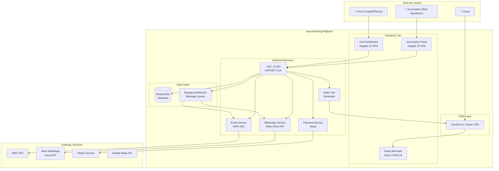

### 1.3 Container Diagram (C4 Model)

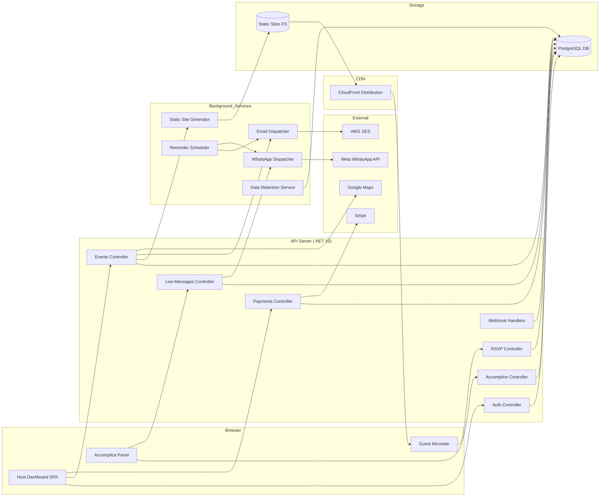

### 1.4 Guest Microsite Flow (JAMstack)

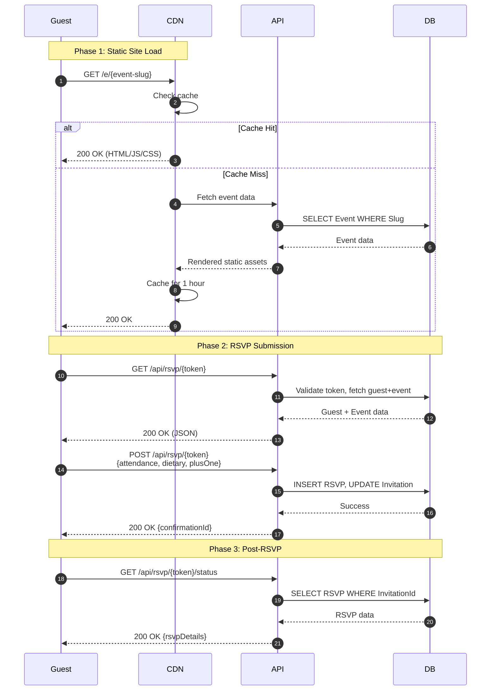

### 1.5 Live Guest Journey Flow (Accomplice → WhatsApp)

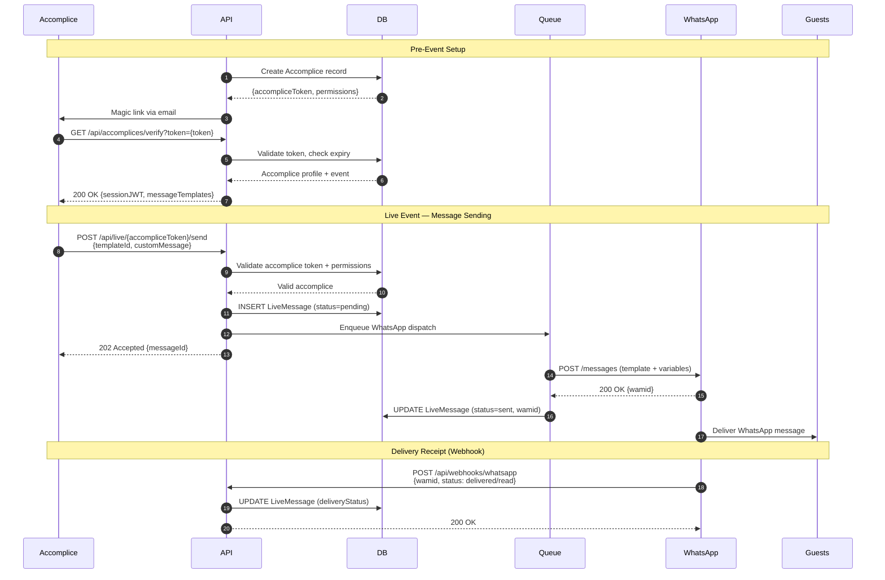

### 1.6 Registration and Onboarding Flow

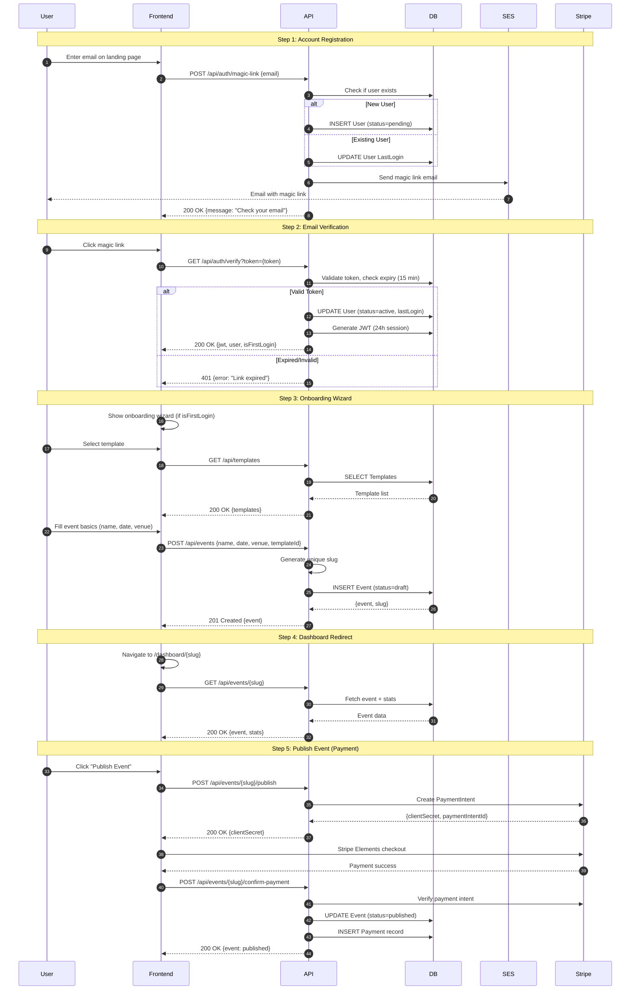

### 1.7 Component Descriptions

| Component | Responsibility | Key Technologies |
|-----------|---------------|-----------------|
| **Host Dashboard** | Event creation, guest management, template customization, RSVP tracking, payment flow | Angular 22, Signals, Typed Forms, Stripe Elements |
| **Guest Microsite** | Static invitation page, RSVP form, event details, maps, calendar sync | Static HTML/JS/CSS, Vanilla JS or lightweight framework |
| **Accomplice Panel** | Live message sending, swipe-to-confirm UI, message template selection | Angular 22, Touch gestures, JWT auth |
| **API Server** | RESTful endpoints, auth, business logic, webhook handlers | .NET 10, Minimal APIs, EF Core, FluentValidation |
| **Static Site Generator** | Generates HTML/JS/CSS per event, uploads to CDN | Razor templates or string interpolation, FileSystem watcher |
| **Email Dispatcher** | Queue-based email sending, template rendering, bounce handling | AWS SES SDK, BackgroundService |
| **WhatsApp Dispatcher** | Queue-based message sending, template variable substitution, retry logic | Meta Cloud API HTTP client, BackgroundService |
| **Data Retention Service** | Scheduled hard deletion of expired event data | BackgroundService, cron-like scheduling |
| **Reminder Scheduler** | Sends RSVP reminders to non-responders | BackgroundService, scheduled tasks |

---

## 2. Data Model

### 2.1 Entity Relationship Diagram

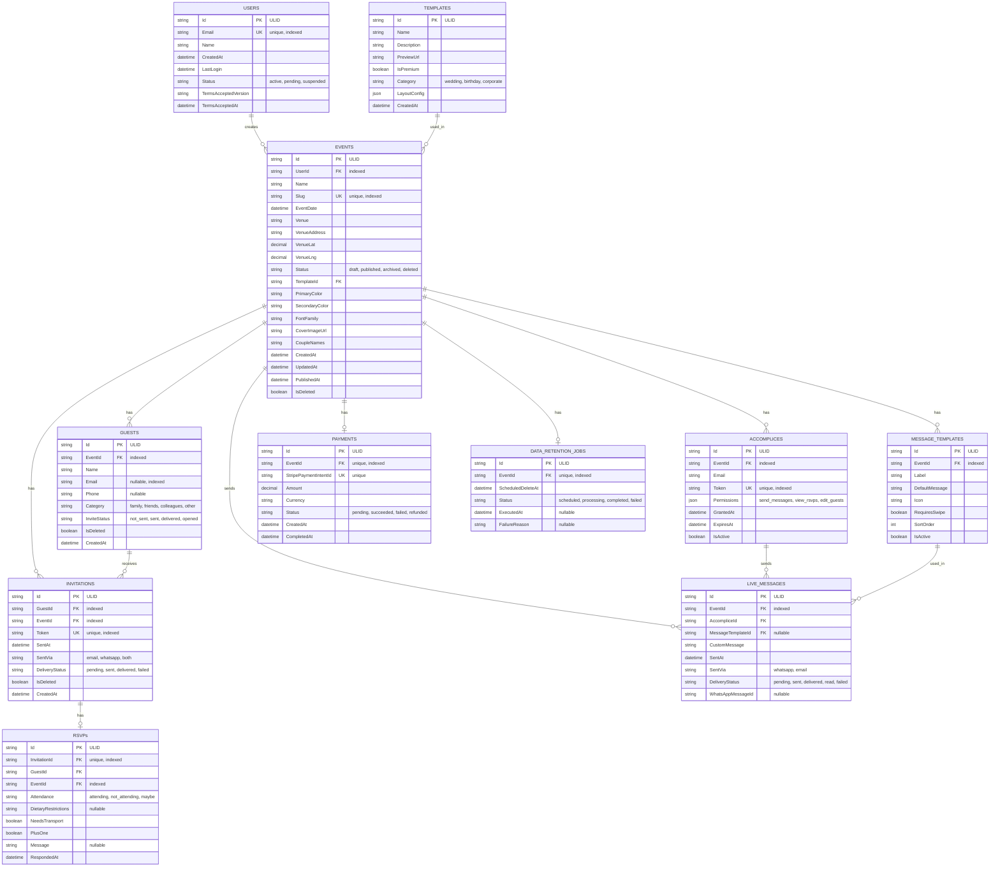

### 2.2 Detailed Entity Specifications

#### Users
| Field | Type | Constraints | Description |
|-------|------|-------------|-------------|
| Id | string (ULID) | PK | Unique identifier |
| Email | string | UNIQUE, NOT NULL, indexed | Login identifier |
| Name | string | NOT NULL | Display name |
| CreatedAt | datetime | NOT NULL, DEFAULT NOW() | Account creation timestamp |
| LastLogin | datetime | NULLABLE | Last successful authentication |
| Status | enum | NOT NULL, DEFAULT 'pending' | active, pending, suspended |
| TermsAcceptedVersion | string | NULLABLE | Version of ToS accepted |
| TermsAcceptedAt | datetime | NULLABLE | When ToS was accepted |

#### Events
| Field | Type | Constraints | Description |
|-------|------|-------------|-------------|
| Id | string (ULID) | PK | Unique identifier |
| UserId | string | FK → Users.Id, indexed | Event owner |
| Name | string | NOT NULL | Event display name |
| Slug | string | UNIQUE, NOT NULL, indexed | URL-friendly identifier |
| EventDate | datetime | NOT NULL | Event date and time |
| Venue | string | NULLABLE | Venue name |
| VenueAddress | string | NULLABLE | Full address for geocoding |
| VenueLat | decimal | NULLABLE | Latitude for map embed |
| VenueLng | decimal | NULLABLE | Longitude for map embed |
| Status | enum | NOT NULL, DEFAULT 'draft' | draft, published, archived, deleted |
| TemplateId | string | FK → Templates.Id | Selected template |
| PrimaryColor | string | NULLABLE | HEX color code |
| SecondaryColor | string | NULLABLE | HEX color code |
| FontFamily | string | NULLABLE | Selected font |
| CoverImageUrl | string | NULLABLE | Hero image URL |
| CoupleNames | string | NULLABLE | Display names on invitation |
| CreatedAt | datetime | NOT NULL, DEFAULT NOW() | Creation timestamp |
| UpdatedAt | datetime | NOT NULL, DEFAULT NOW() | Last modification |
| PublishedAt | datetime | NULLABLE | When event was published |
| IsDeleted | boolean | NOT NULL, DEFAULT false | Soft delete flag |

#### Templates
| Field | Type | Constraints | Description |
|-------|------|-------------|-------------|
| Id | string (ULID) | PK | Unique identifier |
| Name | string | NOT NULL | Template display name |
| Description | string | NULLABLE | Template description |
| PreviewUrl | string | NOT NULL | Preview image URL |
| IsPremium | boolean | NOT NULL, DEFAULT false | Requires payment |
| Category | enum | NOT NULL | wedding, birthday, corporate |
| LayoutConfig | json | NOT NULL | Template layout configuration |
| CreatedAt | datetime | NOT NULL, DEFAULT NOW() | Creation timestamp |

#### Guests
| Field | Type | Constraints | Description |
|-------|------|-------------|-------------|
| Id | string (ULID) | PK | Unique identifier |
| EventId | string | FK → Events.Id, indexed | Parent event |
| Name | string | NOT NULL | Guest display name |
| Email | string | NULLABLE, indexed | For email invitations |
| Phone | string | NULLABLE | For WhatsApp invitations |
| Category | enum | NOT NULL, DEFAULT 'other' | family, friends, colleagues, other |
| InviteStatus | enum | NOT NULL, DEFAULT 'not_sent' | not_sent, sent, delivered, opened |
| IsDeleted | boolean | NOT NULL, DEFAULT false | Soft delete flag |
| CreatedAt | datetime | NOT NULL, DEFAULT NOW() | Creation timestamp |

#### Invitations
| Field | Type | Constraints | Description |
|-------|------|-------------|-------------|
| Id | string (ULID) | PK | Unique identifier |
| GuestId | string | FK → Guests.Id, indexed | Target guest |
| EventId | string | FK → Events.Id, indexed | Parent event |
| Token | string | UNIQUE, NOT NULL, indexed | Secure access token (URL-safe) |
| SentAt | datetime | NULLABLE | When invitation was sent |
| SentVia | enum | NULLABLE | email, whatsapp, both |
| DeliveryStatus | enum | NOT NULL, DEFAULT 'pending' | pending, sent, delivered, failed |
| IsDeleted | boolean | NOT NULL, DEFAULT false | Soft delete flag |
| CreatedAt | datetime | NOT NULL, DEFAULT NOW() | Creation timestamp |

#### RSVPs
| Field | Type | Constraints | Description |
|-------|------|-------------|-------------|
| Id | string (ULID) | PK | Unique identifier |
| InvitationId | string | FK → Invitations.Id, UNIQUE, indexed | One per invitation |
| GuestId | string | FK → Guests.Id | Guest reference |
| EventId | string | FK → Events.Id, indexed | Event reference |
| Attendance | enum | NOT NULL | attending, not_attending, maybe |
| DietaryRestrictions | string | NULLABLE | Free text for dietary needs |
| NeedsTransport | boolean | NOT NULL, DEFAULT false | Bus/transportation needed |
| PlusOne | boolean | NOT NULL, DEFAULT false | Bringing a plus one |
| Message | string | NULLABLE | Personal message to hosts |
| RespondedAt | datetime | NOT NULL, DEFAULT NOW() | Response timestamp |

#### Accomplices
| Field | Type | Constraints | Description |
|-------|------|-------------|-------------|
| Id | string (ULID) | PK | Unique identifier |
| EventId | string | FK → Events.Id, indexed | Associated event |
| Email | string | NOT NULL | Accomplice email |
| Token | string | UNIQUE, NOT NULL, indexed | Magic link token |
| Permissions | json | NOT NULL | send_messages, view_rsvps, edit_guests |
| GrantedAt | datetime | NOT NULL, DEFAULT NOW() | When access was granted |
| ExpiresAt | datetime | NOT NULL | Token expiry (event date + 1 day) |
| IsActive | boolean | NOT NULL, DEFAULT true | Can be revoked |

#### MessageTemplates
| Field | Type | Constraints | Description |
|-------|------|-------------|-------------|
| Id | string (ULID) | PK | Unique identifier |
| EventId | string | FK → Events.Id, indexed | Associated event |
| Label | string | NOT NULL | Display label (e.g., "Bride Leaving") |
| DefaultMessage | string | NOT NULL | Pre-written message text |
| Icon | string | NOT NULL | Emoji or icon identifier |
| RequiresSwipe | boolean | NOT NULL, DEFAULT true | Swipe-to-confirm |
| SortOrder | int | NOT NULL, DEFAULT 0 | Display order |
| IsActive | boolean | NOT NULL, DEFAULT true | Can be toggled off |

#### LiveMessages
| Field | Type | Constraints | Description |
|-------|------|-------------|-------------|
| Id | string (ULID) | PK | Unique identifier |
| EventId | string | FK → Events.Id, indexed | Associated event |
| AccompliceId | string | FK → Accomplices.Id | Who sent it |
| MessageTemplateId | string | FK → MessageTemplates.Id, NULLABLE | Template used |
| CustomMessage | string | NULLABLE | Custom override text |
| SentAt | datetime | NOT NULL, DEFAULT NOW() | Send timestamp |
| SentVia | enum | NOT NULL | whatsapp, email |
| DeliveryStatus | enum | NOT NULL, DEFAULT 'pending' | pending, sent, delivered, read, failed |
| WhatsAppMessageId | string | NULLABLE | Meta API wamid for tracking |

#### Payments
| Field | Type | Constraints | Description |
|-------|------|-------------|-------------|
| Id | string (ULID) | PK | Unique identifier |
| EventId | string | FK → Events.Id, UNIQUE, indexed | One payment per event |
| StripePaymentIntentId | string | UNIQUE, NOT NULL | Stripe reference |
| Amount | decimal | NOT NULL | Amount in smallest currency unit |
| Currency | string | NOT NULL, DEFAULT 'EUR' | ISO 4217 currency code |
| Status | enum | NOT NULL, DEFAULT 'pending' | pending, succeeded, failed, refunded |
| CreatedAt | datetime | NOT NULL, DEFAULT NOW() | Creation timestamp |
| CompletedAt | datetime | NULLABLE | Payment completion timestamp |

#### DataRetentionJobs
| Field | Type | Constraints | Description |
|-------|------|-------------|-------------|
| Id | string (ULID) | PK | Unique identifier |
| EventId | string | FK → Events.Id, UNIQUE, indexed | One job per event |
| ScheduledDeleteAt | datetime | NOT NULL | EventDate + 30 days |
| Status | enum | NOT NULL, DEFAULT 'scheduled' | scheduled, processing, completed, failed |
| ExecutedAt | datetime | NULLABLE | When deletion was executed |
| FailureReason | string | NULLABLE | Error details if failed |

### 2.3 Indexes Summary

| Entity | Index | Type | Purpose |
|--------|-------|------|---------|
| Users | Email | UNIQUE | Login lookup |
| Events | Slug | UNIQUE | Public URL routing |
| Events | UserId | NON-UNIQUE | Dashboard event listing |
| Events | Status | NON-UNIQUE | Filtering by status |
| Guests | EventId | NON-UNIQUE | Guest listing per event |
| Guests | Email | NON-UNIQUE | Duplicate detection |
| Invitations | Token | UNIQUE | RSVP link validation |
| Invitations | GuestId | NON-UNIQUE | Guest invitation lookup |
| Invitations | EventId | NON-UNIQUE | Event invitation listing |
| RSVPs | InvitationId | UNIQUE | One RSVP per invitation |
| RSVPs | EventId | NON-UNIQUE | RSVP stats per event |
| Accomplices | Token | UNIQUE | Magic link validation |
| Accomplices | EventId | NON-UNIQUE | Accomplice listing |
| Payments | EventId | UNIQUE | One payment per event |
| Payments | StripePaymentIntentId | UNIQUE | Webhook correlation |
| DataRetentionJobs | EventId | UNIQUE | One job per event |
| DataRetentionJobs | ScheduledDeleteAt + Status | COMPOSITE | Retention service queries |

### 2.4 Soft Delete Pattern

All entities with `IsDeleted` flag follow this pattern:
- **Query filtering:** All queries automatically filter `WHERE IsDeleted = 0` via EF Core global query filters
- **Delete operation:** Sets `IsDeleted = true` instead of physical deletion
- **Hard delete:** Only performed by `DataRetentionJobs` BackgroundService 30 days after `EventDate`
- **Recovery:** Soft-deleted records can be restored by setting `IsDeleted = false` within the 30-day window

---

## 3. API Endpoint Specifications

### 3.1 Authentication Endpoints

#### POST /api/auth/magic-link
Request magic link for login or registration.

**Request:**
```json
{
  "email": "user@example.com"
}
```

**Response (200):**
```json
{
  "message": "Magic link sent. Check your email.",
  "isNewUser": false
}
```

**Response (429 — Rate Limited):**
```json
{
  "error": "Too many requests. Try again in 20 minutes."
}
```

**Behavior:**
- Rate limit: 3 requests per email per hour
- Creates user if not exists (status=pending)
- Generates 15-minute expiry token
- Sends email via AWS SES with magic link URL

#### GET /api/auth/verify?token={token}
Verify magic link token and return session JWT.

**Response (200):**
```json
{
  "token": "eyJhbGciOiJIUzI1NiIs...",
  "expiresIn": 86400,
  "user": {
    "id": "01J...",
    "email": "user@example.com",
    "name": "John Doe",
    "isFirstLogin": true
  }
}
```

**Response (401 — Invalid/Expired):**
```json
{
  "error": "invalid_token",
  "message": "This link has expired. Request a new one."
}
```

**Behavior:**
- Validates token against DB
- Updates user status to `active` if pending
- Updates `LastLogin`
- Records `TermsAcceptedAt` if first login
- Returns 24-hour session JWT

#### POST /api/auth/terms-accept
Accept terms of service.

**Request (Bearer JWT):**
```json
{
  "termsVersion": "1.0.0"
}
```

**Response (200):**
```json
{
  "accepted": true,
  "acceptedAt": "2026-06-08T10:30:00Z"
}
```

### 3.2 Event Endpoints

#### POST /api/events
Create new event (auto-generates slug).

**Request (Bearer JWT):**
```json
{
  "name": "Sarah & Miguel's Wedding",
  "eventDate": "2026-09-15T16:00:00Z",
  "venue": "Hacienda El Roble",
  "venueAddress": "Calle Principal 123, Madrid, Spain",
  "templateId": "01J...",
  "coupleNames": "Sarah & Miguel",
  "primaryColor": "#D4A574",
  "secondaryColor": "#F5E6D3",
  "fontFamily": "Playfair Display"
}
```

**Response (201):**
```json
{
  "id": "01J...",
  "slug": "sarah-miguel-wedding-2026",
  "name": "Sarah & Miguel's Wedding",
  "status": "draft",
  "createdAt": "2026-06-08T10:30:00Z",
  "guestLimit": 5
}
```

**Behavior:**
- Auto-generates URL-safe slug (appends counter if conflict)
- Sets status to `draft`
- Draft mode: max 5 guests for testing
- Creates `DataRetentionJob` scheduled for EventDate + 30 days

#### GET /api/events/{slug}
Get event details with stats.

**Response (200):**
```json
{
  "id": "01J...",
  "slug": "sarah-miguel-wedding-2026",
  "name": "Sarah & Miguel's Wedding",
  "eventDate": "2026-09-15T16:00:00Z",
  "venue": "Hacienda El Roble",
  "venueLat": 40.4168,
  "venueLng": -3.7038,
  "status": "published",
  "template": { ... },
  "stats": {
    "totalGuests": 120,
    "invitationsSent": 120,
    "rsvpReceived": 85,
    "attending": 72,
    "notAttending": 8,
    "maybe": 5,
    "needsTransport": 15,
    "plusOnes": 20
  },
  "publishedAt": "2026-07-01T09:00:00Z"
}
```

#### POST /api/events/{slug}/guests/import
Import guests from CSV.

**Request (multipart/form-data):**
```
file: guests.csv
```

**CSV Format:**
```csv
Name,Email,Phone,Category
"Juan García",juan@email.com,+34600111222,family
"María López",maria@email.com,,friends
```

**Response (200):**
```json
{
  "imported": 98,
  "duplicates": 2,
  "errors": [
    { "row": 5, "error": "Invalid email format" }
  ]
}
```

**Behavior:**
- Validates CSV structure
- Deduplicates by email
- Creates Guest + Invitation records
- Generates unique tokens per invitation
- Draft mode: blocks if total guests > 5

#### POST /api/events/{slug}/publish
Publish event (triggers Stripe payment).

**Response (200):**
```json
{
  "paymentIntentId": "pi_3...",
  "clientSecret": "pi_3..._secret_...",
  "amount": 2999,
  "currency": "eur"
}
```

**Behavior:**
- Validates event has at least 1 guest
- Creates Stripe PaymentIntent
- On success: updates Event status to `published`, generates static site
- On failure: event remains in draft

#### GET /api/events/{slug}/guests
List guests for an event.

**Query Parameters:** `?page=1&pageSize=50&category=family&search=juan`

**Response (200):**
```json
{
  "guests": [
    {
      "id": "01J...",
      "name": "Juan García",
      "email": "juan@email.com",
      "phone": "+34600111222",
      "category": "family",
      "inviteStatus": "sent",
      "rsvpStatus": "attending"
    }
  ],
  "pagination": {
    "page": 1,
    "pageSize": 50,
    "total": 120
  }
}
```

#### PUT /api/events/{slug}
Update event details.

**Request (Bearer JWT):**
```json
{
  "name": "Updated Name",
  "venue": "New Venue",
  "primaryColor": "#FF5733"
}
```

**Response (200):** Updated event object

**Behavior:**
- Only allowed in `draft` status (published events require re-publish)
- Triggers static site regeneration if published

#### DELETE /api/events/{slug}
Soft delete an event.

**Response (204):** No content

**Behavior:**
- Sets `Event.IsDeleted = true`
- Cascades soft delete to Guests, Invitations
- DataRetentionJob still executes for hard cleanup

### 3.3 RSVP Endpoints (Public)

#### GET /api/rsvp/{token}
Get event and guest info for RSVP page.

**Response (200):**
```json
{
  "event": {
    "name": "Sarah & Miguel's Wedding",
    "date": "2026-09-15T16:00:00Z",
    "venue": "Hacienda El Roble",
    "venueLat": 40.4168,
    "venueLng": -3.7038,
    "template": { ... }
  },
  "guest": {
    "name": "Juan García",
    "category": "family"
  },
  "rsvpExists": false
}
```

**Response (404 — Invalid Token):**
```json
{
  "error": "invalid_token",
  "message": "This invitation link is not valid."
}
```

#### POST /api/rsvp/{token}
Submit RSVP response.

**Request:**
```json
{
  "attendance": "attending",
  "dietaryRestrictions": "Vegetarian, nut allergy",
  "needsTransport": true,
  "plusOne": true,
  "message": "Can't wait to celebrate with you!"
}
```

**Response (200):**
```json
{
  "confirmationId": "01J...",
  "attendance": "attending",
  "message": "Thank you! Your RSVP has been recorded."
}
```

**Behavior:**
- Validates token
- Creates RSVP record
- Updates Invitation.DeliveryStatus
- Triggers thank-you email (async)

#### GET /api/rsvp/{token}/status
Check existing RSVP status.

**Response (200):**
```json
{
  "hasRsvp": true,
  "rsvp": {
    "attendance": "attending",
    "dietaryRestrictions": "Vegetarian",
    "needsTransport": true,
    "plusOne": false,
    "respondedAt": "2026-08-01T14:30:00Z"
  }
}
```

### 3.4 Accomplice Endpoints

#### POST /api/accomplices/{eventSlug}/grant
Grant accomplice access.

**Request (Bearer JWT):**
```json
{
  "email": "bestman@example.com",
  "permissions": ["send_messages", "view_rsvps"]
}
```

**Response (201):**
```json
{
  "id": "01J...",
  "email": "bestman@example.com",
  "magicLink": "https://aura.planning/accomplice/verify?token=abc123...",
  "expiresAt": "2026-09-16T00:00:00Z",
  "permissions": ["send_messages", "view_rsvps"]
}
```

**Behavior:**
- Generates unique token
- Sets expiry to EventDate + 1 day
- Sends magic link email to accomplice

#### GET /api/accomplices/verify?token={token}
Verify accomplice token and return session.

**Response (200):**
```json
{
  "token": "eyJhbGciOiJIUzI1NiIs...",
  "accomplice": {
    "id": "01J...",
    "email": "bestman@example.com",
    "eventSlug": "sarah-miguel-wedding-2026",
    "permissions": ["send_messages", "view_rsvps"]
  },
  "messageTemplates": [
    {
      "id": "01J...",
      "label": "Bride Leaving",
      "defaultMessage": "The bride is leaving the hotel! 💍",
      "icon": "👰",
      "requiresSwipe": true
    }
  ]
}
```

#### POST /api/live/{accompliceToken}/send
Send live notification.

**Request:**
```json
{
  "messageTemplateId": "01J...",
  "customMessage": "She's on her way! 🚗💨"
}
```

**Response (202):**
```json
{
  "messageId": "01J...",
  "status": "queued",
  "estimatedDelivery": "30 seconds"
}
```

**Behavior:**
- Validates accomplice token and permissions
- Creates LiveMessage record (status=pending)
- Enqueues to WhatsApp dispatch queue
- Returns 202 Accepted (async processing)

#### GET /api/accomplices/{eventSlug}/messages
List sent live messages.

**Response (200):**
```json
{
  "messages": [
    {
      "id": "01J...",
      "customMessage": "They said YES! 💍",
      "sentAt": "2026-09-15T17:30:00Z",
      "sentVia": "whatsapp",
      "deliveryStatus": "delivered"
    }
  ]
}
```

### 3.5 Payment Endpoints

#### POST /api/payments/webhook
Stripe webhook handler.

**Request (Stripe signature verified):**
```json
{
  "type": "payment_intent.succeeded",
  "data": {
    "object": {
      "id": "pi_3...",
      "amount": 2999,
      "currency": "eur",
      "metadata": {
        "eventId": "01J..."
      }
    }
  }
}
```

**Response (200):** `{ "received": true }`

**Behavior:**
- Verifies Stripe webhook signature
- Handles `payment_intent.succeeded`: publishes event, generates static site
- Handles `payment_intent.failed`: notifies host
- Idempotent processing

### 3.6 Webhook Endpoints

#### POST /api/webhooks/whatsapp
Meta WhatsApp delivery status webhook.

**Request (verified via hub.challenge):**
```json
{
  "entry": [{
    "changes": [{
      "value": {
        "statuses": [{
          "id": "wamid_...",
          "status": "delivered",
          "timestamp": "1717830000"
        }]
      }
    }]
  }]
}
```

**Response (200):** `{ "received": true }`

#### POST /api/webhooks/ses
AWS SNS bounce/complaint webhook.

**Request (SNS signature verified):**
```json
{
  "Type": "Notification",
  "Message": {
    "notificationType": "Bounce",
    "bounce": {
      "bounceType": "Permanent",
      "bouncedRecipients": [{
        "emailAddress": "invalid@example.com"
      }]
    }
  }
}
```

**Response (200):** `{ "received": true }`

### 3.7 Template Endpoints

#### GET /api/templates
List available templates.

**Query Parameters:** `?category=wedding&isPremium=false`

**Response (200):**
```json
{
  "templates": [
    {
      "id": "01J...",
      "name": "Classic Elegance",
      "description": "Timeless design with serif fonts",
      "previewUrl": "/templates/classic-elegance.png",
      "isPremium": false,
      "category": "wedding"
    }
  ]
}
```

### 3.8 API Endpoint Summary Table

| # | Method | Endpoint | Auth | Description |
|---|--------|----------|------|-------------|
| 1 | POST | /api/auth/magic-link | None | Request magic link |
| 2 | GET | /api/auth/verify | None | Verify token, get JWT |
| 3 | POST | /api/auth/terms-accept | JWT | Accept terms of service |
| 4 | POST | /api/events | JWT | Create event |
| 5 | GET | /api/events/{slug} | JWT (owner) | Get event + stats |
| 6 | PUT | /api/events/{slug} | JWT (owner) | Update event |
| 7 | DELETE | /api/events/{slug} | JWT (owner) | Soft delete event |
| 8 | POST | /api/events/{slug}/guests/import | JWT (owner) | Import CSV guests |
| 9 | GET | /api/events/{slug}/guests | JWT (owner) | List guests |
| 10 | POST | /api/events/{slug}/publish | JWT (owner) | Publish + pay |
| 11 | GET | /api/rsvp/{token} | None | Get RSVP page data |
| 12 | POST | /api/rsvp/{token} | None | Submit RSVP |
| 13 | GET | /api/rsvp/{token}/status | None | Check RSVP status |
| 14 | POST | /api/accomplices/{slug}/grant | JWT (owner) | Grant accomplice |
| 15 | GET | /api/accomplices/verify | None | Verify accomplice token |
| 16 | POST | /api/live/{token}/send | Accomplice JWT | Send live message |
| 17 | GET | /api/accomplices/{slug}/messages | Accomplice JWT | List sent messages |
| 18 | GET | /api/templates | None | List templates |
| 19 | POST | /api/payments/webhook | Stripe sig | Stripe webhook |
| 20 | POST | /api/webhooks/whatsapp | Meta sig | WhatsApp webhook |
| 21 | POST | /api/webhooks/ses | SNS sig | SES bounce webhook |

---

## 4. Integration Specifications

### 4.1 WhatsApp Business API (Meta Cloud API)

#### Overview
- **Provider:** Meta Cloud API (direct) or BSP (Twilio/MessageBird)
- **Decision needed:** Direct Meta API vs BSP (see Open Questions)
- **Phone Number:** Dedicated business phone number required

#### Message Templates
Templates must be pre-approved by Meta before use.

| Template Name | Category | Variables | Purpose |
|--------------|----------|-----------|---------|
| `invitation_{lang}` | Utility | {{1}}=GuestName, {{2}}=EventName, {{3}}=RSVPUrl | Send invitation |
| `reminder_{lang}` | Utility | {{1}}=GuestName, {{2}}=EventName, {{3}}=RSVPUrl | RSVP reminder |
| `live_update` | Utility | {{1}}=Message | Live event notification |
| `thank_you_{lang}` | Utility | {{1}}=GuestName, {{2}}=EventName | Post-event thank you |

#### Rate Limits
| Metric | Limit | Notes |
|--------|-------|-------|
| Messages/hour | 1,000 per phone number | Per 24h rolling window |
| Template quality rating | Green/Yellow/Red | Affects sending tier |
| Daily tier | Starts at 1K, scales to 100K | Based on quality rating |
| Conversation pricing | ~$0.005-0.08 per conversation | Varies by country |

#### Webhook Events
| Event | Description | Action |
|-------|-------------|--------|
| `message` | Incoming reply from guest | Log, optional auto-response |
| `status` | Delivery status update | Update LiveMessage/Invitation |
| `template` | Template approval status | Enable/disable template |

#### Retry Logic
```
Attempt 1 → Immediate send
Attempt 2 → 5-minute delay (if failed)
Attempt 3 → 30-minute delay (if failed)
Fallback → Send via email (AWS SES)
```

#### Template Approval Process
1. Create template in Meta Business Manager
2. Submit for review (24-48 hour approval)
3. Template must match exact approved format
4. Variables must be in correct order
5. Category determines pricing (Utility < Marketing)

### 4.2 AWS SES

#### Overview
- **Region:** eu-west-1 (Ireland) for EU data residency
- **Source Email:** noreply@aura.planning (verified identity)
- **Configuration Set:** For bounce/complaint tracking via SNS

#### Email Templates
| Template Name | Purpose | Personalization Tokens |
|--------------|---------|----------------------|
| `magic-link` | Authentication | {{name}}, {{link}}, {{expiryMinutes}} |
| `invitation-email` | Guest invitation | {{guestName}}, {{eventName}}, {{rsvpUrl}}, {{venue}} |
| `rsvp-reminder` | Non-responder reminder | {{guestName}}, {{eventName}}, {{daysLeft}}, {{rsvpUrl}} |
| `thank-you-card` | Post-event thank you | {{guestName}}, {{eventName}}, {{photoGalleryUrl}} |
| `accomplice-invite` | Accomplice access grant | {{name}}, {{eventName}}, {{magicLink}}, {{permissions}} |
| `payment-receipt` | Payment confirmation | {{name}}, {{eventName}}, {{amount}}, {{receiptUrl}} |

#### Bounce/Complaint Handling
```
SES → SNS Topic → HTTP Webhook → API
                                    ↓
                          Update Invitation.DeliveryStatus = "failed"
                          Flag email as bounced (no retry)
                          If complaint: suspend email for that address
```

#### Quotas
| Metric | Sandbox | Production |
|--------|---------|------------|
| Daily sending quota | 200 emails | 50,000 emails (requestable increase) |
| Max send rate | 1 email/second | 14 emails/second |
| Attachment size | 10MB | 10MB |

#### Production Move Requirements
1. Submit SES production access request
2. Demonstrate bounce/complaint handling
3. Verify domain identity (DKIM)
4. Configure feedback loop (SNS)

### 4.3 Stripe Connect

#### Payment Flow (Event Publishing)
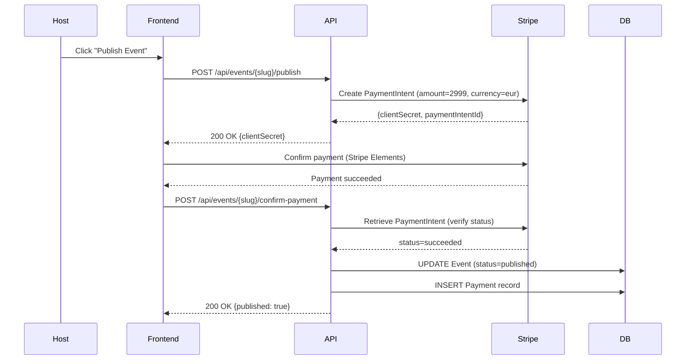

#### Pricing
| Item | Amount | Notes |
|------|--------|-------|
| Event publishing fee | €29.99 | One-time per event |
| Stripe processing fee | ~2.9% + €0.25 | Absorbed in publishing price |
| Gift registry platform fee | 1.5-2% | Future feature (V3) |

#### Webhook Events
| Event | Description | Action |
|-------|-------------|--------|
| `payment_intent.succeeded` | Payment completed | Publish event, generate static site |
| `payment_intent.payment_failed` | Payment declined | Notify host, keep event in draft |
| `payment_intent.canceled` | Payment canceled | No action needed |

#### Future: Gift Registry (Stripe Connect)
```
Guest → Stripe Checkout → Connected Account (Host)
                              ↓
                    Platform fee (1.5-2%) auto-deducted
                              ↓
                    Host receives net amount directly
```

**Key Considerations:**
- Aura never holds guest funds (no KYC/AML liability)
- Host must complete Stripe onboarding (identity verification)
- Platform fee configured via `application_fee_amount`
- Monthly fee per active connected account (~$2/month)

#### PCI Compliance
- **No card data stored** by Aura
- Stripe Elements handles card input (PCI SAQ A)
- PaymentIntent IDs stored for reconciliation only
- Webhook signature verification required

### 4.4 Google Maps

#### Usage Scenarios
| Feature | API | Quota | Cost |
|---------|-----|-------|------|
| Embedded map on microsite | Maps JavaScript API | 28,000 loads/month free | $7/1K loads over |
| Venue address → coordinates | Geocoding API | 40,000 requests/month free | $5/1K over |
| Directions link | No API needed (URL scheme) | Unlimited | Free |

#### Implementation
- **Embed:** `<iframe>` with API key restricted to domain
- **Geocoding:** Server-side call when venue address is saved
- **Directions:** Deep links to Google Maps / Waze apps
  - Google Maps: `https://www.google.com/maps/dir/?api=1&destination={lat},{lng}`
  - Waze: `https://waze.com/ul?ll={lat},{lng}&navigate=yes`

#### API Key Security
- Restrict by HTTP referrer (microsite domains)
- Restrict by API (Maps JS, Geocoding only)
- Separate key for server-side geocoding (IP restriction)

---

## 5. Security Requirements

### 5.1 Authentication Architecture

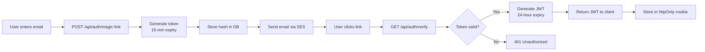

#### Token Specifications
| Token Type | Expiry | Purpose | Storage |
|-----------|--------|---------|---------|
| Magic Link Token | 15 minutes | One-time authentication | DB (hashed) |
| Session JWT | 24 hours | API authentication | httpOnly cookie |
| Invitation Token | Until event + 30 days | Guest RSVP access | DB (hashed) |
| Accomplice Token | Until event + 1 day | Accomplice panel access | DB (hashed) |

#### JWT Claims
```json
{
  "sub": "01J...",
  "email": "user@example.com",
  "role": "host",
  "eventId": "01J...",
  "iat": 1717830000,
  "exp": 1717916400
}
```

Accomplice JWT:
```json
{
  "sub": "01J...",
  "email": "bestman@example.com",
  "role": "accomplice",
  "eventId": "01J...",
  "permissions": ["send_messages", "view_rsvps"],
  "iat": 1717830000,
  "exp": 1717916400
}
```

### 5.2 Authorization Policies

| Policy | Rule | Applied To |
|--------|------|-----------|
| `EventOwner` | User.Id == Event.UserId | All event CRUD endpoints |
| `AccompliceScoped` | Token.EventId matches requested event | Live message endpoints |
| `PublishedEvent` | Event.Status == 'published' | Public RSVP endpoints |
| `DraftGuestLimit` | Guest count <= 5 if draft | Guest import endpoints |
| `ActiveAccomplice` | Accomplice.IsActive && ExpiresAt > now | Accomplice panel access |

### 5.3 Rate Limiting

| Endpoint | Limit | Window | Action on Exceed |
|----------|-------|--------|-----------------|
| Magic link requests | 3 | Per email, 1 hour | 429 + retry-after header |
| All API endpoints | 100 | Per IP, 1 minute | 429 + retry-after header |
| RSVP submissions | 5 | Per token, 1 hour | 429 (prevent spam) |
| Live message sends | 20 | Per accomplice, 1 hour | 429 (prevent abuse) |
| Guest import | 3 | Per event, 1 hour | 429 |

### 5.4 PII Handling

| Data Type | Encryption | Retention | Access |
|-----------|-----------|-----------|--------|
| Email addresses | Application-level AES-256 | 30 days post-event | Event owner only |
| Phone numbers | Application-level AES-256 | 30 days post-event | Event owner only |
| Dietary restrictions | Application-level AES-256 | 30 days post-event | Event owner only |
| RSVP messages | Application-level AES-256 | 30 days post-event | Event owner only |
| Payment data | Not stored (Stripe only) | N/A | N/A |

#### Encryption Approach
- **Option A:** SQLCipher (PostgreSQL encryption at rest)
- **Option B:** Application-level encryption (EF Core value converters)
- **Recommendation:** Option B for MVP (simpler, no native dependency)

### 5.5 GDPR Compliance

| Right | Implementation |
|-------|---------------|
| Right to Access | Export all data for a user/event via API endpoint |
| Right to Rectify | Update guest/event data via standard CRUD endpoints |
| Right to Erasure | Manual deletion endpoint + automated 30-day deletion |
| Right to Portability | CSV export of guest list and RSVP data |
| Consent | Terms acceptance tracked with version and timestamp |
| Data Minimization | Only collect necessary fields (no photos in V1) |
| Purpose Limitation | Data used only for event management, not marketing |

### 5.6 30-Day Auto-Delete

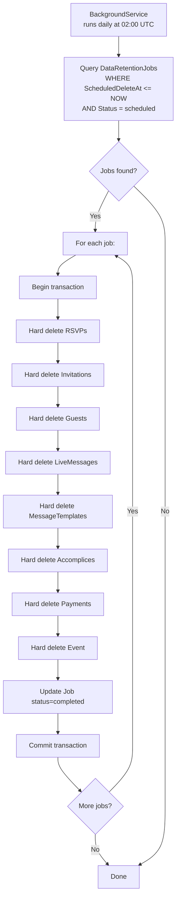

**Deletion Order (respecting foreign keys):**
1. RSVPs (no dependents)
2. LiveMessages
3. MessageTemplates
4. Accomplices
5. Invitations
6. Guests
7. Payments
8. Events
9. DataRetentionJobs (self)

**Failure Handling:**
- If deletion fails: set status=failed, log reason, retry next day
- Alert admin if job fails 3 consecutive times
- Partial deletions are rolled back (transactional)

### 5.7 Infrastructure Security

| Measure | Implementation |
|---------|---------------|
| CORS | Whitelist: aura.planning, *.aura.planning, localhost (dev) |
| CSRF | Double-submit cookie pattern for state-changing endpoints |
| Input Validation | FluentValidation on all DTOs |
| SQL Injection | EF Core parameterized queries (no raw SQL) |
| XSS | Content Security Policy headers, output encoding |
| TLS | 1.3 for all connections, HSTS headers |
| Security Headers | X-Content-Type-Options, X-Frame-Options, Referrer-Policy |
| API Key Rotation | Automated rotation for external service keys |

---

## 6. Infrastructure Considerations

### 6.1 CDN Architecture for Static Sites

```mermaid
graph TB
    subgraph Origin
        A[API Server] --> B[Static Site Generator]
        B --> C[wwwroot/static-sites/{slug}/]
    end

    subgraph CDN["CloudFront Distribution"]
        D[Edge Location EU]
        E[Edge Location US]
        F[Edge Location LATAM]
    end

    subgraph Guests
        G[Guest Browser]
        H[Guest Browser]
        I[Guest Browser]
    end

    C -->|Invalidation on publish| D
    C -->|Invalidation on publish| E
    C -->|Invalidation on publish| F

    D -->|Cache HIT| G
    E -->|Cache HIT| H
    F -->|Cache MISS → Origin| I
```

#### CDN Configuration
| Setting | Value | Rationale |
|---------|-------|-----------|
| Cache TTL | 1 hour (default) | Balance freshness vs cost |
| Cache invalidation | On event publish/update | Ensure guests see latest |
| HTTPS | Required | Security + SEO |
| Compression | Brotli + Gzip | Reduce payload size |
| Custom domain | e/{slug}.aura.planning | Branded URLs |

#### Static Site Structure
```
static-sites/
├── {event-slug}/
│   ├── index.html          # Main invitation page
│   ├── styles.css          # Template-specific styles
│   ├── app.js              # RSVP form logic
│   └── assets/
│       ├── cover.jpg       # Event cover image
│       └── template-bg.png # Template background
```

### 6.2 CI/CD Pipeline

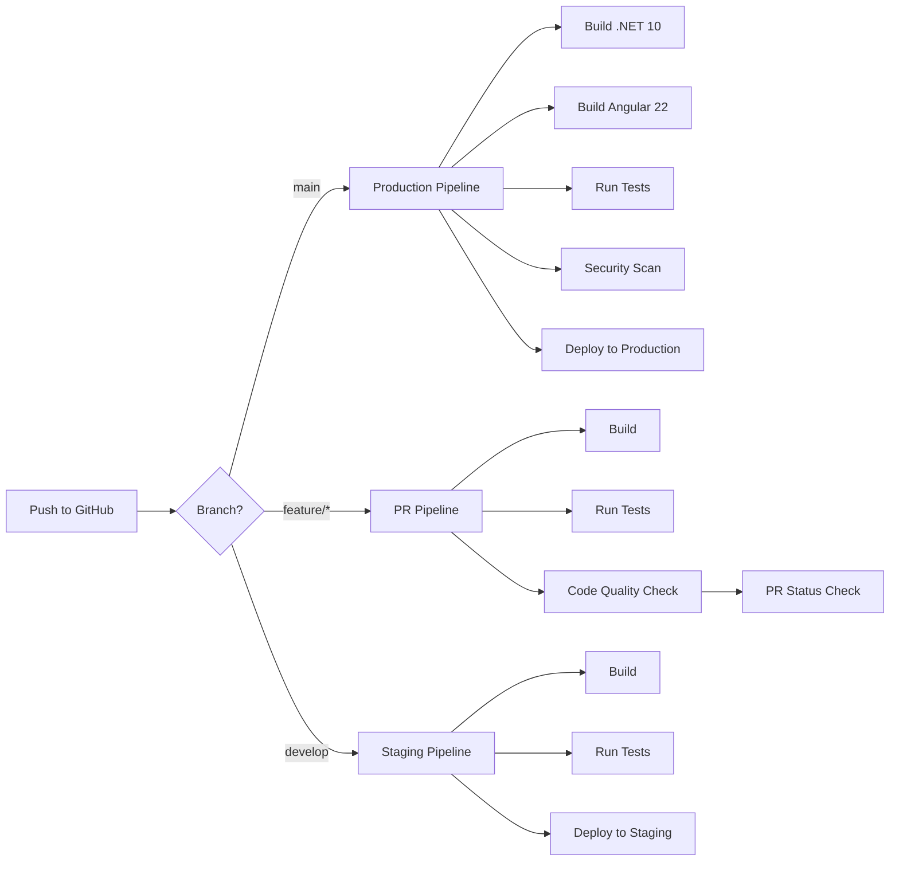

#### Pipeline Stages
| Stage | Tools | Purpose |
|-------|-------|---------|
| Build | dotnet build, ng build | Compile backend + frontend |
| Test | xUnit, Jest | Unit + integration tests |
| Lint | dotnet format, ESLint | Code style enforcement |
| Security | dotnet-retire, npm audit | Dependency vulnerability scan |
| Deploy | GitHub Actions, Azure App Service | Zero-downtime deployment |

### 6.3 Environments

| Environment | Purpose | Database | External Services |
|-------------|---------|----------|-------------------|
| **Local** | Development | PostgreSQL file | Mock SES, Mock Stripe, Mock WhatsApp |
| **Staging** | QA / UAT | PostgreSQL file (separate) | Sandbox SES, Stripe test mode, WhatsApp sandbox |
| **Production** | Live users | PostgreSQL file (backed up) | Production SES, Stripe live, WhatsApp production |

#### Environment Variables
```
# Shared
ConnectionStrings__DefaultConnection=Data Source=aura.db
Jwt__Key=<256-bit key>
Jwt__Issuer=aura.planning
Jwt__Audience=aura.planning
Jwt__ExpiryMinutes=1440

# External Services
WhatsApp__ApiKey=<key>
WhatsApp__PhoneNumberId=<id>
Aws__AccessKey=<key>
Aws__SecretKey=<secret>
Aws__Region=eu-west-1
Aws__SesSourceEmail=noreply@aura.planning
Stripe__SecretKey=<key>
Stripe__PublishableKey=<key>
Stripe__WebhookSecret=<secret>
Stripe__PublishingPrice=2999
GoogleMaps__ApiKey=<key>

# Feature Flags
FeatureFlags__GiftRegistry=false
FeatureFlags__PhotoUpload=false
```

### 6.4 Observability

| Aspect | Tool | Implementation |
|--------|------|---------------|
| **Logging** | Serilog → Console/File | Structured JSON logs, correlation IDs |
| **Metrics** | OpenTelemetry → Prometheus | Request rates, error rates, latency |
| **Tracing** | OpenTelemetry → Jaeger | Distributed tracing across services |
| **Health Checks** | ASP.NET Core HealthChecks | /health endpoint for load balancer |
| **Error Tracking** | Sentry or Application Insights | Unhandled exception capture |
| **Uptime Monitoring** | UptimeRobot / Pingdom | External health checks every 5 min |

#### Key Metrics to Track
| Metric | Alert Threshold | Action |
|--------|----------------|--------|
| API error rate | > 5% over 5 min | Page on-call |
| RSVP submission latency | p95 > 2s | Investigate DB performance |
| WhatsApp delivery failure rate | > 10% over 1 hour | Check Meta API status |
| Email bounce rate | > 5% over 1 day | Review email list quality |
| Static site generation time | > 30s | Optimize SSG |
| Database size | > 500MB | Plan migration to PostgreSQL |

### 6.5 Backup Strategy

| Component | Frequency | Retention | Method |
|-----------|-----------|-----------|--------|
| PostgreSQL database | Daily at 03:00 UTC | 30 days | File copy to S3/Blob |
| Static sites | On publish | Until event deletion | CDN origin backup |
| Configuration | On change | Unlimited | Git version control |

---

## 7. Open Technical Questions

### 7.1 WhatsApp Integration
| # | Question | Options | Recommendation | Impact |
|---|----------|---------|----------------|--------|
| Q1 | Direct Meta API vs BSP (Twilio)? | Direct: cheaper, more control. BSP: easier setup, support | **Direct Meta API** for MVP (cost savings) | High — affects cost and complexity |
| Q2 | Template approval timeline? | 24-48 hours typically | Plan template submission 1 week before launch | Medium — affects launch timeline |
| Q3 | Fallback channel priority? | Email first, SMS second | **Email fallback** (already integrated) | Medium — affects reliability |

### 7.2 Database
| # | Question | Options | Recommendation | Impact |
|---|----------|---------|----------------|--------|
| Q4 | PostgreSQL vs PostgreSQL for production? | PostgreSQL: simple, zero-ops. PostgreSQL: scalable, concurrent | **PostgreSQL for MVP** (<10K events), plan PostgreSQL migration at scale | High — affects architecture |
| Q5 | SQLCipher vs application-level encryption? | SQLCipher: transparent. App-level: more control | **Application-level** (EF Core value converters) for MVP | Medium — affects PII security |
| Q6 | Database size limit for PostgreSQL? | 140TB theoretical, practical ~10GB | Monitor at 500MB, plan migration | Low — long-term concern |

### 7.3 Static Site Generation
| # | Question | Options | Recommendation | Impact |
|---|----------|---------|----------------|--------|
| Q7 | SSG approach? | Razor templates, string interpolation, or headless browser | **Razor templates** (native .NET, fast) | Medium — affects performance |
| Q8 | CDN provider? | CloudFront (AWS), Azure CDN, Cloudflare | **Cloudflare** (free tier generous, easy setup) | Medium — affects cost |
| Q9 | Custom domains for events? | e.g., sarah-miguel.aura.planning vs aura.planning/e/slug | **Subpath** (aura.planning/e/slug) for MVP | Low — affects UX |

### 7.4 Payments
| # | Question | Options | Recommendation | Impact |
|---|----------|---------|----------------|--------|
| Q10 | Stripe Connect vs standard Stripe? | Connect: marketplace, connected accounts. Standard: simple | **Standard Stripe** for MVP (simple payment), Connect for gift registry (V3) | High — affects payment architecture |
| Q11 | Pricing model? | One-time €29.99, tiered by guest count, subscription | **One-time €29.99** for MVP | Medium — affects business model |
| Q12 | Refund policy? | Full refund within 14 days, no refund after publish | **14-day refund window** (EU consumer law) | Low — affects legal compliance |

### 7.5 Security & Compliance
| # | Question | Options | Recommendation | Impact |
|---|----------|---------|----------------|--------|
| Q13 | GDPR Data Protection Officer? | Required if processing large-scale sensitive data | **Not required for MVP** (<10K users), reassess at scale | Low — legal compliance |
| Q14 | Cookie consent banner? | Required for non-essential cookies | **No banner needed** (no third-party cookies on microsites) | Low — affects UX |
| Q15 | Data export format? | JSON, CSV, PDF | **CSV for guests, JSON for full export** | Low — affects GDPR compliance |

### 7.6 Scalability
| # | Question | Options | Recommendation | Impact |
|---|----------|---------|----------------|--------|
| Q16 | Background service scaling? | Single instance, distributed queue | **Single instance** for MVP (BackgroundService), move to Azure Service Bus at scale | Medium — affects reliability |
| Q17 | Static site regeneration on update? | Full regeneration, incremental | **Full regeneration** for MVP (fast enough for <200 guests) | Low — affects performance |
| Q18 | API horizontal scaling? | Stateless API, load balancer | **Stateless design** from day one, easy to scale | Medium — affects architecture |

---

## 8. Registration & Onboarding Technical Flow

### 8.1 Two-Step Flow Overview

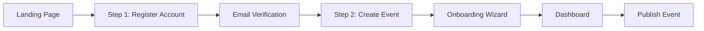

### 8.2 Step 1: Account Registration

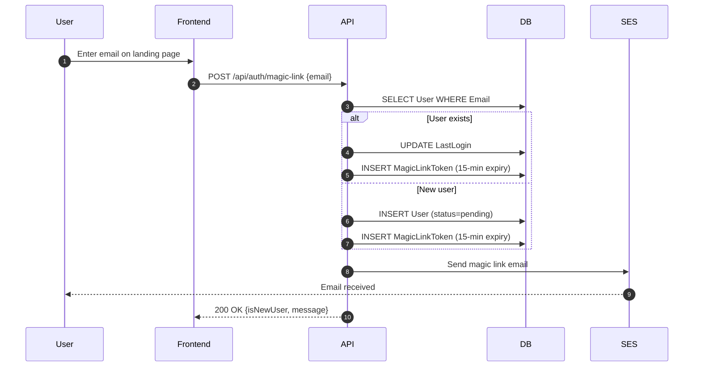

**Magic Link Email Content:**
- Subject: "Your Aura Planning access link"
- Body: Personalized greeting, magic link button, expiry notice (15 min)
- Footer: Security notice, support link

### 8.3 Step 2: Email Verification & Profile Setup

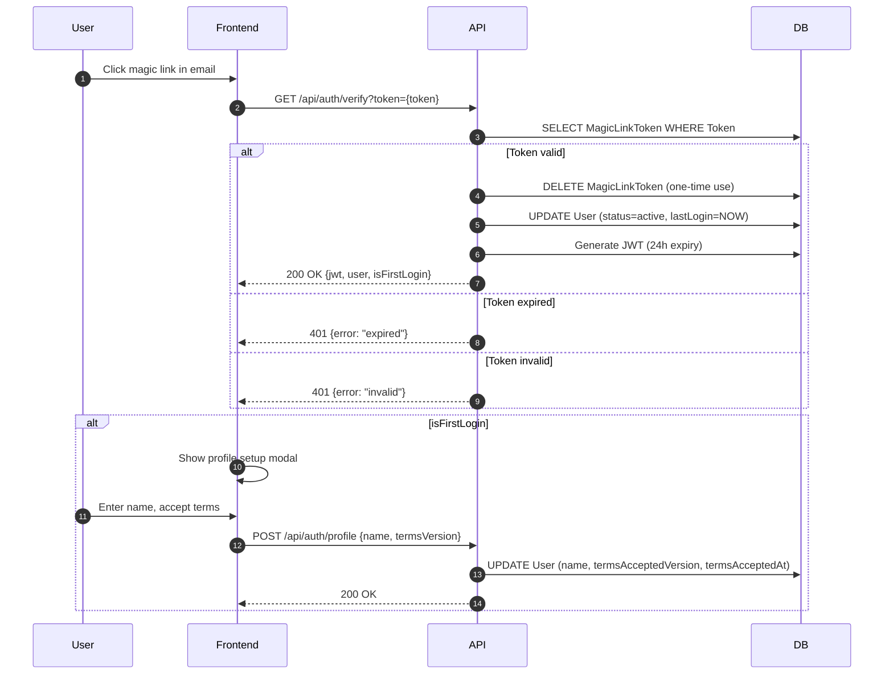

**Profile Setup Fields:**
| Field | Required | Validation |
|-------|----------|-----------|
| Name | Yes | 2-100 characters |
| Terms acceptance | Yes | Checkbox, version tracked |
| Marketing consent | No | Opt-in checkbox |

### 8.4 Onboarding Wizard

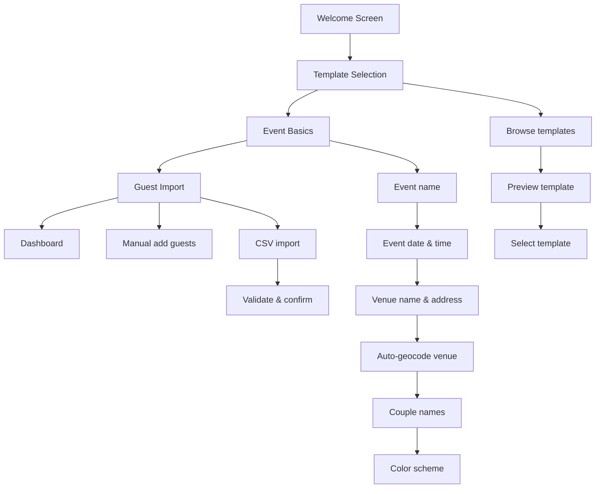

#### Wizard Step Details

**Step 1: Template Selection**
```
GET /api/templates?category=wedding&isPremium=false
→ Display template grid with previews
→ User selects template
→ Store templateId in session
```

**Step 2: Event Basics**
```
POST /api/events {
  name, eventDate, venue, venueAddress,
  coupleNames, templateId, primaryColor, secondaryColor, fontFamily
}
→ Auto-generate slug
→ Auto-geocode venue address (Google Maps API)
→ Create event (status=draft)
→ Create DataRetentionJob
→ Return {event, slug}
```

**Step 3: Guest Import (Optional)**
```
POST /api/events/{slug}/guests/import (multipart)
→ Parse CSV
→ Validate rows
→ Create Guest + Invitation records
→ Return {imported, duplicates, errors}
→ Draft mode: max 5 guests
```

### 8.5 Account Recovery Flow

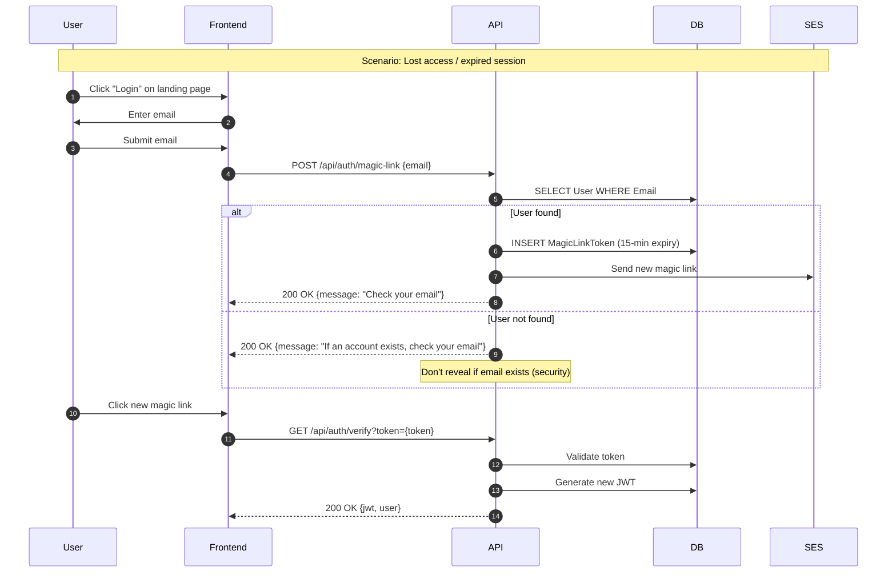

**Recovery Security Measures:**
- Same rate limiting as registration (3 requests/hour)
- No email enumeration (same response for existing/non-existing)
- Old tokens invalidated on new request
- Session JWT invalidation on new login (single session per user)

### 8.6 Session Management

| Aspect | Implementation |
|--------|---------------|
| Storage | httpOnly, Secure, SameSite=Strict cookie |
| Expiry | 24 hours from last activity |
| Refresh | Silent refresh at 50% expiry via API call |
| Revocation | Server-side token blacklist (for logout) |
| Single Session | New login invalidates previous session |
| Inactive Timeout | 30 minutes of inactivity triggers re-auth |

### 8.7 Onboarding State Machine

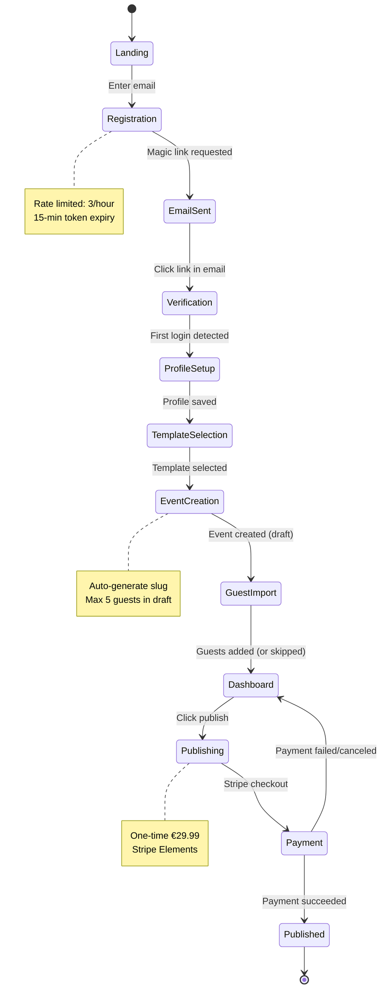

---

## Appendix A: Glossary

| Term | Definition |
|------|-----------|
| **Host** | The person creating and managing the event (couple, planner) |
| **Guest** | An invitee to the event |
| **Accomplice** | A trusted person with limited access to send live updates |
| **Microsite** | The static invitation page served via CDN |
| **Magic Link** | A one-time authentication token sent via email |
| **Slug** | URL-friendly identifier for an event |
| **SSG** | Static Site Generator |
| **JAMstack** | JavaScript, APIs, Markup architecture pattern |
| **ULID** | Universally Unique Lexicographically Sortable Identifier |

## Appendix B: Version History

| Version | Date | Author | Changes |
|---------|------|--------|---------|
| 1.0 | 2026-06-08 | Technical Designer | Initial architecture analysis |

## Appendix C: Reference Documents

- Business Requirements: `business-documentation/Aura.MD`
- Technical Conventions: `conventions/technical-conventions.md`
- Git Conventions: `conventions/git-conventions.md`
- PRD Template: `readme.md`
