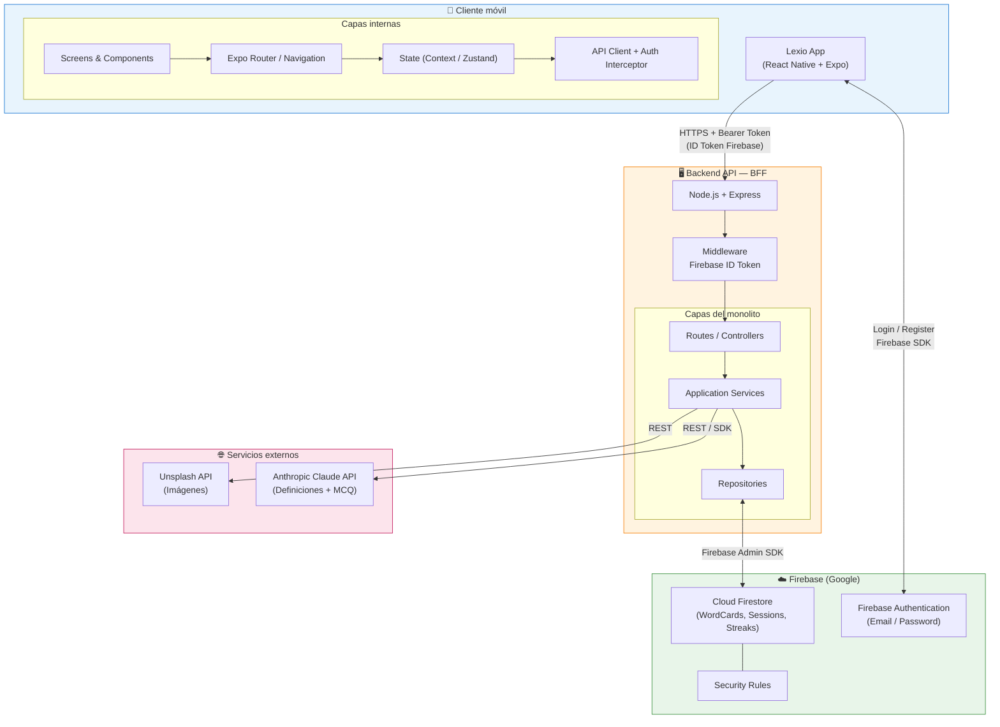
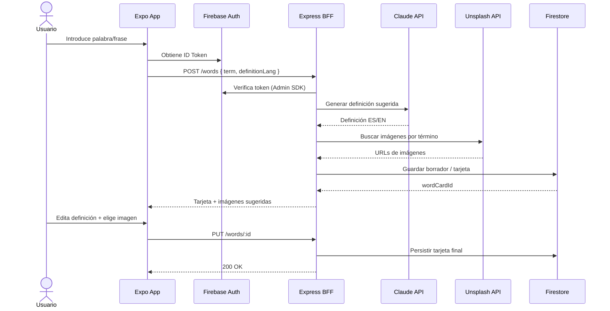
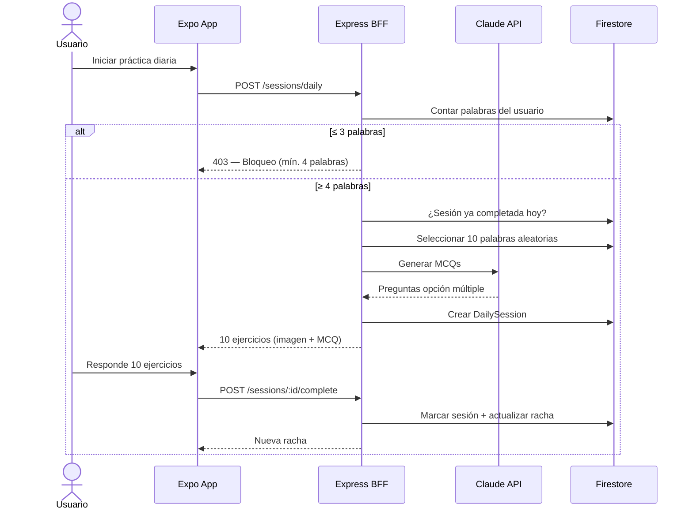
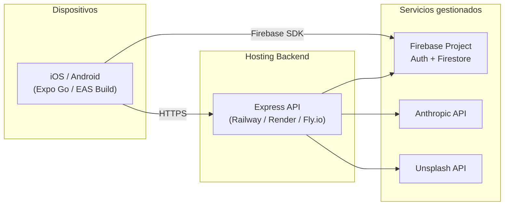

# 2. Arquitectura del Sistema — Lexio

## 2.1. Diagrama de arquitectura

### Patrón arquitectónico

Lexio sigue una arquitectura **Cliente–Servidor** con un **BFF (Backend for Frontend)** en Node.js/Express, apoyada en **Firebase como plataforma gestionada** (Auth + persistencia) e **integraciones externas vía API** (Claude, Unsplash).

En el backend interno se aplica una **arquitectura en capas (Layered Architecture)** dentro de un **monolito modular**:

| Capa | Responsabilidad |
|------|-----------------|
| **Presentación** | Controllers / routes (Express) |
| **Aplicación** | Casos de uso: capturar palabra, generar sesión, actualizar racha |
| **Dominio** | Entidades y reglas: `WordCard`, `DailySession`, `Streak` |
| **Infraestructura** | Firebase Admin SDK, clientes HTTP (Claude, Unsplash) |

No se adopta microservicios: para un MVP académico y un desarrollador full-stack, un monolito bien modularizado reduce complejidad operativa sin sacrificar el flujo E2E prioritario (**Captura → Ejercicio → Validación**).

### Vista de contenedores (C4 simplificado)



### Flujo A — Captura de palabra



### Flujo B — Sesión diaria (10 ejercicios + racha)



### Justificación de la arquitectura

**¿Por qué BFF (Express) y no solo cliente → Firebase?**

1. **Protección de secretos**: las claves de Claude y Unsplash no deben ir en la app móvil; cualquier variable embebida en el bundle de Expo es extraíble.
2. **Orquestación**: capturar palabra implica encadenar IA + imágenes + persistencia; centralizarlo en el backend simplifica la app y los reintentos.
3. **Validación server-side**: reglas críticas (mínimo 4 palabras, 1 sesión/día, unicidad de tarjeta, lógica de racha) no deben depender solo del cliente.
4. **Evolución**: se puede cachear prompts, limitar rate o cambiar de LLM sin publicar nueva versión en stores.

Firebase Auth permanece en el **cliente** (SDK optimizado para móvil); el backend **valida** el `ID Token` en cada petición.

**¿Por qué Firebase?** Reduce time-to-market (sin montar PostgreSQL ni servidor de auth), soporta multi-dispositivo y ofrece Security Rules como segunda línea de defensa.

**¿Por qué React Native + Expo?** Un solo codebase para iOS/Android, acelerando el desarrollo académico.

**¿Por qué monolito Express?** El dominio es acotado (vocabulario, sesiones, rachas); un servicio desplegable minimiza DevOps.

### Beneficios principales

| Beneficio | Cómo lo aporta la arquitectura |
|-----------|--------------------------------|
| **Velocidad de desarrollo** | Firebase + Expo eliminan gran parte de infraestructura; Express es familiar y ligero. |
| **Seguridad de APIs de pago** | BFF concentra claves de Claude/Unsplash fuera del móvil. |
| **Flujo E2E claro** | Capas de aplicación mapean 1:1 a epics del PRD. |
| **Escalabilidad inicial suficiente** | Firestore escala horizontalmente; Express stateless puede replicarse. |
| **Cross-platform** | Expo cubre ambas plataformas con un equipo de una persona. |
| **Integración IA desacoplada** | Capa `AIService` abstrae Claude; cambiar modelo no afecta UI. |

### Sacrificios y déficits

| Déficit | Impacto | Mitigación futura |
|---------|---------|-------------------|
| **Vendor lock-in (Firebase)** | Migrar auth/datos requiere esfuerzo | Repositories con interfaces; export de datos |
| **Online-only** | Sin conexión, la app no funciona | Cache local (AsyncStorage/SQLite) en v1.1 |
| **Latencia en cadena** | Captura = Auth + API + Claude + Unsplash + Firestore | Loading states; cache por tarjeta |
| **Coste variable de IA** | Cada palabra y MCQ consume tokens | Cache; generación lazy de MCQ |
| **Lógica duplicada potencial** | Reglas en Express y Firestore Rules | Fuente de verdad en backend; rules mínimas en Firestore |
| **Monolito único** | Un bug en deploy cae todo el backend | Tests de integración; health checks |
| **Firestore y consultas complejas** | Selección aleatoria de N palabras es menos trivial que en SQL | Precomputar pool diario o mantener índice de IDs |

---

## 2.2. Descripción de componentes principales

### Cliente móvil — React Native + Expo

| Componente | Tecnología | Responsabilidad |
|------------|------------|-----------------|
| **Screens** | React Native | Pantallas: login, diccionario, captura, práctica, racha |
| **Components** | React Native | Tarjetas de vocabulario, ejercicios, indicador de racha |
| **Navigation** | Expo Router | Flujo entre pantallas y deep linking |
| **State** | Context API / Zustand | Estado de sesión, vocabulario en caché, idioma UI (ES/EN) |
| **API Client** | fetch / axios | Llamadas HTTPS al BFF con interceptor de Firebase ID Token |
| **i18n** | expo-localization + i18next | Interfaz bilingüe español/inglés |
| **Firebase Auth SDK** | `@react-native-firebase/auth` o REST vía SDK web | Registro e inicio de sesión email/password |

### Backend API — Node.js + Express (BFF)

| Componente | Tecnología | Responsabilidad |
|------------|------------|-----------------|
| **Routes / Controllers** | Express | Endpoints REST; validación de entrada; respuestas HTTP |
| **Auth Middleware** | Firebase Admin SDK | Verificar `Authorization: Bearer <ID Token>` en cada request |
| **WordService** | TypeScript / JavaScript | Captura, edición, unicidad de tarjeta, marcar como aprendida |
| **SessionService** | TypeScript / JavaScript | Generar sesión diaria (10 ejercicios), bloqueo si ≤3 palabras |
| **StreakService** | TypeScript / JavaScript | Incrementar/reiniciar racha según reglas de negocio |
| **AIService** | Anthropic SDK | Generar definiciones y preguntas MCQ con Claude |
| **ImageService** | fetch / axios | Búsqueda de imágenes en Unsplash API |
| **Repositories** | Firebase Admin SDK | CRUD en Firestore (`users`, `wordCards`, `dailySessions`, `streaks`) |

### Firebase

| Componente | Tecnología | Responsabilidad |
|------------|------------|-----------------|
| **Authentication** | Firebase Auth | Identidad de usuario; email/password; emisión de ID Tokens |
| **Cloud Firestore** | NoSQL document DB | Persistencia de tarjetas, sesiones y rachas por `userId` |
| **Security Rules** | Firestore Rules | Restringir lectura/escritura a documentos del usuario autenticado |

### Servicios externos

| Servicio | Uso en Lexio |
|----------|--------------|
| **Anthropic Claude API** | Definiciones sugeridas (ES/EN) y generación de ejercicios MCQ |
| **Unsplash API** | Imágenes sugeridas para tarjetas visuales de vocabulario |

### Endpoints del BFF (referencia)

```
POST   /words                  → captura + sugerencias IA + Unsplash
PUT    /words/:id              → editar definición / imagen / marcar aprendida
GET    /words                  → diccionario del usuario
POST   /sessions/daily         → crear sesión (10 ejercicios) o bloquear
POST   /sessions/:id/complete  → cerrar sesión + actualizar racha
GET    /streak                 → racha actual
GET    /health                 → health check
```

---

## 2.3. Descripción de alto nivel del proyecto y estructura de ficheros

El proyecto sigue un **monorepo** con separación clara entre cliente móvil y backend, alineado con el patrón **BFF + capas**:

```
lexio/
├── mobile/                          # App React Native + Expo
│   ├── app/                         # Expo Router — pantallas y layouts
│   │   ├── (auth)/                  # Login, registro
│   │   ├── (tabs)/                  # Diccionario, práctica, perfil
│   │   └── _layout.tsx
│   ├── components/                  # UI reutilizable (WordCard, Exercise, StreakBadge)
│   ├── services/                    # apiClient, authService
│   ├── hooks/                       # useAuth, useWords, useStreak
│   ├── i18n/                        # Traducciones ES/EN
│   ├── constants/                   # Config, colores, endpoints
│   └── app.json                     # Configuración Expo
│
├── backend/                         # API Node.js + Express
│   ├── src/
│   │   ├── routes/                  # Definición de endpoints REST
│   │   ├── controllers/             # Adaptadores HTTP → servicios
│   │   ├── services/                # Lógica de aplicación (words, sessions, streaks)
│   │   ├── repositories/            # Acceso a Firestore
│   │   ├── middleware/              # auth, errorHandler, validation
│   │   ├── integrations/            # claudeClient, unsplashClient
│   │   ├── config/                  # firebaseAdmin, env vars
│   │   └── index.ts                 # Entry point Express
│   ├── tests/
│   └── package.json
│
├── docs/                            # Documentación del proyecto
│   ├── 2-arquitectura-del-sistema.md
│   └── ...
│
├── .env.example                     # Variables de entorno (sin secretos)
└── readme.md
```

**Patrón por carpeta**

- `mobile/services` y `backend/src/services`: separación **UI vs lógica de negocio**.
- `backend/src/integrations`: **anti-corruption layer** hacia APIs externas (Claude, Unsplash).
- `backend/src/repositories`: **Repository pattern** — abstrae Firestore del dominio.

---

## 2.4. Infraestructura y despliegue

### Diagrama de despliegue (MVP académico)



### Entornos

| Entorno | Propósito | Componentes |
|---------|-----------|-------------|
| **Local** | Desarrollo full-stack | Expo dev server + Express en `localhost` + Firebase emulators (opcional) |
| **Staging** | Pruebas pre-entrega | Firebase project de staging + API en Render/Railway |
| **Producción (demo)** | Entrega académica | Firebase production + API desplegada + EAS Build para APK/IPA |

### Proceso de despliegue

**Backend (Express)**

1. Configurar variables de entorno en el hosting: `FIREBASE_SERVICE_ACCOUNT`, `ANTHROPIC_API_KEY`, `UNSPLASH_ACCESS_KEY`, `PORT`.
2. Build: `npm run build` (si TypeScript) o arranque directo con `node src/index.js`.
3. Deploy automático desde rama `main` vía GitHub → Railway/Render.

**Mobile (Expo)**

1. Configurar `EXPO_PUBLIC_API_URL` apuntando al backend desplegado.
2. Desarrollo: `npx expo start` (Expo Go).
3. Demo/build: `eas build --platform android` / `--platform ios`.
4. Distribución académica: APK interno o TestFlight.

**Firebase**

1. Crear proyecto en Firebase Console.
2. Habilitar Authentication (Email/Password) y Firestore.
3. Desplegar Security Rules: `firebase deploy --only firestore:rules`.
4. Descargar service account JSON para el backend (nunca commitear).

---

## 2.5. Seguridad

### Autenticación y autorización

- **Firebase Auth** gestiona credenciales; las contraseñas nunca pasan por el backend propio.
- Cada petición al BFF incluye `Authorization: Bearer <Firebase ID Token>`.
- **Middleware de auth** valida el token con Firebase Admin SDK y extrae `uid` para filtrar datos.
- **Firestore Security Rules** garantizan que un usuario solo accede a documentos donde `resource.data.userId == request.auth.uid`.

Ejemplo de regla Firestore:

```javascript
match /wordCards/{cardId} {
  allow read, write: if request.auth != null
    && request.auth.uid == resource.data.userId;
  allow create: if request.auth != null
    && request.auth.uid == request.resource.data.userId;
}
```

### Protección de secretos

- Claves de Claude, Unsplash y Firebase service account **solo en el servidor** (variables de entorno).
- `.env` en `.gitignore`; usar `.env.example` con placeholders.
- No almacenar secretos en el bundle de Expo.

### Transporte y validación

- HTTPS obligatorio en producción (TLS terminado en el hosting del BFF).
- Validación de entrada en controllers (término no vacío, idioma de definición válido, IDs well-formed).
- Rate limiting básico en Express (`express-rate-limit`) para evitar abuso en demo.

### Datos de usuario

- Diccionario privado por usuario; sin endpoints públicos de vocabulario.
- Proyecto académico: sin recopilación de PII adicional más allá de email de registro.

---

## 2.6. Tests

Estrategia de testing alineada con el flujo E2E prioritario del MVP:

### Backend

| Tipo | Herramienta | Qué cubre |
|------|-------------|-----------|
| **Unitarios** | Jest | `StreakService` (incremento/reinicio), normalización de términos, regla de bloqueo ≤3 palabras |
| **Integración** | Jest + Supertest | Endpoints `/words`, `/sessions/daily`, `/sessions/:id/complete` con Firestore emulator |
| **Mocks** | Jest mocks | `AIService` y `ImageService` — respuestas deterministas sin llamar APIs reales |

Ejemplos de casos críticos:

- Usuario con 3 palabras recibe `403` al intentar practicar.
- Completar sesión el mismo día no incrementa racha dos veces.
- Omitir un día reinicia racha a 0 (o a 1 si completa ese día).
- No se crean dos tarjetas con el mismo término normalizado.

### Mobile

| Tipo | Herramienta | Qué cubre |
|------|-------------|-----------|
| **Componentes** | React Native Testing Library | Render de `WordCard`, flujo de ejercicio MCQ |
| **Hooks** | Jest | `useAuth`, `useStreak` con API mockeada |

### E2E (opcional para demo)

- **Detox** o **Maestro**: flujo login → añadir palabra → completar sesión (con backend de staging).

### CI (recomendado)

```yaml
# .github/workflows/ci.yml (referencia)
- npm test en backend/
- lint en mobile/ y backend/
- build TypeScript sin errores
```

---

## Resumen ejecutivo

Lexio adopta una arquitectura **mobile-first** con **React Native (Expo)** como cliente, una **API monolítica en Node.js/Express** actuando como **BFF** que orquesta **Firebase** (autenticación y persistencia) y servicios externos (**Claude** para definiciones/ejercicios, **Unsplash** para imágenes). El backend sigue **capas (Controller → Service → Repository)** para separar HTTP, lógica de negocio e infraestructura. Esta elección prioriza **velocidad de entrega**, **protección de credenciales** y **simplicidad operativa** para un MVP académico full-stack.
