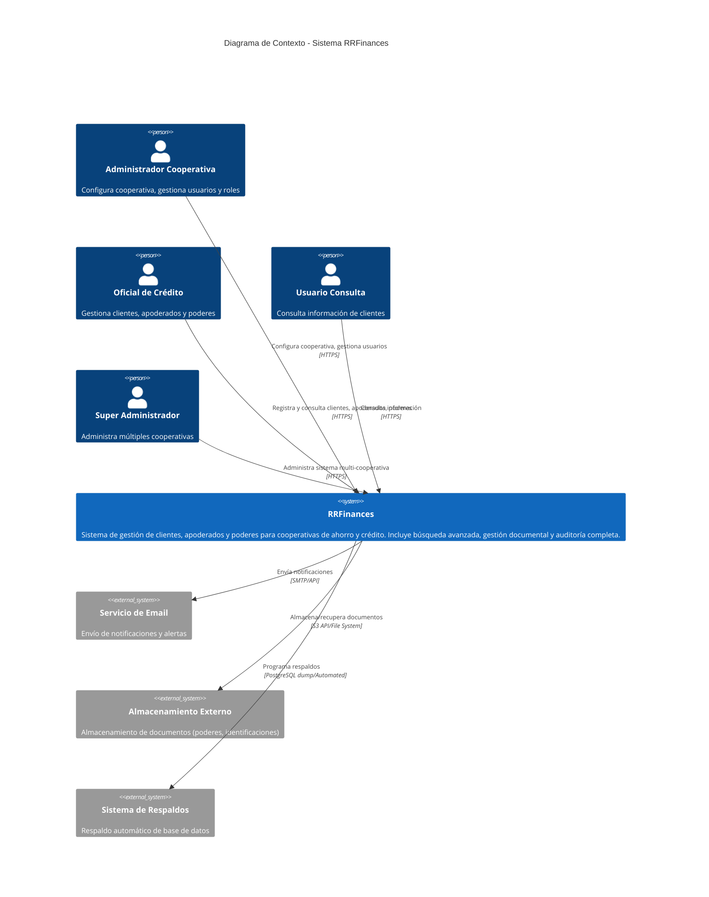
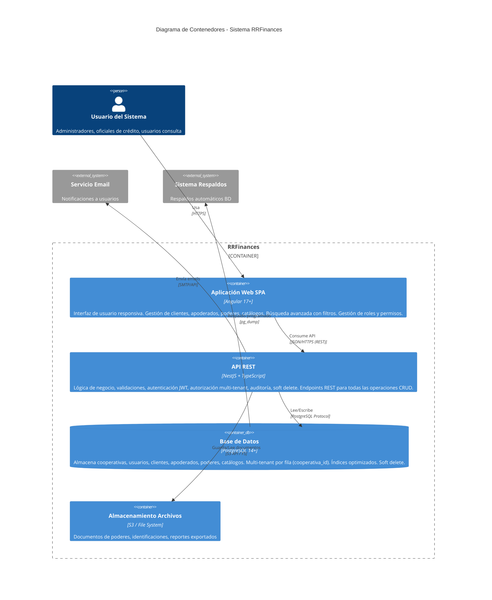

# Diagrama de Arquitectura - Modelo C4 (Niveles 1 y 2)

## Nivel 1: Diagrama de Contexto del Sistema

## Nivel 2: Diagrama de Contenedores

## Detalles de los Contenedores

### 1. Aplicación Web SPA (Angular)
- **Tecnología:** Angular 17+, TypeScript, RxJS
- **Características:**
  - Diseño responsive (desktop/tablet/mobile)
  - Lazy loading por módulos
  - Guards para protección de rutas
  - Interceptors para JWT y manejo de errores
  - State management (Signals/NgRx)
  - Formularios reactivos con validaciones
  - Tablas avanzadas con paginación, ordenamiento, filtros

### 2. API REST (NestJS)
- **Tecnología:** NestJS, TypeScript, TypeORM
- **Características:**
  - Arquitectura modular (por dominio)
  - Guards para autenticación JWT y autorización por roles/permisos
  - Interceptors para auditoría automática y multi-tenant
  - Pipes para validación (class-validator)
  - DTOs para request/response
  - Soft delete en entidades críticas
  - Swagger/OpenAPI para documentación
  - Rate limiting y throttling
  - Logging estructurado

### 3. Base de Datos (PostgreSQL)
- **Tecnología:** PostgreSQL 14+
- **Características:**
  - Multi-tenant por fila (cooperativa_id en todas las tablas)
  - Row-level security policies
  - Índices compuestos (cooperativa_id + id)
  - Índices por campos de búsqueda frecuente
  - Constraints y triggers para integridad
  - Particionamiento por cooperativa (opcional, futuro)
  - Auditoría mediante triggers o interceptors
  - Soft delete con campos fecha_eliminacion

### 4. Almacenamiento de Archivos
- **Tecnología:** AWS S3 / MinIO / File System local
- **Características:**
  - Organización por cooperativa y tipo de documento
  - Versionado de documentos (opcional)
  - URLs firmadas temporales para descarga segura
  - Límites de tamaño y tipos de archivo
  - Metadatos asociados (nombre original, tamaño, mime type)

## Patrones de Arquitectura Aplicados

### Multi-tenant (Row-Level)
- Cada registro incluye `cooperativa_id`
- Guards y interceptors filtran automáticamente por cooperativa del usuario
- Aislamiento completo de datos entre cooperativas
- Escalabilidad horizontal mediante sharding futuro

### Seguridad en Capas
1. **Frontend:** Guards, interceptors, validaciones básicas
2. **API:** Autenticación JWT, autorización RBAC (roles + permisos), validación DTOs
3. **Base de Datos:** Row-level security, constraints, triggers

### Auditoría Completa
- Tabla `audit_logs` registra todas las operaciones críticas
- Interceptor automático captura usuario, IP, timestamp, datos antes/después
- Búsqueda y filtrado de logs por módulo, acción, usuario, fecha

### Soft Delete
- Entidades críticas (clientes, apoderados, poderes, usuarios) se marcan como eliminadas
- Campos: `fecha_eliminacion`, `usuario_eliminacion`, `motivo_eliminacion`
- Filtros automáticos excluyen registros eliminados en consultas normales
- Recuperación posible desde panel administrativo

## Escalabilidad y Alta Disponibilidad (Futuro)

### Horizontal Scaling
- **Frontend:** CDN para assets estáticos, múltiples instancias SPA
- **Backend:** Load balancer + N instancias API stateless
- **Base de Datos:** Read replicas para consultas, master para escrituras

### Caché
- Redis para sesiones, catálogos frecuentes, resultados de búsquedas complejas
- Invalidación automática en actualizaciones

### Monitoreo
- Logs centralizados (ELK stack / CloudWatch)
- Métricas de performance (Prometheus + Grafana)
- Alertas automáticas por errores, latencia, uso de recursos
