# Diagrama de Modelo de Datos (Fase 1)

```mermaid
erDiagram
    %% PK/FK se indican con sufijo (PK)/(FK)

    COOPERATIVAS ||--o{ CONFIGURACIONES : tiene
    COOPERATIVAS ||--o{ OFICINAS : tiene
    COOPERATIVAS ||--o{ USUARIOS : agrupa
    COOPERATIVAS ||--o{ ROLES : define
    COOPERATIVAS ||--o{ PERMISOS : define
    COOPERATIVAS ||--o{ CATALOGOS : define
    COOPERATIVAS ||--o{ CLIENTES : agrupa
    COOPERATIVAS ||--o{ APODERADOS : agrupa
    COOPERATIVAS ||--o{ PODERES : agrupa
    COOPERATIVAS ||--o{ JOBS_EXPORTACION : genera

    PERSONAS ||--|| USUARIOS : "persona_id (FK)"
    PERSONAS ||--|| CLIENTES : "persona_id (PK_FK)"
    PERSONAS ||--o{ APODERADOS : "persona_id (PK/FK)"
    PERSONAS ||--o{ CONYUGES : "persona_id (PK/FK)"

    USUARIOS ||--o{ USUARIOS_ROLES : "usuario_id (FK)"
    ROLES ||--o{ USUARIOS_ROLES : "rol_id (FK)"

    USUARIOS ||--o{ USUARIOS_PERMISOS : "usuario_id (FK)"
    PERMISOS ||--o{ USUARIOS_PERMISOS : "permiso_id (FK)"

    USUARIOS ||--o{ SESIONES : "usuario_id (FK)"

    CATALOGOS ||--o{ CATALOGO_REGISTROS : "catalogo_id (FK)"
    CATALOGO_REGISTROS ||--o{ CATALOGO_REGISTROS : "padre_id (FK)"

    OFICINAS ||--o{ USUARIOS : "sucursal_id (FK)"

    CLIENTES ||--o{ CLIENTES_MENSAJES : "cliente_id (FK)"
    CLIENTES_MENSAJES ||--o{ CLIENTES_MENSAJES_VIS : "mensaje_id (FK)"
    USUARIOS ||--o{ CLIENTES_MENSAJES_VIS : "usuario_id (FK)"

    CLIENTES ||--o{ PODERES : "cliente_id (FK)"
    APODERADOS ||--o{ PODERES : "apoderado_id (FK)"
    CATALOGO_REGISTROS ||--o{ PODERES : "tipo_poder_id (FK)"

    PROVINCIAS ||--o{ CANTONES : "provincia_id (FK)"
    CANTONES ||--o{ PARROQUIAS : "canton_id (FK)"

    USUARIOS ||--o{ JOBS_EXPORTACION : "usuario_id (FK)"

    USUARIOS ||--o{ NOTIFICACIONES : "usuario_id (FK)"

    %% Catálogos base usados por Personas/Clientes/Usuarios
    CATALOGO_REGISTROS ||--o{ PERSONAS : "tipo_identificacion_id / genero_id / estado_civil_id / nivel_instruccion_id (FK)"
    CATALOGO_REGISTROS ||--o{ CLIENTES : "tipo_cliente_id / segmento_id (FK)"
    CATALOGO_REGISTROS ||--o{ APODERADOS : "tipo_apoderado_id (FK)"
    CATALOGO_REGISTROS ||--o{ USUARIOS : "tipo_usuario_opt estado_opt (FK)"

    %% Soft delete y multi-tenant son campos en tablas principales, no se grafican como nodos.

    %% Entidades con campos principales
    COOPERATIVAS {
        int id_pk
        string codigo
        string razon_social
        string nombre_comercial
        string ruc
        string logo_url
        json configuracion
        string estado
        datetime fecha_creacion
        int usuario_creacion
    }

    CONFIGURACIONES {
        int id_pk
        int cooperativa_id_fk
        string clave
        json valor
        string descripcion
        string estado
        datetime fecha_creacion
        int usuario_creacion
    }

    OFICINAS {
        int id_pk
        int cooperativa_id_fk
        string codigo
        string nombre
        string direccion
        string telefono
        string email
        int provincia_id_fk
        int canton_id_fk
        int parroquia_id_fk
        string estado
        datetime fecha_creacion
        int usuario_creacion
        datetime fecha_eliminacion_opt
        int usuario_eliminacion_opt
    }

    AUDIT_LOGS {
        int id_pk
        string modulo
        string accion
        string entidad
        int entidad_id
        int usuario_id_fk
        string usuario_ip
        json datos_anteriores
        json datos_nuevos
        json metadata
        datetime fecha_hora
        int cooperativa_id_fk
    }

    PERSONAS {
        int id_pk
        int tipo_identificacion_id_fk
        string numero_identificacion
        string nombres
        string apellidos
        date fecha_nacimiento
        int genero_id_fk
        int estado_civil_id_fk
        int nacionalidad_id_opt
        int nivel_instruccion_id_fk
        string profesion_opt
        string email
        string telefono_convencional_opt
        string telefono_celular_opt
        int provincia_id_fk
        int canton_id_fk
        int parroquia_id_fk
        string direccion_domicilio
        string referencia_domicilio_opt
        string codigo_dactilar_opt
        string foto_url_opt
        string estado
        datetime fecha_creacion
        int usuario_creacion
        datetime fecha_modificacion_opt
        int usuario_modificacion_opt
        datetime fecha_eliminacion_opt
        int usuario_eliminacion_opt
    }

    USUARIOS {
        int id_pk
        int persona_id_fk
        string username
        string password_hash
        string email
        string telefono_celular_opt
        int sucursal_id_fk
        string estado
        string motivo_bloqueo_opt
        datetime ultimo_login_opt
        int intentos_fallidos_opt
        int cooperativa_id_fk
        datetime fecha_creacion
        int usuario_creacion
        datetime fecha_modificacion_opt
        int usuario_modificacion_opt
        datetime fecha_eliminacion_opt
        int usuario_eliminacion_opt
    }

    ROLES {
        int id_pk
        string nombre
        string descripcion
        int nivel_privilegio
        string estado
        int cooperativa_id_fk
        datetime fecha_creacion
        int usuario_creacion
        datetime fecha_modificacion_opt
        int usuario_modificacion_opt
    }

    PERMISOS {
        int id_pk
        string codigo
        string descripcion
        string estado
        json metadata_opt
        datetime fecha_creacion
    }

    USUARIOS_ROLES {
        int id_pk
        int usuario_id_fk
        int rol_id_fk
        datetime fecha_asignacion
        int usuario_asignacion
        date vigencia_desde_opt
        date vigencia_hasta_opt
        int cooperativa_id_fk
    }

    USUARIOS_PERMISOS {
        int id_pk
        int usuario_id_fk
        int permiso_id_fk
        bool denegado
        datetime fecha_asignacion
        int usuario_asignacion
        date vigencia_desde_opt
        date vigencia_hasta_opt
        int cooperativa_id_fk
    }

    SESIONES {
        int id_pk
        int usuario_id_fk
        string token_hash
        string ip_origen
        string user_agent
        datetime fecha_inicio
        datetime fecha_expiracion
        string estado
        int cooperativa_id_fk
    }

    CATALOGOS {
        int id_pk
        string codigo
        string nombre
        string descripcion
        string tipo
        string estado
        datetime fecha_creacion
        int usuario_creacion
    }

    CATALOGO_REGISTROS {
        int id_pk
        int catalogo_id_fk
        string codigo
        string descripcion
        string descripcion_corta_opt
        int orden
        string estado
        int padre_id_opt
        json metadata_opt
        datetime fecha_creacion
        int usuario_creacion
        datetime fecha_modificacion_opt
        int usuario_modificacion_opt
    }

    PROVINCIAS {
        int id_pk
        string codigo
        string nombre
        int padre_id_opt
        string estado
        int orden
    }

    CANTONES {
        int id_pk
        string codigo
        string nombre
        int provincia_id_fk
        string estado
        int orden
    }

    PARROQUIAS {
        int id_pk
        string codigo
        string nombre
        int canton_id_fk
        string estado
        int orden
    }

    CLIENTES {
        int persona_id_pk_fk
        string codigo_cliente
        int tipo_cliente_id_fk
        date fecha_ingreso
        int oficina_id_fk
        int oficial_credito_id_opt
        int segmento_id_fk
        string estado
        string motivo_estado_opt
        int cooperativa_id_fk
        datetime fecha_creacion
        int usuario_creacion
        datetime fecha_modificacion_opt
        int usuario_modificacion_opt
        datetime fecha_eliminacion_opt
        int usuario_eliminacion_opt
    }

    CLIENTES_MENSAJES {
        int id_pk
        int cliente_id_fk
        string tipo_mensaje
        string titulo
        string descripcion
        datetime fecha_desde
        datetime fecha_hasta
        string estado
        bool requiere_confirmacion
        int cooperativa_id_fk
        datetime fecha_creacion
        int usuario_creacion
        datetime fecha_modificacion_opt
        int usuario_modificacion_opt
    }

    CLIENTES_MENSAJES_VIS {
        int id_pk
        int mensaje_id_fk
        int usuario_id_fk
        datetime fecha_visualizacion
        bool confirmado
        int cooperativa_id_fk
    }

    APODERADOS {
        int persona_id_pk_fk
        int tipo_apoderado_id_fk
        date fecha_registro
        string estado
        int cooperativa_id_fk
        datetime fecha_creacion
        int usuario_creacion
        datetime fecha_modificacion_opt
        int usuario_modificacion_opt
        datetime fecha_eliminacion_opt
        int usuario_eliminacion_opt
    }

    PODERES {
        int id_pk
        int cliente_id_fk
        int apoderado_id_fk
        int tipo_poder_id_fk
        string numero_escritura
        date fecha_otorgamiento
        date fecha_inicio
        date fecha_fin
        string notaria
        string alcance
        string documento_url
        string documento_nombre
        int documento_tamanio
        string estado
        string motivo_revocacion_opt
        int cooperativa_id_fk
        datetime fecha_creacion
        int usuario_creacion
        datetime fecha_modificacion_opt
        int usuario_modificacion_opt
        datetime fecha_eliminacion_opt
        int usuario_eliminacion_opt
    }

    CONYUGES {
        int persona_id_pk_fk
        int cliente_id_fk
        date fecha_matrimonio
        string estado
        datetime fecha_creacion
        int usuario_creacion
    }

    JOBS_EXPORTACION {
        int id_pk
        int usuario_id_fk
        int cooperativa_id_fk
        json filtros
        json columnas
        string formato
        string estado_job
        int progreso
        string resultado_url_opt
        datetime fecha_creacion
        datetime fecha_fin_opt
        string error_detalle_opt
    }

    NOTIFICACIONES {
        int id_pk
        int usuario_id_fk
        string titulo
        string mensaje
        string tipo
        string estado
        string origen
        json metadata_opt
        datetime fecha_creacion
        datetime fecha_lectura_opt
        int cooperativa_id_fk
    }
```

Notas:
- Todas las tablas principales incluyen `cooperativa_id` (multi-tenant) y campos de soft delete donde aplica (`fecha_eliminacion`, `usuario_eliminacion`, `motivo_eliminacion`).
- PERSONAS es base para USUARIOS y CLIENTES; se evita duplicidad de datos.
- Catálogos jerárquicos usan padre_id en CATALOGO_REGISTROS para Provincias/Cantones/Parroquias.
- Índices recomendados: (cooperativa_id, id) en tablas principales; búsquedas por username/email; personas.numero_identificacion; clientes.codigo_cliente; poderes (cliente_id, apoderado_id, tipo_poder_id, estado); audit_logs (usuario_id, fecha_hora, modulo, accion); sesiones (usuario_id, estado); jobs_exportacion (usuario_id, estado_job).
