# Diagrama de Componentes Backend - NestJS

## Arquitectura Modular Backend

```mermaid
graph TB
    subgraph API["NestJS API - main.ts"]
        AppModule["📦 AppModule<br/>Bootstrap + Config"]
    end

    subgraph Core["🔧 Core Modules (Infraestructura)"]
        AuthModule["🔐 AuthModule<br/>JWT, Login, Tokens<br/>Guards, Strategies"]
        ConfigModule["⚙️ ConfigModule<br/>Variables entorno<br/>Validación config"]
        DatabaseModule["🗄️ DatabaseModule<br/>TypeORM Config<br/>Conexión PostgreSQL"]
        CommonModule["🔄 CommonModule<br/>Shared utilities<br/>Base entities<br/>DTOs comunes"]
        AuditModule["📝 AuditModule<br/>Audit logging<br/>Interceptor<br/>Repository"]
    end

    subgraph Security["🛡️ Seguridad y Middleware"]
        JWTGuard["JwtAuthGuard<br/>Validación token"]
        RolesGuard["RolesGuard<br/>Validación roles"]
        PermissionsGuard["PermissionsGuard<br/>Validación permisos"]
        TenantGuard["TenantGuard<br/>Multi-tenant filter"]
        
        AuditInterceptor["AuditInterceptor<br/>Log automático"]
        TenantInterceptor["TenantInterceptor<br/>Inject cooperativa_id"]
        TransformInterceptor["TransformInterceptor<br/>Response format"]
        
        ValidationPipe["ValidationPipe<br/>class-validator"]
        SoftDeleteScope["SoftDeleteScope<br/>Exclude deleted"]
    end

    subgraph Business["💼 Business Modules (Dominio)"]
        CooperativasModule["🏢 CooperativasModule<br/>CRUD cooperativas<br/>Configuraciones"]
        UsuariosModule["👤 UsuariosModule<br/>CRUD usuarios<br/>Personas base"]
        RolesModule["🎭 RolesModule<br/>CRUD roles<br/>Asignación a usuarios"]
        PermisosModule["🔑 PermisosModule<br/>CRUD permisos<br/>Asignación granular"]
        
        CatalogosModule["📋 CatalogosModule<br/>CRUD catálogos<br/>Registros jerárquicos"]
        
        ClientesModule["👥 ClientesModule<br/>CRUD clientes<br/>Búsqueda avanzada<br/>Mensajes"]
        ApoderadosModule["⚖️ ApoderadosModule<br/>CRUD apoderados<br/>Gestión poderes"]
        PoderesModule["📜 PoderesModule<br/>CRUD poderes<br/>Upload docs<br/>Revocación"]
        
        OficinasModule["🏦 OficinasModule<br/>CRUD oficinas/sucursales"]
        ReportesModule["📊 ReportesModule<br/>Exportación datos<br/>Jobs async<br/>Excel/CSV/PDF"]
        NotificacionesModule["🔔 NotificacionesModule<br/>CRUD notificaciones<br/>Push/email"]
    end

    subgraph External["🌐 External Services"]
        EmailService["📧 EmailService<br/>Nodemailer/SendGrid"]
        StorageService["📁 StorageService<br/>S3/MinIO client<br/>Upload/Download"]
        CacheService["⚡ CacheService<br/>Redis client<br/>Cache manager"]
    end

    AppModule --> Core
    AppModule --> Security
    AppModule --> Business
    AppModule --> External

    AuthModule --> UsuariosModule
    AuthModule --> RolesModule
    AuthModule --> PermisosModule
    
    CooperativasModule --> DatabaseModule
    CooperativasModule --> AuditModule
    
    UsuariosModule --> AuthModule
    UsuariosModule --> RolesModule
    UsuariosModule --> OficinasModule
    UsuariosModule --> DatabaseModule
    
    ClientesModule --> UsuariosModule
    ClientesModule --> CatalogosModule
    ClientesModule --> OficinasModule
    ClientesModule --> NotificacionesModule
    
    ApoderadosModule --> UsuariosModule
    ApoderadosModule --> CatalogosModule
    
    PoderesModule --> ClientesModule
    PoderesModule --> ApoderadosModule
    PoderesModule --> CatalogosModule
    PoderesModule --> StorageService
    
    ReportesModule --> ClientesModule
    ReportesModule --> ApoderadosModule
    ReportesModule --> PoderesModule
    ReportesModule --> StorageService
    
    NotificacionesModule --> UsuariosModule
    NotificacionesModule --> EmailService

    Business --> JWTGuard
    Business --> TenantGuard
    Business --> AuditInterceptor
    Business --> ValidationPipe

    classDef coreStyle fill:#e3f2fd,stroke:#1976d2,stroke-width:2px
    classDef secStyle fill:#fff3e0,stroke:#f57c00,stroke-width:2px
    classDef bizStyle fill:#e8f5e9,stroke:#388e3c,stroke-width:2px
    classDef extStyle fill:#fce4ec,stroke:#c2185b,stroke-width:2px
    
    class AuthModule,ConfigModule,DatabaseModule,CommonModule,AuditModule coreStyle
    class JWTGuard,RolesGuard,PermissionsGuard,TenantGuard,AuditInterceptor,TenantInterceptor,TransformInterceptor,ValidationPipe,SoftDeleteScope secStyle
    class CooperativasModule,UsuariosModule,RolesModule,PermisosModule,CatalogosModule,ClientesModule,ApoderadosModule,PoderesModule,OficinasModule,ReportesModule,NotificacionesModule bizStyle
    class EmailService,StorageService,CacheService extStyle
```



## Detalle de Módulos por Capa

### 1. AuthModule (Autenticación y Autorización)

```typescript
// auth/auth.module.ts
@Module({
  imports: [
    JwtModule.register({
      secret: process.env.JWT_SECRET,
      signOptions: { expiresIn: '8h' }
    }),
    PassportModule,
    UsuariosModule
  ],
  controllers: [AuthController],
  providers: [
    AuthService,
    JwtStrategy,
    LocalStrategy,
    JwtAuthGuard,
    RolesGuard,
    PermissionsGuard
  ],
  exports: [AuthService, JwtAuthGuard, RolesGuard, PermissionsGuard]
})
export class AuthModule {}
```

**Controllers:**
- `POST /auth/login` - Login con username/password, retorna JWT
- `POST /auth/refresh` - Refrescar token
- `POST /auth/logout` - Invalidar sesión
- `GET /auth/profile` - Obtener perfil usuario actual

**Services:**
- `AuthService`: Validación credenciales, generación JWT, gestión sesiones
- `JwtStrategy`: Estrategia Passport para validar JWT
- `LocalStrategy`: Estrategia Passport para login local

**Guards:**
- `JwtAuthGuard`: Protege rutas, valida JWT en headers
- `RolesGuard`: Verifica roles del usuario (decorator `@Roles()`)
- `PermissionsGuard`: Verifica permisos granulares (decorator `@Permissions()`)

### 2. UsuariosModule (Gestión de Usuarios)

```typescript
@Module({
  imports: [TypeOrmModule.forFeature([Usuario, Persona, Sesion])],
  controllers: [UsuariosController, PersonasController],
  providers: [UsuariosService, PersonasService],
  exports: [UsuariosService, PersonasService]
})
export class UsuariosModule {}
```

**Endpoints:**
- `GET /usuarios` - Listar usuarios (paginado, filtros)
- `GET /usuarios/:id` - Obtener usuario por ID
- `POST /usuarios` - Crear usuario (+ persona si no existe)
- `PUT /usuarios/:id` - Actualizar usuario
- `DELETE /usuarios/:id` - Soft delete usuario
- `PATCH /usuarios/:id/cambiar-password` - Cambiar contraseña
- `PATCH /usuarios/:id/bloquear` - Bloquear/desbloquear usuario

**Entities:**
- `Usuario`: id, persona_id, username, password_hash, email, estado, cooperativa_id
- `Persona`: id, tipo_identificacion_id, numero_identificacion, nombres, apellidos, etc.
- `Sesion`: id, usuario_id, token_hash, ip_origen, fecha_inicio, estado

### 3. ClientesModule (Gestión de Clientes)

```typescript
@Module({
  imports: [
    TypeOrmModule.forFeature([Cliente, ClienteMensaje, ClienteMensajeVis]),
    UsuariosModule,
    CatalogosModule
  ],
  controllers: [ClientesController, ClientesMensajesController],
  providers: [ClientesService, BusquedaClientesService, MensajesService],
  exports: [ClientesService]
})
export class ClientesModule {}
```

**Endpoints:**
- `GET /clientes` - Listar clientes con filtros avanzados
- `GET /clientes/buscar` - Búsqueda avanzada (identificación, nombre, código)
- `GET /clientes/:id` - Obtener detalle cliente
- `POST /clientes` - Crear cliente (usa persona existente o crea nueva)
- `PUT /clientes/:id` - Actualizar cliente
- `DELETE /clientes/:id` - Soft delete cliente
- `GET /clientes/:id/mensajes` - Mensajes del cliente
- `POST /clientes/:id/mensajes` - Crear mensaje para cliente

**Services:**
- `ClientesService`: CRUD básico, validaciones
- `BusquedaClientesService`: Búsqueda avanzada con QueryBuilder, múltiples filtros
- `MensajesService`: Gestión de mensajes y visualizaciones

### 4. PoderesModule (Gestión de Poderes)

```typescript
@Module({
  imports: [
    TypeOrmModule.forFeature([Poder]),
    ClientesModule,
    ApoderadosModule,
    StorageModule
  ],
  controllers: [PoderesController],
  providers: [PoderesService, DocumentosService],
  exports: [PoderesService]
})
export class PoderesModule {}
```

**Endpoints:**
- `GET /poderes` - Listar poderes (filtros: cliente, apoderado, estado, tipo)
- `GET /poderes/:id` - Detalle poder
- `POST /poderes` - Crear poder + upload documento
- `PUT /poderes/:id` - Actualizar poder
- `PATCH /poderes/:id/revocar` - Revocar poder
- `GET /poderes/:id/documento` - Descargar documento (URL firmada)
- `POST /poderes/:id/documento` - Reemplazar documento

**Services:**
- `PoderesService`: CRUD, validación fechas, verificación poderes vigentes
- `DocumentosService`: Upload a S3, generación URLs firmadas, validación tipos archivo

### 5. CatalogosModule (Gestión de Catálogos)

```typescript
@Module({
  imports: [
    TypeOrmModule.forFeature([Catalogo, CatalogoRegistro, Provincia, Canton, Parroquia])
  ],
  controllers: [CatalogosController, GeografiaController],
  providers: [CatalogosService, GeografiaService, CacheService],
  exports: [CatalogosService]
})
export class CatalogosModule {}
```

**Endpoints:**
- `GET /catalogos` - Listar catálogos disponibles
- `GET /catalogos/:codigo/registros` - Registros de un catálogo
- `GET /geografia/provincias` - Listar provincias
- `GET /geografia/cantones/:provincia_id` - Cantones de una provincia
- `GET /geografia/parroquias/:canton_id` - Parroquias de un cantón

**Características:**
- Cache en Redis para catálogos frecuentes (TTL 1 hora)
- Soporte para catálogos jerárquicos (padre_id)

### 6. ReportesModule (Exportación y Reportes)

```typescript
@Module({
  imports: [
    TypeOrmModule.forFeature([JobExportacion]),
    ClientesModule,
    PoderesModule,
    StorageModule,
    BullModule.registerQueue({ name: 'exports' })
  ],
  controllers: [ReportesController],
  providers: [ReportesService, ExportProcessor, ExcelService, PdfService],
  exports: [ReportesService]
})
export class ReportesModule {}
```

**Endpoints:**
- `POST /reportes/clientes/exportar` - Exportar clientes (filtros, columnas, formato)
- `POST /reportes/poderes/exportar` - Exportar poderes
- `GET /reportes/jobs/:id` - Estado de un job de exportación
- `GET /reportes/jobs/:id/descargar` - Descargar resultado

**Características:**
- Jobs asíncronos con Bull (Redis queue)
- Progreso en tiempo real
- Formatos: Excel, CSV, PDF
- Límite: 10,000 registros por export

### 7. AuditModule (Auditoría)

```typescript
@Module({
  imports: [TypeOrmModule.forFeature([AuditLog])],
  providers: [AuditService, AuditInterceptor],
  exports: [AuditService, AuditInterceptor]
})
export class AuditModule {}
```

**Características:**
- Interceptor global que captura todas las operaciones POST/PUT/PATCH/DELETE
- Registra: módulo, acción, entidad, entidad_id, usuario_id, IP, datos antes/después
- Consulta de logs por módulo, usuario, fecha, acción

## Guards y Interceptors Globales

### Guards (Orden de Ejecución)

1. **JwtAuthGuard**
   ```typescript
   @Injectable()
   export class JwtAuthGuard extends AuthGuard('jwt') {
     // Valida JWT en Authorization header
     // Inyecta user en request
   }
   ```

2. **TenantGuard**
   ```typescript
   @Injectable()
   export class TenantGuard implements CanActivate {
     canActivate(context: ExecutionContext): boolean {
       const request = context.switchToHttp().getRequest();
       const user = request.user;
       // Inyecta cooperativa_id del usuario en request
       request.cooperativaId = user.cooperativa_id;
       return true;
     }
   }
   ```

3. **RolesGuard**
   ```typescript
   @Injectable()
   export class RolesGuard implements CanActivate {
     canActivate(context: ExecutionContext): boolean {
       const requiredRoles = this.reflector.get<string[]>('roles', context.getHandler());
       if (!requiredRoles) return true;
       
       const { user } = context.switchToHttp().getRequest();
       return requiredRoles.some(role => user.roles?.includes(role));
     }
   }
   ```

4. **PermissionsGuard**
   ```typescript
   @Injectable()
   export class PermissionsGuard implements CanActivate {
     canActivate(context: ExecutionContext): boolean {
       const requiredPermissions = this.reflector.get<string[]>('permissions', context.getHandler());
       if (!requiredPermissions) return true;
       
       const { user } = context.switchToHttp().getRequest();
       return requiredPermissions.every(perm => user.permissions?.includes(perm));
     }
   }
   ```

### Interceptors (Orden de Ejecución)

1. **TenantInterceptor**
   ```typescript
   @Injectable()
   export class TenantInterceptor implements NestInterceptor {
     intercept(context: ExecutionContext, next: CallHandler): Observable<any> {
       const request = context.switchToHttp().getRequest();
       const cooperativaId = request.cooperativaId;
       
       // Añade WHERE cooperativa_id = X a todos los queries de TypeORM
       return next.handle();
     }
   }
   ```

2. **AuditInterceptor**
   ```typescript
   @Injectable()
   export class AuditInterceptor implements NestInterceptor {
     intercept(context: ExecutionContext, next: CallHandler): Observable<any> {
       const request = context.switchToHttp().getRequest();
       const method = request.method;
       
       if (['POST', 'PUT', 'PATCH', 'DELETE'].includes(method)) {
         // Captura datos antes de la operación
         // Ejecuta operación
         // Captura datos después
         // Guarda en audit_logs
       }
       
       return next.handle();
     }
   }
   ```

3. **TransformInterceptor**
   ```typescript
   @Injectable()
   export class TransformInterceptor implements NestInterceptor {
     intercept(context: ExecutionContext, next: CallHandler): Observable<any> {
       return next.handle().pipe(
         map(data => ({
           success: true,
           data,
           timestamp: new Date().toISOString()
         }))
       );
     }
   }
   ```

4. **SoftDeleteInterceptor**
   ```typescript
   @Injectable()
   export class SoftDeleteInterceptor implements NestInterceptor {
     intercept(context: ExecutionContext, next: CallHandler): Observable<any> {
       // Añade WHERE fecha_eliminacion IS NULL a todos los queries
       return next.handle();
     }
   }
   ```

## Pipes de Validación

### ValidationPipe (Global)
```typescript
app.useGlobalPipes(
  new ValidationPipe({
    whitelist: true, // Remueve propiedades no definidas en DTO
    forbidNonWhitelisted: true, // Lanza error si hay propiedades extras
    transform: true, // Transforma tipos automáticamente
    transformOptions: {
      enableImplicitConversion: true
    }
  })
);
```

### DTOs con class-validator

```typescript
export class CreateClienteDto {
  @IsInt()
  @IsOptional()
  persona_id?: number;

  @IsString()
  @Length(5, 20)
  codigo_cliente: string;

  @IsInt()
  tipo_cliente_id: number;

  @IsDateString()
  fecha_ingreso: string;

  @IsInt()
  oficina_id: number;

  @IsInt()
  segmento_id: number;

  @IsEnum(['activo', 'inactivo', 'bloqueado'])
  estado: string;
}
```

## Base Repository Pattern

```typescript
@Injectable()
export abstract class BaseRepository<T> {
  constructor(
    protected readonly repository: Repository<T>,
    @Inject(REQUEST) protected readonly request: Request
  ) {}

  async findAll(options?: FindManyOptions<T>): Promise<T[]> {
    const cooperativaId = this.request['cooperativaId'];
    
    return this.repository.find({
      ...options,
      where: {
        ...options?.where,
        cooperativa_id: cooperativaId,
        fecha_eliminacion: IsNull() // Soft delete filter
      }
    });
  }

  async create(entity: DeepPartial<T>): Promise<T> {
    const cooperativaId = this.request['cooperativaId'];
    const userId = this.request['user'].id;
    
    const newEntity = this.repository.create({
      ...entity,
      cooperativa_id: cooperativaId,
      usuario_creacion: userId,
      fecha_creacion: new Date()
    });
    
    return this.repository.save(newEntity);
  }

  async softDelete(id: number, motivo: string): Promise<void> {
    const userId = this.request['user'].id;
    
    await this.repository.update(id, {
      fecha_eliminacion: new Date(),
      usuario_eliminacion: userId,
      motivo_eliminacion: motivo
    } as any);
  }
}
```

## Estructura de Carpetas Backend

```
src/
├── main.ts                          # Bootstrap aplicación
├── app.module.ts                    # Módulo raíz
├── config/                          # Configuración
│   ├── database.config.ts
│   ├── jwt.config.ts
│   └── app.config.ts
├── common/                          # Utilidades compartidas
│   ├── decorators/
│   │   ├── roles.decorator.ts
│   │   ├── permissions.decorator.ts
│   │   └── current-user.decorator.ts
│   ├── entities/
│   │   └── base.entity.ts          # Campos comunes
│   ├── dto/
│   │   ├── pagination.dto.ts
│   │   └── response.dto.ts
│   ├── filters/
│   │   ├── http-exception.filter.ts
│   │   └── all-exceptions.filter.ts
│   └── utils/
│       ├── crypto.util.ts
│       └── date.util.ts
├── auth/                            # Módulo autenticación
│   ├── auth.module.ts
│   ├── auth.controller.ts
│   ├── auth.service.ts
│   ├── strategies/
│   │   ├── jwt.strategy.ts
│   │   └── local.strategy.ts
│   ├── guards/
│   │   ├── jwt-auth.guard.ts
│   │   ├── roles.guard.ts
│   │   └── permissions.guard.ts
│   └── dto/
│       ├── login.dto.ts
│       └── auth-response.dto.ts
├── usuarios/                        # Módulo usuarios
│   ├── usuarios.module.ts
│   ├── controllers/
│   │   ├── usuarios.controller.ts
│   │   └── personas.controller.ts
│   ├── services/
│   │   ├── usuarios.service.ts
│   │   └── personas.service.ts
│   ├── entities/
│   │   ├── usuario.entity.ts
│   │   ├── persona.entity.ts
│   │   └── sesion.entity.ts
│   ├── dto/
│   │   ├── create-usuario.dto.ts
│   │   ├── update-usuario.dto.ts
│   │   └── create-persona.dto.ts
│   └── repositories/
│       ├── usuarios.repository.ts
│       └── personas.repository.ts
├── clientes/                        # Módulo clientes
│   ├── clientes.module.ts
│   ├── controllers/
│   │   ├── clientes.controller.ts
│   │   └── mensajes.controller.ts
│   ├── services/
│   │   ├── clientes.service.ts
│   │   ├── busqueda.service.ts
│   │   └── mensajes.service.ts
│   ├── entities/
│   │   ├── cliente.entity.ts
│   │   ├── cliente-mensaje.entity.ts
│   │   └── cliente-mensaje-vis.entity.ts
│   └── dto/
│       ├── create-cliente.dto.ts
│       ├── busqueda-cliente.dto.ts
│       └── create-mensaje.dto.ts
├── poderes/                         # Módulo poderes
│   ├── poderes.module.ts
│   ├── poderes.controller.ts
│   ├── services/
│   │   ├── poderes.service.ts
│   │   └── documentos.service.ts
│   ├── entities/
│   │   └── poder.entity.ts
│   └── dto/
│       └── create-poder.dto.ts
├── audit/                           # Módulo auditoría
│   ├── audit.module.ts
│   ├── audit.service.ts
│   ├── audit.interceptor.ts
│   └── entities/
│       └── audit-log.entity.ts
└── external/                        # Servicios externos
    ├── storage/
    │   └── storage.service.ts
    ├── email/
    │   └── email.service.ts
    └── cache/
        └── cache.service.ts
```

## Configuración de TypeORM

```typescript
TypeOrmModule.forRootAsync({
  imports: [ConfigModule],
  inject: [ConfigService],
  useFactory: (config: ConfigService) => ({
    type: 'postgres',
    host: config.get('DB_HOST'),
    port: config.get('DB_PORT'),
    username: config.get('DB_USERNAME'),
    password: config.get('DB_PASSWORD'),
    database: config.get('DB_DATABASE'),
    entities: [__dirname + '/**/*.entity{.ts,.js}'],
    synchronize: false, // Solo en desarrollo
    logging: config.get('NODE_ENV') === 'development',
    migrations: [__dirname + '/migrations/*{.ts,.js}'],
    migrationsRun: true,
    extra: {
      max: 100, // Conexiones máximas en pool
      idleTimeoutMillis: 30000
    }
  })
})
```
