# Diagrama de Componentes Frontend - Angular

## Arquitectura Modular Frontend

```mermaid
graph TB
    subgraph App["Angular Application - main.ts"]
        AppComponent["🏠 AppComponent<br/>Root + Router Outlet"]
        AppModule["📦 AppModule<br/>Bootstrap"]
    end

    subgraph Core["🔧 Core Module (Singleton)"]
        AuthService["🔐 AuthService<br/>Login, Logout<br/>Token management"]
        AuthGuard["🛡️ AuthGuard<br/>Route protection"]
        AuthInterceptor["📡 AuthInterceptor<br/>JWT injection"]
        
        ErrorInterceptor["⚠️ ErrorInterceptor<br/>Error handling<br/>Retry logic"]
        LoadingInterceptor["⏳ LoadingInterceptor<br/>Loading state"]
        
        NotificationService["🔔 NotificationService<br/>Toasts/Alerts"]
        StorageService["💾 StorageService<br/>LocalStorage/Session"]
    end

    subgraph Shared["🔄 Shared Module"]
        SharedComponents["📦 Shared Components<br/>Buttons, Inputs<br/>Cards, Modals<br/>Tables, Pagination"]
        SharedDirectives["📝 Directives<br/>HasRole<br/>HasPermission<br/>AutoFocus"]
        SharedPipes["🔄 Pipes<br/>Date, Currency<br/>Truncate, Safe"]
    end

    subgraph Layout["🖼️ Layout Module"]
        MainLayout["MainLayoutComponent<br/>Header + Sidebar + Content"]
        HeaderComponent["HeaderComponent<br/>User menu, Notif"]
        SidebarComponent["SidebarComponent<br/>Navigation menu"]
        FooterComponent["FooterComponent"]
    end

    subgraph Features["💼 Feature Modules (Lazy)"]
        AuthModule["🔐 Auth Module<br/>Login<br/>Recuperar password"]
        
        DashboardModule["📊 Dashboard Module<br/>Home<br/>Estadísticas<br/>Accesos rápidos"]
        
        UsuariosModule["👤 Usuarios Module<br/>Lista usuarios<br/>Crear/editar usuario<br/>Asignar roles"]
        
        ClientesModule["👥 Clientes Module<br/>Lista clientes<br/>Buscar cliente<br/>Detalle cliente<br/>Mensajes"]
        
        ApoderadosModule["⚖️ Apoderados Module<br/>Lista apoderados<br/>Crear/editar apoderado"]
        
        PoderesModule["📜 Poderes Module<br/>Lista poderes<br/>Crear poder<br/>Upload documento<br/>Revocar poder"]
        
        CatalogosModule["📋 Catálogos Module<br/>Gestión catálogos<br/>Registros jerárquicos"]
        
        ReportesModule["📈 Reportes Module<br/>Exportar datos<br/>Historial exports"]
        
        ConfigModule["⚙️ Configuración Module<br/>Config cooperativa<br/>Roles y permisos<br/>Oficinas"]
    end

    subgraph State["📦 State Management"]
        AuthState["AuthState<br/>User, Token, Roles"]
        CatalogosState["CatalogosState<br/>Cached catalogs"]
        UIState["UIState<br/>Loading, Sidebar"]
    end

    AppModule --> Core
    AppModule --> Shared
    AppModule --> Layout
    AppModule --> Features
    
    Features --> Shared
    Features --> Core
    Features --> State
    
    Layout --> Shared
    Layout --> AuthService
    
    AuthModule --> AuthService
    ClientesModule --> NotificationService
    
    UsuariosModule --> AuthGuard
    ClientesModule --> AuthGuard
    PoderesModule --> AuthGuard

    classDef coreStyle fill:#e3f2fd,stroke:#1976d2,stroke-width:2px
    classDef sharedStyle fill:#f3e5f5,stroke:#7b1fa2,stroke-width:2px
    classDef layoutStyle fill:#fff3e0,stroke:#f57c00,stroke-width:2px
    classDef featureStyle fill:#e8f5e9,stroke:#388e3c,stroke-width:2px
    classDef stateStyle fill:#fce4ec,stroke:#c2185b,stroke-width:2px
    
    class AuthService,AuthGuard,AuthInterceptor,ErrorInterceptor,LoadingInterceptor,NotificationService,StorageService coreStyle
    class SharedComponents,SharedDirectives,SharedPipes sharedStyle
    class MainLayout,HeaderComponent,SidebarComponent,FooterComponent layoutStyle
    class AuthModule,DashboardModule,UsuariosModule,ClientesModule,ApoderadosModule,PoderesModule,CatalogosModule,ReportesModule,ConfigModule featureStyle
    class AuthState,CatalogosState,UIState stateStyle
```



## Detalle de Módulos por Capa

### 1. Core Module (Singleton Services)

```typescript
@NgModule({
  imports: [HttpClientModule, CommonModule],
  providers: [
    AuthService,
    AuthGuard,
    { provide: HTTP_INTERCEPTORS, useClass: AuthInterceptor, multi: true },
    { provide: HTTP_INTERCEPTORS, useClass: ErrorInterceptor, multi: true },
    { provide: HTTP_INTERCEPTORS, useClass: LoadingInterceptor, multi: true },
    NotificationService,
    StorageService,
    LoadingService
  ]
})
export class CoreModule {
  constructor(@Optional() @SkipSelf() parentModule: CoreModule) {
    if (parentModule) {
      throw new Error('CoreModule is already loaded. Import it in AppModule only');
    }
  }
}
```

**AuthService**
```typescript
@Injectable({ providedIn: 'root' })
export class AuthService {
  private currentUserSubject = new BehaviorSubject<User | null>(null);
  public currentUser$ = this.currentUserSubject.asObservable();

  login(credentials: LoginDto): Observable<AuthResponse> {
    return this.http.post<AuthResponse>('/api/auth/login', credentials).pipe(
      tap(response => {
        this.storageService.setItem('token', response.token);
        this.storageService.setItem('refreshToken', response.refreshToken);
        this.currentUserSubject.next(response.user);
      })
    );
  }

  logout(): void {
    this.storageService.clear();
    this.currentUserSubject.next(null);
    this.router.navigate(['/login']);
  }

  hasRole(role: string): boolean {
    return this.currentUserSubject.value?.roles?.includes(role) ?? false;
  }

  hasPermission(permission: string): boolean {
    return this.currentUserSubject.value?.permissions?.includes(permission) ?? false;
  }
}
```

**AuthGuard**
```typescript
@Injectable({ providedIn: 'root' })
export class AuthGuard implements CanActivate {
  canActivate(
    route: ActivatedRouteSnapshot,
    state: RouterStateSnapshot
  ): boolean {
    const token = this.storageService.getItem('token');
    
    if (!token) {
      this.router.navigate(['/login'], { queryParams: { returnUrl: state.url } });
      return false;
    }

    // Validar roles requeridos
    const requiredRoles = route.data['roles'] as string[];
    if (requiredRoles && !this.authService.hasRole(requiredRoles[0])) {
      this.router.navigate(['/unauthorized']);
      return false;
    }

    return true;
  }
}
```

**AuthInterceptor**
```typescript
@Injectable()
export class AuthInterceptor implements HttpInterceptor {
  intercept(req: HttpRequest<any>, next: HttpHandler): Observable<HttpEvent<any>> {
    const token = this.storageService.getItem('token');
    
    if (token) {
      req = req.clone({
        setHeaders: {
          Authorization: `Bearer ${token}`
        }
      });
    }

    return next.handle(req).pipe(
      catchError(error => {
        if (error.status === 401) {
          this.authService.logout();
        }
        return throwError(() => error);
      })
    );
  }
}
```

### 2. Shared Module (Componentes Reutilizables)

```typescript
@NgModule({
  imports: [CommonModule, ReactiveFormsModule, MaterialModule],
  declarations: [
    // Components
    ButtonComponent,
    CardComponent,
    ModalComponent,
    TableComponent,
    PaginationComponent,
    SearchInputComponent,
    FileUploadComponent,
    ConfirmDialogComponent,
    
    // Directives
    HasRoleDirective,
    HasPermissionDirective,
    AutoFocusDirective,
    
    // Pipes
    TruncatePipe,
    SafePipe,
    DateAgoPipe
  ],
  exports: [
    CommonModule,
    ReactiveFormsModule,
    MaterialModule,
    // Components
    ButtonComponent,
    CardComponent,
    ModalComponent,
    TableComponent,
    PaginationComponent,
    SearchInputComponent,
    FileUploadComponent,
    // Directives
    HasRoleDirective,
    HasPermissionDirective,
    AutoFocusDirective,
    // Pipes
    TruncatePipe,
    SafePipe,
    DateAgoPipe
  ]
})
export class SharedModule {}
```

**TableComponent (Reutilizable)**
```typescript
@Component({
  selector: 'app-table',
  template: `
    <table>
      <thead>
        <tr>
          <th *ngFor="let col of columns" 
              (click)="onSort(col)"
              [class.sortable]="col.sortable">
            {{ col.label }}
            <span *ngIf="sortColumn === col.field">
              {{ sortDirection === 'asc' ? '↑' : '↓' }}
            </span>
          </th>
        </tr>
      </thead>
      <tbody>
        <tr *ngFor="let row of data">
          <td *ngFor="let col of columns">
            <ng-container *ngIf="col.template; else defaultCell">
              <ng-container *ngTemplateOutlet="col.template; context: { $implicit: row }">
              </ng-container>
            </ng-container>
            <ng-template #defaultCell>
              {{ row[col.field] }}
            </ng-template>
          </td>
        </tr>
      </tbody>
    </table>
    
    <app-pagination
      [page]="page"
      [pageSize]="pageSize"
      [total]="total"
      (pageChange)="onPageChange($event)">
    </app-pagination>
  `
})
export class TableComponent {
  @Input() columns: TableColumn[] = [];
  @Input() data: any[] = [];
  @Input() page = 1;
  @Input() pageSize = 10;
  @Input() total = 0;
  @Output() pageChange = new EventEmitter<number>();
  @Output() sortChange = new EventEmitter<SortEvent>();

  sortColumn: string | null = null;
  sortDirection: 'asc' | 'desc' = 'asc';

  onSort(column: TableColumn): void {
    if (!column.sortable) return;
    
    if (this.sortColumn === column.field) {
      this.sortDirection = this.sortDirection === 'asc' ? 'desc' : 'asc';
    } else {
      this.sortColumn = column.field;
      this.sortDirection = 'asc';
    }
    
    this.sortChange.emit({ column: column.field, direction: this.sortDirection });
  }
}
```

**HasRoleDirective**
```typescript
@Directive({ selector: '[appHasRole]' })
export class HasRoleDirective implements OnInit {
  @Input() appHasRole!: string | string[];

  constructor(
    private templateRef: TemplateRef<any>,
    private viewContainer: ViewContainerRef,
    private authService: AuthService
  ) {}

  ngOnInit(): void {
    const roles = Array.isArray(this.appHasRole) ? this.appHasRole : [this.appHasRole];
    const hasRole = roles.some(role => this.authService.hasRole(role));
    
    if (hasRole) {
      this.viewContainer.createEmbeddedView(this.templateRef);
    } else {
      this.viewContainer.clear();
    }
  }
}
```

### 3. Feature Module - ClientesModule

```typescript
const routes: Routes = [
  {
    path: '',
    component: ClientesLayoutComponent,
    canActivate: [AuthGuard],
    children: [
      { path: '', component: ClientesListComponent },
      { path: 'buscar', component: ClientesBuscarComponent },
      { path: 'nuevo', component: ClienteFormComponent },
      { path: ':id', component: ClienteDetalleComponent },
      { path: ':id/editar', component: ClienteFormComponent },
      { path: ':id/mensajes', component: ClienteMensajesComponent }
    ]
  }
];

@NgModule({
  imports: [
    CommonModule,
    SharedModule,
    RouterModule.forChild(routes)
  ],
  declarations: [
    ClientesLayoutComponent,
    ClientesListComponent,
    ClientesBuscarComponent,
    ClienteFormComponent,
    ClienteDetalleComponent,
    ClienteMensajesComponent
  ],
  providers: [
    ClientesService,
    ClientesFacade
  ]
})
export class ClientesModule {}
```

**ClientesListComponent**
```typescript
@Component({
  selector: 'app-clientes-list',
  template: `
    <div class="clientes-container">
      <app-card>
        <div class="header">
          <h2>Gestión de Clientes</h2>
          <button *appHasPermission="'clientes.crear'" 
                  (click)="onCreate()">
            Nuevo Cliente
          </button>
        </div>

        <div class="filters">
          <input [(ngModel)]="filters.search" 
                 (ngModelChange)="onSearch()"
                 placeholder="Buscar por código, identificación, nombre...">
          
          <select [(ngModel)]="filters.tipo" (ngModelChange)="onFilter()">
            <option value="">Todos los tipos</option>
            <option *ngFor="let tipo of tiposCliente$ | async" [value]="tipo.id">
              {{ tipo.descripcion }}
            </option>
          </select>

          <select [(ngModel)]="filters.estado" (ngModelChange)="onFilter()">
            <option value="">Todos los estados</option>
            <option value="activo">Activo</option>
            <option value="inactivo">Inactivo</option>
          </select>
        </div>

        <app-table
          [columns]="columns"
          [data]="clientes$ | async"
          [page]="page"
          [pageSize]="pageSize"
          [total]="total$ | async"
          (pageChange)="onPageChange($event)"
          (sortChange)="onSortChange($event)">
        </app-table>
      </app-card>
    </div>
  `
})
export class ClientesListComponent implements OnInit {
  clientes$ = this.facade.clientes$;
  total$ = this.facade.total$;
  tiposCliente$ = this.catalogosService.getRegistros('TIPO_CLIENTE');

  filters = { search: '', tipo: '', estado: '' };
  page = 1;
  pageSize = 10;

  columns: TableColumn[] = [
    { field: 'codigo_cliente', label: 'Código', sortable: true },
    { field: 'persona.numero_identificacion', label: 'Identificación', sortable: true },
    { field: 'persona.nombres', label: 'Nombres', sortable: true },
    { field: 'persona.apellidos', label: 'Apellidos', sortable: true },
    { field: 'tipo_cliente.descripcion', label: 'Tipo' },
    { field: 'estado', label: 'Estado' },
    { 
      field: 'actions', 
      label: 'Acciones',
      template: this.actionsTemplate
    }
  ];

  constructor(
    private facade: ClientesFacade,
    private catalogosService: CatalogosService,
    private router: Router
  ) {}

  ngOnInit(): void {
    this.loadClientes();
  }

  loadClientes(): void {
    this.facade.loadClientes({
      page: this.page,
      pageSize: this.pageSize,
      ...this.filters
    });
  }

  onSearch = debounce(() => this.loadClientes(), 500);
  onFilter(): void { this.loadClientes(); }
  onPageChange(page: number): void {
    this.page = page;
    this.loadClientes();
  }
  onSortChange(event: SortEvent): void {
    this.facade.setSort(event);
    this.loadClientes();
  }

  onCreate(): void {
    this.router.navigate(['/clientes/nuevo']);
  }

  onEdit(cliente: Cliente): void {
    this.router.navigate(['/clientes', cliente.persona_id, 'editar']);
  }

  onDelete(cliente: Cliente): void {
    const ref = this.dialog.open(ConfirmDialogComponent, {
      data: {
        title: 'Eliminar Cliente',
        message: `¿Está seguro de eliminar al cliente ${cliente.persona.nombres}?`
      }
    });

    ref.afterClosed().subscribe(confirmed => {
      if (confirmed) {
        this.facade.deleteCliente(cliente.persona_id);
      }
    });
  }
}
```

**ClientesService**
```typescript
@Injectable()
export class ClientesService {
  private baseUrl = '/api/clientes';

  constructor(private http: HttpClient) {}

  getClientes(params: ClientesQueryParams): Observable<PaginatedResponse<Cliente>> {
    return this.http.get<PaginatedResponse<Cliente>>(this.baseUrl, { params: params as any });
  }

  getCliente(id: number): Observable<Cliente> {
    return this.http.get<Cliente>(`${this.baseUrl}/${id}`);
  }

  buscarClientes(query: BusquedaClienteDto): Observable<Cliente[]> {
    return this.http.post<Cliente[]>(`${this.baseUrl}/buscar`, query);
  }

  createCliente(data: CreateClienteDto): Observable<Cliente> {
    return this.http.post<Cliente>(this.baseUrl, data);
  }

  updateCliente(id: number, data: UpdateClienteDto): Observable<Cliente> {
    return this.http.put<Cliente>(`${this.baseUrl}/${id}`, data);
  }

  deleteCliente(id: number, motivo: string): Observable<void> {
    return this.http.delete<void>(`${this.baseUrl}/${id}`, { body: { motivo } });
  }

  getMensajes(clienteId: number): Observable<ClienteMensaje[]> {
    return this.http.get<ClienteMensaje[]>(`${this.baseUrl}/${clienteId}/mensajes`);
  }
}
```

**ClientesFacade (State Management)**
```typescript
@Injectable()
export class ClientesFacade {
  private clientesSubject = new BehaviorSubject<Cliente[]>([]);
  private totalSubject = new BehaviorSubject<number>(0);
  private loadingSubject = new BehaviorSubject<boolean>(false);

  public clientes$ = this.clientesSubject.asObservable();
  public total$ = this.totalSubject.asObservable();
  public loading$ = this.loadingSubject.asObservable();

  constructor(
    private clientesService: ClientesService,
    private notificationService: NotificationService
  ) {}

  loadClientes(params: ClientesQueryParams): void {
    this.loadingSubject.next(true);
    
    this.clientesService.getClientes(params).subscribe({
      next: response => {
        this.clientesSubject.next(response.data);
        this.totalSubject.next(response.total);
        this.loadingSubject.next(false);
      },
      error: error => {
        this.notificationService.error('Error al cargar clientes');
        this.loadingSubject.next(false);
      }
    });
  }

  deleteCliente(id: number): void {
    this.clientesService.deleteCliente(id, 'Eliminado por usuario').subscribe({
      next: () => {
        this.notificationService.success('Cliente eliminado correctamente');
        // Recargar lista
        const current = this.clientesSubject.value;
        this.clientesSubject.next(current.filter(c => c.persona_id !== id));
      },
      error: () => {
        this.notificationService.error('Error al eliminar cliente');
      }
    });
  }
}
```

### 4. Feature Module - PoderesModule

**PoderesFormComponent**
```typescript
@Component({
  selector: 'app-poder-form',
  template: `
    <app-card>
      <h2>{{ isEdit ? 'Editar' : 'Nuevo' }} Poder</h2>

      <form [formGroup]="form" (ngSubmit)="onSubmit()">
        <div class="form-grid">
          <!-- Selección de Cliente -->
          <div class="form-field">
            <label>Cliente *</label>
            <app-search-input
              formControlName="cliente_id"
              [searchFn]="searchClientes"
              displayField="persona.nombres"
              placeholder="Buscar cliente...">
            </app-search-input>
          </div>

          <!-- Selección de Apoderado -->
          <div class="form-field">
            <label>Apoderado *</label>
            <app-search-input
              formControlName="apoderado_id"
              [searchFn]="searchApoderados"
              displayField="persona.nombres"
              placeholder="Buscar apoderado...">
            </app-search-input>
          </div>

          <!-- Tipo de Poder -->
          <div class="form-field">
            <label>Tipo de Poder *</label>
            <select formControlName="tipo_poder_id">
              <option value="">Seleccione...</option>
              <option *ngFor="let tipo of tiposPoder$ | async" [value]="tipo.id">
                {{ tipo.descripcion }}
              </option>
            </select>
          </div>

          <!-- Número Escritura -->
          <div class="form-field">
            <label>Número Escritura *</label>
            <input type="text" formControlName="numero_escritura">
          </div>

          <!-- Fechas -->
          <div class="form-field">
            <label>Fecha Otorgamiento *</label>
            <input type="date" formControlName="fecha_otorgamiento">
          </div>

          <div class="form-field">
            <label>Fecha Inicio *</label>
            <input type="date" formControlName="fecha_inicio">
          </div>

          <div class="form-field">
            <label>Fecha Fin</label>
            <input type="date" formControlName="fecha_fin">
          </div>

          <!-- Notaría -->
          <div class="form-field">
            <label>Notaría *</label>
            <input type="text" formControlName="notaria">
          </div>

          <!-- Alcance -->
          <div class="form-field full-width">
            <label>Alcance del Poder *</label>
            <textarea formControlName="alcance" rows="4"></textarea>
          </div>

          <!-- Upload Documento -->
          <div class="form-field full-width">
            <label>Documento del Poder *</label>
            <app-file-upload
              formControlName="documento"
              [accept]="'.pdf,.jpg,.png'"
              [maxSize]="5242880"
              (fileSelected)="onFileSelected($event)">
            </app-file-upload>
            <small>Formatos permitidos: PDF, JPG, PNG. Tamaño máximo: 5MB</small>
          </div>
        </div>

        <div class="form-actions">
          <button type="button" (click)="onCancel()">Cancelar</button>
          <button type="submit" [disabled]="form.invalid || uploading">
            {{ uploading ? 'Guardando...' : 'Guardar' }}
          </button>
        </div>
      </form>
    </app-card>
  `
})
export class PoderFormComponent implements OnInit {
  form: FormGroup;
  isEdit = false;
  poderId?: number;
  uploading = false;

  tiposPoder$ = this.catalogosService.getRegistros('TIPO_PODER');

  constructor(
    private fb: FormBuilder,
    private poderesService: PoderesService,
    private catalogosService: CatalogosService,
    private route: ActivatedRoute,
    private router: Router,
    private notificationService: NotificationService
  ) {
    this.form = this.fb.group({
      cliente_id: ['', Validators.required],
      apoderado_id: ['', Validators.required],
      tipo_poder_id: ['', Validators.required],
      numero_escritura: ['', [Validators.required, Validators.maxLength(50)]],
      fecha_otorgamiento: ['', Validators.required],
      fecha_inicio: ['', Validators.required],
      fecha_fin: [''],
      notaria: ['', [Validators.required, Validators.maxLength(200)]],
      alcance: ['', [Validators.required, Validators.maxLength(1000)]],
      documento: [null, Validators.required]
    });
  }

  ngOnInit(): void {
    this.poderId = this.route.snapshot.params['id'];
    if (this.poderId) {
      this.isEdit = true;
      this.loadPoder();
    }
  }

  loadPoder(): void {
    this.poderesService.getPoder(this.poderId!).subscribe({
      next: poder => {
        this.form.patchValue(poder);
        // El documento ya existe, no es requerido en edición
        this.form.get('documento')?.clearValidators();
      }
    });
  }

  searchClientes = (query: string) => {
    return this.clientesService.buscarClientes({ search: query, limit: 10 });
  };

  searchApoderados = (query: string) => {
    return this.apoderadosService.buscarApoderados({ search: query, limit: 10 });
  };

  onFileSelected(file: File): void {
    this.form.patchValue({ documento: file });
  }

  onSubmit(): void {
    if (this.form.invalid) return;

    this.uploading = true;
    const formData = new FormData();
    
    Object.keys(this.form.value).forEach(key => {
      if (this.form.value[key] !== null) {
        formData.append(key, this.form.value[key]);
      }
    });

    const request = this.isEdit
      ? this.poderesService.updatePoder(this.poderId!, formData)
      : this.poderesService.createPoder(formData);

    request.subscribe({
      next: () => {
        this.notificationService.success('Poder guardado correctamente');
        this.router.navigate(['/poderes']);
      },
      error: error => {
        this.notificationService.error('Error al guardar poder');
        this.uploading = false;
      }
    });
  }

  onCancel(): void {
    this.router.navigate(['/poderes']);
  }
}
```

### 5. Routing Configuration

```typescript
// app-routing.module.ts
const routes: Routes = [
  { 
    path: 'login', 
    loadChildren: () => import('./auth/auth.module').then(m => m.AuthModule)
  },
  {
    path: '',
    component: MainLayoutComponent,
    canActivate: [AuthGuard],
    children: [
      { 
        path: '', 
        redirectTo: 'dashboard', 
        pathMatch: 'full' 
      },
      {
        path: 'dashboard',
        loadChildren: () => import('./dashboard/dashboard.module').then(m => m.DashboardModule)
      },
      {
        path: 'usuarios',
        loadChildren: () => import('./usuarios/usuarios.module').then(m => m.UsuariosModule),
        data: { roles: ['admin', 'supervisor'] }
      },
      {
        path: 'clientes',
        loadChildren: () => import('./clientes/clientes.module').then(m => m.ClientesModule)
      },
      {
        path: 'apoderados',
        loadChildren: () => import('./apoderados/apoderados.module').then(m => m.ApoderadosModule)
      },
      {
        path: 'poderes',
        loadChildren: () => import('./poderes/poderes.module').then(m => m.PoderesModule)
      },
      {
        path: 'catalogos',
        loadChildren: () => import('./catalogos/catalogos.module').then(m => m.CatalogosModule),
        data: { roles: ['admin'] }
      },
      {
        path: 'reportes',
        loadChildren: () => import('./reportes/reportes.module').then(m => m.ReportesModule)
      },
      {
        path: 'configuracion',
        loadChildren: () => import('./configuracion/configuracion.module').then(m => m.ConfiguracionModule),
        data: { roles: ['admin'] }
      }
    ]
  },
  { 
    path: 'unauthorized', 
    component: UnauthorizedComponent 
  },
  { 
    path: '**', 
    component: NotFoundComponent 
  }
];
```

## Estructura de Carpetas Frontend

```
src/
├── main.ts                          # Bootstrap
├── app/
│   ├── app.component.ts             # Root component
│   ├── app.module.ts                # Root module
│   ├── app-routing.module.ts        # Root routing
│   │
│   ├── core/                        # Core module (singleton)
│   │   ├── core.module.ts
│   │   ├── services/
│   │   │   ├── auth.service.ts
│   │   │   ├── storage.service.ts
│   │   │   ├── notification.service.ts
│   │   │   ├── loading.service.ts
│   │   │   └── error-handler.service.ts
│   │   ├── guards/
│   │   │   ├── auth.guard.ts
│   │   │   ├── role.guard.ts
│   │   │   └── permission.guard.ts
│   │   ├── interceptors/
│   │   │   ├── auth.interceptor.ts
│   │   │   ├── error.interceptor.ts
│   │   │   └── loading.interceptor.ts
│   │   └── models/
│   │       ├── user.model.ts
│   │       ├── auth-response.model.ts
│   │       └── api-response.model.ts
│   │
│   ├── shared/                      # Shared module
│   │   ├── shared.module.ts
│   │   ├── components/
│   │   │   ├── button/
│   │   │   ├── card/
│   │   │   ├── modal/
│   │   │   ├── table/
│   │   │   ├── pagination/
│   │   │   ├── search-input/
│   │   │   ├── file-upload/
│   │   │   └── confirm-dialog/
│   │   ├── directives/
│   │   │   ├── has-role.directive.ts
│   │   │   ├── has-permission.directive.ts
│   │   │   └── auto-focus.directive.ts
│   │   ├── pipes/
│   │   │   ├── truncate.pipe.ts
│   │   │   ├── safe.pipe.ts
│   │   │   └── date-ago.pipe.ts
│   │   └── models/
│   │       ├── table-column.model.ts
│   │       └── pagination.model.ts
│   │
│   ├── layout/                      # Layout components
│   │   ├── layout.module.ts
│   │   ├── main-layout/
│   │   │   └── main-layout.component.ts
│   │   ├── header/
│   │   │   └── header.component.ts
│   │   ├── sidebar/
│   │   │   └── sidebar.component.ts
│   │   └── footer/
│   │       └── footer.component.ts
│   │
│   ├── features/                    # Feature modules (lazy loaded)
│   │   │
│   │   ├── auth/
│   │   │   ├── auth.module.ts
│   │   │   ├── auth-routing.module.ts
│   │   │   ├── login/
│   │   │   ├── forgot-password/
│   │   │   └── reset-password/
│   │   │
│   │   ├── dashboard/
│   │   │   ├── dashboard.module.ts
│   │   │   ├── dashboard-routing.module.ts
│   │   │   └── dashboard.component.ts
│   │   │
│   │   ├── usuarios/
│   │   │   ├── usuarios.module.ts
│   │   │   ├── usuarios-routing.module.ts
│   │   │   ├── services/
│   │   │   │   ├── usuarios.service.ts
│   │   │   │   └── usuarios.facade.ts
│   │   │   ├── components/
│   │   │   │   ├── usuarios-list/
│   │   │   │   ├── usuario-form/
│   │   │   │   └── usuario-detalle/
│   │   │   └── models/
│   │   │       └── usuario.model.ts
│   │   │
│   │   ├── clientes/
│   │   │   ├── clientes.module.ts
│   │   │   ├── clientes-routing.module.ts
│   │   │   ├── services/
│   │   │   │   ├── clientes.service.ts
│   │   │   │   └── clientes.facade.ts
│   │   │   ├── components/
│   │   │   │   ├── clientes-list/
│   │   │   │   ├── clientes-buscar/
│   │   │   │   ├── cliente-form/
│   │   │   │   ├── cliente-detalle/
│   │   │   │   └── cliente-mensajes/
│   │   │   └── models/
│   │   │       └── cliente.model.ts
│   │   │
│   │   ├── apoderados/
│   │   │   ├── apoderados.module.ts
│   │   │   ├── apoderados-routing.module.ts
│   │   │   ├── services/
│   │   │   ├── components/
│   │   │   └── models/
│   │   │
│   │   ├── poderes/
│   │   │   ├── poderes.module.ts
│   │   │   ├── poderes-routing.module.ts
│   │   │   ├── services/
│   │   │   │   └── poderes.service.ts
│   │   │   ├── components/
│   │   │   │   ├── poderes-list/
│   │   │   │   ├── poder-form/
│   │   │   │   └── poder-detalle/
│   │   │   └── models/
│   │   │       └── poder.model.ts
│   │   │
│   │   ├── catalogos/
│   │   │   ├── catalogos.module.ts
│   │   │   └── ...
│   │   │
│   │   ├── reportes/
│   │   │   ├── reportes.module.ts
│   │   │   └── ...
│   │   │
│   │   └── configuracion/
│   │       ├── configuracion.module.ts
│   │       └── ...
│   │
│   └── state/                       # State management (opcional)
│       ├── auth/
│       │   ├── auth.state.ts
│       │   └── auth.actions.ts
│       └── catalogos/
│           ├── catalogos.state.ts
│           └── catalogos.actions.ts
│
├── assets/                          # Assets estáticos
│   ├── images/
│   ├── icons/
│   └── i18n/
│
├── environments/                    # Configuración por ambiente
│   ├── environment.ts
│   ├── environment.prod.ts
│   └── environment.staging.ts
│
└── styles/                          # Estilos globales
    ├── _variables.scss
    ├── _mixins.scss
    ├── _typography.scss
    └── styles.scss
```

## Configuración Angular

### angular.json (Build optimizations)
```json
{
  "projects": {
    "rrfinances": {
      "architect": {
        "build": {
          "configurations": {
            "production": {
              "optimization": true,
              "outputHashing": "all",
              "sourceMap": false,
              "namedChunks": false,
              "aot": true,
              "extractLicenses": true,
              "vendorChunk": false,
              "buildOptimizer": true,
              "budgets": [
                {
                  "type": "initial",
                  "maximumWarning": "2mb",
                  "maximumError": "5mb"
                }
              ]
            }
          }
        }
      }
    }
  }
}
```

### Environment Configuration
```typescript
// environment.prod.ts
export const environment = {
  production: true,
  apiUrl: 'https://api.rrfinances.com',
  wsUrl: 'wss://api.rrfinances.com/ws',
  storagePrefix: 'rrfinances_',
  tokenKey: 'auth_token',
  refreshTokenKey: 'refresh_token',
  sessionTimeout: 480, // 8 horas en minutos
  enableDebugTools: false
};
```

## Patrones y Mejores Prácticas

### 1. Lazy Loading
- Todos los feature modules se cargan bajo demanda
- Reduce el bundle inicial
- Mejora performance de carga

### 2. Reactive Forms
- Validaciones declarativas
- Control granular de estado
- Fácil testing

### 3. RxJS Best Practices
- Unsubscribe automático con `async` pipe
- Operators: `debounceTime`, `distinctUntilChanged`, `switchMap`
- Error handling con `catchError`

### 4. Component Communication
- Input/Output para parent-child
- Services para siblings
- Facade pattern para state management

### 5. Performance
- OnPush change detection strategy
- TrackBy en *ngFor
- Lazy loading de imágenes
- Virtual scrolling para listas largas
