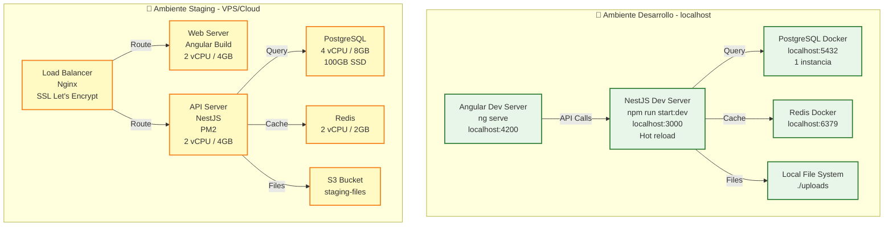
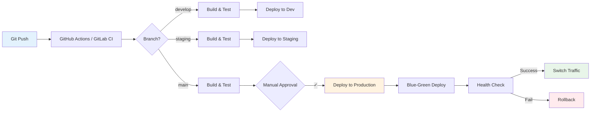

# Diagrama de Despliegue - RRFinances

## Diagrama de Despliegue - Ambiente Producción

```mermaid
graph TB
    subgraph Internet["Internet"]
        Users["👥 Usuarios<br/>Navegadores Web"]
    end

    subgraph DMZ["DMZ / Red Pública"]
        LB["⚖️ Load Balancer<br/>Nginx / AWS ALB<br/>SSL/TLS Termination<br/>Port 443"]
        CDN["🌐 CDN<br/>CloudFlare / CloudFront<br/>Assets estáticos<br/>Caché global"]
        WAF["🛡️ WAF<br/>Web Application Firewall<br/>Protección DDoS<br/>Reglas seguridad"]
    end

    subgraph AppTier["Capa de Aplicación - Red Privada"]
        Web1["🖥️ Web Server 1<br/>Nginx<br/>Angular SPA<br/>2 vCPU / 4GB RAM"]
        Web2["🖥️ Web Server 2<br/>Nginx<br/>Angular SPA<br/>2 vCPU / 4GB RAM"]
        
        API1["⚙️ API Server 1<br/>NestJS + Node.js 20<br/>PM2 cluster mode<br/>4 vCPU / 8GB RAM"]
        API2["⚙️ API Server 2<br/>NestJS + Node.js 20<br/>PM2 cluster mode<br/>4 vCPU / 8GB RAM"]
        API3["⚙️ API Server 3<br/>NestJS + Node.js 20<br/>PM2 cluster mode<br/>4 vCPU / 8GB RAM"]
    end

    subgraph DataTier["Capa de Datos - Red Privada"]
        DBMaster["🗄️ PostgreSQL Master<br/>PostgreSQL 15<br/>8 vCPU / 16GB RAM<br/>500GB SSD<br/>Write operations"]
        DBReplica1["🗄️ PostgreSQL Replica 1<br/>Read operations<br/>8 vCPU / 16GB RAM<br/>500GB SSD"]
        DBReplica2["🗄️ PostgreSQL Replica 2<br/>Read operations<br/>8 vCPU / 16GB RAM<br/>500GB SSD"]
        
        Redis["⚡ Redis Cluster<br/>Cache + Sessions<br/>4 vCPU / 8GB RAM<br/>In-memory"]
        
        FileStorage["📁 File Storage<br/>S3 / MinIO<br/>Documentos y exports<br/>1TB storage"]
    end

    subgraph Monitoring["Monitoreo y Logs"]
        LogServer["📊 Log Server<br/>ELK Stack / Loki<br/>Logs centralizados"]
        Metrics["📈 Metrics Server<br/>Prometheus + Grafana<br/>Métricas y alertas"]
    end

    subgraph Backup["Respaldos"]
        BackupServer["💾 Backup Server<br/>Respaldos automáticos<br/>DB + Files<br/>Retención 30 días"]
    end

    Users -->|HTTPS| WAF
    WAF -->|Filtrado| CDN
    CDN -->|Assets| Users
    WAF -->|API/App| LB
    
    LB -->|Round Robin| Web1
    LB -->|Round Robin| Web2
    LB -->|Round Robin| API1
    LB -->|Round Robin| API2
    LB -->|Round Robin| API3
    
    Web1 -.->|Sirve| CDN
    Web2 -.->|Sirve| CDN
    
    API1 -->|Write| DBMaster
    API2 -->|Write| DBMaster
    API3 -->|Write| DBMaster
    
    API1 -->|Read| DBReplica1
    API2 -->|Read| DBReplica2
    API3 -->|Read| DBReplica1
    
    DBMaster -->|Replicación<br/>Streaming| DBReplica1
    DBMaster -->|Replicación<br/>Streaming| DBReplica2
    
    API1 -->|Cache/Sessions| Redis
    API2 -->|Cache/Sessions| Redis
    API3 -->|Cache/Sessions| Redis
    
    API1 -->|Upload/Download| FileStorage
    API2 -->|Upload/Download| FileStorage
    API3 -->|Upload/Download| FileStorage
    
    API1 -.->|Logs| LogServer
    API2 -.->|Logs| LogServer
    API3 -.->|Logs| LogServer
    Web1 -.->|Logs| LogServer
    Web2 -.->|Logs| LogServer
    
    API1 -.->|Métricas| Metrics
    API2 -.->|Métricas| Metrics
    API3 -.->|Métricas| Metrics
    DBMaster -.->|Métricas| Metrics
    
    DBMaster -->|Backup diario| BackupServer
    FileStorage -->|Backup semanal| BackupServer

    classDef publicZone fill:#e1f5ff,stroke:#01579b,stroke-width:2px
    classDef appZone fill:#fff3e0,stroke:#e65100,stroke-width:2px
    classDef dataZone fill:#f1f8e9,stroke:#33691e,stroke-width:2px
    classDef monitorZone fill:#fce4ec,stroke:#880e4f,stroke-width:2px
    
    class LB,CDN,WAF publicZone
    class Web1,Web2,API1,API2,API3 appZone
    class DBMaster,DBReplica1,DBReplica2,Redis,FileStorage dataZone
    class LogServer,Metrics,BackupServer monitorZone
```

## Diagrama de Despliegue - Ambientes Desarrollo y Staging

## Especificaciones de Infraestructura

### Ambiente Producción

#### Load Balancer
- **Tipo:** AWS Application Load Balancer / Nginx
- **Configuración:**
  - SSL/TLS termination (certificados Let's Encrypt o AWS Certificate Manager)
  - Health checks cada 30s
  - Sticky sessions por IP o cookie
  - Timeout: 60s
  - Rate limiting: 100 req/s por IP

#### Web Servers (Angular SPA)
- **Cantidad:** 2 instancias (escalable a N)
- **Especificaciones:** 2 vCPU, 4GB RAM, 50GB SSD
- **Software:**
  - Ubuntu 22.04 LTS
  - Nginx 1.24+ (reverse proxy + static files)
  - Build Angular optimizado (AOT, lazy loading)
- **Auto-scaling:** CPU > 70% → agregar instancia

#### API Servers (NestJS)
- **Cantidad:** 3 instancias (escalable a N)
- **Especificaciones:** 4 vCPU, 8GB RAM, 100GB SSD
- **Software:**
  - Ubuntu 22.04 LTS
  - Node.js 20 LTS
  - PM2 cluster mode (4 workers por instancia)
  - NestJS build optimizado
- **Auto-scaling:** CPU > 75% o Memory > 80% → agregar instancia

#### PostgreSQL Master
- **Especificaciones:** 8 vCPU, 16GB RAM, 500GB SSD (NVMe)
- **Configuración:**
  - PostgreSQL 15
  - Conexiones máximas: 200
  - shared_buffers: 4GB
  - effective_cache_size: 12GB
  - work_mem: 32MB
  - maintenance_work_mem: 1GB
  - Replicación streaming asíncrona

#### PostgreSQL Replicas (Read)
- **Cantidad:** 2 instancias
- **Especificaciones:** 8 vCPU, 16GB RAM, 500GB SSD
- **Hot standby:** Lectura permitida
- **Lag máximo:** < 1 segundo

#### Redis Cluster
- **Especificaciones:** 4 vCPU, 8GB RAM
- **Configuración:**
  - Redis 7.x
  - Cluster mode (3 masters + 3 replicas)
  - Persistencia RDB cada 15 min
  - Eviction policy: allkeys-lru
  - Maxmemory: 6GB

#### File Storage
- **Tipo:** AWS S3 / MinIO self-hosted
- **Capacidad:** 1TB (expandible)
- **Configuración:**
  - Versionado habilitado
  - Lifecycle: archivos > 1 año → Glacier
  - Bucket policies por cooperativa
  - CORS configurado para uploads directos

### Ambiente Staging

- **Web + API:** 1 servidor (2 vCPU, 4GB RAM)
- **Base de Datos:** PostgreSQL single instance (4 vCPU, 8GB RAM)
- **Redis:** Single instance (2 vCPU, 2GB RAM)
- **Storage:** S3 bucket separado
- **Propósito:** Testing pre-producción, demos, QA

### Ambiente Desarrollo

- **Local:** Docker Compose con todos los servicios
- **Base de Datos:** PostgreSQL container con datos de prueba
- **Hot Reload:** Frontend (ng serve) y Backend (nest start:dev)

## Estrategia de Despliegue

### CI/CD Pipeline

### Proceso de Despliegue a Producción

1. **Build:**
   - Frontend: `ng build --configuration production`
   - Backend: `npm run build`
   - Tests: unit + integration

2. **Deploy Blue-Green:**
   - Levantar nueva versión en "green" environment
   - Health checks (5 min)
   - Switch gradual de tráfico (10% → 50% → 100%)
   - Monitoreo de errores en tiempo real

3. **Rollback automático si:**
   - Error rate > 5%
   - Response time > 2s (p95)
   - Health checks fallan

4. **Post-deploy:**
   - Validación de funcionalidades críticas
   - Monitoreo extendido (1 hora)
   - Notificación a equipo

## Seguridad en Infraestructura

### Segmentación de Red
- **DMZ:** Load Balancer, WAF, CDN (acceso público)
- **App Tier:** Web servers, API servers (privada, acceso desde DMZ)
- **Data Tier:** Bases de datos, Redis, Storage (privada, acceso solo desde App Tier)

### Firewalls y Security Groups
- **DMZ → App:** Puertos 80, 443, 3000
- **App → Data:** Puertos 5432 (PostgreSQL), 6379 (Redis), S3 API
- **SSH:** Solo desde VPN/bastion host, key-based auth
- **Outbound:** Restringido a servicios específicos

### Certificados SSL/TLS
- Let's Encrypt con renovación automática
- TLS 1.3, cipher suites seguros
- HSTS habilitado

### Backups
- **Base de Datos:** 
  - Full backup diario (retención 30 días)
  - Incremental cada 6 horas
  - Backup replicado a región secundaria
- **Archivos:** Backup semanal, retención 90 días
- **Pruebas de restauración:** Mensual

## Monitoreo y Alertas

### Métricas Clave (SLIs)
- **Disponibilidad:** > 99.5% uptime
- **Latencia:** p95 < 500ms, p99 < 1s
- **Error rate:** < 0.5%
- **Saturación:** CPU < 80%, Memory < 85%, Disk < 90%

### Alertas Críticas
- API down > 2 minutos
- Base de datos master down
- Disk usage > 90%
- Error rate > 5%
- Replica lag > 10 segundos

### Dashboards
- Overview: health general del sistema
- Performance: latencias, throughput, error rates
- Infrastructure: CPU, memoria, disco, red
- Business: usuarios activos, operaciones por cooperativa
