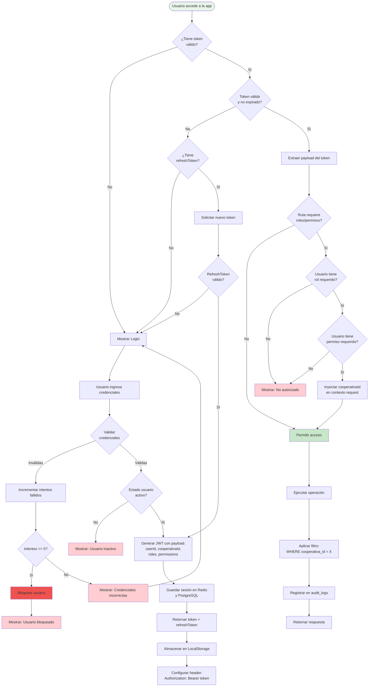
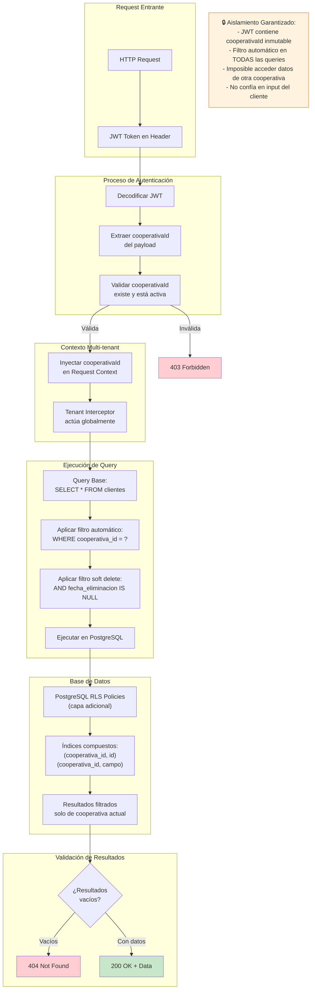
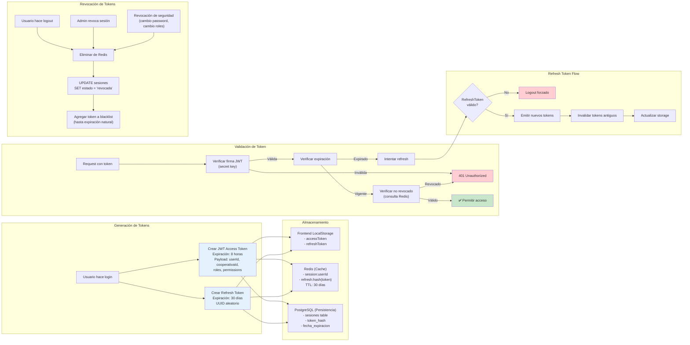

# Diagrama de Seguridad - RRFinances

## 1. Arquitectura de Seguridad en Capas

```mermaid
graph TB
    subgraph Layer1["Capa 1: Perímetro"]
        WAF["WAF / Firewall<br/>- DDoS Protection<br/>- SQL Injection<br/>- XSS Prevention<br/>- Rate Limiting"]
        CDN["CDN<br/>- SSL/TLS<br/>- HTTPS Only<br/>- HSTS"]
    end

    subgraph Layer2["Capa 2: Aplicación Frontend"]
        AuthGuard["Auth Guards<br/>- Route Protection<br/>- Role Validation"]
        CSP["Content Security Policy<br/>- Script Sources<br/>- Frame Ancestors"]
        Sanitization["Input Sanitization<br/>- XSS Prevention<br/>- HTML Escape"]
    end

    subgraph Layer3["Capa 3: API Backend"]
        JWTAuth["JWT Authentication<br/>- Token Validation<br/>- Signature Verify"]
        RBAC["RBAC Authorization<br/>- Roles Check<br/>- Permissions Check"]
        TenantIsolation["Tenant Isolation<br/>- cooperativa_id Filter<br/>- Auto-inject Context"]
        RateLimit["Rate Limiting<br/>- Throttling<br/>- IP Whitelist"]
        InputValidation["Input Validation<br/>- DTOs<br/>- class-validator<br/>- Sanitization"]
        CORS["CORS<br/>- Allowed Origins<br/>- Credentials"]
    end

    subgraph Layer4["Capa 4: Base de Datos"]
        RowLevel["Row-Level Security<br/>- PostgreSQL Policies<br/>- cooperativa_id"]
        Encryption["Encryption at Rest<br/>- Sensitive Data<br/>- Passwords: bcrypt"]
        Parameterized["Parameterized Queries<br/>- SQL Injection Prevention<br/>- TypeORM Safe"]
        Audit["Audit Trail<br/>- All Operations<br/>- User Tracking"]
    end

    subgraph Layer5["Capa 5: Infraestructura"]
        NetworkSeg["Network Segmentation<br/>- Private Subnets<br/>- Security Groups"]
        Encryption2["Encryption in Transit<br/>- TLS 1.3<br/>- mTLS (Internal)"]
        Secrets["Secrets Management<br/>- Vault / AWS Secrets<br/>- No Hardcoded Keys"]
        Backup["Encrypted Backups<br/>- AES-256<br/>- Off-site Storage"]
    end

    User["👤 Usuario"] -->|HTTPS| WAF
    WAF --> CDN
    CDN --> Layer2
    Layer2 --> Layer3
    Layer3 --> Layer4
    Layer4 --> Layer5

    classDef perimeterStyle fill:#ffebee,stroke:#c62828,stroke-width:2px
    classDef frontendStyle fill:#e3f2fd,stroke:#1565c0,stroke-width:2px
    classDef apiStyle fill:#fff3e0,stroke:#e65100,stroke-width:2px
    classDef dbStyle fill:#e8f5e9,stroke:#2e7d32,stroke-width:2px
    classDef infraStyle fill:#f3e5f5,stroke:#6a1b9a,stroke-width:2px

    class WAF,CDN perimeterStyle
    class AuthGuard,CSP,Sanitization frontendStyle
    class JWTAuth,RBAC,TenantIsolation,RateLimit,InputValidation,CORS apiStyle
    class RowLevel,Encryption,Parameterized,Audit dbStyle
    class NetworkSeg,Encryption2,Secrets,Backup infraStyle
```



## 2. Flujo de Autenticación y Autorización



## 3. Arquitectura Multi-tenant (Row-Level Security)



## 4. Gestión de Tokens y Sesiones



## 5. Matriz de Amenazas y Mitigaciones

### Amenazas OWASP Top 10 y Controles

| Amenaza | Descripción | Mitigación en RRFinances | Capa |
|---------|-------------|--------------------------|------|
| **A01: Broken Access Control** | Usuario accede a recursos sin autorización | - Guards JWT + Roles + Permissions<br/>- Multi-tenant automático (cooperativa_id)<br/>- Validación en cada endpoint | API |
| **A02: Cryptographic Failures** | Exposición de datos sensibles | - HTTPS/TLS 1.3 obligatorio<br/>- Passwords con bcrypt (cost 12)<br/>- Tokens firmados con HS256<br/>- Encryption at rest (PostgreSQL) | Todas |
| **A03: Injection** | SQL Injection, NoSQL Injection | - TypeORM con parameterized queries<br/>- Validación de inputs (DTOs)<br/>- Sanitización automática<br/>- WAF con reglas anti-injection | API/DB |
| **A04: Insecure Design** | Fallas en diseño de seguridad | - Security by design (multi-tenant, audit)<br/>- Rate limiting por IP/usuario<br/>- Soft delete (no eliminación física)<br/>- Transacciones ACID | Diseño |
| **A05: Security Misconfiguration** | Configuraciones inseguras | - Environment variables para secretos<br/>- CORS restringido a dominios conocidos<br/>- Headers de seguridad (HSTS, CSP)<br/>- Desactivar endpoints debug en prod | Infraestructura |
| **A06: Vulnerable Components** | Librerías con vulnerabilidades | - Dependencias actualizadas (npm audit)<br/>- Renovación automática de seguridad<br/>- Escaneo con Snyk/Dependabot | DevOps |
| **A07: Authentication Failures** | Fallas en autenticación | - JWT con expiración corta (8h)<br/>- Refresh tokens seguros<br/>- Bloqueo tras 5 intentos fallidos<br/>- MFA (futuro) | API |
| **A08: Software & Data Integrity** | Manipulación de código/datos | - Audit logs inmutables<br/>- Firma de tokens JWT<br/>- Validación de checksums (uploads)<br/>- CI/CD con firma de artifacts | API/DevOps |
| **A09: Logging & Monitoring Failures** | Falta de visibilidad | - Audit logs de todas las operaciones<br/>- Centralized logging (ELK)<br/>- Alertas en tiempo real<br/>- Retention 90 días mínimo | Monitoreo |
| **A10: Server-Side Request Forgery** | Requests maliciosos desde servidor | - Validación de URLs en uploads<br/>- Whitelist de dominios permitidos<br/>- Network segmentation | API |

## 6. Controles de Seguridad Específicos

### 6.1 Passwords y Credenciales

```typescript
// Hashing de passwords
import * as bcrypt from 'bcrypt';

const SALT_ROUNDS = 12; // Costo computacional alto

async function hashPassword(plainPassword: string): Promise<string> {
  return bcrypt.hash(plainPassword, SALT_ROUNDS);
}

async function verifyPassword(plainPassword: string, hash: string): Promise<boolean> {
  return bcrypt.compare(plainPassword, hash);
}

// Políticas de password
const PASSWORD_POLICY = {
  minLength: 12,
  requireUppercase: true,
  requireLowercase: true,
  requireNumbers: true,
  requireSpecialChars: true,
  preventCommon: true, // Lista de 10,000 passwords comunes
  preventReuse: 5, // No reutilizar últimas 5 passwords
  expirationDays: 90 // Cambio obligatorio cada 90 días
};
```

### 6.2 Rate Limiting y Throttling

```typescript
// Configuración de rate limiting
@Throttle(100, 60) // 100 requests por minuto
@Controller('api')
export class AppController {
  
  @Throttle(5, 60) // 5 intentos de login por minuto
  @Post('auth/login')
  async login() { }
  
  @Throttle(10, 60) // 10 búsquedas por minuto
  @Get('clientes/buscar')
  async search() { }
}

// IP Whitelisting para APIs internas
const IP_WHITELIST = [
  '10.0.0.0/8',      // Red interna
  '192.168.0.0/16',  // Red privada
  // IPs específicas de cooperativas
];
```

### 6.3 CORS y Headers de Seguridad

```typescript
// CORS Configuration
app.enableCors({
  origin: [
    'https://app.rrfinances.com',
    'https://staging.rrfinances.com',
    /\.rrfinances\.com$/ // Subdominios autorizados
  ],
  credentials: true,
  methods: ['GET', 'POST', 'PUT', 'PATCH', 'DELETE'],
  allowedHeaders: ['Authorization', 'Content-Type'],
  exposedHeaders: ['X-Total-Count'],
  maxAge: 3600
});

// Security Headers
app.use(helmet({
  contentSecurityPolicy: {
    directives: {
      defaultSrc: ["'self'"],
      scriptSrc: ["'self'", "'unsafe-inline'"],
      styleSrc: ["'self'", "'unsafe-inline'"],
      imgSrc: ["'self'", 'data:', 'https:'],
      connectSrc: ["'self'", 'https://api.rrfinances.com'],
      fontSrc: ["'self'"],
      objectSrc: ["'none'"],
      upgradeInsecureRequests: []
    }
  },
  hsts: {
    maxAge: 31536000, // 1 año
    includeSubDomains: true,
    preload: true
  },
  frameguard: { action: 'deny' },
  noSniff: true,
  xssFilter: true
}));
```

### 6.4 Validación y Sanitización de Inputs

```typescript
// DTO con validaciones exhaustivas
export class CreateClienteDto {
  @IsInt()
  @Min(1)
  @IsOptional()
  persona_id?: number;

  @IsString()
  @Length(5, 20)
  @Matches(/^[A-Z0-9-]+$/, { message: 'Código inválido' })
  @Transform(({ value }) => value.trim().toUpperCase())
  codigo_cliente: string;

  @IsString()
  @Length(10, 13)
  @Matches(/^[0-9]+$/)
  @Transform(({ value }) => value.replace(/[^0-9]/g, ''))
  numero_identificacion: string;

  @IsEmail()
  @Transform(({ value }) => value.toLowerCase().trim())
  email: string;

  @IsString()
  @MaxLength(1000)
  @Transform(({ value }) => sanitizeHtml(value, { allowedTags: [] }))
  observaciones?: string;
}
```

### 6.5 Protección contra CSRF

```typescript
// CSRF Token en formularios críticos
import * as csurf from 'csurf';

app.use(csurf({ 
  cookie: {
    httpOnly: true,
    secure: true,
    sameSite: 'strict'
  }
}));

// Frontend incluye token en headers
httpClient.interceptors.request.use(config => {
  const csrfToken = getCookie('XSRF-TOKEN');
  if (csrfToken) {
    config.headers['X-XSRF-TOKEN'] = csrfToken;
  }
  return config;
});
```

### 6.6 Audit Trail Inmutable

```typescript
// Audit log con hash chain para inmutabilidad
interface AuditLog {
  id: number;
  modulo: string;
  accion: string;
  entidad: string;
  entidad_id: number;
  usuario_id: number;
  usuario_ip: string;
  datos_anteriores: object;
  datos_nuevos: object;
  fecha_hora: Date;
  cooperativa_id: number;
  hash_anterior: string; // Hash del log anterior
  hash_actual: string;    // SHA-256 de este log + hash_anterior
}

// Verificación de integridad
function verificarIntegridad(logs: AuditLog[]): boolean {
  for (let i = 1; i < logs.length; i++) {
    const esperado = calcularHash(logs[i], logs[i-1].hash_actual);
    if (esperado !== logs[i].hash_actual) {
      return false; // Cadena rota, posible manipulación
    }
  }
  return true;
}
```

## 7. Checklist de Seguridad para Despliegue

### Pre-Producción
- [ ] Todas las dependencias actualizadas (`npm audit fix`)
- [ ] Secretos en environment variables, no hardcoded
- [ ] SSL/TLS certificados válidos y renovación automática
- [ ] Backup automatizado y testeo de restauración
- [ ] Rate limiting configurado
- [ ] WAF con reglas actualizadas
- [ ] CORS restringido a dominios de producción
- [ ] Headers de seguridad habilitados (Helmet)
- [ ] Logging y monitoreo activos
- [ ] Plan de respuesta a incidentes documentado

### Post-Despliegue
- [ ] Escaneo de vulnerabilidades (OWASP ZAP, Burp Suite)
- [ ] Penetration testing
- [ ] Validación de aislamiento multi-tenant
- [ ] Pruebas de carga con rate limiting
- [ ] Verificación de audit logs
- [ ] Validación de backups cifrados
- [ ] Revisión de logs de acceso
- [ ] Monitoreo de alertas de seguridad

### Operación Continua
- [ ] Rotación de secretos trimestral
- [ ] Revisión de permisos y roles mensual
- [ ] Análisis de logs de auditoría semanal
- [ ] Actualización de dependencias quincenal
- [ ] Revisión de políticas de seguridad semestral
- [ ] Capacitación del equipo en seguridad anual

## 8. Respuesta a Incidentes de Seguridad

### Niveles de Severidad

| Nivel | Descripción | Tiempo de Respuesta | Escalamiento |
|-------|-------------|---------------------|--------------|
| **P0 - Crítico** | Brecha de seguridad activa, datos expuestos | 15 minutos | CTO + CEO |
| **P1 - Alto** | Vulnerabilidad explotable, sin evidencia de explotación | 1 hora | Líder Técnico |
| **P2 - Medio** | Vulnerabilidad potencial, requiere condiciones específicas | 4 horas | Equipo DevOps |
| **P3 - Bajo** | Mejora de seguridad, sin riesgo inmediato | 1 semana | Backlog |

### Procedimiento de Respuesta

1. **Detección y Notificación** (0-15 min)
   - Alerta automática o reporte manual
   - Evaluación inicial de severidad
   - Notificación al equipo de seguridad

2. **Contención** (15-60 min)
   - Aislar sistema afectado
   - Revocar tokens comprometidos
   - Bloquear IPs sospechosas
   - Activar modo mantenimiento si es necesario

3. **Investigación** (1-4 horas)
   - Análisis de logs de auditoría
   - Identificación de vector de ataque
   - Evaluación de datos afectados
   - Preservación de evidencia

4. **Erradicación** (4-24 horas)
   - Patchear vulnerabilidad
   - Eliminar backdoors o malware
   - Cambiar credenciales comprometidas
   - Deploy de fix en producción

5. **Recuperación** (24-48 horas)
   - Restaurar servicios afectados
   - Validar integridad de datos
   - Monitoreo intensivo
   - Comunicación a usuarios afectados

6. **Post-Mortem** (1 semana)
   - Documentar incidente completo
   - Lecciones aprendidas
   - Mejoras al sistema
   - Actualizar procedimientos

## Contactos de Seguridad

- **Security Team**: security@rrfinances.com
- **Vulnerability Reports**: security-reports@rrfinances.com (PGP key available)
- **Emergency Hotline**: +593-XXX-XXXX (24/7)
