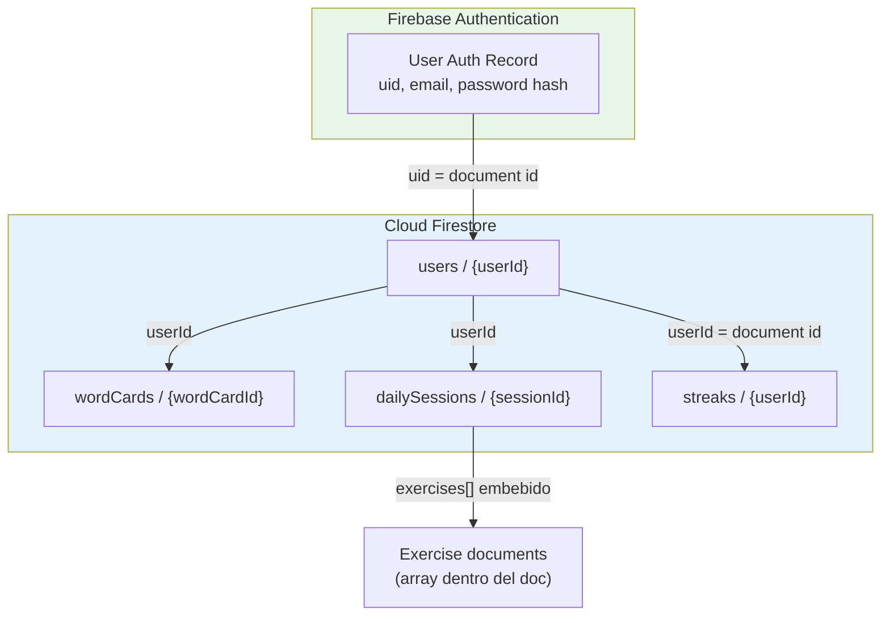
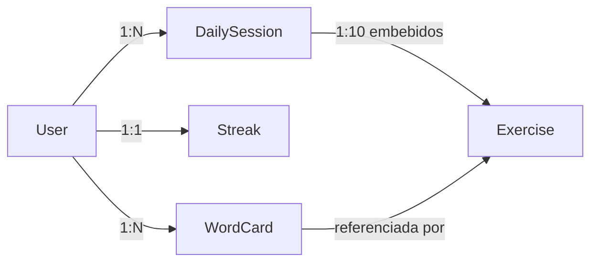
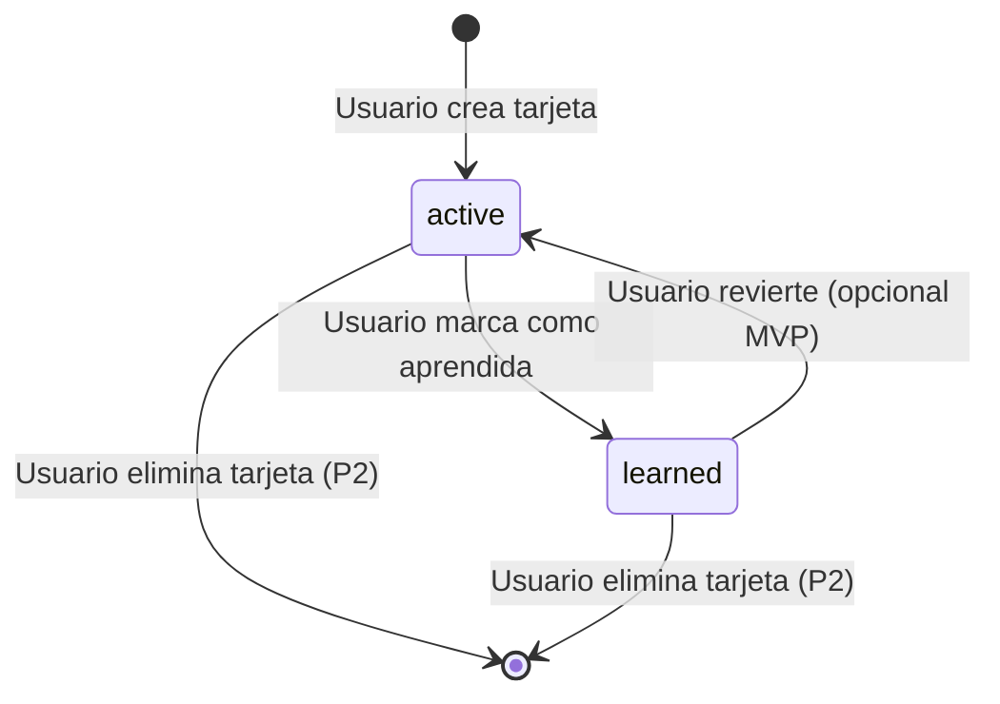

# 3. Modelo de Datos — Lexio

Lexio persiste su información en **Cloud Firestore** (NoSQL orientado a documentos). El diagrama siguiente representa el **modelo lógico relacional** del dominio; más abajo se detalla el **mapeo físico** a colecciones Firestore, índices y reglas de integridad.

**Motor de persistencia:** Cloud Firestore (Firebase)  
**Identidad de usuario:** Firebase Authentication (`uid` = clave primaria de `User`)

---

## 3.1. Diagrama del modelo de datos

### Diagrama entidad–relación (modelo lógico)

```mermaid
erDiagram
    USER ||--o{ WORD_CARD : "owns (1:N)"
    USER ||--|| STREAK : "has (1:1)"
    USER ||--o{ DAILY_SESSION : "completes (1:N)"
    WORD_CARD ||--o{ EXERCISE : "sources (1:N)"
    DAILY_SESSION ||--|{ EXERCISE : "contains (1:N)"

    USER {
        string id PK "Firebase Auth uid"
        string email UK "NOT NULL, UNIQUE"
        string uiLanguage "NOT NULL, enum: es | en"
        timestamp createdAt "NOT NULL"
        timestamp updatedAt "NOT NULL"
    }

    WORD_CARD {
        string id PK "UUID / Firestore auto-id"
        string userId FK "NOT NULL, ref USER.id"
        string term "NOT NULL, palabra o frase en inglés"
        string normalizedTerm "NOT NULL, lowercase + trim"
        string definition "NOT NULL, editable por usuario"
        string definitionLanguage "NOT NULL, enum: es | en"
        string imageUrl "NOT NULL, URL Unsplash"
        string unsplashPhotoId "NULLABLE, id foto Unsplash"
        string status "NOT NULL, enum: active | learned, default active"
        timestamp learnedAt "NULLABLE, fecha marcada aprendida"
        timestamp createdAt "NOT NULL"
        timestamp updatedAt "NOT NULL"
    }

    STREAK {
        string userId PK_FK "NOT NULL, ref USER.id, doc id = userId"
        int currentStreak "NOT NULL, default 0, >= 0"
        date lastCompletedDate "NULLABLE, YYYY-MM-DD última sesión"
        int longestStreak "NOT NULL, default 0, histórico máximo"
        timestamp updatedAt "NOT NULL"
    }

    DAILY_SESSION {
        string id PK "UUID / Firestore auto-id"
        string userId FK "NOT NULL, ref USER.id"
        date sessionDate "NOT NULL, YYYY-MM-DD timezone usuario"
        int totalExercises "NOT NULL, default 10"
        int correctAnswers "NOT NULL, default 0, >= 0"
        boolean completed "NOT NULL, default false"
        timestamp startedAt "NOT NULL"
        timestamp completedAt "NULLABLE"
    }

    EXERCISE {
        string id PK "UUID dentro de la sesión"
        string dailySessionId FK "NOT NULL, ref DAILY_SESSION.id"
        string wordCardId FK "NOT NULL, ref WORD_CARD.id"
        string type "NOT NULL, enum: image_match | mcq"
        string question "NULLABLE, solo type mcq"
        string correctAnswer "NOT NULL"
        json options "NULLABLE, array[string], solo mcq, length 4"
        string userAnswer "NULLABLE, respuesta del usuario"
        boolean isCorrect "NULLABLE, resultado tras responder"
        int orderIndex "NOT NULL, 0-9 posición en sesión"
    }
```

### Diagrama de colecciones Firestore (modelo físico)



### Restricciones de integridad (resumen)

| Restricción | Entidades | Descripción |
|-------------|-----------|-------------|
| **PK** | Todas | Identificador único por documento |
| **FK** | `wordCards.userId`, `dailySessions.userId`, `streaks.userId` | Debe existir un `users/{userId}` correspondiente al `uid` de Firebase Auth |
| **UNIQUE** | `(userId, normalizedTerm)` en `wordCards` | Una sola tarjeta por palabra/frase normalizada por usuario |
| **UNIQUE** | `(userId, sessionDate)` en `dailySessions` | Una sesión por día calendario por usuario |
| **UNIQUE** | `users.email` | Gestionado por Firebase Auth |
| **NOT NULL** | Campos marcados en diagrama | Validados en backend antes de persistir |
| **CHECK** | `wordCards.status` | Solo valores `active` o `learned` |
| **CHECK** | `dailySessions.totalExercises` | Valor fijo `10` en MVP |
| **CHECK** | `streaks.currentStreak` | Entero ≥ 0 |
| **Regla de negocio** | Práctica diaria | Bloqueo si el usuario tiene ≤ 3 `wordCards` con `status = active` o total ≤ 3 (según implementación; ver nota abajo) |

> **Nota sobre bloqueo de práctica:** El PRD exige más de 3 palabras para desbloquear ejercicios (mínimo 4 tarjetas). Esta regla se aplica en la capa de aplicación (`SessionService`) mediante conteo de `wordCards` por `userId`; no requiere un campo persistido adicional.

---

## 3.2. Descripción de entidades principales

### User (Usuario)

Perfil de aplicación complementario a Firebase Authentication. La identidad primaria (`id`) coincide con el **`uid`** emitido por Firebase Auth al registrarse con email/password.

| Atributo | Tipo | Restricciones | Descripción |
|----------|------|---------------|-------------|
| `id` | `string` | **PK**, NOT NULL | Identificador Firebase Auth (`uid`). Document id en `users/{userId}` |
| `email` | `string` | UK, NOT NULL | Email de registro. Fuente de verdad: Firebase Auth |
| `uiLanguage` | `string` | NOT NULL, enum `es` \| `en` | Idioma de la interfaz de la app (bilingüe MVP) |
| `createdAt` | `timestamp` | NOT NULL | Fecha de creación del perfil |
| `updatedAt` | `timestamp` | NOT NULL | Última modificación del perfil |

**Relaciones**

| Relación | Tipo | Entidad relacionada | Descripción |
|----------|------|---------------------|-------------|
| owns | 1:N | `WordCard` | Un usuario posee muchas tarjetas de vocabulario |
| has | 1:1 | `Streak` | Cada usuario tiene exactamente un registro de racha |
| completes | 1:N | `DailySession` | Un usuario completa cero o muchas sesiones diarias |

**Colección Firestore:** `users/{userId}`

**Ejemplo de documento**

```json
{
  "id": "a1b2c3d4-e5f6-7890-abcd-ef1234567890",
  "email": "usuario@ejemplo.com",
  "uiLanguage": "es",
  "createdAt": "2026-06-07T10:00:00.000Z",
  "updatedAt": "2026-06-07T10:00:00.000Z"
}
```

---

### WordCard (Tarjeta de vocabulario)

Unidad central del diccionario personal. Almacena la palabra o frase en inglés capturada manualmente, su definición (sugerida por IA y editable), la imagen elegida de Unsplash y el estado de aprendizaje.

| Atributo | Tipo | Restricciones | Descripción |
|----------|------|---------------|-------------|
| `id` | `string` | **PK**, NOT NULL | Identificador único de la tarjeta |
| `userId` | `string` | **FK** → `User.id`, NOT NULL | Propietario de la tarjeta |
| `term` | `string` | NOT NULL, max ~500 chars | Palabra o frase original introducida por el usuario |
| `normalizedTerm` | `string` | NOT NULL, **UNIQUE** con `userId` | `term` normalizado (`trim` + `toLowerCase`) para unicidad |
| `definition` | `string` | NOT NULL | Significado/contexto; sugerido por IA, editable por usuario |
| `definitionLanguage` | `string` | NOT NULL, enum `es` \| `en` | Idioma elegido por el usuario para la definición |
| `imageUrl` | `string` | NOT NULL | URL de la imagen seleccionada (Unsplash) |
| `unsplashPhotoId` | `string` | NULLABLE | Identificador de la foto en Unsplash (trazabilidad/atribución) |
| `status` | `string` | NOT NULL, enum `active` \| `learned`, default `active` | `learned` = marcada manualmente como aprendida |
| `learnedAt` | `timestamp` | NULLABLE | Momento en que el usuario marcó la palabra como aprendida |
| `createdAt` | `timestamp` | NOT NULL | Fecha de creación de la tarjeta |
| `updatedAt` | `timestamp` | NOT NULL | Última edición (definición, imagen o estado) |

**Relaciones**

| Relación | Tipo | Entidad relacionada | Descripción |
|----------|------|---------------------|-------------|
| belongs to | N:1 | `User` | Cada tarjeta pertenece a un único usuario |
| sources | 1:N | `Exercise` | Una tarjeta puede aparecer en múltiples ejercicios/sesiones |

**Índices compuestos recomendados**

- `wordCards`: `(userId ASC, normalizedTerm ASC)` — unicidad y búsqueda de duplicados
- `wordCards`: `(userId ASC, status ASC, createdAt DESC)` — listado del diccionario

**Colección Firestore:** `wordCards/{wordCardId}`

**Ejemplo de documento**

```json
{
  "id": "wc_001",
  "userId": "a1b2c3d4-e5f6-7890-abcd-ef1234567890",
  "term": "serendipity",
  "normalizedTerm": "serendipity",
  "definition": "Hallazgo afortunado e inesperado de algo valioso.",
  "definitionLanguage": "es",
  "imageUrl": "https://images.unsplash.com/photo-example",
  "unsplashPhotoId": "abc123",
  "status": "active",
  "learnedAt": null,
  "createdAt": "2026-06-07T10:05:00.000Z",
  "updatedAt": "2026-06-07T10:06:00.000Z"
}
```

---

### Streak (Racha)

Registro 1:1 con el usuario que refleja la constancia en la práctica diaria. Completar la sesión de 10 ejercicios cuenta como un día válido de racha.

| Atributo | Tipo | Restricciones | Descripción |
|----------|------|---------------|-------------|
| `userId` | `string` | **PK**, **FK** → `User.id`, NOT NULL | Document id = `userId` (relación 1:1) |
| `currentStreak` | `int` | NOT NULL, default `0`, ≥ 0 | Días consecutivos con sesión completada |
| `lastCompletedDate` | `date` | NULLABLE, formato `YYYY-MM-DD` | Última fecha en que se completó la sesión diaria |
| `longestStreak` | `int` | NOT NULL, default `0`, ≥ 0 | Mayor racha histórica ( métrica secundaria ) |
| `updatedAt` | `timestamp` | NOT NULL | Última actualización de la racha |

**Reglas de negocio (aplicación)**

| Escenario | Comportamiento |
|-----------|----------------|
| Primera sesión completada | `currentStreak = 1`, `lastCompletedDate = hoy` |
| Sesión completada al día siguiente consecutivo | `currentStreak += 1` |
| Sesión completada tras saltar ≥ 1 día | `currentStreak = 1` (reinicio) |
| Sesión ya completada hoy | No incrementar racha ni crear segunda sesión |

**Relaciones**

| Relación | Tipo | Entidad relacionada | Descripción |
|----------|------|---------------------|-------------|
| belongs to | 1:1 | `User` | Un usuario tiene un único documento de racha |

**Colección Firestore:** `streaks/{userId}`

**Ejemplo de documento**

```json
{
  "userId": "a1b2c3d4-e5f6-7890-abcd-ef1234567890",
  "currentStreak": 5,
  "lastCompletedDate": "2026-06-07",
  "longestStreak": 12,
  "updatedAt": "2026-06-07T08:30:00.000Z"
}
```

---

### DailySession (Sesión diaria de práctica)

Representa la sesión de **10 ejercicios** de un día concreto. Mezcla ejercicios de tipo imagen y MCQ generados a partir del vocabulario aleatorio del usuario.

| Atributo | Tipo | Restricciones | Descripción |
|----------|------|---------------|-------------|
| `id` | `string` | **PK**, NOT NULL | Identificador único de la sesión |
| `userId` | `string` | **FK** → `User.id`, NOT NULL | Usuario que realiza la sesión |
| `sessionDate` | `date` | NOT NULL, **UNIQUE** con `userId`, `YYYY-MM-DD` | Día calendario (timezone del dispositivo/servidor acordado) |
| `totalExercises` | `int` | NOT NULL, default `10` | Número fijo de ejercicios en MVP |
| `correctAnswers` | `int` | NOT NULL, default `0`, 0–10 | Aciertos al cerrar la sesión |
| `completed` | `boolean` | NOT NULL, default `false` | `true` cuando el usuario termina los 10 ejercicios |
| `startedAt` | `timestamp` | NOT NULL | Inicio de la sesión |
| `completedAt` | `timestamp` | NULLABLE | Cierre de la sesión; dispara actualización de racha |
| `exercises` | `array<Exercise>` | NOT NULL, length = 10 | Array embebido de ejercicios (modelo físico Firestore) |

**Relaciones**

| Relación | Tipo | Entidad relacionada | Descripción |
|----------|------|---------------------|-------------|
| belongs to | N:1 | `User` | Cada sesión pertenece a un usuario |
| contains | 1:N | `Exercise` | Contiene exactamente 10 ejercicios embebidos |

**Índices compuestos recomendados**

- `dailySessions`: `(userId ASC, sessionDate DESC)` — consultar sesión de hoy / historial
- `dailySessions`: `(userId ASC, sessionDate ASC)` — constraint de unicidad lógica

**Colección Firestore:** `dailySessions/{sessionId}`

**Ejemplo de documento**

```json
{
  "id": "ds_20260607_001",
  "userId": "a1b2c3d4-e5f6-7890-abcd-ef1234567890",
  "sessionDate": "2026-06-07",
  "totalExercises": 10,
  "correctAnswers": 8,
  "completed": true,
  "startedAt": "2026-06-07T08:00:00.000Z",
  "completedAt": "2026-06-07T08:04:32.000Z",
  "exercises": []
}
```

---

### Exercise (Ejercicio)

Unidad de práctica dentro de una sesión diaria. En el modelo lógico es entidad propia; en Firestore se **embebe** como objetos dentro del array `dailySessions.exercises[]` (evita subcolecciones y simplifica la lectura atómica de la sesión).

| Atributo | Tipo | Restricciones | Descripción |
|----------|------|---------------|-------------|
| `id` | `string` | **PK** dentro de la sesión, NOT NULL | Identificador del ejercicio |
| `dailySessionId` | `string` | **FK** → `DailySession.id`, NOT NULL | Sesión a la que pertenece |
| `wordCardId` | `string` | **FK** → `WordCard.id`, NOT NULL | Tarjeta origen del ejercicio |
| `type` | `string` | NOT NULL, enum `image_match` \| `mcq` | Tipo de ejercicio |
| `question` | `string` | NULLABLE | Enunciado generado por IA; obligatorio si `type = mcq` |
| `options` | `array<string>` | NULLABLE, length = 4 | Cuatro opciones en MCQ; una es correcta |
| `correctAnswer` | `string` | NOT NULL | Palabra correcta o índice/valor de la opción válida |
| `userAnswer` | `string` | NULLABLE | Respuesta seleccionada por el usuario |
| `isCorrect` | `boolean` | NULLABLE | Resultado tras validar |
| `orderIndex` | `int` | NOT NULL, 0–9 | Orden del ejercicio en la sesión |

**Tipos de ejercicio (MVP)**

| `type` | Descripción | Campos utilizados |
|--------|-------------|-------------------|
| `image_match` | Mostrar imagen de la tarjeta; elegir la palabra correcta entre opciones | `wordCardId`, `options`, `correctAnswer` |
| `mcq` | Pregunta de opción múltiple generada por Claude sobre la definición/contexto | `question`, `options`, `correctAnswer` |

**Relaciones**

| Relación | Tipo | Entidad relacionada | Descripción |
|----------|------|---------------------|-------------|
| belongs to | N:1 | `DailySession` | Cada ejercicio forma parte de una sesión |
| references | N:1 | `WordCard` | Cada ejercicio se basa en una tarjeta del usuario |

**Ejemplo embebido en `DailySession.exercises`**

```json
{
  "id": "ex_003",
  "dailySessionId": "ds_20260607_001",
  "wordCardId": "wc_001",
  "type": "mcq",
  "question": "¿Cuál palabra describe un hallazgo afortunado e inesperado?",
  "options": ["serendipity", "misfortune", "routine", "deadline"],
  "correctAnswer": "serendipity",
  "userAnswer": "serendipity",
  "isCorrect": true,
  "orderIndex": 2
}
```

---

## Relaciones globales del modelo



| Origen | Destino | Cardinalidad | On delete (lógico) |
|--------|---------|--------------|---------------------|
| User | WordCard | 1:N | Eliminar usuario → eliminar tarjetas (cascade lógico en backend) |
| User | Streak | 1:1 | Eliminar usuario → eliminar racha |
| User | DailySession | 1:N | Eliminar usuario → eliminar sesiones |
| DailySession | Exercise | 1:10 | Eliminar sesión → ejercicios embebidos se eliminan con el documento |
| WordCard | Exercise | 1:N | Eliminar tarjeta → ejercicios históricos conservan `wordCardId` (referencia débil) |

---

## Enumeraciones del dominio

| Enum | Valores | Usado en |
|------|---------|----------|
| `UiLanguage` | `es`, `en` | `User.uiLanguage` |
| `DefinitionLanguage` | `es`, `en` | `WordCard.definitionLanguage` |
| `WordCardStatus` | `active`, `learned` | `WordCard.status` |
| `ExerciseType` | `image_match`, `mcq` | `Exercise.type` |

---

## Consultas principales y soporte en Firestore

| Caso de uso | Consulta | Índice / notas |
|-------------|----------|----------------|
| Listar diccionario | `wordCards` where `userId == X` order by `createdAt` desc | Índice compuesto |
| Detectar duplicado | `wordCards` where `userId == X` and `normalizedTerm == Y` | Índice compuesto `(userId, normalizedTerm)` |
| Contar palabras para desbloqueo | `wordCards` where `userId == X` — count ≥ 4 | Agregación en backend |
| Sesión de hoy | `dailySessions` where `userId == X` and `sessionDate == today` | Índice compuesto |
| Selección aleatoria 10 palabras | Obtener IDs del usuario; muestreo aleatorio en backend | Sin query SQL `ORDER BY RANDOM()` nativo |
| Obtener racha | `streaks/{userId}` | Lectura directa por document id |

---

## Diagrama de estados — WordCard



---

## Resumen

El modelo de datos de Lexio se articula en **cinco entidades lógicas** (`User`, `WordCard`, `Streak`, `DailySession`, `Exercise`), persistidas en **cuatro colecciones Firestore** (`users`, `wordCards`, `dailySessions`, `streaks`), con ejercicios **embebidos** en la sesión diaria. Las restricciones críticas del MVP — **una tarjeta por término normalizado**, **una sesión por día**, **mínimo 4 palabras para practicar** y **racha basada en sesión completada** — se garantizan mediante índices compuestos, validación en el backend Express y reglas de seguridad Firestore por `userId`.
