# Adresles - Documentación de Diseño del Sistema

> **Versión**: 1.2  
> **Fecha**: 30 de Enero de 2026  
> **Estado**: Diseño completado

---

## Índice

1. [Fase 1: Investigación y Análisis](#fase-1-investigación-y-análisis)
   - [1.1 Descripción del Software](#11-descripción-del-software)
   - [1.2 Propuesta de Valor](#12-propuesta-de-valor)
   - [1.3 Ventajas Competitivas](#13-ventajas-competitivas)
   - [1.4 Funciones Principales](#14-funciones-principales)
   - [1.5 Lean Canvas](#15-lean-canvas)
   - [1.6 User Journeys Detallados](#16-user-journeys-detallados)
   - [1.7 Flujo de Reminders](#17-flujo-de-reminders)
   - [1.8 Fórmula de Pricing](#18-fórmula-de-pricing)
2. [Fase 2: Casos de Uso](#fase-2-casos-de-uso)
   - [2.1 Actores del Sistema](#21-actores-del-sistema)
   - [2.2 Caso de Uso 1: Checkout Adresles](#22-caso-de-uso-1-checkout-adresles)
   - [2.3 Caso de Uso 2: Obtención de Dirección por Conversación](#23-caso-de-uso-2-obtención-de-dirección-por-conversación)
   - [2.4 Caso de Uso 3: Compra Regalo](#24-caso-de-uso-3-compra-regalo)
   - [2.5 Matriz de Trazabilidad](#25-matriz-de-trazabilidad-casos-de-uso---requisitos)
3. [Fase 3: Modelado de Datos](#fase-3-modelado-de-datos)
   - [3.1 Análisis de Base de Datos](#31-análisis-de-base-de-datos-dynamodb-vs-alternativas)
   - [3.2 Modelo Entidad-Relación](#32-modelo-entidad-relación)
   - [3.3 Diccionario de Datos](#33-diccionario-de-datos)
   - [3.4 Política de Retención](#34-política-de-retención-de-datos)
   - [3.5 Diagramas de Estados](#35-diagramas-de-estados)
4. [Fase 4: Diseño de Alto Nivel](#fase-4-diseño-de-alto-nivel)
   - [4.1 Visión General de la Arquitectura](#41-visión-general-de-la-arquitectura)
   - [4.2 Diagrama C4 - Nivel 1: Contexto](#42-diagrama-c4---nivel-1-contexto-del-sistema)
   - [4.3 Diagrama C4 - Nivel 2: Contenedores](#43-diagrama-c4---nivel-2-contenedores)
   - [4.4 Diagrama C4 - Nivel 3: Componentes](#44-diagrama-c4---nivel-3-componentes-módulo-conversations)
   - [4.5 Estructura del Proyecto](#45-estructura-del-proyecto)
   - [4.6 Diagrama de Infraestructura](#46-diagrama-de-infraestructura-y-deployment)
   - [4.7 Docker Compose](#47-docker-compose---configuración)
   - [4.8 Diagramas de Secuencia](#48-diagramas-de-secuencia)
   - [4.9 CI/CD Pipeline](#49-cicd-pipeline-github-actions)
   - [4.10 Seguridad](#410-seguridad)
   - [4.11 Monitorización](#411-monitorización-y-observabilidad)
   - [4.12 API Endpoints](#412-api-endpoints-principales)
5. [Registro de Decisiones](#registro-de-decisiones)
6. [Glosario](#glosario)

---

## Fase 1: Investigación y Análisis

### 1.1 Descripción del Software

**Adresles** es una plataforma SaaS B2B2C que revoluciona la experiencia de checkout en tiendas online eliminando la fricción más común en el proceso de compra: la introducción manual de la dirección de entrega.

El sistema funciona mediante un plugin que se integra en el checkout de eCommerce, permitiendo al comprador completar su pedido indicando únicamente su nombre y número de teléfono. Posteriormente, un agente conversacional basado en IA (GPT-4.0) contacta al usuario mediante la aplicación Adresles para obtener la dirección de entrega mediante una conversación natural, actualizando automáticamente esta información en el sistema del eCommerce.

#### Características Clave

- **Global desde el inicio**: Soporte multiidioma y multi-moneda
- **Plataformas soportadas** (roadmap): WooCommerce → PrestaShop → Magento → Shopify
- **Identificación por teléfono**: El número de teléfono es el identificador único del usuario
- **Validación inteligente**: Integración con Google Maps API + detección proactiva de datos faltantes en edificios

#### Flujo Principal Simplificado

```mermaid
flowchart LR
    A[👤 Usuario<br/>Compra] --> B[🛒 Checkout<br/>Rápido]
    B --> C[⚙️ Adresles<br/>Procesa]
    C --> D[💬 App Adresles<br/>Conversación]
    D --> E[📍 Dirección<br/>Validada]
    E --> F[🏪 eCommerce<br/>Actualizado]
```

### 1.2 Propuesta de Valor

| Stakeholder | Propuesta de Valor |
|-------------|-------------------|
| **Comprador** | Checkout ultra-rápido sin formularios tediosos. Gestión centralizada de direcciones. Comunicación natural en su idioma preferido. |
| **eCommerce** | Reducción del abandono de carrito. Mayor tasa de conversión. Diferenciación competitiva en UX. Prueba gratuita de 1 mes. |
| **Tienda física con eCommerce** | Experiencia omnicanal mejorada. Fidelización de clientes. |

### 1.3 Ventajas Competitivas

1. **Checkout sin fricción**: Elimina el punto de mayor abandono en el funnel de compra.

2. **Conversación natural con IA**: A diferencia de formularios rígidos, la obtención de dirección se realiza mediante conversación fluida que puede resolver ambigüedades, sugerir correcciones y adaptarse al usuario.

3. **Validación inteligente de direcciones**: 
   - Integración con Google Maps API para normalización
   - Detección proactiva de información faltante (escalera, bloque, piso, puerta)
   - Resolución de ambigüedades mediante conversación

4. **Libreta de Direcciones centralizada**: El usuario puede guardar múltiples direcciones y reutilizarlas en cualquier eCommerce integrado con Adresles.

5. **Funcionalidad de Regalo integrada**: Permite comprar para terceros sin conocer su dirección, mejorando drásticamente la experiencia de gifting.

6. **Efecto red**: Cuantos más eCommerce usen Adresles, más usuarios tendrán su dirección pre-cargada, aumentando el valor para todos.

7. **Multiidioma nativo**: Detección automática del idioma del usuario y conversación en su idioma preferido.

8. **Multi-moneda**: Soporte global desde el lanzamiento.

### 1.4 Funciones Principales

#### Para el Comprador (B2C)

| Función | Descripción |
|---------|-------------|
| **Checkout Adresles** | Completar compra solo con nombre y teléfono |
| **Conversación IA** | Indicar dirección de entrega por chat natural en App Adresles |
| **Libreta de Direcciones** | Gestionar direcciones favoritas reutilizables |
| **Modo Regalo** | Enviar pedido a otra persona sin conocer su dirección |
| **Registro Adresles** | Crear cuenta para persistir preferencias |
| **Detección de idioma** | Conversación automática en el idioma del usuario |

#### Para el eCommerce (B2B)

| Función | Descripción |
|---------|-------------|
| **Plugin de Checkout** | Integración en el proceso de pago |
| **Webhook de Compras** | Recepción automática de pedidos en tiempo real |
| **Dashboard de Gestión** | Monitorización de pedidos y conversaciones |
| **API de Sincronización** | Actualización de direcciones en el sistema |
| **Prueba gratuita** | 1 mes sin coste para evaluar el servicio |

#### Para el Sistema (Interno)

| Función | Descripción |
|---------|-------------|
| **Orquestador de Conversaciones** | Gestión del flujo conversacional con GPT-4.0 |
| **Motor de Journeys** | Selección automática del flujo según contexto |
| **Sistema de Reminders** | Recordatorios tras 15 min sin respuesta |
| **Validador de Direcciones** | Google Maps API + detección de datos faltantes |
| **Escalado a Soporte** | Envío de incidencias por email cuando la IA no puede resolver |

### 1.5 Lean Canvas

```
┌─────────────────────────────────────────────────────────────────────────────────────────────┐
│                                    LEAN CANVAS - ADRESLES                                   │
├───────────────────────┬───────────────────────┬───────────────────────┬─────────────────────┤
│       PROBLEMA        │       SOLUCIÓN        │   PROPUESTA ÚNICA     │  VENTAJA ESPECIAL   │
│                       │                       │      DE VALOR         │                     │
│ • Alto abandono de    │ • Plugin checkout     │                       │ • Efecto red:       │
│   carrito por         │   sin dirección       │ "Compra en 2 clics,   │   usuarios con      │
│   formularios         │                       │  nosotros nos         │   dirección ya      │
│   largos              │ • Agente IA que       │  encargamos del       │   guardada          │
│                       │   obtiene dirección   │  resto"               │                     │
│ • Fricción en         │   por App propia      │                       │ • IA conversacional │
│   compras móviles     │                       │                       │   multiidioma       │
│                       │ • Libreta de          │                       │                     │
│ • Comprar regalos     │   direcciones         │                       │ • Validación GMaps  │
│   sin saber           │   centralizada        │                       │   + detección       │
│   dirección           │                       │                       │   inteligente       │
│                       │ • Modo regalo         │                       │                     │
│ • Formularios no      │                       │                       │ • Funcionalidad     │
│   adaptados a móvil   │ • Validación GMaps    │                       │   de regalo única   │
├───────────────────────┼───────────────────────┼───────────────────────┴─────────────────────┤
│    SEGMENTOS DE       │    MÉTRICAS CLAVE     │                   CANALES                   │
│      CLIENTES         │                       │                                             │
│                       │ • Tasa conversión     │ • Plugin WooCommerce (fase 1)               │
│ B2B:                  │   checkout            │ • Plugin PrestaShop (fase 2)                │
│ • eCommerce WooComm   │ • % abandono carrito  │ • Plugin Magento (fase 3)                   │
│ • eCommerce PrestaS   │ • Tiempo medio de     │ • Plugin Shopify (fase 4)                   │
│ • eCommerce Magento   │   obtención dirección │                                             │
│ • eCommerce Shopify   │ • NPS usuarios        │ • Marketplace de plugins                    │
│                       │ • Usuarios registrados│                                             │
│ B2C:                  │ • Direcciones         │ • Venta directa B2B                         │
│ • Compradores online  │   guardadas           │                                             │
│ • Millennials/GenZ    │ • Tasa de respuesta   │ • Viralidad por uso                         │
│ • Compradores global  │   <15 min             │                                             │
├───────────────────────┴───────────────────────┼─────────────────────────────────────────────┤
│          ESTRUCTURA DE COSTES                 │           FUENTES DE INGRESOS               │
│                                               │                                             │
│ • Infraestructura cloud (AWS)                 │ • Fee por transacción (variable):           │
│ • API OpenAI (GPT-4.0)                        │   - 5.0% para importes ≤ 10€                │
│ • Google Maps API (validación)                │   - 2.5% para importes ≥ 100€               │
│ • Desarrollo y mantenimiento                  │   - Escala lineal entre 10€ y 100€          │
│ • Soporte al cliente                          │                                             │
│ • Infraestructura multi-región (global)       │ • Prueba gratuita: 1 mes                    │
│                                               │                                             │
│ Fórmula fee: fee% = 5 - (2.5 × (importe-10)   │ Ejemplos:                                   │
│                              / 90)            │ • Compra 10€ → fee 5% = 0.50€               │
│ (mínimo 2.5%, máximo 5%)                      │ • Compra 55€ → fee 3.75% = 2.06€            │
│                                               │ • Compra 100€ → fee 2.5% = 2.50€            │
└───────────────────────────────────────────────┴─────────────────────────────────────────────┘
```

### 1.6 User Journeys Detallados

#### Journey 1: Compra Tradicional (Usuario NO usa modo Adresles)
El usuario completa checkout tradicional con dirección. Adresles le invita a registrarse para futuras compras más rápidas.

#### Journey 2: Compra Adresles - Usuario Registrado en Adresles
- **2.1**: Con dirección favorita → Se propone dirección guardada, opción de cambiar
- **2.2**: Sin dirección favorita → Se solicita nueva dirección

#### Journey 3: Compra Adresles - Usuario Registrado solo en eCommerce
- **3.1**: Con dirección en eCommerce → Se propone dirección del eCommerce + invitación registro
- **3.2**: Sin dirección en eCommerce → Se solicita dirección + invitación registro

#### Journey 4: Compra Adresles - Usuario Nuevo
Usuario no registrado en ningún sistema → Se solicita dirección + invitación registro

#### Journey 5: Modo Regalo
- **Regalado**: Se contacta para obtener/confirmar dirección (si registrado, se propone su favorita)
- **Comprador**: Se informa del proceso en curso con el regalado

### 1.7 Flujo de Reminders

Cuando el usuario no responde en 15 minutos:

```mermaid
flowchart LR
    A[📨 Mensaje<br/>Inicial] --> B{15 min<br/>sin respuesta}
    B --> C[🔔 Reminder 1<br/>¿Sigues ahí?]
    C --> D{30 min<br/>sin respuesta}
    D --> E[🔔 Reminder 2<br/>Necesitamos dirección]
    E --> F{60 min<br/>sin respuesta}
    F --> G[📧 Escalado<br/>a Soporte]
```

### 1.8 Fórmula de Pricing

```
Para importe X (en euros):

Si X ≤ 10:       fee = 5%
Si X ≥ 100:      fee = 2.5%
Si 10 < X < 100: fee = 5 - (2.5 × (X - 10) / 90)
```

| Importe | Fee % | Fee (€) |
|---------|-------|---------|
| 10 €    | 5.00% | 0.50 €  |
| 25 €    | 4.58% | 1.15 €  |
| 50 €    | 3.89% | 1.94 €  |
| 75 €    | 3.19% | 2.40 €  |
| 100 €   | 2.50% | 2.50 €  |
| 150 €   | 2.50% | 3.75 €  |

---

## Fase 2: Casos de Uso

### 2.1 Actores del Sistema

| Actor | Tipo | Descripción |
|-------|------|-------------|
| **Comprador** | Principal | Usuario que realiza una compra en un eCommerce integrado |
| **Regalado** | Principal | Persona que recibe un regalo y debe proporcionar su dirección |
| **Administrador eCommerce** | Principal | Gestiona la integración y monitoriza pedidos |
| **Sistema eCommerce** | Secundario | Plataforma de tienda online (WooCommerce, etc.) |
| **Agente IA (GPT-4.0)** | Secundario | Motor de conversación inteligente |
| **Google Maps API** | Secundario | Servicio de validación de direcciones |
| **Sistema de Soporte** | Secundario | Recibe escalados cuando la IA no puede resolver |

### 2.2 Caso de Uso 1: Checkout Adresles

**CU-01: Realizar Compra con Checkout Adresles**

| Campo | Descripción |
|-------|-------------|
| **ID** | CU-01 |
| **Nombre** | Realizar Compra con Checkout Adresles |
| **Actor Principal** | Comprador |
| **Actores Secundarios** | Sistema eCommerce, Adresles Backend |
| **Precondiciones** | El eCommerce tiene el plugin Adresles instalado y activo |
| **Postcondiciones** | Pedido creado pendiente de dirección, conversación iniciada |
| **Trigger** | El comprador selecciona "Checkout Adresles" en el proceso de pago |

#### Flujo Principal

1. El Comprador añade productos al carrito en el eCommerce
2. El Comprador accede al checkout
3. El Sistema muestra opción "Checkout Adresles" junto al checkout tradicional
4. El Comprador selecciona "Checkout Adresles"
5. El Sistema solicita: Nombre, Apellidos, Teléfono
6. El Comprador introduce los datos mínimos
7. El Comprador completa el pago
8. El Sistema eCommerce envía webhook a Adresles con datos del pedido
9. Adresles crea registro de pedido pendiente de dirección
10. Adresles inicia conversación con el Comprador (ver CU-02)
11. El Comprador confirma la Dirección de Entrega en la conversación
12. Adresles actualiza la Dirección de Entrega al Sistema ECommerce.
13. Adresles confirma al Comprador la Dirección de Entrega finalmente seleccionada.
14. Si el Comprador no está registrado en Adresles, Adresles inicia conversación ofreciendo el registro.

#### Flujos Alternativos

**FA-1: Checkout con opción Regalo**
- En paso 5, el Comprador marca "Es un regalo"
- El Sistema solicita adicionalmente: Nombre y Teléfono del Regalado
- Continúa en paso 6 con datos adicionales
- En paso 10, se inician dos conversaciones paralelas (ver CU-03)

**FA-2: Fallo en el pago**
- En paso 7, el pago es rechazado
- El Sistema notifica al Comprador
- El Comprador puede reintentar o abandonar
- No se envía webhook a Adresles

#### Diagrama de Caso de Uso

```plantuml
@startuml CU-01 Checkout Adresles
left to right direction
skinparam packageStyle rectangle

actor "Comprador" as comprador
actor "Sistema eCommerce" as ecommerce
actor "Pasarela Pago" as pasarela
actor "Adresles Backend" as adresles

rectangle "CU-01: Checkout Adresles" {
    usecase "Realizar Compra\nCheckout Adresles" as UC1
    usecase "Validar Datos\nMínimos" as UC2
    usecase "Procesar Pago" as UC3
    usecase "Notificar Pedido\na Adresles" as UC4
    usecase "Marcar como\nRegalo" as UC5
}

comprador --> UC1
ecommerce --> UC1
UC1 ..> UC2 : <<include>>
UC1 ..> UC3 : <<include>>
UC3 <-- pasarela
UC1 ..> UC4 : <<include>>
UC4 <-- adresles
UC1 ..> UC5 : <<extend>>

note right of UC5 : Solo si es regalo
@enduml
```

---

### 2.3 Caso de Uso 2: Obtención de Dirección por Conversación

**CU-02: Obtener Dirección mediante Conversación IA**

| Campo | Descripción |
|-------|-------------|
| **ID** | CU-02 |
| **Nombre** | Obtener Dirección mediante Conversación IA |
| **Actor Principal** | Comprador |
| **Actores Secundarios** | Agente IA (GPT-4.0), Google Maps API, Sistema de Soporte |
| **Precondiciones** | Existe pedido pendiente de dirección (CU-01 completado) |
| **Postcondiciones** | Dirección validada y actualizada en eCommerce |
| **Trigger** | Adresles inicia conversación tras recibir webhook de pedido |

#### Flujo Principal

1. Adresles detecta idioma del usuario (simulado en MVP)
2. Agente IA saluda al Comprador en su idioma, informando de la compra realizada
3. El Sistema verifica estado del usuario:
    - Si registrado en Adresles con dirección favorita → propone dirección
    - Si registrado en eCommerce con dirección → propone dirección
    - Si no tiene dirección → solicita dirección
4. El Comprador proporciona/confirma dirección
5. Google Maps API valida y normaliza la dirección
6. Si la dirección parece ser un edificio sin detalles completos:
    - Agente IA pregunta por escalera/bloque/piso/puerta
    - Comprador proporciona detalles adicionales
7. Agente IA confirma dirección completa al Comprador
8. Comprador aprueba la dirección
9. Adresles actualiza la dirección en el eCommerce via API
10. Agente IA confirma que el pedido será enviado a la dirección indicada
11. Si el Comprador no está registrado en Adresles:
    - Agente IA invita a registrarse para futuras compras más rápidas

#### Flujos Alternativos

**FA-1: Comprador quiere cambiar dirección propuesta**
- En paso 4, Comprador indica que quiere otra dirección
- El Sistema solicita nueva dirección
- Continúa en paso 5

**FA-2: Dirección no válida según Google Maps**
- En paso 5, la validación falla
- Agente IA informa del problema y pide aclaración
- Comprador proporciona dirección corregida
- Vuelve a paso 5

**FA-3: Sin respuesta en 15 minutos**
- El Sistema envía Reminder 1
- Si sin respuesta en 30 min → Reminder 2
- Si sin respuesta en 60 min → Escala a Soporte por email

**FA-4: IA no puede resolver la situación**
- Agente IA detecta que no puede ayudar
- El Sistema genera resumen de la incidencia
- El Sistema envía email a soporte@adresles.com
- Agente IA informa al Comprador que soporte contactará pronto

**FA-5: Múltiples pedidos pendientes del mismo usuario**
- En paso 2, el Sistema detecta varios pedidos sin dirección
- Agente IA lista los pedidos pendientes
- Comprador puede asignar misma dirección a todos o diferentes
- El Sistema deja claro qué dirección corresponde a cada pedido

#### Diagrama de Caso de Uso

```plantuml
@startuml CU-02 Obtener Dirección
left to right direction
skinparam packageStyle rectangle

actor "Comprador" as comprador
actor "Agente IA\n(GPT-4.0)" as agente
actor "Google Maps API" as gmaps
actor "Sistema Soporte" as soporte

rectangle "CU-02: Obtención de Dirección por Conversación" {
    usecase "Obtener Dirección\npor Conversación" as UC1
    usecase "Proponer Dirección\nGuardada" as UC2
    usecase "Solicitar Nueva\nDirección" as UC3
    usecase "Validar\nDirección" as UC4
    usecase "Solicitar Detalles\nEdificio" as UC5
    usecase "Actualizar\neCommerce" as UC6
    usecase "Invitar a Registro\nAdresles" as UC7
    usecase "Enviar\nReminders" as UC8
    usecase "Escalar a\nSoporte" as UC9
}

comprador --> UC1
agente --> UC1
UC1 ..> UC2 : <<include>>
UC1 ..> UC3 : <<include>>
UC1 ..> UC4 : <<include>>
UC4 <-- gmaps
UC4 ..> UC5 : <<extend>>
UC1 ..> UC6 : <<include>>
UC1 ..> UC7 : <<extend>>
UC1 ..> UC8 : <<extend>>
UC1 ..> UC9 : <<extend>>
UC9 --> soporte

note right of UC5 : Si parece edificio\nsin detalles completos
note right of UC7 : Si usuario no\nregistrado en Adresles
note right of UC8 : Si no hay respuesta\nen 15/30/60 min
@enduml
```

---

### 2.4 Caso de Uso 3: Compra Regalo

**CU-03: Realizar Compra como Regalo**

| Campo | Descripción |
|-------|-------------|
| **ID** | CU-03 |
| **Nombre** | Realizar Compra como Regalo |
| **Actor Principal** | Comprador |
| **Actores Secundarios** | Regalado, Agente IA (GPT-4.0), Sistema eCommerce |
| **Precondiciones** | El eCommerce tiene plugin Adresles con opción regalo habilitada |
| **Postcondiciones** | Pedido con dirección del Regalado, ambos informados |
| **Trigger** | Comprador marca "Es un regalo" durante Checkout Adresles |

#### Flujo Principal

1. El Comprador realiza Checkout Adresles marcando "Es un regalo"
2. El Sistema solicita datos del Regalado: Nombre, Apellidos, Teléfono y Nota opcional
3. El Comprador proporciona datos del Regalado
4. El Comprador completa el pago
5. Adresles recibe webhook e identifica pedido como regalo
6. El Sistema inicia DOS conversaciones paralelas:

**Conversación con Regalado:**

7a. Agente IA saluda al Regalado (por su nombre si ya está registrado), informando que tiene un regalo pendiente

8a. Si Regalado está registrado en Adresles con dirección favorita:

- Agente IA propone su dirección favorita
- Regalado confirma o proporciona alternativa

9a. Si no tiene dirección:

- Agente IA solicita dirección de entrega
- Regalado proporciona dirección

10a. Se valida dirección (mismo proceso que CU-02 pasos 5-8)

11a. Agente IA confirma que el regalo será enviado

**Conversación con Comprador:**

7b. Agente IA saluda al Comprador, confirmando compra regalo

8b. Agente IA informa que se ha contactado al Regalado

9b. Cuando Regalado confirma dirección:

- Agente IA notifica al Comprador que dirección fue obtenida
- (Sin revelar la dirección para mantener Protección de Datos)

10b. Agente IA confirma que el pedido está en proceso

12. Adresles actualiza dirección en eCommerce
13. Pedido listo para envío

#### Flujos Alternativos

**FA-1: Regalado no responde**
- Se aplica flujo de reminders al Regalado
- El Comprador es notificado del estado
- Tras 60 min sin respuesta → Escala a soporte

**FA-2: Comprador quiere indicar dirección del Regalado**
- En paso 2, Comprador indica que conoce la dirección
- El Sistema permite introducir dirección del regalo
- Se salta conversación con Regalado (7a-11a)
- Solo se informa al Comprador

#### Diagrama de Caso de Uso

```plantuml
@startuml CU-03 Compra Regalo
left to right direction
skinparam packageStyle rectangle

actor "Comprador" as comprador
actor "Regalado" as regalado
actor "Sistema eCommerce" as ecommerce
actor "Agente IA\n(GPT-4.0)" as agente
actor "Google Maps API" as gmaps

rectangle "CU-03: Compra Regalo" {
    usecase "Realizar Compra\ncomo Regalo" as UC1
    usecase "Proporcionar Datos\ndel Regalado" as UC2
    usecase "Conversación con\nComprador (info)" as UC3
    usecase "Conversación con\nRegalado (dirección)" as UC4
    usecase "Validar\nDirección" as UC5
    usecase "Notificar Estado\nal Comprador" as UC6
    usecase "Actualizar\neCommerce" as UC7
}

comprador --> UC1
ecommerce --> UC1
UC1 ..> UC2 : <<include>>
UC1 ..> UC3 : <<include>>
UC1 ..> UC4 : <<include>>
UC4 <-- regalado
UC4 <-- agente
UC4 ..> UC5 : <<include>>
UC5 <-- gmaps
UC3 ..> UC6 : <<include>>
UC1 ..> UC7 : <<include>>

note right of UC4 : Conversaciones\nparalelas
@enduml
```

---

### 2.5 Matriz de Trazabilidad Casos de Uso - Requisitos

| Requisito | CU-01 | CU-02 | CU-03 |
|-----------|-------|-------|-------|
| Checkout sin dirección | ✓ | | ✓ |
| Conversación IA | | ✓ | ✓ |
| Validación Google Maps | | ✓ | ✓ |
| Detección datos faltantes edificio | | ✓ | ✓ |
| Proponer dirección favorita | | ✓ | ✓ |
| Sistema de reminders | | ✓ | ✓ |
| Escalado a soporte | | ✓ | ✓ |
| Modo regalo | ✓ | | ✓ |
| Multi-idioma | | ✓ | ✓ |
| Actualización eCommerce | | ✓ | ✓ |
| Invitación registro | | ✓ | ✓ |
| Múltiples pedidos | | ✓ | |

---

## Fase 3: Modelado de Datos

### 3.1 Análisis de Base de Datos: DynamoDB vs Alternativas

Dado el requisito de evaluar DynamoDB, presento un análisis comparativo:

#### Características del Sistema a Modelar

| Característica | Implicación para BD |
|----------------|---------------------|
| Relaciones claras (eCommerce → Tiendas → Pedidos) | Favorece modelo relacional |
| Multi-tenant estricto | Requiere particionamiento eficiente |
| Auditoría completa | Alto volumen de escrituras de logs |
| Conversaciones con política de retención | Datos con TTL, alto volumen |
| Queries complejos (reportes, dashboard) | Favorece SQL |
| Escala global, multi-región | Requiere replicación |

#### Comparativa

| Criterio | DynamoDB | Supabase (PostgreSQL) | Híbrido |
|----------|----------|----------------------|---------|
| **Modelo de datos** | NoSQL (clave-valor/documento) | Relacional | Ambos |
| **Relaciones complejas** | ⚠️ Difícil, requiere desnormalización | ✅ Nativo con JOINs | ✅ Cada uno en su fuerte |
| **Auditoría** | ✅ DynamoDB Streams | ✅ Triggers/RLS | ✅ |
| **TTL automático** | ✅ Nativo | ⚠️ Requiere pg_cron | ✅ DynamoDB para TTL |
| **Escalabilidad** | ✅ Automática, serverless | ✅ Escalado automático | ✅ |
| **Auth integrado** | ❌ Requiere Cognito | ✅ Supabase Auth | ✅ |
| **Realtime** | ⚠️ Streams + Lambda | ✅ Realtime nativo | ✅ |
| **Coste a bajo volumen** | ✅ Pay-per-request | ✅ Free tier generoso | ⚠️ Dos servicios |
| **Queries ad-hoc** | ⚠️ Limitado sin GSI | ✅ SQL completo | ✅ |
| **Row Level Security** | ❌ Manual | ✅ RLS nativo | ✅ |
| **Experiencia equipo** | ✅ Ya tienen AWS | ✅ PostgreSQL estándar | ✅ |

#### Decisión Recomendada: Arquitectura Híbrida

```mermaid
block-beta
    columns 2
    
    block:supabase:1
        columns 1
        sb1["SUPABASE (PostgreSQL)"]
        sb2["Datos Relacionales"]
        sb3["• ECommerce"]
        sb4["• Store"]
        sb5["• User"]
        sb6["• Address"]
        sb7["• Order"]
        sb8["• OrderAddress (snapshot)"]
        sb9["• PluginConfig"]
        sb10["• GiftRecipient"]
    end
    
    block:dynamo:1
        columns 1
        dy1["DYNAMODB"]
        dy2["Conversaciones/Eventos"]
        dy3["• Conversations"]
        dy4["• Messages (con TTL)"]
        dy5["• AuditLog (con TTL)"]
        dy6["• ConversationMetadata"]
        dy7["  (retención permanente)"]
        dy8[" "]
        dy9[" "]
        dy10[" "]
    end
```

**Justificación:**
- **Supabase**: Integridad referencial, Auth integrado, RLS para multi-tenant, Realtime para UI
- **DynamoDB**: Alto throughput para mensajes, TTL nativo para retención, experiencia AWS del equipo
- **Ambos**: Escalan automáticamente, coste optimizado

### 3.2 Modelo Entidad-Relación

```mermaid
erDiagram
    ECOMMERCE ||--o{ STORE : "tiene"
    STORE ||--|| PLUGIN_CONFIG : "configura"
    STORE ||--o{ ORDER : "recibe"
    USER ||--o{ ADDRESS : "tiene"
    USER ||--o{ ORDER : "realiza"
    ORDER ||--o| ORDER_ADDRESS : "tiene"
    ORDER ||--o| GIFT_RECIPIENT : "puede tener"
    
    ECOMMERCE {
        uuid id PK
        string tax_id UK "Razón Social"
        string legal_name
        string commercial_name
        string email
        string phone
        string country
        jsonb billing_address
        timestamp trial_ends_at
        enum status "ACTIVE|SUSPENDED|CANCELLED"
        timestamp created_at
        timestamp updated_at
    }
    
    STORE {
        uuid id PK
        uuid ecommerce_id FK
        string url UK "URL única"
        string name
        enum platform "WOOCOMMERCE|PRESTASHOP|MAGENTO|SHOPIFY"
        string default_language
        string default_currency
        string timezone
        string logo_url
        enum status "ACTIVE|INACTIVE|PENDING_SETUP"
        timestamp created_at
        timestamp updated_at
    }
    
    PLUGIN_CONFIG {
        %% store_id es UNIQUE (1–1 con STORE)
        uuid id PK
        uuid store_id FK
        string api_key
        string api_secret_hash
        string webhook_secret
        string webhook_url
        boolean gift_enabled
        boolean auto_register_invite
        jsonb custom_branding
        timestamp created_at
        timestamp updated_at
    }
    
    USER {
        uuid id PK
        string phone UK "Identificador único"
        string phone_country
        string first_name
        string last_name
        string email
        string preferred_language
        boolean is_registered
        timestamp registered_at
        timestamp last_interaction_at
        timestamp created_at
        timestamp updated_at
    }
    
    ADDRESS {
        uuid id PK
        uuid user_id FK
        string label "Casa, Trabajo..."
        string full_address
        string street
        string number
        string block
        string staircase
        string floor
        string door
        string additional_info
        string postal_code
        string city
        string province
        string country
        string gmaps_place_id
        decimal latitude
        decimal longitude
        boolean is_default
        boolean is_deleted
        timestamp deleted_at
        timestamp created_at
        timestamp updated_at
    }
    
    ORDER {
        uuid id PK
        uuid store_id FK
        uuid user_id FK
        string external_order_id
        string external_order_number
        decimal total_amount
        string currency
        decimal fee_percentage
        decimal fee_amount
        enum status "PENDING_ADDRESS|ADDRESS_CONFIRMED|SYNCED|FAILED|CANCELLED"
        boolean is_gift
        jsonb items_summary
        timestamp webhook_received_at
        timestamp address_confirmed_at
        timestamp synced_at
        timestamp created_at
        timestamp updated_at
    }
    
    ORDER_ADDRESS {
        %% order_id es UNIQUE (1–1 con ORDER)
        uuid id PK
        uuid order_id FK
        uuid source_address_id FK "nullable"
        enum recipient_type "BUYER|GIFT_RECIPIENT"
        string recipient_name
        string recipient_phone
        string full_address
        string street
        string number
        string block
        string staircase
        string floor
        string door
        string additional_info
        string postal_code
        string city
        string province
        string country
        string gmaps_place_id
        timestamp confirmed_at
        enum confirmed_via "CONVERSATION|MANUAL|ECOMMERCE_SYNC"
    }
    
    GIFT_RECIPIENT {
        %% order_id es UNIQUE (1–1 con ORDER)
        uuid id PK
        uuid order_id FK
        string first_name
        string last_name
        string phone
        text note
        enum status "PENDING_CONTACT|CONTACTED|ADDRESS_RECEIVED|COMPLETED"
        timestamp created_at
        timestamp updated_at
    }
```

### 3.3 Diccionario de Datos

#### 3.3.1 Supabase (PostgreSQL) - Datos Relacionales

##### Tabla: `ecommerce`

| Atributo | Tipo | Restricciones | Descripción |
|----------|------|---------------|-------------|
| `id` | UUID | PK | Identificador único |
| `tax_id` | VARCHAR(50) | UNIQUE, NOT NULL | Razón Social / CIF / VAT |
| `legal_name` | VARCHAR(255) | NOT NULL | Nombre legal de la empresa |
| `commercial_name` | VARCHAR(255) | | Nombre comercial |
| `email` | VARCHAR(255) | NOT NULL | Email de contacto principal |
| `phone` | VARCHAR(20) | | Teléfono de contacto |
| `country` | VARCHAR(2) | NOT NULL | Código ISO país sede |
| `billing_address` | JSONB | | Dirección de facturación |
| `trial_ends_at` | TIMESTAMPTZ | | Fin del periodo de prueba |
| `status` | TEXT | NOT NULL, CHECK | ACTIVE, SUSPENDED, CANCELLED |
| `created_at` | TIMESTAMPTZ | NOT NULL, DEFAULT now() | Fecha de creación |
| `updated_at` | TIMESTAMPTZ | NOT NULL, DEFAULT now() | Última modificación |

##### Tabla: `store`

| Atributo | Tipo | Restricciones | Descripción |
|----------|------|---------------|-------------|
| `id` | UUID | PK | Identificador único |
| `ecommerce_id` | UUID | FK → ecommerce, NOT NULL | eCommerce propietario |
| `url` | VARCHAR(500) | UNIQUE, NOT NULL | URL única de la tienda |
| `name` | VARCHAR(255) | NOT NULL | Nombre de la tienda |
| `platform` | TEXT | NOT NULL, CHECK | WOOCOMMERCE, PRESTASHOP, MAGENTO, SHOPIFY |
| `default_language` | VARCHAR(5) | NOT NULL | Idioma por defecto (es, en, fr...) |
| `default_currency` | VARCHAR(3) | NOT NULL | Moneda por defecto (EUR, USD...) |
| `timezone` | VARCHAR(50) | NOT NULL | Zona horaria |
| `logo_url` | VARCHAR(500) | | Logo de la tienda |
| `status` | TEXT | NOT NULL, CHECK | ACTIVE, INACTIVE, PENDING_SETUP |
| `created_at` | TIMESTAMPTZ | NOT NULL, DEFAULT now() | Fecha de creación |
| `updated_at` | TIMESTAMPTZ | NOT NULL, DEFAULT now() | Última modificación |

##### Tabla: `plugin_config`

| Atributo | Tipo | Restricciones | Descripción |
|----------|------|---------------|-------------|
| `id` | UUID | PK | Identificador único |
| `store_id` | UUID | FK → store, UNIQUE, NOT NULL | Tienda asociada |
| `api_key` | VARCHAR(255) | NOT NULL | API Key para el plugin |
| `api_secret_hash` | VARCHAR(255) | NOT NULL | Hash del API Secret |
| `webhook_secret` | VARCHAR(255) | NOT NULL | Secret para validar webhooks |
| `webhook_url` | VARCHAR(500) | | URL configurada para webhooks |
| `gift_enabled` | BOOLEAN | DEFAULT true | Opción regalo habilitada |
| `auto_register_invite` | BOOLEAN | DEFAULT true | Invitar a registro automáticamente |
| `custom_branding` | JSONB | | Personalización visual |
| `created_at` | TIMESTAMPTZ | NOT NULL, DEFAULT now() | Fecha de creación |
| `updated_at` | TIMESTAMPTZ | NOT NULL, DEFAULT now() | Última modificación |

##### Tabla: `user`

| Atributo | Tipo | Restricciones | Descripción |
|----------|------|---------------|-------------|
| `id` | UUID | PK | Identificador único |
| `phone` | VARCHAR(20) | UNIQUE, NOT NULL | Teléfono (identificador único) |
| `phone_country` | VARCHAR(2) | NOT NULL | Código país del teléfono |
| `first_name` | VARCHAR(100) | | Nombre |
| `last_name` | VARCHAR(100) | | Apellidos |
| `email` | VARCHAR(255) | | Email opcional |
| `preferred_language` | VARCHAR(5) | | Idioma preferido detectado |
| `is_registered` | BOOLEAN | DEFAULT false | Usuario registrado en Adresles |
| `registered_at` | TIMESTAMPTZ | | Fecha de registro |
| `last_interaction_at` | TIMESTAMPTZ | | Última interacción |
| `created_at` | TIMESTAMPTZ | NOT NULL, DEFAULT now() | Fecha de creación |
| `updated_at` | TIMESTAMPTZ | NOT NULL, DEFAULT now() | Última modificación |

##### Tabla: `address`

| Atributo | Tipo | Restricciones | Descripción |
|----------|------|---------------|-------------|
| `id` | UUID | PK | Identificador único |
| `user_id` | UUID | FK → user, NOT NULL | Usuario propietario |
| `label` | VARCHAR(100) | | Etiqueta (Casa, Trabajo...) |
| `full_address` | VARCHAR(500) | NOT NULL | Dirección completa formateada |
| `street` | VARCHAR(255) | NOT NULL | Calle |
| `number` | VARCHAR(20) | | Número |
| `block` | VARCHAR(20) | | Bloque |
| `staircase` | VARCHAR(20) | | Escalera |
| `floor` | VARCHAR(20) | | Piso |
| `door` | VARCHAR(20) | | Puerta |
| `additional_info` | VARCHAR(255) | | Info adicional |
| `postal_code` | VARCHAR(20) | NOT NULL | Código postal |
| `city` | VARCHAR(100) | NOT NULL | Ciudad |
| `province` | VARCHAR(100) | | Provincia/Estado |
| `country` | VARCHAR(2) | NOT NULL | Código ISO país |
| `gmaps_place_id` | VARCHAR(255) | | ID de Google Maps |
| `latitude` | DECIMAL(10,8) | | Latitud |
| `longitude` | DECIMAL(11,8) | | Longitud |
| `is_default` | BOOLEAN | DEFAULT false | Dirección favorita |
| `is_deleted` | BOOLEAN | DEFAULT false | Soft delete |
| `deleted_at` | TIMESTAMPTZ | | Fecha de eliminación |
| `created_at` | TIMESTAMPTZ | NOT NULL, DEFAULT now() | Fecha de creación |
| `updated_at` | TIMESTAMPTZ | NOT NULL, DEFAULT now() | Última modificación |

##### Tabla: `order`

| Atributo | Tipo | Restricciones | Descripción |
|----------|------|---------------|-------------|
| `id` | UUID | PK | Identificador único |
| `store_id` | UUID | FK → store, NOT NULL | Tienda origen |
| `user_id` | UUID | FK → user, NOT NULL | Comprador |
| `external_order_id` | VARCHAR(100) | NOT NULL | ID del pedido en el eCommerce |
| `external_order_number` | VARCHAR(50) | | Número visible del pedido |
| `total_amount` | DECIMAL(12,2) | NOT NULL | Importe total |
| `currency` | VARCHAR(3) | NOT NULL | Moneda |
| `fee_percentage` | DECIMAL(5,2) | NOT NULL | % fee aplicado |
| `fee_amount` | DECIMAL(12,2) | NOT NULL | Importe fee |
| `status` | TEXT | NOT NULL, CHECK | PENDING_ADDRESS, ADDRESS_CONFIRMED, SYNCED, FAILED, CANCELLED |
| `is_gift` | BOOLEAN | DEFAULT false | Es un regalo |
| `items_summary` | JSONB | | Resumen de productos |
| `webhook_received_at` | TIMESTAMPTZ | NOT NULL | Cuando se recibió el webhook |
| `address_confirmed_at` | TIMESTAMPTZ | | Cuando se confirmó dirección |
| `synced_at` | TIMESTAMPTZ | | Cuando se sincronizó con eCommerce |
| `created_at` | TIMESTAMPTZ | NOT NULL, DEFAULT now() | Fecha de creación |
| `updated_at` | TIMESTAMPTZ | NOT NULL, DEFAULT now() | Última modificación |

**Índices:**
- `idx_order_store_status` ON (store_id, status)
- `idx_order_user` ON (user_id)
- `idx_order_external` ON (store_id, external_order_id) UNIQUE

##### Tabla: `order_address` (Snapshot inmutable)

| Atributo | Tipo | Restricciones | Descripción |
|----------|------|---------------|-------------|
| `id` | UUID | PK | Identificador único |
| `order_id` | UUID | FK → order, UNIQUE, NOT NULL | Pedido asociado |
| `source_address_id` | UUID | FK → address, NULL | Dirección origen (si aplica) |
| `recipient_type` | TEXT | NOT NULL, CHECK | BUYER, GIFT_RECIPIENT |
| `recipient_name` | VARCHAR(200) | NOT NULL | Nombre del destinatario |
| `recipient_phone` | VARCHAR(20) | NOT NULL | Teléfono del destinatario |
| `full_address` | VARCHAR(500) | NOT NULL | Dirección completa |
| `street` | VARCHAR(255) | NOT NULL | Calle |
| `number` | VARCHAR(20) | | Número |
| `block` | VARCHAR(20) | | Bloque |
| `staircase` | VARCHAR(20) | | Escalera |
| `floor` | VARCHAR(20) | | Piso |
| `door` | VARCHAR(20) | | Puerta |
| `additional_info` | VARCHAR(255) | | Info adicional |
| `postal_code` | VARCHAR(20) | NOT NULL | Código postal |
| `city` | VARCHAR(100) | NOT NULL | Ciudad |
| `province` | VARCHAR(100) | | Provincia |
| `country` | VARCHAR(2) | NOT NULL | País |
| `gmaps_place_id` | VARCHAR(255) | | ID de Google Maps |
| `confirmed_at` | TIMESTAMPTZ | NOT NULL | Momento de confirmación |
| `confirmed_via` | TEXT | NOT NULL, CHECK | CONVERSATION, MANUAL, ECOMMERCE_SYNC |

> ⚠️ **NOTA**: Esta tabla es INMUTABLE. Una vez creado el registro, no se modifica. Si el usuario cambia su dirección en la libreta, este snapshot permanece intacto.

##### Tabla: `gift_recipient`

| Atributo | Tipo | Restricciones | Descripción |
|----------|------|---------------|-------------|
| `id` | UUID | PK | Identificador único |
| `order_id` | UUID | FK → order, UNIQUE, NOT NULL | Pedido regalo |
| `first_name` | VARCHAR(100) | NOT NULL | Nombre del regalado |
| `last_name` | VARCHAR(100) | NOT NULL | Apellidos del regalado |
| `phone` | VARCHAR(20) | NOT NULL | Teléfono del regalado |
| `note` | TEXT | | Nota del comprador |
| `status` | TEXT | NOT NULL, CHECK | PENDING_CONTACT, CONTACTED, ADDRESS_RECEIVED, COMPLETED |
| `created_at` | TIMESTAMPTZ | NOT NULL, DEFAULT now() | Fecha de creación |
| `updated_at` | TIMESTAMPTZ | NOT NULL, DEFAULT now() | Última modificación |

> 📝 **NOTA**: `gift_recipient` depende únicamente de `order`. No tiene relación directa con `user`. El regalado puede o no existir como usuario en el sistema.

#### 3.3.2 DynamoDB - Conversaciones y Mensajes

##### Tabla: `Conversations`

| Atributo | Tipo | Key | Descripción |
|----------|------|-----|-------------|
| `PK` | String | Partition Key | `CONV#{conversation_id}` |
| `SK` | String | Sort Key | `METADATA` |
| `conversation_id` | String | | UUID de la conversación |
| `order_id` | String | GSI1-PK | UUID del pedido |
| `user_phone` | String | GSI2-PK | Teléfono del usuario |
| `user_type` | String | | `BUYER` \| `RECIPIENT` |
| `conversation_type` | String | | `INFORMATION` \| `GET_ADDRESS` \| `REGISTER` \| `GIFT_NOTIFICATION` \| `SUPPORT` |
| `is_registered_adresles` | Boolean | | Si el usuario está registrado en Adresles |
| `is_registered_ecommerce` | Boolean | | Si el usuario está registrado en el eCommerce |
| `has_address_adresles` | Boolean | | Si tiene dirección en Adresles |
| `has_address_ecommerce` | Boolean | | Si tiene dirección en el eCommerce |
| `status` | String | | `ACTIVE` \| `WAITING_RESPONSE` \| `COMPLETED` \| `ESCALATED` \| `TIMEOUT` |
| `language` | String | | Código de idioma detectado |
| `journey_type` | String | | Tipo de journey activo |
| `current_step` | String | | Paso actual del flujo |
| `context` | Map | | Contexto acumulado para el LLM |
| `reminder_count` | Number | | Número de reminders enviados |
| `last_reminder_at` | String | | ISO timestamp último reminder |
| `created_at` | String | | ISO timestamp |
| `updated_at` | String | | ISO timestamp |
| `completed_at` | String | | ISO timestamp |
| `escalated_at` | String | | ISO timestamp |
| `ttl` | Number | | Epoch para metadata (2 años) |

**GSI1**: `order_id` (PK) - Para buscar conversaciones de un pedido
**GSI2**: `user_phone` (PK), `created_at` (SK) - Para buscar conversaciones de un usuario

##### Tipos de Conversación (`conversation_type`)

| Tipo | Descripción |
|------|-------------|
| `INFORMATION` | Conversación informativa (ej: notificar compra tradicional) |
| `GET_ADDRESS` | Obtener dirección de entrega |
| `REGISTER` | Invitar/completar registro en Adresles |
| `GIFT_NOTIFICATION` | Notificar al comprador sobre estado del regalo |
| `SUPPORT` | Escalado a soporte |

##### Tabla: `Messages`

| Atributo | Tipo | Key | Descripción |
|----------|------|-----|-------------|
| `PK` | String | Partition Key | `CONV#{conversation_id}` |
| `SK` | String | Sort Key | `MSG#{ulid}` |
| `message_id` | String | | ULID del mensaje |
| `role` | String | | `USER` \| `ASSISTANT` \| `SYSTEM` |
| `content` | String | | Contenido del mensaje |
| `metadata` | Map | | Metadata adicional (tokens, etc.) |
| `timestamp` | String | | ISO timestamp |
| `ttl` | Number | | Epoch para auto-delete |

##### Tabla: `AuditLog`

| Atributo | Tipo | Key | Descripción |
|----------|------|-----|-------------|
| `PK` | String | Partition Key | `AUDIT#{entity_type}#{entity_id}` |
| `SK` | String | Sort Key | `{timestamp}#{ulid}` |
| `action` | String | | CREATE, UPDATE, DELETE, READ |
| `entity_type` | String | GSI1-PK | Tipo de entidad |
| `entity_id` | String | | ID de la entidad |
| `actor_type` | String | | USER, SYSTEM, ADMIN |
| `actor_id` | String | | ID del actor |
| `changes` | Map | | Campos modificados (before/after) |
| `ip_address` | String | | IP del request |
| `user_agent` | String | | User agent |
| `timestamp` | String | GSI1-SK | ISO timestamp |
| `ttl` | Number | | Epoch para auto-delete (configurable) |

**GSI1**: `entity_type` (PK), `timestamp` (SK) - Para buscar auditoría por tipo

### 3.4 Política de Retención de Datos

| Dato | Retención |
|------|-----------|
| Messages (contenido) | 90 días → Auto-delete vía TTL |
| Conversation (metadata) | 2 años → Luego solo estadísticas agregadas |
| AuditLog | 1 año → Configurable por compliance |
| Order | 7 años → Requisito fiscal |
| OrderAddress | 7 años → Vinculado a Order |
| User | Indefinido mientras activo |
| Address (soft deleted) | 1 año tras soft-delete → Hard delete |
| ECommerce/Store | Indefinido mientras activo |

### 3.5 Diagramas de Estados

#### Estado de Order

```mermaid
stateDiagram-v2
    [*] --> PENDING_ADDRESS : Webhook recibido
    
    PENDING_ADDRESS --> ADDRESS_CONFIRMED : Dirección confirmada
    PENDING_ADDRESS --> ESCALATED : Timeout/Escalado
    PENDING_ADDRESS --> CANCELLED : Cancelado
    
    ADDRESS_CONFIRMED --> SYNCED : Sync OK
    ADDRESS_CONFIRMED --> FAILED : Sync fails
    
    ESCALATED --> SYNCED : Resuelto
    
    FAILED --> SYNCED : Retry exitoso
    FAILED --> FAILED : Retry fallido
    
    SYNCED --> [*]
    CANCELLED --> [*]
```

#### Estado de Conversation

```mermaid
stateDiagram-v2
    [*] --> ACTIVE : Conversación iniciada
    
    ACTIVE --> WAITING_RESPONSE : Esperando usuario
    ACTIVE --> COMPLETED : Objetivo cumplido
    ACTIVE --> ESCALATED : IA no puede resolver
    
    WAITING_RESPONSE --> ACTIVE : Usuario responde
    WAITING_RESPONSE --> TIMEOUT : Sin respuesta (60min)
    
    TIMEOUT --> [*]
    COMPLETED --> [*]
    ESCALATED --> [*]
```

#### Estado de GiftRecipient

```mermaid
stateDiagram-v2
    [*] --> PENDING_CONTACT : Regalo creado
    
    PENDING_CONTACT --> CONTACTED : Mensaje enviado
    
    CONTACTED --> ADDRESS_RECEIVED : Dirección obtenida
    CONTACTED --> PENDING_CONTACT : Retry necesario
    
    ADDRESS_RECEIVED --> COMPLETED : Sincronizado
    
    COMPLETED --> [*]
```

---

## Fase 4: Diseño de Alto Nivel

### 4.1 Visión General de la Arquitectura

La arquitectura de Adresles sigue el patrón **Monolito Modular** con separación clara de responsabilidades, diseñado para:

- **Velocidad de desarrollo**: Un solo repositorio, despliegue simplificado
- **Escalabilidad futura**: Módulos con interfaces claras, fácil extracción a microservicios
- **Coste optimizado**: Aprovecha servidor dedicado existente + servicios managed

#### Principios Arquitectónicos

| Principio | Aplicación en Adresles |
|-----------|------------------------|
| **Separación de concerns** | Módulos independientes por dominio |
| **Dependency Inversion** | Repositorios abstraídos, servicios inyectables |
| **Event-Driven** | Colas para procesamiento asíncrono (conversaciones) |
| **API-First** | Contratos definidos antes de implementación |
| **Infrastructure as Code** | Docker Compose para reproducibilidad |

### 4.2 Diagrama C4 - Nivel 1: Contexto del Sistema

```mermaid
C4Context
    title Diagrama de Contexto - Adresles

    UpdateLayoutConfig($c4ShapeInRow="3")

    %% Personas
    Person(buyer, "Comprador", "Compra en eCommerce")
    Person(recipient, "Regalado", "Recibe un regalo")
    Person(admin, "Admin eCommerce", "Gestiona tienda")

    %% Sistema principal
    System(adresles, "Adresles", "Checkout sin dirección\nIA conversacional")

    %% Sistemas externos
    System_Ext(ecommerce, "eCommerce", "Woo / Presta / Shopify")
    System_Ext(openai, "OpenAI API", "IA conversacional")
    System_Ext(gmaps, "Google Maps API", "Validación direcciones")
    System_Ext(supabase, "Supabase", "PostgreSQL + Auth")
    System_Ext(dynamodb, "AWS DynamoDB", "Conversaciones")

    %% Relaciones personas
    Rel(buyer, adresles, "Proporciona dirección", "HTTPS / WebSocket")
    Rel(recipient, adresles, "Dirección regalo", "HTTPS / WebSocket")
    Rel(admin, adresles, "Gestión y configuración", "HTTPS")

    %% Relaciones sistemas
    Rel(ecommerce, adresles, "Webhook pedidos", "HTTPS")
    Rel(adresles, ecommerce, "Actualiza direcciones", "REST API")
    Rel(adresles, openai, "Genera respuestas", "HTTPS")
    Rel(adresles, gmaps, "Valida direcciones", "HTTPS")
    Rel(adresles, supabase, "Datos relacionales", "HTTPS")
    Rel(adresles, dynamodb, "Persistencia chat", "HTTPS")

```

### 4.3 Diagrama C4 - Nivel 2: Contenedores

```mermaid
C4Container
    title Diagrama de Contenedores - Adresles

    Person(buyer, "Comprador/Regalado", "Usuario final")
    Person(admin, "Admin eCommerce", "Gestiona tienda")
    
    System_Boundary(adresles, "Adresles Platform") {
        Container(spa_chat, "Chat App", "React + Vite", "Aplicación de conversación para usuarios")
        Container(spa_admin, "Dashboard Admin", "Next.js", "Panel de gestión para eCommerce")
        Container(api, "API Backend", "Node.js + NestJS", "API REST + WebSocket para toda la lógica de negocio")
        Container(worker, "Conversation Worker", "Node.js + BullMQ", "Procesa conversaciones con OpenAI de forma asíncrona")
        Container(redis, "Redis", "Redis 7", "Cache + Cola de mensajes")
    }
    
    System_Ext(ecommerce, "eCommerce Platform", "WooCommerce, etc.")
    System_Ext(supabase, "Supabase", "PostgreSQL + Auth")
    System_Ext(dynamodb, "DynamoDB", "Conversaciones")
    System_Ext(openai, "OpenAI", "GPT-4.0")
    System_Ext(gmaps, "Google Maps", "Geocoding")
    
    Rel(buyer, spa_chat, "Usa", "HTTPS")
    Rel(admin, spa_admin, "Usa", "HTTPS")
    Rel(spa_chat, api, "API calls + WebSocket", "HTTPS/WSS")
    Rel(spa_admin, api, "API calls", "HTTPS")
    
    Rel(api, redis, "Cache + Publish jobs", "TCP")
    Rel(worker, redis, "Subscribe jobs", "TCP")
    Rel(api, supabase, "CRUD datos", "HTTPS")
    Rel(api, dynamodb, "CRUD conversaciones", "HTTPS")
    Rel(worker, dynamodb, "Guarda mensajes", "HTTPS")
    Rel(worker, openai, "Genera respuestas", "HTTPS")
    Rel(api, gmaps, "Valida direcciones", "HTTPS")
    
    Rel(ecommerce, api, "Webhooks", "HTTPS")
    Rel(api, ecommerce, "Sync direcciones", "HTTPS")
```

### 4.4 Diagrama C4 - Nivel 3: Componentes (Módulo Conversations)

Profundizamos en el módulo más crítico del sistema: **Conversations**.

```mermaid
C4Component
    title Diagrama de Componentes - Módulo Conversations

    Container_Boundary(api, "API Backend") {
        Component(conv_controller, "Conversations Controller", "NestJS Controller", "Endpoints REST + WebSocket Gateway")
        Component(conv_service, "Conversations Service", "NestJS Service", "Lógica de negocio de conversaciones")
        Component(journey_engine, "Journey Engine", "Service", "Determina el flujo según contexto del usuario")
        Component(message_handler, "Message Handler", "Service", "Procesa mensajes entrantes del usuario")
        Component(conv_repo, "Conversations Repository", "Repository", "Acceso a DynamoDB")
    }
    
    Container_Boundary(worker, "Conversation Worker") {
        Component(job_processor, "Job Processor", "BullMQ Worker", "Procesa jobs de la cola")
        Component(ai_service, "AI Service", "Service", "Orquesta llamadas a OpenAI")
        Component(prompt_builder, "Prompt Builder", "Service", "Construye prompts según journey")
        Component(response_parser, "Response Parser", "Service", "Parsea y valida respuestas de IA")
        Component(reminder_scheduler, "Reminder Scheduler", "Service", "Programa reminders (15/30/60 min)")
    }
    
    Container(redis, "Redis", "Queue + PubSub")
    Container_Ext(dynamodb, "DynamoDB", "Mensajes + Metadata")
    Container_Ext(openai, "OpenAI API", "GPT-4.0")
    Container_Ext(supabase, "Supabase", "Datos de usuario/orden")
    
    Rel(conv_controller, conv_service, "Usa")
    Rel(conv_service, journey_engine, "Determina journey")
    Rel(conv_service, message_handler, "Procesa mensaje")
    Rel(conv_service, conv_repo, "Lee/Escribe")
    Rel(conv_service, redis, "Encola job")
    
    Rel(job_processor, redis, "Consume jobs")
    Rel(job_processor, ai_service, "Genera respuesta")
    Rel(ai_service, prompt_builder, "Construye prompt")
    Rel(ai_service, openai, "Llama API")
    Rel(ai_service, response_parser, "Parsea respuesta")
    Rel(job_processor, conv_repo, "Guarda mensaje")
    Rel(job_processor, reminder_scheduler, "Programa reminder")
    
    Rel(conv_repo, dynamodb, "CRUD")
    Rel(journey_engine, supabase, "Consulta contexto usuario")
```

### 4.5 Estructura del Proyecto

```
adresles/
├── apps/
│   ├── api/                          # Backend NestJS
│   │   ├── src/
│   │   │   ├── main.ts
│   │   │   ├── app.module.ts
│   │   │   ├── modules/
│   │   │   │   ├── auth/
│   │   │   │   │   ├── auth.module.ts
│   │   │   │   │   ├── auth.controller.ts
│   │   │   │   │   ├── auth.service.ts
│   │   │   │   │   ├── guards/
│   │   │   │   │   │   ├── jwt.guard.ts
│   │   │   │   │   │   └── api-key.guard.ts
│   │   │   │   │   └── dto/
│   │   │   │   ├── orders/
│   │   │   │   │   ├── orders.module.ts
│   │   │   │   │   ├── orders.controller.ts
│   │   │   │   │   ├── orders.service.ts
│   │   │   │   │   ├── orders.repository.ts
│   │   │   │   │   └── dto/
│   │   │   │   ├── conversations/
│   │   │   │   │   ├── conversations.module.ts
│   │   │   │   │   ├── conversations.controller.ts
│   │   │   │   │   ├── conversations.gateway.ts    # WebSocket
│   │   │   │   │   ├── conversations.service.ts
│   │   │   │   │   ├── conversations.repository.ts
│   │   │   │   │   ├── journeys/
│   │   │   │   │   │   ├── journey.engine.ts
│   │   │   │   │   │   ├── get-address.journey.ts
│   │   │   │   │   │   ├── register.journey.ts
│   │   │   │   │   │   ├── gift-notification.journey.ts
│   │   │   │   │   │   └── information.journey.ts
│   │   │   │   │   └── dto/
│   │   │   │   ├── addresses/
│   │   │   │   │   ├── addresses.module.ts
│   │   │   │   │   ├── addresses.service.ts
│   │   │   │   │   ├── gmaps.service.ts           # Google Maps
│   │   │   │   │   └── dto/
│   │   │   │   ├── webhooks/
│   │   │   │   │   ├── webhooks.module.ts
│   │   │   │   │   ├── webhooks.controller.ts
│   │   │   │   │   ├── processors/
│   │   │   │   │   │   ├── woocommerce.processor.ts
│   │   │   │   │   │   └── prestashop.processor.ts
│   │   │   │   │   └── dto/
│   │   │   │   ├── ecommerce-sync/
│   │   │   │   │   ├── sync.module.ts
│   │   │   │   │   ├── sync.service.ts
│   │   │   │   │   └── adapters/
│   │   │   │   │       ├── woocommerce.adapter.ts
│   │   │   │   │       └── prestashop.adapter.ts
│   │   │   │   └── users/
│   │   │   ├── shared/
│   │   │   │   ├── database/
│   │   │   │   │   ├── supabase.module.ts
│   │   │   │   │   └── dynamodb.module.ts
│   │   │   │   ├── queue/
│   │   │   │   │   └── bullmq.module.ts
│   │   │   │   └── utils/
│   │   │   └── config/
│   │   │       └── configuration.ts
│   │   ├── Dockerfile
│   │   └── package.json
│   │
│   ├── worker/                        # Worker para conversaciones
│   │   ├── src/
│   │   │   ├── main.ts
│   │   │   ├── processors/
│   │   │   │   ├── conversation.processor.ts
│   │   │   │   └── reminder.processor.ts
│   │   │   ├── services/
│   │   │   │   ├── ai.service.ts
│   │   │   │   ├── prompt-builder.service.ts
│   │   │   │   └── response-parser.service.ts
│   │   │   └── prompts/
│   │   │       ├── system-prompts/
│   │   │       │   ├── get-address.prompt.ts
│   │   │       │   └── register.prompt.ts
│   │   │       └── templates/
│   │   ├── Dockerfile
│   │   └── package.json
│   │
│   ├── web-chat/                      # Frontend Chat (React + Vite)
│   │   ├── src/
│   │   │   ├── main.tsx
│   │   │   ├── App.tsx
│   │   │   ├── components/
│   │   │   │   ├── ui/
│   │   │   │   └── chat/
│   │   │   ├── hooks/
│   │   │   ├── lib/
│   │   │   ├── stores/
│   │   │   └── types/
│   │   ├── Dockerfile
│   │   └── package.json
│   │
│   └── web-admin/                     # Frontend Admin (Next.js)
│       ├── src/
│       │   ├── app/
│       │   ├── components/
│       │   └── lib/
│       ├── Dockerfile
│       └── package.json
│
├── packages/                          # Código compartido
│   ├── shared-types/                  # TypeScript types compartidos
│   │   ├── src/
│   │   │   ├── order.types.ts
│   │   │   ├── conversation.types.ts
│   │   │   └── index.ts
│   │   └── package.json
│   └── api-client/                    # Cliente API generado
│       └── package.json
│
├── infrastructure/
│   ├── docker/
│   │   └── docker-compose.yml
│   └── scripts/
│       ├── deploy.sh
│       └── backup.sh
│
├── .github/
│   └── workflows/
│       ├── ci.yml
│       └── deploy.yml
│
├── package.json                       # Monorepo root (pnpm workspaces)
├── pnpm-workspace.yaml
├── turbo.json                         # Turborepo config
└── README.md
```

### 4.6 Diagrama de Infraestructura y Deployment

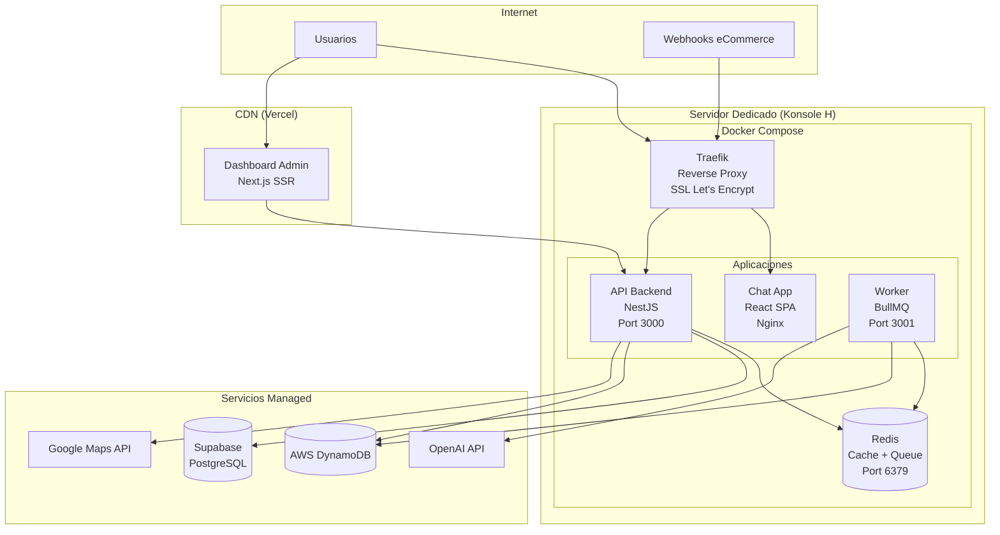

### 4.7 Docker Compose - Configuración

```yaml
# infrastructure/docker/docker-compose.yml
version: '3.8'

services:
  traefik:
    image: traefik:v2.10
    container_name: adresles-traefik
    restart: unless-stopped
    command:
      - "--api.insecure=true"
      - "--providers.docker=true"
      - "--providers.docker.exposedbydefault=false"
      - "--entrypoints.web.address=:80"
      - "--entrypoints.websecure.address=:443"
      - "--certificatesresolvers.letsencrypt.acme.httpchallenge=true"
      - "--certificatesresolvers.letsencrypt.acme.httpchallenge.entrypoint=web"
      - "--certificatesresolvers.letsencrypt.acme.email=${ACME_EMAIL}"
      - "--certificatesresolvers.letsencrypt.acme.storage=/letsencrypt/acme.json"
    ports:
      - "80:80"
      - "443:443"
    volumes:
      - /var/run/docker.sock:/var/run/docker.sock:ro
      - traefik-certificates:/letsencrypt
    networks:
      - adresles-network

  api:
    build:
      context: ../../apps/api
      dockerfile: Dockerfile
    container_name: adresles-api
    restart: unless-stopped
    environment:
      - NODE_ENV=production
      - PORT=3000
      - REDIS_URL=redis://redis:6379
      - SUPABASE_URL=${SUPABASE_URL}
      - SUPABASE_SERVICE_KEY=${SUPABASE_SERVICE_KEY}
      - AWS_REGION=${AWS_REGION}
      - AWS_ACCESS_KEY_ID=${AWS_ACCESS_KEY_ID}
      - AWS_SECRET_ACCESS_KEY=${AWS_SECRET_ACCESS_KEY}
      - GOOGLE_MAPS_API_KEY=${GOOGLE_MAPS_API_KEY}
    labels:
      - "traefik.enable=true"
      - "traefik.http.routers.api.rule=Host(`api.adresles.com`)"
      - "traefik.http.routers.api.entrypoints=websecure"
      - "traefik.http.routers.api.tls.certresolver=letsencrypt"
      - "traefik.http.services.api.loadbalancer.server.port=3000"
    depends_on:
      - redis
    networks:
      - adresles-network

  worker:
    build:
      context: ../../apps/worker
      dockerfile: Dockerfile
    container_name: adresles-worker
    restart: unless-stopped
    environment:
      - NODE_ENV=production
      - REDIS_URL=redis://redis:6379
      - OPENAI_API_KEY=${OPENAI_API_KEY}
      - AWS_REGION=${AWS_REGION}
      - AWS_ACCESS_KEY_ID=${AWS_ACCESS_KEY_ID}
      - AWS_SECRET_ACCESS_KEY=${AWS_SECRET_ACCESS_KEY}
    depends_on:
      - redis
    networks:
      - adresles-network

  web-chat:
    build:
      context: ../../apps/web-chat
      dockerfile: Dockerfile
    container_name: adresles-chat
    restart: unless-stopped
    labels:
      - "traefik.enable=true"
      - "traefik.http.routers.chat.rule=Host(`chat.adresles.com`)"
      - "traefik.http.routers.chat.entrypoints=websecure"
      - "traefik.http.routers.chat.tls.certresolver=letsencrypt"
      - "traefik.http.services.chat.loadbalancer.server.port=80"
    networks:
      - adresles-network

  redis:
    image: redis:7-alpine
    container_name: adresles-redis
    restart: unless-stopped
    volumes:
      - redis-data:/data
    command: redis-server --appendonly yes
    networks:
      - adresles-network

volumes:
  traefik-certificates:
  redis-data:

networks:
  adresles-network:
    driver: bridge
```

### 4.8 Diagramas de Secuencia

#### Secuencia 1: Checkout Adresles Completo

```mermaid
sequenceDiagram
    autonumber
    participant U as Usuario
    participant EC as eCommerce
    participant API as Adresles API
    participant Q as Redis Queue
    participant W as Worker
    participant AI as OpenAI
    participant DB as Supabase
    participant DDB as DynamoDB
    
    U->>EC: Completa checkout (nombre, teléfono)
    EC->>EC: Procesa pago
    EC->>API: POST /webhooks/woocommerce
    
    API->>API: Valida webhook signature
    API->>DB: Buscar/Crear User por teléfono
    API->>DB: Crear Order (PENDING_ADDRESS)
    API->>DDB: Crear Conversation
    API->>Q: Encolar job: process-conversation
    API-->>EC: 200 OK
    
    Q->>W: Consume job
    W->>DDB: Leer contexto conversación
    W->>DB: Leer datos usuario (is_registered, has_address)
    W->>W: Determinar journey (GET_ADDRESS)
    W->>W: Construir prompt con contexto
    W->>AI: Chat Completion
    AI-->>W: Respuesta IA
    W->>DDB: Guardar mensaje (assistant)
    W->>API: Notificar nuevo mensaje (WebSocket)
    
    API->>U: Push mensaje via WebSocket
    U->>API: Responde con dirección
    API->>DDB: Guardar mensaje (user)
    API->>Q: Encolar job: process-response
    
    Q->>W: Consume job
    W->>W: Validar dirección con GMaps
    W->>AI: Confirmar dirección
    AI-->>W: Mensaje confirmación
    W->>DDB: Guardar mensaje
    W->>API: Notificar
    
    API->>U: Push confirmación
    U->>API: Confirma dirección ✓
    
    API->>DB: Crear OrderAddress (snapshot)
    API->>DB: Update Order (ADDRESS_CONFIRMED)
    API->>EC: PUT /orders/{id} (sync dirección)
    EC-->>API: 200 OK
    API->>DB: Update Order (SYNCED)
```

#### Secuencia 2: Flujo de Reminders

```mermaid
sequenceDiagram
    autonumber
    participant W as Worker
    participant Q as Redis Queue
    participant DDB as DynamoDB
    participant API as API
    participant U as Usuario
    participant S as Soporte
    
    Note over W: Job inicial enviado
    W->>Q: Schedule reminder (15 min delay)
    
    Note over Q: Pasan 15 minutos sin respuesta
    Q->>W: Trigger reminder-1
    W->>DDB: Check conversation status
    
    alt Usuario ya respondió
        W->>W: Cancel reminder flow
    else Sin respuesta
        W->>DDB: Update reminder_count = 1
        W->>DDB: Guardar mensaje reminder
        W->>API: Notificar
        API->>U: Push reminder 1
        W->>Q: Schedule reminder-2 (15 min)
    end
    
    Note over Q: Pasan otros 15 min (total 30)
    Q->>W: Trigger reminder-2
    W->>DDB: Check status + reminder_count
    
    alt Sin respuesta
        W->>DDB: Update reminder_count = 2
        W->>DDB: Guardar mensaje reminder 2
        W->>API: Notificar
        API->>U: Push reminder 2
        W->>Q: Schedule escalation (30 min)
    end
    
    Note over Q: Pasan otros 30 min (total 60)
    Q->>W: Trigger escalation
    W->>DDB: Check status
    
    alt Sin respuesta
        W->>DDB: Update status = ESCALATED
        W->>W: Generar resumen incidencia
        W->>S: Enviar email soporte
        W->>DDB: Guardar mensaje timeout
        W->>API: Notificar
        API->>U: Push mensaje escalado
    end
```

### 4.9 CI/CD Pipeline (GitHub Actions)

Pipeline simplificado para tu nivel de experiencia, con comentarios explicativos.

```yaml
# .github/workflows/deploy.yml
name: Deploy to Production

# Cuándo ejecutar: al hacer push a main o manualmente
on:
  push:
    branches: [main]
  workflow_dispatch:  # Permite ejecutar manualmente desde GitHub

env:
  REGISTRY: ghcr.io
  IMAGE_PREFIX: ghcr.io/${{ github.repository }}

jobs:
  # Job 1: Ejecutar tests
  test:
    runs-on: ubuntu-latest
    steps:
      - name: Checkout código
        uses: actions/checkout@v4

      - name: Setup Node.js
        uses: actions/setup-node@v4
        with:
          node-version: '20'
          cache: 'pnpm'

      - name: Instalar pnpm
        uses: pnpm/action-setup@v2
        with:
          version: 8

      - name: Instalar dependencias
        run: pnpm install

      - name: Ejecutar linter
        run: pnpm lint

      - name: Ejecutar tests
        run: pnpm test

  # Job 2: Construir y publicar imágenes Docker
  build:
    needs: test  # Solo si tests pasan
    runs-on: ubuntu-latest
    strategy:
      matrix:
        app: [api, worker, web-chat]  # Construir cada app
    
    steps:
      - name: Checkout código
        uses: actions/checkout@v4

      - name: Login a GitHub Container Registry
        uses: docker/login-action@v3
        with:
          registry: ${{ env.REGISTRY }}
          username: ${{ github.actor }}
          password: ${{ secrets.GITHUB_TOKEN }}

      - name: Construir y publicar imagen
        uses: docker/build-push-action@v5
        with:
          context: ./apps/${{ matrix.app }}
          push: true
          tags: |
            ${{ env.IMAGE_PREFIX }}/${{ matrix.app }}:latest
            ${{ env.IMAGE_PREFIX }}/${{ matrix.app }}:${{ github.sha }}

  # Job 3: Desplegar en servidor
  deploy:
    needs: build  # Solo si build pasa
    runs-on: ubuntu-latest
    
    steps:
      - name: Checkout código
        uses: actions/checkout@v4

      - name: Copiar docker-compose al servidor
        uses: appleboy/scp-action@v0.1.4
        with:
          host: ${{ secrets.SERVER_HOST }}
          username: ${{ secrets.SERVER_USER }}
          key: ${{ secrets.SERVER_SSH_KEY }}
          source: "infrastructure/docker/docker-compose.yml"
          target: "/opt/adresles"
          strip_components: 2

      - name: Deploy via SSH
        uses: appleboy/ssh-action@v1.0.0
        with:
          host: ${{ secrets.SERVER_HOST }}
          username: ${{ secrets.SERVER_USER }}
          key: ${{ secrets.SERVER_SSH_KEY }}
          script: |
            cd /opt/adresles
            
            # Login a GitHub Container Registry
            echo ${{ secrets.GITHUB_TOKEN }} | docker login ghcr.io -u ${{ github.actor }} --password-stdin
            
            # Descargar nuevas imágenes
            docker compose pull
            
            # Reiniciar servicios con nuevas imágenes
            docker compose up -d --remove-orphans
            
            # Limpiar imágenes antiguas
            docker image prune -f
            
            # Verificar que todo está corriendo
            docker compose ps
```

#### Secrets necesarios en GitHub

| Secret | Descripción | Ejemplo |
|--------|-------------|---------|
| `SERVER_HOST` | IP o dominio de tu servidor | `123.45.67.89` |
| `SERVER_USER` | Usuario SSH | `deploy` |
| `SERVER_SSH_KEY` | Clave privada SSH | (contenido de ~/.ssh/id_rsa) |

#### Setup inicial en el servidor (una sola vez)

```bash
# 1. Crear usuario para deploy
sudo adduser deploy
sudo usermod -aG docker deploy

# 2. Crear directorio de la aplicación
sudo mkdir -p /opt/adresles
sudo chown deploy:deploy /opt/adresles

# 3. Crear archivo de variables de entorno
cat > /opt/adresles/.env << EOF
ACME_EMAIL=tu@email.com
SUPABASE_URL=https://xxx.supabase.co
SUPABASE_SERVICE_KEY=xxx
AWS_REGION=eu-west-1
AWS_ACCESS_KEY_ID=xxx
AWS_SECRET_ACCESS_KEY=xxx
OPENAI_API_KEY=sk-xxx
GOOGLE_MAPS_API_KEY=xxx
EOF

# 4. Proteger el archivo .env
chmod 600 /opt/adresles/.env

# 5. Configurar SSH key para GitHub Actions
# (añadir clave pública a ~/.ssh/authorized_keys del usuario deploy)
```

### 4.10 Seguridad

#### Capas de Seguridad

```mermaid
flowchart TB
    subgraph "Capa 1: Perímetro"
        FW[Firewall<br/>Solo 80, 443, 22]
        SSL[SSL/TLS<br/>Let's Encrypt]
        RATE[Rate Limiting<br/>Traefik]
    end
    
    subgraph "Capa 2: Aplicación"
        AUTH[Auth<br/>Supabase JWT]
        APIKEY[API Keys<br/>Webhooks eCommerce]
        VALID[Validación<br/>DTOs + Zod]
        CORS[CORS<br/>Orígenes permitidos]
    end
    
    subgraph "Capa 3: Datos"
        RLS[Row Level Security<br/>Supabase RLS]
        ENC[Encriptación<br/>At rest + Transit]
        AUDIT[Audit Log<br/>DynamoDB]
    end
    
    FW --> SSL --> RATE --> AUTH --> APIKEY --> VALID --> CORS --> RLS --> ENC --> AUDIT
```

#### Checklist de Seguridad

| Área | Medida | Implementación |
|------|--------|----------------|
| **Red** | Firewall | UFW: solo 80, 443, 22 |
| **Red** | SSL/TLS | Let's Encrypt via Traefik |
| **Red** | Rate limiting | Traefik middleware |
| **Auth** | JWT tokens | Supabase Auth |
| **Auth** | API Keys | Para webhooks de eCommerce |
| **Auth** | Webhook signatures | Validar HMAC de cada plataforma |
| **API** | Input validation | class-validator + Zod |
| **API** | CORS | Whitelist de dominios |
| **API** | Helmet | Headers de seguridad |
| **DB** | Row Level Security | Supabase RLS policies |
| **DB** | Encriptación | Supabase (at rest), TLS (transit) |
| **Secrets** | Variables de entorno | .env en servidor, no en repo |
| **Secrets** | Rotación | API keys rotables |
| **Audit** | Logging | Todos los cambios en AuditLog |
| **Backup** | Base de datos | Supabase automático + DynamoDB PITR |

#### Ejemplo de RLS Policy (Supabase)

```sql
-- Un eCommerce solo puede ver sus tiendas
CREATE POLICY "ecommerce_isolation" ON store
    FOR ALL
    USING (
        ecommerce_id IN (
            SELECT id FROM ecommerce 
            WHERE id = auth.jwt() ->> 'ecommerce_id'
        )
    );

-- Un eCommerce solo puede ver pedidos de sus tiendas
CREATE POLICY "orders_isolation" ON "order"
    FOR ALL
    USING (
        store_id IN (
            SELECT id FROM store 
            WHERE ecommerce_id = auth.jwt() ->> 'ecommerce_id'
        )
    );
```

### 4.11 Monitorización y Observabilidad

```mermaid
flowchart LR
    subgraph "Aplicaciones"
        API[API]
        WK[Worker]
    end
    
    subgraph "Métricas y Logs"
        PROM[Prometheus<br/>Métricas]
        LOKI[Loki<br/>Logs]
    end
    
    subgraph "Visualización"
        GRAF[Grafana<br/>Dashboards]
    end
    
    subgraph "Alertas"
        AM[Alertmanager<br/>→ Email/Slack]
    end
    
    API --> PROM
    WK --> PROM
    API --> LOKI
    WK --> LOKI
    
    PROM --> GRAF
    LOKI --> GRAF
    PROM --> AM
```

#### Métricas Clave a Monitorizar

| Métrica | Descripción | Alerta si |
|---------|-------------|-----------|
| `http_requests_total` | Total de requests | - |
| `http_request_duration_seconds` | Latencia de requests | p95 > 2s |
| `conversation_messages_total` | Mensajes procesados | - |
| `conversation_completion_time` | Tiempo hasta dirección obtenida | avg > 30min |
| `openai_api_latency` | Latencia de OpenAI | p95 > 10s |
| `openai_api_errors` | Errores de OpenAI | > 5/min |
| `queue_jobs_waiting` | Jobs pendientes | > 100 |
| `queue_jobs_failed` | Jobs fallidos | > 10/hora |

### 4.12 API Endpoints Principales

```yaml
# OpenAPI simplificado
openapi: 3.0.0
info:
  title: Adresles API
  version: 1.0.0

paths:
  # === Webhooks (eCommerce → Adresles) ===
  /webhooks/woocommerce:
    post:
      summary: Recibe pedidos de WooCommerce
      security:
        - webhookSignature: []
      requestBody:
        content:
          application/json:
            schema:
              $ref: '#/components/schemas/WooCommerceOrder'
      responses:
        '200':
          description: Pedido recibido
        '401':
          description: Firma inválida

  # === Conversations ===
  /conversations:
    get:
      summary: Lista conversaciones del usuario
      security:
        - bearerAuth: []
      parameters:
        - name: status
          in: query
          schema:
            type: string
            enum: [ACTIVE, COMPLETED, ESCALATED]
      responses:
        '200':
          description: Lista de conversaciones

  /conversations/{id}/messages:
    get:
      summary: Obtiene mensajes de una conversación
      security:
        - bearerAuth: []
    post:
      summary: Envía mensaje del usuario
      security:
        - bearerAuth: []
      requestBody:
        content:
          application/json:
            schema:
              type: object
              properties:
                content:
                  type: string

  # === Orders (Admin) ===
  /admin/orders:
    get:
      summary: Lista pedidos de la tienda
      security:
        - bearerAuth: []
        - apiKey: []
      parameters:
        - name: store_id
          in: query
          required: true
        - name: status
          in: query

  # === Addresses ===
  /addresses:
    get:
      summary: Lista direcciones del usuario
      security:
        - bearerAuth: []
    post:
      summary: Crea nueva dirección
      security:
        - bearerAuth: []

  /addresses/validate:
    post:
      summary: Valida dirección con Google Maps
      security:
        - bearerAuth: []
      requestBody:
        content:
          application/json:
            schema:
              type: object
              properties:
                address:
                  type: string

components:
  securitySchemes:
    bearerAuth:
      type: http
      scheme: bearer
      bearerFormat: JWT
    apiKey:
      type: apiKey
      in: header
      name: X-API-Key
    webhookSignature:
      type: apiKey
      in: header
      name: X-WC-Webhook-Signature
```

---

## Registro de Decisiones

| Fecha | Decisión | Justificación |
|-------|----------|---------------|
| 30/01/2026 | Uso de GPT-4.0 para conversaciones | Requisito del cliente. Capacidad superior en comprensión de lenguaje natural. |
| 30/01/2026 | App propia en lugar de WhatsApp | Simplifica MVP, evita dependencia de WhatsApp Business API. |
| 30/01/2026 | Teléfono como identificador único | Simplifica onboarding, común en el mercado. Aceptamos limitación de teléfonos compartidos. |
| 30/01/2026 | Google Maps API para validación | Estándar de la industria, cobertura global, normalización consistente. |
| 30/01/2026 | Timeout 15 min + reminders | Balance entre urgencia y no ser intrusivo. |
| 30/01/2026 | Webhook como método principal | Tiempo real, soportado por todas las plataformas target. |
| 30/01/2026 | Fee variable 2.5%-5% | Competitivo para eCommerce, escalable con volumen. |
| 30/01/2026 | WooCommerce primero | Mayor cuota de mercado, comunidad activa, integración bien documentada. |
| 30/01/2026 | Supabase para datos relacionales | Auth integrado, RLS nativo, Realtime, PostgreSQL estándar. |
| 30/01/2026 | DynamoDB para conversaciones | TTL nativo, alto throughput, experiencia AWS del equipo. |
| 30/01/2026 | GiftRecipient sin FK a User | El regalado puede no existir como usuario. Depende solo de Order. |
| 30/01/2026 | Monolito Modular | Velocidad de desarrollo, un solo deploy, fácil extracción futura a microservicios. |
| 30/01/2026 | Node.js + NestJS para backend | TypeScript E2E, ecosistema maduro, buen soporte para WebSockets y colas. |
| 30/01/2026 | Worker separado para conversaciones IA | Aísla carga de OpenAI, permite escalar independientemente, no bloquea API. |
| 30/01/2026 | Redis para cache y colas | BullMQ para jobs, cache de sesiones, PubSub para WebSocket. |
| 30/01/2026 | React + Vite para Chat App | SPA interactiva, no necesita SSR, puede ser PWA. |
| 30/01/2026 | Next.js para Dashboard Admin | SSR para SEO de landing, Server Components para seguridad. |
| 30/01/2026 | Vercel para Dashboard Admin | CDN global, deploy automático, free tier generoso. |
| 30/01/2026 | Servidor dedicado para Backend | Coste fijo predecible, control total, ya disponible (Konsole H). |
| 30/01/2026 | Docker Compose para deployment | Reproducibilidad, facilidad de gestión, apropiado para servidor único. |
| 30/01/2026 | Traefik como reverse proxy | SSL automático con Let's Encrypt, integración nativa con Docker. |
| 30/01/2026 | GitHub Actions para CI/CD | Integración con GitHub, free tier generoso, fácil configuración. |
| 30/01/2026 | pnpm + Turborepo para monorepo | Velocidad de builds, cache compartido, manejo eficiente de workspaces. |

---

## Glosario

| Término | Definición |
|---------|------------|
| **Checkout Adresles** | Proceso de pago simplificado donde el usuario solo proporciona nombre y teléfono |
| **Libreta de Direcciones** | Almacén de direcciones favoritas del usuario en Adresles |
| **Journey** | Flujo de interacción específico según el contexto del usuario |
| **Regalado** | Persona que recibe un pedido como regalo |
| **Reminder** | Mensaje recordatorio enviado cuando el usuario no responde |
| **Webhook** | Notificación HTTP automática del eCommerce a Adresles cuando ocurre un evento |
| **conversation_type** | Tipo de conversación: INFORMATION, GET_ADDRESS, REGISTER, GIFT_NOTIFICATION, SUPPORT |
| **user_type** | Tipo de usuario en la conversación: BUYER (comprador) o RECIPIENT (regalado) |
| **RLS** | Row Level Security - Seguridad a nivel de fila en PostgreSQL/Supabase |
| **TTL** | Time To Live - Tiempo de vida automático para registros en DynamoDB |
| **Monolito Modular** | Arquitectura donde toda la aplicación está en un solo desplegable, pero organizada en módulos con interfaces claras |
| **Worker** | Proceso separado que ejecuta tareas asíncronas (como llamadas a OpenAI) sin bloquear el API principal |
| **BullMQ** | Librería de Node.js para gestión de colas de trabajo basada en Redis |
| **NestJS** | Framework de Node.js para construir aplicaciones backend escalables con TypeScript |
| **Traefik** | Reverse proxy y load balancer moderno con integración nativa de Docker y SSL automático |
| **CI/CD** | Continuous Integration / Continuous Deployment - Automatización de tests y despliegues |
| **Docker Compose** | Herramienta para definir y ejecutar aplicaciones multi-contenedor Docker |
| **JWT** | JSON Web Token - Estándar para autenticación stateless |
| **HMAC** | Hash-based Message Authentication Code - Para validar firmas de webhooks |
| **Reverse Proxy** | Servidor que recibe peticiones y las redirige a los servicios internos apropiados |
| **WebSocket** | Protocolo de comunicación bidireccional en tiempo real sobre TCP |
| **PWA** | Progressive Web App - Aplicación web que puede instalarse como app nativa |
