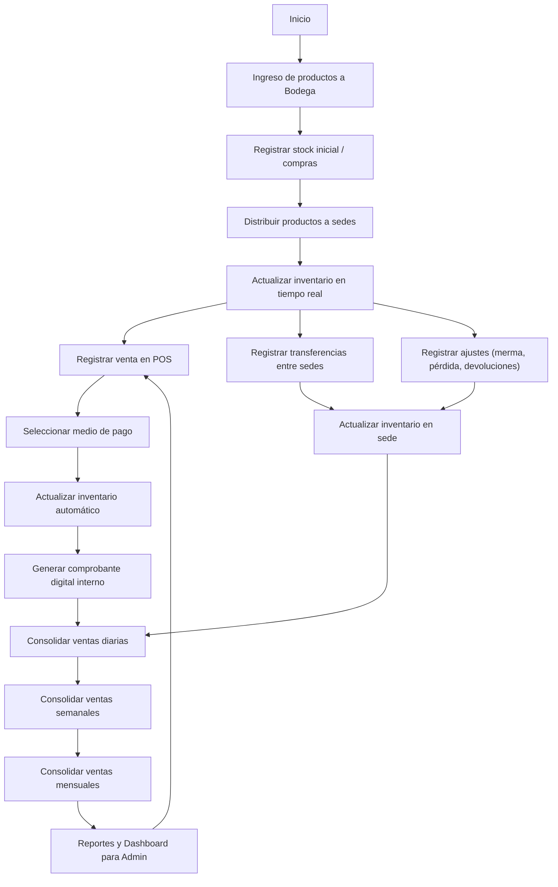
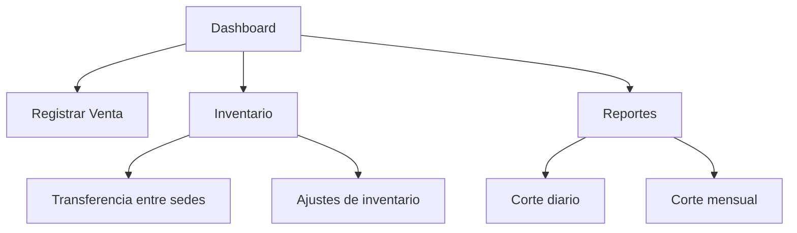

# 1. Descripción general del producto

## 1.1. Objetivo

El objetivo del sistema es reemplazar el uso de múltiples archivos Excel para la gestión de inventario y ventas, centralizando la información en una aplicación web que permita:

- Control de inventario en tiempo real en bodega y sedes.
- Registro de ventas con medios de pago básicos.
- Eliminación de reprocesos y errores manuales.
- Generación automática de reportes diarios, semanales y mensuales.
- Escalabilidad para más sedes y nuevas funcionalidades (facturación electrónica DIAN en el futuro).

---

## 1.2. Características y funcionalidades principales

- **Inventario**: carga inicial, recepción de compras, transferencias entre sedes, ajustes por merma o devoluciones.
- **Ventas**: registro de ventas POS, actualización automática de stock, manejo de medios de pago.
- **Reportes**: ventas diarias/semanales/mensuales, stock por sede, movimientos de inventario.
- **Roles**: Admin (maneja inventario y movimientos) y Ventas (registra ventas).
- **Costeo**: promedio ponderado.
- **Operación diaria**: corte automático de ventas e inventario al final del día.
- **Accesibilidad**: aplicación responsive accesible desde desktop y móvil.

### 📊 Mapa de Procesos TO-BE (Nuevo Sistema de Inventario y Ventas)

#### 1. Procesos clave en el nuevo sistema

El sistema de gestión de inventario y ventas contempla los siguientes procesos principales:

1. **Gestión de inventario**

   - Ingreso de compras desde bodega principal.
   - Transferencias de productos entre sedes.
   - Ajustes por merma, pérdida o devoluciones.
   - Control de stock mínimo por producto.

2. **Gestión de ventas**

   - Registro de venta en punto de venta.
   - Selección de medios de pago (efectivo, tarjeta, transferencia, consignación).
   - Actualización automática de inventario.
   - Corte diario, semanal y mensual de ventas.

3. **Reportes y control**
   - Stock disponible por sede.
   - Ventas por día, semana y mes.
   - Movimientos de inventario.
   - Margen y rotación de productos (futuro).

---

#### 2. Diagrama de flujo TO-BE



---

## 1.3. Diseño y experiencia de usuario

### Principios de UX

- **Simplicidad**: minimizar clics para registrar una venta o movimiento.
- **Claridad**: visualización clara del stock disponible por sede.
- **Responsividad**: accesible desde desktop y dispositivos móviles.
- **Enfoque en roles**: vistas simplificadas para el rol Ventas y completas para el rol Admin.

### Flujo de experiencia

1. **Inicio en sede**: el usuario ingresa a la aplicación (sin login en MVP).
2. **Vista principal**: dashboard con stock y ventas del día.
3. **Registro de venta**: selección de producto → medio de pago → confirmación.
4. **Actualización automática**: se descuenta stock y se registra la venta en el corte del día.
5. **Vista de reportes**: acceso rápido a cortes diarios, semanales y mensuales.
6. **Vista Admin**: gestión de inventario, transferencias, ajustes y reportes detallados.

### Mockup conceptual (Mermaid Wireframe)



---

## 1.4. Instrucciones de instalación (MVP en local)

Requisitos previos
• Backend: .NET 8 (C#)
• Frontend: Node.js 23.x + React 18
• Base de datos: SQL Server (opción inicial)
• Gestor de dependencias: Yarn o npm
• Entorno: Docker (opcional para estandarizar despliegue)

Pasos de instalación

1. Clonar repositorio

```
    git clone <url-del-repositorio>
    cd inventario-ventas
```

2. Instalar dependencias frontend

```
cd frontend
yarn install
```

3. Configurar backend

- Crear archivo appsettings.Development.json con cadena de conexión a SQL Server.
- Ejecutar migraciones iniciales:

```
dotnet ef database update
```

4. Levantar servicios

- Backend:

```
cd backend
dotnet run
```

- Frontend:

```
cd frontend
yarn start
```

5. Acceso a la aplicación

- Abrir en navegador: http://localhost:3000
