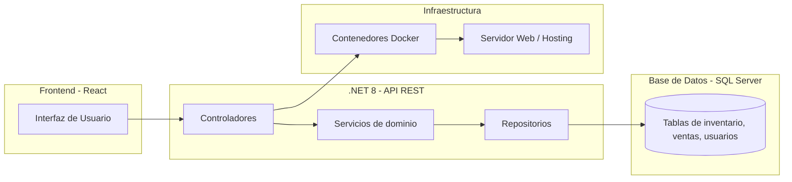
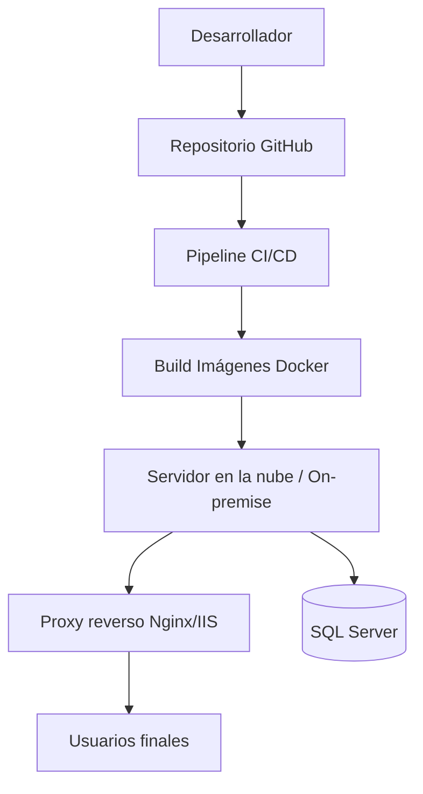

# 2. Arquitectura del sistema

## 2.1. Diagrama de arquitectura



Patrón utilizado
• Clean Architecture / Hexagonal adaptado
• Capa de dominio separada de la infraestructura.
• Controladores y servicios desacoplados con inyección de dependencias.
• Facilita pruebas unitarias y escalabilidad.

---

## 2.2. Descripción de componentes principales

- Frontend (React 18)
- Implementa la interfaz responsive.
- Consume API REST del backend.
- Maneja roles y flujos de ventas e inventario.
- Backend (.NET 8 / C#)
- Exposición de endpoints RESTful.
- Servicios de negocio: ventas, movimientos, reportes.
- Cálculo de costo promedio ponderado.
- Control de transferencias entre sedes.
- Base de datos (SQL Server)
- Entidades principales: Productos, Inventario, Ventas, Movimientos, Usuarios.
- Integridad referencial y soporte para consultas de reportes.
- Infraestructura (Docker / Hosting en la nube o servidor local)
- Contenedores para backend y frontend.
- Posibilidad de orquestación futura con Kubernetes.

---

## 2.3. Descripción de alto nivel y estructura de ficheros

```
inventario-ventas/
│
├── backend/
│   ├── Application/             # Casos de uso y lógica de negocio
│   ├── Domain/                  # Entidades, DTOs, Value Objects, Interfaces
│   ├── Infrastructure/          # Persistencia, Repositorios, APIs externas
│   ├── Presentation/            # Controladores, Program.cs (entrypoint)
│   └── backend.sln
│
├── frontend/
│   ├── Application/             # Lógica de aplicación
│   │   ├── usecases/            # Casos de uso (ej: registrarVenta)
│   │   ├── services/            # Lógica para orquestar datos
│   │   └── adapters/            # Normalización/transformación de responses
│   │
│   ├── Domain/                  # Entidades y modelos de frontend
│   │   ├── entities/            # Entidades de negocio (Producto, Venta, etc.)
│   │   ├── dtos/                # Data Transfer Objects
│   │   └── valueObjects/        # Objetos de valor
│   │
│   ├── Infrastructure/          # Conexión a APIs y manejo de estado
│   │   ├── api/                 # Clientes HTTP (axios/fetch)
│   │   ├── redux/               # Store, reducers, slices
│   │   └── persistence/         # Almacenamiento local (localStorage, etc.)
│   │
│   ├── Presentation/            # Capa visual (React components)
│   │   ├── components/          # Componentes UI reutilizables
│   │   ├── pages/               # Páginas principales
│   │   ├── layouts/             # Plantillas de vistas
│   │   └── App.tsx              # Entry point de la app React
│   │
│   └── package.json
│
├── devops/
│   ├── docker/                  # Configuración de contenedores
│   ├── ci-cd/                   # Pipelines (GitHub Actions / Azure DevOps)
│   └── scripts/                 # Scripts de despliegue, backup
│
├── docs/                        # Documentación del proyecto
└── README.md
```

La organización de carpetas sigue una **arquitectura limpia (Clean Architecture)** con inspiración en **Domain-Driven Design (DDD)**, lo cual asegura separación de responsabilidades, mantenibilidad y escalabilidad.

### Backend

- **Application/**  
  Contiene los **casos de uso** (ej. `RegistrarVenta`, `TransferirInventario`).  
  Aquí está la lógica de aplicación que orquesta entidades del dominio y repositorios, sin depender de detalles de infraestructura.  
  _Patrón aplicado: Application Layer._

- **Domain/**  
  Núcleo de negocio: **entidades, DTOs, Value Objects y eventos de dominio**.  
  Define interfaces para repositorios, asegurando independencia de la infraestructura.  
  _Patrón aplicado: Domain Layer (DDD)._

- **Infrastructure/**  
  Implementación de persistencia (ej. Entity Framework Core), repositorios concretos, migraciones y conexiones a APIs externas.  
  _Patrón aplicado: Infrastructure Layer._

- **Presentation/**  
  Punto de entrada de la aplicación backend (.NET). Incluye los **Controllers** (API REST) y `Program.cs`.  
  _Patrón aplicado: Presentation Layer (exposición de endpoints)._

### Frontend

- **Application/**  
  Casos de uso y lógica de aplicación. Orquesta peticiones a Infrastructure, transforma datos y los pasa a Domain.  
  _Patrón aplicado: Application Layer en frontend._

- **Domain/**  
  Contiene los modelos y entidades de negocio usados en el frontend: entidades, DTOs y objetos de valor.  
  Garantiza consistencia de datos entre frontend y backend.  
  _Patrón aplicado: Domain Layer._

- **Infrastructure/**  
  Conexión a APIs (`api/`), gestión del estado global (`redux/`), y persistencia local (`localStorage`, `sessionStorage`).  
  _Patrón aplicado: Infrastructure Layer._

- **Presentation/**  
  Capa visual del frontend. Incluye **componentes, páginas y layouts** en React.  
  Es la única capa que interactúa con el usuario final.  
  _Patrón aplicado: Presentation Layer._

### DevOps

- **devops/**  
  Contiene configuraciones de **Docker, CI/CD y scripts de despliegue**.  
  Permite automatizar builds, despliegues y tareas de mantenimiento (ej. backups).  
  _Patrón aplicado: Infrastructure as Code (IaC)._

### Beneficios del patrón aplicado

- Separación clara de responsabilidades.
- Alta cohesión dentro de cada capa, bajo acoplamiento entre ellas.
- Facilidad de pruebas unitarias y de integración.
- Posibilidad de reemplazar tecnologías (p. ej., cambiar SQL Server por MongoDB) sin afectar el dominio ni los casos de uso.

---

## 2.4. Infraestructura y despliegue

### Entorno de desarrollo local

- **Backend**: .NET 8 corriendo en `http://localhost:5000`.
- **Frontend**: React corriendo en `http://localhost:3000`.
- **Base de datos**: SQL Server local o en contenedor, puerto `1433`.
- **Gestión de contenedores**: uso de `docker-compose` para orquestar backend, frontend y base de datos en un único entorno.

### Infraestructura propuesta para producción

1. **Contenedores Docker**

   - Backend, frontend y base de datos en imágenes separadas.
   - Configuración en `devops/docker/docker-compose.yml`.

2. **Servidor / Hosting**

   - Puede desplegarse en:
     - Nube (Azure, AWS, GCP).
     - Servidor físico de la empresa.
   - Proxy reverso con **Nginx** o **IIS**.

3. **Pipeline CI/CD (en `devops/ci-cd/`)**

   - Automatización con **GitHub Actions** o **Azure DevOps**.
   - Pasos del pipeline:
     1. Compilación y pruebas del backend.
     2. Compilación del frontend (build de React).
     3. Construcción de imágenes Docker.
     4. Despliegue automático en servidor/nube.

4. **Escalabilidad**
   - En el futuro, se podrá orquestar con **Kubernetes** (Azure AKS, AWS EKS).
   - Posibilidad de balancear carga con múltiples instancias del backend.

### Diagrama de infraestructura



## 2.5. Seguridad

- Control de roles (Admin, Ventas).
- Login con sesión expirada a medianoche (fase 2).
- Conexión HTTPS obligatoria.
- Sanitización de entradas en API.
- Validaciones de integridad en backend antes de modificar stock.
- Backups programados de base de datos.

Beneficios de este enfoque

- Consistencia entre entornos (gracias a Docker).
- Automatización de despliegues con CI/CD.
- Flexibilidad: se puede hospedar en la nube o en infraestructura propia.
- Escalabilidad futura con Kubernetes.

## 2.6. Tests

- Backend
- Pruebas unitarias de servicios (cálculo de costo promedio, transferencias, ajustes).
- Pruebas de integración de endpoints.
- Frontend
- Pruebas unitarias de componentes (Jest + React Testing Library).
- Pruebas E2E (Cypress) para flujo de ventas.
- Base de datos
- Validación de integridad referencial.
- Seeds de datos iniciales para pruebas.
