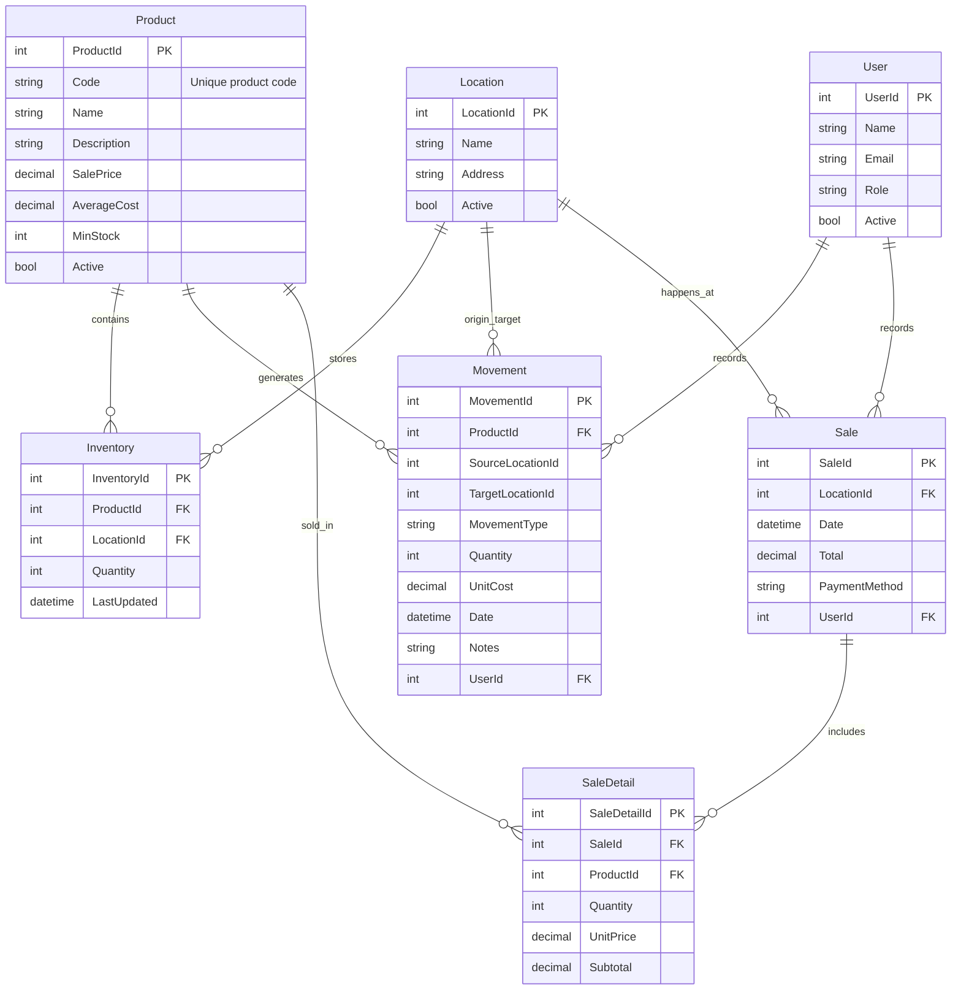

# 3. Modelo de Datos

---

## 3.1. Diagrama del modelo de datos

- Permite inventario en tiempo real por sede y producto.
- Maneja costeo por promedio ponderado mediante movimientos.
- Escalable: soporta más sedes y nuevos tipos de movimientos.
- Diferencia claramente entre ventas y movimientos administrativos.
- Uso de Code en Product garantiza un identificador de negocio independiente del ID interno.

3.2. Descripción de entidades principales

Producto (Product)

- ProductId (PK, int) → Identificador único interno.
- Code (string, unique, not null) → Código único de negocio.
- Name (string, not null).
- Description (string, opcional).
- SalePrice (decimal, not null).
- AverageCost (decimal, calculado con movimientos de entrada).
- MinStock (int, configurable por producto).
- Active (bool).

Inventario (Inventory)

- InventoryId (PK, int).
- ProductId (FK → Product).
- LocationId (FK → Location).
- Quantity (int).
- LastUpdated (datetime).
- Nota: representa stock por producto en cada sede.

Movimiento (Movement)

- MovementId (PK, int).
- ProductId (FK → Product).
- SourceLocationId (int, nullable).
- TargetLocationId (int, nullable).
- MovementType (string → Inbound, Outbound, Transfer, Adjustment).
- Quantity (int).
- UnitCost (decimal).
- Date (datetime).
- Notes (string, opcional).
- UserId (FK → User).

Venta (Sale)

- SaleId (PK, int).
- LocationId (FK → Location).
- Date (datetime).
- Total (decimal).
- PaymentMethod (string → Cash, Card, BankTransfer, Deposit).
- UserId (FK → User).

DetalleVenta (SaleDetail)

- SaleDetailId (PK, int).
- SaleId (FK → Sale).
- ProductId (FK → Product).
- Quantity (int).
- UnitPrice (decimal).
- Subtotal (decimal).

Usuario (User)

- UserId (PK, int).
- Name (string).
- Email (string, unique).
- Role (string → Admin, Sales).
- Active (bool).

Sede (Location)

- LocationId (PK, int).
- Name (string).
- Address (string).
- Active (bool).
