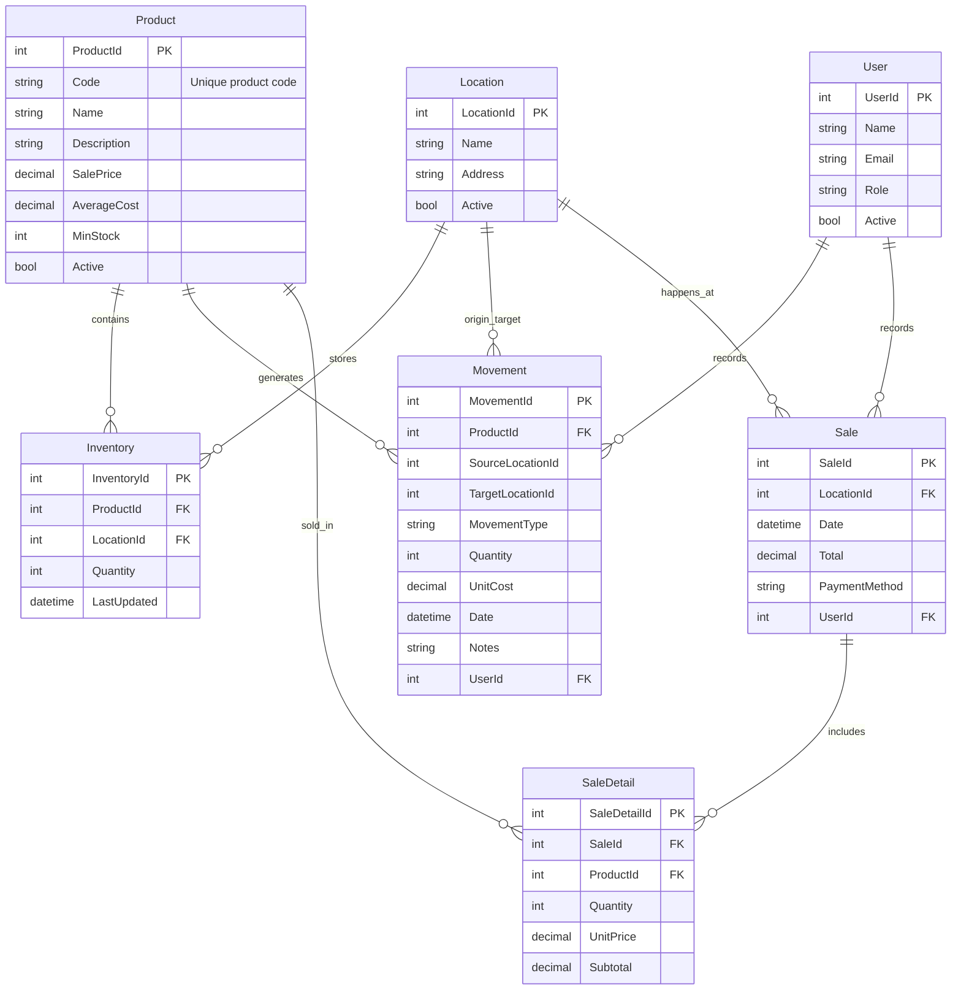

# 📘 Proyecto: Sistema de Gestión de Inventario y Ventas

---

## Índice

1. [Descripción general del producto](#1-descripción-general-del-producto)
2. [Arquitectura del sistema](#2-arquitectura-del-sistema)
3. [Modelo de datos](#3-modelo-de-datos)
4. [Especificación de la API](#4-especificación-de-la-api)
5. [Historias de usuario](#5-historias-de-usuario)
6. [Tickets de trabajo](#6-tickets-de-trabajo)
7. [Pull Requests](#7-pull-requests)

---

## [1. Descripción general del producto](./1-DescripciónGeneralDelProducto.md)

- El sistema reemplaza el uso de múltiples archivos Excel para la gestión de inventario y ventas.
- Permite registrar productos, movimientos de stock entre sedes y ventas diarias.
- Consolida información en tiempo real y genera reportes automáticos diarios, semanales y mensuales.
- Escalable a más sedes, con posibilidad de incluir facturación electrónica DIAN en el futuro.

**Objetivos clave:**

- Exactitud de inventario ≥ 95%.
- Eliminación de consolidado manual en Excel.
- Ventas 100% registradas en el sistema.

---

## [2. Arquitectura del sistema](./2-ArquitecturaDelSistema.md)

### 2.1 Patrón utilizado

Arquitectura **Clean Architecture** inspirada en **DDD**, con **Inyección de Dependencias (DI)** en todas las capas de backend y frontend.  
Esto permite:

- Bajo acoplamiento.
- Sustitución de implementaciones (repositorios, servicios, APIs externas).
- Fácil testeo unitario e integración.

### 2.2 Backend

Estructura de carpetas:

```
backend/
├── Application/       # Casos de uso, servicios, handlers
├── Domain/            # Entidades, DTOs, Value Objects, interfaces
├── Infrastructure/    # EF Core, repositorios, migraciones, APIs externas
├── Presentation/      # Controllers, Program.cs
```

- **DI**: Se configura en `Program.cs` para inyectar repositorios, servicios de aplicación y DbContext.

### 2.3 Frontend

Estructura de carpetas:

```
frontend/
├── Application/       # Casos de uso, lógica para orquestar data
├── Domain/            # Entidades, DTOs, value objects
├── Infrastructure/    # API client (Axios/Fetch), Redux, persistencia local
├── Presentation/      # Componentes, páginas, layouts
```

- **DI**: Uso de contenedores de dependencias (ej. `inversifyJS` o hooks/context personalizados) para inyectar servicios, repositorios y casos de uso en componentes.

### 2.4 DevOps

```
devops/
├── docker/            # Dockerfiles y docker-compose
├── ci-cd/             # Pipelines (GitHub Actions / Azure DevOps)
└── scripts/           # Deploy, backup
```

### 2.5 Infraestructura y despliegue

- Local: Docker Compose (frontend, backend, DB).
- Producción: Azure/AWS/GCP + CI/CD.
- Proxy reverso: Nginx o IIS.

### 2.6 Seguridad

- Control de roles (Admin, Ventas).
- Sesiones expiran a medianoche.
- HTTPS obligatorio.
- Validación de datos y sanitización.

### 2.7 Tests

- **Backend:** xUnit + pruebas de integración con EF Core InMemory.
- **Frontend:** React Testing Library + Cypress (E2E).

---

## [3. Modelo de datos](./3-ModeloDeDatos.md)

ERD (en inglés):



---

## [4. Especificación de la API](./4-EspecificacionesApi.md)

Endpoints principales:

- **POST /products** → Registrar productos y compras iniciales.
- **POST /movements/transfer** → Transferir inventario entre sedes.
- **GET /inventory** → Consultar inventario por sede o total.

Formato OpenAPI documentado en el capítulo 4.

---

## [5. Historias de usuario](./5-HistoriasDeUsuario.md)

1. Registrar productos como saldos iniciales / compras.
2. Transferencia de inventario entre sedes.
3. Registrar ventas de productos.

---

## [6. Tickets de trabajo](./6-TicketsDeTrabajo.md)

- **Ticket 1 (DB):** Configuración inicial con EF Core y migraciones.
- **Ticket 2 (Backend):** Endpoint `POST /products` con lógica de inventario y costo promedio.
- **Ticket 3 (Frontend):** Formulario de transferencia con Redux y validaciones.

---

## [7. Pull Requests](./7-PullRequests.md)

- **PR 1 (DB):** Configuración inicial con EF Core y migraciones.
- **PR 2 (Backend):** Endpoint para registrar productos y compras iniciales.
- **PR 3 (Frontend):** Interfaz para transferencias de inventario.

---
