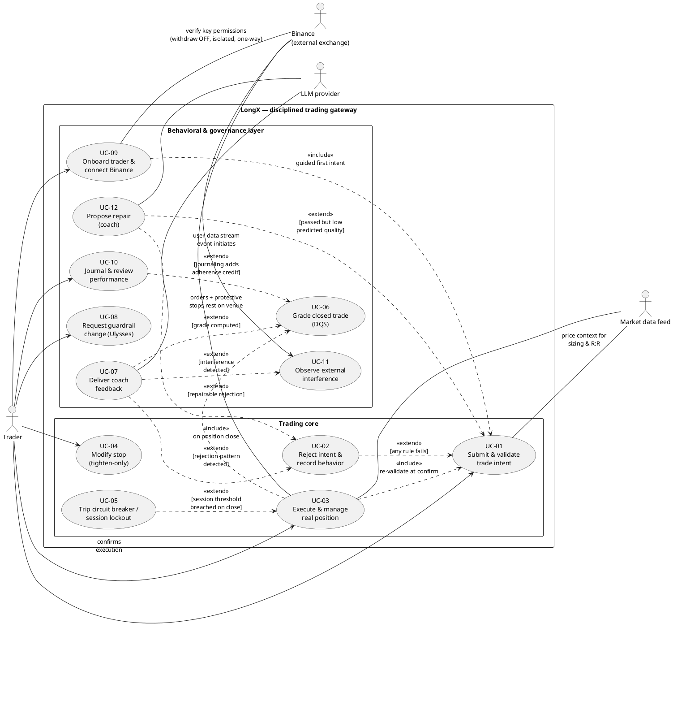
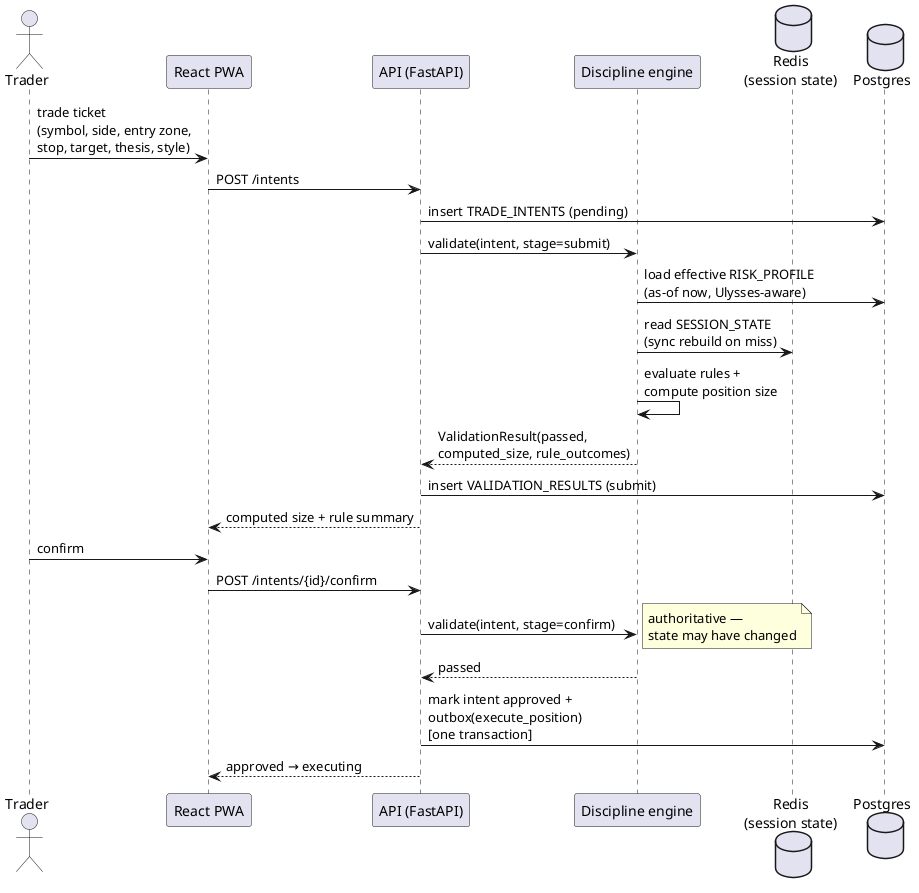
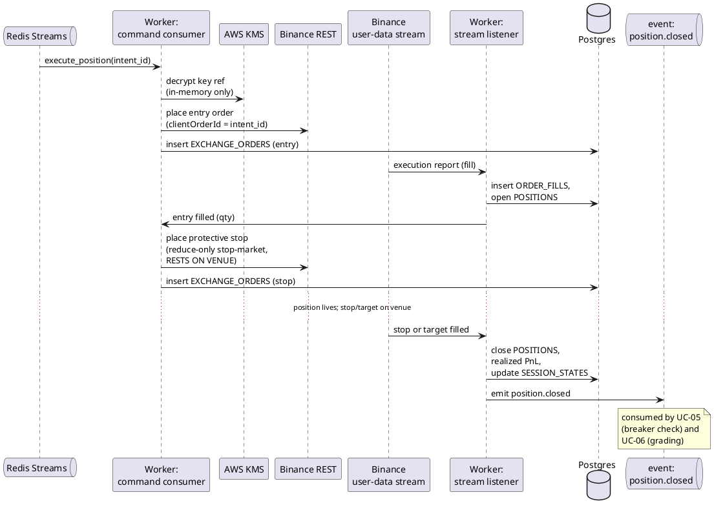
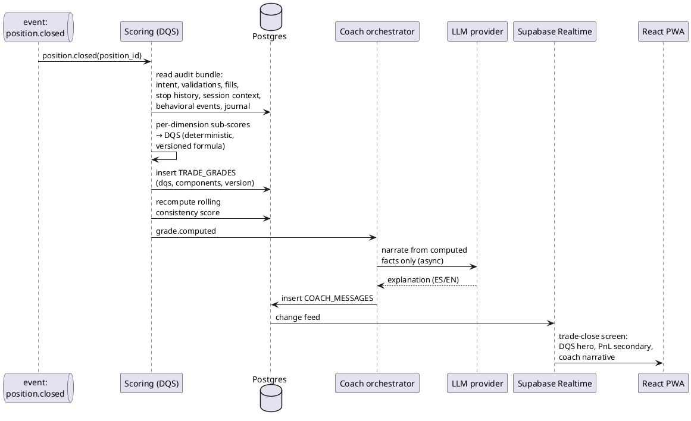
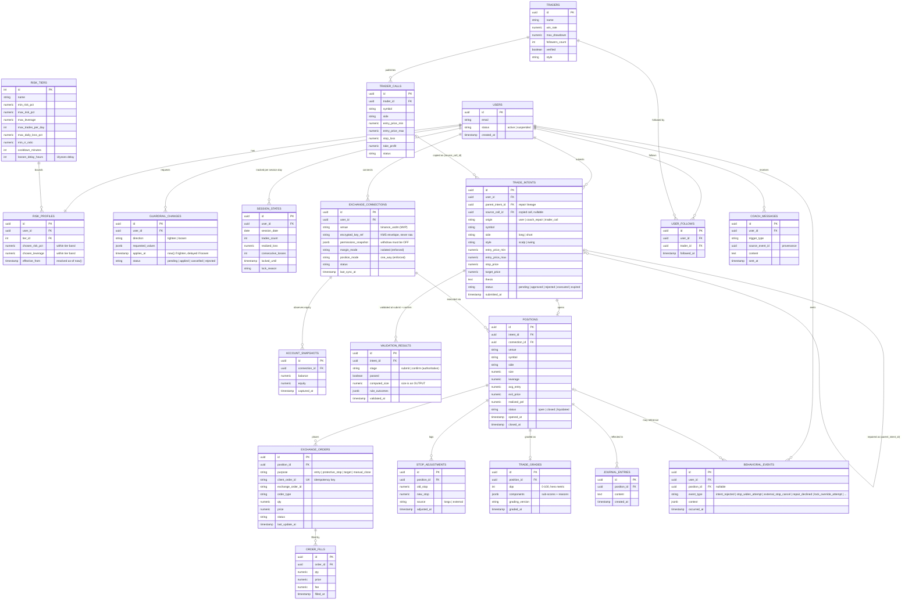
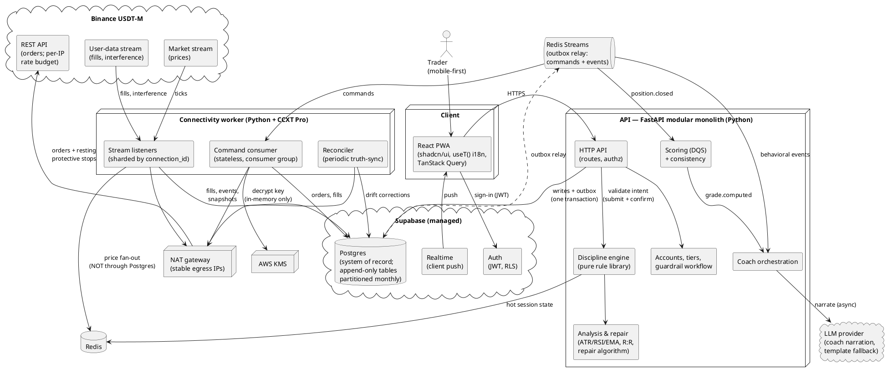
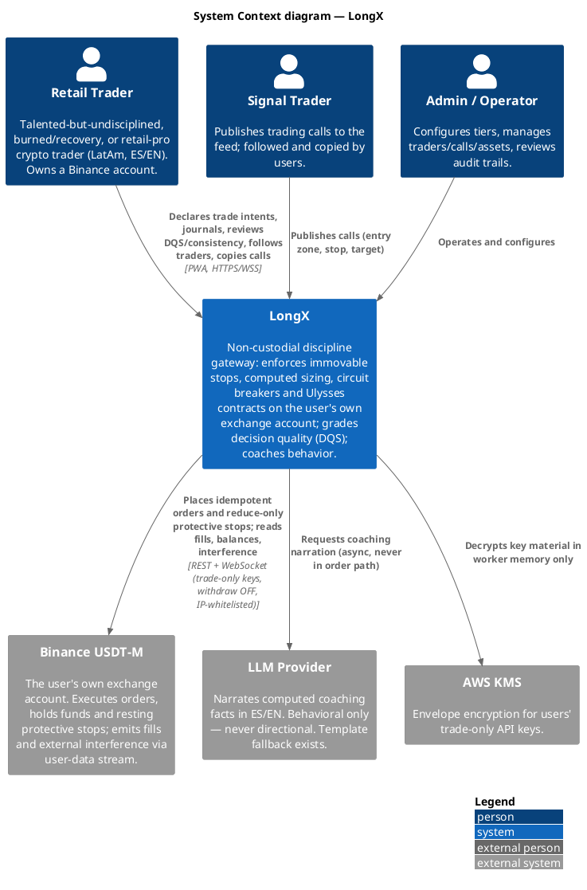
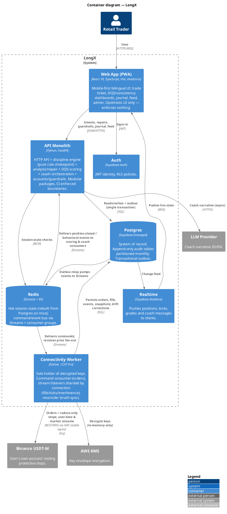
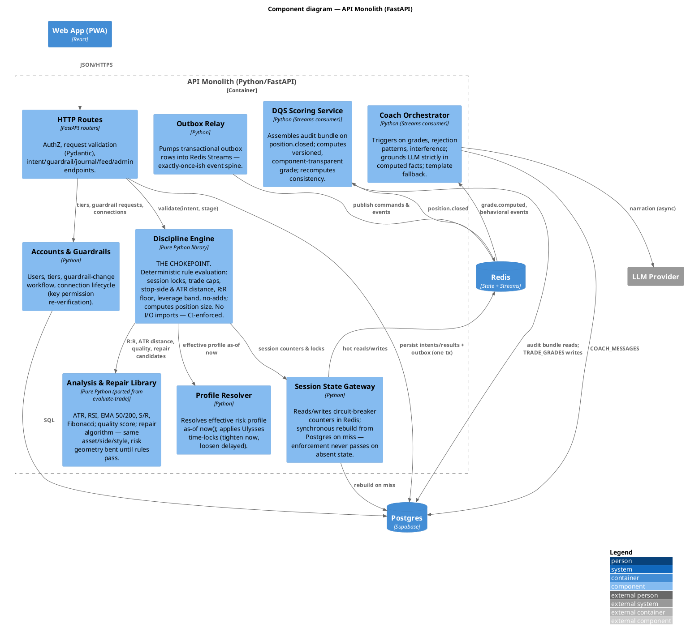

# LongX — Product & System Design Dossier

> **The first trading platform designed to help you trade better — not more.**
> *Trading should be boring. Boring builds wealth.*

---

## 1. Introduction

LongX is a discipline-first crypto trading platform built on a simple, contrarian thesis: **the core problem in retail trading is not analysis — it is discipline.** Retail traders do not blow up their accounts because they cannot read a chart; they blow up because they move their stop losses, add to losing positions, over-leverage, and revenge-trade after a loss. Traditional exchanges are structurally incapable of solving this problem because they monetize its symptoms: volume, leverage, and overtrading are their revenue model.

LongX inverts that model. It operates as a **non-custodial discipline gateway** on top of the user's own Binance account: every trade passes through a deterministic discipline engine that enforces immovable stop losses, computes position size from fixed risk parameters, caps leverage by earned risk tier, and locks the session when daily loss or trade-count circuit breakers trip. An **AI Trade Coach** — behavioral, never directional — evaluates every trade intent, repairs flawed setups in the user's own style, and explains every rule violation in plain language. Every closed trade receives a **Decision-Quality Score (DQS)** graded on the quality of the decision independent of its outcome: a well-planned losing trade scores high, a reckless winning trade scores low. The user's headline metric is consistency, not PnL.

The platform is mobile-first, Spanish-first and fully bilingual (ES/EN), targeting Latin American retail crypto traders as the entry wedge. Funds never leave the user's exchange account; LongX holds trade-only API keys (withdrawal permission off) and positions itself as a software and coaching layer — a commitment device, not a custodian. Users self-select: anyone paying for a discipline product wants the constraint. The business model monetizes consistency and retention ($19/month subscription plus a 0.05% trading fee) rather than volume — meaning LongX profits when its users survive long term, the exact outcome the product engineers.

---

## 2. Competitive Differentiation & Added Value

**The structural moat: incentive asymmetry.** Every meaningful differentiator below is something volume-monetized exchanges are *structurally disincentivized* to copy — Binance cannot ship "we will stop you from trading" without cannibalizing its own revenue.

How LongX stands out:

1. **Hard enforcement, not advisory warnings.** Immovable (tighten-only) stops, computed position sizes, leverage caps, and circuit breakers are enforced server-side at a single chokepoint — not suggested in a popup the user dismisses.
2. **Decision-Quality Score decoupled from PnL.** The only platform that grades *how well you decided*, not *whether you got lucky* — directly attacking the "I won so I was right" belief that reinforces gambling behavior.
3. **A coach that repairs, never originates.** The AI Coach never gives buy/sell calls; it takes the user's own proposed trade and repairs its risk geometry (entry zone, stop, target, size) in the same asset, direction, and style. Coaching on *your* idea, not advice on the market — on-thesis and on the right side of the regulatory line.
4. **Ulysses contracts.** Tightening your own rules applies instantly; loosening them is delayed 24–72 h. Users cannot disarm their own protections on tilt.
5. **Behavior is observed, not fought.** Going around LongX via the Binance app is detected through the exchange's own data stream, recorded, graded, and coached — "you bypassed your own rules and it cost you X" is the most powerful coaching moment in the product. LongX is the gym, not the warden.
6. **Discipline-gated social trading.** Trader calls executed through the feed inherit the *copier's* risk caps — a call from a trader risking 5% executes at your 0.75%. Social signal-following gets a structured, risk-bounded outlet.
7. **Aligned economics.** Subscription + flat fee means LongX earns from users who survive and stay — not from churn-and-burn volume.
8. **The behavioral dataset.** Every rejected intent, blocked stop-widening, and override attempt is captured as structured data — the raw material for adaptive tilt detection, the portable discipline credential, and the funded-trader pathway. Competitors' data is volume and PnL; LongX's data is behavior.

Value added per persona:

| Persona | Share | Value delivered |
|---|---|---|
| **Martín** — talented but undisciplined | ~50% | Takes the trade the way his plan says, not the way his impulse says; protected from himself in the 5 minutes after a loss |
| **Lucas** — burned / recovery trader | ~30% | Returns to trading inside rules he literally cannot break; the consistency score becomes the durable proof he has changed |
| **Diego** — retail pro | ~20% | A venue that will not let him deviate from setups he has already proven; rewarded for consistency instead of nudged to overtrade |

---

## 3. Main Functionality

### 3.1 MVP features (each mapped to its use case)

**Pre-trade plan gating — the chokepoint** *(UC-01)*
Every trade begins as a declared intent: asset, direction, entry zone (min/max), stop, target, thesis, and style (scalp/swing). The discipline engine validates the intent twice — at submission and again at confirmation, the second being authoritative — against the user's effective risk profile, session state, and rule set. No order reaches Binance through any other path; user trades, coach repairs, and copied calls all pass through the same code path.

**Automated risk-based position sizing** *(UC-01)*
Position size is an *output* of validation, never an input: computed from the user's fixed risk-per-trade percentage and the stop distance. The user never types a notional amount, which makes a single account-ending trade structurally impossible.

**Minimum reward:risk filter** *(UC-01)*
Intents must clear the tier's minimum R:R (e.g. ≥ 1.5:1) to be permitted — filtering low-quality impulse trades and forcing positive expectancy at the structural level.

**Rejection as a first-class event** *(UC-02)*
A blocked trade is not an error message; it is a domain event. The rejection screen explains exactly which rule fired and why, the attempt is persisted as a behavioral event, and repeated rejection patterns trigger coach intervention. The trades a user *tried* to take are among the most valuable data in the system.

**Real execution on the user's own Binance account** *(UC-03)*
Approved intents execute as real orders on Binance USDT-M perpetual futures via trade-only API keys (withdrawal permission off, IP-whitelisted). The protective stop is placed as a reduce-only stop-market order **resting on the venue itself** — if LongX is down, every open position remains protected by the exchange. Orders are idempotent (client order ID derived from the intent), and a reconciliation loop keeps LongX and Binance consistent, with Binance authoritative for positions, fills, and balances.

**Immovable, tighten-only stop loss** *(UC-04)*
Once a position is live, its stop can be tightened or moved to break-even — never widened or removed. Widening attempts are blocked and recorded; tightening remains allowed even during a session lockout (risk reduction is never blocked). Every adjustment is audited with its source (LongX or external).

**No averaging down** *(UC-01 / UC-03)*
Adding size to an underwater position is structurally blocked — the mechanism by which a survivable loss becomes a terminal one is removed rather than discouraged.

**Circuit breakers & post-loss cooldowns** *(UC-05)*
Daily trade-count caps, a daily max-loss limit, consecutive-loss limits, and a mandatory cooldown after each loss. Tripping any threshold locks the session: no new entries until the lock expires, with a clear "why and until when." The lock survives logout, reinstall, and direct API access. This is the structural cure for overtrading and revenge-trading spirals.

**Decision-Quality Score (DQS)** *(UC-06)*
Every closed trade is graded 0–100 on the quality of the decision, independent of outcome: plan adherence, sizing correctness, R:R at entry, stop behavior, and session context (e.g. entered four minutes after a loss). Grades decompose into transparent components — never a black box — and the grading formula is versioned for historical comparability. The trade-close screen leads with the DQS; PnL is visually secondary. The rolling aggregate of DQS is the **consistency score**, the user's primary headline KPI.

**AI Trade Coach — behavioral, never directional** *(UC-07)*
The coach narrates what the deterministic systems found: post-trade explanations, pattern flags ("third stop-tighten-to-break-even this week"), rejection-pattern interventions, and interference confrontations. The LLM grounds itself exclusively in computed facts (grades, events, journal) and never outputs a market opinion. If the LLM is unavailable, template-rendered messages take over — coaching never blocks the trading flow.

**Ulysses-contract guardrail changes** *(UC-08)*
Risk tiers define immovable outer bounds; users configure within a narrow band for a sense of agency. Tightening any value applies immediately; loosening is time-locked 24–72 h and cancellable (cancelling a loosening is a tighten — instant). Loosening requested *during* a lockout is auto-rejected and recorded — that is tilt, textbook.

**Default-restrictive onboarding** *(UC-09)*
New users connect their Binance account (key permissions verified: withdrawal off, isolated margin, one-way mode enforced), start at the tightest tier, and *earn* loosening through demonstrated consistency. A guided first trade walks them through the full intent → validation → confirm cycle so the chokepoint is experienced as the product, not as friction.

**Journaling & the counterfactual report** *(UC-10)*
Optional (DQS-rewarded) journaling at trade close, plus the "if you'd followed your rules" report: the user's actual equity curve contrasted with the curve had every violation been removed — computable only because the system records what the trader *tried* to do, not just what happened. The single most persuasive retention artifact in the product.

**External interference observation** *(UC-11)*
The Binance user-data stream reveals actions taken outside LongX — a cancelled stop, a directly modified position. These are classified, persisted as behavioral events, reflected in the affected trade's DQS, and confronted by the coach. By design this is a coaching flow, not a security arms race.

**Coach repair — "repair, don't originate"** *(UC-12)*
When an intent fails validation or passes with poor predicted quality, the coach proposes a repaired version: same asset, same direction, same style, with the risk geometry (entry zone, stop, target, size) adjusted until it passes the rules and quality thresholds. The repair is computed deterministically by the technical-analysis library (ATR, RSI, EMA, S/R, Fibonacci); the LLM only explains it. An accepted repair becomes a new child intent that passes through UC-01 like any other. Declining a repair and forcing the original through is itself a recorded behavioral signal.

**Trader feed & disciplined copy execution**
Traders publish calls (asset, direction, entry range, stop, target); users follow traders and execute calls. Copy execution constructs a trade intent (`origin = trader_call`) pre-filled from the call and validates it against the *copier's* risk profile, computing the *copier's* size. Every copied trade is gated, graded, and coached like any other.

**Admin & operations**
CRUD for traders, calls, and assets; tier-catalog configuration; user audit-trail review; system-rules documentation; asset validation on creation.

### 3.2 Roadmap differentiators (designed for, not built in MVP)

- **Adaptive tilt detection (P2)** — behavioral tells (rejection bursts, modification attempts, frequency spikes after losses) automatically tighten guardrails in real time and relax them when calm. The training data is already being captured from day one.
- **Verified-trader program (P2)** — track-record verification for signal providers, per-copy fees, discipline criteria for inclusion in the feed.
- **Discipline staking (P2)** — users stake fee credits or tier privileges on their own rule adherence over a period; a self-imposed commitment device with real skin in the game.
- **Self-imposed sabbaticals (P2)** — pre-committed rest periods ("lock me out every weekend," "no trading after two losing days") with a structured cooling-room override flow.
- **MercadoPago billing (P2)** — the $19/month subscription collected in local LatAm currency and methods; deferred from MVP along with all billing.
- **Multi-exchange support (P2)** — Bybit as the second venue behind the same execution-gateway interface.
- **Portable discipline credential (P3)** — a cryptographically verifiable export of the user's DQS/consistency history, valuable outside LongX (prop-firm applications, allocator due diligence). LongX as the issuer of the industry's discipline credential is the network-effect moat.
- **Accountability pods (P3)** — small opt-in cohorts sharing consistency scores and rule adherence — never PnL, never positions — channeling the social drive toward discipline instead of FOMO.
- **Funded-trader pathway (P3)** — provably disciplined users graduate to managing allocated capital, gated on discipline metrics rather than one-shot PnL challenges; closes the incentive loop completely.
- **Full exchange (P3)** — custody, KYC/AML, deposits and frictionless withdrawals (gating a user's access to their own money is a predatory pattern LongX explicitly rejects).

---

## 4. Business Model — Lean Canvas

| Block | Content |
|---|---|
| **Problem** | Retail traders destroy accounts through indiscipline (moved stops, oversizing, revenge trading, overtrading), not bad analysis. Existing exchanges monetize and amplify exactly these behaviors. Existing "solutions" (journals, alerts, education) are advisory and bypassed at the moment of tilt. |
| **Customer Segments** | LatAm retail crypto futures traders. Core: talented-but-undisciplined traders ($5k–20k, 10–20 trades/week). Secondary: burned traders returning under strict rules; retail pros seeking structural consistency. Early adopters: traders who already *know* discipline is their problem. |
| **Unique Value Proposition** | The first trading platform built to help you trade better, not more — hard-enforced discipline on your own exchange account, graded on decision quality instead of luck. *Trading should be boring; boring builds wealth.* |
| **Solution** | Non-custodial discipline gateway on Binance: immovable stops resting on the venue, computed sizing, circuit breakers, Ulysses contracts, DQS + consistency scoring, an AI coach that repairs trades instead of giving calls, and a discipline-gated copy feed. |
| **Channels** | Closed beta of committed traders → crypto trading communities (ES-first) → trader/creator feed partnerships → MercadoPago distribution (P2). |
| **Revenue Streams** | $19/month subscription (mandatory access to the discipline engine) + 0.05% trading fee. Later: per-copy fees (verified traders), discipline staking economics, funded-pathway economics. Billing deliberately off in MVP (closed beta). |
| **Cost Structure** | Lean infra (two containers + managed Postgres/Redis); LLM inference per active trader (batched, template fallback); development; legal/regulatory counsel (LatAm VASP positioning); community & support. |
| **Key Metrics** | Consistency-score improvement over time (the product works); retention/churn; time-to-first-graded-trade (activation); interference rate (% of users bypassing via Binance — a kill-criterion metric); repair-acceptance rate; circuit-breaker recidivism. |
| **Unfair Advantage** | Incentive asymmetry — volume-monetized incumbents cannot copy anti-volume features without cannibalizing revenue. A proprietary behavioral dataset (attempts, not just trades). Long-term: the discipline credential network effect. |

---

## 5. Use Cases

### 5.1 Use case overview

Twelve use cases across two subsystems. Ordering reflects criticality to the thesis, not frequency — two of the top five are "failure" paths, which is the tell that rejection flows are product, not error handling.

| ID | Use case | Primary actor | One-line description |
|---|---|---|---|
| UC-01 | Submit & validate trade intent | Trader | The chokepoint: declared intent validated twice against rules; size is computed, not chosen |
| UC-02 | Reject intent & record behavior | System | Rejection as domain event: specific explanation + persisted behavioral signal |
| UC-03 | Execute & manage real position | Trader / System | Real Binance orders; protective stop rests on the venue; reconciliation loop |
| UC-04 | Modify stop (tighten-only) | Trader | Tighten applies; widen/remove is blocked and recorded |
| UC-05 | Trip circuit breaker / session lockout | System | Loss/count/streak thresholds lock the session; survives logout and API access |
| UC-06 | Grade closed trade (DQS) | System | Deterministic, versioned, component-transparent decision-quality grade |
| UC-07 | Deliver coach feedback | System | LLM narrates computed facts; behavioral only, never directional; template fallback |
| UC-08 | Request guardrail change | Trader | Ulysses asymmetry: tighten now, loosen after 24–72 h delay |
| UC-09 | Onboard trader & connect Binance | Trader | Key permission verification, tightest tier by default, guided first intent |
| UC-10 | Journal & review performance | Trader | Journaling + the "if you'd followed your rules" counterfactual report |
| UC-11 | Observe external interference | System (Binance stream) | Bypass via Binance detected, recorded, graded, coached — never fought |
| UC-12 | Propose repair | System (coach) | Failed/low-quality intent repaired in the user's own style; acceptance spawns a child intent through UC-01 |

Full use case diagram (PlantUML — also delivered standalone as `longx_use_case_diagram.puml`):

### 5.2 The three main use cases, in depth

#### UC-01 — Submit & validate a trade intent (the chokepoint)

**Actors:** Trader (primary), market data feed (secondary).
**Trigger:** Trader submits the trade ticket: symbol, side, entry zone (min/max), stop, target, thesis, style.
**Main flow:** The API persists the intent (`pending`), then the discipline engine loads the effective risk profile (resolved as-of now, honoring pending Ulysses changes) and current session state (Redis, synchronously rebuilt from Postgres on miss). It evaluates the rule set — session unlocked, trade count under cap, stop present and on the correct side, stop distance vs. ATR, R:R above the tier floor, leverage within band, no add-to-loser — then **computes the position size** from risk % and stop distance. The validation result (stage `submit`) is persisted with per-rule outcomes; the computed size and rule summary return to the client. On the trader's confirmation, validation runs again (stage `confirm` — authoritative, because seconds passed and price or session state may have changed); if it passes, the intent is approved and an `execute` command is written through the transactional outbox.
**Exceptions:** Any rule fails → UC-02 (and possibly UC-12 repair). Confirm-time state change → re-validation governs.
**Why it is first:** every other guarantee in the product depends on the fact that no order can reach the venue except through this path.

#### UC-03 — Execute & manage a real position on Binance

**Actors:** System (connectivity worker), Binance (secondary), Trader (initiating confirm).
**Trigger:** `execute_position` command arrives on the stream.
**Main flow:** The worker (the only process that ever sees a decrypted key) decrypts via KMS in memory, places the entry order with an idempotent `clientOrderId` derived from the intent, and — on fill, observed via the user-data stream — immediately places the protective stop as a **reduce-only stop-market order resting on Binance**. Position, orders, and fills are persisted (Binance authoritative for execution facts); the position is tracked until stop, target, or manual close fires, at which point realized PnL is computed, session counters update, and `position.closed` is emitted — triggering UC-05 evaluation and UC-06 grading.
**Exceptions:** Exchange rejects the order (filters, rate limits) → intent marked failed, trader informed, no silent retry-with-different-params. Partial fills → tracked per fill, stop sized to actual position. Desync → the reconciler corrects from Binance's truth. Liquidation event on stream → defined close-path with grade treatment.
**Why it matters:** this flow embodies the reliability decision that lets a small team sleep — LongX downtime degrades coaching and new entries, never protection.

#### UC-06 — Grade a closed trade (Decision-Quality Score)

**Actors:** System (scoring service).
**Trigger:** `position.closed` event.
**Main flow:** Scoring assembles the trade's full audit bundle — intent, both validation results, fills, stop-adjustment history (including blocked widen attempts and external interference), session context at entry, journal entry if present. Per-dimension sub-scores are computed deterministically (plan adherence, sizing correctness, R:R at entry, stop behavior, session context), combined into the 0–100 DQS, and persisted with the components breakdown and the grading version. The rolling consistency score recomputes, and `grade.computed` fans out: the coach narrates (UC-07) and the client receives the trade-close screen with **DQS as the hero number, PnL secondary**.
**Exceptions:** Ungradeable dimensions (venue halt, gap policy) → marked `n/a`, never silently skipped. LLM unavailable downstream → template narration; grading itself never depends on the LLM.
**Why it matters:** the DQS is the product's psychological core — the reframe from "did I make money" to "did I decide well" — and the substrate for the future portable credential.

---

## 6. Data Model

Seventeen entities across three domains. Two sources of truth, explicitly split: **Binance is authoritative for positions, fills, and balances; LongX is authoritative for intents, rules, grades, and behavioral history.** The reconciliation loop continuously closes the gap.

Design invariants encoded in the model:

- **The intent → position → order chain** captures three genuinely different truths: what the trader *wanted* (`TRADE_INTENTS`), LongX's domain view of what happened (`POSITIONS`), and Binance's view (`EXCHANGE_ORDERS` / `ORDER_FILLS`). The gap between the first two is where the coaching value lives.
- **Validation is one-to-many** with a `stage` discriminator (`submit` | `confirm`) — the double-validation rule made structural.
- **Append-only audit set** (no updates, no deletes; partitioned monthly from the first migration): `VALIDATION_RESULTS`, `ORDER_FILLS`, `STOP_ADJUSTMENTS`, `BEHAVIORAL_EVENTS`, `TRADE_GRADES`, `ACCOUNT_SNAPSHOTS`. This is what makes the DQS auditable and the future credential signable.
- **Size is an output**: `VALIDATION_RESULTS.computed_size` exists precisely so position size is never a user input.
- **Repair lineage**: `TRADE_INTENTS.origin` (`user` | `coach_repair` | `trader_call`) and `parent_intent_id` (self-FK) trace every trade to its human origin.
- The feed entities from the existing codebase (`TRADERS`, `TRADER_CALLS`, `USER_FOLLOWS`) join the schema with copy execution routed through the chokepoint.

Hot-path indexes (day one): `SESSION_STATES (user_id, session_date)` unique; `RISK_PROFILES (user_id, effective_from DESC)`; `EXCHANGE_ORDERS (client_order_id)` unique; `BEHAVIORAL_EVENTS (user_id, occurred_at)`; `POSITIONS (connection_id, status)`.

---

## 7. High-Level System Design

### 7.1 Selected architecture

**Option B — a Python modular monolith plus a dedicated connectivity worker, with Supabase retained as the managed data/auth layer.** Four runtime pieces:

1. **React PWA** (existing front end, kept): shadcn/ui, bilingual `useT()` i18n, mobile-first; synchronous calls to the API, live updates via Supabase Realtime.
2. **FastAPI modular monolith (Python):** HTTP API; the **discipline engine** as a pure, deterministic, I/O-free rule library — the single chokepoint every intent passes through (CI-enforced via import-linter); the technical-analysis & repair library (ATR/RSI/EMA/S/R/Fibonacci, ported from the existing `evaluate-trade` function); DQS scoring; coach orchestration; accounts, tiers and the Ulysses guardrail workflow. Monolith by deployment, modular by structure.
3. **Connectivity worker (Python + CCXT Pro):** the only process that ever sees a decrypted Binance key (KMS envelope decryption, in memory only). Three concerns as separate entry points in one container: a stateless **command consumer** (order placement, idempotent client order IDs), **stream listeners** sharded by `connection_id` from day one (user-data fills and interference, market ticks), and the **reconciler** (periodic truth-sync against Binance).
4. **Data plane:** Supabase Postgres as system of record (append-only tables partitioned monthly) plus Auth and Realtime; Redis for hot session state (synchronous rebuild from Postgres on miss) and as the event bus (Redis Streams behind a transactional outbox).

Key design properties:

- **Chokepoint:** no order reaches Binance except through the discipline engine; the client never enforces rules alone. There is deliberately no arrow from the API to Binance and none from the client to anything that executes — if either ever appears, the architecture has been violated.
- **Stops rest on the venue:** protective stops are reduce-only stop-market orders living on Binance. LongX downtime degrades coaching and new entries — never protection — which buys an honest 99.5% availability budget for a small team.
- **Event spine:** domain write + outbox row in one transaction; relay pumps the outbox into Redis Streams; scoring and coach are idempotent consumers. This is also the seam along which modules peel off into services when scale demands it.
- **Scaling posture (decided up front):** worker listeners shard-aware from day one; stable egress IPs via NAT gateway (user keys are IP-whitelisted; Binance rate limits are partly per-IP); price fan-out through Redis, never through Postgres; append-only tables partitioned from the first migration; warehouse split (CDC from the event stream) pre-drawn for when analytics outgrows OLTP.

### 7.2 Why Option B over the alternatives

- **vs. Option A (Supabase-serverless):** A splits the most delicate code (rules in Deno edge functions, execution in a Python worker) across two runtimes, and persistent websockets do not fit serverless at all. The existing codebase *is* Option A as-built and already demonstrates the failure modes (statuses only advance while an admin tab is open; client-side-only guardrails).
- **vs. Option C (microservices):** C injects network partitions into the intent → validation → order path — the one place where "the rules didn't apply because of a network blip" is an existential bug — and carries an ops tax no MVP team should pay. C remains the destination if scale ever justifies it, along seams Option B already draws.

### 7.3 System diagram

(Also delivered standalone as `longx_system_architecture.puml`.)

---

## 8. C4 Model

### 8.1 Level 1 — System Context

**Reading note:** at this level the thesis is visible in two places — funds and protective stops live on the *external* exchange system (non-custodial by construction), and the LLM relation is explicitly narration-only.

### 8.2 Level 2 — Containers

**Reading note:** two arrows are deliberately absent — PWA → Binance and API → Binance. Their absence *is* the chokepoint and key-custody design.

### 8.3 Level 3 — Components of the API Monolith

The container chosen for depth is the API monolith, because it houses the product's core invariant.

---

## 9. Roadmap & Migration

**Roadmap:** **P1 (MVP)** — disciplined gateway on Binance USDT-M (real money, non-custodial): full discipline engine, real execution with venue-resting stops, DQS + consistency, coach with repair, feed with disciplined copy execution, no billing. **P2** — verified traders, MercadoPago billing, adaptive tilt detection, discipline staking, Bybit, optional practice mode. **P3** — full exchange: custody, KYC/AML, frictionless withdrawals, portable discipline credential, funded-trader pathway.

**Migration from the existing codebase** (strangler, app never stops working): **M0** real auth + RLS + secret hygiene (precondition for keys) → **M1** Python API, `evaluate-trade` gates ported into the discipline library → **M2** connectivity worker replaces admin-tab polling → **M3** server-side enforcement + DQS on paper trades → **M4** key vault + Binance backend, closed beta on real money → **M5** repair flow, counterfactual report, Ulysses contracts.

**Top risks on record:** key compromise (mitigated: withdraw-off, IP whitelist, KMS, closed-beta blast radius); Binance platform/ToS and LatAm regulatory volatility (mitigated: venue-agnostic gateway, Bybit as P2 hedge); enforcement leak by design (measured: interference rate is a kill-criterion metric); LLM cost per active user (batched, template fallback).

---

## 10. Screen Map — Existing App vs. the Plan

The current application (a signal-feed copy-trading app with an advisory coach) already contains a substantial, mobile-first screen inventory. Assessed against this plan, it divides into three buckets: roughly 40% keeps largely intact (the social and management layer the plan barely touched), ~35% is *reframed not rebuilt* (same screen, but the hero metric flips from PnL to consistency/DQS and self-declared/simulated mechanics become earned/real), and ~25% of the eventual surface is net-new — and those new screens are precisely where the behavioral differentiation lives. The reassuring part: the screens hardest to throw away — the AI Coach state machine and the feed — survive best. The Coach is already ~80% of UC-12.

### 10.1 Verdict per existing screen

| Screen | Verdict | Use cases | Key change |
|---|---|---|---|
| **Onboarding (`/`)** | **Adapt (heavy)** | UC-09 | Nickname-login → real auth (precondition for keys); self-declared level → **default-restrictive tier** (start tightest, earn loosening); drop simulated-capital picker; **add Connect-Binance step** with key permission verification (withdraw OFF, isolated, one-way). 4-step shape stays; 3 steps' content changes. |
| **Home (`/home`)** | **Adapt (additive)** | UC-05 | Structure survives (portfolio, daily-risk bar, trades-today, blocked countdown — the countdown is already a circuit breaker). Numbers now from real Binance equity; **add a consistency-score hero** — PnL demoted to secondary. |
| **Trader Hub (`/traders`)** | **Keep** | (feed) | Most intact of all. Execute on a Filled call routes through the **chokepoint** (intent `origin=trader_call`, validated against the *copier's* profile, copier's size) instead of a direct `user_call` insert. Same UX. |
| **Trader Profile (`/trader/:id`)** | **Keep** | (feed) | Compatible as-is; same chokepoint change on the execute path. |
| **AI Trade Coach (`/trade`)** | **Adapt (close)** | UC-01, UC-12 | ~80% aligned already. Constrain the suggestion to **same asset / direction / style** (risk geometry only); remove any market-call framing; execution passes through UC-01 as a child intent; the suggestion must itself pass the rules before being shown. **Keep** the decision tiers (Approved/With Adjustments/Not Recommended) and the live R:R calc. |
| **My Profile (`/profile`)** | **Adapt (reframe)** | UC-06 | Win-rate/PnL stat cards are the old scoreboard. Hero stats become **consistency score + average DQS**; win-rate/PnL demoted. Tabs, copy attribution, live PnL keep. |
| **Trade Detail (`/profile/trade/:id`)** | **Keep + Extend** | UC-04, UC-06 | Chart + Entry/TP/SL lines + live hero keep. **Becomes the tighten-only stop surface** (allow tighten, block widen with explanation, show audit). Placeholder Margin/Liq. price become real. Post-close shows **DQS + component breakdown**. |
| **Admin (`/admin`)** | **Keep (evolve)** | (ops) | Polling `monitor-calls` (the "advances only while an admin tab is open" bug) replaced by the connectivity worker — Admin stops being load-bearing infra. Add **tier-catalog configuration**. |
| **Admin Rules (`/admin/rules`)** | **Keep** | (ops) | Grows to document the DQS formula and tier rules. |
| **404 (`*`)** | **Keep** | — | Unchanged. |

### 10.2 Screens to ADD (the missing differentiation surfaces)

These do not exist today and are where the behavioral thesis becomes visible to the user:

1. **Continuous Coach surface (screen or persistent panel)** *(UC-07, UC-11)* — today coaching appears only inline in `/trade`. The plan's coach is continuous: post-trade explanations, pattern flags, and interference confrontations ("you bypassed your own rules and it cost you X") need a home.
2. **Consistency / DQS dashboard** *(UC-06)* — the product's headline metric has no screen today. Trend over time, per-dimension breakdowns, grade history. Arguably *the* screen that should exist.
3. **"If you'd followed your rules" counterfactual report** *(UC-10)* — actual equity curve vs. rules-adhered curve; the single most persuasive retention artifact.
4. **Journaling surface** *(UC-10)* — post-close reflection prompt (DQS-rewarded).
5. **Guardrail / tier management with Ulysses time-locks** *(UC-08)* — view tier, slide within band, request loosening and see the 24–72 h delay. Currently limits are set once at onboarding and never revisited.
6. **Binance connection management** *(UC-09, UC-11)* — connect/disconnect, key status, permission re-verification, interference log.

### 10.3 Mechanics to RETIRE

- **Simulated-capital selection** at onboarding — gone under real execution.
- **Self-declared level → loose limits** — the screen stays, the mechanic inverts to earned tiers.
- **Delete-trade-while-Live** as the primary position action — superseded by the tighten-only stop control (cancelling a *pending entry* remains, distinct from "delete").
- **Coach-lives-only-in-`/trade`** assumption — coaching graduates to a first-class, always-present surface.

### 10.4 Navigation impact

The current 4-item bottom nav (Home, Trade, Hub, Profile) needs room for the consistency dashboard and the coach. Recommended resolution: make **consistency/DQS the Home hero** (no new tab) and surface the **coach as a persistent panel** rather than a fifth tab — keeping the 4-item nav while giving the two most important new surfaces prominence. The counterfactual report and journaling hang off Profile and the trade-close flow respectively; guardrail/tier management and Binance connection live under Profile/settings.

---

## 11. Artifact Index

| Artifact | File | Format |
|---|---|---|
| This dossier | `LONGX.md` | Markdown (mermaid + PlantUML embedded) |
| Use case diagram | `longx_use_case_diagram.puml` | PlantUML |
| Consolidated ER model | `longx_erd.mmd` | Mermaid |
| ERD browser preview | `longx_erd_preview.html` | HTML (self-rendering) |
| System architecture | `longx_system_architecture.puml` | PlantUML |
| C4 Context / Container / Component | embedded in §8 | PlantUML + C4 stdlib |
| UC-01 / UC-03 / UC-06 sequence diagrams | embedded in §5.2 | PlantUML |
| Lean Canvas | embedded in §4 | Markdown table |
| Screen map (existing app vs. plan) | embedded in §10 | Markdown table |

Mermaid blocks render natively on GitHub; PlantUML blocks render via the PlantUML server, IDE plugins, or Kroki.
