# Muestra del Producto — Lexio

**Proyecto:** Lexio — Diccionario personal inteligente de vocabulario en inglés  
**Autor:** Jesus Fredy Vizcarra Garcia  
**Versión:** MVP 1.0

---

## ¿Qué es Lexio?

Lexio es una app móvil para hispanohablantes que aprenden inglés. Resuelve un problema común: **olvidar las palabras nuevas** que encuentras en películas, libros o videos.

Con Lexio puedes:

- **Capturar** cualquier palabra o frase en el momento
- **Guardarla** como tarjeta visual con definición (generada por IA) e imagen
- **Practicarla** con ejercicios diarios personalizados (generada por IA)
- **Mantener el hábito** con un sistema de rachas

---

## Flujo principal de la app

```
Registro / Login
      ↓
Capturar palabras (IA + imágenes)
      ↓
Ver diccionario personal
      ↓
Práctica diaria (10 ejercicios)
      ↓
Resultados + racha actualizada
```

---

## Antes de empezar la demo

Para probar la app necesitas:

1. **Backend** corriendo en `http://localhost:3000`
2. **Mobile** con Expo (`npx expo start --clear` → tecla `i` para simulador iOS)
3. Cuenta de usuario (puedes registrarte en la app o usar el seed: `demo@lexio.app` / `demo1234`)

> Ver instrucciones completas en [DEPLOYMENT.md](./DEPLOYMENT.md)

---

## Tutorial paso a paso

---

### Paso 1 — Pantalla de inicio de sesión

Al abrir la app por primera vez, verás la pantalla de **Login**.

**Qué puedes hacer aquí:**
- Iniciar sesión con email y contraseña
- Ir a **Registrarse** si es tu primera vez

**Elementos visibles:**
- Logo "Lexio"
- Campos: Correo electrónico, Contraseña
- Botón "Iniciar Sesión"
- Enlace "¿No tienes una cuenta? Registrarse"

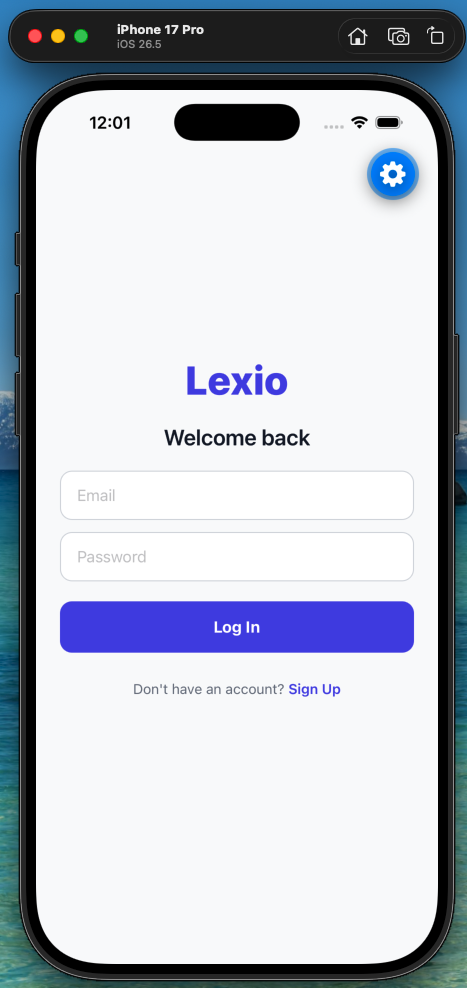


---

### Paso 2 — Crear cuenta (registro)

Si es un usuario nuevo, pulsa **Registrarse**.

**Qué puedes hacer aquí:**
- Crear una cuenta con email y contraseña (mínimo 6 caracteres)
- Volver al login si ya tienes cuenta

**Elementos visibles:**
- Título "Crear cuenta"
- Campos: Correo electrónico, Contraseña
- Botón "Registrarse"

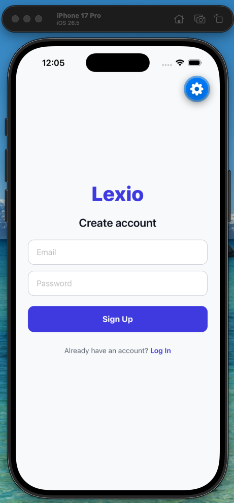

---

### Paso 3 — Pantalla principal (Home)

Tras iniciar sesión, llegas al **Home**. Es el centro de la experiencia diaria.

**Qué puedes ver aquí:**
- Tu **racha** de días consecutivos (ej. "🔥 Racha de 3 días")
- Contador de palabras en tu diccionario (ej. "6 palabras en tu diccionario")
- Botón **"Iniciar Práctica"** (activo solo si tienes ≥ 4 palabras)
- Si tienes menos de 4 palabras: mensaje "Añade al menos 4 palabras para practicar"
- Si ya completaste la práctica de hoy: "Práctica completada hoy ✓"

**Barra inferior (tabs):**
- 🏠 Home
- 📖 Mi Diccionario
- ➕ Añadir Palabra
- ⚙️ Configuración

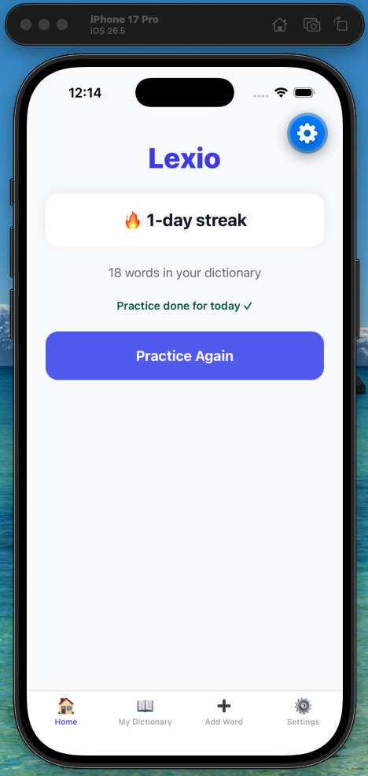

---

### Paso 4 — Añadir una palabra (Paso 1: Generar)

Ve a la pestaña **➕ Añadir Palabra**. Aquí capturas vocabulario nuevo.

**Qué puedes hacer aquí:**
1. Escribe una palabra o frase en inglés (ej. `serendipity`)
2. Elige el idioma de la definición: **Español** o **Inglés**
3. Pulsa **"Generar Definición"**

**Qué ocurre detrás:**
- La app llama al backend
- **Claude Haiku 4.5** genera la definición
- **Unsplash** sugiere imágenes relacionadas

**Estados posibles:**
- Campo vacío → "Por favor introduce una palabra o frase"
- Palabra duplicada → "Ya tienes una tarjeta para [palabra]"
- Generando → spinner "Generando..."

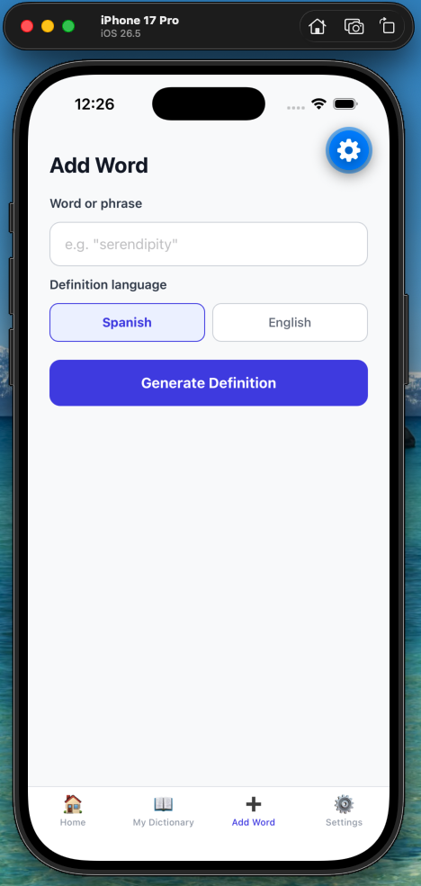

---

### Paso 5 — Añadir una palabra (Paso 2: Elegir imagen y guardar)

Tras generar, la app muestra la definición y un grid de imágenes.

**Qué puedes hacer aquí:**
1. **Editar** la definición si quieres personalizarla
2. **Seleccionar** una imagen del grid (se resalta con borde)
3. Pulsa **"Guardar Tarjeta"**

**Resultado:**
- La tarjeta se guarda en Firestore
- Te redirige al diccionario

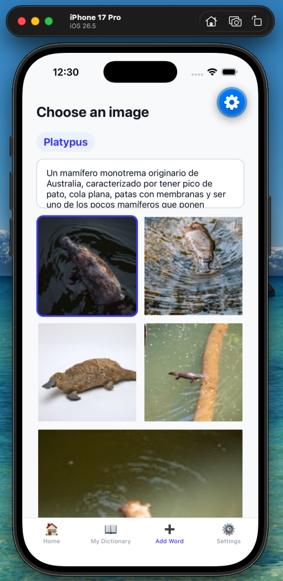

---

### Paso 6 — Mi Diccionario

En la pestaña **📖 Mi Diccionario** ves todas tus tarjetas.

**Qué puedes ver aquí:**
- Lista de tarjetas con imagen, palabra y definición
- Dos filtros: **Activas** / **Aprendidas**
- Mensaje vacío si aún no hay palabras: "Aún no tienes palabras. ¡Añade la primera!"

**Interacción:**
- Toca una tarjeta para ver el detalle

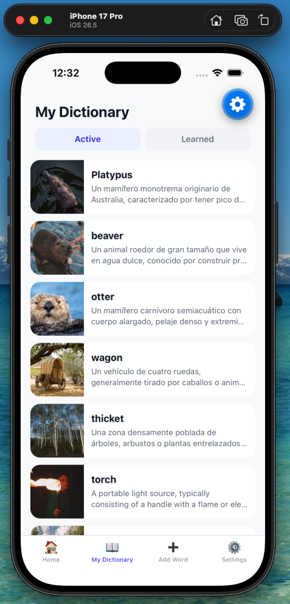


---

### Paso 7 — Detalle de una palabra

Al tocar una tarjeta, entras al **Detalle de la Palabra**.

**Qué puedes hacer aquí:**
- Ver la imagen y el término en grande
- **Editar** la definición
- **Guardar cambios**
- **Marcar como Aprendida** (la mueve al filtro "Aprendidas")
- **Marcar como Activa** (si ya estaba aprendida)

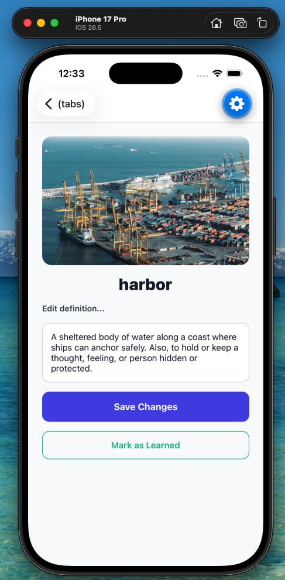


---

### Paso 8 — Iniciar práctica diaria

Vuelve al **Home** y pulsa **"Iniciar Práctica"** (requiere ≥ 4 palabras guardadas).

**Qué ocurre:**
- El backend genera una sesión con **10 ejercicios**
- Mezcla de dos tipos:
  - **Image match:** imagen + 4 opciones de palabra
  - **MCQ (IA):** pregunta de opción múltiple generada por Claude

**Elementos visibles:**
- Barra de progreso (ej. "3 / 10")
- Pregunta o imagen
- 4 opciones para elegir
- Botón "Siguiente" / "Finalizar"

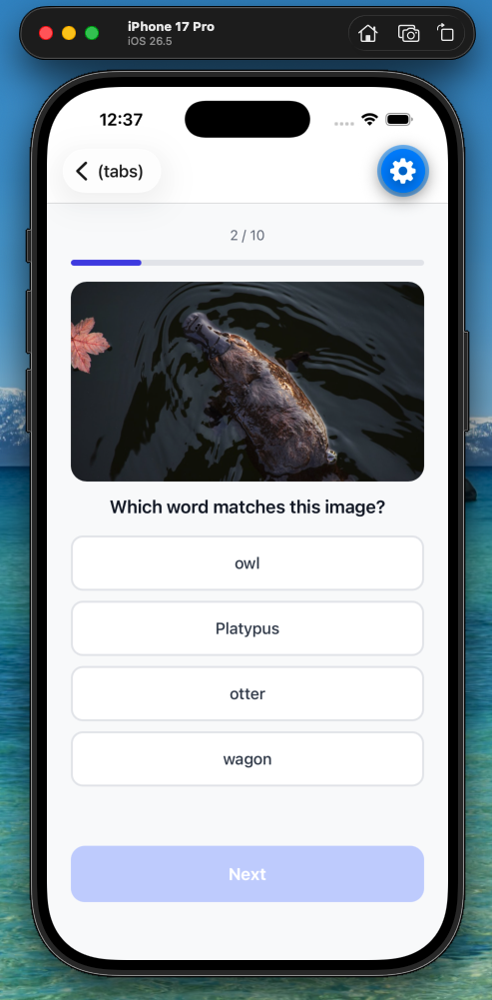


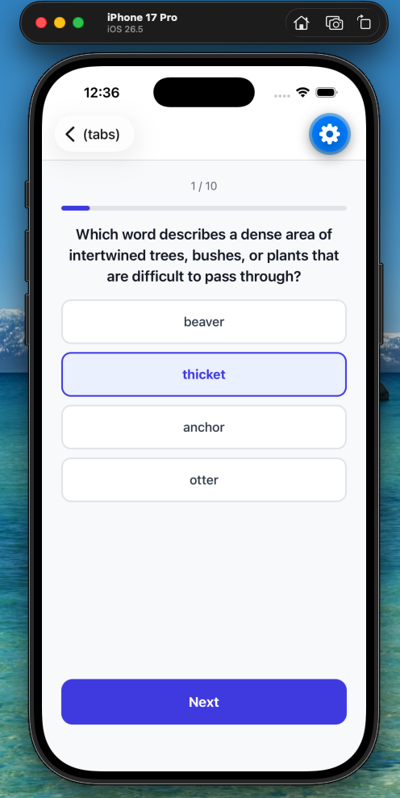

---

### Paso 9 — Resultados de la sesión

Al completar los 10 ejercicios, ves la pantalla de **Resultados**.

**Qué puedes ver aquí:**
- Puntuación (ej. "8 / 10 correctas")
- Mensaje especial si acertaste todas: "¡Puntuación perfecta! 🎉"
- Racha actualizada (ej. "🔥 ¡Racha de 5 días!")
- Botones: **Volver al Inicio** / **Ver Diccionario**

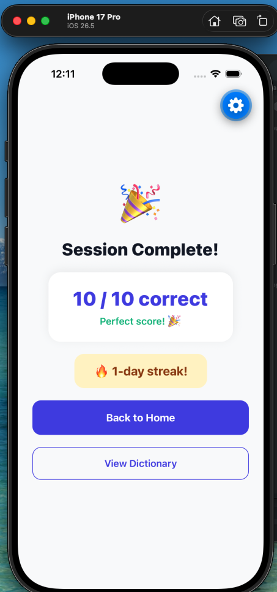

---

### Paso 10 — Configuración

En la pestaña **⚙️ Configuración** puedes personalizar la app.

**Qué puedes hacer aquí:**
- Cambiar el **idioma de la interfaz**: Español / English
- Ver tu email de usuario
- **Cerrar sesión**

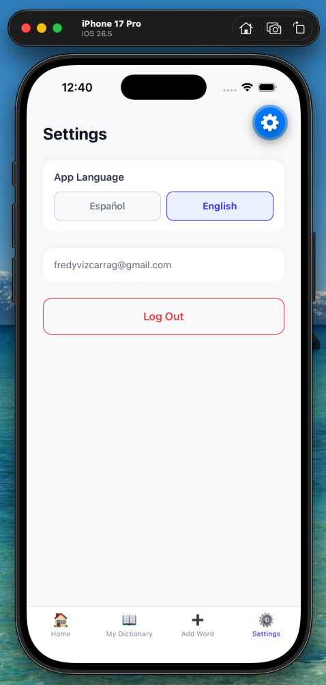

---

## Resumen del flujo E2E (demo completa)

| # | Acción | Pantalla | Resultado esperado |
|---|---|---|---|
| 1 | Abrir app | Login | Pantalla de bienvenida |
| 2 | Registrarse o iniciar sesión | Login / Register | Redirección a Home |
| 3 | Añadir palabra "serendipity" | Add Word | Definición + imágenes generadas |
| 4 | Elegir imagen y guardar | Add Word | Tarjeta en diccionario |
| 5 | Repetir hasta ≥ 4 palabras | Add Word | Botón de práctica habilitado |
| 6 | Ver diccionario | Dictionary | Lista de tarjetas |
| 7 | Iniciar práctica | Practice | 10 ejercicios |
| 8 | Completar sesión | Results | Puntuación + racha |
| 9 | Cambiar idioma | Settings | UI en ES o EN |

---

## Tecnologías que intervienen en la demo

| Funcionalidad | Tecnología |
|---|---|
| Autenticación | Firebase Auth (email/password) |
| Almacenamiento | Cloud Firestore |
| Definiciones + MCQs | Claude Haiku 4.5 (Anthropic API) |
| Imágenes sugeridas | Unsplash API |
| Backend | Node.js + Express (BFF) |
| App móvil | React Native + Expo |

---

## Notas para la presentación

- **Tiempo estimado de demo:** 5–8 minutos
- **Palabras sugeridas para la demo:** serendipity, ephemeral, resilient, melancholy
- **Requisito mínimo para practicar:** 4 palabras guardadas
- **Una sesión al día:** tras completar la práctica, el botón muestra "Práctica completada hoy ✓"

---

## Checklist de capturas

Marca cada captura cuando la hayas agregado:

- [ ] 01 — Login
- [ ] 02 — Registro
- [ ] 03 — Home
- [ ] 04 — Add Word (input + generar)
- [ ] 05 — Add Word (elegir imagen + guardar)
- [ ] 06 — Diccionario
- [ ] 07 — Detalle de tarjeta
- [ ] 08 — Práctica (image match)
- [ ] 09 — Práctica (MCQ)
- [ ] 10 — Resultados
- [ ] 11 — Configuración

---

