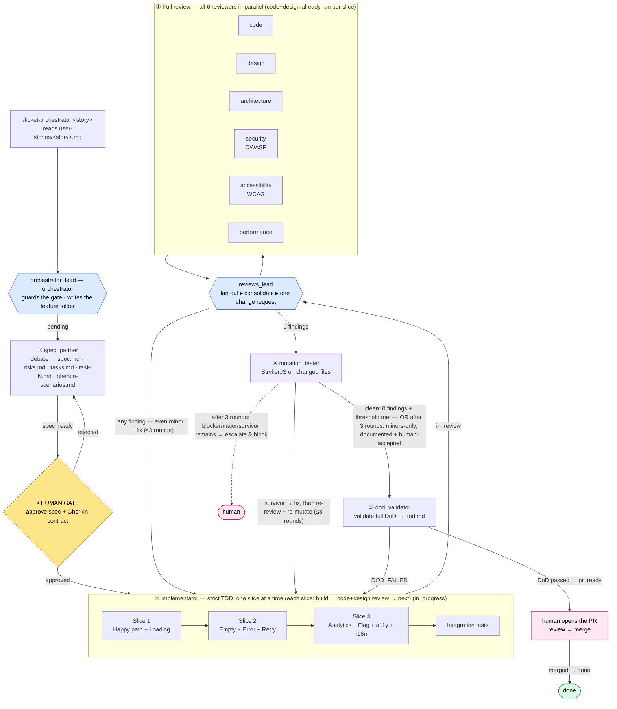

# Agentic Orchestrator Workflow — Implementation Plan

> **Project:** AI Study Buddy (AI4Devs final project) — Turborepo + pnpm monorepo, Expo/React Native universal app, `@helsoft/*` libs, Supabase backend, Storybook + Playwright, Jest + RN Testing Library.
> **Goal:** A repeatable, gate-driven agentic orchestrator that takes a user story/ticket from the command line all the way to a merge-ready PR, following strict TDD, layered reviews, mutation testing, and a full Definition of Done.
> **Decisions locked in:** orchestrator lives under `.agents/` (extends existing folder) · mutation testing uses **StrykerJS** · pipeline driven by an **orchestrator agent** (`orchestrator_lead`) with a single human approval gate · **per-agent models** (via `model:` frontmatter): **Opus** for `spec_partner`, **Sonnet** for `orchestrator_lead` + `implementator` + `reviews_lead` + the 6 reviewers, **Haiku** for `mutation_tester` + `dod_validator`.

---

## 1. Where this comes from and what's different

This orchestrator blends two references:

- **`betta-tech/harness-sdd` (`uncle-bob-harness`)** — the "Uncle Bob" craftsman pipeline: *converse the spec → distill Gherkin → carve code with strict TDD → prune with judgment → validate with mutation testing*. Key ideas we keep: state lives on disk (not chat), one feature at a time, one human gate on the Gherkin contract, the "review is the whole game," and mutation testing as the real measure of whether tests bite. It is Python; we port the discipline to TypeScript.
- **`LIDR-academy/mobile-facephi`** — a ticket→PR mobile pipeline with per-stage contracts, explicit gates, `.claude/` commands + skills, a Design Translator, an Architecture guard, OWASP security, and a PR Guardian with a full DoD checklist. Key ideas we keep: per-stage artifacts in `docs/features/<id>/`, the reviewer/skill roles, the DoD checklist, and the ticket-driven entry point.

**How our flow differs from both:**

| Aspect | harness-sdd | mobile-facephi | **This orchestrator** |
|---|---|---|---|
| Entry | "implement next pending feature" | `/spec FEAT-XXX` | User-story `.md` file in `user-stories/`, named on the command line |
| Spec + Contract | `spec_partner` debates → `project-spec.md`; separate `gherkin_author` | `/spec` → spec + risks + tasks + qa | **`spec_partner` produces spec.md + risks.md + tasks.md + `gherkin-scenarios.md` in one step** (Gherkin via the `gherkin-authoring` skill), approved together at a **single human gate** |
| Build | `implementator` strict TDD | Code Agent by vertical slice | **`implementator`**, strict TDD **by vertical slice** (1→2→3), branching by artifact type (UI vs logic), always integration tests |
| Review | single `judge` | `/arch` + `/security` separately | **Two cadences:** per-slice light review (**code + design** only) during the build, then a **full 6-reviewer** round (code, design, architecture, security, accessibility, performance) after all slices — both driven by **`reviews_lead`**, which consolidates findings into one change request to the implementator |
| Mutation | custom `mutate.py` | — | **StrykerJS** with per-feature score thresholds |
| DoD / PR | — | `/pr` PR Guardian (validates DoD **and** opens PR) | **`dod_validator`** — validates the full DoD only; PR creation is a manual human step |

The result is a 5-phase pipeline (below) driven by an orchestrator that guards the gates, keeps all state on disk, and stops for the human at **one point up front** — a single combined approval of the **spec + Gherkin contract** — after which it runs autonomously up to a validated, PR-ready state. Opening and merging the PR stays a manual human step.

---

## 2. Target stack context (what the agents must respect)

Everything the orchestrator generates must obey the project's existing rules (canonical rules live in `.agents/rules/` and take precedence):

- **Monorepo layout** (`global.mdc`): code lives in `libs/*` as `@helsoft/*` packages; `apps/*` stay thin. A feature `app-x` pairs with a lib `libs/x`.
- **Layering** (`hooks-service-dao.mdc`): `Component → Hook → Service → DAO → Supabase / external API`. DAOs = data access only (Supabase DAO via `getSupabase()` or external-API DAO via `fetch`); Services = validation + business logic, no React; Hooks = React integration (tanstack-query pattern), wrap services never DAOs. Every layer exports via `index.ts`.
- **Components** (`atomic-design.mdc`): atoms → molecules → organisms → templates → pages. Component files in `component-name/component-name.tsx`, each with `component-name.stories.tsx`. Use existing tokens/components; new Storybook stories follow `libs/lib-with-storybook/src/stories` patterns.
- **Conventions**: functional React only, no Redux; always a `Props` type; kebab-case filenames; `.web.tsx` for platform-specific; Conventional Commits.
- **Testing** (`global.mdc` + `E2E_TESTS.md`):
  - Storybook components → **Jest + React Native Testing Library** unit tests (`<name>.test.tsx`, co-located — rendering/props/states/handlers/a11y) **plus** **Storybook + Playwright** e2e (`*.e2e.js` under `tests/e2e/`, mirroring the component's `src/` path; stories reached via `/?path=/story/...` inside `frameLocator('iframe[title="storybook-preview-iframe"]')`; components port 6007, lib-with-storybook 6006). The orchestrator **requires the Jest unit test on every component** so TDD and mutation testing apply to UI too — this deliberately extends the base convention, which used Storybook + Playwright alone.
  - Hooks/services/DAOs/non-Storybook components → **Jest + React Native Testing Library** (`*.dao.test.ts`, `*.service.test.ts`, `*.test.ts`).
  - Supabase queries → **Supabase Test Helpers**.
- **Backend**: Supabase; schema changes via migrations (`npx supabase migration new`, `npx supabase db push`).

> ✅ **Test tooling status:** Jest + RN Testing Library is **already configured** across `@helsoft/components` (`jest-expo`), `@helsoft/hooks` and `@helsoft/services` (`ts-jest`), each with a `test: jest` script; Playwright is installed at the root. The only Phase 0 gap is **StrykerJS** (not yet installed) and, if needed, **Supabase Test Helpers**.

---

## 3. Directory layout (all under `.agents/`)

We extend the existing `.agents/` folder rather than introducing `.claude/`. Orchestration and agent role definitions are added; rules stay where they are.

```
.agents/
├── rules.md                      # existing — index of rules
├── rules/                        # passive standards (always-on reference)
│   ├── global.mdc
│   ├── hooks-service-dao.mdc
│   ├── atomic-design.mdc
│   ├── tdd.md                    # NEW — Three Laws of TDD, Red-Green-Refactor for TS
│   └── review-standards.md       # NEW — rubrics for the 6 reviewers (quality, design, arch, OWASP, WCAG, performance)
├── skills/                       # invocable procedures (loaded on demand)
│   ├── gherkin-authoring/        # NEW — distill spec → tagged gherkin-scenarios.md contract
│   ├── mutation-testing/         # NEW — StrykerJS scoped to changed files (+ scripts/run-mutation.sh)
│   └── storybook-e2e-tests/      # existing — Playwright e2e for Storybook components (owns the .e2e.js location)
├── commands/                     # existing (commit.md) — thin CLI entry points
│   ├── ticket-orchestrator.md    # NEW — /ticket-orchestrator <story> → reads user-stories/<story>.md, invokes orchestrator_lead
│   └── commit.md
├── agents/                       # NEW — role definitions (subagents)
│   ├── orchestrator_lead.md      # orchestrator: guards phases + the gate, invokes others
│   ├── spec_partner.md           # Phase 1 — spec + Gherkin contract (one step)
│   ├── implementator.md          # Phase 2 (+ change re-work in Phase 3)
│   ├── reviews_lead.md           # Phase 3 — fans out 6 reviewers in parallel, consolidates, requests changes
│   ├── reviewer_code.md          # Phase 3 (parallel)
│   ├── reviewer_design.md        # Phase 3 (parallel)
│   ├── reviewer_architecture.md  # Phase 3 (parallel)
│   ├── reviewer_security.md      # Phase 3 (parallel, OWASP)
│   ├── reviewer_accessibility.md # Phase 3 (parallel, WCAG)
│   ├── reviewer_performance.md   # Phase 3 (parallel, perf)
│   ├── mutation_tester.md        # Phase 4 (StrykerJS)
│   └── dod_validator.md          # Phase 5 (validates DoD only; does not open the PR)
├── templates/                    # NEW — per-feature doc templates copied at Phase 1
│   ├── spec.md
│   ├── risks.md
│   ├── tasks.md                  # task index (feature-level status + task table)
│   ├── task.md                   # single-task template (copied as task-1.md, task-2.md, …)
│   └── dod.md                    # DoD validation report template
└── ORCHESTRATOR.md               # NEW — source of truth: roles, contracts, gates, DoD

user-stories/                     # EXISTING — input tickets, one markdown file per story
└── <story>.md                    # read by spec_partner via /ticket-orchestrator <story>

docs/
└── features/
    └── <name>/                   # ONE folder per feature — everything for it lives here
        ├── spec.md               # spec_partner
        ├── risks.md              # spec_partner
        ├── tasks.md              # spec_partner — task INDEX: feature-level status + task table
        ├── task-1.md             # spec_partner — one file per task (replaces feature_list.json)
        ├── task-2.md             #   each carries its own frontmatter status + slice + scenarios
        ├── …                     #   task-N.md
        ├── gherkin-scenarios.md        # spec_partner — the Gherkin contract (via gherkin-authoring skill)
        ├── tdd.md                # implementator — TDD cycle log + @scenario → test map
        ├── review-code.md        # reviewer_code    ┐
        ├── review-design.md      # reviewer_design  │
        ├── review-architecture.md# reviewer_architecture  │ 6 parallel reviewers,
        ├── review-security.md    # reviewer_security      │ one report file each
        ├── review-accessibility.md# reviewer_accessibility │
        ├── review-performance.md # reviewer_performance   ┘
        ├── review.md             # reviews_lead — consolidated findings + change requests + round verdict
        ├── mutation.md           # mutation_tester — StrykerJS score + surviving mutants
        └── dod.md                # dod_validator — DoD validation report (pass/fail + evidence)

progress/                         # NEW — session-level state only (nothing feature-named)
├── current.md                    # pointer to the active feature/task
└── history.md                    # append-only log of completed features
```

**No global state file.** The old `feature_list.json` is gone. The set of features is simply the set of folders under `docs/features/`; "one feature at a time" means `progress/current.md` points at the active one. Per-feature state now lives in that feature's folder:

- **`tasks.md`** — an index with the feature-level pipeline phase in frontmatter and a table of its tasks.
- **`task-N.md`** — one file per atomic task, each with frontmatter:

  ```markdown
  ---
  id: task-2
  title: Render error + retry for lesson list
  slice: 2                 # vertical slice 1 | 2 | 3
  scenarios: [s3, s4]      # @s tags from gherkin-scenarios.md this task satisfies
  status: todo             # todo | in_progress | in_review | done
  paths: [libs/components/src/organisms/lesson-list/…]
  ---
  ## Goal / Done criteria / Notes
  ```

**Feature pipeline phase** (frontmatter `status:` in `tasks.md`, guarded by `orchestrator_lead`):

```
pending → spec_ready → [HUMAN GATE: approve spec + Gherkin contract] → approved
        → in_progress → in_review → mutation → pr_ready
        → [human opens & merges PR] → done
```

Only `orchestrator_lead` (and `implementator` on final `done`) writes the feature phase; the implementator flips individual `task-N.md` statuses as it builds. **One human gate**, up front: a single combined approval of the spec **and** the Gherkin contract (`spec_ready → approved`), both produced by `spec_partner` in one step. Everything after the gate runs autonomously up to `pr_ready`; `dod_validator` only validates the DoD — opening and merging the PR is a manual human step that moves the feature to `done`.

---

## 4. Pipeline overview

One feature at a time. State on disk. One human approval up front — a single combined sign-off on spec + Gherkin contract. Edge labels show the feature status written after each step.



*State transitions written by `orchestrator_lead`: `pending → spec_ready → approved → in_progress → in_review → mutation → pr_ready`. The human then opens and merges the PR → `done`.*

---

## 5. Phase-by-phase agent contracts

Each agent is a Claude Code subagent defined in `.agents/agents/<name>.md` with YAML frontmatter (`name`, `description`, `tools`). Sub-agents write results to disk and return **one reference line** to the lead — diffs and reports never travel through chat.

### Phase 1 — `spec_partner` (Spec + Gherkin contract, one step)
- **Tools:** `Read, Write, Glob, Grep`.
- **Input:** the user-story markdown file at `user-stories/<story>.md` (named on the CLI: `/ticket-orchestrator <story>`), plus any screenshot or API spec it references, plus `PRD.md` for product context.
- **Behavior:** Read the ticket, then **ask questions and debate** edge cases, output contracts, and discarded alternatives with the human until the spec is unambiguous (recording decisions *with their rationale*). Then, in the **same step**, distill the spec into the Gherkin contract using the `gherkin-authoring` skill.
- **Outputs (in `docs/features/<name>/`):**
  - `spec.md` — summary, user stories ("As a … I want … so that …"), Acceptance Criteria in **Given/When/Then**, the 4 UI states (Loading / Content / Error / Empty) where UI is involved, analytics events, feature flags.
  - `risks.md` — technical / product / timeline risks, each with a mitigation.
  - `tasks.md` — the task **index**: feature-level pipeline status (frontmatter) + a table linking to each `task-N.md`, grouped by vertical slice.
  - `task-1.md`, `task-2.md`, … — one file per atomic task (replaces the old `feature_list.json`), each with frontmatter (`id`, `title`, `slice`, `scenarios`, `status`, `paths`) and a goal/done-criteria body.
  - `gherkin-scenarios.md` — the Gherkin contract, distilled from the spec **in the same step** via the `gherkin-authoring` skill: one `@s`-tagged `Scenario` per behavior (happy path + error/empty/edge), every AC mapped to ≥ 1 scenario, each `task-N.md`'s `scenarios` referencing the `@s` tags. Ambiguity is resolved here — the point of maximum leverage — not in code.
- **Gate → `spec_ready`:** every AC is testable (G/W/T); 4 UI states defined (if UI); risks have mitigations; every AC maps to an `@s` scenario in `gherkin-scenarios.md`; tasks map to `libs/*` paths that respect the layering rules.
- **⏸ HUMAN GATE (single, combined):** `orchestrator_lead` presents **`spec.md` and `gherkin-scenarios.md` together** and **waits for one explicit approval**. The human can send edits (to spec or scenarios) back to `spec_partner` (loop) or approve → `approved`. Building does not begin until both are signed off — the cheapest place to correct scope, intent, and contract.

### Phase 2 — `implementator` (Build, strict TDD)
- **Tools:** `Read, Write, Edit, Glob, Grep, Bash`.
- **Preconditions:** feature is `approved`; `docs/features/<name>/gherkin-scenarios.md` exists. Otherwise stop. Reads the feature's `task-N.md` files and works them in slice order, flipping each task's `status` (`todo → in_progress → done`) as it goes.
- **The Three Laws (non-negotiable):** (1) no production code except to pass a failing test; (2) no more test than needed to fail (not compiling counts as failing); (3) no more production than needed to pass. Cycle **Red → Green → Refactor**, one scenario `@s` at a time, logging each cycle and the `@s → test` map to `docs/features/<name>/tdd.md`.
- **Vertical slices (build in this order, one slice at a time):** the feature is delivered as thin end-to-end slices, each shippable and each its own mini TDD loop. The implementator does **not** start Slice 2 until Slice 1's slice-gate passes. Scenarios (`@s`) from the `gherkin-scenarios.md` are grouped onto slices in `tasks.md`.

  | Slice | Scope | Scenarios it covers | Conventional commit |
  |---|---|---|---|
  | **1 — Happy path + Loading** | Core success flow end-to-end (UI Loading→Content, wired through hook→service→DAO) | the primary `@s` happy-path scenarios | `feat(<name>): implement happy path` |
  | **2 — Empty + Error + Retry** | Empty and Error UI states, retry action, error handling by failure type (e.g. Supabase/API error, 401→refresh, 429→backoff) | the error/empty `@s` scenarios | `feat(<name>): add error handling and empty state` |
  | **3 — Analytics + Flag + a11y + i18n** | Instrument analytics events, wrap in feature flag (if rollout), accessibility labels/roles, strings externalized | the observability/a11y `@s` scenarios | `feat(<name>): add analytics, a11y, and i18n` |

  **Per-slice gate** (before the commit and before the next slice): the slice's `@s` scenarios are covered by passing tests; `pnpm --filter <ws> test` (+ relevant `test:e2e`) green; `pnpm lint` + `pnpm check-types` clean; no hardcoded strings/colors/dims; **and a light `reviewer_code` + `reviewer_design` review (via `reviews_lead` in `slice` mode) is clean** — findings fixed via TDD, ≤ 3 rounds. Then the Conventional Commit is made. Each slice is logged as its own block in `docs/features/<name>/tdd.md`. Non-UI/logic-only features still slice by risk (happy path → error/edge → observability) even without the 4 UI states.
- **What it generates within each slice, by artifact type:**

  **a. UI component** (Storybook-backed, atomic design) — TDD-driven exactly like logic:
  - **Unit tests first — REQUIRED for every component** (`<name>.test.tsx`, Jest + RN Testing Library, co-located): drive the component through Red→Green→Refactor. Assert rendering per prop, each of the 4 UI states (where applicable), conditional branches, callback/handler wiring, and accessibility roles/labels. This is what lets **TDD *and* mutation testing** apply to UI components, not just logic.
  - Component: `libs/<lib>/src/<atoms|molecules|organisms|templates|pages>/<name>/<name>.tsx` — **always reuse existing tokens/components**; if the story references a pasted screenshot, translate it to the design system, otherwise build from the spec. (No Figma in this repo — no Figma MCP step.)
  - Story: `<name>.stories.tsx` (follow `lib-with-storybook` patterns; cover the 4 states).
  - Visual/interaction e2e: `<name>.e2e.js` under `tests/e2e/` (Playwright against the story) — guards rendered appearance and cross-component interaction the unit test can't. (Playwright is outside Stryker's scope; the Jest unit test is what mutation bites.)

  **b. Logic / business rules** (hooks / services / DAOs):
  - Unit tests first: `*.service.test.ts`, `*.dao.test.ts`, `use-*.test.ts` (mock Supabase `getSupabase()`/`fetch` or the layer below).
  - Implementation following the `Component → Hook → Service → DAO` layering, exported through the barrels.

  **c. Always:** an **integration test** exercising the vertical slice end-to-end across layers (e.g., hook→service→DAO with a mocked Supabase client, or a Playwright flow across composed components).
- **Feature gate → `in_review` (after all slices):** every `@s` covered by ≥1 concrete test across the slices; the integration test green; `pnpm --filter <ws> test` and relevant `test:e2e` green; `pnpm lint` and `pnpm check-types` green; no scope beyond the contract; no hardcoded strings/colors/dims. The implementator does **not** self-mark `done`. (Two review cadences: `reviewer_code` + `reviewer_design` run **per slice** as a fast gate; the **full six-reviewer round + mutation** run **once**, after all slices are green — keeping the four heavier lenses and the compute-bound mutation to a single pass per feature.)
- **Re-work loop:** review (Phase 3) and mutation (Phase 4) form **one quality loop**. `reviews_lead` sends the implementator one consolidated change request holding **every** finding (any severity, incl. minor); `orchestrator_lead` adds any surviving mutants. `implementator` writes the failing test that captures each gap and makes it green — then **both** review and mutation re-run. The loop is capped at **3 rounds**; `review.md` ends holding only the findings that were never fixed.

### Phase 3 — Reviewers (the review is the whole game)
This is the **full review**, run once after all slices (during the build, `reviewer_code` + `reviewer_design` already ran per slice). **All six reviewers run in parallel**, each an independent subagent with `Read, Glob, Grep, Bash` only (**reviewers never edit code** — they prune, they don't patch). Each writes its own report file so the parallel runs never collide:

```
reviewer_code          → review-code.md          quality, consistency, best practices, TDD discipline, scenario coverage
reviewer_design        → review-design.md        design system adherence: tokens, atomic-design placement, 4 UI states, Storybook coverage
reviewer_architecture  → review-architecture.md  layering (Component→Hook→Service→DAO), no cross-layer leaks, no DTO leakage, no unapproved deps
reviewer_security      → review-security.md      OWASP (Top 10 + MASVS-relevant): secrets, key handling, input validation, no PII in logs, TLS, Supabase RLS/auth
reviewer_accessibility → review-accessibility.md WCAG 2.2 AA: labels/roles, contrast ≥ 4.5:1, touch targets ≥ 44/48, focus order, dynamic type
reviewer_performance   → review-performance.md   render/re-render cost, memoization, list virtualization, bundle/asset weight, N+1 queries, unnecessary network/Supabase round-trips
```

Each reviewer runs its rubric (from `.agents/rules/review-standards.md`), executes lint/type/test/build as needed, and writes `APPROVED` or `CHANGES_REQUESTED` with concrete `file:line` findings to its own `review-<type>.md`, returning a one-line verdict.

**`reviews_lead`** (tools: `Read, Write, Glob, Grep, Bash, Task`; never edits code) orchestrates the whole review round:
1. Fan out: invoke all six reviewers **in parallel** and wait for every one to finish.
2. Consolidate: read the six `review-<type>.md` files, de-duplicate overlapping findings, resolve conflicts, and prioritize (blocker → major → minor). Write the consolidated verdict + a single ordered change-request list to `docs/features/<name>/review.md`.
3. Verdict — **any finding blocks**: only if there are **zero findings of any severity** → report `APPROVED`. If **any** finding remains — **blocker, major, OR minor** → issue **one consolidated change request** to `implementator`, which fixes **every** item via TDD. There is no "approve with minor findings left open."
4. Re-review: after `implementator` fixes via TDD, `reviews_lead` re-runs **all six reviewers in parallel** again (a fix in one dimension can break another) and re-consolidates, **pruning `review.md` to only the findings still open**. Review + mutation are **one quality loop** — the orchestrator re-runs mutation alongside each round.
5. **Round cap:** at most **3 rounds**. After the 3rd round, a remaining **blocker/major** (or unmet mutation threshold) is **hard** — escalate and block. If **only minors** remain, they may ship as **documented, human-accepted** risks (recorded in `review.md`, `spec.md` Open decisions, `dod.md`). `review.md` ends holding **only the unresolved items** (empty on a clean exit, or the accepted minors).

No fixed ordering among reviewers — they are independent lenses, so running them concurrently is both faster and avoids a false "mechanics first" sequencing. `reviews_lead` is the single point that turns six parallel opinions into one actionable request for the implementator.

**Reviewer hard rules:** never approve with failing tests/lint/types; be specific (`file:line`, no generic feedback); never edit code.

### Phase 4 — `mutation_tester` (StrykerJS)
- **Tools:** `Read, Glob, Grep, Bash`. **Measures only; never edits code.**
- **Tool:** StrykerJS (`@stryker-mutator/core` + `@stryker-mutator/jest-runner`, plus the TS checker). Config per workspace (`stryker.config.mjs`) scoped to the feature's changed files via `mutate: [...]`.
- **Behavior:** run Stryker over the feature's new/changed source; report `killed / survived / score` and each surviving mutant to `docs/features/<name>/mutation.md`.
- **Threshold:** **100% killed on the lines new/changed by this feature** (matching the reference repo's intent); legacy untouched code is measured, not blocked. An *equivalent* mutant may be excluded **only** with a written justification in the report.
- **Loop (coupled with review):** any survivor → back to `implementator` (write the red test that kills it) → then re-run **both** the review round **and** Stryker. Only when a round is clean — **zero open review findings (any severity) AND the mutation threshold met** — does the feature advance to `dod_validator`. Capped at **3 rounds**; after that, blockers/majors/survivors escalate & block, while **minors-only** may ship documented + human-accepted.

Stryker runs on **every workspace that ships changed source — including `libs/components`** — since UI components now carry Jest unit tests. Example `stryker.config.mjs`:
```js
// libs/services — logic
export default {
  packageManager: 'pnpm',
  testRunner: 'jest',
  jest: { projectType: 'custom', configFile: 'jest.config.js' },
  checkers: ['typescript'],
  tsconfigFile: 'tsconfig.json',
  reporters: ['html', 'clear-text', 'progress'],
  coverageAnalysis: 'perTest',
  mutate: ['src/services/<feature>.service.ts', 'src/dao/<feature>.dao.ts'],
  thresholds: { high: 100, low: 100, break: 100 }, // break the run below 100% on changed files
};

// libs/components — UI: mutate the component source, bitten by <name>.test.tsx
// mutate: ['src/**/<name>/<name>.tsx']   // excludes *.stories.tsx and *.e2e.js
```

### Phase 5 — `dod_validator` (Definition of Done validation)
- **Tools:** `Read, Glob, Grep, Bash`. **Validates only — it does not create branches, commits, or the PR.**
- **Behavior:** run the **complete DoD** (Section 7) against the implemented feature and write a pass/fail report to `docs/features/<name>/dod.md` — every DoD item marked `[x]`/`[ ]` with concrete evidence (command output, `file:line`, links to `review.md` / `mutation.md`). It re-runs the objective checks itself (lint, types, unit/integration/e2e suites, mutation threshold) rather than trusting prior reports. If any item fails, it returns `DOD_FAILED` and `orchestrator_lead` routes the gap back to `implementator`; it never patches code itself.
- **Gate → `pr_ready`:** every DoD item checked and passing; all suites green; mutation threshold met; reviewers all APPROVED. Opening the PR is a **manual human step** after `pr_ready`; merging the PR is what moves the feature to `done`.

---

## 6. Orchestrator — `orchestrator_lead`
- **Tools:** `Read, Write, Glob, Grep, Bash, Task` (it invokes subagents; it does **not** implement or edit feature code).
- **Responsibilities:** own the feature folders under `docs/features/` (task statuses + feature phase in `tasks.md`) and `progress/current.md`; enforce one feature at a time; run phases in order; **stop at the single human gate** (combined spec + Gherkin contract approval) and loop edits back to `spec_partner` until approved; delegate the whole review phase to `reviews_lead` (which fans out the 6 parallel reviewers, consolidates, and loops changes with the implementator); route surviving mutants back to `implementator`; append to `progress/history.md`. It never lets a phase advance until its gate passes.
- **Entry:** the `/ticket-orchestrator <story>` command (`.agents/commands/ticket-orchestrator.md`) sets the role, resolves `$ARGUMENTS` to `user-stories/<story>.md`, and reads it as the ticket.

**Anti-"telephone" rule:** subagents persist artifacts to disk and return a single reference line (e.g. `green -> docs/features/<name>/tdd.md`, `CHANGES_REQUESTED -> docs/features/<name>/review.md`). Content lives on disk, surviving restarts and blown context windows.

---

## 7. Definition of Done (checked by `dod_validator`)

**Functionality** — all ACs met; 4 UI states implemented (if UI); robust error handling, no undefined states.
**Code quality** — `pnpm lint` + `pnpm check-types` clean; unit + integration + e2e green; no TODOs without an issue; Conventional Commits.
**Architecture** — `Component→Hook→Service→DAO` respected; no cross-layer imports; DTOs not leaked out of `data`/DAO; no unapproved dependencies; barrels updated.
**Design system** — tokens/existing components reused; correct atomic-design placement; Storybook stories for every shared component (4 states); every component has a Jest unit test (`<name>.test.tsx`).
**Security (OWASP)** — no secrets/keys in code or logs; inputs validated; Supabase RLS/auth respected; no PII in logs; TLS for external calls.
**Accessibility (WCAG 2.2 AA)** — labels/roles present; contrast ≥ 4.5:1; touch targets ≥ 44/48; sensible focus order; dynamic type.
**Testing rigor** — every `@s` scenario covered; every component and logic unit has Jest unit tests; **mutation score threshold met** on all changed source (component `.tsx` included).
**Observability & i18n** — analytics events per spec; feature flag wrapping if applicable; no hardcoded strings.

---

## 8. Implementation roadmap

**Phase 0 — Foundations (prerequisite)**
1. **Jest + RN Testing Library is already configured** in `@helsoft/services`, `@helsoft/hooks`, `@helsoft/components` (each has a `test: jest` script). Just confirm the Turbo `test` task fans out to them, and add **Supabase Test Helpers** for DB query tests if not already present. (Note: `libs/study-buddy` and `apps/*` have no `test` script yet — add one when they first get tests.)
2. Install **StrykerJS** (`@stryker-mutator/core`, `@stryker-mutator/jest-runner`, `@stryker-mutator/typescript-checker`) at the root as a dev dependency; add a `stryker.config.mjs` template per lib and a `mutation` Turbo task.
3. Create `progress/` (`current.md` + `history.md`) and `docs/features/` with `.gitkeep`. No global state file — each feature gets its own folder with `tasks.md` + `task-N.md`.

**Phase 1 — Author the orchestrator docs & rules**
4. Write `.agents/ORCHESTRATOR.md` (source of truth: roles, contracts, gates, DoD, state machine).
5. Write rules `.agents/rules/{tdd,review-standards}.md` (the 6 rubrics), and skills `.agents/skills/{gherkin-authoring,mutation-testing}/` (mutation-testing bundles `scripts/run-mutation.sh`).
6. Add per-feature templates in `.agents/templates/` (spec, risks, tasks, pr).

**Phase 2 — Define the agents**
7. Write the 12 role files in `.agents/agents/` (orchestrator_lead + spec_partner + implementator + reviews_lead + 6 reviewers + mutation_tester + dod_validator), each with frontmatter, tools, protocol, gates, and hard rules — ported from the reference agents but adapted to this stack.
8. Write `.agents/commands/ticket-orchestrator.md` (the `/ticket-orchestrator <story>` entry that reads `user-stories/<story>.md`) and update `.agents/rules.md` / `CLAUDE.md` to point at `AGENTS.md`.

**Phase 3 — Dry run & verification**
9. Run the orchestrator on a small real ticket (e.g. a new atom component and a small service) end-to-end; confirm each gate fires, the human gate stops correctly, reviewers loop, and Stryker enforces the threshold.
10. Capture the run's artifacts (the whole `docs/features/<name>/` folder) as the reference example, mirroring how `cli_count` is shipped in harness-sdd.

**Suggested build order:** Phase 0 → AGENTS.md + rules → agents (lead first, then spec/gherkin, then implementator, then reviewers, then mutation, then pr) → command → dry run.

---

## 9. Decisions & remaining risks

Resolved (locked in):

- **Ticket source — RESOLVED:** tickets are markdown files in `user-stories/`. `spec_partner` reads `user-stories/<story>.md` via `/ticket-orchestrator <story>`. No tracker MCP needed.
- **Figma access — RESOLVED:** no Figma in this repo. `implementator` builds UI from the spec, or from a pasted screenshot if the story includes one. No Figma MCP step.
- **Jest / Expo SDK 57 / RN 0.86 / React 19 — RESOLVED:** already configured (`jest-expo` in `@helsoft/components`, `ts-jest` in `@helsoft/hooks`/`@helsoft/services`). Phase 0 only adds StrykerJS (+ Supabase Test Helpers if missing).
- **Review/mutation loop — RESOLVED:** review + mutation are one loop; `implementator` fixes **every** finding (any severity, incl. minor) and every mutant, re-running both after each fix. Capped at **3 rounds**. After the cap, **blockers/majors/mutation survivors are hard → escalate & block**; **minors-only may ship as documented, human-accepted risks** (recorded in `review.md`, `spec.md` Open decisions, `dod.md`). `review.md` ends holding only the unresolved items (see Phase 3, step 5).
- **e2e vs mutation — RESOLVED:** Stryker's Jest runner won't cover Playwright `.e2e.js` visual tests; mutation thresholds apply to Jest-testable code (services/hooks/DAOs **and** component logic/behavior), while Playwright guards rendered/visual behavior. This split is documented in the `mutation-testing` skill (`.agents/skills/mutation-testing/SKILL.md`).
- **Mutation scope & cost — RESOLVED:** always mutate **only the feature's changed files** (changed services/DAOs/hooks + changed component `.tsx`) with `coverageAnalysis: 'perTest'`. No global mutation runs. This is the accepted cost/coverage tradeoff — it keeps Stryker affordable even though it's the slowest gate and rendering-based component tests add runtime.

No outstanding open questions — all resolved.

---

*This document is a plan only. No orchestrator files have been created yet — Phase 0 onward are the next steps once the plan is approved.*
