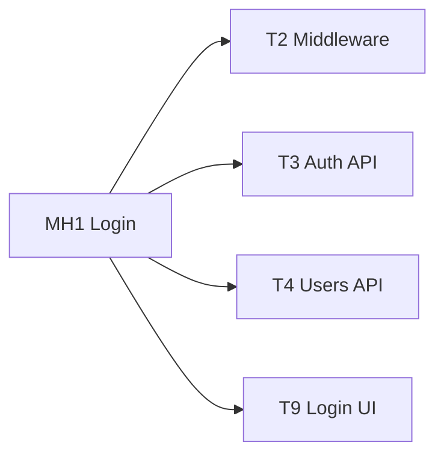
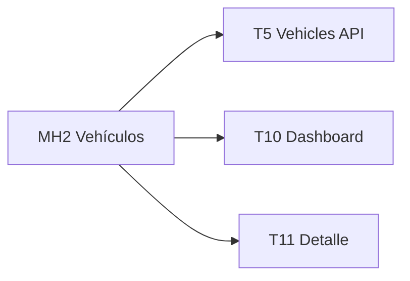
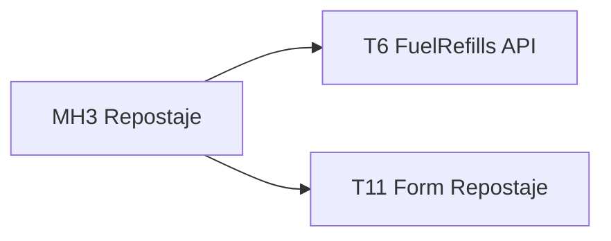
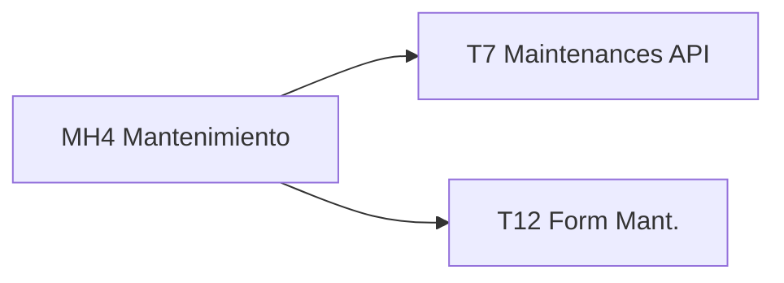
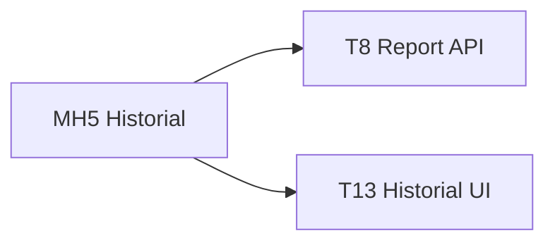

# Trazabilidad — Flotiko

Este documento es el punto de entrada para ver el **impacto completo de una feature**: qué historias de usuario cubre y qué tickets (Backend, API, Frontend) la implementan. La matriz detallada tickets ↔ historias está en [tickets.md](tickets.md).

---

## Vista por historia

Para cada historia se listan los tickets que la implementan, con enlaces directos.

### MH1 — Login y acceso a la app

- **Historia**: [MH1 — Login y acceso a la app](historias-usuario/MH1.md)
- **Tickets**: Backend/API key [T2](tickets/T2.md), API Auth [T3](tickets/T3.md), API Usuarios [T4](tickets/T4.md), Frontend Login [T9](tickets/T9.md)

### MH2 — Listado de vehículos y detalle

- **Historia**: [MH2 — Listado y detalle vehículos](historias-usuario/MH2.md)
- **Tickets**: API Vehículos/Brands [T5](tickets/T5.md), Frontend Dashboard [T10](tickets/T10.md), Frontend Detalle y repostaje [T11](tickets/T11.md)

### MH3 — Registrar repostaje

- **Historia**: [MH3 — Registrar repostaje](historias-usuario/MH3.md)
- **Tickets**: API Fuel-refills [T6](tickets/T6.md), Frontend Detalle y formulario repostaje [T11](tickets/T11.md)

### MH4 — Registrar mantenimiento

- **Historia**: [MH4 — Registrar mantenimiento](historias-usuario/MH4.md)
- **Tickets**: API Maintenances [T7](tickets/T7.md), Frontend Formulario mantenimiento [T12](tickets/T12.md)

### MH5 — Historial e informe

- **Historia**: [MH5 — Historial e informe](historias-usuario/MH5.md)
- **Tickets**: API Reporte [T8](tickets/T8.md), Frontend Historial e informe [T13](tickets/T13.md)

### SH1 — Notificaciones

- **Historia**: [SH1 — Notificaciones](historias-usuario/SH1.md)
- **Tickets**: [T14 — Notificaciones en app y push](tickets/T14.md)

### SH2 — Gasolineras cercanas

- **Historia**: [SH2 — Gasolineras cercanas](historias-usuario/SH2.md)
- **Tickets**: [T15 — Gasolineras cercanas](tickets/T15.md)

---

## Tabla resumen (Historia → Tickets)

| Historia | Tickets |
|----------|---------|
| [MH1](historias-usuario/MH1.md) | [T2](tickets/T2.md), [T3](tickets/T3.md), [T4](tickets/T4.md), [T9](tickets/T9.md) |
| [MH2](historias-usuario/MH2.md) | [T5](tickets/T5.md), [T10](tickets/T10.md), [T11](tickets/T11.md) |
| [MH3](historias-usuario/MH3.md) | [T6](tickets/T6.md), [T11](tickets/T11.md) |
| [MH4](historias-usuario/MH4.md) | [T7](tickets/T7.md), [T12](tickets/T12.md) |
| [MH5](historias-usuario/MH5.md) | [T8](tickets/T8.md), [T13](tickets/T13.md) |
| [SH1](historias-usuario/SH1.md) | [T14](tickets/T14.md) |
| [SH2](historias-usuario/SH2.md) | [T15](tickets/T15.md) |

---

## Matriz completa

La matriz cruzada **Ticket ↔ Historia** (qué ticket implementa qué historia) está en [tickets.md — Matriz de trazabilidad](tickets.md#matriz-de-trazabilidad).

[T1](tickets/T1.md) es la base (proyecto Laravel, BD, modelos) para todo el flujo; no está asociado a una historia concreta.
