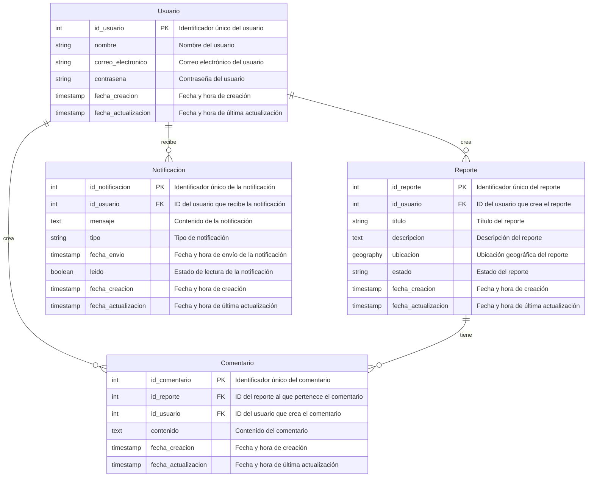

## Índice

0. [Ficha del proyecto](#0-ficha-del-proyecto)
1. [Descripción general del producto](#1-descripción-general-del-producto)
2. [Arquitectura del sistema](#2-arquitectura-del-sistema)
3. [Modelo de datos](#3-modelo-de-datos)
4. [Especificación de la API](#4-especificación-de-la-api)
5. [Historias de usuario](#5-historias-de-usuario)
6. [Tickets de trabajo](#6-tickets-de-trabajo)
7. [Pull requests](#7-pull-requests)

---

## 0. Ficha del proyecto

### **0.1. Tu nombre completo:**

> Diego Fernando Orozco Quintero

### **0.2. Nombre del proyecto:**

> Mapa de Seguridad Urbana

### **0.3. Descripción breve del proyecto:**

Solución de una plataforma en la que los usuarios pueden marcar y comentar sobre la seguridad de diferentes zonas en la ciudad (iluminación, incidencias, puntos peligrosos, etc).

### **0.4. URL del proyecto:**

> Puede ser pública o privada, en cuyo caso deberás compartir los accesos de manera segura. Puedes enviarlos a [alvaro@lidr.co](mailto:alvaro@lidr.co) usando algún servicio como [onetimesecret](https://onetimesecret.com/).

### 0.5. URL o archivo comprimido del repositorio

> Puedes tenerlo alojado en público o en privado, en cuyo caso deberás compartir los accesos de manera segura. Puedes enviarlos a [alvaro@lidr.co](mailto:alvaro@lidr.co) usando algún servicio como [onetimesecret](https://onetimesecret.com/). También puedes compartir por correo un archivo zip con el contenido

---

## 1. Descripción general del producto

> Aspectos del producto "Mapa de Seguridad Urbana"

### **1.1. Objetivo:**

_**El propósito**_ del producto es proporcionar una plataforma interactiva y accesible para que los ciudadanos puedan informar, consultar y evaluar la seguridad de diversas zonas de la ciudad. Este sistema busca fomentar un sentido de comunidad y responsabilidad compartida, permitiendo a los usuarios colaborar en la mejora de la seguridad urbana y brindando a las autoridades y organizaciones datos en tiempo real para implementar soluciones efectivas.

_**El valor**_ que aporta el producto es significativo al empoderar a los ciudadanos para mejorar su seguridad cotidiana mediante el acceso a información sobre condiciones peligrosas y zonas con mejor o peor infraestructura de seguridad. Además, se convierte en una fuente valiosa de datos para que las autoridades puedan tomar decisiones informadas en la gestión de recursos y mejoras en la infraestructura de seguridad urbana.

**Beneficios que ofrece el producto:**

1. Mejora la seguridad de la comunidad mediante información accesible y actualizada.
2. Fomenta la colaboración ciudadana en la construcción de una ciudad más segura.
3. Ayuda a las autoridades a tomar decisiones informadas en base a datos en tiempo real.
4. Incrementa la confianza de los ciudadanos en la seguridad de su entorno.
5. Identifica patrones y puntos críticos de manera rápida y visual.
6. Permite a los ciudadanos planificar sus rutas y desplazamientos de forma segura.
7. Proporciona una plataforma para que las autoridades respondan a las preocupaciones de los ciudadanos.
8. Contribuye a la transparencia y el control social de la seguridad urbana.
9. Ayuda a la identificación de zonas con necesidades de inversión en infraestructura.
10. Promueve una cultura de prevención y responsabilidad en torno a la seguridad pública.

_**Soluciona el problema**_ de la falta de información centralizada y en tiempo real sobre los niveles de seguridad en diferentes áreas de la ciudad. Ayuda a reducir la inseguridad mediante la identificación de zonas críticas, la exposición de problemas específicos como iluminación deficiente o alta incidencia de delitos, y brinda a los ciudadanos la capacidad de anticiparse a situaciones peligrosas.

_**Público objetivo:**_  
- Ciudadanos preocupados por su seguridad y la de su comunidad.
- Organizaciones no gubernamentales y grupos comunitarios interesados en mejorar la seguridad urbana. 
- Autoridades locales y cuerpos de seguridad que pueden aprovechar los datos para decisiones informadas.
- Empresas de servicios públicos que puedan beneficiarse de los datos sobre infraestructura urbana.
- Instituciones académicas y de investigación interesadas en estudiar patrones de seguridad urbana.

### **1.2. Características y funcionalidades principales:**

> **Necesidades que cubre el producto:**

1. **Información en tiempo real** sobre la seguridad de diferentes zonas de la ciudad.
2. **Identificación de zonas peligrosas** que requieren intervención urgente.
3. **Visualización de datos históricos y tendencias** en la seguridad urbana.
4. **Facilidad para reportar y consultar incidencias** de forma sencilla y rápida.
5. **Acceso a recomendaciones** para mejorar la seguridad en áreas específicas.
6. **Comunicación efectiva** entre ciudadanos y autoridades sobre problemas de seguridad.

> **Características y funcionalidades del producto:**

1. **Mapa interactivo en tiempo real:** Muestra el estado de seguridad de cada zona y permite a los usuarios desplazarse fácilmente por la ciudad.
2. **Capacidad de reportar incidencias:** Los usuarios pueden reportar problemas como robos, vandalismo, iluminación deficiente, entre otros.
3. **Sistema de comentarios y valoraciones:** Permite a los usuarios calificar y comentar sobre la seguridad de zonas específicas, creando una base de opiniones comunitaria.
4. **Filtros de búsqueda avanzada:** Los usuarios pueden buscar zonas específicas según tipos de incidencias, horarios o niveles de seguridad.
5. **Notificaciones y alertas personalizadas:** Envío de alertas a los usuarios según incidencias o cambios de seguridad en sus zonas de interés.
6. **Análisis de datos históricos:** Visualización de tendencias de seguridad con gráficos y estadísticas de diferentes periodos.
7. **Puntos de interés seguros:** Indicación de áreas o negocios reconocidos como seguros (como estaciones de policía o lugares bien iluminados).
8. **Acceso a recomendaciones y consejos de seguridad:** Sugerencias para los ciudadanos sobre cómo reducir riesgos en sus zonas.
9. **Dashboard para autoridades:** Interfaz específica para autoridades con estadísticas detalladas, mapas de calor y análisis de patrones delictivos.
10. **Modo anónimo para reportes:** Los usuarios pueden reportar incidentes de manera anónima, protegiendo su identidad.

### **1.3. Diseño y experiencia de usuario:**

> Proporciona imágenes y/o videotutorial mostrando la experiencia del usuario desde que aterriza en la aplicación, pasando por todas las funcionalidades principales.

### **1.4. Instrucciones de instalación:**
> Documenta de manera precisa las instrucciones para instalar y poner en marcha el proyecto en local (librerías, backend, frontend, servidor, base de datos, migraciones y semillas de datos, etc.)

---

## 2. Arquitectura del Sistema

### **2.1. Diagrama de arquitectura:**

Para la solución del "Mapa de Seguridad Urbana", sigue un patrón arquitectónico de microservicios con varios componentes y servicios especializados, cada uno de los cuales cumple funciones específicas dentro del sistema. Este tipo de arquitectura es común en aplicaciones modernas y escalables, especialmente aquellas que requieren modularidad, independencia entre servicios y una alta capacidad de respuesta ante cambios en la demanda.


**Justificación de la Arquitectura**

La arquitectura de microservicios con un API Gateway, mensajería asíncrona y caching está diseñada para maximizar la escalabilidad, resiliencia y modularidad de la aplicación. Esto es especialmente útil para un sistema de seguridad urbana donde:

- **Escalabilidad**: A medida que la aplicación crezca en usuarios y funcionalidades, los microservicios podrán escalarse individualmente según la demanda.
- **Resiliencia**: Si un microservicio falla (por ejemplo, el de notificaciones), no afectará al sistema en su totalidad; los demás servicios podrán continuar operando de forma independiente.
- **Modularidad y Mantenibilidad**: Permite desarrollar y desplegar cada módulo de forma independiente, lo cual es ideal para equipos que pueden trabajar en paralelo y en actualizaciones sin afectar a todo el sistema.

**Beneficios Principales de la Arquitectura**

1. **Despliegue Independiente y Escalabilidad**: Al seguir una arquitectura de microservicios, cada componente puede escalarse y desplegarse de manera independiente, permitiendo un uso óptimo de recursos.
   
2. **Resiliencia y Disponibilidad**: La arquitectura es menos susceptible a fallos generales porque cada microservicio puede funcionar de manera independiente. RabbitMQ permite manejar tareas asíncronas, lo que disminuye el impacto de tiempos de espera o errores de servicios.

3. **Observabilidad y Monitoreo Completo**: Con Jaeger, ELK Stack y Prometheus + Grafana, se pueden rastrear las solicitudes y monitorear la salud del sistema, facilitando la detección y resolución de problemas. Esto es crítico en aplicaciones que deben operar en tiempo real y ofrecer una experiencia de usuario confiable.

4. **Desacoplamiento y Reducción de Dependencias**: RabbitMQ permite una comunicación asíncrona entre servicios, lo cual reduce la dependencia directa entre microservicios. Esto mejora la resiliencia y permite manejar un mayor número de solicitudes simultáneas sin comprometer el rendimiento.

**Sacrificios y Déficits de esta Arquitectura**

1. **Complejidad Operativa**: Esta arquitectura requiere una infraestructura de soporte compleja, incluyendo el despliegue y mantenimiento de RabbitMQ, Redis, ELK Stack, Jaeger, Prometheus y Grafana, lo cual demanda experiencia y recursos en DevOps y monitoreo.

2. **Sobrecarga de Red y Latencia Potencial**: La comunicación entre microservicios, especialmente si es a través de mensajería asíncrona y caché, puede agregar latencia, especialmente en consultas que necesitan interactuar con varios servicios.

3. **Costos de Infraestructura**: Al desplegar múltiples componentes y servicios en paralelo, los costos de infraestructura en la nube o en servidores on-premise aumentan. Esto debe evaluarse si el proyecto tiene un presupuesto limitado o si no se anticipa un crecimiento significativo en el número de usuarios.

4. **Mayor Carga de Desarrollo y Mantenimiento**: La modularidad de microservicios requiere prácticas avanzadas de gestión de código y configuración de despliegue continuo (CI/CD). Esto implica una mayor curva de aprendizaje para el equipo y puede aumentar el tiempo de desarrollo inicial.

### **2.2. Descripción de componentes principales:**

La arquitectura presentada utiliza los siguientes patrones principales:

1. **Microservicios**:
   - Cada funcionalidad principal (gestión de reportes, usuarios, comentarios, notificaciones) está implementada como un microservicio independiente. Esto permite que cada módulo pueda desarrollarse, desplegarse y escalarse de manera independiente.
   - Los microservicios ayudan a distribuir la carga y a especializar funciones, haciendo que la aplicación sea más adaptable a cambios y actualizaciones sin afectar a otros servicios.

2. **API Gateway (NGINX)**:
   - El API Gateway actúa como punto de entrada único al sistema, gestionando la autenticación, enrutamiento de solicitudes y balanceo de carga. Esto simplifica la comunicación y el acceso de los usuarios, protegiendo los microservicios internos y gestionando las autenticaciones de forma centralizada.
   - El patrón de API Gateway es común en arquitecturas de microservicios para evitar la exposición directa de los servicios internos y manejar mejor la seguridad y la autenticación.

3. **Mensajería Asíncrona (RabbitMQ)**:
   - RabbitMQ facilita la comunicación asíncrona entre los microservicios, permitiendo una interacción fluida y desacoplada que mejora el rendimiento y la escalabilidad. En lugar de depender de llamadas síncronas entre microservicios, RabbitMQ permite la transmisión de eventos y tareas que no necesitan respuesta inmediata, como el envío de notificaciones.
   - Este enfoque sigue el patrón de **Event-Driven Architecture (EDA)**, en el cual los servicios se comunican mediante eventos, reduciendo la dependencia directa y mejorando la resiliencia del sistema.

4. **Caché (Redis)**:
   - Redis se usa para almacenar en caché datos frecuentes y sesiones de usuario, lo que mejora el tiempo de respuesta y reduce la carga en la base de datos.
   - Redis sigue el patrón de **Caching** para optimizar el acceso a datos consultados frecuentemente, especialmente útil para datos de uso intensivo como información de zonas seguras y perfiles de usuario.

5. **Trazabilidad Distribuida y Monitoreo**:
   - Con **Jaeger** para trazabilidad, **Prometheus + Grafana** para monitoreo de métricas, y el **ELK Stack** para el análisis de logs, la arquitectura sigue un patrón de **Observabilidad**. Esto permite supervisar y rastrear el flujo de solicitudes, rendimiento y errores, lo cual es esencial para un sistema de producción en microservicios.

### **2.3. Descripción de alto nivel del proyecto y estructura de ficheros**

Se ha de de adoptar el **Patrón de Arquitectura Hexagonal** (también conocido como **Arquitectura de Puertos y Adaptadores**) para la implementación del código. Este patrón permite que cada microservicio sea modular y fácil de probar y que se integre con servicios externos (como bases de datos, mensajería o APIs) a través de interfaces bien definidas. La Arquitectura Hexagonal es ideal en un entorno de microservicios, ya que ayuda a gestionar las dependencias y desacopla el núcleo del negocio de los detalles de implementación.

Para implementar esta estructura de carpetas, cada microservicio tendrá su propia carpeta raíz (monorepositorio). A continuación, se detalla una estructura de carpetas general que podrías usar en cada microservicio de manera independiente:

```plaintext
/microservicio-reportes (ejemplo)
├── src
│   ├── application                # Casos de uso / lógica de aplicación
│   │   ├── createReport.js        # Caso de uso: Crear reporte
│   │   ├── listReports.js         # Caso de uso: Listar reportes
│   │   └── deleteReport.js        # Caso de uso: Eliminar reporte
│   ├── domain                     # Lógica de negocio y entidades del dominio
│   │   ├── entities
│   │   │   └── report.js          # Entidad de dominio "Reporte"
│   │   ├── repositories
│   │   │   └── reportRepository.js # Interfaz del repositorio de reportes
│   │   └── services               # Servicios de dominio específicos
│   │       └── reportService.js
│   ├── infrastructure             # Adaptadores de infraestructura (API, DB, MQ)
│   │   ├── controllers
│   │   │   └── reportController.js # Controladores HTTP para reportes
│   │   ├── database
│   │   │   ├── models             # Modelos de la base de datos
│   │   │   └── reportModel.js     # Modelo de la entidad "Reporte"
│   │   ├── messageQueue           # Adaptadores de mensajería (RabbitMQ)
│   │   │   └── reportPublisher.js
│   │   └── webserver.js           # Configuración del servidor web (Express)
│   └── interfaces                 # Interfaces de entrada y salida
│       ├── http                   # Definición de rutas HTTP
│       │   └── reportRoutes.js    # Rutas para reportes
│       └── events                 # Eventos que el servicio puede emitir/recibir
│           └── reportEvents.js
├── config                         # Configuración específica del servicio
│   ├── default.json               # Configuración por defecto
│   ├── development.json           # Configuración de desarrollo
│   └── production.json            # Configuración de producción
├── tests                          # Pruebas unitarias y de integración
│   ├── unit
│   │   └── reportService.test.js  # Prueba unitaria del servicio de reportes
│   └── integration
│       └── reportRoutes.test.js   # Prueba de integración de rutas
├── .env                           # Variables de entorno
├── Dockerfile                     # Definición del contenedor Docker para el microservicio
├── docker-compose.yml             # Configuración de Docker Compose
└── package.json                   # Dependencias y scripts del proyecto
```

**Explicación de la Estructura de Carpetas**

1. **`src/application`**:
   - Contiene los **casos de uso** del microservicio. Cada archivo representa un caso de uso o una acción específica del negocio (ej. `createReport.js` para crear reportes).
   - Esta capa define la lógica de aplicación que se utiliza para coordinar el dominio y los servicios externos.

2. **`src/domain`**:
   - Incluye la **lógica de negocio** central y las **entidades** del dominio (como la entidad `report.js` para un reporte de seguridad).
   - Esta carpeta debe contener las reglas y restricciones del dominio y ser independiente de la infraestructura, para poder ser fácilmente reutilizable o testeable.
   - **Repositorios** aquí definen interfaces para acceder a los datos, mientras que la implementación exacta se delega a la infraestructura.

3. **`src/infrastructure`**:
   - **Adaptadores de infraestructura** que conectan el sistema con la base de datos (por ejemplo, `database`), servicios de mensajería (`messageQueue`), o servidores web (`webserver.js`).
   - Incluye los controladores que gestionan las solicitudes de entrada y salida a través de HTTP (por ejemplo, con Express en `reportController.js`).
   - Las **rutas** se definen en `interfaces/http`, y `events` en `interfaces/events` permite capturar y emitir eventos mediante RabbitMQ u otros sistemas de mensajería.

4. **`config`**:
   - **Configuraciones específicas** del entorno, organizadas en archivos para cada ambiente (como `default.json`, `development.json`, y `production.json`). Incluye configuraciones como variables de entorno, puertos, o parámetros de conexión a la base de datos.

5. **`tests`**:
   - **Pruebas unitarias y de integración** para el microservicio. Esto incluye tanto los servicios de dominio en la carpeta `unit` como la integración entre el microservicio y sus dependencias en `integration`.

6. **`Dockerfile`** y **`docker-compose.yml`**:
   - Configuración para contenedores. Permite empaquetar el microservicio en Docker, lo que facilita la portabilidad y el despliegue en diversos entornos.

7. **`.env`**:
   - Archivo que contiene **variables de entorno** sensibles, como claves secretas de JWT, credenciales de la base de datos y configuraciones específicas.

**Script en DOS para la creación de las carpetas del backend**

```bat
@echo off
set /p CONTINUE=¿Deseas continuar? (Y/N): 
if /i "%CONTINUE%" NEQ "Y" (
    echo Proceso cancelado.
    exit /b
)

REM Crear estructura principal del monorepo
mkdir backend
cd backend

REM Crear carpetas base para cada microservicio
set SERVICES=reportes usuarios comentarios notificaciones
for %%S in (%SERVICES%) do (
    mkdir microservicio-%%S
    cd microservicio-%%S
    mkdir src config tests

    REM Crear carpetas de la estructura interna
    mkdir src\application src\domain src\infrastructure src\interfaces
    mkdir src\domain\entities src\domain\repositories src\domain\services
    mkdir src\infrastructure\controllers src\infrastructure\database src\infrastructure\messageQueue
    mkdir src\infrastructure\database\models
    mkdir src\interfaces\http src\interfaces\events
    mkdir tests\unit tests\integration

    REM Crear archivos básicos en cada microservicio
    echo. > src\application\create%%S.js
    echo. > src\application\list%%S.js
    echo. > src\application\delete%%S.js

    echo. > src\domain\entities\%%S.js
    echo. > src\domain\repositories\%%SRepository.js
    echo. > src\domain\services\%%SService.js

    echo. > src\infrastructure\controllers\%%SController.js
    echo. > src\infrastructure\database\models\%%SModel.js
    echo. > src\infrastructure\messageQueue\%%SPublisher.js
    echo. > src\infrastructure\webserver.js

    echo. > src\interfaces\http\%%SRoutes.js
    echo. > src\interfaces\events\%%SEvents.js

    REM Crear archivos de configuración
    echo {} > config\default.json
    echo {} > config\development.json
    echo {} > config\production.json

    REM Crear archivos de prueba
    echo. > tests\unit\%%SService.test.js
    echo. > tests\integration\%%SRoutes.test.js

    REM Crear archivos de entorno y Docker
    echo. > .env
    echo FROM node:14 > Dockerfile
    echo. > docker-compose.yml
    echo {} > package.json

    REM Volver a la carpeta del backend para el siguiente servicio
    cd ..
)

echo Estructura de archivos del backend creada exitosamente.
pause
```

### **2.4. Infraestructura y despliegue**

> Detalla la infraestructura del proyecto, incluyendo un diagrama en el formato que creas conveniente, y explica el proceso de despliegue que se sigue

### **2.5. Seguridad**

> Enumera y describe las prácticas de seguridad principales que se han implementado en el proyecto, añadiendo ejemplos si procede

### **2.6. Tests**

> Describe brevemente algunos de los tests realizados

---

## 3. Modelo de Datos

### **3.1. Diagrama del modelo de datos:**




### **3.2. Descripción de entidades principales:**

A continuación se presenta la especificación detallada para cada entidad del modelo de datos en forma de tabla. Cada tabla incluye el nombre y tipo de cada atributo, su descripción, claves primarias y foráneas, relaciones, tipos de relación y restricciones.

> **Esquema Comunes**

**`Usuario`**

| Atributo                | Tipo        | Descripción                                         | Clave        | Relación                 | Restricciones          |
|-------------------------|-------------|-----------------------------------------------------|--------------|-------------------------|------------------------|
| `id_usuario`            | INT         | Identificador único del usuario                      | PK           | -                       | NOT NULL, UNIQUE       |
| `nombre`                | VARCHAR(255)| Nombre del usuario                                   | -            | -                       | NOT NULL               |
| `correo_electronico`    | VARCHAR(255)| Correo electrónico del usuario                       | -            | -                       | NOT NULL, UNIQUE       |
| `contraseña`            | VARCHAR(255)| Contraseña del usuario                               | -            | -                       | NOT NULL               |
| `fecha_creacion`        | TIMESTAMP   | Fecha y hora de creación del registro                | -            | -                       | NOT NULL               |
| `fecha_actualizacion`   | TIMESTAMP   | Fecha y hora de última actualización del registro    | -            | -                       | NOT NULL               |

> **Esquema Reportes**

**`Reporte`**

| Atributo                | Tipo         | Descripción                                            | Clave        | Relación                  | Restricciones          |
|-------------------------|--------------|--------------------------------------------------------|--------------|--------------------------|------------------------|
| `id_reporte`            | INT          | Identificador único del reporte                         | PK           | -                        | NOT NULL, UNIQUE       |
| `id_usuario`            | INT          | ID del usuario que crea el reporte                     | FK           | comunes.Usuario           | NOT NULL               |
| `titulo`                | VARCHAR(255) | Título del reporte                                     | -            | -                        | NOT NULL               |
| `descripcion`           | TEXT         | Descripción del reporte                                 | -            | -                        | NOT NULL               |
| `ubicacion`             | GEOGRAPHY    | Ubicación geográfica del reporte                        | -            | -                        | NOT NULL               |
| `estado`                | VARCHAR(50)  | Estado del reporte (ej. "pendiente", "resuelto")      | -            | -                        | NOT NULL               |
| `fecha_creacion`        | TIMESTAMP    | Fecha y hora de creación del registro                   | -            | -                        | NOT NULL               |
| `fecha_actualizacion`   | TIMESTAMP    | Fecha y hora de última actualización del registro       | -            | -                        | NOT NULL               |

> **Esquema Comentarios**

**`Comentario`**

| Atributo                | Tipo         | Descripción                                          | Clave        | Relación                  | Restricciones          |
|-------------------------|--------------|------------------------------------------------------|--------------|--------------------------|------------------------|
| `id_comentario`         | INT          | Identificador único del comentario                   | PK           | -                        | NOT NULL, UNIQUE       |
| `id_reporte`            | INT          | ID del reporte al que pertenece el comentario        | FK           | reportes.Reporte         | NOT NULL               |
| `id_usuario`            | INT          | ID del usuario que crea el comentario                | FK           | comunes.Usuario           | NOT NULL               |
| `contenido`             | TEXT         | Contenido del comentario                             | -            | -                        | NOT NULL               |
| `fecha_creacion`        | TIMESTAMP    | Fecha y hora de creación del registro                | -            | -                        | NOT NULL               |
| `fecha_actualizacion`   | TIMESTAMP    | Fecha y hora de última actualización del registro     | -            | -                        | NOT NULL               |

> **Esquema Notificaciones**

**`Notificación`**

| Atributo                | Tipo         | Descripción                                           | Clave        | Relación                  | Restricciones          |
|-------------------------|--------------|-------------------------------------------------------|--------------|--------------------------|------------------------|
| `id_notificacion`       | INT          | Identificador único de la notificación                | PK           | -                        | NOT NULL, UNIQUE       |
| `id_usuario`            | INT          | ID del usuario que recibe la notificación             | FK           | comunes.Usuario           | NOT NULL               |
| `mensaje`               | TEXT         | Contenido de la notificación                          | -            | -                        | NOT NULL               |
| `tipo`                  | VARCHAR(50)  | Tipo de notificación (ej. "alerta", "info")          | -            | -                        | NOT NULL               |
| `fecha_envio`           | TIMESTAMP    | Fecha y hora de envío de la notificación              | -            | -                        | NOT NULL               |
| `leido`                 | BOOLEAN      | Estado de lectura de la notificación                  | -            | -                        | NOT NULL               |
| `fecha_creacion`        | TIMESTAMP    | Fecha y hora de creación del registro                 | -            | -                        | NOT NULL               |
| `fecha_actualizacion`   | TIMESTAMP    | Fecha y hora de última actualización del registro      | -            | -                        | NOT NULL               |

> **Resumen de Relaciones**

1. **Usuario** (comunes) puede:
   - Crear múltiples **Reportes** (reportes), por lo que hay una relación uno a muchos entre `Usuario` y `Reporte`.
   - Crear múltiples **Comentarios** (comentarios), estableciendo también una relación uno a muchos.
   - recibir múltiples **Notificaciones** (notificaciones), creando otra relación uno a muchos.
2. **Reporte** (reportes) puede tener múltiples **Comentarios** (comentarios), configurando una relación uno a muchos.

---

## 4. Especificación de la API

> Si tu backend se comunica a través de API, describe los endpoints principales (máximo 3) en formato OpenAPI. Opcionalmente puedes añadir un ejemplo de petición y de respuesta para mayor claridad

---

## 5. Historias de Usuario

> Documenta 3 de las historias de usuario principales utilizadas durante el desarrollo, teniendo en cuenta las buenas prácticas de producto al respecto.

**Historia de Usuario 1**

**Historia de Usuario 2**

**Historia de Usuario 3**

---

## 6. Tickets de Trabajo

> Documenta 3 de los tickets de trabajo principales del desarrollo, uno de backend, uno de frontend, y uno de bases de datos. Da todo el detalle requerido para desarrollar la tarea de inicio a fin teniendo en cuenta las buenas prácticas al respecto. 

**Ticket 1**

**Ticket 2**

**Ticket 3**

---

## 7. Pull Requests

> Documenta 3 de las Pull Requests realizadas durante la ejecución del proyecto

**Pull Request 1**

**Pull Request 2**

**Pull Request 3**

