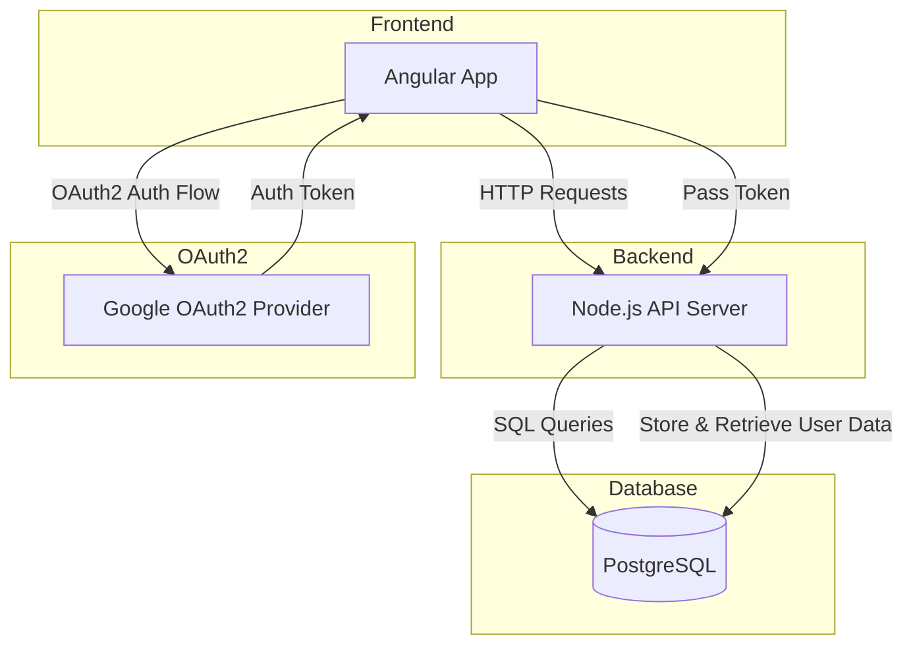
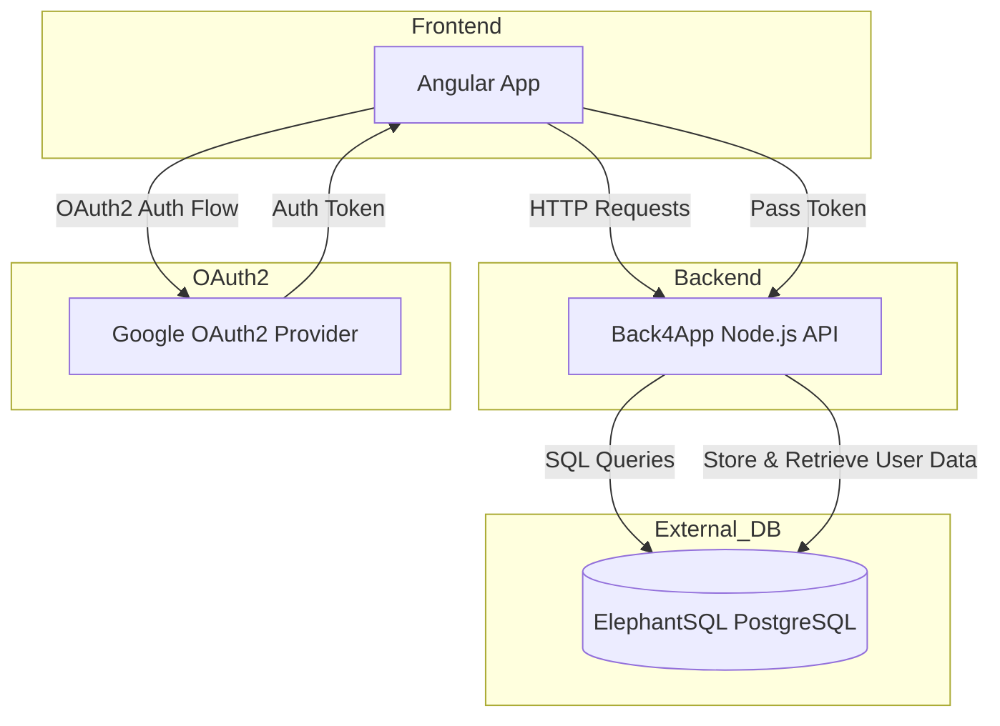

## Índice

0. [Ficha del proyecto](#0-ficha-del-proyecto)
1. [Descripción general del producto](#1-descripción-general-del-producto)
2. [Arquitectura del sistema](#2-arquitectura-del-sistema)
3. [Modelo de datos](#3-modelo-de-datos)
4. [Especificación de la API](#4-especificación-de-la-api)
5. [Historias de usuario](#5-historias-de-usuario)
6. [Tickets de trabajo](#6-tickets-de-trabajo)
7. [Pull requests](#7-pull-requests)

---

## 0. Ficha del proyecto

### **0.1. Tu nombre completo:**

> Diego Fernando Orozco Quintero

### **0.2. Nombre del proyecto:**

> Mapa de Seguridad Urbana

### **0.3. Descripción breve del proyecto:**

Solución de una plataforma en la que los usuarios pueden marcar y comentar sobre la seguridad de diferentes zonas en la ciudad (iluminación, incidencias, puntos peligrosos, etc).

### **0.4. URL del proyecto:**

> Puede ser pública o privada, en cuyo caso deberás compartir los accesos de manera segura. Puedes enviarlos a [alvaro@lidr.co](mailto:alvaro@lidr.co) usando algún servicio como [onetimesecret](https://onetimesecret.com/).

### 0.5. URL o archivo comprimido del repositorio

> Puedes tenerlo alojado en público o en privado, en cuyo caso deberás compartir los accesos de manera segura. Puedes enviarlos a [alvaro@lidr.co](mailto:alvaro@lidr.co) usando algún servicio como [onetimesecret](https://onetimesecret.com/). También puedes compartir por correo un archivo zip con el contenido

---

## 1. Descripción general del producto

> Aspectos del producto "Mapa de Seguridad Urbana"

### **1.1. Objetivo:**

_**El propósito**_ del producto es proporcionar una plataforma interactiva y accesible para que los ciudadanos puedan informar, consultar y evaluar la seguridad de diversas zonas de la ciudad. Este sistema busca fomentar un sentido de comunidad y responsabilidad compartida, permitiendo a los usuarios colaborar en la mejora de la seguridad urbana y brindando a las autoridades y organizaciones datos en tiempo real para implementar soluciones efectivas.

_**El valor**_ que aporta el producto es significativo al empoderar a los ciudadanos para mejorar su seguridad cotidiana mediante el acceso a información sobre condiciones peligrosas y zonas con mejor o peor infraestructura de seguridad. Además, se convierte en una fuente valiosa de datos para que las autoridades puedan tomar decisiones informadas en la gestión de recursos y mejoras en la infraestructura de seguridad urbana.

**Beneficios que ofrece el producto:**

1. Mejora la seguridad de la comunidad mediante información accesible y actualizada.
2. Fomenta la colaboración ciudadana en la construcción de una ciudad más segura.
3. Ayuda a las autoridades a tomar decisiones informadas en base a datos en tiempo real.
4. Incrementa la confianza de los ciudadanos en la seguridad de su entorno.
5. Identifica patrones y puntos críticos de manera rápida y visual.
6. Permite a los ciudadanos planificar sus rutas y desplazamientos de forma segura.
7. Proporciona una plataforma para que las autoridades respondan a las preocupaciones de los ciudadanos.
8. Contribuye a la transparencia y el control social de la seguridad urbana.
9. Ayuda a la identificación de zonas con necesidades de inversión en infraestructura.
10. Promueve una cultura de prevención y responsabilidad en torno a la seguridad pública.

_**Soluciona el problema**_ de la falta de información centralizada y en tiempo real sobre los niveles de seguridad en diferentes áreas de la ciudad. Ayuda a reducir la inseguridad mediante la identificación de zonas críticas, la exposición de problemas específicos como iluminación deficiente o alta incidencia de delitos, y brinda a los ciudadanos la capacidad de anticiparse a situaciones peligrosas.

_**Público objetivo:**_  
- Ciudadanos preocupados por su seguridad y la de su comunidad.
- Organizaciones no gubernamentales y grupos comunitarios interesados en mejorar la seguridad urbana. 
- Autoridades locales y cuerpos de seguridad que pueden aprovechar los datos para decisiones informadas.
- Empresas de servicios públicos que puedan beneficiarse de los datos sobre infraestructura urbana.
- Instituciones académicas y de investigación interesadas en estudiar patrones de seguridad urbana.

### **1.2. Características y funcionalidades principales:**

> **Necesidades que cubre el producto:**

1. **Información en tiempo real** sobre la seguridad de diferentes zonas de la ciudad.
2. **Identificación de zonas peligrosas** que requieren intervención urgente.
3. **Visualización de datos históricos y tendencias** en la seguridad urbana.
4. **Facilidad para reportar y consultar incidencias** de forma sencilla y rápida.
5. **Acceso a recomendaciones** para mejorar la seguridad en áreas específicas.
6. **Comunicación efectiva** entre ciudadanos y autoridades sobre problemas de seguridad.

> **Características y funcionalidades del producto:**

1. **Mapa interactivo en tiempo real:** Muestra el estado de seguridad de cada zona y permite a los usuarios desplazarse fácilmente por la ciudad.
2. **Capacidad de reportar incidencias:** Los usuarios pueden reportar problemas como robos, vandalismo, iluminación deficiente, entre otros.
3. **Sistema de comentarios y valoraciones:** Permite a los usuarios calificar y comentar sobre la seguridad de zonas específicas, creando una base de opiniones comunitaria.
4. **Filtros de búsqueda avanzada:** Los usuarios pueden buscar zonas específicas según tipos de incidencias, horarios o niveles de seguridad.
5. **Notificaciones y alertas personalizadas:** Envío de alertas a los usuarios según incidencias o cambios de seguridad en sus zonas de interés.
6. **Análisis de datos históricos:** Visualización de tendencias de seguridad con gráficos y estadísticas de diferentes periodos.
7. **Puntos de interés seguros:** Indicación de áreas o negocios reconocidos como seguros (como estaciones de policía o lugares bien iluminados).
8. **Acceso a recomendaciones y consejos de seguridad:** Sugerencias para los ciudadanos sobre cómo reducir riesgos en sus zonas.
9. **Dashboard para autoridades:** Interfaz específica para autoridades con estadísticas detalladas, mapas de calor y análisis de patrones delictivos.

### **1.2.1. producto mínimo Viable (MVP):**

> **Características y funcionalidades del MVP:**

1. **Autenticación con OAUTH2 con Google:** Permite el registro de usuarios con su cuenta de google en caso de querer realizar algún reporte.
2. **Capacidad de reportar incidencias:** Los usuarios registrados pueden reportar problemas como robos, vandalismo, iluminación deficiente, entre otros.
3. **Sistema de comentarios y valoraciones:** Permite a los usuarios calificar y comentar sobre la seguridad de zonas específicas, creando una base de opiniones comunitaria.
4. **Modo anónimo para consulta:** Culquier persona puede consultar incidentes de manera anónima.

### **1.3. Diseño y experiencia de usuario:**

> Proporciona imágenes y/o videotutorial mostrando la experiencia del usuario desde que aterriza en la aplicación, pasando por todas las funcionalidades principales.

### **1.4. Instrucciones de instalación:**
> Documenta de manera precisa las instrucciones para instalar y poner en marcha el proyecto en local (librerías, backend, frontend, servidor, base de datos, migraciones y semillas de datos, etc.)

---

## 2. Arquitectura del Sistema

### **2.1. Diagrama de arquitectura General:**

Para la solución del "Mapa de Seguridad Urbana", sigue un patrón arquitectónico de microservicios con varios componentes y servicios especializados, cada uno de los cuales cumple funciones específicas dentro del sistema. Este tipo de arquitectura es común en aplicaciones modernas y escalables, especialmente aquellas que requieren modularidad, independencia entre servicios y una alta capacidad de respuesta ante cambios en la demanda.


**Justificación de la Arquitectura**

La arquitectura de microservicios con un API Gateway, mensajería asíncrona y caching está diseñada para maximizar la escalabilidad, resiliencia y modularidad de la aplicación. Esto es especialmente útil para un sistema de seguridad urbana donde:

- **Escalabilidad**: A medida que la aplicación crezca en usuarios y funcionalidades, los microservicios podrán escalarse individualmente según la demanda.
- **Resiliencia**: Si un microservicio falla (por ejemplo, el de notificaciones), no afectará al sistema en su totalidad; los demás servicios podrán continuar operando de forma independiente.
- **Modularidad y Mantenibilidad**: Permite desarrollar y desplegar cada módulo de forma independiente, lo cual es ideal para equipos que pueden trabajar en paralelo y en actualizaciones sin afectar a todo el sistema.

**Beneficios Principales de la Arquitectura**

1. **Despliegue Independiente y Escalabilidad**: Al seguir una arquitectura de microservicios, cada componente puede escalarse y desplegarse de manera independiente, permitiendo un uso óptimo de recursos.
   
2. **Resiliencia y Disponibilidad**: La arquitectura es menos susceptible a fallos generales porque cada microservicio puede funcionar de manera independiente. RabbitMQ permite manejar tareas asíncronas, lo que disminuye el impacto de tiempos de espera o errores de servicios.

3. **Observabilidad y Monitoreo Completo**: Con Jaeger, ELK Stack y Prometheus + Grafana, se pueden rastrear las solicitudes y monitorear la salud del sistema, facilitando la detección y resolución de problemas. Esto es crítico en aplicaciones que deben operar en tiempo real y ofrecer una experiencia de usuario confiable.

4. **Desacoplamiento y Reducción de Dependencias**: RabbitMQ permite una comunicación asíncrona entre servicios, lo cual reduce la dependencia directa entre microservicios. Esto mejora la resiliencia y permite manejar un mayor número de solicitudes simultáneas sin comprometer el rendimiento.

**Sacrificios y Déficits de esta Arquitectura**

1. **Complejidad Operativa**: Esta arquitectura requiere una infraestructura de soporte compleja, incluyendo el despliegue y mantenimiento de RabbitMQ, Redis, ELK Stack, Jaeger, Prometheus y Grafana, lo cual demanda experiencia y recursos en DevOps y monitoreo.

2. **Sobrecarga de Red y Latencia Potencial**: La comunicación entre microservicios, especialmente si es a través de mensajería asíncrona y caché, puede agregar latencia, especialmente en consultas que necesitan interactuar con varios servicios.

3. **Costos de Infraestructura**: Al desplegar múltiples componentes y servicios en paralelo, los costos de infraestructura en la nube o en servidores on-premise aumentan. Esto debe evaluarse si el proyecto tiene un presupuesto limitado o si no se anticipa un crecimiento significativo en el número de usuarios.

4. **Mayor Carga de Desarrollo y Mantenimiento**: La modularidad de microservicios requiere prácticas avanzadas de gestión de código y configuración de despliegue continuo (CI/CD). Esto implica una mayor curva de aprendizaje para el equipo y puede aumentar el tiempo de desarrollo inicial.

### **2.2. Descripción de componentes principales:**

La arquitectura presentada utiliza los siguientes patrones principales:

1. **Microservicios**:
   - Cada funcionalidad principal (gestión de reportes, usuarios, comentarios, notificaciones) está implementada como un microservicio independiente. Esto permite que cada módulo pueda desarrollarse, desplegarse y escalarse de manera independiente.
   - Los microservicios ayudan a distribuir la carga y a especializar funciones, haciendo que la aplicación sea más adaptable a cambios y actualizaciones sin afectar a otros servicios.

2. **API Gateway (NGINX)**:
   - El API Gateway actúa como punto de entrada único al sistema, gestionando la autenticación, enrutamiento de solicitudes y balanceo de carga. Esto simplifica la comunicación y el acceso de los usuarios, protegiendo los microservicios internos y gestionando las autenticaciones de forma centralizada.
   - El patrón de API Gateway es común en arquitecturas de microservicios para evitar la exposición directa de los servicios internos y manejar mejor la seguridad y la autenticación.

3. **Mensajería Asíncrona (RabbitMQ)**:
   - RabbitMQ facilita la comunicación asíncrona entre los microservicios, permitiendo una interacción fluida y desacoplada que mejora el rendimiento y la escalabilidad. En lugar de depender de llamadas síncronas entre microservicios, RabbitMQ permite la transmisión de eventos y tareas que no necesitan respuesta inmediata, como el envío de notificaciones.
   - Este enfoque sigue el patrón de **Event-Driven Architecture (EDA)**, en el cual los servicios se comunican mediante eventos, reduciendo la dependencia directa y mejorando la resiliencia del sistema.

4. **Caché (Redis)**:
   - Redis se usa para almacenar en caché datos frecuentes y sesiones de usuario, lo que mejora el tiempo de respuesta y reduce la carga en la base de datos.
   - Redis sigue el patrón de **Caching** para optimizar el acceso a datos consultados frecuentemente, especialmente útil para datos de uso intensivo como información de zonas seguras y perfiles de usuario.

5. **Trazabilidad Distribuida y Monitoreo**:
   - Con **Jaeger** para trazabilidad, **Prometheus + Grafana** para monitoreo de métricas, y el **ELK Stack** para el análisis de logs, la arquitectura sigue un patrón de **Observabilidad**. Esto permite supervisar y rastrear el flujo de solicitudes, rendimiento y errores, lo cual es esencial para un sistema de producción en microservicios.

### **2.1.1. Diagrama de arquitectura del MVP:**

Aquí tienes un modelo de arquitectura simple en **Mermaid** para el MVP. Este diseño se enfoca en la simplicidad y facilidad de despliegue, con una arquitectura de tres capas:

- **Frontend (Angular)**: Interfaz de usuario.
- **Backend (Node.js con Express)**: API para la lógica de negocio y gestión de autenticación, incidencias y comentarios.
- **Base de datos (PostgreSQL)**: Almacenamiento para la información de usuarios, reportes de incidencias, y comentarios.




### **2.1.2. Descripción de componentes principales del MVP:**

1. **Frontend (Angular)**: Proporciona la interfaz para los usuarios, permitiéndoles ver las incidencias de seguridad en la ciudad, comentar y valorar zonas, y, si están autenticados, reportar nuevas incidencias.

2. **Backend (Node.js con Express)**: 
   - **Autenticación con OAuth2**: Gestiona el flujo de autenticación con Google, asegurando que solo usuarios autenticados puedan reportar incidentes y agregar comentarios.
   - **Endpoints de API**: Expone endpoints para manejar el reporte de incidencias, el registro de comentarios, y la visualización de incidencias (disponible también en modo anónimo).

3. **Base de datos (PostgreSQL)**:
   - **Esquemas**: Organiza la información en esquemas específicos para usuarios, incidencias, y comentarios.
   - **Consultas SQL**: Realiza operaciones CRUD para las incidencias y comentarios, así como para la gestión de usuarios.

### Justificación y beneficios:

- **Arquitectura liviana y desplegable rápidamente**: Esta configuración permite implementar el proyecto fácilmente en plataformas como Heroku.
- **Simplicidad en la autenticación y la comunicación**: Al no depender de componentes adicionales, reduce la complejidad de mantenimiento.
- **Escalabilidad básica**: La arquitectura permite escalar el backend y frontend en un futuro, en caso de que la carga aumente.

### **2.3. Descripción de alto nivel del proyecto y estructura de ficheros**

Se ha de de adoptar el **Patrón de Arquitectura Hexagonal** (también conocido como **Arquitectura de Puertos y Adaptadores**) para la implementación del código. Este patrón permite que cada microservicio sea modular y fácil de probar y que se integre con servicios externos (como bases de datos, mensajería o APIs) a través de interfaces bien definidas. La Arquitectura Hexagonal es ideal en un entorno de microservicios, ya que ayuda a gestionar las dependencias y desacopla el núcleo del negocio de los detalles de implementación.

Para implementar esta estructura de carpetas, cada microservicio tendrá su propia carpeta raíz (monorepositorio). A continuación, se detalla una estructura de carpetas general que podrías usar en cada microservicio de manera independiente:

```plaintext
/microservicio-reportes (ejemplo)
├── src
│   ├── application                # Casos de uso / lógica de aplicación
│   │   ├── createReport.js        # Caso de uso: Crear reporte
│   │   ├── listReports.js         # Caso de uso: Listar reportes
│   │   └── deleteReport.js        # Caso de uso: Eliminar reporte
│   ├── domain                     # Lógica de negocio y entidades del dominio
│   │   ├── entities
│   │   │   └── report.js          # Entidad de dominio "Reporte"
│   │   ├── repositories
│   │   │   └── reportRepository.js # Interfaz del repositorio de reportes
│   │   └── services               # Servicios de dominio específicos
│   │       └── reportService.js
│   ├── infrastructure             # Adaptadores de infraestructura (API, DB, MQ)
│   │   ├── controllers
│   │   │   └── reportController.js # Controladores HTTP para reportes
│   │   ├── database
│   │   │   ├── models             # Modelos de la base de datos
│   │   │   └── reportModel.js     # Modelo de la entidad "Reporte"
│   │   ├── messageQueue           # Adaptadores de mensajería (RabbitMQ)
│   │   │   └── reportPublisher.js
│   │   └── webserver.js           # Configuración del servidor web (Express)
│   └── interfaces                 # Interfaces de entrada y salida
│       ├── http                   # Definición de rutas HTTP
│       │   └── reportRoutes.js    # Rutas para reportes
│       └── events                 # Eventos que el servicio puede emitir/recibir
│           └── reportEvents.js
├── config                         # Configuración específica del servicio
│   ├── default.json               # Configuración por defecto
│   ├── development.json           # Configuración de desarrollo
│   └── production.json            # Configuración de producción
├── tests                          # Pruebas unitarias y de integración
│   ├── unit
│   │   └── reportService.test.js  # Prueba unitaria del servicio de reportes
│   └── integration
│       └── reportRoutes.test.js   # Prueba de integración de rutas
├── .env                           # Variables de entorno
├── Dockerfile                     # Definición del contenedor Docker para el microservicio
├── docker-compose.yml             # Configuración de Docker Compose
└── package.json                   # Dependencias y scripts del proyecto
```

**Explicación de la Estructura de Carpetas**

1. **`src/application`**:
   - Contiene los **casos de uso** del microservicio. Cada archivo representa un caso de uso o una acción específica del negocio (ej. `createReport.js` para crear reportes).
   - Esta capa define la lógica de aplicación que se utiliza para coordinar el dominio y los servicios externos.

2. **`src/domain`**:
   - Incluye la **lógica de negocio** central y las **entidades** del dominio (como la entidad `report.js` para un reporte de seguridad).
   - Esta carpeta debe contener las reglas y restricciones del dominio y ser independiente de la infraestructura, para poder ser fácilmente reutilizable o testeable.
   - **Repositorios** aquí definen interfaces para acceder a los datos, mientras que la implementación exacta se delega a la infraestructura.

3. **`src/infrastructure`**:
   - **Adaptadores de infraestructura** que conectan el sistema con la base de datos (por ejemplo, `database`), servicios de mensajería (`messageQueue`), o servidores web (`webserver.js`).
   - Incluye los controladores que gestionan las solicitudes de entrada y salida a través de HTTP (por ejemplo, con Express en `reportController.js`).
   - Las **rutas** se definen en `interfaces/http`, y `events` en `interfaces/events` permite capturar y emitir eventos mediante RabbitMQ u otros sistemas de mensajería.

4. **`config`**:
   - **Configuraciones específicas** del entorno, organizadas en archivos para cada ambiente (como `default.json`, `development.json`, y `production.json`). Incluye configuraciones como variables de entorno, puertos, o parámetros de conexión a la base de datos.

5. **`tests`**:
   - **Pruebas unitarias y de integración** para el microservicio. Esto incluye tanto los servicios de dominio en la carpeta `unit` como la integración entre el microservicio y sus dependencias en `integration`.

6. **`Dockerfile`** y **`docker-compose.yml`**:
   - Configuración para contenedores. Permite empaquetar el microservicio en Docker, lo que facilita la portabilidad y el despliegue en diversos entornos.

7. **`.env`**:
   - Archivo que contiene **variables de entorno** sensibles, como claves secretas de JWT, credenciales de la base de datos y configuraciones específicas.

**Script en DOS para la creación de las carpetas del backend**

```bat
@echo off
set /p CONTINUE=¿Deseas continuar? (Y/N): 
if /i "%CONTINUE%" NEQ "Y" (
    echo Proceso cancelado.
    exit /b
)

REM Crear estructura principal del monorepo
mkdir backend
cd backend

REM Crear carpetas base para cada microservicio
set SERVICES=reportes usuarios comentarios notificaciones
for %%S in (%SERVICES%) do (
    mkdir microservicio-%%S
    cd microservicio-%%S
    mkdir src config tests

    REM Crear carpetas de la estructura interna
    mkdir src\application src\domain src\infrastructure src\interfaces
    mkdir src\domain\entities src\domain\repositories src\domain\services
    mkdir src\infrastructure\controllers src\infrastructure\database src\infrastructure\messageQueue
    mkdir src\infrastructure\database\models
    mkdir src\interfaces\http src\interfaces\events
    mkdir tests\unit tests\integration

    REM Crear archivos básicos en cada microservicio
    echo. > src\application\create%%S.js
    echo. > src\application\list%%S.js
    echo. > src\application\delete%%S.js

    echo. > src\domain\entities\%%S.js
    echo. > src\domain\repositories\%%SRepository.js
    echo. > src\domain\services\%%SService.js

    echo. > src\infrastructure\controllers\%%SController.js
    echo. > src\infrastructure\database\models\%%SModel.js
    echo. > src\infrastructure\messageQueue\%%SPublisher.js
    echo. > src\infrastructure\webserver.js

    echo. > src\interfaces\http\%%SRoutes.js
    echo. > src\interfaces\events\%%SEvents.js

    REM Crear archivos de configuración
    echo {} > config\default.json
    echo {} > config\development.json
    echo {} > config\production.json

    REM Crear archivos de prueba
    echo. > tests\unit\%%SService.test.js
    echo. > tests\integration\%%SRoutes.test.js

    REM Crear archivos de entorno y Docker
    echo. > .env
    echo FROM node:14 > Dockerfile
    echo. > docker-compose.yml
    echo {} > package.json

    REM Volver a la carpeta del backend para el siguiente servicio
    cd ..
)

echo Estructura de archivos del backend creada exitosamente.
pause
```

### **2.4. Infraestructura y despliegue**




El proceso de despliegue para el **MVP** en un entorno de **Back4App** (para backend y frontend), **ElephantSQL** (base de datos) y **GitHub** (código fuente) se realiará en los siguientes pasos:

### 1. Configuración de Repositorios en GitHub

1. **Organizar el Repositorio**: Crea un repositorio en GitHub con el código del proyecto organizado en dos carpetas principales: `/backend` y `/frontend`.
   - **Backend**: Contendrá el código de tu API Node.js.
   - **Frontend**: Contendrá el código de la aplicación Angular.

2. **Configurar el `.gitignore`**: Añade un archivo `.gitignore` en cada carpeta, asegurándote de excluir archivos sensibles (como `node_modules`, archivos de configuración local, y variables de entorno).

3. **Configurar Variables de Entorno**:
   - Usa un archivo de ejemplo como `.env.example` en cada carpeta con las variables de entorno necesarias, como la URL de la base de datos (ElephantSQL), credenciales de OAuth2 y cualquier otro secreto.
   - Asegúrate de no incluir este archivo `.env` en el repositorio, usando `.gitignore` para proteger tus credenciales.

### 2. Configuración de la Base de Datos en ElephantSQL

1. **Crear una instancia en ElephantSQL**:
   - Inicia sesión en ElephantSQL y crea una nueva instancia PostgreSQL.
   - Anota las credenciales de conexión (nombre de usuario, contraseña, nombre de base de datos y URL de la base de datos) para usarlas en el backend.

2. **Configurar el Backend para Conectar con ElephantSQL**:
   - En el archivo de configuración de conexión de la base de datos (normalmente en `/backend/config/db.js` o similar), configura la URL de conexión con los datos de ElephantSQL.
   - Asegúrate de cargar la URL desde una variable de entorno para mantener la seguridad.

### 3. Configuración del Backend en Back4App

1. **Crear una nueva Aplicación en Back4App**:
   - Inicia sesión en Back4App y crea una nueva aplicación para el backend.
   - Configura Back4App para trabajar con Node.js y carga el código de tu backend desde la carpeta `/backend` del repositorio de GitHub.

2. **Configurar Variables de Entorno en Back4App**:
   - Dentro del panel de configuración de Back4App, agrega todas las variables de entorno necesarias para el backend:
     - `DATABASE_URL` con la URL de conexión de ElephantSQL.
     - `OAUTH_CLIENT_ID` y `OAUTH_CLIENT_SECRET` para el OAuth2 con Google, si aplica.
   - Asegúrate de configurar cualquier otra variable que el backend necesite.

3. **Configurar el Despliegue Automático**:
   - En Back4App, conecta el repositorio de GitHub al entorno de despliegue. Esto permite el despliegue automático cada vez que se realiza un **commit** en la rama principal (ej., `main` o `master`).
   - Configura las ramas de despliegue (producción y desarrollo, si aplicable).

4. **Pruebas**:
   - Verifica que la aplicación esté corriendo correctamente y que las rutas del backend puedan conectarse exitosamente a ElephantSQL.

### 4. Configuración del Frontend en Back4App

1. **Crear una Aplicación de Hosting en Back4App para el Frontend**:
   - En Back4App, crea una nueva aplicación para el frontend que permita alojar contenido estático (HTML, CSS, JS) de Angular.

2. **Configurar Variables de Entorno y API Endpoint**:
   - Asegúrate de que el frontend en Angular esté configurado para apuntar al backend desplegado en Back4App.
   - Configura el archivo de ambiente de Angular (`environment.prod.ts` y `environment.ts`) para que el `baseURL` apunte al backend.

3. **Configurar el Despliegue Automático del Frontend**:
   - Conecta el repositorio de GitHub en Back4App para el frontend.
   - Esto permite que el frontend se despliegue automáticamente cada vez que se realiza un commit.

4. **Build y Pruebas del Frontend**:
   - Ejecuta una compilación del frontend desde Angular (`ng build`) y verifica que se despliegue correctamente en Back4App.
   - Accede a la URL de la aplicación en Back4App para asegurarte de que el frontend esté funcionando y conectándose al backend correctamente.

### 5. Pruebas de Integración y Verificación Final

1. **Pruebas de Flujo Completo**:
   - Realiza pruebas de flujo completo en el frontend (consultas de incidentes, autenticación, registro de incidencias y comentarios).
   - Verifica que los datos fluyen correctamente entre el frontend, backend y base de datos de ElephantSQL.

2. **Revisar Logs y Monitoreo**:
   - Utiliza las herramientas de logging de Back4App para verificar si hay errores en el backend.
   - Si hay errores o problemas de rendimiento, realiza ajustes en el código o en la configuración del entorno.

3. **Configurar Dominios Personalizados (Opcional)**:
   - Si deseas usar un dominio propio para el frontend, configúralo en Back4App y asegúrate de que el certificado SSL esté activo.

### Resumen del Flujo de Despliegue:

1. Código en GitHub.
2. Configuración de instancias en **ElephantSQL**.
3. Configuración de backend en **Back4App** con conexión a ElephantSQL.
4. Configuración de frontend en **Back4App**.
5. Pruebas de flujo completo y ajustes.
6. Monitoreo y ajustes de logs.

### **2.5. Seguridad**

> Enumera y describe las prácticas de seguridad principales que se han implementado en el proyecto, añadiendo ejemplos si procede

### **2.6. Tests**

> Describe brevemente algunos de los tests realizados

---

## 3. Modelo de Datos

### **3.1. Diagrama del modelo de datos del MVP:**

```mermaid
erDiagram
   erDiagram
   Usuario {
        int id_usuario PK "Identificador único del usuario"
        string nombre "Nombre del usuario"
        string correo_electronico UNIQUE "Correo electrónico del usuario"
        string contrasena "Contraseña del usuario"
        timestamp fecha_creacion "Fecha y hora de creación"
        timestamp fecha_actualizacion "Fecha y hora de última actualización"
    }
    
    Reporte {
        int id_reporte PK "Identificador único del reporte"
        int id_usuario FK "ID del usuario que crea el reporte"
        text descripcion "Descripción del reporte"
        string direccion "Dirección aproximada del incidente"
        float latitud "Coordenada latitud de la ubicación"
        float longitud "Coordenada longitud de la ubicación"
        string categoria "Categoría del reporte (Iluminación, Robo, etc.)"
        timestamp fecha_creacion "Fecha y hora de creación"
    }
    
    Comentario {
        int id_comentario PK "Identificador único del comentario"
        int id_reporte FK "ID del reporte al que pertenece el comentario"
        int id_usuario FK "ID del usuario que crea el comentario"
        text contenido "Contenido del comentario"
        float puntaje_promedio "Puntaje promedio calculado a partir de los ratings"
        timestamp fecha_creacion "Fecha y hora de creación"
    }

    Rating {
        int id_rating PK "Identificador único del puntaje"
        int id_comentario FK "ID del comentario al que pertenece el puntaje"
        int id_usuario FK "ID del usuario que asigna el puntaje"
        int puntaje "Puntaje del comentario (1 a 5)"
        timestamp fecha_creacion "Fecha y hora de creación del puntaje"
    }

    Usuario ||--o{ Reporte : crea
    Usuario ||--o{ Comentario : crea
    Reporte ||--o{ Comentario : tiene
    Comentario ||--o{ Rating : recibe
    Usuario ||--o{ Rating : asigna
```


### Descripción de las Entidades

Aquí está el modelo de datos actualizado, agregando una nueva entidad `Rating` para almacenar los puntajes individuales que recibe cada comentario. La entidad `Comentario` ahora incluirá un campo `puntaje_promedio`, que se calculará como el promedio de los puntajes en la entidad `Rating`.

```mermaid
erDiagram
   Usuario {
        int id_usuario PK "Identificador único del usuario"
        string nombre "Nombre del usuario"
        string correo_electronico UNIQUE "Correo electrónico del usuario"
        string contrasena "Contraseña del usuario"
        timestamp fecha_creacion "Fecha y hora de creación"
        timestamp fecha_actualizacion "Fecha y hora de última actualización"
    }
    
    Reporte {
        int id_reporte PK "Identificador único del reporte"
        int id_usuario FK "ID del usuario que crea el reporte"
        text descripcion "Descripción del reporte"
        string direccion "Dirección aproximada del incidente"
        float latitud "Coordenada latitud de la ubicación"
        float longitud "Coordenada longitud de la ubicación"
        string categoria "Categoría del reporte (Iluminación, Robo, etc.)"
        timestamp fecha_creacion "Fecha y hora de creación"
    }
    
    Comentario {
        int id_comentario PK "Identificador único del comentario"
        int id_reporte FK "ID del reporte al que pertenece el comentario"
        int id_usuario FK "ID del usuario que crea el comentario"
        text contenido "Contenido del comentario"
        float puntaje_promedio "Puntaje promedio calculado a partir de los ratings"
        timestamp fecha_creacion "Fecha y hora de creación"
    }

    Rating {
        int id_rating PK "Identificador único del puntaje"
        int id_comentario FK "ID del comentario al que pertenece el puntaje"
        int id_usuario FK "ID del usuario que asigna el puntaje"
        int puntaje "Puntaje del comentario (1 a 5)"
        timestamp fecha_creacion "Fecha y hora de creación del puntaje"
    }

    Usuario ||--o{ Reporte : crea
    Usuario ||--o{ Comentario : crea
    Reporte ||--o{ Comentario : tiene
    Comentario ||--o{ Rating : recibe
    Usuario ||--o{ Rating : asigna
```

### **3.2. Descripción de entidades principales:**

#### **Usuario**
| Atributo            | Tipo       | Descripción                                  | Restricciones                |
|---------------------|------------|----------------------------------------------|------------------------------|
| `id_usuario`        | `int`      | Identificador único del usuario              | PK                           |
| `nombre`            | `string`   | Nombre del usuario                           | NOT NULL                     |
| `correo_electronico`| `string`   | Correo electrónico del usuario               | NOT NULL, UNIQUE             |
| `contrasena`        | `string`   | Contraseña del usuario                       | NOT NULL                     |
| `fecha_creacion`    | `timestamp`| Fecha y hora de creación del registro        | NOT NULL                     |
| `fecha_actualizacion`| `timestamp`| Fecha y hora de última actualización del registro | NOT NULL              |

#### **Reporte**
| Atributo            | Tipo       | Descripción                                  | Restricciones                |
|---------------------|------------|----------------------------------------------|------------------------------|
| `id_reporte`        | `int`      | Identificador único del reporte              | PK                           |
| `id_usuario`        | `int`      | ID del usuario que crea el reporte           | FK (`Usuario.id_usuario`)    |
| `descripcion`       | `text`     | Descripción del reporte                      | NOT NULL                     |
| `direccion`         | `string`   | Dirección aproximada del incidente           | NULLABLE                     |
| `latitud`           | `float`    | Coordenada latitud de la ubicación           | NOT NULL                     |
| `longitud`          | `float`    | Coordenada longitud de la ubicación          | NOT NULL                     |
| `categoria`         | `string`   | Categoría del reporte                        | NOT NULL (Iluminación, Robo, Vandalismo, Drogadicción, Vías en mal estado, Asalto en transporte público, Esquina peligrosa) |
| `fecha_creacion`    | `timestamp`| Fecha y hora de creación del registro        | NOT NULL                     |

#### **Comentario**
| Atributo            | Tipo       | Descripción                                  | Restricciones                |
|---------------------|------------|----------------------------------------------|------------------------------|
| `id_comentario`     | `int`      | Identificador único del comentario           | PK                           |
| `id_reporte`        | `int`      | ID del reporte al que pertenece el comentario | FK (`Reporte.id_reporte`)    |
| `id_usuario`        | `int`      | ID del usuario que crea el comentario        | FK (`Usuario.id_usuario`)    |
| `contenido`         | `text`     | Contenido del comentario                     | NOT NULL                     |
| `puntaje_promedio`  | `float`    | Puntaje promedio del comentario              | Calculado a partir de `Rating` |
| `fecha_creacion`    | `timestamp`| Fecha y hora de creación del registro        | NOT NULL                     |

#### **Rating**
| Atributo            | Tipo       | Descripción                                  | Restricciones                |
|---------------------|------------|----------------------------------------------|------------------------------|
| `id_rating`         | `int`      | Identificador único del puntaje              | PK                           |
| `id_comentario`     | `int`      | ID del comentario al que pertenece el puntaje | FK (`Comentario.id_comentario`) |
| `id_usuario`        | `int`      | ID del usuario que asigna el puntaje         | FK (`Usuario.id_usuario`)    |
| `puntaje`           | `int`      | Puntaje asignado al comentario (escala de 1 a 5) | NOT NULL, CHECK (1 <= puntaje <= 5) |
| `fecha_creacion`    | `timestamp`| Fecha y hora de creación del puntaje         | NOT NULL                     |

---

## 4. Especificación de la API

> Si tu backend se comunica a través de API, describe los endpoints principales (máximo 3) en formato OpenAPI. Opcionalmente puedes añadir un ejemplo de petición y de respuesta para mayor claridad

---

## 5. Historias de Usuario

**HU 1. Autenticación con OAUTH2 con Google**

Como **usuario nuevo**, quiero **registrarme e iniciar sesión con mi cuenta de Google** para **acceder rápidamente sin crear una nueva cuenta en la plataforma**.

**Criterios de aceptación:**
1. El usuario debe poder registrarse usando su cuenta de Google.
2. La autenticación con Google debe ser segura, y no almacenar la contraseña del usuario en la plataforma.
3. El sistema debe crear un perfil de usuario en la base de datos una vez que el registro con Google sea exitoso.
4. Si el usuario ya está registrado con Google, el sistema debe permitirle iniciar sesión sin duplicar su cuenta.
5. Si la autenticación falla, el usuario debe ver un mensaje de error y debe poder intentar de nuevo.

**HU 2. Capacidad de reportar incidencias**

Como **usuario autenticado**, quiero **reportar incidencias** para **informar a la comunidad y las autoridades sobre problemas de seguridad en una zona específica**.

**Criterios de aceptación:**
1. El usuario debe poder seleccionar una ubicación en el mapa y marcarla como el lugar de la incidencia.
2. El sistema debe permitir al usuario seleccionar una categoría para el reporte, como "Iluminación", "Robo", "Vandalismo", etc.
3. El reporte debe incluir los campos de descripción, dirección, latitud, longitud y categoría, y ser almacenado en la base de datos al enviar el formulario.
4. Al guardar el reporte, debe mostrarse un mensaje de confirmación al usuario y el reporte debe aparecer en el mapa.
5. Si falta información obligatoria, el sistema debe mostrar un mensaje de error indicando los campos pendientes.

**HU 3. Sistema de comentarios y valoraciones**

Como **usuario autenticado**, quiero **comentar y calificar reportes de incidentes** para **contribuir con mis opiniones sobre la seguridad de un área**.

**Criterios de aceptación:**
1. El usuario debe poder escribir un comentario sobre un reporte existente y enviarlo.
2. El usuario debe poder asignar una puntuación de 1 a 5 (representada en estrellas) al comentario, donde 1 es "poco importante" y 5 es "muy importante".
3. La plataforma debe almacenar cada comentario y su puntuación en la base de datos, asociándolo con el reporte y el usuario.
4. El sistema debe mostrar un promedio de las puntuaciones para cada comentario, calculado automáticamente.
5. Si el comentario no se puede enviar, debe mostrarse un mensaje de error y permitir al usuario intentarlo de nuevo.

---

## 6. Tickets de Trabajo

### Historia de Usuario 2: Capacidad de Reportar Incidencias

Como **usuario registrado**, quiero **reportar problemas de seguridad en mi área** para **que otros usuarios puedan conocer los riesgos y ayudar a mejorar la seguridad en la comunidad**.

**Ticket de Trabajo 2.1: Creación de la entidad y API de Reporte de Incidencias (Backend)**

- **ID del Ticket:** TKT-201
- **Título del Ticket:** Implementación de la entidad y API de Reporte de Incidencias
- **Descripción:** Crear el modelo de datos para la entidad "Reporte" en la base de datos usando Sequelize, incluyendo los campos `id_reporte`, `id_usuario`, `descripcion`, `direccion`, `latitud`, `longitud`, `categoria`, y `fecha_creacion`.
- **Criterios de aceptación:**
  - La entidad "Reporte" se almacena correctamente en la base de datos.
  - La API permite crear un nuevo reporte asociándolo al `id_usuario` correspondiente.
  - Los datos del reporte incluyen todos los campos requeridos (`descripcion`, `direccion`, `latitud`, `longitud`, y `categoria`).
- **Prioridad:** Alta
- **Estimación de esfuerzo:** 6 horas
- **Tareas Técnicas:**
  1. Crear el modelo de la entidad "Reporte" con Sequelize.
  2. Configurar las relaciones entre "Reporte" y "Usuario".
  3. Crear la migración para la tabla "Reporte".
  4. Implementar una ruta API en el backend para crear un nuevo reporte de incidencia.
  5. Agregar validaciones para asegurar que todos los campos requeridos estén presentes.
- **Notas:**
  - Definir las posibles categorías para los reportes y aplicarlas como valores predefinidos.
  - Verificar que cada reporte esté asociado a un usuario registrado.

### Ticket de Trabajo 2.2: Endpoint para listar reportes por ubicación (Backend)

- **ID del Ticket:** TKT-202
- **Título del Ticket:** Creación de Endpoint para listar reportes según ubicación
- **Descripción:** Crear un endpoint en el backend que permita obtener todos los reportes de incidencias filtrados por ubicación, devolviendo los reportes más cercanos a las coordenadas proporcionadas por el usuario.
- **Criterios de aceptación:**
  - El endpoint recibe coordenadas (`latitud`, `longitud`) y devuelve reportes dentro de un radio de distancia.
  - La respuesta incluye datos relevantes de cada reporte como `descripcion`, `categoria`, `direccion`, y coordenadas.
  - Se pueden listar múltiples reportes ordenados por proximidad a la ubicación.
- **Prioridad:** Media
- **Estimación de esfuerzo:** 4 horas
- **Tareas Técnicas:**
  1. Implementar la lógica para calcular y filtrar reportes cercanos usando las coordenadas.
  2. Crear el endpoint `/api/reportes/ubicacion` en el backend.
  3. Agregar paginación para gestionar grandes cantidades de datos.
  4. Implementar pruebas para validar el filtro y ordenamiento por proximidad.
- **Notas:**
  - Utilizar funciones geoespaciales de PostgreSQL para el cálculo de la distancia entre coordenadas.
  - Probar el endpoint con distintas ubicaciones para verificar precisión.

### Ticket de Trabajo 2.3: Formulario de Reporte en el Frontend (Angular)

- **ID del Ticket:** TKT-203
- **Título del Ticket:** Creación de formulario de reporte en el frontend
- **Descripción:** Implementar el formulario en Angular que permite al usuario registrado enviar un nuevo reporte, incluyendo los campos `descripcion`, `direccion`, `latitud`, `longitud`, y `categoria`.
- **Criterios de aceptación:**
  - El formulario permite la captura de todos los campos requeridos.
  - El usuario puede seleccionar una categoría de una lista de opciones.
  - Al enviar el reporte, este se guarda correctamente en el backend y el usuario recibe una confirmación.
- **Prioridad:** Alta
- **Estimación de esfuerzo:** 5 horas
- **Tareas Técnicas:**
  1. Crear el formulario en Angular con los campos necesarios.
  2. Implementar la selección de la categoría mediante un menú desplegable.
  3. Realizar la integración con la API de backend para enviar los datos del reporte.
  4. Validar el formulario para asegurar que todos los campos estén completos antes de enviarlo.
  5. Mostrar mensaje de éxito o error según el resultado del envío.
- **Notas:**
  - Utilizar Angular Reactive Forms para manejar validaciones.
  - Asegurarse de que el formulario sea accesible solo para usuarios autenticados.

---

## 7. Pull Requests

**Pull Request 1**

`git commit -m "VigilCity-DFO: Primera entrega. Descriçión del proyecto, arquitectura inicial y modelo inicial de datos"`

**Pull Request 2**

**Pull Request 3**

