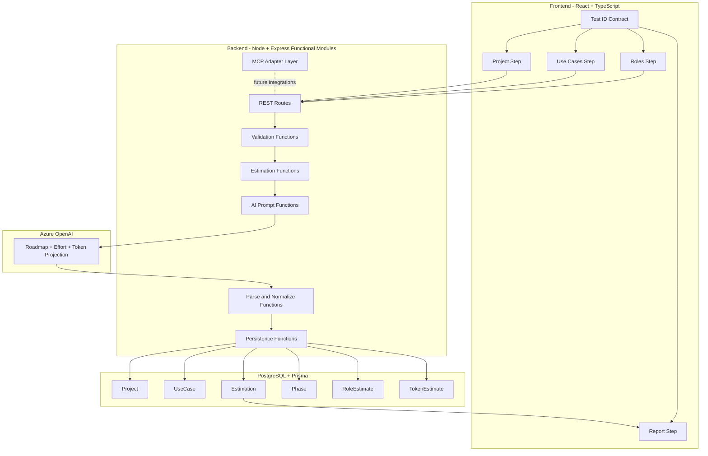

# Architecture Overview

## Architecture Goals

The MVP architecture is designed to be:

- clean and modular
- functional (no class-based services/controllers)
- testable end-to-end
- MCP-ready for future integrations
- simple enough to deliver quickly

---

## Core Style

ProjectScope AI uses a modular client-server architecture with a functional backend.

- Frontend SPA: React + TypeScript + Vite
- Backend API: Node.js + TypeScript + Express
- Data: PostgreSQL + Prisma
- AI: Azure OpenAI integration from backend only

### Functional Backend Rule

All backend code should be organized as pure functions and small function modules.

- no class-based controllers
- no class-based services
- no class-based repositories
- route handlers call composable functions
- business rules stay framework-agnostic

---

## High-Level Diagram

---

## Module Boundaries

### Frontend

- feature-first folder layout
- each step is a functional component
- API calls isolated in hooks/services functions
- presentation components avoid business logic

### Backend

- routes: HTTP mapping only
- validators: payload/schema checks
- use-case functions: orchestration
- ai functions: prompt creation and call wrapper
- parser functions: deterministic output normalization
- repository functions: persistence through Prisma
- mcp adapters: optional integration boundary for external tools

---

## MCP-Ready Design

MCP is included as an adapter boundary so integrations can be added without refactoring core logic.

Planned boundary:

- `integration/mcp/clients/*`
- `integration/mcp/tools/*`
- `integration/mcp/mappers/*`

Rules:

- MCP adapters can read/write through explicit contracts only
- domain/use-case functions never depend directly on MCP SDK details
- MCP failures must return safe errors and never break persistence consistency

---

## Frontend Test ID Strategy

To support future automation frameworks, all interactive and assertable UI elements must have stable test IDs.

Pattern:

- `psai-{screen}-{element}-{purpose}`

Examples:

- `psai-project-name-input`
- `psai-usecase-add-button`
- `psai-role-dev-checkbox`
- `psai-estimate-submit-button`
- `psai-report-total-cost`
- `psai-report-phase-item-0`

Guidelines:

- IDs must be deterministic and language-independent
- avoid IDs based on visual text copy
- keep IDs stable across style/layout changes

---

## API Boundaries

Core endpoints:

- `POST /projects`
- `GET /projects`
- `GET /projects/:id`
- `POST /projects/:id/estimate`

All endpoints must:

- validate request payloads before any side effect
- return explicit error formats
- keep AI/provider errors controlled and user-safe

---

## Runtime Flow

1. User completes project, use-case, and role steps in frontend.
2. Frontend submits payload through functional API layer.
3. Backend validates payload and executes estimation use-case function.
4. Prompt function builds constrained instruction set.
5. AI call executes and parser function normalizes output.
6. Persistence functions store estimation artifacts.
7. Frontend renders report using stable test IDs.

---

## Reliability Controls

- strict payload and output-contract validation
- deterministic parser normalization
- timeout and malformed-response handling
- no secret exposure to frontend
- critical flow covered by unit, integration, and E2E tests

---

## Evolution Path

After MVP validation:

1. async estimation jobs (queue + polling/websocket)
2. real token metering from provider usage metadata
3. MCP integrations (Jira/GitHub/Notion) through adapter layer
4. multi-tenant workspaces and auth layer
