# Arospe — Product Requirements Document (PRD)

Arospe is an **admin dashboard / backoffice** for an ecommerce operation. It is the internal
control panel where a team manages the data a store runs on: users and their permissions, a
blog, a product catalog, tax rules tied to sales regions, and shipping carriers and rates.

**Scope boundary — backoffice only.** This PRD covers the admin panel exclusively. There is
**no public storefront, cart, or checkout UI** in scope here — only the administration of the
data a future storefront would consume. Where a scenario mentions "the checkout" or "a
customer", it is describing *why* a piece of admin data exists, not a screen this project
builds.

**Tech stack (current + planned).** Laravel 13, Livewire 4, MySQL, Tailwind CSS v4, Flux UI.
Authentication (registration, login, 2FA, passkeys) is already implemented via Laravel Fortify
and is **out of scope** for this PRD — this document only concerns what happens *after* login.
`spatie/laravel-permission` is installed and migrated but not yet wired to the domain; Epic 1
wires it up. Redis-backed cache is a **stated technical requirement, not yet implemented**
(see [Assumptions](#assumptions--confirmed-decisions)).

This PRD sits at product/requirements level (Gherkin scenarios + acceptance criteria per epic)
and feeds the project's Three Amigos process for individual tasks. It is **not** a technical or
schema design — data models, migrations, and component contracts are decided per task inside
that process. For current-state technical grounding, see the documentation index at
[`docs/README.md`](../README.md).

---

## Table of Contents

- [Assumptions & confirmed decisions](#assumptions--confirmed-decisions)
- [Design reference & the dashboard shell](#design-reference--the-dashboard-shell)
- [Cross-cutting: global search & notifications](#cross-cutting-global-search--notifications)
- [Epic 1 — Users, Roles & Permissions](#epic-1--users-roles--permissions)
- [Epic 2 — Products, Taxes & Sales Regions, Shipping](#epic-2--products-taxes--sales-regions-shipping)
  - [2.1 Sales Regions & Taxes](#21-sales-regions--taxes)
  - [2.2 Products](#22-products)
  - [2.3 Shared Media Gallery](#23-shared-media-gallery)
  - [2.4 Shipping](#24-shipping)
  - [2.5 Payment Methods (Store Settings)](#25-payment-methods-store-settings)
- [Epic 3 — Customers & Orders](#epic-3--customers--orders)
  - [3.1 Customers](#31-customers)
  - [3.2 Orders](#32-orders)
- [Epic 4 — Blog](#epic-4--blog)
- [Epic 5 — Internationalization](#epic-5--internationalization)
- [Roadmap & priority reasoning](#roadmap--priority-reasoning)
- [Out of scope](#out-of-scope)
- [Open questions for the user](#open-questions-for-the-user)

---

## Assumptions & confirmed decisions

These decisions were confirmed with the product owner before this PRD was written. They explain
why several epics **deliberately extend or diverge from the Claude-Design prototype** — the
prototype is the visual/UX reference, not the final data model.

1. **Backoffice only.** No public storefront, cart, or checkout is built here. The admin panel
   manages the data; a future, separate storefront consumes it.
2. **Auth is done and out of scope.** Fortify already provides registration/login/2FA/passkeys.
   This PRD starts at the authenticated dashboard.
3. **Permissions come first and are dynamic.** Epic 1 wires the already-installed
   `spatie/laravel-permission` to the `User` model and adds full **create/edit/delete of custom
   roles** with granular per-module permissions — beyond the prototype's flat role dropdown.
   Every other epic depends on permissions existing, so Epic 1 is built first.
4. **Sales Regions and Shipping zones are two independent catalogs.** Do not merge them. The
   fiscal regions (the ISO country list, plus — for Spain — Península / Baleares / Canarias /
   Ceuta / Melilla) used for tax are a separate concept from the shipping zones used for
   carrier rates.
5. **A tax rule *is* a Sales Region entry.** There is no separate parallel "tax rule" list.
   Each Sales Region catalog entry (a country — and for Spain, its special fiscal territories:
   Península, Baleares, Canarias, Ceuta, Melilla) carries its own **rate, description, and
   code**. Managing sales regions *is* managing tax rates. This lives as its own section inside
   the Taxes area (not a separate top-level sidebar item, not free text inside a modal). This
   is the biggest deliberate divergence from the prototype's flat per-country list.
6. **The region catalog is fixed/seeded, not admin-creatable from scratch.** Seed it with the
   standard ISO country list and, for Spain, its special fiscal territories (because Canarias,
   Baleares, Ceuta and Melilla have different tax treatment than mainland Spain). Admins
   configure rate/description/status on existing seeded entries and flag exactly one as the
   **default**; they do not invent new countries. **Every catalog entry is a single country, or
   one of Spain's five fiscal territories — there are no supranational or catch-all "grouping"
   entries** (confirmed with the product owner on 2026-08-18 during Epic 2's Three Amigos
   debate: no seeded data records which countries belong to such a grouping, so a grouping could
   only ever be matched by hand, which defeats its purpose).
7. **Exactly one default tax rule.** Used as the fallback rate whenever a product's assigned
   region has no matching entry.
8. **Products have their own category taxonomy (full CRUD)**, separate from the blog's
   taxonomy — the prototype's flat dropdown becomes a managed list.
9. **Product variants are configurable.** Variant *attribute types* (e.g. Size, Color,
   Material) and their values are admin-defined — not a hardcoded Size/Color pair. Each variant
   is a combination of attribute values with its own SKU, price, and stock, and may optionally
   have its own featured image (inheriting the parent's if unset). This extends the prototype's
   flat SKU/price/stock.
10. **Single currency: EUR.** No multi-currency.
11. **Local file storage, multi-format images.** Uploaded media lives on the local server disk
    (`storage/app/public`). No cloud storage (S3, etc.) this phase. Every uploaded image keeps
    its original format (`.png` / `.jpg` / `.jpeg`) and the system additionally generates and
    stores `.webp` and `.avif` variants of the same image.
12. **Shipping matches the prototype almost as-is for carriers and rate rules:** carriers with
    enable/disable toggle, and per-carrier rate rules by shipping zone + weight range + price +
    delivery estimate. **No real carrier API** — no live tracking, no label generation; manual
    configuration only. **The shipping zone catalog itself diverges from this** — see
    [2.4 Shipping](#24-shipping) for the confirmed admin-editable zone catalog and its seeded
    three-level geography backing (countries / comunidades autónomas / municipios).
13. **Blog gets categories (full CRUD) and tags (full CRUD + create-on-the-fly from the post
    editor).** A post has one category and multiple tags. Both taxonomies are distinct from the
    product category taxonomy. This extends the prototype, which had a fixed category dropdown
    and no tags.
14. **Two independent i18n layers.** (a) An **admin UI language switcher** (Spanish/English
    only) via standard Laravel localization (`lang/`, greenfield — no `lang/` exists yet). (b)
    **Store Languages**: an admin-managed set of content-authoring languages that surface as
    **tabs** for translatable fields. Translatable content covers product title/description,
    post title/body, slug/SEO fields, and category/tag names; the store default is Spanish on
    install and can later be changed to any active store language, independent of the UI language.
15. **Global search and the notifications bell are functional**, not decorative. Search spans
    users, products, and blog posts. Notifications fire for four confirmed events: low/zero
    stock, new customer, new order, and blog post published/going live.
16. **Customers and Orders are backoffice-managed entities**, separate from the admin
    Users/Roles system. Customers cannot log into the dashboard (no customer portal this phase).
    Orders/customers originate from an out-of-scope external/future channel or manual admin
    entry; the panel only manages that data once it exists.
17. **No audit / change-history log** this phase (possible future enhancement only).
18. **Redis cache is a technical requirement, not yet implemented.** `.env` currently uses
    `CACHE_STORE=database` and no Redis/Predis package is installed. Moving cache to Redis is
    part of this initiative's technical scope; it is flagged here as an assumption so it is not
    forgotten, but it carries no user-facing acceptance criteria in the functional epics below.
19. **UUID (v7) primary keys on seven entities.** These use a **UUID as their sole primary key**,
    generated by Laravel 13's native `HasUuids` trait — which defaults to **time-ordered UUIDv7**
    (not random v4), applied at **both** the migration/schema level and the Eloquent model level
    (`use HasUuids;` on each model): `users` (Epic 1), Products, Product Variants, Product
    Categories (Epic 2), and Blog Categories, Blog Tags, Blog Posts (Epic 4). The UUID **replaces**
    the primary key entirely — no dual-column pattern (no internal `bigint` autoincrement kept
    alongside a public UUID), matching this project's simple/explicit migration style. **Not
    ULID**: `HasUuids`' UUIDv7 is already time-ordered, solving the same MySQL index-locality
    concern ULID would address while staying a literal UUID. Six of the seven are greenfield
    (created with a UUID PK from day one); **`users` is the exception** — it already exists as a
    `bigint` autoincrement table, so this is a breaking alteration-with-backfill migration (see the
    Epic 1 note below), not yet implemented. This is a documentation-only decision; the actual
    migrations/models are written during each epic's TDD implementation.

---

## Design reference & the dashboard shell

> **Style guide only — not code to port.** Everything under
> [`docs/arospe-handoff/`](../arospe-handoff/) (the static HTML/CSS/JS Claude-Design bundle)
> exists **only as a visual/UX reference** — a style guide for layout, spacing, colors, and
> interaction patterns. **None of that HTML/CSS/JS is ported as-is.** The real implementation
> must be built entirely in **Livewire, Blade, and Laravel**, following this project's existing
> conventions ([`docs/conventions/`](../conventions/)) — never by adapting the prototype's
> markup or vanilla JS directly.

The visual and interaction reference is the static Claude-Design prototype at
[`docs/arospe-handoff/project/`](../arospe-handoff/project/) (`index.html`, `usuarios.html`,
`productos.html`, `blog.html`, `impuestos.html`, `envios.html`). Reuse its patterns: the
persistent left sidebar, the topbar with title/subtitle + search + notifications, the
list-then-editor pattern, status **badges**, **modals** for quick create/edit, the shared
**media gallery**, and the **WYSIWYG toolbar** (Bold, Italic, Underline, H2, bullet list,
numbered list, link, Insert image). The prototype UI is Spanish-labeled, which matches the
dashboard's Spanish locale option.

Every image uploaded through the shared media gallery is stored in **multiple formats**: the
original `.png` / `.jpg` / `.jpeg` is kept, and `.webp` and `.avif` variants are generated
alongside it (see [2.3 Shared Media Gallery](#23-shared-media-gallery)).

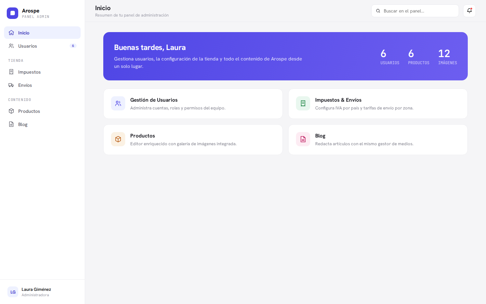
*Home: a hero greeting, three stat counters (users / products / media images), and quick-access
cards to each module. The left sidebar groups navigation into **Inicio**, **Usuarios**,
**TIENDA** (Impuestos, Envíos) and **CONTENIDO** (Productos, Blog), with the signed-in user
pinned at the bottom.*

**The sidebar shown above is only a starting visual example, not the final navigation.** The
real dashboard's sidebar must add sections/links for everything the prototype does not cover:
**Roles & Permissions** (Epic 1), **Payment Methods** (Epic 2), **Customers** and **Orders**
(Epic 3), and **Store Languages settings** (Internationalization, Epic 5). Do not assume the
final nav is limited to the prototype's four groups.

Treat the prototype as the real styling reference but **not** the final scope. Wherever a
requirement below goes beyond it, this document says **"extends the prototype"** so nobody
mistakes the mockup for the deliverable.

---

## Cross-cutting: global search & notifications

The topbar (visible on every screen in the prototype) carries a global search field
("Buscar en el panel…") and a notifications bell. Both are **in scope and functional**.

```gherkin
Feature: Global panel search

  Scenario: Global search returns matches across modules
    Given a signed-in administrator with access to all modules
    When they search the panel for "runner"
    Then they see results grouped by users, products, and blog posts that match "runner"

  Scenario: Opening a search result navigates to its record
    Given a signed-in administrator viewing global search results for "runner"
    When they select one of the results
    Then they are taken to that record's edit view

  Scenario: Global search hides results the administrator may not view
    Given a blog editor without permission to view products
    When they search the panel for a term that matches a product
    Then no product results are shown
    And only results from modules they may view are returned

  Scenario: Global search shows an empty state when nothing matches
    Given a signed-in administrator
    When they search the panel for a term that matches nothing
    Then they see an empty-state message instead of a results list
```

The bell generates notifications for exactly these **confirmed** events (this is the final
list, not a proposal):

- **Low or zero stock** on a product or a variant.
- **New customer created** (a store end-customer record — see
  [Epic 3](#epic-3--customers--orders) — not a new dashboard admin user).
- **New order received** (see [Epic 3](#epic-3--customers--orders)).
- **Blog post published**, or a **scheduled post going live**.

```gherkin
Feature: Notifications bell

  Scenario: The bell shows an unread indicator
    Given a signed-in administrator with at least one unread notification
    When they view the topbar
    Then the notifications bell shows an unread indicator

  Scenario: Reading notifications clears the unread indicator
    Given a signed-in administrator whose notifications bell shows an unread indicator
    When they open and read their notifications
    Then the unread indicator is cleared

  Scenario Outline: A confirmed event generates a notification
    Given a signed-in administrator
    When <event> occurs
    Then a corresponding notification is surfaced on their bell

    Examples:
      | event                                                  |
      | a product or variant reaches low or zero stock         |
      | a new customer is created                              |
      | a new order is received                                |
      | a blog post is published or a scheduled post goes live |

  Scenario: An unrelated change does not generate a notification
    Given a shipping administrator editing a shipping rate's delivery estimate
    When they save that change
    Then no notification is generated, because it is not one of the confirmed events
```

**Acceptance criteria**

- [ ] Global search queries at least users, products, and blog posts and groups results by type.
- [ ] Search results are filtered by the current user's module permissions.
- [ ] An explicit empty state is shown when nothing matches.
- [ ] The bell displays an unread indicator and clears it once notifications are read.
- [ ] Notifications are generated for exactly the four confirmed events (low/zero stock, new
      customer, new order, blog post published or going live) and not for other events.
- [ ] Both controls are present on every authenticated screen, matching the prototype topbar.

---

## Epic 1 — Users, Roles & Permissions

**Priority: 1 (foundation — build first).** Everything else gates on permissions existing.
This epic wires `spatie/laravel-permission`'s `HasRoles` trait onto `User` (currently imported
but not attached — see [`docs/architecture/authorization.md`](../architecture/authorization.md))
and builds the management UI on top of it.

Two capabilities: (a) the **Users** screen from the prototype — list users, create/edit them in
a modal, assign a role and a status; and (b) a **Roles & Permissions** management area
(*extends the prototype*, which only had a static role dropdown).

The user **status** (Activo / Inactivo / Suspendido) is **not** a purely informational label: a
non-*Activo* status must actually **block that user from logging into the dashboard**,
integrated with the existing Fortify auth flow (see
[`docs/architecture/authentication.md`](../architecture/authentication.md)).

> **Technical note — `users` primary key becomes a UUID (v7).** Per
> [assumption 19](#assumptions--confirmed-decisions), `users` moves to a UUIDv7 primary key via
> Laravel's `HasUuids` trait. `users` is the **only** one of the seven UUID entities that already
> exists in real, migrated code (today a `bigint` autoincrement), so this is a **breaking
> alteration-with-backfill migration, not a fresh `create_table`** — and it cascades to three
> real dependents that must be retyped in step: `passkeys.user_id`, `sessions.user_id`, and
> `spatie/laravel-permission`'s polymorphic `model_has_roles` / `model_has_permissions`
> (`model_id` / morph-key column, with `config/permission.php`'s `model_morph_key` renamed per the
> package's guidance for non-integer-keyed models). Whoever implements Epic 1 should expect real
> migration work here — this is **not** yet implemented and is called out so it's no surprise.

In the Roles & Permissions management area, admins create, edit, and delete custom roles and
toggle **granular permissions per module**. The permission-gated modules cover every management
area across all five epics, plus settings:

- **Users & Roles**
- **Products** (with categories & variants)
- **Sales Regions & Taxes**
- **Shipping**
- **Payment Methods**
- **Customers**
- **Orders**
- **Blog** (with categories & tags)
- **Store Languages** (Internationalization settings)

**Super Admin role.** Exactly **one Super Admin role** exists in the system. It is
**categorically undeletable, uneditable, and cannot be downgraded** — not merely "the last of
its kind", it can never be modified or removed at all. It is assignable **only via direct
database access or a seeder**, never through the dashboard: it is **not** listed in the roles
list, **not** offered when assigning a user's role, and **not** editable anywhere in the
frontend. The Super Admin bypasses permission checks entirely.

**Managing roles at all is a gated permission.** The ability to create/edit/manage roles &
permissions is itself a permission, held by default by the Super Admin and by a seeded baseline
**"Administrator"** role. Other custom roles — such as "Blog Editor" — do **not** have it unless
the Super Admin explicitly grants it.

**A stricter, separate permission gates administrator-level management.** Deleting/editing
administrator-level roles, or downgrading administrator-level users, requires a distinct
**"manage administrator-level roles/users"** permission. **"Administrator-level" refers
specifically to the seeded baseline "Administrator" role** — no other custom role, however broad
its permissions, counts as administrator-level. By default **only the Super Admin** holds this
permission — not even the seeded "Administrator" role. The Super Admin may grant it to a role, but
it carries a meta-rule: **only the Super Admin can even see the option to grant it.** No other
administrator, however broad their permissions (even one holding the general "manage roles &
permissions" permission), ever sees or can grant that control.

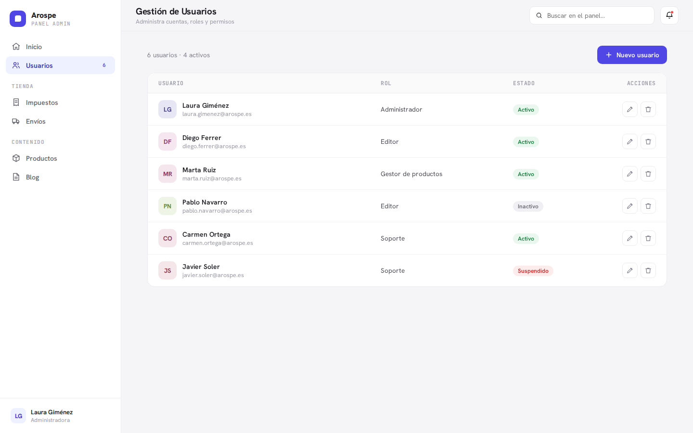
*Users list: avatar, name/email, assigned role, a status badge (Activo / Inactivo /
Suspendido), and per-row edit/delete actions. The section header shows a live count
("6 usuarios · 4 activos") and a primary "Nuevo usuario" button.*

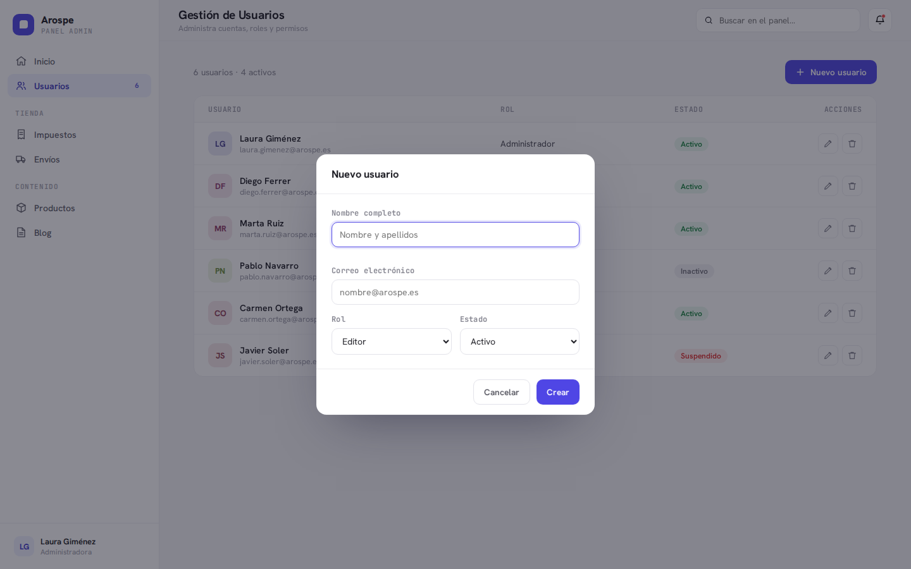
*Create/edit user modal: full name, email, a **Rol** select populated from the dynamic roles,
and a **Estado** select. This is where a user is assigned one of the roles managed in the
Roles & Permissions area.*

### Gherkin — Users

```gherkin
Feature: User management

  Scenario: Create a user with a role and status
    Given a user administrator, with at least one role available
    When they create a user with a name, a unique email, a role, and a status
    Then the new user appears in the users list with that role and a status badge

  Scenario: Creating a user with a duplicate email is rejected
    Given a user administrator, with an existing user whose email is "marta.ruiz@arospe.es"
    When they try to create another user with the email "marta.ruiz@arospe.es"
    Then creation is rejected with a validation message
    And no second user is created

  Scenario: Change a user's role
    Given a user administrator, with a user "Diego Ferrer" holding the role "Editor"
    When they change that user's role to "Administrador"
    Then the user's role is updated in the list

  Scenario: Deleting a user soft-deletes the record
    Given a user administrator, with an existing user "Diego Ferrer"
    When they delete that user
    Then the user is soft-deleted (marked deleted, not physically removed) so
      historical references are preserved
    And the user no longer appears in the active users list

  Scenario: A regular administrator cannot delete a user holding the "Administrator" role
    Given an administrator without the "manage administrator-level roles/users" permission
    When they try to delete another user who holds the seeded "Administrator" role
    Then the action is denied server-side

  Scenario: A regular administrator cannot downgrade a user holding the "Administrator" role
    Given an administrator without the "manage administrator-level roles/users" permission
    When they try to downgrade another user who holds the seeded "Administrator" role
    Then the action is denied server-side

  Scenario Outline: A non-active user cannot sign in
    Given a user whose status is "<status>"
    When that user tries to sign in
    Then sign-in is refused and no session is granted
    And they are told the account is not active

    Examples:
      | status     |
      | Inactivo   |
      | Suspendido |

  Scenario: Reactivating a user restores sign-in
    Given a user who was blocked from signing in because their status was "Suspendido"
    When a user administrator sets that user's status back to "Activo"
    Then the user can sign in again on their next attempt
```

### Gherkin — Roles & Permissions (extends the prototype)

```gherkin
Feature: Dynamic roles and granular permissions

  Scenario: Create a custom role with scoped permissions
    Given a user administrator
    When they create a role "Blog Editor" granted only the Blog module permissions
    Then the role is saved with exactly those permissions
    And it becomes selectable when assigning a role to a user

  Scenario: A role limits its holder to the granted modules
    Given a blog editor whose role grants only Blog permissions
    When they sign in
    Then they can access the Blog module
    And they cannot access Users & Roles, Products, Sales Regions & Taxes, Shipping,
      Payment Methods, Customers, Orders, or Store Languages settings
    And the sidebar hides the modules they cannot access

  Scenario: "Blog Editor" cannot manage roles at all
    Given a blog editor whose role was not granted the "manage roles & permissions" permission
    When they look for the Roles & Permissions management area
    Then it is not available to them, and they cannot create, edit, or manage any role

  Scenario: Editing a role updates all of its holders
    Given a user administrator, with three users sharing the role "Blog Editor"
    When they remove the "delete blog content" permission from that role
    Then none of those three users can delete blog content afterwards

  Scenario: Deleting a role still assigned to users is hard-blocked with a count
    Given a user administrator, with the role "Blog Editor" assigned to 3 users
    When they try to delete the "Blog Editor" role
    Then deletion is always blocked (no confirm-and-proceed path)
    And the message states how many users hold it
      (e.g. "This role is assigned to 3 users and cannot be deleted")
    And they must reassign those users to another role before it can be deleted

  Scenario: Direct access without permission is denied server-side
    Given a blog editor without Products permissions
    When they navigate directly to a Products URL
    Then access is denied server-side, not merely hidden in the UI

  Scenario: The Super Admin role cannot be deleted
    Given a user administrator with role-management permission
    When they attempt to delete the Super Admin role
    Then it is impossible — the Super Admin role is categorically undeletable

  Scenario: The Super Admin role cannot be edited or downgraded
    Given a user administrator with role-management permission
    When they attempt to edit or reduce the Super Admin role's permissions
    Then it is impossible — the Super Admin role is categorically unmodifiable

  Scenario: The Super Admin role is invisible in the frontend
    Given a user administrator using the dashboard
    When they view the roles list and the user role selector
    Then the Super Admin role appears in neither
    And it can be assigned only via direct database access or a seeder

  Scenario: Only the Super Admin sees the administrator-management grant option
    Given a signed-in Super Admin editing a role's permissions
    When they open that role's permission toggles
    Then they can see and toggle the "manage administrator-level roles/users" permission

  Scenario: A broad administrator never sees the administrator-management grant option
    Given an administrator who holds the general "manage roles & permissions" permission
      but is not the Super Admin
    When they edit a role's permissions
    Then the "manage administrator-level roles/users" toggle is not shown to them

  Scenario: The Super Admin grants a role administrator-management permission
    Given a signed-in Super Admin
    When they grant a custom role the "manage administrator-level roles/users" permission
    Then holders of that role can delete/edit the seeded "Administrator" role and
      downgrade users who hold it
```

**Acceptance criteria**

- [ ] `HasRoles` is attached to `User`; roles/permissions are enforced by middleware/policies,
      not just hidden in the UI.
- [ ] `users` uses a UUID (v7) primary key via Laravel's `HasUuids` trait, applied at both the
      migration and Eloquent model level, replacing the current `bigint` PK — a breaking
      alteration-with-backfill migration that also retypes `passkeys.user_id`, `sessions.user_id`,
      and the `spatie/laravel-permission` polymorphic morph-key (with `model_morph_key` updated).
- [ ] Admins can create, edit, and delete custom roles and toggle granular permissions per
      module across all epics: Users & Roles, Products (categories & variants), Sales Regions &
      Taxes, Shipping, Payment Methods, Customers, Orders, Blog (categories & tags), and Store
      Languages settings.
- [ ] The Users screen lists, creates, edits, and soft-deletes users with a role and a status,
      matching the prototype (list + modal, live count, status badges).
- [ ] Users are **soft-deleted** (marked deleted, not physically removed) to avoid orphaning
      historical references.
- [ ] A non-*Activo* status (Inactivo / Suspendido) blocks that user from logging into the
      dashboard, enforced within the Fortify auth flow; restoring *Activo* restores login.
- [ ] Email is unique and validated; duplicate emails are rejected.
- [ ] Exactly one **Super Admin** role exists; it is categorically undeletable, uneditable, and
      cannot be downgraded, is assignable only via direct DB access or a seeder, is invisible in
      the roles list and user role selector, and bypasses permission checks.
- [ ] Deleting/editing the seeded "Administrator" role or downgrading users who hold it
      ("administrator-level" = specifically that seeded role, no other custom role) requires the
      distinct "manage administrator-level roles/users" permission — held by default only by the
      Super Admin; only the Super Admin can see the control to grant it to a role.
- [ ] Managing roles at all requires a "manage roles & permissions" permission, held by default
      by the Super Admin and a seeded baseline "Administrator" role, and by no other role unless
      granted.
- [ ] The sidebar and every module gate visibility and access on the current user's permissions.
- [ ] A role in use cannot be deleted (hard block, no confirm-and-proceed); the message states
      how many users hold it, and the admin must reassign those users to another role first.

---

## Epic 2 — Products, Taxes & Sales Regions, Shipping

**Priority: 2 (the store core).** The commerce data a future storefront runs on. Split into
three closely related areas below.

### 2.1 Sales Regions & Taxes

This is the **biggest deliberate divergence from the prototype**. In the prototype, Taxes is a
flat, freely-created per-country list with no default flag and no region catalog. Here, a **tax
rule *is* a Sales Region entry**: the region catalog is the single source of truth, each entry
carries its own rate/description/code, exactly one entry is flagged default, and the catalog is
**seeded and fixed** (admins configure existing entries, they don't invent countries). Every
entry is an **individual country**, or one of Spain's five fiscal territories — the catalog has
**no supranational or catch-all grouping entries**, per
[assumption 6](#assumptions--confirmed-decisions).

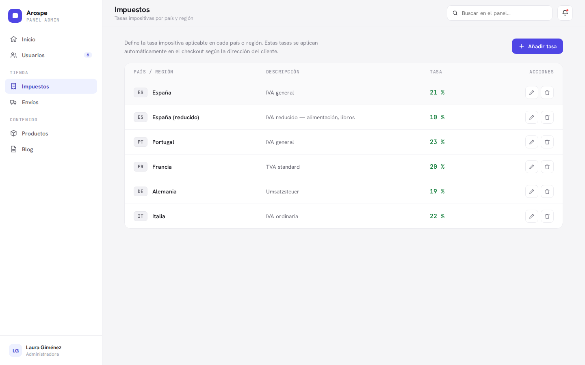
*Prototype Taxes list: country/region code chip, name, description, and rate %, with edit/delete
per row. **This PRD extends it**: the flat editable country list becomes the seeded Sales
Region catalog, gains a single "default" flag, and adds Spain's special fiscal territories
(Península, Baleares, Canarias, Ceuta, Melilla) as distinct entries.*

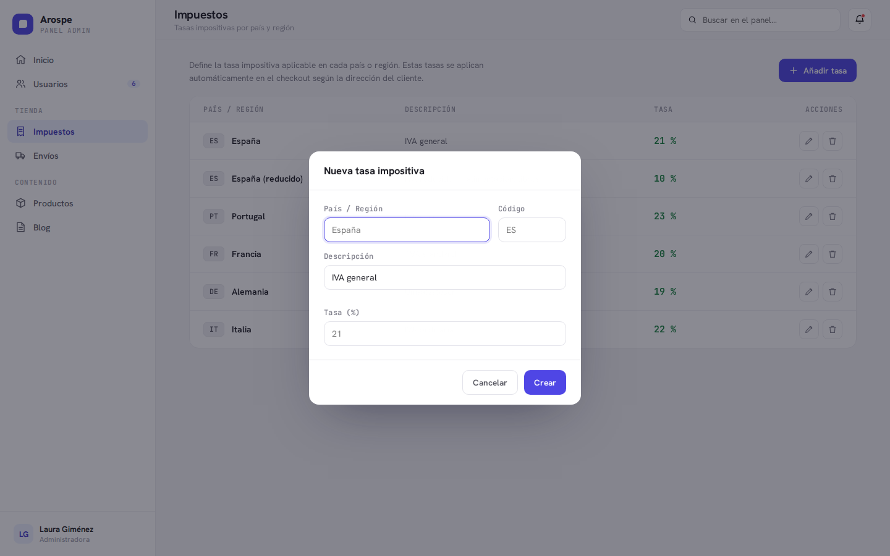
*Prototype create/edit tax modal: País/Región, Código, Descripción, Tasa (%). **This PRD
extends it**: the entry is chosen from the seeded catalog rather than typed free-form, and the
modal edits the rate/description/status of an existing region entry.*

```gherkin
Feature: Sales Regions and their tax rates

  Scenario: Configure the tax rate on a seeded region entry
    Given a tax administrator, with the Sales Region catalog seeded with countries
      and Spain's fiscal territories (Península, Baleares, Canarias, Ceuta, Melilla)
    When they set the rate, description, and code on the "Canarias" entry
    Then the "Canarias" entry is saved with that rate and shown in the list

  Scenario: Marking a new default clears the previous one
    Given a tax administrator, with "España (Península)" flagged as the default entry
    When they mark "Francia" as the default
    Then "Francia" becomes the only default entry
    And "España (Península)" is no longer the default

  Scenario: Disabling the current default region is blocked unless a new default is set
    Given a tax administrator, with "España (Península)" as the current default entry
    When they try to disable/deactivate "España (Península)" without setting another default
    Then the action is blocked so the catalog never ends up with zero default entries
    And disabling it is only allowed when another entry is simultaneously set as the new default

  Scenario: The catalog does not allow inventing new countries
    Given a tax administrator viewing the seeded, fixed Sales Region catalog
    When they look for a way to add a brand-new country from scratch
    Then no such option exists, and only seeded entries can be configured or enabled/disabled

  Scenario: Spain exposes its fiscal sub-territories as separate entries
    Given a tax administrator viewing Spain in the Sales Region catalog
    When they expand Spain's entries
    Then Península, Baleares, Canarias, Ceuta, and Melilla appear as
      distinct, separately-configurable entries

  Scenario: The default rate applies when no region matches
    Given a tax administrator has flagged one region entry as the default
    And a product assigned to no region entry matching a given destination
    When the applicable tax rate for that destination is resolved
    Then the default entry's rate is used

  Scenario Outline: An invalid tax rate is rejected
    Given a tax administrator editing a region entry
    When they enter <invalid_rate> as the tax rate
    Then the change is rejected with a validation message

    Examples:
      | invalid_rate        |
      | a negative value    |
      | a non-numeric value |
```

**Acceptance criteria — Sales Regions & Taxes**

- [ ] The Sales Region catalog is seeded from the ISO country list plus Spain's five fiscal
      territories — individual entries only, **no grouping entries** — and lives as a section
      **inside the Taxes area** (not a top-level sidebar item).
- [ ] Each entry carries its own rate, description, and code; admins configure existing entries
      and can enable/disable them, but cannot create new countries from scratch.
- [ ] Exactly one entry is the default at all times; setting a new default clears the old one.
- [ ] The current default entry cannot be disabled/deactivated unless another entry is
      simultaneously set as the new default — the catalog never has zero defaults.
- [ ] Rate resolution for a product+address uses the matching region entry, falling back to the
      default when no match exists.
- [ ] Rate validation rejects negative/non-numeric values.
- [ ] Sales Regions (fiscal) and Shipping zones are kept as two independent catalogs.

### 2.2 Products

The prototype's list + editor pattern stays. **Extensions:** a managed product **category
taxonomy** (full CRUD, separate from blog), configurable **product variants**, and a required
**product type** — each product is either **physical** or **virtual** (digital). The product
type drives how an order resolves its tax Sales Region (see
[3.2 Orders](#32-orders)). Currency is EUR only; images come from the shared media gallery
documented in [2.3 Shared Media Gallery](#23-shared-media-gallery) (stored locally, in multiple
formats).

> **Technical note — UUID (v7) primary keys.** **Products, Product Variants, and Product
> Categories** each use a UUID (v7) primary key via Laravel's `HasUuids` trait (see
> [assumption 19](#assumptions--confirmed-decisions)). All three are greenfield tables, created
> with the UUID PK from day one — no migration complexity beyond declaring it. Not yet
> implemented; this lands during Epic 2's TDD work.

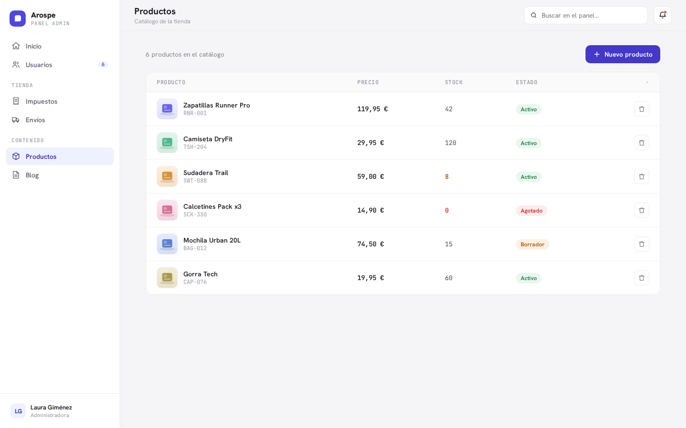
*Products list: thumbnail, name + SKU, price, color-coded stock (low / out-of-stock), and a
status badge (Activo / Borrador / Agotado), with a primary "Nuevo producto" action.*

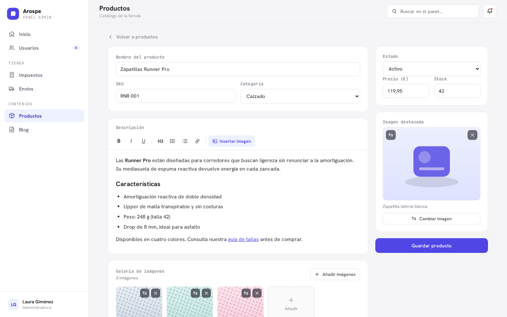
*Product editor: name, SKU, category select, a WYSIWYG description (Bold/Italic/Underline/H2/
lists/link/Insert image), an image gallery strip, and a right-hand side panel for status, price
(€), stock, and the featured image. **Extends the prototype**: the category select is backed by a
managed taxonomy, and variants add per-combination SKU/price/stock/image.*

```gherkin
Feature: Product catalog

  Scenario: Create a product with core fields
    Given a catalog administrator
    When they create a product with a name, a unique SKU, a category, a product type
      (physical or virtual), an EUR price, stock, a status, a WYSIWYG description, and
      a featured image
    Then the product appears in the products list with its status badge

  Scenario Outline: A duplicate SKU is rejected
    Given a catalog administrator, with an existing product using SKU "RNR-001"
    When they try to save <record> with the SKU "RNR-001"
    Then saving is rejected with a validation message

    Examples:
      | record          |
      | another product |
      | a variant       |

  Scenario: Selecting Spain surfaces its fiscal sub-entries in the region picker
    Given a catalog administrator editing a product, with the Sales Region catalog seeded
    When they select "Spain" in the product's region picker
    Then Spain's fiscal sub-entries (Península, Baleares, Canarias, Ceuta, Melilla)
      are surfaced as selectable options

  Scenario: Assign a product to several sales regions
    Given a catalog administrator editing a product, with the Sales Region catalog seeded
    When they assign the product to Península, Canarias, and France
    Then the product is associated with all three selected regions

  Scenario: A product's tax uses its assigned region's rate
    Given a catalog administrator, with a product assigned to the "Canarias" region entry
    When the tax rate for that product in Canarias is resolved
    Then the "Canarias" entry's rate is used
```

```gherkin
Feature: Product categories (extends the prototype)

  Scenario: Create a product category
    Given a catalog administrator
    When they create a product category named "Footwear"
    Then it appears in the product editor's category selector

  Scenario: Rename a product category
    Given a catalog administrator, with a product category "Footwear"
    When they rename it to "Running shoes"
    Then the category is shown with its new name wherever it is used

  Scenario: Delete an unused product category
    Given a catalog administrator, with a product category "Footwear" assigned to no products
    When they delete "Footwear"
    Then it no longer appears in the product editor's category selector

  Scenario: Product categories are independent from blog categories
    Given a catalog administrator
    When they view the product category list
    Then it contains only product categories, separate from blog categories

  Scenario: Deleting a product category still in use is hard-blocked with a count
    Given a catalog administrator, with the category "Calzado" assigned to 12 products
    When they try to delete "Calzado"
    Then deletion is always blocked (no confirm-and-proceed path)
    And the message states how many products use it
      (e.g. "This category is used by 12 products and cannot be deleted")
    And they must reassign those products' category before it can be deleted
```

```gherkin
Feature: Product variants (extends the prototype)

  Scenario: Define a product attribute type with values
    Given a catalog administrator
    When they define an attribute type "Size" with the values 38, 39, and 40
    Then "Size" and its values are available when building variants

  Scenario: Create a variant as an attribute combination
    Given a catalog administrator, with a product having the attribute types Size and Color
    When they generate the variant "Size 40 / Color Black"
    Then that variant has its own SKU, price, and stock

  Scenario: A variant without its own image inherits the parent's featured image
    Given a catalog administrator, with a variant that has no featured image of its own
    When the variant is displayed
    Then it inherits the parent product's featured image

  Scenario: A variant with its own image uses that image
    Given a catalog administrator, with a variant that has its own featured image
    When the variant is displayed
    Then its own featured image is used instead of the parent's

  Scenario: A duplicate attribute combination is rejected
    Given a catalog administrator, with the variant "Size 40 / Color Black" already on a product
    When they try to add the same combination again
    Then it is rejected as a duplicate
```

**Acceptance criteria — Products**

- [ ] Products support name, unique SKU, category, **product type (physical or virtual)**, EUR
      price, stock, status, WYSIWYG description, featured image, and a multi-image gallery, per
      the prototype list+editor. Product type is required.
- [ ] Product categories have full CRUD and are independent from blog categories; a category in
      use **cannot** be deleted (hard block, no confirm-and-proceed) and the message states how
      many products use it, requiring reassignment first.
- [ ] Variant attribute types and values are admin-configurable (not hardcoded); each variant
      combination has its own SKU/price/stock and an optional image that inherits the parent's.
- [ ] Duplicate SKUs and duplicate variant combinations are rejected.
- [ ] Products are assignable to one or more Sales Regions via a searchable multi-select where
      selecting Spain surfaces its fiscal sub-entries.
- [ ] Product and variant images come from the shared media gallery (see
      [2.3 Shared Media Gallery](#23-shared-media-gallery)).
- [ ] Products, Product Variants, and Product Categories each use a UUID (v7) primary key, via
      Laravel's `HasUuids` trait, applied at both the migration and Eloquent model level.

### 2.3 Shared Media Gallery

The shared media gallery is a modal reused by **both** Products and Blog for choosing and
uploading images. Its behavior is taken directly from the prototype's `openGallery()` (in
[`docs/arospe-handoff/project/js/common.js`](../arospe-handoff/project/js/common.js)) and the
screenshot below. It supports two selection modes — **single-select** (used for a featured
image or a single inline insertion) and **multi-select** (used to add several images to a
product/post gallery at once) — plus title/description search and two upload paths (file picker
and drag-and-drop). Per [assumption 11](#assumptions--confirmed-decisions), every upload is
stored locally and generates `.webp` and `.avif` variants alongside the kept original.

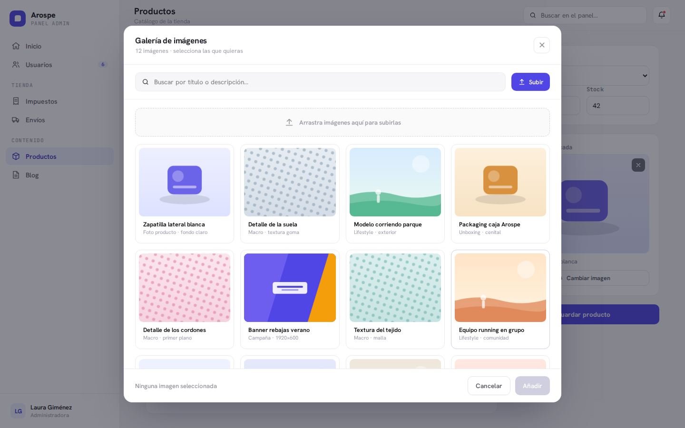
*Shared media gallery modal (reused by Products and Blog): search by title/description, a
drag-and-drop dropzone plus a "Subir" file picker, and selectable tiles. The footer shows the
selection count and the insert/add action ("Añadir" in multi-select).*

```gherkin
Feature: Shared media gallery

  Scenario: Search filters the gallery by title or description
    Given a catalog administrator with the media gallery open
    When they search the gallery for a title or description keyword
    Then only images whose title or description match are shown

  Scenario: The gallery shows an empty state when a search matches nothing
    Given a catalog administrator with the media gallery open
    When they search the gallery for a keyword that matches no image
    Then a "no results" empty state is shown instead of tiles

  Scenario: Upload an image via the file picker
    Given a catalog administrator with the media gallery open
    When they choose an image file with the "Subir" file picker
    Then the image is added to the gallery as a selectable tile

  Scenario: Upload an image by drag-and-drop
    Given a catalog administrator with the media gallery open
    When they drop an image file onto the gallery dropzone
    Then the image is added to the gallery as a selectable tile

  Scenario: Uploading an image generates webp and avif variants
    Given a catalog administrator with the media gallery open
    When they upload a `.png` or `.jpg` image
    Then the original is kept and `.webp` and `.avif` variants are generated alongside it

  Scenario Outline: An invalid upload is rejected
    Given a catalog administrator with the media gallery open
    When they upload <invalid_file>
    Then the upload is rejected with an explanatory message

    Examples:
      | invalid_file                       |
      | a non-image file                   |
      | an image exceeding the size limit  |

  Scenario: Single-select mode stages exactly one image
    Given a catalog administrator picking a featured image in single-select mode
    When they select a second tile after already selecting one
    Then only the most recently selected image is staged for insertion

  Scenario: Multi-select mode stages several images at once
    Given a catalog administrator adding images in multi-select mode
    When they select several tiles and confirm with "Añadir"
    Then all selected images are staged and attached at once

  Scenario: Inserting an image inline from the WYSIWYG editor
    Given a blog editor with the WYSIWYG "insert image" action active
    When they insert a selected image from the gallery
    Then the image is placed inline in the description or body

  Scenario: Selecting an image in featured mode sets the featured image
    Given a catalog administrator choosing an image in featured mode
    When they use the selected image as the featured image
    Then it becomes the product's (or variant's) featured image
```

**Acceptance criteria — Shared Media Gallery**

- [ ] The gallery is a single shared component reused by both Products and Blog.
- [ ] It supports title/description search with an explicit empty state.
- [ ] It supports uploading via both a file picker and drag-and-drop onto a dropzone.
- [ ] Every uploaded image keeps its original `.png`/`.jpg`/`.jpeg` and additionally generates
      `.webp` and `.avif` variants; all are stored locally.
- [ ] Invalid uploads (non-image, over size limit) are rejected with a message.
- [ ] Single-select mode stages exactly one image; multi-select mode stages several at once.
- [ ] Featured mode sets the product's/variant's featured image; the editor "insert image"
      action places an image inline in the description/body.

### 2.4 Shipping

**Carriers and rate rules** match the prototype **almost as-is**: integrated carriers with an
enable/disable toggle, and per-carrier rate rules by shipping zone + weight range + price +
delivery estimate. **No carrier API integration** — configuration is manual.

The **shipping zone catalog** is the one part of this section that does *not* follow the
prototype: zones are **admin-created and fully editable**, built on top of a seeded geography
catalog, rather than a short fixed list of badges.

> **Deliberate divergence — the shipping zone catalog (decided 2026-08-17).** The prototype's zone
> badges (Península / Baleares / Canarias / Unión Europea…), and this document's own
> [assumption 12](#assumptions--confirmed-decisions) ("shipping matches the prototype almost
> as-is"), read as though shipping zones were a small **fixed** list. They are not. Confirmed with
> the product owner during **Epic 2's Three Amigos Phase 0 decomposition on 2026-08-17**, the zone
> catalog became a **full admin-CRUD catalog** over a **seeded, fine-grained geography catalog**.
> This is the same kind of deliberate, documented extension that
> [assumption 5](#assumptions--confirmed-decisions) records for Sales-Region-as-tax-rule: the
> prototype stays the visual reference, never the data model. Everything else in this section —
> carriers, rate rules, validation, and the no-carrier-API boundary — is unchanged.

**The seeded geography catalog.** Zones are assembled from a catalog seeded at three levels of
granularity:

- **All ISO countries** — the same country set the storefront would ever ship to.
- **Spain's 17 autonomous communities** (comunidades autónomas).
- **All ~8,100 Spanish municipalities** (municipios, INE granularity) — chosen deliberately over
  the coarser alternatives (the 52 provinces, or provincial capitals only), because carrier rates
  in Spain are commonly quoted at municipal level.

The catalog ships as a **CSV/JSON fixture bundled in this repository** (under `database/data/`),
sourced from INE data and chunk-seeded; no third-party package supplies it.

**A shipping zone is a named, admin-created group.** A zone bundles **one or more geography-catalog
entries at any level** — it can be as narrow as a handful of municipios ("Zona Norte") or as broad
as an entire country. Admins create, rename, and delete zones freely; the geography catalog beneath
them is seeded and fixed.

**The zone's geography picker is a searchable, server-side-filtered multi-select.** With ~8,100
municipios in the catalog, a plain `<select>` — and equally a client-side filter like the media
gallery's — does not scale: the picker queries the server as the administrator types and returns a
bounded, level-grouped result set. This is a **shared component**, the same one the product
editor's Sales Region picker uses (see [2.2 Products](#22-products)).

**This catalog stays genuinely independent from the Sales Region (fiscal) catalog**, reaffirming
[assumption 4](#assumptions--confirmed-decisions): **no merge and no shared table**, even though
both may ultimately read their country rows from the same bundled ISO-country source file. The two
model different things — a Sales Region carries a tax rate, a default flag, and Spain's *fiscal*
territories (Península, Baleares, Canarias, Ceuta, Melilla), which are neither ISO entities nor
autonomous communities; the shipping geography catalog carries autonomous communities and
municipios, which have no fiscal meaning. Editing one never affects the other.

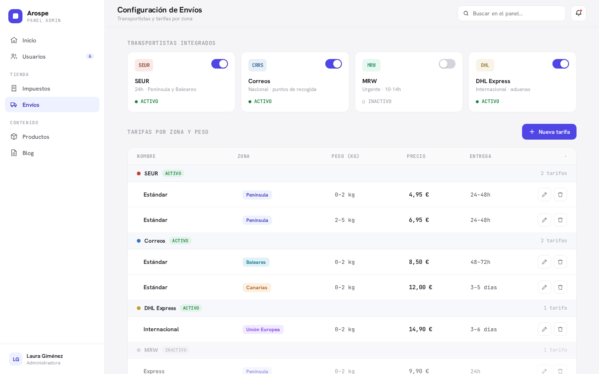
*Shipping screen: carrier cards (SEUR, Correos, MRW, DHL) each with an enable/disable toggle and
an Activo/Inactivo state, above a rate table grouped by carrier — each rate shows a name, a zone
badge (Península / Baleares / Canarias / Unión Europea…), a weight range (kg), a price, and a
delivery estimate.*

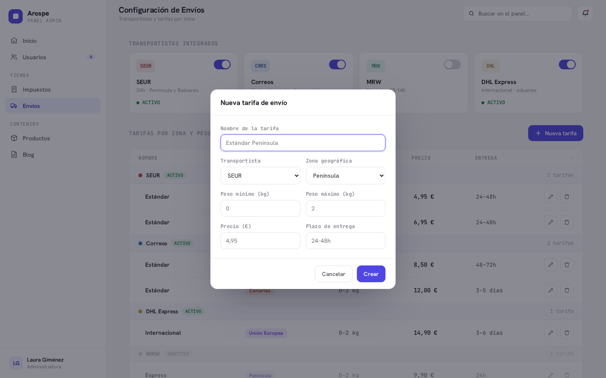
*New shipping rate modal: rate name, carrier select, geographic zone select, min/max weight
(kg), price (€), and a delivery-time estimate.*

```gherkin
Feature: Shipping zones (extends the prototype)

  Scenario: Create a shipping zone
    Given a shipping administrator
    When they create a shipping zone named "Zona Norte"
    Then "Zona Norte" appears in the shipping zone list

  Scenario: Rename a shipping zone
    Given a shipping administrator, with a shipping zone "Zona Norte"
    When they rename it to "Cornisa Cantábrica"
    Then the zone is shown with its new name wherever it is used

  Scenario: Delete a shipping zone no rate rule references
    Given a shipping administrator, with a shipping zone "Zona Norte" referenced by no rate rule
    When they delete "Zona Norte"
    Then it no longer appears in the shipping zone list
    And it is no longer offered in the shipping rate modal's zone selector

  Scenario Outline: Assign geography entries to a zone at any level
    Given a shipping administrator editing the shipping zone "Zona Norte",
      with the geography catalog seeded
    When they add <entry> to the zone
    Then the zone covers <entry>

    Examples:
      | entry                                        |
      | the country "Francia"                        |
      | the autonomous community "Galicia"           |
      | the municipios "Gijón", "Avilés" and "Siero" |

  Scenario: The geography picker filters as the administrator searches
    Given a shipping administrator editing a shipping zone, with the geography catalog seeded
      with every country, Spain's 17 autonomous communities, and its ~8,100 municipios
    When they type "Torrelav" into the zone's geography picker
    Then only catalog entries matching that text are offered, grouped by level

  Scenario: The geography picker shows an empty state when a search matches nothing
    Given a shipping administrator editing a shipping zone
    When they search the geography picker for a term that matches no catalog entry
    Then a "no results" empty state is shown instead of a list of entries

  Scenario: The geography catalog does not allow inventing new entries
    Given a shipping administrator editing a shipping zone
    When they look for a way to add a country, autonomous community, or municipio
      that the catalog does not contain
    Then no such option exists, and only seeded catalog entries can be added to a zone

  Scenario: Creating a shipping zone leaves the Sales Region catalog untouched
    Given a shipping administrator, with the Sales Region (fiscal) catalog seeded
    When they create the shipping zone "Zona Norte"
    Then "Zona Norte" appears only in the shipping zone list
    And no Sales Region entry, rate, or default flag is changed
```

> **Pending Phase 1 confirmation — not a locked decision.** Unlike every other scenario in this
> PRD, the single scenario below has **not** been confirmed with the product owner. Making shipping
> zones deletable raised a question the fixed-list design never had: what happens to a zone a rate
> rule still points at. The scenario states the **recommendation** — a hard block with a count,
> mirroring the established convention for product categories in
> [2.2 Products](#22-products) — so the Three Amigos debate for the shipping stories has something
> concrete to accept or reject. Treat it as a proposal until that debate resolves it; the
> alternative under consideration is blocking only until the affected rate rules are reassigned
> through a guided flow.

```gherkin
Feature: Deleting a shipping zone still in use (pending Phase 1 confirmation)

  Scenario: Deleting a shipping zone still referenced by a rate rule is hard-blocked with a count
    Given a shipping administrator, with the zone "Península" referenced by 7 SEUR rate rules
    When they try to delete "Península"
    Then deletion is always blocked (no confirm-and-proceed path)
    And the message states how many rate rules reference it
      (e.g. "This zone is used by 7 shipping rates and cannot be deleted")
    And they must reassign those rate rules' zone before it can be deleted
```

```gherkin
Feature: Shipping carriers and rates

  Scenario: Enable a carrier
    Given a shipping administrator, with the "MRW" carrier disabled
    When they enable the "MRW" carrier
    Then "MRW" is marked active and its rates become usable

  Scenario: Disable a carrier
    Given a shipping administrator, with the "MRW" carrier enabled
    When they disable the "MRW" carrier
    Then "MRW" is marked inactive

  Scenario: Create a rate rule for a carrier
    Given a shipping administrator, with the carrier "SEUR" active
    When they add a "Península" rate for SEUR covering 0–2 kg at 4,95 € with "24–48h" delivery
    Then the rate appears under SEUR in the grouped rate table

  Scenario Outline: An invalid shipping rate is rejected
    Given a shipping administrator creating a shipping rate
    When they submit it with <invalid_field>
    Then the rate is rejected with a validation message

    Examples:
      | invalid_field                             |
      | a minimum weight greater than the maximum |
      | a negative price                          |
```

**Acceptance criteria — Shipping**

- [ ] Carriers can be enabled/disabled with a toggle and show an active/inactive state.
- [ ] Rate rules are created/edited/deleted per carrier with zone, weight range, price (€), and
      delivery estimate, shown grouped by carrier as in the prototype.
- [ ] Weight range (min ≤ max) and non-negative price are validated.
- [ ] Shipping zones are a **full admin-CRUD catalog** — administrators create, rename, and delete
      zones freely; zones are not a fixed seeded list.
- [ ] A **geography catalog is seeded** at three levels — all ISO countries, Spain's 17 autonomous
      communities, and all ~8,100 Spanish municipios (INE granularity) — from a CSV/JSON fixture
      bundled in this repository (`database/data/`). Administrators cannot add entries to it.
- [ ] A shipping zone is a **named group bundling one or more geography-catalog entries at any
      level**; a zone may be as narrow as a few municipios or as broad as an entire country.
- [ ] The zone's geography picker is a **searchable, server-side-filtered multi-select** with a
      "no results" empty state — the same shared component the product editor's Sales Region picker
      uses. A client-side filter is explicitly insufficient at this dataset's size.
- [ ] Shipping zones and their geography catalog are kept **independent from the Sales Region
      (fiscal) catalog** per [assumption 4](#assumptions--confirmed-decisions): no merge and no
      shared table, even where both read country rows from the same bundled ISO-country file.
- [ ] _(Pending Phase 1 confirmation)_ Deleting a zone still referenced by a rate rule is hard-
      blocked, with a message stating how many rate rules reference it, requiring reassignment
      first — mirroring the product-category convention in [2.2 Products](#22-products).
- [ ] No external carrier API is called; all configuration is manual.

### 2.5 Payment Methods (Store Settings)

A store-settings screen where the admin configures which payment methods are available. **In
this phase, exactly one exists: bank transfer.** The bank transfer method has one configurable
field — an **IBAN** — where the admin enters the account customers must transfer payment to.
This ties to [Epic 3's Orders](#32-orders): an order's payment method references one of these
configured methods, which this phase is always bank transfer.

**No design prototype exists for this screen** — it should follow the existing card/list + edit
patterns already used for the Shipping carrier cards ([2.4 Shipping](#24-shipping)) or the Tax
rules list ([2.1 Sales Regions & Taxes](#21-sales-regions--taxes)).

```gherkin
Feature: Payment methods (store settings)

  Scenario: Bank transfer is the only payment method this phase
    Given a store administrator on the payment methods settings
    When they view the available payment methods
    Then bank transfer is the only method offered

  Scenario: Configure the bank transfer IBAN
    Given a store administrator on the payment methods settings
    When they set the bank transfer IBAN to a valid account IBAN
    Then the bank transfer method is saved with that IBAN

  Scenario: An invalid IBAN is rejected
    Given a store administrator on the payment methods settings
    When they enter an IBAN that fails IBAN-format validation
    Then the change is rejected with a validation message
```

**Acceptance criteria — Payment Methods**

- [ ] A store-settings screen lists the available payment methods; this phase, bank transfer is
      the only one.
- [ ] The bank transfer method exposes a single configurable IBAN field.
- [ ] The IBAN is validated for correct format; invalid values are rejected.
- [ ] An order's payment method references one of these configured methods (bank transfer this
      phase) — see [Epic 3 Orders](#32-orders).

---

## Epic 3 — Customers & Orders

**Priority: 3 (depends on Products / Taxes / Shipping existing first).** This epic was confirmed
after the notification-event list implied it (a "new customer" and a "new order" cannot be
notified about if the panel can't manage them). It gives the backoffice the ability to manage
store end-customers and their orders.

**No design prototype exists for this epic** — the Claude-Design handoff did not cover Customers
or Orders. The UI should follow the **same list + detail/editor visual patterns** established in
Users and Products (list with status badges, a detail/editor view, modals for quick create/edit,
the shared topbar).

**Boundary restatement (unchanged from the original scope).** There is still **no public
storefront or checkout** here. Orders and customers are assumed to **originate from an external
or future channel** — a future public storefront, a POS, or a manual admin-created record — that
is itself out of scope for this PRD. This epic covers only the backoffice's ability to **manage
that data once it exists**, including creating it manually when needed.

### 3.1 Customers

Customers are store end-customers, a **full CRUD entity entirely separate** from the
Users/Roles/Permissions system in Epic 1. **Critically, customers cannot log into the Arospe
dashboard at all** — there is no customer-facing auth or portal in this phase. A customer is a
purely admin-managed record: name, email, contact info, shipping/billing address, and a
read-only view of that customer's order history. Admins can create, edit, and **soft-delete**
customer records manually from the panel — deletion never physically removes the record, so a
customer's orders are never orphaned.

```gherkin
Feature: Customer management

  Scenario: Create a customer record manually
    Given a customer administrator
    When they create a customer with a name, email, contact info, and shipping/billing address
    Then the customer appears in the customer list
    And a "new customer created" notification is generated

  Scenario: A customer is not a dashboard user
    Given a customer administrator, with an existing customer record
    When they look for that customer among dashboard users, roles, and login accounts
    Then the customer has no dashboard login, no role, and no permissions
    And the customer cannot authenticate into the panel

  Scenario: View a customer's order history
    Given a customer administrator, with a customer who has one or more orders
    When they open that customer's detail view
    Then they see a read-only list of that customer's orders

  Scenario: A duplicate customer email is rejected
    Given a customer administrator, with an existing customer whose email is "cliente@example.com"
    When they try to create another customer with the email "cliente@example.com"
    Then creation is rejected with a validation message

  Scenario: Deleting a customer soft-deletes the record
    Given a customer administrator, with a customer who has at least one existing order
    When they delete that customer
    Then the customer is soft-deleted (marked deleted, not physically removed) so
      their orders are not orphaned
    And the customer no longer appears in the active customers list
```

**Acceptance criteria — Customers**

- [ ] Customers are a full-CRUD, admin-managed entity separate from Users/Roles/Permissions.
- [ ] Customers have **no** dashboard login, role, or permissions and cannot authenticate.
- [ ] A customer record holds name, email, contact info, and shipping/billing address, and shows
      a read-only order-history view.
- [ ] Customer email is validated; duplicates are rejected.
- [ ] Customers are **soft-deleted** (marked deleted, not physically removed) so their orders are
      never orphaned.
- [ ] Creating a customer generates the confirmed "new customer" notification.

### 3.2 Orders

Full order management from the backoffice: list and detail views, plus full editing. An admin
can edit line items, change the order status, and handle payment/refund state. An order
references: a **Customer**, one or more **Product/Variant line items** (each with a quantity and
the price at the time of order), the **Sales Region** used for tax resolution on that order, and
the **Shipping rate/carrier** selected for delivery.

**Sales Region resolution for tax.** How an order's Sales Region (which determines the tax rate)
is resolved depends on the order's **product type** (see [2.2 Products](#22-products)):

- **Physical** product → the Sales Region is resolved from the order's **shipping address**.
- **Virtual** (digital) product → the Sales Region is resolved from the **billing address**, and
  that billing address must first be **validated to match the purchaser's IP-address-derived
  location** (a geo/fraud check). If the billing country/region does **not** match the IP-derived
  location, the order is **flagged for manual review** rather than auto-resolving tax. *(Flagging
  for manual review is a conservative default chosen here — a reasonable safe behavior, not a
  re-ask; adjust if the business prefers hard-reject or hold.)*

**Order status vocabulary (explicit, standard e-commerce set):**
`Pendiente → Procesando → Enviado → Entregado`, plus `Cancelado` as a terminal state reachable
from earlier stages. **Payment/refund state** is tracked as a separate dimension:
`Pendiente de pago`, `Pagado`, `Reembolsado`, `Parcialmente reembolsado`.

The payment/refund field is a **manual admin-set status only** — it is **not** backed by any
payment gateway. The admin selects the state by hand; the panel performs no charge, capture, or
refund calls to a payment processor this phase (consistent with there being no public checkout).
The order's **payment method** references one of the configured methods from
[2.5 Payment Methods](#25-payment-methods-store-settings) — this phase, always bank transfer.

```gherkin
Feature: Order management

  Scenario: Open an order's detail
    Given an order administrator, with an existing order
    When they open that order's detail
    Then they see its customer, line items (product/variant, quantity, and price at
      time of order), the sales region used for tax, and the shipping rate/carrier

  Scenario: A new order generates a notification
    Given an order administrator, with a new order arriving from an external/future
      channel or created manually
    When the order lands in the backoffice
    Then a "new order received" notification is generated

  Scenario: Advance an order to the next status
    Given an order administrator, with an order in "Procesando"
    When they change its status to "Enviado"
    Then the order reflects the "Enviado" status

  Scenario Outline: Edit the line items of an open order
    Given an order administrator, with an order in "Pendiente" or "Procesando"
    When they <line_item_change>
    Then the order totals and tax recalculate accordingly

    Examples:
      | line_item_change              |
      | add a line item               |
      | remove a line item            |
      | change a line item's quantity |

  Scenario: Editing line items after an order has shipped is hard-blocked
    Given an order administrator, with an order already "Enviado" or "Entregado"
    When they attempt to edit its line items
    Then the edit is always blocked, with no confirmation path around it

  Scenario: Moving an order's status backward requires explicit confirmation
    Given an order administrator, with an order in "Enviado"
    When they move its status back to "Pendiente"
    Then they must explicitly confirm the action before it is applied
    And it is not flatly forbidden

  Scenario: Manually cancel an order in an early status
    Given an order administrator, with an order in "Pendiente" or "Procesando"
    When they set its status to "Cancelado"
    Then the order is marked cancelled

  Scenario Outline: Manual cancellation is blocked in guarded states
    Given an order administrator, with an order in "<status>"
    When they try to manually cancel it
    Then manual cancellation is blocked

    Examples:
      | status                   |
      | Enviado                  |
      | Entregado                |
      | Parcialmente reembolsado |

  Scenario: Fully refunding all line items auto-cancels the order
    Given an order administrator, with an order in any status, including "Enviado" or "Entregado"
    When every line item of the order becomes fully refunded (a 100%-refund event)
    Then the order automatically transitions to "Cancelado" as a system-triggered side effect
    And this is distinct from the manual cancel action, which stays blocked in those states

  Scenario: Record a full refund from a paid order
    Given an order administrator, with an order whose payment state is "Pagado"
    When they record a full refund
    Then the payment state becomes "Reembolsado"

  Scenario: Record a partial refund from a paid order
    Given an order administrator, with an order whose payment state is "Pagado"
    When they record a partial refund
    Then the payment state becomes "Parcialmente reembolsado"

  Scenario: A partially-refunded order can still be refunded
    Given an order administrator, with an order whose payment state is "Parcialmente reembolsado"
    When they record a further refund
    Then the refund is accepted

  Scenario Outline: The refund action is hidden in non-refundable payment states
    Given an order administrator, with an order whose payment state is "<state>"
    When they view the order
    Then the refund action does not render

    Examples:
      | state             |
      | Pendiente de pago |
      | Reembolsado       |

  Scenario Outline: The backend rejects a refund in a non-refundable payment state
    Given an order administrator, with an order whose payment state is "<state>"
    When a refund is attempted directly against the backend (bypassing the hidden UI control)
    Then the server rejects it, independently of the UI

    Examples:
      | state             |
      | Pendiente de pago |
      | Reembolsado       |

  Scenario: An order's payment method references a configured method
    Given an order administrator, with bank transfer configured as a payment method
    When they view an order's payment method
    Then it references a configured payment method, which is bank transfer this phase

  Scenario: A physical product's order resolves tax from the shipping address
    Given an order administrator, with an order for a physical product
    When the order's Sales Region is resolved for tax
    Then it is derived from the order's shipping address

  Scenario: A virtual product's order resolves tax from the validated billing address
    Given an order administrator, with an order for a virtual product whose billing
      address matches the purchaser's IP-derived location
    When the order's Sales Region is resolved for tax
    Then it is derived from the billing address

  Scenario: A virtual product's mismatched billing address is flagged for review
    Given an order administrator, with an order for a virtual product whose billing
      address country/region does not match the purchaser's IP-derived location
    When the order's Sales Region resolution runs
    Then the order is flagged for manual review instead of auto-resolving tax

  Scenario: The resolved region's rate is used, with default fallback
    Given an order administrator, with an order whose resolved Sales Region has its own rate
    When the order's tax is computed
    Then that region entry's rate is used, falling back to the default entry when no
      matching entry applies
```

**Acceptance criteria — Orders**

- [ ] Orders have list and detail views, and are fully editable from the backoffice.
- [ ] An order references a customer, one or more product/variant line items (quantity + price
      at time of order), a sales region for tax, and a shipping rate/carrier.
- [ ] Order status follows the explicit set `Pendiente → Procesando → Enviado → Entregado`, with
      `Cancelado` as a state; backward status transitions require explicit admin confirmation
      (not flatly forbidden).
- [ ] Editing line items after an order is `Enviado`/`Entregado` is **always hard-blocked** (no
      confirmation path).
- [ ] Manual cancellation is blocked while the order is `Enviado`, `Entregado`, or
      `Parcialmente reembolsado`.
- [ ] When **all** line items are fully refunded (100%-refund event), the order **automatically**
      transitions to `Cancelado` regardless of its current status — a system side effect, distinct
      from the (blocked) manual cancel.
- [ ] Payment/refund state is tracked separately (`Pendiente de pago`, `Pagado`, `Reembolsado`,
      `Parcialmente reembolsado`) as a manual admin-set status, with no payment gateway.
- [ ] A refund is only permitted from `Pagado` or `Parcialmente reembolsado`: the refund action
      does not render in `Pendiente de pago`/`Reembolsado` (UI), **and** the backend independently
      rejects a refund attempted in those states (defense in depth).
- [ ] An order references a payment method drawn from the configured methods
      ([2.5 Payment Methods](#25-payment-methods-store-settings)) — bank transfer this phase.
- [ ] The order's tax **Sales Region is resolved by product type**: physical → shipping address;
      virtual → billing address validated against the purchaser's IP-derived location, with a
      mismatch flagged for manual review. Once resolved, the region's rate is used with default
      fallback (consistent with Epic 2).
- [ ] A new order generates the confirmed "new order received" notification.
- [ ] Orders and customers are assumed to originate from an out-of-scope external/future channel
      (or manual admin entry); no storefront/checkout is built here.

---

## Epic 4 — Blog

**Priority: 4.** The prototype's list + editor pattern stays, reusing the same WYSIWYG editor
and shared media gallery as Products. **Extensions:** a managed **category taxonomy** (full
CRUD, distinct from product categories) and **tags** (full CRUD management screen **plus**
create-on-the-fly from the post editor). A post has **one category** and **multiple tags**.

> **Technical note — UUID (v7) primary keys.** **Blog Posts, Blog Categories, and Blog Tags**
> each use a UUID (v7) primary key via Laravel's `HasUuids` trait (see
> [assumption 19](#assumptions--confirmed-decisions)). All three are greenfield tables, created
> with the UUID PK from day one. Not yet implemented; this lands during Epic 4's TDD work.

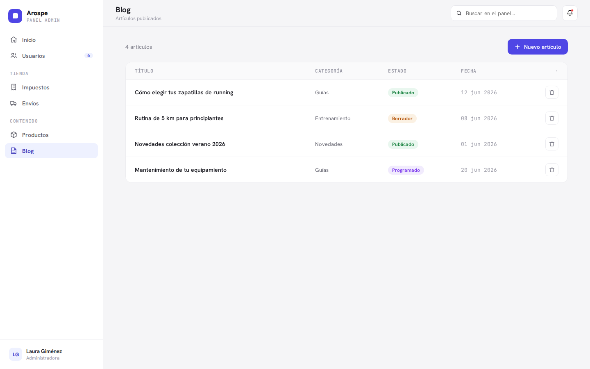
*Blog list: article title, category, status (Borrador / Publicado / Programado), and date, with
a primary "Nuevo artículo" action.*

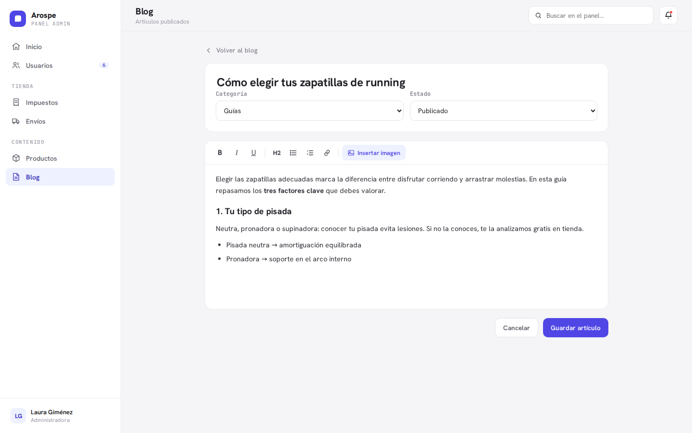
*Blog post editor: title, category select, status select, and the WYSIWYG body with image
insertion via the shared media gallery. **Extends the prototype**: category is a managed
taxonomy and a tag chip/autocomplete field is added (see scenarios).*

```gherkin
Feature: Blog posts

  Scenario: Create a post
    Given a blog editor
    When they create a post with a title, one category, a status, and a WYSIWYG body
    Then the post appears in the blog list with its status badge and date

  Scenario: Insert an image into a post body from the shared gallery
    Given a blog editor editing a post body
    When they insert an image from the shared media gallery
    Then the image is placed inline in the post body

  Scenario: A post has exactly one category
    Given a blog editor editing a post
    When they select a category
    Then the post has exactly that one category
```

```gherkin
Feature: Blog categories (extends the prototype)

  Scenario: Create a blog category
    Given a blog editor
    When they create a blog category named "Guías"
    Then it appears in the post editor's category selector

  Scenario: Rename a blog category
    Given a blog editor, with a blog category "Guías"
    When they rename it to "Guías de compra"
    Then the category is shown with its new name wherever it is used

  Scenario: Delete an unused blog category
    Given a blog editor, with a blog category "Guías" assigned to no posts
    When they delete "Guías"
    Then it no longer appears in the post editor's category selector

  Scenario: Blog categories are independent from product categories
    Given a blog editor
    When they view the blog category list
    Then it contains only blog categories, separate from product categories

  Scenario: Deleting a blog category still in use is hard-blocked with a count
    Given a blog editor, with a blog category assigned to 5 posts
    When they try to delete that category
    Then deletion is always blocked (no confirm-and-proceed path)
    And the message states how many posts use it
      (e.g. "This category is used by 5 posts — reassign them before deleting")
    And they must reassign those posts before it can be deleted
```

```gherkin
Feature: Blog tags (extends the prototype)

  Scenario: Create a tag on the management screen
    Given a blog editor on the tag management screen
    When they create a tag named "running"
    Then the tag "running" becomes available to posts

  Scenario: Rename a tag on the management screen
    Given a blog editor on the tag management screen, with a tag "running"
    When they rename it to "trail running"
    Then the tag is shown as "trail running" everywhere it is used

  Scenario: Delete a tag on the management screen
    Given a blog editor on the tag management screen, with a tag "running"
    When they delete the "running" tag
    Then it is removed from every post that used it

  Scenario: Reuse an existing tag from the post editor
    Given a blog editor editing a post, with a tag "running" already existing
    When they add "running" from the tag field
    Then the existing "running" tag is attached, not duplicated

  Scenario: Create a new tag on the fly from the post editor
    Given a blog editor editing a post, with no tag named "invierno"
    When they type "invierno" in the tag field and confirm it
    Then a new "invierno" tag is created and attached to the post

  Scenario: A post can hold more than one tag
    Given a blog editor editing a post that already has the tag "running"
    When they add the tag "invierno"
    Then the post is associated with both "running" and "invierno"

  Scenario Outline: Filter the blog list by taxonomy
    Given a blog editor viewing the blog list across several categories and tags
    When they filter the list by <filter>
    Then only posts matching <filter> are shown

    Examples:
      | filter     |
      | a category |
      | a tag      |
```

**Acceptance criteria — Blog**

- [ ] Posts have a title, exactly one category, multiple tags, a status, a date, and a WYSIWYG
      body with shared-gallery image insertion, matching the prototype list+editor.
- [ ] Blog categories have full CRUD and are distinct from product categories; a category in use
      **cannot** be deleted (hard block, no confirm-and-proceed) and the message states how many
      posts use it, requiring reassignment first.
- [ ] Tags have a full CRUD management screen **and** can be created on the fly from the post
      editor; typing an existing name reuses it, a new name creates it immediately.
- [ ] The admin blog list can be filtered by category and by tag.
- [ ] The data relationships support a future storefront filtering by category/tag (the
      **public-facing** filtering UI is out of scope — see [Out of scope](#out-of-scope)).
- [ ] Blog Posts, Blog Categories, and Blog Tags each use a UUID (v7) primary key, via Laravel's
      `HasUuids` trait, applied at both the migration and Eloquent model level.

---

## Epic 5 — Internationalization

**Priority: 5 (build last).** It cross-cuts Products and Blog (and, indirectly, the taxonomies
their content shares), so it comes after those exist. Two **independent** layers — do not
conflate them.

**Layer 1 — Admin UI language switcher.** A selector in the dashboard chrome switches the
interface language between **Spanish and English only** (menus, labels, buttons), via standard
Laravel localization (`lang/` files — greenfield; no `lang/` directory exists yet). This does
**not** translate store content.

**Layer 2 — Store Languages.** A separate settings section where admins manage which languages
the store's **content** is authored in — add/remove a language (e.g. add French), and mark one as
the store default. Each active store language then appears as a **tab inside the Product and Blog
editors** (and in the taxonomy management screens), switching the translatable fields in place.

**Translatable content (per store language):**

- Product **title** and **description**.
- Blog post **title** and **body**.
- **Slug / SEO fields** (e.g. URL slug, meta title/description) on products and posts.
- **Category and tag names** — Product categories, Blog categories, and Blog tags — each becomes
  a per-store-language field with the same tab-based editor UX.

**Non-translatable** fields (price, stock, SKU, status, dates) stay **outside** the language
tabs and are shown once.

**Store default language.** The store default is **independent** of the admin UI language (the
UI stays ES/EN only) and can be **any active store language** the admin has added (e.g. French).
On **initial installation**, the store's out-of-the-box default language is **Spanish**; admins
can later change the default to any other active store language.

```gherkin
Feature: Admin UI language switcher (Layer 1)

  Scenario: Switch the interface language to English
    Given a signed-in administrator using the interface in Spanish
    When they choose English from the admin language switcher
    Then the menus, labels, and buttons are shown in English
    And the choice persists across their sessions

  Scenario: The interface switcher offers only Spanish and English
    Given a signed-in administrator
    When they open the admin language switcher
    Then only Spanish and English are offered
    And store content languages do not appear in this switcher
```

```gherkin
Feature: Store Languages (Layer 2)

  Scenario: Spanish is the default store language on a fresh install
    Given a store administrator on a fresh installation
    When they open the Store Languages settings for the first time
    Then Spanish is the store's default language

  Scenario: Add a store language
    Given a store administrator, with store languages Spanish and English
    When they add French as a store language
    Then a French tab appears in the Product and Blog editors and taxonomy screens

  Scenario: The store default language is independent of the admin UI language
    Given a store administrator, with French active as a store language
    When they set French as the store's default language
    Then French becomes the store default
    And the admin UI language options remain only Spanish and English

  Scenario: Switching an editor's language tab switches only translatable fields
    Given a catalog administrator in a product editor showing Spanish, English, and French tabs
    When they switch from the Spanish tab to the French tab
    Then the title, description, and slug/SEO fields show the French content
    And the price, stock, SKU, status, and dates stay unchanged and are shown once

  Scenario Outline: Taxonomy names are translatable per store language
    Given a store administrator, with French active as a store language
    When they edit the name of a <taxonomy>
    Then they can provide its name per active store language via language tabs

    Examples:
      | taxonomy         |
      | Product category |
      | Blog category    |
      | Blog tag         |

  Scenario: Removing a store language warns before affecting translations
    Given a store administrator, with French active and holding existing translations
    When they remove French as a store language
    Then they are warned before any French translation content is affected
    And the French tab no longer appears in the editors

  Scenario: A missing translation falls back to the default store language
    Given a store administrator, with a product that has Spanish (default) content
      but no French translation
    When the product's French version is requested
    Then the Spanish default content is used as the fallback
```

**Acceptance criteria — Internationalization**

- [ ] The admin UI switcher toggles the interface between Spanish and English only, persists the
      choice, and uses standard Laravel `lang/` localization.
- [ ] Store Languages are admin-managed (add/remove, one default) and independent from the UI
      switcher; on install the store default is Spanish, and it can later be changed to any
      active store language.
- [ ] Each active store language surfaces as a tab in the Product and Blog editors and in the
      taxonomy management screens, switching only the translatable fields.
- [ ] Translatable fields are: product title/description, post title/body, slug/SEO fields on
      products and posts, and Product-category / Blog-category / Blog-tag names.
- [ ] Non-translatable fields (price, stock, SKU, status, dates) appear once, outside the tabs.
- [ ] Removing a store language warns the admin and there is a defined fallback to the default
      store language for missing translations.

---

## Roadmap & priority reasoning

The five epics ship in this order. The ordering is dependency-driven, not arbitrary.

| Order | Epic | Why here |
| --- | --- | --- |
| 1 | **Users, Roles & Permissions** | Foundation. Every other module gates its screens and actions on permissions, so `spatie/laravel-permission` must be wired and the roles UI built first. |
| 2 | **Products, Taxes & Sales Regions, Shipping** | The store core — the primary commerce data the whole panel exists to manage. Sales Regions/Taxes underpin product pricing, so this cluster is built as one push. |
| 3 | **Customers & Orders** | Depends on Products/Taxes/Shipping existing first: orders reference product/variant line items, a sales region for tax, and a shipping rate/carrier, so it can only be built once those catalogs exist. |
| 4 | **Blog** | Independent content module. Reuses the WYSIWYG editor and shared media gallery proven in Epic 2, so it benefits from building after Products. |
| 5 | **Internationalization** | Cross-cuts Products, Blog, and their shared taxonomies (translatable fields live in their editors and taxonomy screens), so it can only be layered on once those exist. |

**Technical note (not user-facing):** the move from database cache to **Redis** is part of this
initiative's technical scope and should be scheduled alongside Epic 1/2 hardening, but it has no
functional acceptance criteria in the epics above.

---

## Out of scope

Explicitly excluded from this PRD (and, where noted, flagged as possible future work):

- **Public storefront, cart, and checkout UI.** This is backoffice only. Admin data is managed
  here; a future separate project consumes it. Orders and customers are assumed to originate from
  such an out-of-scope external/future channel (or manual admin entry).
- **Customer-facing authentication / portal.** Customers (Epic 3) are admin-managed records only
  and cannot log into the dashboard; no customer login or self-service portal is built this phase.
- **Real payment gateway integration** — the panel records order payment/refund *state* as a
  manual admin-set status; wiring a live payment processor (charge/capture/refund) is not in scope.
- **Authentication flows** (registration, login, password reset, 2FA, passkeys) — already
  implemented via Fortify; this PRD starts after login.
- **Real carrier API integration** — no live tracking, no label generation, no rate lookups from
  carriers. Shipping is manual configuration only.
- **Multi-currency** — EUR only.
- **Cloud media storage** (S3 or similar) — local disk (`storage/app/public`) only this phase.
- **Audit / change-history log** — not required this phase; possible future enhancement.
- **Public storefront filtering/browsing of blog posts by category or tag** — confirmed out of
  scope. The data relationships exist to support it later, but no public-facing filtering UI is
  built in this phase (admin-side list filtering, by contrast, is in scope — see Epic 4).
- **Admin-creatable countries/regions from scratch** — the Sales Region catalog is seeded and
  fixed; admins only configure existing entries.

---

## Open questions for the user

No open questions remain — all ambiguities identified during PRD authoring were resolved with
the user. New ambiguities that surface while breaking these epics into tasks should be raised at
that point, per the project's [Uncertainty Handling Rule](../contracts.md).
