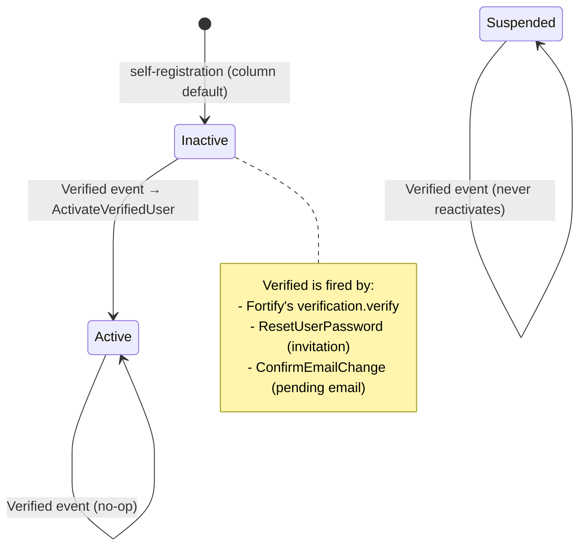
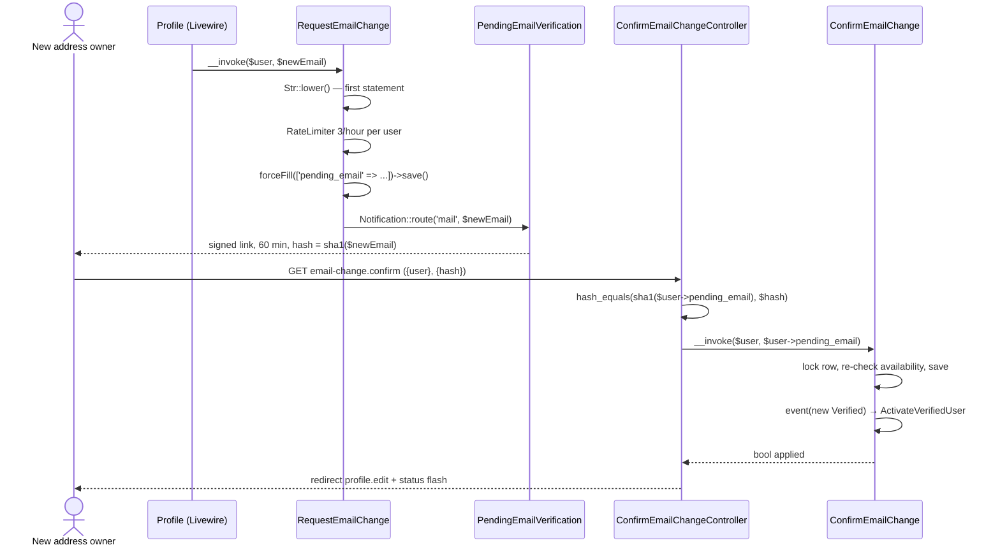
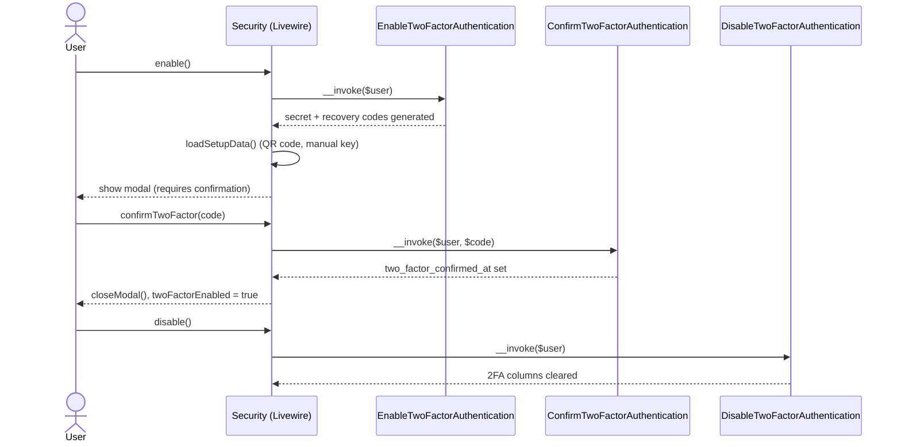

# Authentication

Cross-cutting concern — this is the single source of truth for how authentication, two-factor authentication, and passkeys work in this app. Other documents link here instead of re-explaining it.

## Table of Contents

- [Stack](#stack)
- [Enabled features](#enabled-features)
- [Registration & password reset](#registration--password-reset)
- [Account status and activation](#account-status-and-activation)
- [Pending email changes](#pending-email-changes)
- [Two-factor authentication flow](#two-factor-authentication-flow)
- [Passkeys](#passkeys)
- [Logout](#logout)
- [Where it lives](#where-it-lives)

## Stack

Authentication is handled by `laravel/fortify` (`^1.37.2`), configured in [`config/fortify.php`](../../config/fortify.php). Fortify owns the auth *routes and controllers*; this app supplies the *actions* and *Livewire UI*:

- `App\Actions\Fortify\CreateNewUser` implements `CreatesNewUsers`
- `App\Actions\Fortify\ResetUserPassword` implements `ResetsUserPasswords`
- `App\Models\User` implements `Laravel\Fortify\Contracts\PasskeyUser` and uses the `PasskeyAuthenticatable` and `TwoFactorAuthenticatable` traits

## Enabled features

From `config/fortify.php`:

```php
// config/fortify.php
Features::registration(),
Features::resetPasswords(),
Features::emailVerification(),
Features::twoFactorAuthentication([
    'confirm' => true,
    'confirmPassword' => true,
]),
Features::passkeys([
    'confirmPassword' => true,
]),
```

Both 2FA and passkeys require password re-confirmation before management (`confirmPassword` → the `password.confirm` middleware, applied on the `security.edit` route in `routes/settings.php`). 2FA additionally requires explicit confirmation (`confirm` → the user must submit a valid 6-digit code before it becomes active).

## Registration & password reset

Both actions validate with the shared traits in `app/Concerns/`, then mutate `User` directly — no service layer in between:

```php
// app/Actions/Fortify/CreateNewUser.php
public function create(array $input): User
{
    Validator::make($input, [
        ...$this->profileRules(),
        'password' => $this->passwordRules(),
    ])->validate();

    return User::create([
        'name' => $input['name'],
        'email' => $input['email'],
        'password' => $input['password'],
    ]);
}
```

```php
// app/Actions/Fortify/ResetUserPassword.php
public function reset(User $user, array $input): void
{
    Validator::make($input, [
        'password' => $this->passwordRules(),
    ])->validate();

    $wasUnverified = is_null($user->email_verified_at);

    $user->forceFill([
        'password' => $input['password'],
        ...($wasUnverified ? ['email_verified_at' => now()] : []),
    ])->save();

    if ($wasUnverified) {
        event(new Verified($user));
    }
}
```

The `$wasUnverified` branch is what makes this action double as the **invitation** path. Fortify's reset flow does not mark emails verified, so without it an invitee who set their password would stay `email_verified_at = null` forever — which would (a) leave them `Inactive` and, once the sign-in block story lands, permanently unable to log in, and (b) make them invisible to `RolePermissionSeeder`'s `whereNotNull('email_verified_at')` Super Admin lookup. An *already-verified* user doing a genuine forgot-password reset is untouched on both columns. The `Verified` event it fires is what performs the status transition — see [Account status and activation](#account-status-and-activation) below.

Validation rules are centralized so every entry point (registration, password reset, profile update, in-settings password change) stays consistent:

- [`app/Concerns/ProfileValidationRules.php`](../../app/Concerns/ProfileValidationRules.php) — `name`/`email` rules, with a unique-email-ignoring-self variant for profile updates.
- [`app/Concerns/PasswordValidationRules.php`](../../app/Concerns/PasswordValidationRules.php) — `passwordRules()` (uses `Password::default()`) and `currentPasswordRules()` (uses the `current_password` rule).

### Two non-HTTP callers reuse this reset flow

Neither introduces a second password-setting mechanism: both mint a standard broker token and land the recipient on the existing `password.reset` route, where `ResetUserPassword` above runs unchanged.

| Caller | Token | Notification | Why |
| --- | --- | --- | --- |
| `RolePermissionSeeder::bootstrapSuperAdmin()` (provision branch) | `Password::broker()->sendResetLink([...])` | the framework's own `ResetPassword` | the operator claims the account through the normal **Forgot password** screen; no bespoke invite token, notification or route. See [authorization.md](authorization.md#super-admin-bootstrap) |
| [`App\Actions\Users\CreateUser`](../../app/Actions/Users/CreateUser.php) (task 0004) | `Password::broker()->createToken($user)` | [`App\Notifications\UserInvitation`](../../app/Notifications/UserInvitation.php) (`ShouldQueue`) | an administrator creating a user needs *invitation* wording, not reset wording |

The split on that second row is deliberate and worth not undoing. `sendResetLink()` would have been the shorter call, but it bundles the framework's `ResetPassword` notification, whose wording can only be changed globally (`toMailUsing()`) — re-wording every genuine password reset in the app as a side effect. It is also subject to the 60-second `passwords.users.throttle`, which would silently no-op the second of two rapid account creations. Minting the token directly and attaching an own notification avoids both, while still producing a link to the same `password.reset` route.

An administrator-created account therefore starts with **a random unusable password, `email_verified_at = null`, and `pending_email = null`**: the address is the account's *initial* address, not a change, so the pending-email mechanism below does not apply to it. The invitation link is what proves the mailbox — completing it verifies the address and activates the account through the same `ResetUserPassword` → `Verified` → `ActivateVerifiedUser` chain as every other path.

> **Email addresses are canonically lowercase across the app**, now in three layers: `config/fortify.php` sets `'lowercase_usernames' => true` (registration, login, forgot-password); `App\Livewire\Settings\Profile` normalizes `$this->email` **before** `validate()` runs, so the uniqueness rule sees the value that will actually be stored; and `App\Actions\Users\RequestEmailChange` lowercases as its very first statement. `App\Models\User` additionally exposes a **read-only** lowercasing accessor on `email` — a consistency layer for rows that could already carry a mixed-case address, deliberately *not* a write mutator and no substitute for normalizing before validation (an accessor runs far too late for a uniqueness check). One consequence every test must respect: `$user->email` always returns lowercase, so an assertion about the *stored bytes* has to go through `$user->getRawOriginal('email')`.

## Account status and activation

Every account carries a `users.status`, cast to the backed string enum [`App\Enums\UserStatus`](../../app/Enums/UserStatus.php) (`Active` / `Inactive` / `Suspended`, whose `label()` resolves `__('users.statuses.*')` from `lang/en/users.php` and `lang/es/users.php`). The column defaults to `inactive` and is **not** mass-assignable — it is omitted from `User`'s `#[Fillable]`, so a profile form that posts a `status` field changes nothing.

The governing invariant is **no self-activation**: no account reaches `active` *by its own action* without its email being proven. Self-registration therefore lands on the column default (`inactive`), and the only automatic transition to `active` happens in one place — [`App\Listeners\ActivateVerifiedUser`](../../app/Listeners/ActivateVerifiedUser.php), wired to Laravel's `Illuminate\Auth\Events\Verified` event:

```php
// app/Providers/AppServiceProvider.php
protected function configureEventListeners(): void
{
    Event::listen(Verified::class, ActivateVerifiedUser::class);
}
```

```php
// app/Listeners/ActivateVerifiedUser.php
public function handle(Verified $event): void
{
    $user = $event->user;

    if (! $user instanceof User || $user->status !== UserStatus::Inactive) {
        return;
    }

    $user->status = UserStatus::Active;
    $user->save();
}
```

Three flows converge on this single listener rather than each re-implementing the rule — Fortify's own email verification, the invitation/reset path in `ResetUserPassword` (above), and the pending-email confirmation in `ConfirmEmailChange` (below):



Two guards in that listener are load-bearing and must survive any refactor: the `instanceof User` check (the `Verified` event's constructor has no native type hint, so a non-`User` authenticatable would otherwise reach `->status`), and the `Inactive`-only condition, which is what stops a verification from silently undoing an administrator's suspension.

> The invariant constrains **automatic** activation, not an administrator's authority. An administrator creating a user in the Users editor may deliberately set `Active` with the address still unverified; that is an authorized, human-audited act, not a self-activation.

`App\Models\User` does **not** implement `MustVerifyEmail` today (the import is commented out at the top of the file), so the `verified` middleware currently blocks nobody — status, not that middleware, is where account usability will be enforced.

## Pending email changes

Changing an email address **never** rewrites `users.email` on the spot. There are two callers today — the profile screen (`App\Livewire\Settings\Profile`) and, since task 0004, the administrative user editor via [`App\Actions\Users\UpdateUser`](../../app/Actions/Users/UpdateUser.php) — and they share **one** mechanism rather than each writing the column their own way. That holds in every direction: an administrator changing someone else's address, and an administrator changing their own, both go through it. The new address is parked in `users.pending_email` and a signed link goes to that address alone; only using the link applies it. This is the mechanism that closes the impersonation vector recorded in [errors-log.md](../errors-log.md): `users.email` **together with a non-null `email_verified_at`** now means the address has been proven, because no *change* to `users.email` can land without its own verification.



Real behavior worth knowing before touching any of it:

- **The link is address-bound, single-use, and expires in 60 minutes.** [`App\Notifications\PendingEmailVerification`](../../app/Notifications/PendingEmailVerification.php) (`ShouldQueue`, `SerializesModels`) builds it with `URL::temporarySignedRoute('email-change.confirm', now()->addMinutes(60), ['user' => $user->id, 'hash' => sha1($this->newEmail)])`. The `hash` is not decoration — it binds the link to one specific address, so replacing a pending address invalidates the outstanding link. 60 minutes matches the invitation/reset window (`passwords.users.expire`); `config/auth.php` is untouched.
- **Rate limiting lives in the action, not at the call site.** `RequestEmailChange` allows 3 requests per hour keyed on `'email-change:'.$user->getKey()` — the *target* user, so every present and future caller shares one budget per account — and throws a `ValidationException` on the `email` field (`users.email_change.throttled`) **before** any write or send. Without it, resubmitting a still-pending address (which passes validation every time, since the uniqueness rule ignores the caller's own row) drives unlimited mail at a third-party inbox. The confirmation route carries its own `throttle:6,1`.
- **Uniqueness spans both columns.** `App\Concerns\ProfileValidationRules::emailRules()` now adds `Rule::unique(User::class, 'pending_email')` alongside the `email` rule, so any screen reusing this trait cannot drift apart on what "this address is taken" means. Collisions that slip past validation and reach the unique index (SQLSTATE `23000`) are rethrown as a `ValidationException` on `email`, never a 500.
- **Refusals are redirects, not errors.** A tampered or expired link fails the `signed` middleware with a **403**; a still-validly-signed link whose address no longer matches (replayed, superseded, or cancelled) is refused one step later by the controller with a **redirect** to `profile.edit` carrying `users.email_change.refused`. Both refusal branches flash identical copy on purpose. `App\Livewire\Settings\Profile::mount()` reads that flashed `status` and surfaces it as a `Flux::toast()` (success or danger), matching how the rest of the Settings area reports feedback.
- **The confirmation route carries no `auth`.** What it proves is control of the mailbox, not a session — see [api/routes.md](../api/routes.md#app-owned-routes).

The security rules this flow established — the global `ValidateSignature`-before-`SubstituteBindings` middleware priority, why normalization must precede hashing, why `lockForUpdate()` plus an availability re-check still needs the unique index to have the last word, and why every refusal must be indistinguishable — are documented once in [security/signed-link-verification.md](../security/signed-link-verification.md) and are not repeated here.

### The action and its callers behave differently on a same-address submission — deliberately

This asymmetry is easy to mistake for a bug, so it is written down rather than rediscovered:

- **`RequestEmailChange` itself** treats a call whose address equals the user's current one as an **implicit cancel**: it clears any pending address and returns without sending anything. Anything calling the action directly hits this branch.
- **Neither real caller lets that branch run.** Both compare the submitted address against `getRawOriginal('email')` (lowercased on both sides) and call the action only when it genuinely differs — `App\Livewire\Settings\Profile` for the owner's own row, and `App\Actions\Users\UpdateUser` for the admin editor, whose guard reads:

```php
// app/Actions/Users/UpdateUser.php
$currentEmail = Str::lower((string) $user->getRawOriginal('email'));

if ($email !== $currentEmail) {
    $requestEmailChange($user, $email);
}
```

The profile screen's version of the same guard:

```php
// app/Livewire/Settings/Profile.php
if (Str::lower($validated['email']) !== Str::lower((string) $user->getRawOriginal('email'))) {
    $requestEmailChange($user, $validated['email']);
}

$this->email = $user->email;
```

Reason: on both forms the email field is always submitted, so a name-only save would resubmit the current stored address and silently cancel an unrelated pending change. Only the explicit Cancel control (`cancelEmailChange()`) may drop a pending change from the profile screen. The profile's trailing resync from `users.email` keeps the bound property from carrying a stale pending value into a later save.

> A related consequence on the admin editor: `UpdateUser` writes **name** (plus role and status, when the target is not the acting user) but never touches `email` or `email_verified_at` at all — those columns move only through `ConfirmEmailChange`. Editing another user's address leaves their account exactly as it was until the recipient uses the link.

## Two-factor authentication flow

Managed entirely from `App\Livewire\Settings\Security` ([`app/Livewire/Settings/Security.php`](../../app/Livewire/Settings/Security.php)), which composes four Fortify action classes injected per-method rather than one large service:



Notable real behavior (not aspirational):

- On `mount()`, if the feature requires confirmation but the user never completed it (`two_factor_confirmed_at` is null), the component proactively calls `DisableTwoFactorAuthentication` to clear the half-enabled state — see `app/Livewire/Settings/Security.php:79-82`.
- Recovery codes are managed by a separate component, [`app/Livewire/Settings/TwoFactor/RecoveryCodes.php`](../../app/Livewire/Settings/TwoFactor/RecoveryCodes.php), which decrypts `two_factor_recovery_codes` on mount and regenerates them via `Laravel\Fortify\Actions\GenerateNewRecoveryCodes`.
- `security.edit` (`routes/settings.php`) is gated by both `auth` and `verified` middleware groups plus `password.confirm` — see [api/routes.md](../api/routes.md).

## Passkeys

Passkey management (list, add, delete) lives in the same `Security` component, backed by `laravel/passkeys`:

```php
// app/Livewire/Settings/Security.php
public function deletePasskey(DeletePasskey $deletePasskey): void
{
    if (! $this->deletingPasskeyId) {
        return;
    }

    $user = Auth::user();
    $passkey = $user->passkeys()->findOrFail($this->deletingPasskeyId);

    $deletePasskey($user, $passkey);

    $this->closeDeleteModal();
    $this->loadPasskeys();
}
```

Passkeys are stored in the `passkeys` table (see [database/schema.md](../database/schema.md)). Discovery for password managers/OS integrations is exposed at a static route, not a Livewire component:

```php
// routes/settings.php
Route::get('.well-known/passkey-endpoints', function () {
    return response()->json([
        'enroll' => route('security.edit'),
        'manage' => route('security.edit'),
    ]);
})->name('well-known.passkeys');
```

## Logout

`App\Livewire\Actions\Logout` ([`app/Livewire/Actions/Logout.php`](../../app/Livewire/Actions/Logout.php)) is a single-purpose invokable action (not a Livewire component) — it guards, invalidates the session, and regenerates the CSRF token:

```php
// app/Livewire/Actions/Logout.php
public function __invoke(): Redirector|RedirectResponse
{
    Auth::guard('web')->logout();

    Session::invalidate();
    Session::regenerateToken();

    return redirect('/');
}
```

It's reused (not duplicated) by `DeleteUserForm::deleteUser()` before deleting the account:

```php
// app/Livewire/Settings/DeleteUserForm.php
public function deleteUser(Logout $logout): void
{
    $this->validate(['password' => $this->currentPasswordRules()]);

    tap(Auth::user(), $logout(...))->delete();

    $this->redirect('/', navigate: true);
}
```

## Where it lives

| Concern | Path |
| --- | --- |
| Fortify config | `config/fortify.php` |
| Register/reset actions | `app/Actions/Fortify/CreateNewUser.php`, `app/Actions/Fortify/ResetUserPassword.php` |
| Account status enum | `app/Enums/UserStatus.php` |
| Activation listener | `app/Listeners/ActivateVerifiedUser.php` (registered in `app/Providers/AppServiceProvider.php`) |
| Email-change actions | `app/Actions/Users/RequestEmailChange.php`, `app/Actions/Users/ConfirmEmailChange.php` |
| Email-change HTTP boundary | `app/Http/Controllers/ConfirmEmailChangeController.php`, route `email-change.confirm` in `routes/settings.php` |
| Email-change notification | `app/Notifications/PendingEmailVerification.php` |
| Status / email-change copy | `lang/en/users.php`, `lang/es/users.php` |
| Profile settings UI | `app/Livewire/Settings/Profile.php`, `resources/views/livewire/settings/profile.blade.php` |
| Security settings UI | `app/Livewire/Settings/Security.php`, `resources/views/livewire/settings/security.blade.php` |
| Recovery codes UI | `app/Livewire/Settings/TwoFactor/RecoveryCodes.php` |
| Account deletion | `app/Livewire/Settings/DeleteUserForm.php` |
| Logout | `app/Livewire/Actions/Logout.php` |
| Shared validation | `app/Concerns/ProfileValidationRules.php`, `app/Concerns/PasswordValidationRules.php` |
| 2FA columns migration | `database/migrations/2025_08_14_170933_add_two_factor_columns_to_users_table.php` |
| Status / pending-email migrations | `database/migrations/2026_08_11_175426_add_status_to_users_table.php`, `..._175427_add_pending_email_to_users_table.php` |
| Passkeys table migration | `database/migrations/2024_01_01_000000_create_passkeys_table.php` |
| Feature tests | `tests/Feature/Auth/**`, `tests/Feature/Settings/SecurityTest.php`, `tests/Feature/Settings/EmailChangeTest.php` |
| Unit tests | `tests/Unit/Enums/UserStatusTest.php`, `tests/Unit/Listeners/ActivateVerifiedUserTest.php`, `tests/Unit/Models/UserTest.php` |

_Last updated: 2026-08-13 — Task 0004: documented the second non-HTTP caller of the reset flow (`CreateUser` + the `UserInvitation` notification, and why it mints its own token instead of calling `sendResetLink()`), and corrected the pending-email section, which still described the administrative user editor as hypothetical and claimed it would hit the action's implicit-cancel branch — it exists, and it guards against a same-address submission exactly as the profile screen does._
