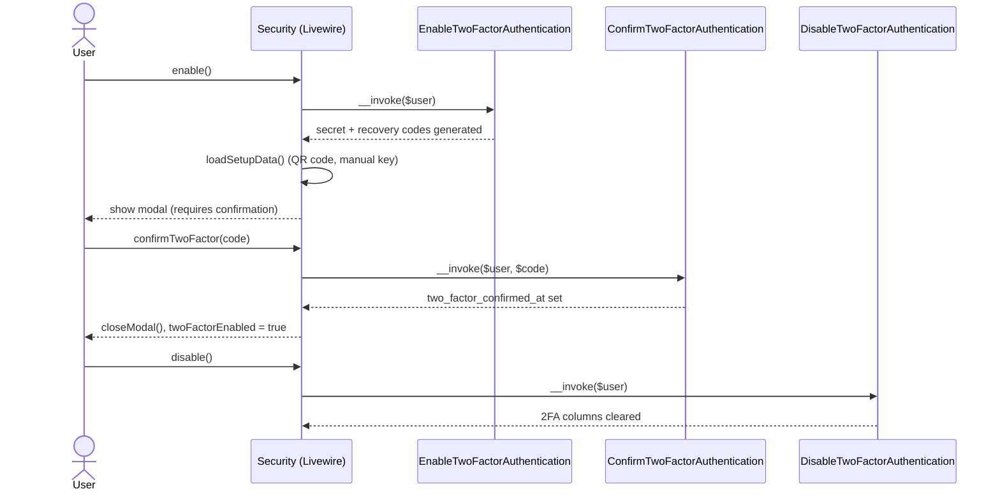

# Authentication

Cross-cutting concern — this is the single source of truth for how authentication, two-factor authentication, and passkeys work in this app. Other documents link here instead of re-explaining it.

## Table of Contents

- [Stack](#stack)
- [Enabled features](#enabled-features)
- [Registration & password reset](#registration--password-reset)
- [Two-factor authentication flow](#two-factor-authentication-flow)
- [Passkeys](#passkeys)
- [Logout](#logout)
- [Where it lives](#where-it-lives)

## Stack

Authentication is handled by `laravel/fortify` (`^1.37.2`), configured in [`config/fortify.php`](../../config/fortify.php). Fortify owns the auth *routes and controllers*; this app supplies the *actions* and *Livewire UI*:

- `App\Actions\Fortify\CreateNewUser` implements `CreatesNewUsers`
- `App\Actions\Fortify\ResetUserPassword` implements `ResetsUserPasswords`
- `App\Models\User` implements `Laravel\Fortify\Contracts\PasskeyUser` and uses the `PasskeyAuthenticatable` and `TwoFactorAuthenticatable` traits

## Enabled features

From `config/fortify.php`:

```php
// config/fortify.php
Features::registration(),
Features::resetPasswords(),
Features::emailVerification(),
Features::twoFactorAuthentication([
    'confirm' => true,
    'confirmPassword' => true,
]),
Features::passkeys([
    'confirmPassword' => true,
]),
```

Both 2FA and passkeys require password re-confirmation before management (`confirmPassword` → the `password.confirm` middleware, applied on the `security.edit` route in `routes/settings.php`). 2FA additionally requires explicit confirmation (`confirm` → the user must submit a valid 6-digit code before it becomes active).

## Registration & password reset

Both actions validate with the shared traits in `app/Concerns/`, then mutate `User` directly — no service layer in between:

```php
// app/Actions/Fortify/CreateNewUser.php
public function create(array $input): User
{
    Validator::make($input, [
        ...$this->profileRules(),
        'password' => $this->passwordRules(),
    ])->validate();

    return User::create([
        'name' => $input['name'],
        'email' => $input['email'],
        'password' => $input['password'],
    ]);
}
```

```php
// app/Actions/Fortify/ResetUserPassword.php
public function reset(User $user, array $input): void
{
    Validator::make($input, [
        'password' => $this->passwordRules(),
    ])->validate();

    $user->forceFill([
        'password' => $input['password'],
    ])->save();
}
```

Validation rules are centralized so every entry point (registration, password reset, profile update, in-settings password change) stays consistent:

- [`app/Concerns/ProfileValidationRules.php`](../../app/Concerns/ProfileValidationRules.php) — `name`/`email` rules, with a unique-email-ignoring-self variant for profile updates.
- [`app/Concerns/PasswordValidationRules.php`](../../app/Concerns/PasswordValidationRules.php) — `passwordRules()` (uses `Password::default()`) and `currentPasswordRules()` (uses the `current_password` rule).

## Two-factor authentication flow

Managed entirely from `App\Livewire\Settings\Security` ([`app/Livewire/Settings/Security.php`](../../app/Livewire/Settings/Security.php)), which composes four Fortify action classes injected per-method rather than one large service:



Notable real behavior (not aspirational):

- On `mount()`, if the feature requires confirmation but the user never completed it (`two_factor_confirmed_at` is null), the component proactively calls `DisableTwoFactorAuthentication` to clear the half-enabled state — see `app/Livewire/Settings/Security.php:79-82`.
- Recovery codes are managed by a separate component, [`app/Livewire/Settings/TwoFactor/RecoveryCodes.php`](../../app/Livewire/Settings/TwoFactor/RecoveryCodes.php), which decrypts `two_factor_recovery_codes` on mount and regenerates them via `Laravel\Fortify\Actions\GenerateNewRecoveryCodes`.
- `security.edit` (`routes/settings.php`) is gated by both `auth` and `verified` middleware groups plus `password.confirm` — see [api/routes.md](../api/routes.md).

## Passkeys

Passkey management (list, add, delete) lives in the same `Security` component, backed by `laravel/passkeys`:

```php
// app/Livewire/Settings/Security.php
public function deletePasskey(DeletePasskey $deletePasskey): void
{
    if (! $this->deletingPasskeyId) {
        return;
    }

    $user = Auth::user();
    $passkey = $user->passkeys()->findOrFail($this->deletingPasskeyId);

    $deletePasskey($user, $passkey);

    $this->closeDeleteModal();
    $this->loadPasskeys();
}
```

Passkeys are stored in the `passkeys` table (see [database/schema.md](../database/schema.md)). Discovery for password managers/OS integrations is exposed at a static route, not a Livewire component:

```php
// routes/settings.php
Route::get('.well-known/passkey-endpoints', function () {
    return response()->json([
        'enroll' => route('security.edit'),
        'manage' => route('security.edit'),
    ]);
})->name('well-known.passkeys');
```

## Logout

`App\Livewire\Actions\Logout` ([`app/Livewire/Actions/Logout.php`](../../app/Livewire/Actions/Logout.php)) is a single-purpose invokable action (not a Livewire component) — it guards, invalidates the session, and regenerates the CSRF token:

```php
// app/Livewire/Actions/Logout.php
public function __invoke(): Redirector|RedirectResponse
{
    Auth::guard('web')->logout();

    Session::invalidate();
    Session::regenerateToken();

    return redirect('/');
}
```

It's reused (not duplicated) by `DeleteUserForm::deleteUser()` before deleting the account:

```php
// app/Livewire/Settings/DeleteUserForm.php
public function deleteUser(Logout $logout): void
{
    $this->validate(['password' => $this->currentPasswordRules()]);

    tap(Auth::user(), $logout(...))->delete();

    $this->redirect('/', navigate: true);
}
```

## Where it lives

| Concern | Path |
| --- | --- |
| Fortify config | `config/fortify.php` |
| Register/reset actions | `app/Actions/Fortify/CreateNewUser.php`, `app/Actions/Fortify/ResetUserPassword.php` |
| Security settings UI | `app/Livewire/Settings/Security.php`, `resources/views/livewire/settings/security.blade.php` |
| Recovery codes UI | `app/Livewire/Settings/TwoFactor/RecoveryCodes.php` |
| Account deletion | `app/Livewire/Settings/DeleteUserForm.php` |
| Logout | `app/Livewire/Actions/Logout.php` |
| Shared validation | `app/Concerns/ProfileValidationRules.php`, `app/Concerns/PasswordValidationRules.php` |
| 2FA columns migration | `database/migrations/2025_08_14_170933_add_two_factor_columns_to_users_table.php` |
| Passkeys table migration | `database/migrations/2024_01_01_000000_create_passkeys_table.php` |
| Feature tests | `tests/Feature/Auth/**`, `tests/Feature/Settings/SecurityTest.php` |

_Last updated: 2026-07-12 — Initial scaffold of the documentation set by the docs-maintainer skill._
