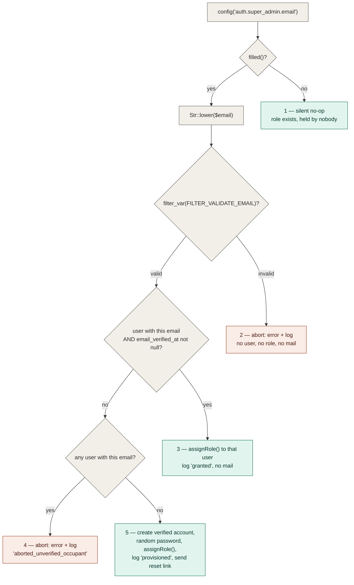

# Authorization

Cross-cutting concern — single source of truth for roles & permissions. Other documents link here instead of re-explaining it.

## Table of Contents

- [Stack](#stack)
- [Current state](#current-state)
- [Permission catalog](#permission-catalog)
- [Seeded roles and their grants](#seeded-roles-and-their-grants)
- [Seeding](#seeding)
- [Super Admin bootstrap](#super-admin-bootstrap)
- [The Super Admin bypass](#the-super-admin-bypass)
- [The Super Admin role's invariants](#the-super-admin-roles-invariants)
- [The Administrator tier's identity](#the-administrator-tiers-identity)
- [Middleware aliases](#middleware-aliases)
- [Policies](#policies)
- [Configuration](#configuration)
- [How to gate something](#how-to-gate-something)
- [Where it lives](#where-it-lives)

## Stack

`spatie/laravel-permission` (`^8.3`) with the `HasRoles` trait on the `User` model:

```php
// app/Models/User.php
use Spatie\Permission\Traits\HasRoles;

class User extends Authenticatable implements PasskeyUser
{
    /** @use HasFactory<UserFactory> */
    use HasFactory, HasRoles, HasUuids, Notifiable, PasskeyAuthenticatable, TwoFactorAuthenticatable;
}
```

## Current state

The authorization foundation is **live and in real use**: roles and permissions are seeded, the package's middleware aliases are registered, a `Gate::before` hook grants the Super Admin role a blanket bypass, and — since task 0004 — the first gated route and the first policy exist.

- Two roles are seeded — `Super Admin` and `Administrator` — both on the `web` guard.
- A 38-permission catalog is seeded under the `<module-slug>.<action>` convention.
- `role`, `permission`, and `role_or_permission` are registered as middleware aliases in [`bootstrap/app.php`](../../bootstrap/app.php) and enforce server-side (403).
- `App\Providers\AppServiceProvider::configureAuthorization()` installs the Super Admin `Gate::before` bypass.
- **`users.index` (`GET /users`) is the first permission-gated route**, and it is gated with **`can:users.view`** rather than Spatie's `permission:` middleware — a Livewire-specific correctness requirement, not a style choice. See [How to gate something](#gating-a-livewire-route-use-can-never-permission).
- **[`App\Policies\UserPolicy`](../../app/Policies/UserPolicy.php) is the first policy** in the app, called from [`App\Livewire\Users\Index`](../../app/Livewire/Users/Index.php). See [Policies](#policies).
- **Since task 0008 the `Super Admin` role itself is a fixed point of the system** — categorically undeletable, unrenameable, un-re-permissionable and absent from every roles list — enforced on [`App\Models\Role`](../../app/Models/Role.php), the app's own role model, which is now the **only** role model class application code may use. See [The Super Admin role's invariants](#the-super-admin-roles-invariants).
- **Since task 0008a the Administrator tier has one identity and the tier's authorization lives in the actions**, not in the Livewire component: `App\Models\Role::isAdministratorRole()` is the single row-shaped predicate, and [`App\Actions\Users\CreateUser`](../../app/Actions/Users/CreateUser.php) / [`UpdateUser`](../../app/Actions/Users/UpdateUser.php) refuse an unprivileged caller on their own. See [The Administrator tier's identity](#the-administrator-tiers-identity).
- **Since task 0009 the *role* side of the Administrator tier is enforced too, and a third authorization category exists**: `RolePolicy` gained an Administrator-level branch on `update()`/`delete()`, a Super-Admin-only `grantAdministratorPermission` ability, and [`App\Actions\Roles\EnforceAdministratorPermissionGrant`](../../app/Actions/Roles/EnforceAdministratorPermissionGrant.php) — which enforces a **meta**-rule (who may *grant* a permission, as opposed to who may exercise it). See [`RolePolicy`](#rolepolicy--the-second-policy) and [Who may grant a permission](#who-may-grant-a-permission--the-meta-rule-layer).

Still **ungated**: every route in [`routes/settings.php`](../../routes/settings.php) and the `dashboard` route, which carry only `auth` / `verified` / `password.confirm`. Those are per-user settings screens with no catalog permission behind them; the module screens of PRD Epics 2–5 will gate the same way `users.index` does.

## Permission catalog

**Naming convention: `<module-slug>.<action>`**, dot notation, mirroring this repo's `<resource>.<action>` route-naming convention (see [conventions/naming.md](../conventions/naming.md#permission-names)).

The catalog is defined as public constants on the seeder so that every consumer reuses one definition instead of restating the strings:

```php
// database/seeders/RolePermissionSeeder.php
public const MODULES = [
    'users', 'products', 'sales-regions', 'shipping', 'payment-methods',
    'customers', 'orders', 'blog', 'store-languages',
];

public const ACTIONS = ['view', 'create', 'edit', 'delete'];

/**
 * Non-CRUD permissions that sit outside the module x action grid.
 *
 * @var array<int, string>
 */
public const ROLE_PERMISSIONS = ['roles.manage', 'roles.manage-administrators'];
```

Nine modules × four actions = **36**, plus the two role-management permissions = **38** total.

| Module slug | Covers | Permissions |
| --- | --- | --- |
| `users` | user accounts | `users.view`, `users.create`, `users.edit`, `users.delete` |
| `products` | products, product categories and variants | `products.view`, `products.create`, `products.edit`, `products.delete` |
| `sales-regions` | sales regions & taxes | `sales-regions.*` (4) |
| `shipping` | shipping methods & rates | `shipping.*` (4) |
| `payment-methods` | payment methods | `payment-methods.*` (4) |
| `customers` | customers | `customers.*` (4) |
| `orders` | orders | `orders.*` (4) |
| `blog` | blog posts, categories and tags | `blog.*` (4) |
| `store-languages` | store languages / internationalization | `store-languages.*` (4) |

Plus, outside the grid:

| Permission | Meaning |
| --- | --- |
| `roles.manage` | manage roles and their permission grants |
| `roles.manage-administrators` | manage administrator-level roles and users |

Granularity is deliberately **coarse per module**: `products.*` covers categories and variants, `blog.*` covers categories and tags — matching the PRD's nine-module list rather than splitting sub-resources. `users.*` and `roles.*` are separate namespaces because the PRD gates them separately.

> **These strings are canonical.** They are the only permission names that exist in the database. Every call site must use them verbatim — `can('roles.manage-administrators')`, not a prose restatement — because `can()` / `hasPermissionTo()` against an unseeded name throws `PermissionDoesNotExist`. A story that needs a new permission adds it to `MODULES` / `ACTIONS` / `ROLE_PERMISSIONS` here, never as a string only its own code knows about.

## Seeded roles and their grants

| Role | Guard | Explicit permission rows | How it authorizes |
| --- | --- | --- | --- |
| `Administrator` | `web` | **37 of 38** — everything except `roles.manage-administrators` | normal Spatie grants |
| `Super Admin` | `web` | **0 of 38** | the [`Gate::before` bypass](#the-super-admin-bypass) |

`roles.manage-administrators` is seeded but held by **no role**: only the Super Admin can exercise it, and it does so through the bypass rather than through a grant.

The `Super Admin` role is created and then left alone — its permissions are never synced, granted, or revoked, not even with an empty `syncPermissions([])`. Its zero-permission state is a consequence of never being granted anything. `syncPermissions()` has exactly one call site in the seeder, on `Administrator`, so re-running repairs drift on that role only.

Since task 0008 that "left alone" is enforced rather than merely observed, and the seeder's own create call is the **one sanctioned exception** to the enforcement:

```php
// database/seeders/RolePermissionSeeder.php
// firstOrCreateSuperAdminRole() is the one sanctioned way to bring this role into
// existence -- it bypasses the `creating` guard (App\Models\Role::boot()) that
// otherwise refuses any role acquiring the Super Admin name (story 0008 F3).
$superAdminRole = Role::firstOrCreateSuperAdminRole();

$administratorRole = Role::firstOrCreate(
    ['name' => 'Administrator', 'guard_name' => 'web'],
);
```

Note the asymmetry: `Administrator` is still a plain `firstOrCreate()`, because only the Super Admin name is guarded. See [The Super Admin role's invariants](#the-super-admin-roles-invariants).

## Seeding

[`database/seeders/RolePermissionSeeder.php`](../../database/seeders/RolePermissionSeeder.php) is the **only** source of roles and permissions. The application is non-functional until it has run, so seeding is a **required deployment step**, not a developer convenience.

```bash
# production / any deploy — run the narrow, targeted form
php artisan db:seed --class=RolePermissionSeeder
```

Prefer that targeted invocation over a bare `php artisan db:seed`: `DatabaseSeeder` also creates a `test@example.com` fixture account, and the narrow form means no fixture seeder added later can reach production at all. The fixture itself is guarded by an explicit environment **allow-list**:

```php
// database/seeders/DatabaseSeeder.php
public function run(): void
{
    // N4 — allow-list, not "not production": staging/demo/qa are internet-reachable too.
    if (app()->environment(['local', 'testing'])) {
        User::factory()->create([
            'name' => 'Test User',
            'email' => 'test@example.com',
        ]);
    }

    $this->call(RolePermissionSeeder::class);
}
```

✅ Good — `app()->environment(['local', 'testing'])` is exact-match on `APP_ENV`, so `staging`, `demo`, `qa` and every future environment name are excluded by default.
❌ Bad — `if (! app()->isProduction())`, the deny-list form this replaced: it reads as equivalent but still creates a publicly-known credential everywhere that merely *isn't* named `production`. See [security/seeder-safety.md](../security/seeder-safety.md#never-put-development-only-accounts-in-an-unguarded-databaseseeder) for the full reasoning.

`$this->call(RolePermissionSeeder::class)` stays unconditional and runs in every environment, production included.

Two properties of the seeder are load-bearing:

- **Idempotent.** Roles and permissions are created with `firstOrCreate`, and `Administrator`'s grants are re-applied with `syncPermissions()`, so re-running converges: nothing is duplicated and a manually revoked permission is restored.
- **The permission cache is flushed twice.** `DatabaseSeeder` uses `WithoutModelEvents`, which suppresses the model-event-driven cache flush Spatie normally performs, so the seeder flushes explicitly — once *inside* the transaction before `syncPermissions()` (so the sync resolves the rows just inserted rather than a stale cache), and once *after* the transaction commits. Neither substitutes for the other; see [security/authorization-patterns.md](../security/authorization-patterns.md#flush-the-permission-cache-after-the-transaction-commits-never-inside-it) for why the post-commit flush cannot be dropped.

## Super Admin bootstrap

The `Super Admin` role is assignable **only** through the seeder or direct database access — nothing in the dashboard exposes it. Which user receives it is driven by one config value:

```php
// config/auth.php
'super_admin' => [
    'role' => RoleName::SuperAdmin->value,
    'email' => env('SUPER_ADMIN_EMAIL'),
],
```

`'role'` compiles in [`App\Enums\RoleName::SuperAdmin`](../../app/Enums/RoleName.php) rather than a bare string (task 0008), so the literal `'Super Admin'` is written in exactly one place in the codebase. The enum is **only** that default — nothing compares a role row against it; see [The Super Admin role's invariants](#the-super-admin-roles-invariants).

`SUPER_ADMIN_EMAIL` is read through `config()`, never `env()` outside `config/`, so `config:cache` is safe. The address is normalized with `Str::lower()` before anything else happens — every email address in this system is canonically lowercase, so `Admin@Example.com` and `admin@example.com` are the same address by definition.

`RolePermissionSeeder::bootstrapSuperAdmin()` then takes exactly one of five branches:



| # | Configured value | Outcome | What the operator does |
| --- | --- | --- | --- |
| 1 | unset or blank | total no-op — the role exists, assigned to nobody | set the variable and re-seed when ready |
| 2 | not a well-formed address | **abort**: console error naming the rejected value + `Log::warning` (`outcome: aborted_invalid_format`). No account, no grant, no mail | fix the value, re-run the seeder |
| 3 | matches a user whose `email_verified_at` is **not null** | that user is granted `Super Admin`; logged as `outcome: granted`. **No mail is sent** — the account already has an owner | nothing |
| 4 | matches a user that is **unverified** | **abort**: console error + `Log::warning` (`outcome: aborted_unverified_occupant`). No role granted to anyone, no second account inserted, no mail | have that account's owner verify their address, or free the address up, then re-run |
| 5 | matches no user at all | the account is **provisioned**: created with a cryptographically random password, `email_verified_at` forced, granted the role (`outcome: provisioned`), and a Fortify password-reset link emailed | claim the account via **Forgot password** using the emailed link |

Three rules this encodes:

- **Verification is proof of mailbox ownership, and the grant requires it.** The lookup itself carries `whereNotNull('email_verified_at')` — an unverified row is not a match. A row merely *carrying* the configured address proves nothing: self-registration is enabled, and `App\Livewire\Settings\Profile` lets any signed-in user move their account onto an arbitrary address. Without this condition, squatting on the address an operator intends to use later wins Super Admin on the next reseed. See [errors-log.md](../errors-log.md) for the incident that established this rule.
- **An abort degrades to "no grant", never to "no catalog".** Branches 2 and 4 `return` rather than throw. The bootstrap runs inside the seeder's `DB::transaction(...)`, so throwing would roll back the roles and the entire 38-permission catalog with it.
- **Every grant, provision and abort is written to the application log**, not only echoed to the console. `Seeder::$command` is `null` whenever the seeder runs outside an Artisan context, so console-only reporting can leave a privilege grant with no trace anywhere. Each entry carries `email`, `user_id` (where one exists) and a machine-readable `outcome` — and never the generated password.

The generated password is never printed, logged, returned, or stored anywhere but the hashed column; the account is unusable until the operator completes the reset. The reset itself reuses the app's existing Fortify broker (`Password::broker()->sendResetLink(...)`) — the same flow documented in [authentication.md](authentication.md#registration--password-reset) — with no bespoke invite token or route. A delivery failure is `report()`ed to error tracking and downgrades to a console warning; it never fails the seed, because losing the whole catalog to a misconfigured SMTP host would be the worse outcome.

Bootstrapping is idempotent: a provisioned account is created **verified**, so the next run matches branch 3 — no second account, no second reset email.

## The Super Admin bypass

```php
// app/Providers/AppServiceProvider.php
protected function configureAuthorization(): void
{
    Role::superAdminName();

    Gate::before(function (mixed $user, string $ability, array $arguments = []): ?bool {
        if (! $user instanceof User) {
            return null;
        }

        $target = $arguments[0] ?? null;
        if ($target instanceof Role && Role::isSuperAdminRoleRow($target)) {
            return null;
        }

        return $user->hasRole(Role::superAdminName(), 'web') ? true : null;
    });
}
```

(The real file carries five inline comments on these lines — F5/F6/F7 audit markers from task 0008, plus 0009's F4 and F-C — trimmed here; read the file for them.)

The closure returns `true` or `null` — **never `false`**, which would hard-deny every other user before their real permissions were consulted. The `instanceof User` guard and the explicit `'web'` guard each close a distinct failure mode; the vendor-source reasoning lives in [security/authorization-patterns.md](../security/authorization-patterns.md).

The bare `Role::superAdminName();` call on the first line is **not** dead code: it is a deliberate boot-time assertion that `auth.super_admin.role` is not misconfigured, added by task 0009 (Phase 5 finding F-C). See [One name, one resolution path](#one-name-one-resolution-path).

Two things changed here in task 0008:

- **The role name is resolved by [`Role::superAdminName()`](#one-name-one-resolution-path), not by an inlined `config()` expression.** The behaviour is identical (the method carries the same double fallback the inline expression did); what is gone is a *second* implementation of the resolution. The role that bypasses every permission check is now provably the same role that is protected and hidden, and the two cannot drift when `config('auth.super_admin.role')` is overridden.
- **The bypass now defers when the check's own target is the Super Admin role** (`return null` instead of `true`). Without this, a Super Admin actor's `Gate::authorize('delete', $superAdminRole)` was granted here before [`RolePolicy`](#rolepolicy--the-second-policy) was ever consulted, so the policy layer was not independently effective for that one actor. The model-level guards refused the mutation either way; this closes the policy-layer half.

And one more in task 0009 (Phase 4 finding F4):

- **That deferral now identifies its target with `Role::isSuperAdminRoleRow($target)`, not `$target->name`.** The attribute read was the *other half* of the residual `RolePolicy` carried: a partially-hydrated (`select('id')`) or mid-rename Super Admin role short-circuited the bypass to `true` here, while `RolePolicy::update()`/`delete()` — reached only when this closure defers — would have returned a categorical `false`. Two layers disagreeing on one row shape. Both now read the same `persistedName()`-backed helper, so the deferral and the policy branch cannot diverge. See [Known limitations](#known-limitations--what-is-not-closed), where this residual is now recorded as closed.

Consequence, deliberately accepted: apart from that one deferral, the bypass short-circuits `denies()` / `cannot()` and every Policy, which is what "the Super Admin bypasses permission checks entirely" means.

> **Forward-looking warning for stories 0010/0011.** The deferral is keyed on the **target** being the Super Admin role, not on the ability being checked. So any *future* `RolePolicy` ability invoked against the Super Admin role — `viewAny`, `create`, `restore`, anything the roles-CRUD screens add — will be **denied by default for a Super Admin actor** if `RolePolicy` has no matching method, because the bypass has already stepped aside and `Gate` falls through to "no method, no grant". That is fail-closed and not a security concern, but it is a surprise if you expected the Super Admin to pass everything: add the ability to `RolePolicy` explicitly rather than relying on the bypass.

### Bypass coverage — what it does *not* cover

`Gate::before` fires only for authorization routed through Laravel's Gate. Spatie's own `HasRoles` methods query the user's relations directly and never consult the Gate:

| Check | Reaches `Gate::before`? | Why |
| --- | --- | --- |
| `$user->can('products.delete')` | ✅ yes | goes through the Gate |
| `$this->authorize('products.delete')` | ✅ yes | Gate |
| `@can('products.delete')` | ✅ yes | Gate |
| `permission:products.delete` middleware | ✅ yes | resolves via `canAny()` → Gate |
| `role_or_permission:Super Admin\|roles.manage` middleware | ✅ yes | resolves via `canAny()` → Gate |
| `role:Administrator` middleware | ❌ **no** | calls `hasAnyRole()` directly |
| `$user->hasRole('Administrator')` | ❌ **no** | direct model query |
| `$user->hasPermissionTo('products.delete')` | ❌ **no** | direct model query |
| `@role('Administrator')` | ❌ **no** | direct model query |

So a Super Admin **is refused (403)** by a route or Blade block gated on a bare role name, even though they bypass every permission. That is the specified behavior — pinned by a regression test in [`tests/Feature/Authorization/PermissionMiddlewareTest.php`](../../tests/Feature/Authorization/PermissionMiddlewareTest.php) — not a defect to be "fixed" by teaching the bypass about roles. Doing that would mean intercepting `hasRole()` itself, which breaks any legitimate "does this user literally hold role X" query the roles UI needs.

> **Hard convention — gate on permissions, never on role names.** Every route, middleware, component and Blade gate in this app must be keyed on a **permission** (`can:` / `permission:`). Where a role check is genuinely unavoidable, write `role_or_permission:Super Admin|<permission>` rather than bare `role:`, so the Super Admin is admitted by the role branch and everyone else by the permission branch. This applies to PRD Epics 2–5 as much as to Epic 1 — a bare `role:` gate is invisible until it silently locks the Super Admin out of a screen.

## The Super Admin role's invariants

Task 0008. The bypass above makes the `Super Admin` role the most privileged object in the system, and until this story it was an ordinary `roles` row: deletable, renameable, and offerable in any role dropdown. It is now a **fixed point** — categorically undeletable, unmodifiable in every direction, unacquirable by any other role, and invisible to roles-list queries.

All of it lives on one class, [`App\Models\Role`](../../app/Models/Role.php), which `extends Spatie\Permission\Models\Role`. A subclass is required because a scope, model events, and method overrides all need one; `config/permission.php` repoints the package at it:

```php
// config/permission.php
'models' => [
    'role' => Role::class,   // App\Models\Role, not Spatie\Permission\Models\Role
],
```

### One role model class in application code

**No application file may import `Spatie\Permission\Models\Role`.** The single legitimate exception is the `models.role` binding above, which is where the two classes are deliberately joined.

This is a correctness rule, not tidiness: the two are different Eloquent classes over the *same* `roles` table, and only `App\Models\Role` carries the guards below — so `Spatie\Permission\Models\Role::find($id)->delete()` is a live bypass of everything this section describes. It was also the real state of the code before 0008: `App\Livewire\Users\Index` imported the package class directly, which is why repointing `models.role` alone was not sufficient.

Enforced by two Pest architecture tests rather than by convention alone:

```php
// tests/Unit/ArchitectureTest.php
arch('no application code imports the raw Spatie role model directly')
    ->expect('App')
    ->not->toUse(Role::class)
    ->ignoring('App\Models\Role');

arch('no seeder imports the raw Spatie role model directly')
    ->expect('Database\Seeders')
    ->not->toUse(Role::class);
```

✅ Good — **two separate single-namespace rules.** ❌ Bad — the obvious-looking `expect(['App', 'Database\Seeders'])->not->toUse(...)`: Pest evaluates an array of targets **disjunctively**, passing as soon as any one target satisfies the rule, so a combined rule stays green while `Database\Seeders` alone violates it. That is how this test first shipped vacuous; the file records the verification.

`App\Models\Role` itself is `->ignoring()`'d — it legitimately extends the package class. Test files are deliberately out of scope: a test proving one of the [documented bypasses](#known-limitations--what-is-not-closed) legitimately needs the package class.

### One name, one resolution path

Everything below answers "is this the Super Admin role?" through a single `public static` method, never by re-deriving the config read and never by comparing against the enum:

```php
// app/Models/Role.php
public static function superAdminName(): string
{
    $name = config('auth.super_admin.role', RoleName::SuperAdmin->value) ?? RoleName::SuperAdmin->value;

    throw_if(
        Str::lower($name) === Str::lower(RoleName::Administrator->value),
        RuntimeException::class,
        'auth.super_admin.role cannot be configured to "'.RoleName::Administrator->value.'" -- '.
        'that name is reserved for the locked, uneditable Administrator tier.',
    );

    return $name;
}
```

Callers: the [`Gate::before` bypass](#the-super-admin-bypass), all three guard layers, `scopeSelectable()`, [`RolePolicy`](#rolepolicy--the-second-policy), [`UserValidationRules::roleRules()`](../../app/Concerns/UserValidationRules.php), and `RolePermissionSeeder`. Before 0008 the bypass read config while **three** other sites wrote the literal `'Super Admin'` independently — the seeder, `Index::roleOptions()` and `roleRules()` — so overriding `config('auth.super_admin.role')` split them apart. The sharpest case was `roleRules()`, whose `Rule::exists(...)->whereNot('name', 'Super Admin')` would have gone on excluding an ordinary role while **permitting** a forged submission to assign the real, config-resolved Super Admin role.

Four properties are load-bearing and must not be "simplified":

- **`public static`** — `RolePolicy` and `RolePermissionSeeder` are separate classes with no `Role` instance in hand, and must call this implementation rather than re-derive it.
- **Both fallbacks.** `config()`'s default covers a *missing* key; `??` covers a key that is *present but `null`* (an unset env var feeding the value, or a stale `bootstrap/cache/config.php`). Dropping the `??` would let the bypass still resolve `'Super Admin'` and grant it, while the guards, scope, policy and seeder all resolved `null` and therefore protected, hid and seeded **nothing**. See [security/authorization-patterns.md](../security/authorization-patterns.md#read-the-super-admin-role-name-with-a-literal-default).
- **The read happens in the method body**, i.e. at query/guard/policy time — never in a constructor or property initialiser, which could run before config is loaded.
- **The `throw_if` refusing a collision with the locked `Administrator` name** (task 0009, Phase 4 finding F6). The two protected tiers must never resolve to the *same* name, and only one of them is configurable, so the only way they can collide is an operator setting `auth.super_admin.role` to `Administrator`. Nothing else in the codebase would catch it: `RolePolicy` would stay fail-closed (its Super Admin branch runs first), but the `Gate::before` bypass would then hand unrestricted access to **every `Administrator` holder**. Two details are deliberate: the comparison is **case-insensitive**, wider than every other comparison in this file, because its job is catching an operator's typo rather than deciding role identity; and it is invoked **eagerly**, by the bare `Role::superAdminName();` at the top of [`AppServiceProvider::configureAuthorization()`](#the-super-admin-bypass) (Phase 5 finding F-C). This method sits on the hottest authorization path in the app — `Gate::before` runs it on nearly every check — so lazy detection would turn a deploy-time configuration mistake into an arbitrary user's request failing with a stack trace pointing at a policy instead of at the config key. Do not delete that call as dead code.

[`App\Enums\RoleName`](../../app/Enums/RoleName.php) holds both well-known role names, and **its two cases are resolved through deliberately different mechanisms** — the rule is per case, not per enum, and the enum's own class docblock states it that way:

| Case | What it is | How a guard reads it |
| --- | --- | --- |
| `SuperAdmin` | **only** the compiled-in default, here and in `config/auth.php`. The operator-configurable `auth.super_admin.role` key is the source of truth | never compared against directly — always resolved through `Role::superAdminName()` |
| `Administrator` | the **locked identity itself** — no config key exists and none may be added (task 0008a) | compared against directly, via `Role::isAdministratorRole()` and `RoleName::Administrator->value` |

The `SuperAdmin` half of that rule is what task 0008 exists to protect: comparing a role row against `RoleName::SuperAdmin` would re-introduce exactly the config-vs-literal split described above. The `Administrator` half is safe for the opposite reason — there is no config value that could disagree with the literal. Why the two tiers are asymmetric on purpose is in [The Administrator tier's identity](#the-administrator-tiers-identity).

### Three guard layers

Each catches a class of code path the others cannot. All three are needed.

| # | Layer | Catches | Why the others miss it |
| --- | --- | --- | --- |
| 1 | `creating` / `deleting` / `updating` listeners in `Role::boot()` | any Eloquent save or delete, including code that never touches `Gate` | the policy only fires for `authorize()` call sites |
| 2 | Overrides of `givePermissionTo()` / `syncPermissions()` / `revokePermissionTo()`, and `assignToModels()` / `removeFromModels()` / `syncModels()` | pivot mutations on `role_has_permissions` and `model_has_roles` | these fire **no model event at all** — layer 1 cannot see them |
| 3 | [`RolePolicy::update()` / `delete()`](#rolepolicy--the-second-policy) | dashboard call sites that `authorize()` | layers 1–2 only fire once a mutation is actually attempted, so without this a screen would have to provoke an exception to learn the answer |

Layers 1 and 2 refuse by throwing [`App\Exceptions\ImmutableRoleException`](../../app/Exceptions/ImmutableRoleException.php), which carries a `render()` returning **403** — converging on the same status layer 3's policy denial produces, so the outcome is indistinguishable to a caller regardless of which layer caught it.

#### Layer 1: registration order is the whole point

The listeners are registered in an overridden `boot()`, **before** `parent::boot()`:

```php
// app/Models/Role.php
protected static function boot(): void
{
    static::creating(function (self $role): void {
        $role->guardAgainstAssumingSuperAdminName();
    });

    static::deleting(function (self $role): void {
        $role->guardAgainstSuperAdminMutation();
    });

    static::updating(function (self $role): void {
        $role->guardAgainstSuperAdminMutation();      // pre-mutation name: refuses editing the role AS IT IS today
        $role->guardAgainstAssumingSuperAdminName();   // post-mutation name: refuses renaming INTO the role's name
    });

    parent::boot();
}
```

❌ Bad — `booted()`, the idiomatic-looking choice (adapted to illustrate; deliberately not in the repo):

```php
// anti-pattern — do not register these in booted()
protected static function booted(): void
{
    static::deleting(fn (self $role) => $role->guardAgainstSuperAdminMutation());
}
```

`Spatie\Permission\Traits\HasPermissions::bootHasPermissions()` registers its **own** `deleting` listener, and trait boots run inside `Model::boot()` → `bootTraits()`, which `bootIfNotBooted()` calls **before** `static::booted()`. `fireModelEvent('deleting')` dispatches in registration order, so a `booted()` guard fires *after* the package's listener has already detached every `role_has_permissions` **and** every `model_has_roles` row for the role — and `Model::delete()` opens no transaction, so that detach **persists**. Net effect: the `roles` row survives (a naive "the role still exists" assertion passes) while the Super Admin role has silently lost all its permissions and all its holders.

Registering before `parent::boot()` puts this guard first, and it *throws* rather than returning `false`, halting the dispatch outright so the package's listener never runs. The test that proves it asserts the `role_has_permissions` and `model_has_roles` rows survive a refused delete — not merely that the `roles` row does.

#### The two identity helpers read different sources, and must never be merged

This is the subtlest part of the model, and a security re-audit found a working rename bypass in the first version of it.

| Helper | Reads | Answers |
| --- | --- | --- |
| `isSuperAdminRole()` | **persisted** identity only — `getOriginal('name')` when the column was hydrated, otherwise a database read-back | "was this row the Super Admin role *before* the mutation in flight?" |
| `guardAgainstAssumingSuperAdminName()` | the **in-memory / incoming** attribute | "is the name being *written* the Super Admin name?" |

They point in opposite directions on purpose. By the time `updating` fires, Eloquent has already staged the attacker's new name onto the in-memory attribute, so reading it for the first question makes a rename of the Super Admin role invisible to its own guard. And `isSuperAdminRole()` uses `array_key_exists('name', $this->getOriginal())` rather than `??`, because `getOriginal('name')` returns `null` for two different reasons — "never selected" and "selected but null" — that `??` cannot tell apart. The full rule, the executable bypass it came from, and why a test covering only the `guard_name` case passes on the vulnerable code, are in [security/authorization-patterns.md](../security/authorization-patterns.md#a-guard-that-reads-a-rows-protected-identity-must-distinguish-not-hydrated-from-hydrated-but-null).

`creating` and the second half of `updating` guard a *different* attack than the rest: a role **acquiring** the Super Admin name (`Role::create(['name' => 'Super Admin', ...])`, or a rename into it) would silently inherit the `Gate::before` bypass. `Role::firstOrCreateSuperAdminRole()` — used by [the seeder](#seeded-roles-and-their-grants) and nowhere else — is the one sanctioned exception, bypassing the `creating` guard via `withoutEvents()`.

### `selectable()` — the shared invisibility scope

```php
// app/Models/Role.php
public function scopeSelectable(Builder $query): Builder
{
    return $query->whereNot('name', self::superAdminName());
}
```

**Every roles list and role selector in the app must call it**, and stories 0010/0011 consume it rather than re-filtering. Its first (and today only) caller is `App\Livewire\Users\Index::roleOptions()`, which previously hardcoded `->whereNot('name', 'Super Admin')`.

Two properties:

- **Exact match, never `LIKE`.** A custom role named `Super Admin Assistant` stays fully visible and manageable.
- **Local scope, never global.** A global scope would be inherited by `Role::findByName()` / `findById()` / `findOrCreate()` (all go through `static::query()`) and by `User`'s `roles()` relation, breaking the seeder, `assignRole('Super Admin')`, the permission cache hydration (`select()->with('roles')->get()`), and a Super Admin's own `hasRole()`. Hiding the role from lists must not hide it from authorization.

The cosmetic half is not the enforcement. A forged submission never reads the dropdown, so the server-side exclusion in [`UserValidationRules::roleRules()`](../../app/Concerns/UserValidationRules.php) — `Rule::exists('roles', 'id')->where('guard_name', 'web')->whereNot('name', Role::superAdminName())` — is what actually stops the Super Admin role being assigned from the Users screen.

### Known limitations — what is *not* closed

Enumerated deliberately rather than left as silent gaps. All of them require code already inside the application doing the thing; none is reachable from an external request. **Code review is the backstop for all of them.**

| Bypass | Why no application-layer mechanism closes it |
| --- | --- |
| `Role::where(...)->delete()`, `Role::query()->delete()`, raw `DB::table('roles')->update()/->delete()` | the query builder never instantiates a model, so no event and no override runs. Only a database trigger would close it — a migration, and out of this story's scope |
| `$role->permissions()->detach(...)`, and the exact analogue `$role->users()->detach(...)` | the overrides guard the *methods*; a parent model cannot guard a bare relation object it has already handed to the caller |
| `Permission::first()->removeRole('Super Admin')` | `Spatie\Permission\Models\Permission` also uses `HasRoles` and mutates the identical `role_has_permissions` pivot from the other side. `App\Models\Role`'s overrides cannot intercept a mutation issued by a different class |
| `saveQuietly()`, `deleteQuietly()`, `Role::withoutEvents(...)` | all three suppress model events wholesale. Worth naming explicitly because `firstOrCreateSuperAdminRole()` normalises `withoutEvents()` as an in-house pattern, making it likelier someone reaches for it elsewhere |
| A `Role::all()` written without `->selectable()` | the scope is a **convention**, not enforcement — the accepted cost of rejecting a global scope |
| Matching ignores `guard_name` | `superAdminName()`, `selectable()`, the guards and `isAdministratorRole()` / `isSuperAdminRoleRow()` all match on `name` alone, while the bypass is explicitly `web`-scoped. A same-named role on another guard is not *plantable* through `App\Models\Role` (the `creating` guard is guard-insensitive too), and grants no bypass if it exists — so this is a hygiene issue, not an escalation. For the two row-shaped helpers it is additionally fail-*closed* in both directions: a foreign-guard match only makes the check stricter, and Spatie's `ensureModelSharesGuard()` refuses assigning a foreign-guard role to a `web` user regardless. Guard-scoping all of them is deferred |

Two more, recorded because they are the ones a future story will actually walk into:

> **✅ Closed by task 0009 — the partial-hydration residual is gone; kept here as a record.** Through task 0008a, `RolePolicy`'s Super Admin branch and the `Gate::before` deferral both identified their target with the in-memory `$role->name` attribute rather than the persisted-identity-safe resolution the model guards use, so a partially-hydrated `Role` (e.g. `Role::query()->select('id')->find($id)`) or a mid-rename one evaded the **policy** layer and returned the actor's ordinary `roles.manage` answer instead of a categorical `false`. Task 0009 routed **both** sites through [`Role::isSuperAdminRoleRow()`](#the-administrator-tiers-identity), which reads `persistedName()` — so every identity question at every layer is now hydration-safe by construction, and the policy and the deferral cannot disagree about a row shape. `tests/Feature/Policies/RolePolicyTest.php` pins it with a retargeting test (an edit meant for one role, forged onto the Super Admin role, is refused and neither role is modified).
>
> The generalisable rule — separate "not hydrated" from "hydrated but null", and never read the in-memory attribute for a row's *protected* identity — is in [security/authorization-patterns.md](../security/authorization-patterns.md#a-guard-that-reads-a-rows-protected-identity-must-distinguish-not-hydrated-from-hydrated-but-null). Any new `RolePolicy` ability that identifies a tier must call one of the two `Role::is*` helpers; it must never re-derive the comparison.

> **⚠️ The update path and the delete path are no longer symmetric about a Super Admin-holding target.** Task 0008a gave `App\Actions\Users\UpdateUser` a **direct throw** (deliberately outside `Gate`) refusing any modification of a user who currently holds the Super Admin role, which binds a Super Admin *actor* too. `App\Livewire\Users\Index::deleteUser()` has no equivalent: its only Super Admin-target exclusion is `UserPolicy::delete()`'s, which sits behind the `Gate::before` bypass — so a Super Admin actor can still delete another Super Admin holder, including their own account. This gap predates 0008a (stories 0005/0008) and was explicitly out of its scope; it is a candidate for a future task, recorded in that story's implementation record as **P2**. See [The Administrator tier's identity](#a-rule-that-must-bind-a-super-admin-actor-cannot-go-through-gate).

## The Administrator tier's identity

Task 0008a. Where the section above makes the `Super Admin` **role** immutable, this one answers a narrower question that had five independent answers before the story landed: *is this role the Administrator tier?* The literal `'Administrator'` was written in `App\Livewire\Users\Index`, three times in `UserPolicy`, and in the seeder — so the tier's identity could be half-changed. It is now written **once**, and the authorization built on it moved out of the component and into the actions.

### Why this tier is *not* config-driven, unlike the Super Admin one

The asymmetry with [`superAdminName()`](#one-name-one-resolution-path) is a decision, not an oversight, and re-adding symmetry would be a regression:

- `auth.super_admin.role` exists because the `Gate::before` bypass **already read a config key**. Leaving the guards on an independent literal meant an override could split them apart — the whole point of task 0008.
- The Administrator role's name is **locked and uneditable** by product decision (recorded across Epic 1's stories), so there is no second source that could disagree. `RoleName::Administrator` *is* the source of truth.

**Do not add `config('auth.administrator.role')`, an `'administrator'` block in `config/auth.php`, or an `administratorName()` resolver.** A config key is an override capability, and the locked-name decision rules one out. A content-scan test (`tests/Feature/Users/AdministratorRoleLiteralContentScanTest.php`) fails if one reappears, alongside asserting no `'Administrator'` / `'Super Admin'` literal survives in the guard path.

### One predicate, two shapes

```php
// app/Models/Role.php
public static function isAdministratorRole(self $role): bool
{
    return $role->persistedName() === RoleName::Administrator->value;
}

public static function isSuperAdminRoleRow(self $role): bool
{
    return $role->persistedName() === self::superAdminName();
}
```

| Input in hand | Read it as | Call sites |
| --- | --- | --- |
| a `Role` **row** | `Role::isAdministratorRole($role)` / `Role::isSuperAdminRoleRow($role)` | `CreateUser`, `UpdateUser`, and — since task 0009 — [`RolePolicy`](#rolepolicy--the-second-policy)'s two branches plus the [`Gate::before` deferral](#the-super-admin-bypass), all of which consume these helpers rather than defining a comparison of their own |
| a role **name string** | `RoleName::Administrator->value` / `Role::superAdminName()` | `UserPolicy`'s five `hasRole()` calls, `RolePermissionSeeder` |

Four properties are load-bearing:

- **`public static`, on the model.** `UserPolicy`, both user actions and (since 0009) `RolePolicy` and `AppServiceProvider` are separate classes with no shared base; a private policy-local helper would leave two independent comparisons for one concept, which is the duplication this story removed.
- **Exact `===`, never `LIKE`, `strcasecmp`, or a "contains" match.** `Administrador Regional`, a lowercase `administrator`, and a custom role holding *every* permission the seeded `Administrator` holds are all ordinary roles, freely assignable with `users.edit` alone. Administrator-level is defined by the role's name, not by its permission set — a deliberate, PRD-scoped limitation pinned by tests rather than left to accident.
- **They take a `Role`, so a name string cannot be passed by mistake.** An action holding a `string $roleId` resolves it with a full `Role::query()->find((int) $roleId)` — never a `select('id')`, and never the id-to-id comparison against a `where('name', …)->value('id')` lookup that `Index::administratorRoleId()` used to do (that method is deleted). A `null` row is not administrator-level; nothing can be promoted into a role that does not exist, and `syncRoles()` fails on its own afterwards.
- **Both read `persistedName()`, so a partially-hydrated row answers protectively.** That method is the extraction of what `isSuperAdminRole()` already did (see [the two identity helpers](#the-two-identity-helpers-read-different-sources-and-must-never-be-merged)), so there is one implementation of "read this row's real name". Consequences: `Role::query()->select('id')->find($id)` on the seeded Administrator role still answers `true`, and a row renamed *in memory* but not saved still answers by what is persisted — the rename-in-flight case resolves protectively. The alternative, documenting a "callers must fully hydrate" obligation, was rejected: unenforceable, invisible at the call site, and fails **open** when forgotten.

### The guard belongs to the action, not to the caller

Before this story the Administrator-level authorization lived only in `App\Livewire\Users\Index`, so a future API endpoint, Artisan command or queued job calling `CreateUser` / `UpdateUser` would have been completely ungated. Both actions now authorize **the whole operation** themselves, before any write:

| Action | Authorizes |
| --- | --- |
| `CreateUser` | `Gate::authorize('create', User::class)`; a direct throw if the submitted role is the Super Admin role; `Gate::authorize('promoteToAdministrator', User::class)` (class-level) if the submitted role is the Administrator role |
| `UpdateUser` | `$user->load('roles')`, then `Gate::authorize('update', $user)` unconditionally — including on a self-edit, so a name-only edit can no longer reach a write unauthorized. Then, for a non-self-edit: direct throws if the target *currently holds* or the submission *assigns* the Super Admin role, `promoteToAdministrator` / `downgrade` on an actual tier change, and `updateSensitiveAttributes` when the email or status actually changed |

The component keeps its own `Gate::authorize()` calls in `save()` / `deleteUser()` / `mount()` (see [Gate::authorize at the call site](#gateauthorize-at-the-call-site-not-only-at-the-route)) — that is now defence in depth rather than the only layer. What it no longer holds is a *second implementation* of the tier rules: `authorizeRoleChange()` and `administratorRoleId()` were deleted, not converted.

Four semantics survived the relocation unchanged and are pinned by tests, because each is easy to lose in transit: a **no-op** role re-save is neither a promotion nor a downgrade and needs no extra gate; the target's current role is read **fresh**, never from a possibly-stale cached relation; `updateSensitiveAttributes` fires only on an *actual* email or status change, compared against `getRawOriginal()` rather than the in-memory attribute; and **all authorization runs before the first write** — `UpdateUser`'s writes are additionally wrapped in `DB::transaction()`.

`UpdateUser` also **derives the self-edit guard itself** (`Auth::user()?->is($user) ?? false`) instead of accepting the `bool $applyRoleAndStatus` parameter the component used to pass. A caller-supplied self-lockout guard is only a guard while every caller computes it correctly; once the action is independently callable, `applyRoleAndStatus: true` on a self-targeting update is a one-argument bypass.

> **Known design consequence, verified non-reachable today.** These actions authorize against the *authenticated* user, and `Gate::authorize()` with no resolved user **denies** — fail-closed, and therefore safe. A genuinely unauthenticated caller (a seeder, a console command provisioning a first Administrator) cannot use them as-is and would need an explicit, deliberately-designed bypass rather than a quietly-relaxed guard. Nothing in `database/seeders/` or `app/Console/Commands/` calls either action today.

### A rule that must bind a Super Admin actor cannot go through `Gate`

The Super Admin refusals in both actions are **direct `throw new AuthorizationException(...)` statements, never `Gate::authorize()`** — and that is the single most important line to preserve if either action is ever refactored:

```php
// app/Actions/Users/UpdateUser.php — authorizeRoleAndStatusChange()
if ($currentRoles->contains(fn (Role $role): bool => Role::isSuperAdminRoleRow($role))) {
    throw new AuthorizationException('A Super Admin holder cannot be modified through this action.');
}

$submittedRole = Role::query()->find((int) $roleId);

if ($submittedRole !== null && Role::isSuperAdminRoleRow($submittedRole)) {
    throw new AuthorizationException('The Super Admin role cannot be assigned.');
}
```

[The `Gate::before` bypass](#the-super-admin-bypass) grants a Super Admin actor **before any policy method runs**, so routing either refusal through the Gate would make it inert for exactly the actor it most needs to bind. This is the same reasoning that puts the role model's own invariants in [layers 1 and 2](#three-guard-layers) rather than in `RolePolicy`. The general rule, with the ✅/❌ pair, is in [security/authorization-patterns.md](../security/authorization-patterns.md#a-rule-that-must-bind-a-super-admin-actor-must-be-a-direct-throw-not-a-gate-check).

Two consequences worth stating so neither is rediscovered as a surprise:

- **One dashboard behaviour changed deliberately.** Before 0008a, a Super Admin actor editing another Super Admin-holding user through the Users screen **succeeded** (`Gate::before` bypassed `UserPolicy::update()`'s exclusion and nothing else checked). It now throws. That is the intended outcome of the hardening, not a regression.
- **The delete path has no equivalent guard yet.** See the second ⚠️ in [Known limitations](#known-limitations--what-is-not-closed): `UserPolicy::delete()`'s Super Admin-target exclusion is still policy-level only, so a Super Admin actor can still delete another Super Admin holder. The asymmetry is accepted and out of 0008a's scope, not an oversight.

### The seeder writes the same name the guards read

```php
// database/seeders/RolePermissionSeeder.php
$administratorRole = Role::firstOrCreate(
    ['name' => RoleName::Administrator->value, 'guard_name' => 'web'],
);

throw_unless(
    $administratorRole->getRawOriginal('name') === RoleName::Administrator->value,
    RuntimeException::class,
    // ...
);
```

Behaviour is identical to the previous literal on a clean database; what the change buys is that the row the seeder *creates* and the row every guard *protects* stop being two independently-typed strings. The `throw_unless()` read-back is the compensating control for a real collation hazard: `roles.name` carries `utf8mb4_unicode_ci` (case- and accent-**insensitive**), so `firstOrCreate()` would silently **adopt** a pre-existing row named e.g. `administrator` and grant it all 37 Administrator permissions — while every identity check in the app is a byte-exact PHP comparison and would treat that same full-privilege row as an ordinary role, assignable with a bare `users.edit`. `Role::firstOrCreateSuperAdminRole()` carries the same read-back for the same reason, throwing `ImmutableRoleException` instead.

The same collation is why the "a lowercase `administrator` role is an ordinary role" scenario cannot be exercised through role *creation* in this schema — the unique index refuses the row while the seeded `Administrator` exists. The `===` exactness is still tested, against a **not-yet-persisted** instance, because it is the correct guard if the collation is ever changed and because it is what makes the two read-back assertions meaningful.

## Middleware aliases

Registered in [`bootstrap/app.php`](../../bootstrap/app.php):

```php
// bootstrap/app.php
->withMiddleware(function (Middleware $middleware): void {
    $middleware->alias([
        'role' => RoleMiddleware::class,
        'permission' => PermissionMiddleware::class,
        'role_or_permission' => RoleOrPermissionMiddleware::class,
    ]);
})
```

| Alias | Class | Notes |
| --- | --- | --- |
| `permission` | `Spatie\Permission\Middleware\PermissionMiddleware` | the default choice — reaches the Gate, so the Super Admin passes |
| `role_or_permission` | `Spatie\Permission\Middleware\RoleOrPermissionMiddleware` | use when a role check is unavoidable |
| `role` | `Spatie\Permission\Middleware\RoleMiddleware` | registered for completeness; **does not** admit the Super Admin |

All three throw `UnauthorizedException` for an unauthenticated request, which renders as a bare 403 rather than a redirect to login — so a gated route must **also** carry `auth` (and `verified`, matching the existing groups in `routes/web.php`). See [security/authorization-patterns.md](../security/authorization-patterns.md#permission-and-role-middleware-are-not-a-substitute-for-auth).

## Policies

Permissions answer "may this actor do this *kind* of thing at all". A **policy** answers the question a permission cannot: "may this actor do it *to this particular record*". [`App\Policies\UserPolicy`](../../app/Policies/UserPolicy.php) (task 0004) is the first one in the app, and the template for the rest.

**Registration: none.** Laravel 13 auto-discovers `App\Policies\<Model>Policy` for `App\Models\<Model>`, so `UserPolicy` is wired to `User` — and `RolePolicy` to `App\Models\Role` — by naming alone. This repo has **no `AuthServiceProvider`**, and one should not be added to register a conventionally-named policy.

> Auto-discovery is also why nothing registers `RolePolicy` for the *package's* `Spatie\Permission\Models\Role`. `Gate::getPolicyFor()` walks the inheritance chain with `is_subclass_of`, which matches a **subclass of** a registered class — and the package class is the **parent** of `App\Models\Role`, not a child. A raw package instance would go unmatched with or without an explicit `Gate::policy()` line, so adding one buys nothing. That gap is closed by the [one-role-model convention and its `arch()` test](#one-role-model-class-in-application-code) instead.

### `UserPolicy` abilities

| Ability | Signature | Rule |
| --- | --- | --- |
| `viewAny` | `(User $actor)` | holds `users.view` |
| `create` | `(User $actor)` | holds `users.create` |
| `update` | `(User $actor, User $target)` | `false` if `$target` holds `Super Admin`; otherwise holds `users.edit` |
| `updateSensitiveAttributes` | `(User $actor, User $target)` | passes `update`, **and** — if `$target` holds `Administrator` — holds `roles.manage-administrators` |
| `promoteToAdministrator` | `(User $actor, ?User $target = null)` | holds `roles.manage-administrators` |
| `downgrade` | `(User $actor, User $target)` | `true` if `$target` does **not** hold `Administrator`; otherwise holds `roles.manage-administrators` |
| `delete` | `(User $actor, User $target)` | `false` if `$target` holds `Super Admin`; `false` if `$target` is already soft-deleted; holds `users.delete`, **plus** `roles.manage-administrators` when `$target` holds `Administrator` |

**Who calls what changed in task 0008a.** `viewAny` / `create` / `update` / `delete` are authorized by [`App\Livewire\Users\Index`](../../app/Livewire/Users/Index.php); `create` and `update` are *additionally* authorized inside the actions themselves. The three tier-specific abilities — `promoteToAdministrator`, `downgrade`, `updateSensitiveAttributes` — are now authorized **only** in [`CreateUser`](../../app/Actions/Users/CreateUser.php) / [`UpdateUser`](../../app/Actions/Users/UpdateUser.php), so a non-dashboard caller inherits them. See [The guard belongs to the action, not to the caller](#the-guard-belongs-to-the-action-not-to-the-caller).

**The trashed-target refusal (task 0005) is the newest branch, and it guards a write rather than a read.** `delete()` returns `false` for a `$target->trashed()`, because [`App\Models\User::delete()`](../../app/Models/User.php) rewrites the row's email to a placeholder on the way out (see [database/schema.md](../database/schema.md#soft-deletes)) — so without this branch a `withTrashed()` call site could re-run that write against an already-trashed row. Note what it is *not*: being policy-level, it sits **behind** [the `Gate::before` bypass](#the-super-admin-bypass), so a `Super Admin` still reaches `delete` on a trashed target. That is accepted rather than a gap — the placeholder is derived from the immutable UUID, so the re-write is idempotent — and it is the general shape of every policy rule in this app: a `Gate::before` grant is decided before any policy method runs, so a rule that must bind the Super Admin too belongs in the model or action, not here. The rest of the Administrator-level delete/downgrade matrix is unchanged by 0005; the story only re-proved it under the new `SoftDeletes` global scope.

Four properties of this policy are load-bearing and generalize to every policy added later:

**1. The policy calls `hasPermissionTo()`, and that is correct here** — even though [the bypass table](#bypass-coverage--what-it-does-not-cover) marks `hasPermissionTo()` as *not* reaching `Gate::before`. A policy method is only ever reached *through* the Gate, and `Gate::before` runs first: a Super Admin is granted before `UserPolicy` is consulted at all, so the direct query inside it never runs for them. This is why `tests/Feature/Policies/UserPolicyTest.php` can assert a Super Admin passes every ability while holding **zero** permission rows.

> The "gate on permissions, never role names" convention still governs the **call sites** (`Gate::authorize(...)`, `can:` middleware). Inside a policy body, both `hasPermissionTo()` and `hasRole()` are appropriate — the latter for asking a literal question about the *target*, which is exactly what the Super Admin and Administrator exclusions do.

**2. `hasRole()` is always passed the guard, and the name is never a literal.** All five `hasRole()` calls in `UserPolicy` pass `'web'` explicitly, never the one-argument form, per [security/authorization-patterns.md](../security/authorization-patterns.md#always-pass-the-guard-to-hasrole--hasanyrole). Since task 0008a they also resolve the *name* through the two centralized identities rather than writing it inline — the config-driven one for the Super Admin tier, the locked enum case for the Administrator tier:

```php
// app/Policies/UserPolicy.php — update(); delete() carries the identical pair
if ($target->hasRole(Role::superAdminName(), 'web')) {
    return false;
}
// ... and, in updateSensitiveAttributes() / downgrade() / delete():
if (! $target->hasRole(RoleName::Administrator->value, 'web')) {
```

These are `hasRole()` checks against a **user**, not a `Role` row, which is why they read the name rather than calling `Role::isAdministratorRole()`. Both shapes compare against the same single literal, so they cannot drift — see [The Administrator tier's identity](#one-predicate-two-shapes).

**3. `promoteToAdministrator()`'s `$target` is nullable, and that is not decoration.** It is invoked two ways — with an instance on the edit path, and **class-level** on the create path, where no target exists yet:

```php
// app/Actions/Users/CreateUser.php — the create path
Gate::authorize('promoteToAdministrator', User::class);
```

`Gate::callPolicyMethod()` **drops the first argument when it is a class-string**, so the class-level call reaches the method with `$actor` alone. A non-nullable `User $target` parameter would throw `ArgumentCountError` at runtime rather than allowing or denying anything — and it would pass every instance-level test, failing only at that one call site.

**4. `updateSensitiveAttributes` exists because a rule keyed on the *operation* was incomplete.** The Administrator-level guard originally covered only the *role* change; a security audit (task 0004, finding F1) found that `status` and `email` reach the same effect without passing any guard — an actor holding `users.edit` but not `roles.manage-administrators` could suspend another Administrator, or seize their account by pointing its email at an address they control. The general rule this established, with the real ✅/❌ pair, is in [security/authorization-patterns.md](../security/authorization-patterns.md#an-ability-must-cover-every-attribute-that-achieves-its-effect-not-only-the-operation-it-is-named-after) — it is not repeated here.

### `RolePolicy` — the second policy

[`App\Policies\RolePolicy`](../../app/Policies/RolePolicy.php) (task 0008, extended by task 0009) has three abilities. It still has **no call site in `app/`** — it exists so stories 0010/0011's roles screens have the layer to `authorize()` against, so the Super Admin refusal is independently effective there, and (since 0009) so the Administrator tier is protected on the *role* side the way 0008a protected it on the *user* side:

| Ability | Signature | Rule |
| --- | --- | --- |
| `update` | `(User $actor, Role $role)` | `false` if `$role` is the Super Admin role; then, if `$role` is the seeded `Administrator` role, holds `roles.manage-administrators`; otherwise holds `roles.manage` |
| `delete` | `(User $actor, Role $role)` | identical to `update` |
| `grantAdministratorPermission` | `(User $actor)` | holds the `Super Admin` role on the `web` guard — nothing else grants it |

```php
// app/Policies/RolePolicy.php
public function update(User $user, Role $role): bool
{
    if (Role::isSuperAdminRoleRow($role)) {
        return false;
    }

    return Role::isAdministratorRole($role)
        ? $user->hasPermissionTo(self::ADMINISTRATOR_LEVEL_PERMISSION)
        : $user->hasPermissionTo(self::ROLE_MANAGEMENT_PERMISSION);
}
```

Six notes, the first three of which differ from `UserPolicy` above:

- **This is a complement to, not a substitute for, the model-level guards.** A policy only fires where someone calls `authorize()`; [layers 1 and 2](#three-guard-layers) catch the code paths that don't. Neither layer is redundant.
- **Unlike every `UserPolicy` rule, the Super Admin branch binds the Super Admin actor too** — because the bypass [defers when the target is the Super Admin role](#the-super-admin-bypass). Compare `UserPolicy::delete()`'s trashed-target refusal, which a Super Admin still sails past. The Administrator branch is the opposite: it *is* behind the bypass, which is exactly how a Super Admin edits the seeded `Administrator` role while holding zero permission rows.
- **Branch order is load-bearing, and is pinned by a test.** The categorical Super Admin refusal runs **first and unconditionally**; the Administrator branch is appended below it. A rewrite that puts the tier branch first would let an actor holding `roles.manage-administrators` edit the Super Admin role. `RolePolicyTest` asserts precisely that ordering rather than only the two happy paths.
- **Both tier identities come from `App\Models\Role`, never from a comparison written here.** `Role::isSuperAdminRoleRow()` and `Role::isAdministratorRole()` are the [one predicate in two shapes](#one-predicate-two-shapes); the policy defines neither. A content-scan test (`tests/Feature/Users/AdministratorRoleLiteralContentScanTest.php`) covers this file and fails if a `'Administrator'` / `'Super Admin'` literal reappears in it.
- **The two permission names are class constants, not repeated literals.** `RolePolicy::ADMINISTRATOR_LEVEL_PERMISSION` (`roles.manage-administrators`) and `RolePolicy::ROLE_MANAGEMENT_PERMISSION` (`roles.manage`) are read by this policy, by `EnforceAdministratorPermissionGrant`, and by both classes' tests. Known, deliberately-deferred inconsistency (task 0009 Phase 4 finding **F5**, pre-existing): `UserPolicy` still writes the `roles.manage-administrators` literal at four call sites of its own. Point those at these constants when that cleanup happens — do not assume it already did.
- **"Administrator-level" is name-scoped by design and stays that way.** A custom role *granted* `roles.manage-administrators` does not itself become protected the way the seeded `Administrator` role is — only the literally-named seeded role is. This is the PRD's explicit scope (findings F15/F16 from task 0004's re-audit, reconfirmed by 0009), not an oversight; switching to permission-set-based matching needs a new product decision.

`RolePolicy` calls `hasPermissionTo(...)` directly, matching `UserPolicy`'s six call sites. Consequence, accepted knowingly: on a database with the permission tables migrated but **not seeded**, that throws `PermissionDoesNotExist` (→ 500) rather than denying (→ 403). Switching this one policy to `$user->can(...)` was rejected as a one-off deviation from the codebase's single established pattern for this check; the fix belongs in one pass across both policies.

### Who may *grant* a permission — the meta-rule layer

Task 0009 introduced a category the two policies above do not cover. `roles.manage-administrators` answers "may this actor manage administrator-level roles and users". It does **not** answer "may this actor hand that ability to somebody else" — and deliberately so: holding a permission must never confer the right to grant it, or a single administrator-level holder could bootstrap an unbounded number of peers.

The rule has two halves, and only the second is a security control:

| Half | Where | What it does |
| --- | --- | --- |
| Visibility | `RolePolicy::grantAdministratorPermission` | `Gate::allows('grantAdministratorPermission', Role::class)` is the contract story 0011's UI consumes to decide whether to render the toggle **at all** (absent from the DOM, not merely disabled) |
| Enforcement | [`App\Actions\Roles\EnforceAdministratorPermissionGrant`](../../app/Actions/Roles/EnforceAdministratorPermissionGrant.php) | refuses a save payload that *newly grants* the permission unless the actor passes that same ability, and **preserves** an existing grant a non-Super-Admin's payload merely omitted |

`grantAdministratorPermission` takes no target: it is a property of the actor, asked class-level (`Role::class`). It is also deliberately **not** gated by any permission — making it grantable would recreate the escalation it exists to prevent.

The action is where the non-obvious design sits, and all of it comes from that first half. Because the toggle is never rendered to a non-Super-Admin, and because `Role::syncPermissions()` **replaces a role's entire permission set**, a broad administrator editing an unrelated field of a role that legitimately holds `roles.manage-administrators` submits a payload that *omits* it — not as a decision, but because the field was never in their form. Reading that omission as a revoke would let any `roles.manage` holder strip a Super Admin's grant by saving an unrelated change:

```php
// app/Actions/Roles/EnforceAdministratorPermissionGrant.php — __invoke()
$wasGranted = in_array(RolePolicy::ADMINISTRATOR_LEVEL_PERMISSION, $currentNames, true);
$isSubmittedGranted = in_array(RolePolicy::ADMINISTRATOR_LEVEL_PERMISSION, $submittedNames, true);

if ($isSubmittedGranted && ! $wasGranted) {
    Gate::forUser($actor)->authorize('grantAdministratorPermission', Role::class);
}

if ($wasGranted && ! $isSubmittedGranted && Gate::forUser($actor)->denies('grantAdministratorPermission', Role::class)) {
    $submittedPermissions[] = RolePolicy::ADMINISTRATOR_LEVEL_PERMISSION;
}
```

Five properties, each of which a Phase 4 round put there:

- **It diffs before-vs-after; it does not test the payload alone.** Only a *genuine new grant* (absent before, present after) requires the ability. An omission is preserved rather than read as a revoke — **unless the actor can actually revoke it**, which keeps the Super Admin's own "remove it by omitting it" path working. Preserve-not-deny was a **human product decision** taken mid-audit, not a derivation: silently stripping and hard-refusing are both defensible, and the wrong one either loses a grant invisibly or blocks routine edits.
- **It reads the "before" state itself, from the `Role` instance, reloaded fresh** — `$role->load('permissions')`, never a caller-supplied array of current names and never a possibly-stale cached relation. A caller-supplied snapshot is the same class of hole one level up: asserting an untrue "before" makes any new grant look pre-existing.
- **`?Role $role` is nullable but has no default.** `null` means role *creation*, where nothing can currently be granted. A `= null` default would make a forgotten third argument at a future call site silently mean "nothing is currently granted" for what could be an existing, already-granted role.
- **The membership check normalises every shape the write itself accepts.** `syncPermissions()` takes names, ids, `Permission` instances, and arrays/Collections of any of those, flattening them via `HasPermissions::collectPermissions()`. `normalizeNames()` applies the *identical* flattening, so nothing can be invisible to the check while still being honoured by the sync that follows.
- **It throws rather than silently stripping a new-grant attempt**, matching Epic 1's "the action is denied server-side" and never returning HTTP 200 for a refused request.

> **Known limitation, accepted and deferred to story 0010 (Phase 4 finding F3, Phase 5 finding F-E).** This action is a **transformer**: it returns the permission list to sync rather than performing the sync itself. A caller could therefore drop the return value, or sync a *different* role than the one it authorized against, reopening the hole it closes. It has **no production caller yet** (the role-save path is story 0010), and folding `syncPermissions()` into the action depends on 0010's real `saveRole()` shape. The decision is recorded as an explicit open question inside that story's task file, to be settled in its own Phase 1/3 — not inherited silently. Whoever wires the first call site owns it.

The general rules this produced — preserve-don't-revoke on a partially-visible full-set sync, and normalise every shape the downstream write accepts — are in [security/authorization-patterns.md](../security/authorization-patterns.md#a-full-set-sync-behind-a-partially-visible-form-must-preserve-what-the-actor-cannot-see).

### `Gate::authorize` at the call site, not only at the route

`can:users.view` on the route proves only the **page-level** ability. Every method of `App\Livewire\Users\Index` that mutates re-authorizes as its **first statement** (`Gate::authorize('create', User::class)`, `Gate::authorize('update', $target)`, `Gate::authorize('delete', $target)`), and `mount()` re-checks `viewAny` on its own. That is mandatory rather than defensive: `Livewire::test()` and the `/livewire/update` endpoint both reach the component **without ever running route middleware**.

Since task 0008a the two write actions authorize `create` / `update` again on their own (see [The guard belongs to the action, not to the caller](#the-guard-belongs-to-the-action-not-to-the-caller)), which makes the component's calls genuine defence in depth rather than the only layer — but does **not** make them removable: `deleteUser()` calls no action at all, and a component that stopped authorizing would be relying on every future collaborator to do it instead. The full rule set — including which route middleware silently does *not* follow a component, and why `#[Locked]` is what keeps the authorized identity and the written identity the same — is in [security/livewire-authorization.md](../security/livewire-authorization.md).

### `Gate::allows()` in a list query is a UI hint, not a layer

A policy is also consulted **per row while rendering**, which is a different job from the mandatory checks above and must not be confused with them. `App\Livewire\Users\Index::loadUsers()` asks the same two abilities the mutating methods authorize against, once per user in the list:

```php
// app/Livewire/Users/Index.php — loadUsers()
'canEdit' => Gate::allows('update', $user),
'canDelete' => Gate::allows('delete', $user),
```

The view renders that row's edit/delete action `disabled` when the flag is `false` (see [api/routes.md](../api/routes.md#usersindex--the-first-permission-gated-route)). Four things make this safe and worth copying on the next module screen:

- **The same policy method decides both the hint and the outcome**, so the disabled state matches what a click would do for every actor/target combination but one — a `Super Admin` target, an Administrator-holding target without `roles.manage-administrators`, an already-trashed target: each resolves `false` here for exactly the reason it would 403 there. Deriving the hint from a *re-stated* rule ("hide it when the actor lacks `users.edit`") is the anti-pattern this avoids; that copy goes stale the first time the policy grows a branch.
- **One combination has drifted since task 0008a, and it is a known accepted gap.** For a **Super Admin actor** viewing a **Super Admin-holding target**, `Gate::allows('update', …)` returns `true` (the bypass grants it), so the row renders enabled — but `UpdateUser`'s [direct-throw guard](#a-rule-that-must-bind-a-super-admin-actor-cannot-go-through-gate) refuses the save on click. Closing it would mean teaching the hint about a rule that deliberately lives outside `Gate`. Note the direction: the drift is always *enabled-then-refused*, never disabled-then-permitted, so it costs a confusing click and never leaks an action. `canDelete` is unaffected — the delete path has no such guard (see [Known limitations](#known-limitations--what-is-not-closed)).
- **It adds nothing to the security posture and must never be treated as if it did.** `save()` and `deleteUser()` still re-authorize independently as their first statement — unchanged by this — because the client can call either without the list ever having been rendered (see [the section above](#gateauthorize-at-the-call-site-not-only-at-the-route)). A disabled attribute is a courtesy to the user, not a control.
- **`Gate::allows()`, never `Gate::authorize()`.** Rendering a list must not throw on the rows the actor cannot touch; `allows()` returns a `bool` and `authorize()` raises `AuthorizationException`.
- **The per-row cost is bounded.** `UserPolicy` asks the *target* about roles (`hasRole(Role::superAdminName(), 'web')`), which the list's `with('roles')` eager load already satisfies in memory, and asks the *actor* about permissions, which `spatie/laravel-permission` serves from its 24-hour cache — so N rows do not mean N queries. Two notes specific to this list: `delete()`'s `trashed()` branch is unreachable from here (the `SoftDeletingScope` already excluded those rows), and a `Super Admin` actor sees every action enabled because [the bypass](#the-super-admin-bypass) grants before any policy method runs — which matches the mutating path in every case except the one named in the bullet above.

## Configuration

Teams support is **disabled** (single-tenant permission model):

```php
// config/permission.php
'teams' => false,
```

Table names are the package defaults:

| Config key | Table |
| --- | --- |
| `table_names.roles` | `roles` |
| `table_names.permissions` | `permissions` |
| `table_names.model_has_roles` | `model_has_roles` |
| `table_names.model_has_permissions` | `model_has_permissions` |
| `table_names.role_has_permissions` | `role_has_permissions` |

The polymorphic **morph key** is **not** the package default. Because `users.id` is a UUID (v7) string (see [ADR 0001](../decisions/0001-uuid-primary-keys.md)), the morph-key column on `model_has_roles` / `model_has_permissions` was renamed from the default `model_id` (bigint) to `model_uuid` (UUID-typed):

```php
// config/permission.php
'column_names' => [
    'model_morph_key' => 'model_uuid',
    // ...
],
```

This config change tells the package which column to *query*; the physical column was renamed/retyped by the alteration migration `database/migrations/2026_07_22_100004_convert_model_morph_key_to_uuid_in_permission_tables_table.php`. See [database/schema.md](../database/schema.md) for the column shapes.

Permission checks are cached for 24 hours (`config/permission.php`, `'cache'` section) on the `database` cache store, which is shared across every worker. The cache is flushed automatically whenever a role/permission changes through the package's own methods — **except** under `WithoutModelEvents`, which is why the seeder flushes explicitly (see [Seeding](#seeding)).

## How to gate something

✅ Good — the real, currently-gated route: a permission gate (so the Super Admin bypass applies), inside the existing `auth` + `verified` group:

```php
// routes/web.php
Route::middleware(['auth', 'verified'])->group(function () {
    Route::livewire('users', UsersIndex::class)
        ->middleware(['can:users.view'])
        ->name('users.index');
});
```

❌ Bad — a bare role gate locks the Super Admin out, because `hasAnyRole()` never reaches the Gate (adapted from the route above to illustrate; not present in the repo):

```php
// anti-pattern — do not do this
Route::livewire('users', UsersIndex::class)->middleware(['role:Administrator']);
```

### Gating a Livewire route: use `can:`, never `permission:`

On a **`Route::livewire(...)` route the two are not interchangeable**, even though they express the same rule. Livewire re-applies route middleware to `/livewire/update` round-trips only for the classes hardcoded in `PersistentMiddleware::$persistentMiddleware`. That allow-list contains Laravel's `Illuminate\Auth\Middleware\Authorize` (which backs `can:`) but **not** Spatie's `PermissionMiddleware`:

```php
// ❌ anti-pattern on a Livewire route — protects only the initial GET /users;
// every save()/deleteUser() round-trip runs unauthorized at the route layer
Route::livewire('users', UsersIndex::class)->middleware(['permission:users.view']);
```

Spatie registers every permission as a Gate ability, so `can:users.view` carries exactly the same meaning — including the Super Admin bypass — and **is** re-applied on every action. This is why [`routes/web.php`](../../routes/web.php) carries an inline comment warning against the swap, and why a later story must not "normalise" this route onto `permission:`. The verified allow-list, plus the three other middlewares that silently do not follow a component (`verified`, `password.confirm`, `throttle:`), are in [security/livewire-authorization.md](../security/livewire-authorization.md#livewireupdate-is-a-second-entry-point-and-only-an-allow-listed-subset-of-route-middleware-follows-the-component-there).

Route middleware is never the whole story for a Livewire screen regardless — see [`Gate::authorize` at the call site](#gateauthorize-at-the-call-site-not-only-at-the-route).

### In PHP and Blade

```php
$user->can('products.delete');        // ✅ Gate — Super Admin passes
$user->hasPermissionTo('products.delete'); // ❌ direct query — Super Admin fails
```

The one place `hasPermissionTo()` is correct is **inside a policy body**, which is only ever reached through the Gate — see [Policies](#policies).

## Where it lives

| Concern | Path |
| --- | --- |
| Package config, incl. the `models.role` → `App\Models\Role` binding | `config/permission.php` |
| Super Admin role name & bootstrap address | `config/auth.php` (`auth.super_admin.*`), `.env` (`SUPER_ADMIN_EMAIL`) |
| The literal `'Super Admin'` (compiled-in default only) **and** `'Administrator'` (the locked identity itself) | `app/Enums/RoleName.php` |
| Role model, `superAdminName()`, `isAdministratorRole()` / `isSuperAdminRoleRow()` / `persistedName()`, the guards and `selectable()` | `app/Models/Role.php` |
| Administrator-tier and Super Admin-tier authorization on the write paths | `app/Actions/Users/CreateUser.php`, `app/Actions/Users/UpdateUser.php` |
| The "who may *grant* administrator-level permission" meta-rule | `app/Actions/Roles/EnforceAdministratorPermissionGrant.php` (enforcement), `app/Policies/RolePolicy.php` (`grantAdministratorPermission`, the visibility contract) |
| The guards' 403-rendering exception | `app/Exceptions/ImmutableRoleException.php` |
| Migration | `database/migrations/2026_07_12_181045_create_permission_tables.php` |
| Catalog & role seeding | `database/seeders/RolePermissionSeeder.php` |
| Seeder call order & fixture guard | `database/seeders/DatabaseSeeder.php` |
| Middleware aliases | `bootstrap/app.php` |
| Super Admin bypass | `app/Providers/AppServiceProvider.php` |
| Trait usage | `app/Models/User.php` |
| Policies | `app/Policies/UserPolicy.php`, `app/Policies/RolePolicy.php` (auto-discovered; no provider registration) |
| The one-role-model `arch()` rules | `tests/Unit/ArchitectureTest.php` |
| The only gated route | `routes/web.php` (`users.index`, `can:users.view`) |
| Per-action `Gate::authorize` call sites, and the per-row `Gate::allows` UI hint | `app/Livewire/Users/Index.php` |
| Tests | `tests/Feature/Seeders/`, `tests/Feature/Authorization/`, `tests/Feature/Policies/`, `tests/Feature/Users/` |
| Security rules derived from this foundation | [`docs/security/`](../security/README.md) |

_Last updated: 2026-08-20 — Task 0009 (Administrator-level permission grant): rewrote **`RolePolicy` — the second policy** for its third ability and its Administrator-level branch (branch ordering, the two class constants, why the Super Admin branch binds a Super Admin actor while the Administrator branch deliberately does not, and the deferred `UserPolicy` literal duplication, finding F5), and added **Who may grant a permission — the meta-rule layer** for `App\Actions\Roles\EnforceAdministratorPermissionGrant` — the preserve-don't-revoke product decision, why the "before" snapshot is read from the model rather than accepted from the caller, why `?Role $role` carries no default, the shape normalisation matching `syncPermissions()`, and the transformer-not-writer limitation deferred to story 0010. **Closed** the partial-hydration ⚠️ in **Known limitations**: both `RolePolicy`'s Super Admin branch and the `Gate::before` deferral now read `Role::isSuperAdminRoleRow()`. Rewrote two now-stale code quotes this story falsified — the `Gate::before` closure (target comparison plus the new eager boot-time call) and `Role::superAdminName()` (the `throw_if` refusing a name collision with the locked `Administrator` tier, finding F6, and why it is checked eagerly, finding F-C) — and updated the two "story 0009 will…" forward references in **The Administrator tier's identity** to the present tense._

_Previously: 2026-08-19 — Task 0008a (centralize Administrator-level role identification): added **The Administrator tier's identity** section — why this tier is deliberately *not* config-driven, the one predicate in its two shapes (`isAdministratorRole()` / `isSuperAdminRoleRow()` for a row, `RoleName::Administrator->value` / `superAdminName()` for a name), the relocation of the tier's authorization out of the Livewire component and into `CreateUser` / `UpdateUser`, why a rule that must bind a **Super Admin actor** is a direct throw rather than a `Gate` check, and the seeder's collation read-back guard. Rewrote **One name, one resolution path**'s closing claim per case — `RoleName::SuperAdmin` is still only a compiled-in default, but `RoleName::Administrator` **is** an identity check. Narrowed (did not delete) the partial-hydration ⚠️ in **Known limitations**: half-closed by `persistedName()`, still open on `RolePolicy`'s Super Admin branch and the `Gate::before` deferral — and added a second ⚠️ recording the accepted update-vs-delete asymmetry about a Super Admin-holding target. Corrected three now-false statements the story falsified: `UserPolicy`'s stale `hasRole('Super Admin', 'web')` literal quote, the `promoteToAdministrator` class-level quote's file path (the create path moved into `CreateUser`), and the `Gate::allows()` UI hint's "can never drift" claim, which now carries its one accepted exception._

_Previously: 2026-08-18 — Task 0008 (Super Admin role invariants): added **The Super Admin role's invariants** section — the `App\Models\Role` subclass and the one-role-model `arch()` rule, `Role::superAdminName()` as the single resolution path shared with the bypass, the three guard layers (with the `boot()`-not-`booted()` vendor-ordering trap and the two identity helpers that must never be merged), the `selectable()` scope, and the enumerated known limitations — plus the ⚠️ residual the roles-CRUD author must resolve (`RolePolicy` identifies its target by the in-memory attribute, not the persisted-identity helper). Rewrote **The Super Admin bypass** for its now-stale code quote, its `Role::superAdminName()` call and the new target-is-the-Super-Admin-role deferral, with the forward-looking note that the deferral is keyed on the target rather than the ability (so an unimplemented future `RolePolicy` ability fails closed for a Super Admin actor). Added `RolePolicy` to **Policies**, `RoleName::SuperAdmin->value` to the bootstrap config quote, `firstOrCreateSuperAdminRole()` to **Seeded roles**, and five rows to **Where it lives**._

_Previously: 2026-08-16 — Task 0006 follow-up: added the **`Gate::allows()` in a list query is a UI hint, not a layer** subsection, covering the per-row `canEdit` / `canDelete` flags `App\Livewire\Users\Index::loadUsers()` now derives from `UserPolicy` to disable row actions — why the hint must come from the same policy method rather than a restated rule, why it neither replaces nor weakens the mutating methods' own `Gate::authorize` calls, why `allows()` and not `authorize()`, and why N rows do not mean N queries._

_Previously: 2026-08-14 — Task 0005 (soft-delete users): recorded `UserPolicy::delete()`'s new trashed-target refusal in the abilities table and one paragraph on why it is policy-level (the `Gate::before` Super Admin bypass reaches it, accepted because the obfuscation re-write is idempotent). The Administrator-level matrix is unchanged._

_Previously: 2026-08-13 — Task 0004 (Users list + create/edit backend): recorded the first permission-gated route (`users.index`) and the first policy, added a **Policies** section documenting `UserPolicy`'s seven abilities (why `hasPermissionTo()` inside a policy body is correct, why `promoteToAdministrator`'s `$target` must be nullable, and the audit finding behind `updateSensitiveAttributes`), rewrote **How to gate something** around the real route, and added the `can:` vs `permission:` rule for Livewire routes._
