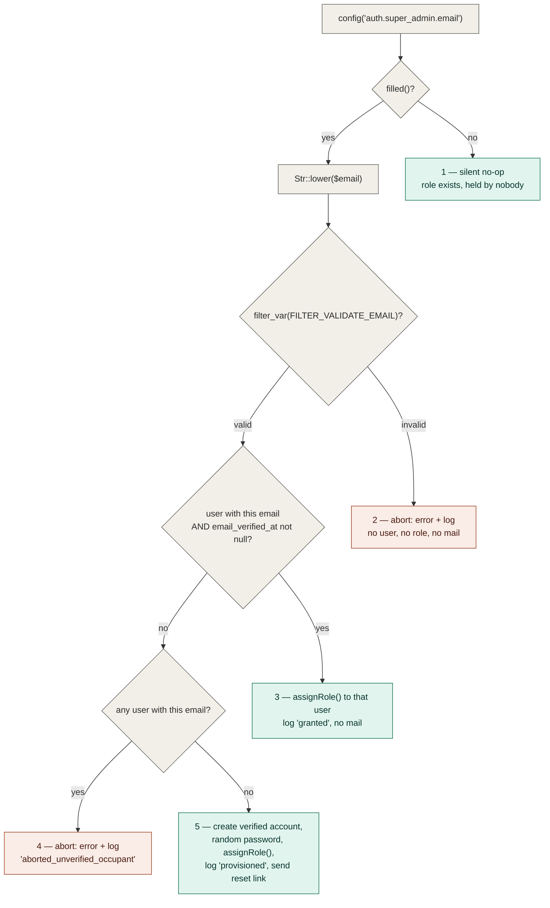

# Authorization

Cross-cutting concern — single source of truth for roles & permissions. Other documents link here instead of re-explaining it.

## Table of Contents

- [Stack](#stack)
- [Current state](#current-state)
- [Permission catalog](#permission-catalog)
- [Seeded roles and their grants](#seeded-roles-and-their-grants)
- [Seeding](#seeding)
- [Super Admin bootstrap](#super-admin-bootstrap)
- [The Super Admin bypass](#the-super-admin-bypass)
- [Middleware aliases](#middleware-aliases)
- [Configuration](#configuration)
- [How to gate something](#how-to-gate-something)
- [Where it lives](#where-it-lives)

## Stack

`spatie/laravel-permission` (`^8.3`) with the `HasRoles` trait on the `User` model:

```php
// app/Models/User.php
use Spatie\Permission\Traits\HasRoles;

class User extends Authenticatable implements PasskeyUser
{
    /** @use HasFactory<UserFactory> */
    use HasFactory, HasRoles, HasUuids, Notifiable, PasskeyAuthenticatable, TwoFactorAuthenticatable;
}
```

## Current state

The authorization foundation is **live**: roles and permissions are seeded, the package's middleware aliases are registered, and a `Gate::before` hook grants the Super Admin role a blanket bypass.

- Two roles are seeded — `Super Admin` and `Administrator` — both on the `web` guard.
- A 38-permission catalog is seeded under the `<module-slug>.<action>` convention.
- `role`, `permission`, and `role_or_permission` are registered as middleware aliases in [`bootstrap/app.php`](../../bootstrap/app.php) and enforce server-side (403).
- `App\Providers\AppServiceProvider::configureAuthorization()` installs the Super Admin `Gate::before` bypass.

What is **not** here yet: no route in [`routes/web.php`](../../routes/web.php) or [`routes/settings.php`](../../routes/settings.php) carries a `permission:` / `role:` gate, and no Livewire component calls `can()` against a catalog permission. The plumbing exists so that the Users, Roles & Permissions and module screens (PRD Epics 1–5) can gate without further infrastructure work — when the first gated route lands, document it here.

## Permission catalog

**Naming convention: `<module-slug>.<action>`**, dot notation, mirroring this repo's `<resource>.<action>` route-naming convention (see [conventions/naming.md](../conventions/naming.md#permission-names)).

The catalog is defined as public constants on the seeder so that every consumer reuses one definition instead of restating the strings:

```php
// database/seeders/RolePermissionSeeder.php
public const MODULES = [
    'users', 'products', 'sales-regions', 'shipping', 'payment-methods',
    'customers', 'orders', 'blog', 'store-languages',
];

public const ACTIONS = ['view', 'create', 'edit', 'delete'];

/**
 * Non-CRUD permissions that sit outside the module x action grid.
 *
 * @var array<int, string>
 */
public const ROLE_PERMISSIONS = ['roles.manage', 'roles.manage-administrators'];
```

Nine modules × four actions = **36**, plus the two role-management permissions = **38** total.

| Module slug | Covers | Permissions |
| --- | --- | --- |
| `users` | user accounts | `users.view`, `users.create`, `users.edit`, `users.delete` |
| `products` | products, product categories and variants | `products.view`, `products.create`, `products.edit`, `products.delete` |
| `sales-regions` | sales regions & taxes | `sales-regions.*` (4) |
| `shipping` | shipping methods & rates | `shipping.*` (4) |
| `payment-methods` | payment methods | `payment-methods.*` (4) |
| `customers` | customers | `customers.*` (4) |
| `orders` | orders | `orders.*` (4) |
| `blog` | blog posts, categories and tags | `blog.*` (4) |
| `store-languages` | store languages / internationalization | `store-languages.*` (4) |

Plus, outside the grid:

| Permission | Meaning |
| --- | --- |
| `roles.manage` | manage roles and their permission grants |
| `roles.manage-administrators` | manage administrator-level roles and users |

Granularity is deliberately **coarse per module**: `products.*` covers categories and variants, `blog.*` covers categories and tags — matching the PRD's nine-module list rather than splitting sub-resources. `users.*` and `roles.*` are separate namespaces because the PRD gates them separately.

> **These strings are canonical.** They are the only permission names that exist in the database. Every call site must use them verbatim — `can('roles.manage-administrators')`, not a prose restatement — because `can()` / `hasPermissionTo()` against an unseeded name throws `PermissionDoesNotExist`. A story that needs a new permission adds it to `MODULES` / `ACTIONS` / `ROLE_PERMISSIONS` here, never as a string only its own code knows about.

## Seeded roles and their grants

| Role | Guard | Explicit permission rows | How it authorizes |
| --- | --- | --- | --- |
| `Administrator` | `web` | **37 of 38** — everything except `roles.manage-administrators` | normal Spatie grants |
| `Super Admin` | `web` | **0 of 38** | the [`Gate::before` bypass](#the-super-admin-bypass) |

`roles.manage-administrators` is seeded but held by **no role**: only the Super Admin can exercise it, and it does so through the bypass rather than through a grant.

The `Super Admin` role is `firstOrCreate`d and then left alone — its permissions are never synced, granted, or revoked, not even with an empty `syncPermissions([])`. Its zero-permission state is a consequence of never being granted anything. `syncPermissions()` has exactly one call site in the seeder, on `Administrator`, so re-running repairs drift on that role only.

## Seeding

[`database/seeders/RolePermissionSeeder.php`](../../database/seeders/RolePermissionSeeder.php) is the **only** source of roles and permissions. The application is non-functional until it has run, so seeding is a **required deployment step**, not a developer convenience.

```bash
# production / any deploy — run the narrow, targeted form
php artisan db:seed --class=RolePermissionSeeder
```

Prefer that targeted invocation over a bare `php artisan db:seed`: `DatabaseSeeder` also creates a `test@example.com` fixture account, and the narrow form means no fixture seeder added later can reach production at all. The fixture itself is guarded by an explicit environment **allow-list**:

```php
// database/seeders/DatabaseSeeder.php
public function run(): void
{
    // N4 — allow-list, not "not production": staging/demo/qa are internet-reachable too.
    if (app()->environment(['local', 'testing'])) {
        User::factory()->create([
            'name' => 'Test User',
            'email' => 'test@example.com',
        ]);
    }

    $this->call(RolePermissionSeeder::class);
}
```

✅ Good — `app()->environment(['local', 'testing'])` is exact-match on `APP_ENV`, so `staging`, `demo`, `qa` and every future environment name are excluded by default.
❌ Bad — `if (! app()->isProduction())`, the deny-list form this replaced: it reads as equivalent but still creates a publicly-known credential everywhere that merely *isn't* named `production`. See [security/seeder-safety.md](../security/seeder-safety.md#never-put-development-only-accounts-in-an-unguarded-databaseseeder) for the full reasoning.

`$this->call(RolePermissionSeeder::class)` stays unconditional and runs in every environment, production included.

Two properties of the seeder are load-bearing:

- **Idempotent.** Roles and permissions are created with `firstOrCreate`, and `Administrator`'s grants are re-applied with `syncPermissions()`, so re-running converges: nothing is duplicated and a manually revoked permission is restored.
- **The permission cache is flushed twice.** `DatabaseSeeder` uses `WithoutModelEvents`, which suppresses the model-event-driven cache flush Spatie normally performs, so the seeder flushes explicitly — once *inside* the transaction before `syncPermissions()` (so the sync resolves the rows just inserted rather than a stale cache), and once *after* the transaction commits. Neither substitutes for the other; see [security/authorization-patterns.md](../security/authorization-patterns.md#flush-the-permission-cache-after-the-transaction-commits-never-inside-it) for why the post-commit flush cannot be dropped.

## Super Admin bootstrap

The `Super Admin` role is assignable **only** through the seeder or direct database access — nothing in the dashboard exposes it. Which user receives it is driven by one config value:

```php
// config/auth.php
'super_admin' => [
    'role' => 'Super Admin',
    'email' => env('SUPER_ADMIN_EMAIL'),
],
```

`SUPER_ADMIN_EMAIL` is read through `config()`, never `env()` outside `config/`, so `config:cache` is safe. The address is normalized with `Str::lower()` before anything else happens — every email address in this system is canonically lowercase, so `Admin@Example.com` and `admin@example.com` are the same address by definition.

`RolePermissionSeeder::bootstrapSuperAdmin()` then takes exactly one of five branches:



| # | Configured value | Outcome | What the operator does |
| --- | --- | --- | --- |
| 1 | unset or blank | total no-op — the role exists, assigned to nobody | set the variable and re-seed when ready |
| 2 | not a well-formed address | **abort**: console error naming the rejected value + `Log::warning` (`outcome: aborted_invalid_format`). No account, no grant, no mail | fix the value, re-run the seeder |
| 3 | matches a user whose `email_verified_at` is **not null** | that user is granted `Super Admin`; logged as `outcome: granted`. **No mail is sent** — the account already has an owner | nothing |
| 4 | matches a user that is **unverified** | **abort**: console error + `Log::warning` (`outcome: aborted_unverified_occupant`). No role granted to anyone, no second account inserted, no mail | have that account's owner verify their address, or free the address up, then re-run |
| 5 | matches no user at all | the account is **provisioned**: created with a cryptographically random password, `email_verified_at` forced, granted the role (`outcome: provisioned`), and a Fortify password-reset link emailed | claim the account via **Forgot password** using the emailed link |

Three rules this encodes:

- **Verification is proof of mailbox ownership, and the grant requires it.** The lookup itself carries `whereNotNull('email_verified_at')` — an unverified row is not a match. A row merely *carrying* the configured address proves nothing: self-registration is enabled, and `App\Livewire\Settings\Profile` lets any signed-in user move their account onto an arbitrary address. Without this condition, squatting on the address an operator intends to use later wins Super Admin on the next reseed. See [errors-log.md](../errors-log.md) for the incident that established this rule.
- **An abort degrades to "no grant", never to "no catalog".** Branches 2 and 4 `return` rather than throw. The bootstrap runs inside the seeder's `DB::transaction(...)`, so throwing would roll back the roles and the entire 38-permission catalog with it.
- **Every grant, provision and abort is written to the application log**, not only echoed to the console. `Seeder::$command` is `null` whenever the seeder runs outside an Artisan context, so console-only reporting can leave a privilege grant with no trace anywhere. Each entry carries `email`, `user_id` (where one exists) and a machine-readable `outcome` — and never the generated password.

The generated password is never printed, logged, returned, or stored anywhere but the hashed column; the account is unusable until the operator completes the reset. The reset itself reuses the app's existing Fortify broker (`Password::broker()->sendResetLink(...)`) — the same flow documented in [authentication.md](authentication.md#registration--password-reset) — with no bespoke invite token or route. A delivery failure is `report()`ed to error tracking and downgrades to a console warning; it never fails the seed, because losing the whole catalog to a misconfigured SMTP host would be the worse outcome.

Bootstrapping is idempotent: a provisioned account is created **verified**, so the next run matches branch 3 — no second account, no second reset email.

## The Super Admin bypass

```php
// app/Providers/AppServiceProvider.php
protected function configureAuthorization(): void
{
    Gate::before(function (mixed $user): ?bool {
        if (! $user instanceof User) {
            return null;
        }

        $superAdminRoleName = config('auth.super_admin.role', 'Super Admin') ?? 'Super Admin';

        return $user->hasRole($superAdminRoleName, 'web') ? true : null;
    });
}
```

The closure returns `true` or `null` — **never `false`**, which would hard-deny every other user before their real permissions were consulted. The `instanceof` guard, the explicit `'web'` guard, and the double fallback on the role name each close a distinct failure mode; the vendor-source reasoning for all three lives in [security/authorization-patterns.md](../security/authorization-patterns.md).

Consequence, deliberately accepted: the bypass also short-circuits `denies()` / `cannot()` and every future Policy, which is what "the Super Admin bypasses permission checks entirely" means.

### Bypass coverage — what it does *not* cover

`Gate::before` fires only for authorization routed through Laravel's Gate. Spatie's own `HasRoles` methods query the user's relations directly and never consult the Gate:

| Check | Reaches `Gate::before`? | Why |
| --- | --- | --- |
| `$user->can('products.delete')` | ✅ yes | goes through the Gate |
| `$this->authorize('products.delete')` | ✅ yes | Gate |
| `@can('products.delete')` | ✅ yes | Gate |
| `permission:products.delete` middleware | ✅ yes | resolves via `canAny()` → Gate |
| `role_or_permission:Super Admin\|roles.manage` middleware | ✅ yes | resolves via `canAny()` → Gate |
| `role:Administrator` middleware | ❌ **no** | calls `hasAnyRole()` directly |
| `$user->hasRole('Administrator')` | ❌ **no** | direct model query |
| `$user->hasPermissionTo('products.delete')` | ❌ **no** | direct model query |
| `@role('Administrator')` | ❌ **no** | direct model query |

So a Super Admin **is refused (403)** by a route or Blade block gated on a bare role name, even though they bypass every permission. That is the specified behavior — pinned by a regression test in [`tests/Feature/Authorization/PermissionMiddlewareTest.php`](../../tests/Feature/Authorization/PermissionMiddlewareTest.php) — not a defect to be "fixed" by teaching the bypass about roles. Doing that would mean intercepting `hasRole()` itself, which breaks any legitimate "does this user literally hold role X" query the roles UI needs.

> **Hard convention — gate on permissions, never on role names.** Every route, middleware, component and Blade gate in this app must be keyed on a **permission** (`can:` / `permission:`). Where a role check is genuinely unavoidable, write `role_or_permission:Super Admin|<permission>` rather than bare `role:`, so the Super Admin is admitted by the role branch and everyone else by the permission branch. This applies to PRD Epics 2–5 as much as to Epic 1 — a bare `role:` gate is invisible until it silently locks the Super Admin out of a screen.

## Middleware aliases

Registered in [`bootstrap/app.php`](../../bootstrap/app.php):

```php
// bootstrap/app.php
->withMiddleware(function (Middleware $middleware): void {
    $middleware->alias([
        'role' => RoleMiddleware::class,
        'permission' => PermissionMiddleware::class,
        'role_or_permission' => RoleOrPermissionMiddleware::class,
    ]);
})
```

| Alias | Class | Notes |
| --- | --- | --- |
| `permission` | `Spatie\Permission\Middleware\PermissionMiddleware` | the default choice — reaches the Gate, so the Super Admin passes |
| `role_or_permission` | `Spatie\Permission\Middleware\RoleOrPermissionMiddleware` | use when a role check is unavoidable |
| `role` | `Spatie\Permission\Middleware\RoleMiddleware` | registered for completeness; **does not** admit the Super Admin |

All three throw `UnauthorizedException` for an unauthenticated request, which renders as a bare 403 rather than a redirect to login — so a gated route must **also** carry `auth` (and `verified`, matching the existing groups in `routes/web.php`). See [security/authorization-patterns.md](../security/authorization-patterns.md#permission-and-role-middleware-are-not-a-substitute-for-auth).

## Configuration

Teams support is **disabled** (single-tenant permission model):

```php
// config/permission.php
'teams' => false,
```

Table names are the package defaults:

| Config key | Table |
| --- | --- |
| `table_names.roles` | `roles` |
| `table_names.permissions` | `permissions` |
| `table_names.model_has_roles` | `model_has_roles` |
| `table_names.model_has_permissions` | `model_has_permissions` |
| `table_names.role_has_permissions` | `role_has_permissions` |

The polymorphic **morph key** is **not** the package default. Because `users.id` is a UUID (v7) string (see [ADR 0001](../decisions/0001-uuid-primary-keys.md)), the morph-key column on `model_has_roles` / `model_has_permissions` was renamed from the default `model_id` (bigint) to `model_uuid` (UUID-typed):

```php
// config/permission.php
'column_names' => [
    'model_morph_key' => 'model_uuid',
    // ...
],
```

This config change tells the package which column to *query*; the physical column was renamed/retyped by the alteration migration `database/migrations/2026_07_22_100004_convert_model_morph_key_to_uuid_in_permission_tables_table.php`. See [database/schema.md](../database/schema.md) for the column shapes.

Permission checks are cached for 24 hours (`config/permission.php`, `'cache'` section) on the `database` cache store, which is shared across every worker. The cache is flushed automatically whenever a role/permission changes through the package's own methods — **except** under `WithoutModelEvents`, which is why the seeder flushes explicitly (see [Seeding](#seeding)).

## How to gate something

```php
// ✅ Good — gate on a permission; the Super Admin bypass applies
Route::livewire('roles', Index::class)
    ->middleware(['auth', 'verified', 'permission:roles.manage'])
    ->name('roles.index');
```

```php
// ❌ Bad — a bare role gate locks the Super Admin out (hasAnyRole() never reaches the Gate)
Route::livewire('roles', Index::class)
    ->middleware(['auth', 'verified', 'role:Administrator'])
    ->name('roles.index');
```

(Both snippets are illustrative of the convention — no route in this app is gated yet; see [Current state](#current-state).)

In PHP and Blade, the same rule applies:

```php
$user->can('products.delete');        // ✅ Gate — Super Admin passes
$user->hasPermissionTo('products.delete'); // ❌ direct query — Super Admin fails
```

## Where it lives

| Concern | Path |
| --- | --- |
| Package config | `config/permission.php` |
| Super Admin role name & bootstrap address | `config/auth.php` (`auth.super_admin.*`), `.env` (`SUPER_ADMIN_EMAIL`) |
| Migration | `database/migrations/2026_07_12_181045_create_permission_tables.php` |
| Catalog & role seeding | `database/seeders/RolePermissionSeeder.php` |
| Seeder call order & fixture guard | `database/seeders/DatabaseSeeder.php` |
| Middleware aliases | `bootstrap/app.php` |
| Super Admin bypass | `app/Providers/AppServiceProvider.php` |
| Trait usage | `app/Models/User.php` |
| Tests | `tests/Feature/Seeders/`, `tests/Feature/Authorization/` |
| Security rules derived from this foundation | [`docs/security/`](../security/README.md) |

_Last updated: 2026-08-10 — Task 0002 turned `spatie/laravel-permission` from installed-but-inert into a working foundation: replaced the "nothing exercises roles or permissions yet" warning with the real state — the two seeded roles and their 37/38 vs 0/38 grants, the `<module-slug>.<action>` catalog, the seeding/idempotency/cache-flush rules, the five-branch Super Admin bootstrap, the `Gate::before` bypass with its coverage gap and the "gate on permissions, never role names" convention, and the three middleware aliases._
