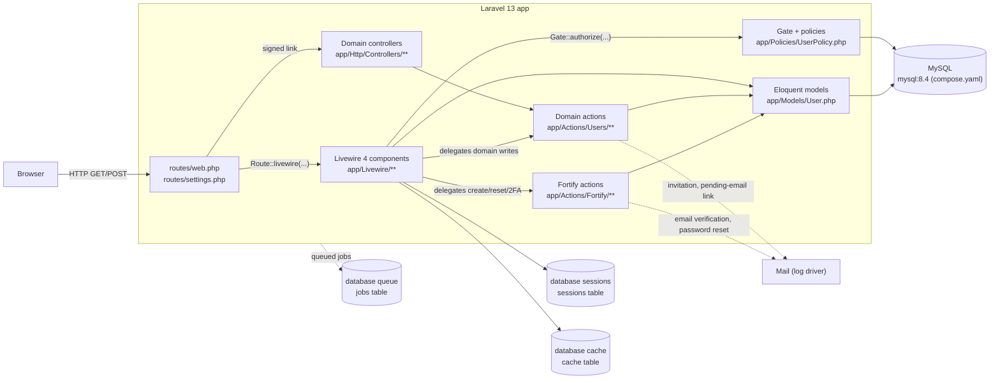

# Architecture Overview

## Table of Contents

- [What this application is](#what-this-application-is)
- [Request lifecycle](#request-lifecycle)
- [Runtime dependencies](#runtime-dependencies)
- [Cross-cutting concerns](#cross-cutting-concerns)
- [Deployment note](#deployment-note)
- [Where things live](#where-things-live)

## What this application is

`arospe` (Composer package `laravel/livewire-starter-kit`) is a Laravel 13 + Livewire 4 monolith built on the official Laravel Livewire starter kit. There is no separate frontend SPA and no REST API yet — Livewire components render server-driven UI directly.

Two concerns are layered on top of the starter kit baseline:

- **Authentication** via `laravel/fortify` (registration, login, password reset, email verification, 2FA, passkeys). See [Authentication](authentication.md).
- **Authorization** via `spatie/laravel-permission` (roles & permissions): two seeded roles, a 38-permission catalog, the `role`/`permission`/`role_or_permission` middleware aliases registered in [`bootstrap/app.php`](../../bootstrap/app.php), a `Gate::before` Super Admin bypass installed by `AppServiceProvider`, the first permission-gated route (`users.index`) and the first policy (`App\Policies\UserPolicy`) as of task 0004, and — as of task 0008 — the `Super Admin` role's own immutability/invisibility invariants on `App\Models\Role`. See [Authorization](authorization.md).

The domain layer beyond `App\Models\User` does not exist yet in the current codebase — `app/Models/` contains `User.php` plus `Role.php`, and the latter is not a domain model: it subclasses `spatie/laravel-permission`'s role model purely to carry the Super Admin role's invariants (see [Authorization](authorization.md#the-super-admin-roles-invariants)). What *has* grown around `User` is the layering the rest of the app will follow: single-purpose invokable **domain actions** in [`app/Actions/Users/`](../../app/Actions/Users) (`RequestEmailChange`, `ConfirmEmailChange`, `CreateUser`, `UpdateUser`) that own the write logic, with Livewire components and controllers as thin callers, and a **policy** deciding who may invoke them. This document (and this skill) will grow new `architecture/<module>.md` files as real domain modules land.

## Request lifecycle

- Web entry points are declared in [`routes/web.php`](../../routes/web.php) and [`routes/settings.php`](../../routes/settings.php); there is no `routes/api.php` in this app yet.
- **A Livewire action is a second entry point that skips most route middleware.** `POST /livewire/update` does not re-run the component's route middleware except for an allow-listed subset, which is why `users.index` gates with `can:` (on the allow-list) rather than `permission:` (not), and why the component re-authorizes through the Gate on every mutating method rather than trusting the route. See [security/livewire-authorization.md](../security/livewire-authorization.md).
- Fortify-owned routes (login, register, password reset, 2FA challenge, `.well-known/passkey-endpoints`) are registered by the `FortifyServiceProvider` from `config/fortify.php`, not by hand-written controllers.
- Session, cache, and queue all use the `database` driver (`SESSION_DRIVER`, `CACHE_STORE`, `QUEUE_CONNECTION` in `.env`), backed by the `sessions`, `cache`, and `jobs` tables created in `database/migrations/0001_01_01_000000_create_users_table.php` and `0001_01_01_000001_create_cache_table.php` / `0001_01_01_000002_create_jobs_table.php`.
- `MAIL_MAILER=log` in `.env` — outgoing mail (email verification, password reset) is written to the log, not actually delivered, in this environment.

## Runtime dependencies

| Concern | Driver (from `.env`) |
| --- | --- |
| Database | `mysql` |
| Session | `database` |
| Cache | `database` |
| Queue | `database` |
| Broadcasting | `log` |
| Mail | `log` |

No external services (S3, Redis, third-party APIs) are configured in this environment. When one is added, add it to this table and to the flowchart above.

## Cross-cutting concerns

Documented once, linked everywhere else — do not duplicate these explanations in other files:

- **Authentication, 2FA, passkeys** → [architecture/authentication.md](authentication.md)
- **Roles & permissions** → [architecture/authorization.md](authorization.md)
- **Database schema** → [database/schema.md](../database/schema.md)
- **Route/component contracts** → [api/routes.md](../api/routes.md)
- **Security rules from audits** → [security/README.md](../security/README.md)

## Deployment note

`php artisan db:seed --class=RolePermissionSeeder` is a **required** step on every deploy, not a developer convenience: `RolePermissionSeeder` is the only source of the roles and permissions the app authorizes against. Prefer that targeted form over a bare `db:seed` — see [authorization.md](authorization.md#seeding).

## Where things live

| Layer | Path |
| --- | --- |
| Routes | `routes/web.php`, `routes/settings.php` |
| Livewire components | `app/Livewire/**` |
| Domain controllers | `app/Http/Controllers/**` (HTTP boundary in front of an action) |
| Fortify actions | `app/Actions/Fortify/**` |
| Domain actions | `app/Actions/Users/**` |
| Policies | `app/Policies/**` (auto-discovered by name) |
| Notifications | `app/Notifications/**` |
| Shared validation rules | `app/Concerns/**` (e.g. [`ProfileValidationRules`](../../app/Concerns/ProfileValidationRules.php), [`PasswordValidationRules`](../../app/Concerns/PasswordValidationRules.php), [`UserValidationRules`](../../app/Concerns/UserValidationRules.php)) |
| Models | `app/Models/**` |
| Views | `resources/views/livewire/**`, `resources/views/layouts/**` |
| Migrations | `database/migrations/**` |
| Seeders | `database/seeders/**` (`RolePermissionSeeder` is deploy-critical — see above) |
| Middleware aliases & exception rendering | `bootstrap/app.php` |

_Last updated: 2026-08-18 — Task 0008: corrected the stale "`app/Models/` contains only `User.php`" claim — `App\Models\Role` now exists (a `spatie/laravel-permission` subclass carrying the Super Admin role's invariants, not a domain model) — and added that story's invariants to the Authorization bullet._

_Previously: 2026-08-13 — Task 0004: the request-lifecycle diagram had gone stale by omission — added the domain-controller, domain-action (`app/Actions/Users/**`) and Gate/policy layers that tasks 0003 and 0004 introduced, noted that a Livewire action is a second entry point that skips most route middleware, and extended "Where things live" to match._
