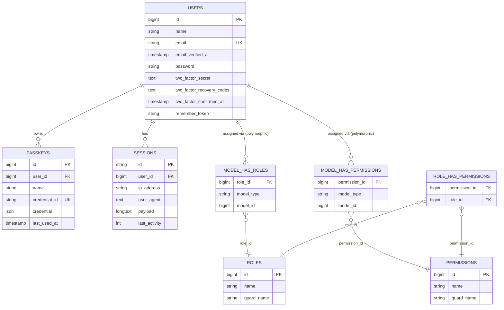

# Database Schema

## Table of Contents

- [ER diagram](#er-diagram)
- [Domain tables](#domain-tables)
- [Infrastructure tables](#infrastructure-tables)
- [Notes](#notes)

## ER diagram

Connection: `mysql` (`DB_CONNECTION=mysql` in `.env`, served by the `mysql:8.4` container in [`compose.yaml`](../../compose.yaml)). Only tables that carry a meaningful relationship are diagrammed; purely infrastructural tables (`cache`, `jobs`, `password_reset_tokens`) are listed in [Infrastructure tables](#infrastructure-tables) instead, since they have no foreign keys.

> The `model_has_roles` / `model_has_permissions` relationships to `USERS` are **polymorphic** (`model_type` + `model_id`, from `spatie/laravel-permission`) — `User` is the only morphable model in the codebase today. See [architecture/authorization.md](../architecture/authorization.md) for why these tables exist but aren't in active use yet.

## Domain tables

### `users`

Source: `database/migrations/0001_01_01_000000_create_users_table.php` + `database/migrations/2025_08_14_170933_add_two_factor_columns_to_users_table.php`.

Model: [`App\Models\User`](../../app/Models/User.php).

| Column | Type | Notes |
| --- | --- | --- |
| `id` | bigint PK | |
| `name` | string | |
| `email` | string, unique | |
| `email_verified_at` | timestamp, nullable | set null again on email change — see [architecture/authentication.md](../architecture/authentication.md) |
| `password` | string | hashed cast, `Hidden` |
| `two_factor_secret` | text, nullable | encrypted, `Hidden` |
| `two_factor_recovery_codes` | text, nullable | encrypted JSON, `Hidden` |
| `two_factor_confirmed_at` | timestamp, nullable | |
| `remember_token` | string, nullable | `Hidden` |

Relations: `hasMany` → `passkeys` (via `PasskeyAuthenticatable`), `hasMany` → `sessions` (informal, via `user_id`), polymorphic `morphToMany` → `roles`/`permissions` (via `HasRoles`, which **is** attached to `User` — though no roles/permissions are exercised anywhere in the app yet; see [authorization.md](../architecture/authorization.md)).

> **Planned (Epic 1) — not the current state.** The table above reflects real code today: `users.id` is a `bigint` auto-increment PK. Per [ADR 0001 — UUID primary keys](../decisions/0001-uuid-primary-keys.md), `users.id` will be migrated to a **UUID (v7)** primary key during Epic 1. That is a breaking alteration migration with a backfill and cascades to `passkeys.user_id` and `sessions.user_id` (retyped via `foreignUuid`) and to `spatie/laravel-permission`'s polymorphic `model_id` morph key (renamed to `model_uuid` and retyped to `uuid`). See the [Notes](#notes) section for the full planned scope.

### `passkeys`

Source: `database/migrations/2024_01_01_000000_create_passkeys_table.php`. Provided by `laravel/passkeys`, consumed through `PasskeyAuthenticatable` on `User`.

| Column | Type | Notes |
| --- | --- | --- |
| `id` | bigint PK | |
| `user_id` | bigint FK → `users.id` | `cascadeOnDelete()` |
| `name` | string | user-chosen label |
| `credential_id` | string, unique | WebAuthn credential ID |
| `credential` | json | full WebAuthn credential payload |
| `last_used_at` | timestamp, nullable | |

### `roles`, `permissions`, `model_has_roles`, `model_has_permissions`, `role_has_permissions`

Source: `database/migrations/2026_07_12_181045_create_permission_tables.php` (`spatie/laravel-permission`, teams disabled — see [config/permission.php](../../config/permission.php)). Column shapes follow the package defaults; see the migration file for the exact `Schema::create` calls, including the composite primary keys on the pivot tables. Usage status documented in [architecture/authorization.md](../architecture/authorization.md).

## Infrastructure tables

No foreign keys, not part of the ER diagram:

| Table | Source | Purpose |
| --- | --- | --- |
| `password_reset_tokens` | `0001_01_01_000000_create_users_table.php` | Fortify password-reset tokens, keyed by `email` |
| `sessions` | `0001_01_01_000000_create_users_table.php` | `SESSION_DRIVER=database` session storage |
| `cache` | `0001_01_01_000001_create_cache_table.php` | `CACHE_STORE=database` cache storage |
| `jobs` | `0001_01_01_000002_create_jobs_table.php` | `QUEUE_CONNECTION=database` job storage |

## Notes

- No domain model exists beyond `User` as of this writing — `app/Models/` has a single model. This file will grow a new section per model as the domain layer is built.
- For migration authoring conventions (naming, `down()` requirements, real examples), see [database/migrations.md](migrations.md).
- **Planned — UUID (v7) primary keys ([ADR 0001](../decisions/0001-uuid-primary-keys.md)).** Not yet implemented; the ER diagram and tables above still show the real `bigint` keys. The planned scope is:
  - `users.id` migrates from `bigint` to UUID (v7) in Epic 1 — a breaking alteration migration with a data backfill, cascading to `passkeys.user_id`, `sessions.user_id`, and the `spatie/laravel-permission` `model_has_roles` / `model_has_permissions` morph key (renamed `model_id` → `model_uuid`, retyped to `uuid`).
  - All future domain tables from PRD Epics 2 and 4 (products, product variants, product categories, blog categories, blog tags, blog posts — see [../PRD/PRD.md](../PRD/PRD.md)) are created with UUID PKs from the start; those are greenfield, with no migration complexity.
  - The model-side convention (`HasUuids`, `@property string $id`) is in [conventions/base-standards.md](../conventions/base-standards.md#uuid-primary-keys-convention-to-follow-not-yet-in-the-repo); the migration-side pattern is in [database/migrations.md](migrations.md#upcoming-convention-uuid-primary-keys).

_Last updated: 2026-07-21 — Added planned/upcoming notes for the Epic 1 UUIDv7 migration of `users` and greenfield UUID PKs for Epic 2/4 tables (ADR 0001); corrected the `users` Relations line — `HasRoles` is attached in real code today._
