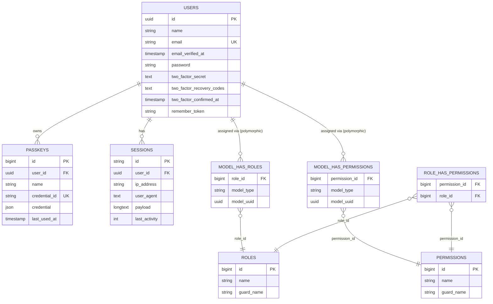

# Database Schema

## Table of Contents

- [ER diagram](#er-diagram)
- [Domain tables](#domain-tables)
- [Infrastructure tables](#infrastructure-tables)
- [Notes](#notes)

## ER diagram

Connection: `mysql` (`DB_CONNECTION=mysql` in `.env`, served by the `mysql:8.4` container in [`compose.yaml`](../../compose.yaml)). Only tables that carry a meaningful relationship are diagrammed; purely infrastructural tables (`cache`, `jobs`, `password_reset_tokens`) are listed in [Infrastructure tables](#infrastructure-tables) instead, since they have no foreign keys.

> The `model_has_roles` / `model_has_permissions` relationships to `USERS` are **polymorphic** (`model_type` + `model_uuid`, from `spatie/laravel-permission`) — `User` is the only morphable model in the codebase today. The morph key column is `model_uuid` (UUID-typed), renamed from the package default `model_id` (bigint) when `users.id` became a UUID — see [architecture/authorization.md](../architecture/authorization.md), which is also where the seeded roles, the permission catalog and how they are checked are documented.

## Domain tables

### `users`

Source: `database/migrations/0001_01_01_000000_create_users_table.php` + `database/migrations/2025_08_14_170933_add_two_factor_columns_to_users_table.php`, with the primary key converted to UUID by `database/migrations/2026_07_22_100001_convert_id_to_uuid_in_users_table.php` … `2026_07_22_100005_finalize_uuid_primary_key_on_users_table.php` (5 alteration migrations layered on top — the historical `create_*` files were not touched; see [migrations.md](migrations.md#uuid-primary-keys)).

Model: [`App\Models\User`](../../app/Models/User.php).

| Column | Type | Notes |
| --- | --- | --- |
| `id` | uuid (v7) PK | `CHAR(36)`; generated by `HasUuids` — see [ADR 0001](../decisions/0001-uuid-primary-keys.md) |
| `name` | string | |
| `email` | string, unique | |
| `email_verified_at` | timestamp, nullable | set null again on email change — see [architecture/authentication.md](../architecture/authentication.md) |
| `password` | string | hashed cast, `Hidden` |
| `two_factor_secret` | text, nullable | encrypted, `Hidden` |
| `two_factor_recovery_codes` | text, nullable | encrypted JSON, `Hidden` |
| `two_factor_confirmed_at` | timestamp, nullable | |
| `remember_token` | string, nullable | `Hidden` |

Relations: `hasMany` → `passkeys` (via `PasskeyAuthenticatable`), `hasMany` → `sessions` (informal, via `user_id`), polymorphic `morphToMany` → `roles`/`permissions` (via `HasRoles`; roles and permissions are seeded and in active use — see [authorization.md](../architecture/authorization.md)).

> **Done (Epic 1) — current state.** `users.id` is a **UUID (v7)** string primary key generated by the `HasUuids` trait, per [ADR 0001 — UUID primary keys](../decisions/0001-uuid-primary-keys.md). This was a breaking alteration-with-backfill (not a fresh `create_table`) that cascaded to `passkeys.user_id`, `sessions.user_id` (both retyped to UUID), and `spatie/laravel-permission`'s polymorphic morph key (renamed `model_id` → `model_uuid`, retyped to `uuid`). The other six UUID entities from ADR 0001 (Epic 2/4) are **still future** — see [Notes](#notes).

### `passkeys`

Source: `database/migrations/2024_01_01_000000_create_passkeys_table.php`. Provided by `laravel/passkeys`, consumed through `PasskeyAuthenticatable` on `User`.

| Column | Type | Notes |
| --- | --- | --- |
| `id` | bigint PK | passkey's own PK stays `bigint` — only the FK changed |
| `user_id` | uuid FK → `users.id` | `CHAR(36)`; `cascadeOnDelete()`, FK re-added by the finalize migration once both sides are UUID |
| `name` | string | user-chosen label |
| `credential_id` | string, unique | WebAuthn credential ID |
| `credential` | json | full WebAuthn credential payload |
| `last_used_at` | timestamp, nullable | |

### `roles`, `permissions`, `model_has_roles`, `model_has_permissions`, `role_has_permissions`

Source: `database/migrations/2026_07_12_181045_create_permission_tables.php` (`spatie/laravel-permission`, teams disabled — see [config/permission.php](../../config/permission.php)). Column shapes follow the package defaults; see the migration file for the exact `Schema::create` calls, including the composite primary keys on the pivot tables.

**Populated by [`database/seeders/RolePermissionSeeder.php`](../../database/seeders/RolePermissionSeeder.php)**, which is the only source of this data — the app is non-functional until it has run, so seeding is a required deployment step:

| Table | Seeded rows | Notes |
| --- | --- | --- |
| `roles` | 2 | `Super Admin`, `Administrator`, both `guard_name = web` |
| `permissions` | 38 | 9 modules × 4 CRUD actions, plus `roles.manage` and `roles.manage-administrators` |
| `role_has_permissions` | 37 | `Administrator` holds everything except `roles.manage-administrators`; `Super Admin` holds none |
| `model_has_roles` | 0 or 1 | one row only when `SUPER_ADMIN_EMAIL` resolves to a user (see the bootstrap branches in [authorization.md](../architecture/authorization.md#super-admin-bootstrap)) |
| `model_has_permissions` | 0 | no permission is granted directly to a user; grants are role-level only |

The names, the grants and the `Gate::before` bypass that lets `Super Admin` pass without any `role_has_permissions` row are documented in [architecture/authorization.md](../architecture/authorization.md).

## Infrastructure tables

No foreign keys, not part of the ER diagram:

| Table | Source | Purpose |
| --- | --- | --- |
| `password_reset_tokens` | `0001_01_01_000000_create_users_table.php` | Fortify password-reset tokens, keyed by `email` |
| `sessions` | `0001_01_01_000000_create_users_table.php` | `SESSION_DRIVER=database` session storage |
| `cache` | `0001_01_01_000001_create_cache_table.php` | `CACHE_STORE=database` cache storage |
| `jobs` | `0001_01_01_000002_create_jobs_table.php` | `QUEUE_CONNECTION=database` job storage |

## Notes

- No domain model exists beyond `User` as of this writing — `app/Models/` has a single model. This file will grow a new section per model as the domain layer is built.
- For migration authoring conventions (naming, `down()` requirements, real examples), see [database/migrations.md](migrations.md).
- **UUID (v7) primary keys ([ADR 0001](../decisions/0001-uuid-primary-keys.md)).** Status is split:
  - **Done:** `users.id` is a UUID (v7) `CHAR(36)` PK (Epic 1), applied by the 5 alteration migrations `2026_07_22_100001..100005_*.php`. The cascade is complete: `passkeys.user_id`, `sessions.user_id`, and the `spatie/laravel-permission` `model_has_roles` / `model_has_permissions` morph key (renamed `model_id` → `model_uuid`, retyped to `uuid`) all match. The ER diagram and tables above reflect this real, current state.
  - **Still future:** the other six UUID entities from PRD Epics 2 and 4 (products, product variants, product categories, blog categories, blog tags, blog posts — see [../PRD/PRD.md](../PRD/PRD.md)) do not exist in code yet. They will be created with UUID PKs from the start — greenfield, with no migration complexity.
  - The model-side convention (`HasUuids`, `@property string $id`) is in [conventions/base-standards.md](../conventions/base-standards.md#uuid-primary-keys); the migration-side pattern is in [database/migrations.md](migrations.md#uuid-primary-keys).

_Last updated: 2026-08-10 — The five `spatie/laravel-permission` tables are now seeded and in active use (task 0002): replaced the "exist but aren't in active use yet" notes with a seeded-row table (2 roles, 38 permissions, 37 grants) citing `RolePermissionSeeder`._
