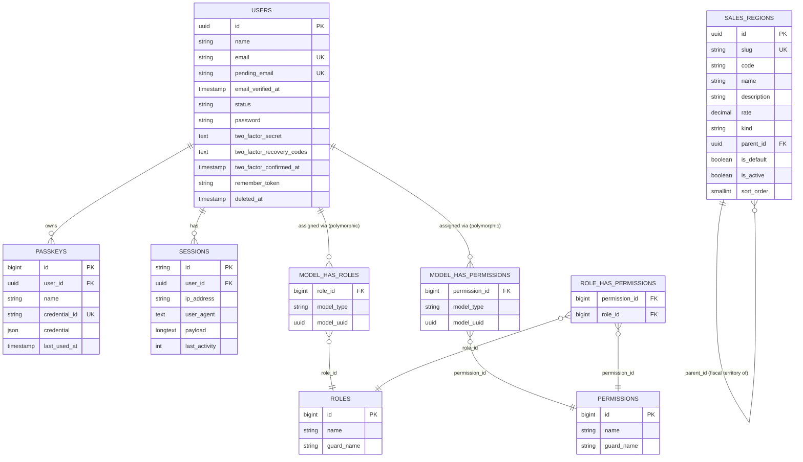

# Database Schema

## Table of Contents

- [ER diagram](#er-diagram)
- [Domain tables](#domain-tables)
- [Infrastructure tables](#infrastructure-tables)
- [Notes](#notes)

## ER diagram

Connection: `mysql` (`DB_CONNECTION=mysql` in `.env`, served by the `mysql:8.4` container in [`compose.yaml`](../../compose.yaml)). Only tables that carry a meaningful relationship are diagrammed; purely infrastructural tables (`cache`, `jobs`, `password_reset_tokens`) are listed in [Infrastructure tables](#infrastructure-tables) instead, since they have no foreign keys.



> The `model_has_roles` / `model_has_permissions` relationships to `USERS` are **polymorphic** (`model_type` + `model_uuid`, from `spatie/laravel-permission`) — `User` is the only morphable model in the codebase today. The morph key column is `model_uuid` (UUID-typed), renamed from the package default `model_id` (bigint) when `users.id` became a UUID — see [architecture/authorization.md](../architecture/authorization.md), which is also where the seeded roles, the permission catalog and how they are checked are documented.

## Domain tables

### `users`

Source: `database/migrations/0001_01_01_000000_create_users_table.php` + `database/migrations/2025_08_14_170933_add_two_factor_columns_to_users_table.php`, with the primary key converted to UUID by `database/migrations/2026_07_22_100001_convert_id_to_uuid_in_users_table.php` … `2026_07_22_100005_finalize_uuid_primary_key_on_users_table.php` (5 alteration migrations layered on top — the historical `create_*` files were not touched; see [migrations.md](migrations.md#uuid-primary-keys)), and the account-state columns added by `database/migrations/2026_08_11_175426_add_status_to_users_table.php` and `database/migrations/2026_08_11_175427_add_pending_email_to_users_table.php`, plus the soft-delete column added by `database/migrations/2026_08_14_183432_add_soft_deletes_to_users_table.php`.

Model: [`App\Models\User`](../../app/Models/User.php).

Columns are listed in real physical order (verified with `php artisan db:table users`):

| Column | Type | Notes |
| --- | --- | --- |
| `id` | uuid (v7) PK | `CHAR(36)`; generated by `HasUuids` — see [ADR 0001](../decisions/0001-uuid-primary-keys.md) |
| `name` | string | |
| `email` | string, unique | canonically lowercase; a *change* to this column only lands once its verification link is used — see [architecture/authentication.md](../architecture/authentication.md#pending-email-changes) |
| `pending_email` | string, nullable, unique | the address a pending email change is waiting on; **not** mass-assignable (omitted from `#[Fillable]`), written only via `forceFill()` by `App\Actions\Users\RequestEmailChange` / `ConfirmEmailChange` |
| `email_verified_at` | timestamp, nullable | proof of mailbox control; set by Fortify's verification, by completing the invitation/reset flow, and by confirming a pending email change. It is **no longer** nulled on an email change — the address does not move until it is verified |
| `status` | `VARCHAR(20)`, default `inactive` | cast to [`App\Enums\UserStatus`](../../app/Enums/UserStatus.php) (`active` / `inactive` / `suspended`); **not** mass-assignable. Since task 0007 this column is an **authentication control**, not a label — only `active` obtains a session, on every sign-in path. See [architecture/authentication.md](../architecture/authentication.md#account-status-and-activation) and [the sign-in block](../architecture/authentication.md#sign-in-the-account-status-block) |
| `password` | string | hashed cast, `Hidden` |
| `two_factor_secret` | text, nullable | encrypted, `Hidden` |
| `two_factor_recovery_codes` | text, nullable | encrypted JSON, `Hidden` |
| `two_factor_confirmed_at` | timestamp, nullable | |
| `remember_token` | string, nullable | `Hidden` |
| `deleted_at` | timestamp, nullable | added `after('updated_at')`, so it is physically the last column; the `SoftDeletes` marker — see [Soft deletes](#soft-deletes) below |

Two notes on the account-state columns, both deliberate:

- **`status` carries no index.** Not a selectivity argument — a narrow secondary index genuinely would be chosen for `COUNT(*) WHERE status = 'active'` given this table's unusually fat clustered index (`CHAR(36)` PK + two `TEXT` columns). The reason is cardinality: a backoffice `users` table is 10²–10³ rows, so both queries resolve in a sub-millisecond clustered scan while an index costs a write on every insert/update. If one is ever added it must be composite `(deleted_at, status)`, never plain `status`, because the `SoftDeletingScope` puts `deleted_at IS NULL` into every one of those queries. Task 0007 does not change this reasoning: the sign-in block reads `status` off a row already fetched by the `email` unique index, so it adds no `WHERE status = …` query to the hot path.
- **`pending_email` is `unique` and nullable on purpose.** Both MySQL and SQLite allow unlimited `NULL`s in a unique index, so the constraint only binds rows actually holding a pending address — making "two accounts cannot be waiting on the same address" a database invariant rather than a validation-only one. It is the last-word guard behind the application checks documented in [security/signed-link-verification.md](../security/signed-link-verification.md#a-pre-flight-check-is-not-a-race-guard--re-check-under-a-lock-and-let-the-unique-index-have-the-last-word).

Relations: `hasMany` → `passkeys` (via `PasskeyAuthenticatable`), `hasMany` → `sessions` (informal, via `user_id`), polymorphic `morphToMany` → `roles`/`permissions` (via `HasRoles`; roles and permissions are seeded and in active use — see [authorization.md](../architecture/authorization.md)).

#### Soft deletes

`App\Models\User` is the only model in this codebase using `Illuminate\Database\Eloquent\SoftDeletes` (task 0005). Deleting a user is an `UPDATE` that stamps `deleted_at`, never a `DELETE`, so **every relation physically survives** — `passkeys` rows included, because the `cascadeOnDelete()` FK only fires on a real `DELETE`, and `model_has_roles` / `model_has_permissions` rows too, because Spatie's detach-on-delete hook opts out for soft deletes. The trashed row then disappears from every query built on `User::query()` / `newQuery()`, which is what removes it from the users list, from route-model binding, and from every authentication lookup at once.

Deleting also **rewrites the row's identifying columns**, which is the part that matters at schema level: `App\Models\User::delete()` is overridden to obfuscate the address before the soft delete, in one transaction:

```php
// app/Models/User.php
return DB::transaction(function (): bool {
    $originalEmail = $this->getRawOriginal('email');

    DB::table('password_reset_tokens')
        ->whereIn('email', array_unique([$originalEmail, Str::lower($originalEmail)]))
        ->delete();

    $this->forceFill([
        'email' => "deleted+{$this->id}@deleted.invalid",
        'email_verified_at' => null,
        'pending_email' => null,
    ])->saveQuietly();

    return (bool) parent::delete();
});
```

Consequences to know before writing a query against `users`:

- **The original address is gone, not archived.** This app has no audit-log table; freeing the address for reuse was chosen deliberately over retaining it. `deleted+{id}@deleted.invalid` is anchored to the immutable UUID `id` (`.invalid` is RFC 2606-reserved, so it can never collide with a registrable address), which makes it deterministic and greppable back to the `passkeys` / `sessions` rows it left behind.
- **Both unique addresses are released**: `email` is replaced and `pending_email` is nulled, so a new user can immediately take either — and any outstanding pending-email confirmation link stops working, since [`ConfirmEmailChange`](../../app/Actions/Users/ConfirmEmailChange.php) aborts when `pending_email` no longer matches the address the signature is bound to.
- **`password_reset_tokens` rows keyed by the old address are deleted in the same transaction.** That table is keyed by the email *string* with no FK, so recycling the address without revoking the token would hand the deleted user's still-valid reset link to whoever claims the address next. The full reasoning, and why the query normalises case explicitly instead of relying on the connection collation, is in [security/soft-delete-patterns.md](../security/soft-delete-patterns.md#freeing-an-identifier-means-revoking-everything-keyed-by-its-string-not-just-the-row).
- **Never bulk-delete `users` through the query builder.** `User::where(...)->delete()` bypasses the model entirely, so it skips all of the above — leaving live addresses on trashed rows and their reset tokens valid. Every call site in this repo uses instance `->delete()`; see [conventions/base-standards.md](../conventions/base-standards.md#deleting-a-user-goes-through-the-model-not-the-query-builder).
- **A restored user keeps the placeholder address.** `SoftDeletes::restore()` exists on the model for free but has no call site anywhere in the app; a restore flow would have to re-enter the address through the pending-email flow, and re-grant roles as an explicit decision (see the same security page).

Two index decisions were made deliberately here and are **not** oversights:

- **No index on `deleted_at`.** On MySQL 8.4 at this table's size, `deleted_at IS NULL` matches the large majority of rows, so the optimizer would very likely scan anyway while every insert and delete pays to maintain the index. If one is ever needed, the right shape is the composite `(deleted_at, status)` described in the `status` note above — never a standalone `deleted_at`.
- **No change to the `email` unique index.** Obfuscation frees the address without touching the constraint. A composite unique on `(email, deleted_at)` was considered and **rejected as unsafe on MySQL**: `NULL <> NULL` for uniqueness purposes, so all active users (`deleted_at IS NULL`) would stop being constrained against sharing an address — a regression on the exact invariant that has to hold. Note the flip side, verified during the audit: `Rule::unique(User::class)` does **not** apply the soft-delete scope, so validation still sees trashed rows and a live user cannot claim a tombstone address.

> **Done (Epic 1) — current state.** `users.id` is a **UUID (v7)** string primary key generated by the `HasUuids` trait, per [ADR 0001 — UUID primary keys](../decisions/0001-uuid-primary-keys.md). This was a breaking alteration-with-backfill (not a fresh `create_table`) that cascaded to `passkeys.user_id`, `sessions.user_id` (both retyped to UUID), and `spatie/laravel-permission`'s polymorphic morph key (renamed `model_id` → `model_uuid`, retyped to `uuid`). The other six UUID entities from ADR 0001 (Epic 2/4) are **still future** — see [Notes](#notes).

### `passkeys`

Source: `database/migrations/2024_01_01_000000_create_passkeys_table.php`. Provided by `laravel/passkeys`, consumed through `PasskeyAuthenticatable` on `User`.

| Column | Type | Notes |
| --- | --- | --- |
| `id` | bigint PK | passkey's own PK stays `bigint` — only the FK changed |
| `user_id` | uuid FK → `users.id` | `CHAR(36)`; `cascadeOnDelete()`, FK re-added by the finalize migration once both sides are UUID |
| `name` | string | user-chosen label |
| `credential_id` | string, unique | WebAuthn credential ID |
| `credential` | json | full WebAuthn credential payload |
| `last_used_at` | timestamp, nullable | |

### `roles`, `permissions`, `model_has_roles`, `model_has_permissions`, `role_has_permissions`

Source: `database/migrations/2026_07_12_181045_create_permission_tables.php` (`spatie/laravel-permission`, teams disabled — see [config/permission.php](../../config/permission.php)). Column shapes follow the package defaults; see the migration file for the exact `Schema::create` calls, including the composite primary keys on the pivot tables.

Models: `permissions` is the package's own `Spatie\Permission\Models\Permission`; `roles` is [`App\Models\Role`](../../app/Models/Role.php) since task 0008 (`config/permission.php`'s `models.role` binding), a subclass adding the Super Admin role's immutability guards and the `selectable()` scope — **no schema change, no migration, and no new column**. Application code must never reach the `roles` table through the package class, which carries none of those guards; see [architecture/authorization.md](../architecture/authorization.md#one-role-model-class-in-application-code).

**Both privilege tiers are identified by `roles.name`, and that identity is resolved on the model — never by a query written at a call site.** Task 0008a added `Role::isAdministratorRole(self $role)` and `Role::isSuperAdminRoleRow(self $role)`, both `public static`, both delegating to a private `persistedName()` extracted from the pre-existing Super Admin guard. Again **no schema change**. Two consequences that matter when writing a query against this table:

- **`persistedName()` may issue its own `SELECT`.** For an existing row whose `name` column was never hydrated it reads the name back from the database rather than trusting the in-memory attribute, so a partially-hydrated `Role` still answers correctly. Resolve a role with a plain `Role::query()->find($id)` (full `select *`) at the call site anyway — the helper survives a `select('id')`, but the call site should not create the situation.
- **A tier check never reads `guard_name`.** Both helpers match on `name` alone, deliberately; see [architecture/authorization.md](../architecture/authorization.md#known-limitations--what-is-not-closed) for why that is fail-closed in both directions.

`roles` carries `unique(name, guard_name)`, which is what makes name-based identification of the Super Admin role safe at row level — but it is *not* what prevents a role acquiring that name, since the index only forbids a duplicate of an already-occupied pair. See [security/authorization-patterns.md](../security/authorization-patterns.md#confirmed-safe-role-name-collision-is-closed-by-a-creationrename-guard-not-by-the-database-alone).

**`roles.name` is compared case-insensitively by the database and byte-exactly by PHP, and the seeder has to reconcile the two.** The column carries `utf8mb4_unicode_ci` (`config/database.php`), so the unique index treats `administrator` and `Administrator` as the same value while every identity check in the app is a `===`. `firstOrCreate()` would therefore silently **adopt** a colliding row instead of creating the intended one, so both seeded-role creation paths read the persisted name back and throw `ImmutableRoleException` when it does not match byte-for-byte — `Role::firstOrCreateSuperAdminRole()` and, since task 0010, its exact mirror image `Role::firstOrCreateAdministratorRole()`. Both are `withoutEvents()` factory methods on the model, and `RolePermissionSeeder` calls nothing else: a raw `firstOrCreate()` on either name is now refused by the model's own `creating` guard. See [architecture/authorization.md](../architecture/authorization.md#the-seeder-writes-the-same-name-the-guards-read).

**Since task 0010 a `roles` row can also be refused deletion for a non-privilege reason.** `App\Models\Role`'s `deleting` guards now include a holder-count check (`users()->withTrashed()->exists()`), so any role — protected tier or ordinary custom role — is undeletable while `model_has_roles` still references it, and the refusal is a 409 rather than a 403. Soft-deleted holders count: the FK cascade on `model_has_roles` would otherwise destroy a trashed user's grant with no error anywhere. Same schema, no migration and no new column; see [architecture/authorization.md](../architecture/authorization.md#layer-1-registration-order-is-the-whole-point).

**Populated by [`database/seeders/RolePermissionSeeder.php`](../../database/seeders/RolePermissionSeeder.php)**, which is the only source of this data — the app is non-functional until it has run, so seeding is a required deployment step:

| Table | Seeded rows | Notes |
| --- | --- | --- |
| `roles` | 2 | `Super Admin`, `Administrator`, both `guard_name = web` — plus any custom role created from the [Roles screen](../api/routes.md#rolesindex--the-second-permission-gated-route), which the seeder neither creates nor touches |
| `permissions` | 38 | 9 modules × 4 CRUD actions, plus `roles.manage` and `roles.manage-administrators` |
| `role_has_permissions` | 37 | `Administrator` holds everything except `roles.manage-administrators`; `Super Admin` holds none |
| `model_has_roles` | 0 or 1 | one row only when `SUPER_ADMIN_EMAIL` resolves to a user (see the bootstrap branches in [authorization.md](../architecture/authorization.md#super-admin-bootstrap)) |
| `model_has_permissions` | 0 | no permission is granted directly to a user; grants are role-level only |

The names, the grants and the `Gate::before` bypass that lets `Super Admin` pass without any `role_has_permissions` row are documented in [architecture/authorization.md](../architecture/authorization.md).

### `sales_regions`

Source: `database/migrations/2026_08_19_204256_create_sales_regions_table.php` (task 0016) — the repo's **first greenfield UUID `create_*` migration**, and the first table of the Products/Taxes domain ([PRD Epic 2 §2.1](../PRD/PRD.md)). A tax rule *is* a Sales Region row: there is no separate tax table.

Model: [`App\Models\SalesRegion`](../../app/Models/SalesRegion.php). Columns in real physical order (verified with `php artisan db:table sales_regions`):

| Column | Type | Notes |
| --- | --- | --- |
| `id` | uuid (v7) PK | `CHAR(36)`; generated by `HasUuids`. Not one of [ADR 0001](../decisions/0001-uuid-primary-keys.md)'s seven entities — see [Notes](#notes) |
| `slug` | `VARCHAR(64)`, unique | the seeder's **immutable identity key**, never `code`; not mass-assignable. Uniqueness here is a correctness constraint, not a performance one |
| `code` | `VARCHAR(10)`, nullable | administrator-editable display/fiscal chip (`ES`, `ES-CN`). Explicitly length-capped for the same reason as `users.status` — a bare `string()` is `VARCHAR(255)` for a 2–6 character token |
| `name` | `VARCHAR(150)` | canonical name, in Spanish; seeder-owned and **not** mass-assignable. Deliberately not `TEXT` — see the fat-clustered-index note on `users` above |
| `description` | `VARCHAR(255)`, nullable | administrator-editable |
| `rate` | `DECIMAL(6,3)`, nullable | **never `float`** — this value feeds order tax arithmetic and binary floating point cannot hold `21.00` exactly. `NULL` means *not configured*; `0.000` is a legitimate 0% rate, so the two cannot share a representation. `(6,3)` holds `100.000` exactly and accommodates 3-decimal non-EU rates. No `->unsigned()` (deprecated on `DECIMAL` since MySQL 8.0.17); negative-rate rejection is validation's job, not the column's |
| `kind` | `VARCHAR(20)`, **no default** | cast to [`App\Enums\SalesRegionKind`](../../app/Enums/SalesRegionKind.php) (`country` / `fiscal_territory`). `string` + a PHP backed enum over a native MySQL `enum`, the same precedent as `users.status`. No default on purpose: every row is written explicitly, and a default would let a mis-seeded row pass as a `Country` |
| `parent_id` | uuid FK → `sales_regions.id`, nullable | self-referencing, `restrictOnDelete()` — see [The two-tier tree](#the-two-tier-tree-and-its-invariant) below |
| `is_default` | boolean, default `false` | exactly one row carries it after seeding; **no database constraint enforces that** — see the index notes below |
| `is_active` | boolean, default `false` | the catalog's soft state; rows are deactivated, never deleted |
| `sort_order` | `SMALLINT UNSIGNED`, default `0` | Spain's territories are listed in **fiscal** order (Península, Baleares, Canarias, Ceuta, Melilla), which is neither alphabetical nor recoverable from any other column |

**No `SoftDeletes`, deliberately.** `is_active` *is* the soft state, and a `deleted_at` would actively fight the seeder: a trashed row is invisible to the seeder's lookup, so the next re-seed would insert a duplicate.

#### The two-tier tree and its invariant

The catalog is an adjacency list that is **exactly one level deep by domain definition**: ~249 top-level ISO countries, and beneath the `es` ("España") row its five fiscal territories. `kind === FiscalTerritory` if and only if `parent_id IS NOT NULL` — an invariant the enum's docblock states and the seeder enforces (it aborts rather than write a territory with a null parent; see [security/seeder-safety.md](../security/seeder-safety.md#a-catalog-seeder-must-fail-loudly-rather-than-commit-a-structurally-invalid-catalog)). Nothing in the database enforces the depth limit, so a query may assume two tiers only because the seeder is the sole writer of `parent_id` (it is omitted from `#[Fillable]`).

`restrictOnDelete()`, not `cascadeOnDelete()`: cascading would let deleting the "España" row silently destroy five administrator-configured tax rates. `constrained('sales_regions')` is passed the table name explicitly — Laravel would otherwise infer a `parents` table from the column name.

#### Seeded state, and which columns a re-seed may touch

Populated by [`database/seeders/SalesRegionSeeder.php`](../../database/seeders/SalesRegionSeeder.php) from the bundled fixture [`database/data/iso-3166-countries.json`](../../database/data/iso-3166-countries.json) (249 identity-only entries) plus the seeder's own `SPAIN_TERRITORIES` constant. Like the permission catalog, this is **required application data**: it is seeded unconditionally, outside `DatabaseSeeder`'s `['local', 'testing']` fixture gate, and composed into `ProductionSeeder` so a production runbook names one class forever.

| Rows | `kind` | `is_active` | `rate` |
| --- | --- | --- | --- |
| ~248 ISO countries | `country` | `false` | `NULL` |
| España (`es`) | `country` | `true` | `NULL` — a disclosure node, not independently rateable |
| Península, Baleares, Canarias, Ceuta, Melilla | `fiscal_territory` | `true` | configured |

≈254 rows, of which 6 are active and exactly one (`es-peninsula`, `SalesRegionSeeder::DEFAULT_SLUG`) carries `is_default`. **Reference the seeder's `DEFAULT_SLUG` / `SPAIN_SLUG` constants rather than restating the literal strings** — the same convention `RolePermissionSeeder::MODULES` established.

The columns split into two sets with **opposite re-seed behaviour**, and this split is the table's most load-bearing property:

| Set | Columns | Re-seed behaviour |
| --- | --- | --- |
| **Seeder-owned** | `slug`, `name`, `parent_id`, `kind`, `sort_order` | **always refreshed** — overwriting `name` is how a corrected canonical name ("Turkey" → "Türkiye") reaches an already-deployed install |
| **Administrator-configurable** | `code`, `description`, `rate`, `is_active`, `is_default` | **written only on insert; never touched on update** |

So `upsert()` / `updateOrCreate()` with a full payload are forbidden against this table: the reflexive "idempotent seeder" shape would reset every administrator-configured rate, code and flag on the next deploy. The mass-assignment guard behind it is the usual one — `#[Fillable(['code', 'description', 'rate'])]`, everything else written by `forceFill()` from the seeder alone. Why `is_active` is omitted *because* `is_default` is, and why the seeder's idempotency key is byte-exact in PHP while `slug`'s `utf8mb4_unicode_ci` collation is not, are in [security/seeder-safety.md](../security/seeder-safety.md#confirmed-safe-split-seeder-owned-from-administrator-configurable-columns-upsert-is-the-wrong-default).

#### Indexes — one present by choice, one by requirement, four omitted

`php artisan db:table sales_regions` shows exactly three: `primary` on `id`, `sales_regions_slug_unique`, and `sales_regions_parent_id_foreign`. That is the intended list.

- **`slug` UNIQUE** is the seeder's idempotency key and the resolution key a future tax lookup will use.
- **The FK index on `parent_id` is InnoDB's requirement, not a discretionary choice** — and the migration therefore does **not** write an explicit `$table->index('parent_id')`. This diverges from `create_passkeys_table`'s explicit `$table->index('user_id')` on purpose; see [migrations.md](migrations.md#an-fk-column-does-not-also-get-an-explicit-index-here).
- **Omitted on `code`** — nothing joins or filters on it, and a UNIQUE would create a real re-seed failure mode now that `code` is administrator-editable: the seeder writes `ES` while an administrator has moved `ES` elsewhere, and the seed aborts mid-transaction with an opaque `23000`.
- **Omitted on `is_default`, `is_active`, `kind` and `name`** — cardinality, not selectivity, the same reasoning applied to `users.status` above. A boolean over 254 near-read-only rows is the worst possible index candidate.
- **No UNIQUE on `(parent_id, name)`** — `slug` already forbids a duplicate entity, and a unique index over a utf8mb4 `name` would make the invariant depend on collation ("España" vs. "Espana").

> ⚠️ **Nothing in the database enforces at-most-one `is_default`.** MySQL 8.4 has no partial indexes, but a `STORED` generated column (`CASE WHEN is_default THEN 1 END`) plus a UNIQUE on it does enforce it, since unique indexes ignore `NULL`s. It was deliberately **not** adopted here — it would force the "clear old, set new" update into a strict ordering — and is left for the story that enforces the single-default invariant. Today the property holds only because the seeder's default write is repair-only (it fires solely when no row is flagged at all) and `is_default` is not mass-assignable.

## Infrastructure tables

No foreign keys, not part of the ER diagram:

| Table | Source | Purpose |
| --- | --- | --- |
| `password_reset_tokens` | `0001_01_01_000000_create_users_table.php` | Fortify password-reset tokens (and administrator invitations), keyed by `email` with no FK to `users` — which is why `User::delete()` deletes the rows for a deleted account's address itself (see [Soft deletes](#soft-deletes)) |
| `sessions` | `0001_01_01_000000_create_users_table.php` | `SESSION_DRIVER=database` session storage |
| `cache` | `0001_01_01_000001_create_cache_table.php` | `CACHE_STORE=database` cache storage |
| `jobs` | `0001_01_01_000002_create_jobs_table.php` | `QUEUE_CONNECTION=database` job storage |

## Notes

- `app/Models/` holds three classes and they are three different kinds of thing: `User` (Epic 1's domain model), `SalesRegion` (task 0016 — the first Epic 2 domain model, and the first table this repo created greenfield with a UUID PK), and `Role`, which is a `spatie/laravel-permission` subclass over the package's existing `roles` table rather than a new entity — it adds no column and no migration (see [architecture/authorization.md](../architecture/authorization.md#the-super-admin-roles-invariants)). This file grows a new section per table as the domain layer is built.
- For migration authoring conventions (naming, `down()` requirements, real examples), see [database/migrations.md](migrations.md).
- **UUID (v7) primary keys ([ADR 0001](../decisions/0001-uuid-primary-keys.md)).** Status is split:
  - **Done:** `users.id` is a UUID (v7) `CHAR(36)` PK (Epic 1), applied by the 5 alteration migrations `2026_07_22_100001..100005_*.php`. The cascade is complete: `passkeys.user_id`, `sessions.user_id`, and the `spatie/laravel-permission` `model_has_roles` / `model_has_permissions` morph key (renamed `model_id` → `model_uuid`, retyped to `uuid`) all match. The ER diagram and tables above reflect this real, current state.
  - **Still future:** the other six UUID entities ADR 0001 names (products, product variants, product categories, blog categories, blog tags, blog posts — PRD Epics 2 and 4, see [../PRD/PRD.md](../PRD/PRD.md)) do not exist in code yet. They will be created with UUID PKs from the start — greenfield, with no migration complexity.
  - **Beyond ADR 0001's seven:** `sales_regions` (task 0016) is a UUID (v7) PK table that ADR 0001 does **not** name, under a confirmed project-wide policy that generalizes the ADR — UUID v7 for every new Epic 2 business entity, with a high-volume internal geography lookup table explicitly excepted and left `bigint`. Recorded honestly: ADR 0001's *stated* rationale is enumeration safety, and a fixed public country catalog has nothing to enumerate, so this key is consistency-driven rather than rationale-driven (a mixed-PK domain is worse than an over-provisioned key on 254 rows). **Amending ADR 0001 to record that policy is a deferred follow-up task**, so until it lands the ADR's seven-entity list reads narrower than what the code does.
  - The model-side convention (`HasUuids`, `@property string $id`) is in [conventions/base-standards.md](../conventions/base-standards.md#uuid-primary-keys); the migration-side pattern is in [database/migrations.md](migrations.md#uuid-primary-keys).

_Last updated: 2026-08-20 — Task 0010 (Roles & permissions management — backend): the `roles` table is now written by the application, not only by the seeder, with **no schema change**. Corrected the collation paragraph, which said the Administrator creation path threw `RuntimeException` from a line in `RolePermissionSeeder` — both seeded-role paths are now `withoutEvents()` factory methods on `App\Models\Role` throwing `ImmutableRoleException`. Added the holder-count `deleting` guard (a 409, not a 403, and soft-deleted holders count) and noted in the seeded-rows table that custom roles now coexist with the two seeded ones._

_Previously: 2026-08-20 — Task 0016 (Sales Region catalog schema + seeder): added the `sales_regions` domain-table section (columns, the one-level-deep `parent_id` tree and its `kind` invariant, the seeded state, the seeder-owned vs. administrator-configurable column split that makes `upsert()` wrong here, and the verified index list with its four deliberate omissions and the unenforced single-`is_default` ⚠️), added the `SALES_REGIONS` node and its self-relationship to the ER diagram, and corrected two now-false claims in Notes — "no domain model exists beyond `User`", and the UUID bullet, which named only ADR 0001's seven entities while `sales_regions` is an eighth under a policy the ADR does not yet record._

_Previously: 2026-08-19 — Task 0008a (centralize Administrator-level role identification): recorded that `App\Models\Role` gained `isAdministratorRole()` / `isSuperAdminRoleRow()` / `persistedName()` with **no schema change**, what `persistedName()`'s database read-back means for a partially-hydrated row, why a tier check ignores `guard_name`, and the `utf8mb4_unicode_ci` collation on `roles.name` that makes both seeded-role creation paths read the persisted name back and throw on a case-insensitive collision._

_Previously: 2026-08-18 — Task 0008 (Super Admin role invariants): recorded that the `roles` table's model is now `App\Models\Role` with **no schema change**, that its `unique(name, guard_name)` index is not what prevents name acquisition, and corrected the stale "`app/Models/` has a single model" claim in Notes._

_Previously: 2026-08-17 — Task 0014 (drop the redundant `users_uuid_unique` index): removed the "known schema debt" note above — `database/migrations/2026_08_17_132646_drop_redundant_uuid_unique_index_from_users_table.php` drops it, so `users.id` now carries a single `PRIMARY` index. See [errors-log.md](../errors-log.md) for the closed entry._

_Previously: 2026-08-17 — Task 0007 (non-active status blocks sign-in): recorded that `users.status` is now an authentication control rather than a descriptive label, cross-referenced to the sign-in block in `architecture/authentication.md`, and noted that this does not change the column's deliberate index omission (the block reads `status` off a row already fetched by the `email` unique index)._

_Previously: 2026-08-14 — Task 0005 (soft-delete users + administrator-level protection guard): added `users.deleted_at` to the ER diagram and the column table, and a **Soft deletes** subsection covering what a delete now rewrites (email obfuscation, `pending_email`/`email_verified_at` nulling, `password_reset_tokens` revocation), what survives it, the bulk-delete constraint, and the two deliberate index omissions (`deleted_at`, and the untouched `email` unique)._
