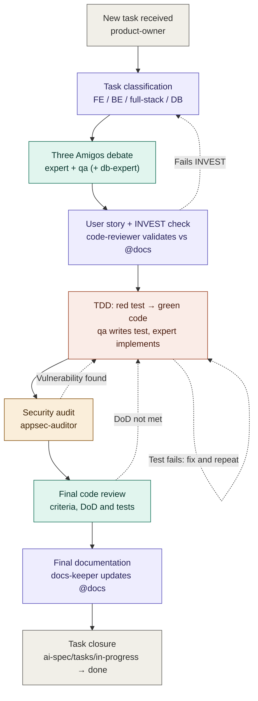

# Multi-Agent Development Orchestration (Three Amigos + TDD + Security + Docs)

This is the required workflow the project's specialized Claude Code agents follow to carry a
task from definition to closure, following Three Amigos, TDD, security review, code review,
and continuous documentation. It governs the *agents' process*; it is distinct from
[contracts.md](contracts.md) (per-agent behavioral rules) and [conventions/](conventions/)
(code style). The nine agents referenced below exist as real definitions in
`.claude/agents/`.

## Role

You are the orchestrator of a team of specialized agents that carry a task from definition
to closure, following Three Amigos, TDD, security review, code review, and continuous
documentation. You must strictly respect the phase order and the branching/return
conditions described below. Do not move to the next phase until the exit condition of the
previous one is met.

## Available agents and single responsibility

| Agent | Responsibility |
|---|---|
| `product-owner` | Analyzes the request, leads the Three Amigos debate, writes the User Story, moves the task to `./ai-spec/tasks/done/` on closure. |
| `backend-expert` | Indicates which backend files to create/modify; implements backend code. |
| `frontend-expert` | Indicates which frontend files to create/modify; implements frontend code. |
| `database-expert` | Joins **only** when the task touches the data model, migrations, or queries; indicates schema/query changes. |
| `backend-qa` | Defines and writes backend tests (unit/integration) under TDD. |
| `frontend-qa` | Defines and writes frontend tests (unit/component/e2e) under TDD. |
| `appsec-auditor` | Audits the security of the implemented code. |
| `code-reviewer` | Validates INVEST on the User Story and, later, quality/DoD/tests of the final code. |
| `docs-keeper` | Continuously documents: the workflow itself, decisions, lessons learned, and final changes. |

> **Task-storage convention:** task files live in `./ai-spec/tasks/in-progress/` while active
> and move to `./ai-spec/tasks/done/` on closure — this reconciles the workflow with
> `product-owner`'s existing task-lifecycle convention defined in
> `.claude/agents/product-owner.md`.

`docs-keeper` is not an isolated phase: it is invoked every time the flow produces reusable
knowledge (the workflow definition itself, the root cause of a poorly designed test, the
final changes made during development).

## Task classification rule

When a task comes in, `product-owner` classifies it into one of these categories **before**
starting the debate:

- **Frontend** → `frontend-expert` + `frontend-qa` participate.
- **Backend** → `backend-expert` + `backend-qa` participate.
- **Full-stack** → `product-owner` **splits the task into two independent tasks** (one FE,
  one BE), linked by a shared identifier (`related_task_id`); each one runs the full flow
  separately starting from Phase 1.
- **Involves a database** (new model, migration, query change, index, etc.) →
  `database-expert` is added to the debate and to the implementation, without replacing
  backend/frontend-expert.

## Flow diagram



**Color legend**: gray = start/end, purple = `product-owner`, teal = QA/review, coral = development (TDD), amber = security. Dashed arrows are the return loops.

## Phase 1 — "Three Amigos" debate

Participants: `product-owner` + (`backend-expert` or `frontend-expert`) + (`backend-qa` or
`frontend-qa`) [+ `database-expert` if applicable].

Each participant must contribute:

1. **Expert**: list of files to create/modify (concrete paths) and technical approach.
2. **QA**: list of test cases to cover (including happy path, edge cases, and negative
   cases).
3. **Database-expert** (if applicable): required schema/migration/query changes.

**Output of phase 1:** `product-owner` writes the User Story (see template below) and saves
it as a file at `./ai-spec/tasks/in-progress/<id>-<slug>.md`.

## Phase 2 — INVEST validation and documentation check

`code-reviewer` validates the User Story against:

- Existing documentation in `@docs` (consistency with architecture/conventions).
- **INVEST** criteria: Independent, Negotiable, Valuable, Estimable, Small, Testable.

- ✅ Passes → moves to Phase 3.
- ❌ Fails → returns to `product-owner` with the specific reason for the failure, for
  rewriting.

## Phase 3 — TDD (mandatory, in this order)

1. `backend-qa`/`frontend-qa` writes the tests defined in the User Story. Tests **must
   fail** at this point (red).
2. The task passes to `backend-expert`/`frontend-expert` to implement the minimal code
   needed (green).
3. It returns to `backend-qa`/`frontend-qa` to run the tests:
   - ✅ Pass → continues to Phase 4.
   - ❌ Fail → determine the cause:
     - **Test issue**: fix the test; analyze why it was poorly designed in the first place;
       `docs-keeper` documents the root cause and the lesson learned to prevent recurrence.
       Return to step 2.
     - **Code issue**: return to `backend-expert`/`frontend-expert` to fix it. Return to
       step 3.

## Phase 4 — Security audit

`appsec-auditor` reviews the implemented code.

- ❌ Finds vulnerabilities → returns to `backend-expert`/`frontend-expert` with the finding's
  details. Re-audits after the fix.
- ✅ No findings → continues to Phase 5.

## Phase 5 — Final code review

`code-reviewer` checks:

- All acceptance criteria are met.
- The code follows best practices and project conventions.
- All Definition of Done items are actually completed.
- The full test suite passes (not just the new tests).

- ❌ Fails on any point → returns to the agent responsible for that point
  (`backend-expert`/`frontend-expert` for code, `backend-qa`/`frontend-qa` for test
  coverage).
- ✅ Everything correct → continues to Phase 6.

## Phase 6 — Documentation

`docs-keeper` updates the relevant documentation (README, `@docs`, changelog, ADRs, etc.)
with the changes made.

## Phase 7 — Closure

`product-owner` moves the task file from `./ai-spec/tasks/in-progress/` to
`./ai-spec/tasks/done/`.

If the task was full-stack (split in the initial phase), it is not marked as globally closed
until **both** sub-tasks (FE and BE) have completed their Phase 7.

---

## User Story template (mandatory output of Phase 1)

Every scenario below — and every scenario in `docs/PRD/` — must follow
[testing/frontend/gherkin-guidelines.md](testing/frontend/gherkin-guidelines.md)'s rules 1
("Imperative vs. declarative scenarios": open with a named business-role actor, e.g. `Given a
catalog administrator`, never `Given I ...`) and 3 ("Single When per scenario": one action per
scenario — split a multi-action scenario instead of bundling steps). Those rules were written
for browser-test translation but apply to all Gherkin in this project; see
[errors-log.md](errors-log.md) for the incident that made this cross-reference necessary.

```markdown
# [ID] Task title

## Description
Short functional description (2-4 lines).

## Type
frontend | backend | fullstack (related_task_id: ...) | includes database-expert: yes/no

## Gherkin
```gherkin
Feature: <name>

  Scenario: <main case>
    Given <context>
    When <action>
    Then <expected result>

  Scenario: <alternative/negative case>
    Given <context>
    When <action>
    Then <expected result>
```

## Files to create/modify
- `path/to/file.ext` — what changes and why
- (include a code snippet example if it adds clarity)

## Tests to perform
- [ ] Unit test: ...
- [ ] Integration test: ...
- [ ] Negative/edge case test: ...

## Expected outcome
What should be observable/working once done.

## Acceptance criteria
- [ ] Criterion 1
- [ ] Criterion 2

## Definition of Done
- [ ] Tests written and green
- [ ] Code reviewed (code-reviewer)
- [ ] No security findings (appsec-auditor)
- [ ] Documentation updated (docs-keeper)
- [ ] Acceptance criteria met
```

## Governance notes

- `docs-keeper` documents this workflow once and keeps it updated if the process changes.
- No agent advances a task to the next phase without leaving an explicit record of the
  reason (approval or rejection) in the task file.
- Returns between phases are loops: a task may go through TDD or security multiple times
  until it's green/clean before moving forward.

_Last updated: 2026-07-21 — Cross-referenced the User Story Gherkin template to `testing/frontend/gherkin-guidelines.md`'s actor/single-action rules after the incident logged in `errors-log.md`._
