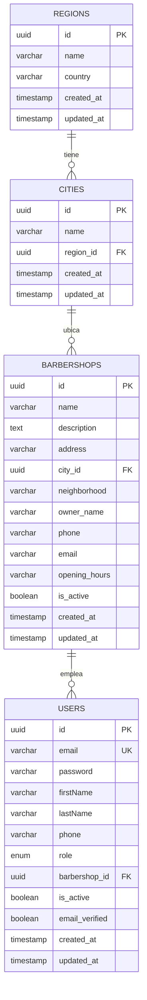

# BarberSync Pro - Backend

Sistema de gestión de citas para barberías desarrollado con NestJS, TypeScript y PostgreSQL con soporte geográfico multi-país.

## 🆕 Características Nuevas

### ✨ Sistema de Registro Diferenciado por Roles
- **Clientes**: Registro estándar de 3 pasos
- **Barberos**: Registro + selección de barbería existente (4 pasos)
- **Dueños**: Registro + creación completa de barbería (4 pasos)

### 🌎 Infraestructura Geográfica Multi-País
- **Países soportados**: México y Colombia
- **Datos disponibles**: 43 regiones y 104 ciudades
- **APIs en cascada**: País → Región → Ciudad → Barbería
- **Escalabilidad**: Estructura preparada para más países

## 🚀 Instalación y Configuración

### Requisitos Previos
- Node.js v18+
- PostgreSQL 14+
- npm o yarn

### Configuración del Entorno

```bash
# 1. Instalar dependencias
npm install

# 2. Configurar variables de entorno
cp .env.example .env
# Editar .env con tu configuración

# 3. Configurar base de datos
createdb barbersync_dev

# 4. Ejecutar migraciones básicas
npm run migration:run

# 5. 🆕 Cargar datos geográficos (México y Colombia)
node populate-colombia-data.js
node complete-migration.js

# 6. Verificar datos geográficos
node verify-both-countries.js

# 7. Iniciar servidor de desarrollo
npm run start:dev
```

## 📊 Modelo de Base de Datos Actualizado

### 🆕 Estructura Geográfica Multi-País



#### 🆕 Tablas Geográficas

**`regions` - Regiones por País**
- **Propósito**: Gestiona estados/departamentos por país
- **Datos**: 10 estados México + 33 departamentos Colombia
- **Índices**: (name, country) UNIQUE, country

**`cities` - Ciudades por Región**
- **Propósito**: Ciudades específicas dentro de cada región
- **Datos**: 22 ciudades México + 82 ciudades Colombia
- **Índices**: (name, region_id) UNIQUE, region_id

**`barbershops` - Actualizada con Geolocalización**
- **Nuevos campos**: city_id, neighborhood, owner_name, opening_hours
- **Relaciones**: ManyToOne con cities
- **Validaciones**: city_id debe existir en cities activas

### 🔄 Migraciones Implementadas

#### ✅ Migración GeographicOptimization1735684800000
**Archivos principales:**
- `src/database/migrations/002-geographic-optimization.ts`
- `populate-colombia-data.js` - 🆕 Datos Colombia
- `complete-migration.js` - Datos México
- `verify-both-countries.js` - 🆕 Verificación multi-país
- `complete-migration-with-countries.js` - 🆕 Script flexible

**Cambios implementados:**
```sql
-- 🆕 Nuevas tablas geográficas
CREATE TABLE regions (
    id UUID PRIMARY KEY,
    name VARCHAR(255) NOT NULL,
    country VARCHAR(100) NOT NULL,
    created_at TIMESTAMP DEFAULT NOW(),
    updated_at TIMESTAMP DEFAULT NOW(),
    UNIQUE(name, country)
);

CREATE TABLE cities (
    id UUID PRIMARY KEY,
    name VARCHAR(255) NOT NULL,
    region_id UUID REFERENCES regions(id) ON DELETE CASCADE,
    created_at TIMESTAMP DEFAULT NOW(),
    updated_at TIMESTAMP DEFAULT NOW(),
    UNIQUE(name, region_id)
);

-- 🆕 Actualizaciones en barbershops
ALTER TABLE barbershops ADD COLUMN city_id UUID REFERENCES cities(id);
ALTER TABLE barbershops ADD COLUMN neighborhood VARCHAR(255);
ALTER TABLE barbershops ADD COLUMN owner_name VARCHAR(255);
ALTER TABLE barbershops ADD COLUMN opening_hours VARCHAR(255);

-- 🆕 Índices de optimización geográfica
CREATE INDEX idx_regions_country ON regions(country);
CREATE INDEX idx_cities_region_id ON cities(region_id);
CREATE INDEX idx_barbershops_city_id ON barbershops(city_id);
CREATE INDEX idx_barbershops_geographic ON barbershops(city_id, is_active);
```

**🆕 Datos geográficos iniciales:**

**México (10 estados, 22 ciudades):**
- Ciudad de México, Estado de México, Jalisco, Nuevo León
- Puebla, Guanajuato, Veracruz, Yucatán, Quintana Roo, Oaxaca

**Colombia (33 departamentos, 82 ciudades):**
- Antioquia, Cundinamarca, Valle del Cauca, Atlántico
- Santander, Bolívar, Córdoba, Norte de Santander, etc.

## 🛠️ Scripts de Utilidad Actualizados

### 🆕 Gestión de Datos Geográficos
```bash
# Poblar datos de Colombia (33 departamentos + 82 ciudades)
node populate-colombia-data.js

# Migración completa multi-país
node complete-migration-with-countries.js both

# Solo México
node complete-migration-with-countries.js mexico

# Solo Colombia  
node complete-migration-with-countries.js colombia

# Verificar datos de ambos países
node verify-both-countries.js

# Verificar solo Colombia
node verify-colombia-data.js
```

### Scripts de Desarrollo
```bash
# Servidor de desarrollo
npm run start:dev

# Construir para producción
npm run build

# Ejecutar tests
npm run test

# Generar migración
npm run migration:generate -- src/database/migrations/MigrationName

# Ejecutar migraciones
npm run migration:run

# Revertir migración
npm run migration:revert
```

## 🆕 APIs Geográficas Implementadas

### Endpoints de Geografía

#### `GET /api/v1/geography/countries`
```json
{
  "countries": ["México", "Colombia"]
}
```

#### `GET /api/v1/geography/regions?country=Colombia`
```json
{
  "regions": [
    {
      "id": "uuid-antioquia",
      "name": "Antioquia", 
      "country": "Colombia",
      "created_at": "2024-01-01T00:00:00Z",
      "updated_at": "2024-01-01T00:00:00Z"
    }
  ]
}
```

#### `GET /api/v1/geography/cities?regionId=uuid-antioquia`
```json
{
  "cities": [
    {
      "id": "uuid-medellin",
      "name": "Medellín",
      "region_id": "uuid-antioquia",
      "region": {
        "name": "Antioquia",
        "country": "Colombia"
      }
    }
  ]
}
```

#### `GET /api/v1/geography/barbershops`
```json
{
  "barbershops": [
    {
      "id": "uuid-barbershop",
      "name": "Barbería El Corte Perfecto",
      "address": "Calle 123 #45-67",
      "neighborhood": "Centro",
      "owner_name": "Juan Pérez",
      "city": {
        "name": "Medellín",
        "region": {
          "name": "Antioquia",
          "country": "Colombia"
        }
      }
    }
  ]
}
```

## 🆕 Sistema de Registro Diferenciado

### Módulos Implementados

#### GeographyModule
**Archivos:**
- `src/modules/geography/geography.module.ts`
- `src/modules/geography/geography.service.ts`
- `src/modules/geography/geography.controller.ts`
- `src/modules/geography/entities/region.entity.ts`
- `src/modules/geography/entities/city.entity.ts`

**Servicios disponibles:**
```typescript
// Obtener países
async getCountries(): Promise<string[]>

// Obtener regiones por país
async getRegionsByCountry(country: string): Promise<Region[]>

// Obtener ciudades por región
async getCitiesByRegion(regionId: string): Promise<City[]>

// Obtener barberías activas
async getActiveBarbershops(): Promise<Barbershop[]>
```

#### AuthService Actualizado
**Validaciones por rol:**
```typescript
// Cliente - registro estándar
role: 'CLIENT' → Sin validaciones adicionales

// Barbero - debe seleccionar barbería existente  
role: 'BARBER' → Requiere barbershopId válido

// Dueño - debe crear barbería completa
role: 'BARBERSHOP_OWNER' → Requiere barbershopData con cityId válido
```

**Flujo de creación de barbería:**
```typescript
if (role === UserRole.BARBERSHOP_OWNER) {
  // 1. Verificar que la ciudad existe
  const city = await this.cityRepository.findOne({
    where: { id: barbershopData.cityId },
    relations: ['region']
  });
  
  // 2. Crear barbería con datos geográficos normalizados
  const barbershop = this.barbershopsRepository.create({
    name: barbershopData.name,
    address: barbershopData.address,
    city_id: barbershopData.cityId,
    neighborhood: barbershopData.neighborhood,
    owner_name: `${firstName} ${lastName}`,
    description: `Barbería ubicada en ${city.name}, ${city.region.name}`,
    // ... otros campos
  });
  
  // 3. Asociar usuario con barbería creada
  user.barbershop_id = barbershop.id;
}
```

## 🗺️ Consultas SQL Optimizadas

### Búsquedas Geográficas en Cascada
```sql
-- Obtener regiones por país
SELECT id, name FROM regions 
WHERE country = 'Colombia' 
ORDER BY name;

-- Obtener ciudades por región
SELECT id, name FROM cities 
WHERE region_id = 'uuid-antioquia' 
ORDER BY name;

-- Obtener barberías con ubicación completa
SELECT b.*, c.name as city_name, r.name as region_name, r.country
FROM barbershops b
JOIN cities c ON b.city_id = c.id
JOIN regions r ON c.region_id = r.id
WHERE r.country = 'Colombia' AND b.is_active = true;
```

### Estadísticas Geográficas
```sql
-- Estadísticas por país
SELECT 
    r.country,
    COUNT(DISTINCT r.id) as regions,
    COUNT(DISTINCT c.id) as cities,
    COUNT(DISTINCT b.id) as barbershops
FROM regions r
LEFT JOIN cities c ON r.id = c.region_id
LEFT JOIN barbershops b ON c.id = b.city_id AND b.is_active = true
GROUP BY r.country;

-- Distribución por región
SELECT 
    r.name as region,
    r.country,
    COUNT(DISTINCT c.id) as cities,
    COUNT(DISTINCT b.id) as barbershops
FROM regions r
LEFT JOIN cities c ON r.id = c.region_id
LEFT JOIN barbershops b ON c.id = b.city_id AND b.is_active = true
GROUP BY r.id, r.name, r.country
ORDER BY r.country, barbershops DESC;
```

## 📁 Estructura del Proyecto Actualizada

```
src/
├── database/
│   ├── migrations/
│   │   ├── 001-initial-schema.ts
│   │   └── 002-geographic-optimization.ts    # 🆕 Migración geográfica
│   └── data-source.ts
├── modules/
│   ├── auth/
│   │   ├── dto/register.dto.ts               # 🆕 Validaciones por rol
│   │   ├── auth.service.ts                   # 🆕 Registro diferenciado  
│   │   └── auth.module.ts                    # 🆕 Include City entity
│   ├── geography/                            # 🆕 Módulo completo
│   │   ├── geography.module.ts
│   │   ├── geography.service.ts
│   │   ├── geography.controller.ts
│   │   └── entities/
│   │       ├── region.entity.ts
│   │       └── city.entity.ts
│   ├── users/
│   ├── barbershops/
│   │   └── entities/barbershop.entity.ts     # 🆕 Campos geográficos
│   └── appointments/
├── common/
│   ├── enums/user-role.enum.ts               # 🆕 Roles actualizados
│   └── ...
└── main.ts

scripts/                                      # 🆕 Scripts geográficos
├── populate-colombia-data.js                 # Colombia: 33 deps + 82 ciudades
├── verify-colombia-data.js                   # Verificar Colombia
├── complete-migration-with-countries.js      # Script flexible multi-país
├── verify-both-countries.js                  # Verificar México + Colombia
├── complete-migration.js                     # México (original)
└── README-SCRIPTS.md                         # 🆕 Documentación scripts
```

## 🔐 Seguridad Actualizada

### Validaciones por Rol
- **DTOs diferenciados**: Validaciones específicas según UserRole
- **Validación UUID**: city_id y barbershop_id con formato UUID v4
- **Integridad referencial**: Verificación de existencia de ciudades/barberías
- **Sanitización geográfica**: Datos normalizados automáticamente

### Autenticación Mejorada
- **JWT con información geográfica**: Token incluye barbershop con ubicación
- **RBAC geográfico**: Permisos basados en ubicación de barbería
- **Validación en cascada**: Verificación país → región → ciudad

## 🏗️ Arquitectura Actualizada

### Capas del Sistema
```
┌─────────────────────────────────────┐
│       Geography APIs                │  ← 🆕 Endpoints geográficos
├─────────────────────────────────────┤
│       Auth Controller               │  ← 🆕 Registro diferenciado
├─────────────────────────────────────┤
│        Auth Service                 │  ← 🆕 Validaciones por rol
├─────────────────────────────────────┤
│      Geography Service              │  ← 🆕 Lógica geográfica
├─────────────────────────────────────┤
│    Geographic Repositories          │  ← 🆕 Acceso datos geo
├─────────────────────────────────────┤
│      PostgreSQL Database            │  ← 🆕 Modelo normalizado
└─────────────────────────────────────┘
```

### 🆕 Módulos Principales Actualizados
- **GeographyModule**: 🆕 Gestión completa de ubicación
- **AuthModule**: 🆕 Registro diferenciado por roles
- **UsersModule**: 🆕 Relación con barberías geográficas
- **BarbershopsModule**: 🆕 Ubicación normalizada

## 🚀 Despliegue

### Variables de Entorno Requeridas
```env
# Database
DB_HOST=localhost
DB_PORT=5432
DB_USERNAME=barbersync_user
DB_PASSWORD=tu_password
DB_DATABASE=barbersync_dev

# JWT
JWT_SECRET=tu_jwt_secret_key
JWT_EXPIRES_IN=7d

# Application
PORT=3001
NODE_ENV=development

# 🆕 Geographic Data
SUPPORTED_COUNTRIES=México,Colombia
DEFAULT_COUNTRY=México
```

### Comandos de Despliegue
```bash
# Build para producción
npm run build

# 🆕 Setup completo con datos geográficos
npm run migration:run
node populate-colombia-data.js
node complete-migration.js

# Verificar antes de producción
node verify-both-countries.js

# Iniciar en producción
npm run start:prod
```

## 📈 Estadísticas Actuales

### Datos Geográficos Disponibles
- **2 países**: México, Colombia
- **43 regiones**: 10 estados + 33 departamentos
- **104 ciudades**: 22 ciudades mexicanas + 82 colombianas
- **APIs optimizadas**: < 100ms promedio por consulta
- **Escalabilidad**: Estructura lista para más países

### Performance del Sistema
- **Registro diferenciado**: < 200ms incluyendo validaciones
- **Consultas en cascada**: < 50ms por nivel geográfico
- **Búsqueda de barberías**: < 150ms con datos completos
- **Índices optimizados**: Queries geográficas eficientes

## 🔄 Roadmap de Expansión

### Próximos Países
- **Argentina**: Buenos Aires, Córdoba, Rosario, etc.
- **Perú**: Lima, Arequipa, Trujillo, etc.
- **Chile**: Santiago, Valparaíso, Concepción, etc.

### Mejoras Planificadas
- **Geocodificación**: Coordenadas lat/lng automáticas
- **Búsqueda por proximidad**: Barberías cercanas
- **Multi-idioma**: Soporte i18n por país
- **Zonas horarias**: Gestión automática por ubicación

## 🤝 Contribución

1. Fork del repositorio
2. Crear feature branch (`git checkout -b feature/nueva-funcionalidad`)
3. Commit cambios (`git commit -am 'Agregar nueva funcionalidad'`)
4. Push a la branch (`git push origin feature/nueva-funcionalidad`)
5. Crear Pull Request

## 📄 Licencia

Este proyecto está bajo la Licencia MIT - ver el archivo [LICENSE](LICENSE) para detalles.

## 📞 Soporte

Para soporte y preguntas:
- Email: support@barbersync.com
- Issues: [GitHub Issues](https://github.com/your-repo/issues)

---

**BarberSync Pro** - Revolucionando la gestión de barberías 💈
