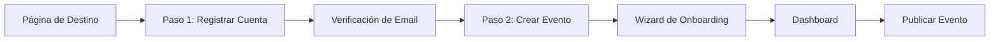
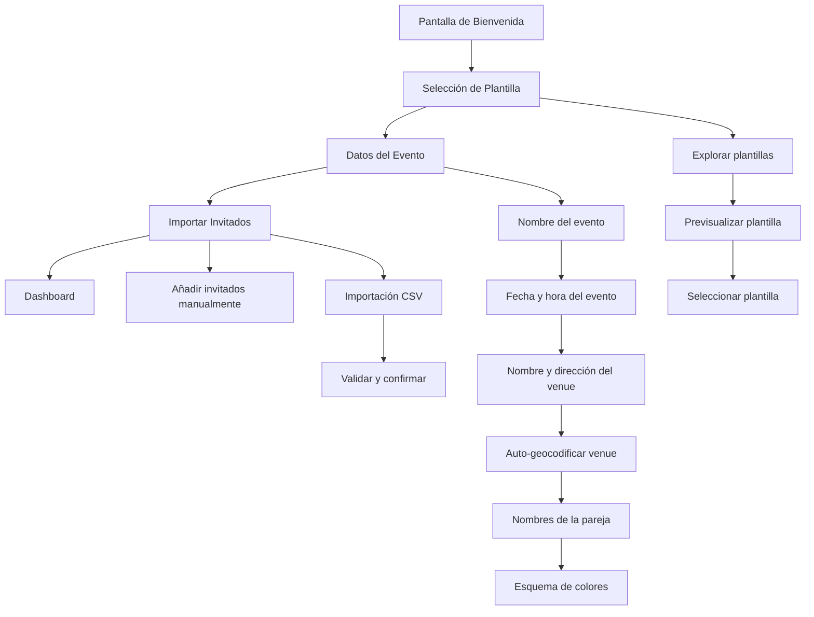

# 5. Registro y Onboarding

> [Volver al Índice PRD](../PRD.md) | [Anterior: Visión y Estrategia](04-vision-strategy.md) | [Siguiente: Funcionalidades MVP](06-mvp-features.md)

---

## 5.1 Visión General

Aura utiliza un **flujo de dos pasos**: Registrar Cuenta -> Crear Evento. Esto minimiza la fricción separando la autenticación de la creación de eventos, permitiendo a los usuarios enfocarse en una tarea a la vez.

## 5.2 Flujo de Registro

### 5.2.1 Paso 1: Captura de Email y Magic Link

| Paso | Acción | Respuesta del Sistema |
|------|--------|----------------------|
| 1 | Usuario introduce email en la página de destino | Frontend valida formato de email |
| 2 | Usuario hace clic en "Continuar" | `POST /api/auth/magic-link` con email |
| 3 | Sistema verifica si el usuario existe | Si nuevo: crea User (status=pending). Si existente: actualiza LastLogin |
| 4 | Sistema genera token magic link | Expiración 15 minutos, almacenado hasheado en DB |
| 5 | Sistema envía email vía Gmail SMTP | Email personalizado con botón de magic link |
| 6 | Frontend muestra confirmación | "Revisa tu email para el enlace de acceso" |

**Rate Limiting:** 3 solicitudes de magic link por email por hora (respuesta 429 al exceder)

**Seguridad:** Misma respuesta para usuarios nuevos y existentes (previene enumeración de emails)

### 5.2.2 Paso 2: Verificación de Email y Configuración de Perfil

| Paso | Acción | Respuesta del Sistema |
|------|--------|----------------------|
| 1 | Usuario hace clic en el magic link del email | Navegador abre URL de verificación |
| 2 | Frontend llama `GET /api/auth/verify?token={token}` | Sistema valida token, verifica expiración |
| 3 | Token válido | Sistema actualiza User a active, genera JWT de 24h, devuelve `isFirstLogin: true` |
| 4 | Token expirado/inválido | Sistema devuelve 401 con "Enlace expirado", ofrece reenvío |
| 5 | Primer login detectado | Frontend muestra modal de configuración de perfil |
| 6 | Usuario introduce nombre, acepta términos, opts por marketing | `POST /api/auth/profile` guarda perfil |
| 7 | Perfil guardado | Usuario redirigido al wizard de onboarding |

**Campos de Configuración de Perfil:**

| Campo | Requerido | Validación |
|-------|----------|-----------|
| Nombre | Sí | 2-100 caracteres |
| Aceptación de términos | Sí | Checkbox, versión rastreada |
| Consentimiento de marketing | No | Checkbox opt-in |
| Zona horaria | Sí | Auto-detectada, editable |
| Locale | Sí | Por defecto: es-ES |

### 5.2.3 Recuperación de Cuenta

El flujo de recuperación de cuenta es idéntico al registro — el usuario introduce su email y recibe un nuevo magic link. Diferencias clave:

- Tokens antiguos se invalidan cuando se solicita uno nuevo
- Session JWT se invalida en nuevo login (sesión única por usuario)
- Mismo rate limiting aplica (3 solicitudes/hora)
- Misma respuesta anti-enumeración (sin indicación de si el email existe)

**Reenviar Magic Link:** Disponible en la página de verificación con un temporizador de enfriamiento de 60 segundos.

## 5.3 Wizard de Onboarding

Después de la configuración del perfil, los usuarios de primer ingreso acceden a un wizard de onboarding guiado:

### Detalles de Pasos del Wizard

**Paso 1: Selección de Plantilla**
- Obtener plantillas: `GET /api/templates?category=wedding&isPremium=false`
- Mostrar cuadrícula de plantillas con previsualizaciones en vivo
- Usuario selecciona una de las 3 plantillas preestablecidas
- Selección almacenada en sesión

**Paso 2: Datos del Evento**
- Crear evento: `POST /api/events` con name, date, venue, template, colors
- Sistema auto-genera slug URL-safe (ej. `maria-y-juan-2026`)
- Sistema auto-geocodifica dirección del venue vía Google Maps API
- Sistema crea `DataRetentionJob` (EventDate + 30 días)
- Evento creado con status `draft`

**Paso 3: Importar Invitados (Opcional)**
- Usuario puede omitir este paso y añadir invitados después
- Añadir manualmente: nombre, email, teléfono, categoría
- Importación CSV: validar, previsualizar, confirmar
- Modo draft: máximo 5 invitados enforced

**Finalización:** Usuario es redirigido al dashboard del evento con mensaje de éxito y tour guiado.

## 5.4 Historias de Usuario y Criterios de Aceptación

| ID | Historia de Usuario | Criterios de Aceptación (Given/When/Then) |
|----|---------------------|------------------------------------------|
| US-R-01 | Como nuevo usuario, quiero registrarme solo con mi email para poder empezar a usar Aura sin crear una contraseña | **Dado** que estoy en la página de destino, **Cuando** introduzco un email válido y hago clic en "Continuar", **Entonces** veo "Revisa tu email" y recibo un magic link en 30 segundos |
| US-R-02 | Como usuario, quiero que mi magic link expire después de 15 minutos para que mi cuenta permanezca segura | **Dado** que recibí un magic link, **Cuando** hago clic en él después de 16 minutos, **Entonces** veo "Enlace expirado" con opción de solicitar uno nuevo |
| US-R-03 | Como usuario, quiero configurar mi perfil en el primer login para que mi cuenta esté personalizada | **Dado** que hice clic en un magic link válido por primera vez, **Cuando** introduzco mi nombre y acepto los términos, **Entonces** mi perfil se guarda y soy redirigido al wizard de onboarding |
| US-R-04 | Como usuario, quiero reenviar un magic link si no lo recibí para poder completar el registro | **Dado** que solicité un magic link, **Cuando** hago clic en "Reenviar" después de 60 segundos, **Entonces** se envía un nuevo magic link y el anterior se invalida |
| US-R-05 | Como usuario recurrente, quiero iniciar sesión con el mismo email para poder acceder a mis eventos existentes | **Dado** que tengo una cuenta existente, **Cuando** introduzco mi email y hago clic en "Continuar", **Entonces** recibo un magic link y puedo acceder a mi dashboard |

## 5.5 Casos Extremos

| Escenario | Manejo |
|-----------|--------|
| Usuario introduce formato de email inválido | Validación inline previene envío |
| Usuario solicita 4to magic link dentro de 1 hora | Respuesta 429 con mensaje "Por favor espera 20 minutos" |
| Email de magic link va a spam | Hint "Revisa carpeta de spam"; opción de reenvío después de 60s |
| Usuario cierra navegador antes de hacer clic en magic link | Enlace permanece válido por 15 minutos; usuario puede solicitar nuevo |
| Usuario intenta registrarse con email existente | Mismo flujo que login (sin diferenciación en respuesta) |
| Usuario omite wizard de onboarding | Puede acceder al wizard después desde dashboard; evento permanece en draft |
| Usuario crea evento sin seleccionar plantilla | Plantilla por defecto aplicada; puede cambiar después |
| Dirección del venue no puede ser geocodificada | Evento creado sin coordenadas; usuario puede actualizar manualmente |

## 5.6 DECISIÓN NECESARIA: Flujo de Onboarding de Accomplice

**Pregunta:** ¿Cómo se onboa un accomplice? ¿Necesita crear una cuenta completa de Aura, o su acceso es puramente scoped a un evento vía magic link?

**Opciones:**
- **A.** Accomplice recibe magic link -> accede al panel directamente (sin cuenta necesaria)
- **B.** Accomplice recibe magic link -> se le pide crear cuenta -> accede al panel
- **C.** Accomplice recibe magic link -> crea perfil ligero (solo nombre) -> accede al panel

**Recomendación:** Opción A para MVP. Los accomplices son usuarios de un solo uso tied a un único evento. Forzar creación de cuenta añade fricción. Opción B/C puede evaluarse para V2 si los accomplices se convierten en usuarios recurrentes.

---

> [Volver al Índice PRD](../PRD.md) | [Anterior: Visión y Estrategia](04-vision-strategy.md) | [Siguiente: Funcionalidades MVP](06-mvp-features.md)