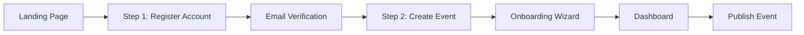
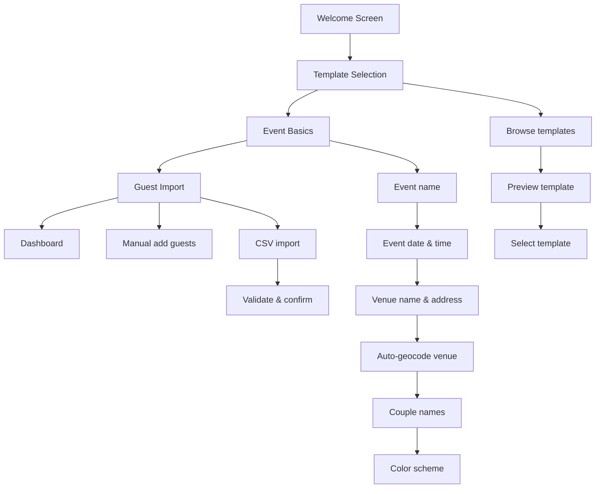

# 5. Registration & Onboarding

> [Back to PRD Index](../PRD.md) | [Previous: Vision & Strategy](04-vision-strategy.md) | [Next: MVP Features](06-mvp-features.md)

---

## 5.1 Overview

Aura uses a **two-step flow**: Register Account -> Create Event. This minimizes friction by separating authentication from event creation, allowing users to focus on one task at a time.

## 5.2 Registration Flow

### 5.2.1 Step 1: Email Capture & Magic Link

| Step | Action | System Response |
|------|--------|-----------------|
| 1 | User enters email on landing page | Frontend validates email format |
| 2 | User clicks "Continue" | `POST /api/auth/magic-link` with email |
| 3 | System checks if user exists | If new: creates User (status=pending). If existing: updates LastLogin |
| 4 | System generates magic link token | 15-minute expiry, stored hashed in DB |
| 5 | System sends email via AWS SES | Personalized email with magic link button |
| 6 | Frontend shows confirmation | "Check your email for your access link" |

**Rate Limiting:** 3 magic link requests per email per hour (429 response on exceed)

**Security:** Same response for new and existing users (prevents email enumeration)

### 5.2.2 Step 2: Email Verification & Profile Setup

| Step | Action | System Response |
|------|--------|-----------------|
| 1 | User clicks magic link in email | Browser opens verification URL |
| 2 | Frontend calls `GET /api/auth/verify?token={token}` | System validates token, checks expiry |
| 3 | Token valid | System updates User to active, generates 24h JWT, returns `isFirstLogin: true` |
| 4 | Token expired/invalid | System returns 401 with "Link expired", offers resend |
| 5 | First login detected | Frontend shows profile setup modal |
| 6 | User enters name, accepts terms, opts into marketing | `POST /api/auth/profile` saves profile |
| 7 | Profile saved | User redirected to onboarding wizard |

**Profile Setup Fields:**

| Field | Required | Validation |
|-------|----------|-----------|
| Name | Yes | 2-100 characters |
| Terms acceptance | Yes | Checkbox, version tracked |
| Marketing consent | No | Opt-in checkbox |
| Timezone | Yes | Auto-detected, editable |
| Locale | Yes | Default: es-ES |

### 5.2.3 Account Recovery

The account recovery flow is identical to registration — the user enters their email and receives a new magic link. Key differences:

- Old tokens are invalidated when a new one is requested
- Session JWT is invalidated on new login (single session per user)
- Same rate limiting applies (3 requests/hour)
- Same anti-enumeration response (no indication of whether email exists)

**Resend Magic Link:** Available on the verification page with a 60-second cooldown timer.

## 5.3 Onboarding Wizard

After profile setup, first-time users enter a guided onboarding wizard:

### Wizard Step Details

**Step 1: Template Selection**
- Fetch templates: `GET /api/templates?category=wedding&isPremium=false`
- Display template grid with live previews
- User selects one of 3 preset templates
- Selection stored in session

**Step 2: Event Basics**
- Create event: `POST /api/events` with name, date, venue, template, colors
- System auto-generates URL-safe slug (e.g., `maria-y-juan-2026`)
- System auto-geocodes venue address via Google Maps API
- System creates `DataRetentionJob` (EventDate + 30 days)
- Event created with status `draft`

**Step 3: Guest Import (Optional)**
- User can skip this step and add guests later
- Manual add: name, email, phone, category
- CSV import: validate, preview, confirm
- Draft mode: max 5 guests enforced

**Completion:** User is redirected to the event dashboard with a success message and guided tour.

## 5.4 User Stories & Acceptance Criteria

| ID | User Story | Acceptance Criteria (Given/When/Then) |
|----|-----------|--------------------------------------|
| US-R-01 | As a new user, I want to register with just my email so that I can start using Aura without creating a password | **Given** I am on the landing page, **When** I enter a valid email and click "Continue", **Then** I see "Check your email" and receive a magic link within 30 seconds |
| US-R-02 | As a user, I want my magic link to expire after 15 minutes so that my account stays secure | **Given** I received a magic link, **When** I click it after 16 minutes, **Then** I see "Link expired" with an option to request a new one |
| US-R-03 | As a user, I want to set up my profile on first login so that my account is personalized | **Given** I clicked a valid magic link for the first time, **When** I enter my name and accept terms, **Then** my profile is saved and I'm redirected to the onboarding wizard |
| US-R-04 | As a user, I want to resend a magic link if I didn't receive it so that I can complete registration | **Given** I requested a magic link, **When** I click "Resend" after 60 seconds, **Then** a new magic link is sent and the old one is invalidated |
| US-R-05 | As a returning user, I want to log in with the same email so that I can access my existing events | **Given** I have an existing account, **When** I enter my email and click "Continue", **Then** I receive a magic link and can access my dashboard |

## 5.5 Edge Cases

| Scenario | Handling |
|----------|----------|
| User enters invalid email format | Inline validation prevents submission |
| User requests 4th magic link within 1 hour | 429 response with "Please wait 20 minutes" message |
| Magic link email goes to spam | "Check spam folder" hint; resend option after 60s |
| User closes browser before clicking magic link | Link remains valid for 15 minutes; user can request new one |
| User tries to register with existing email | Same flow as login (no differentiation in response) |
| User skips onboarding wizard | Can access wizard later from dashboard; event remains in draft |
| User creates event without selecting template | Default template applied; can change later |
| Venue address cannot be geocoded | Event created without coordinates; user can update manually |

## 5.6 DECISION NEEDED: Accomplice Onboarding Flow

**Question:** How does an accomplice get onboarded? Do they need to create a full Aura account, or is their access purely event-scoped via magic link?

**Options:**
- **A.** Accomplice receives magic link -> accesses panel directly (no account needed)
- **B.** Accomplice receives magic link -> prompted to create account -> accesses panel
- **C.** Accomplice receives magic link -> creates lightweight profile (name only) -> accesses panel

**Recommendation:** Option A for MVP. Accomplices are one-time users tied to a single event. Forcing account creation adds friction. Option B/C can be evaluated for V2 if accomplices become repeat users.

---

> [Back to PRD Index](../PRD.md) | [Previous: Vision & Strategy](04-vision-strategy.md) | [Next: MVP Features](06-mvp-features.md)
