# Canvas del Proceso Quirúrgico - Sistema Integrado

## 🎯 Diagrama Principal del Proceso Completo

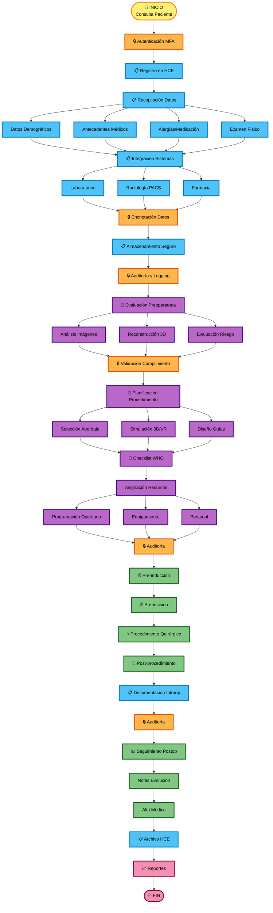

## 📊 Canvas Visual - Vista de Matriz

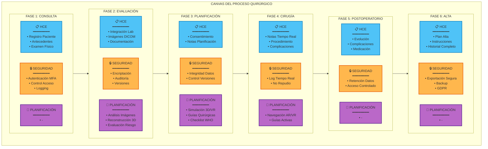

## ⏱️ Timeline del Proceso Quirúrgico

```mermaid
gantt
    title Timeline del Proceso Quirúrgico Integrado
    dateFormat X
    axisFormat %s
    
    section 📋 HCE
    Registro Paciente           :0, 1
    Recopilación Datos          :1, 2
    Integración Sistemas        :2, 3
    Documentación Preop         :3, 4
    Notas Intraoperatorias      :8, 2
    Seguimiento Postop          :10, 3
    Alta y Archivo              :13, 2
    
    section 🔒 Seguridad
    Autenticación               :0, 1
    Control Acceso              :1, 1
    Encriptación Datos          :2, 8
    Auditoría Continua          :0, 15
    Validación Cumplimiento     :4, 2
    Backup Automático           :0, 15
    
    section 🎯 Planificación
    Evaluación Preop            :3, 2
    Análisis Imágenes           :3, 2
    Reconstrucción 3D           :4, 2
    Simulación                  :5, 1
    Guías Quirúrgicas           :5, 1
    Checklist WHO               :6, 1
    Asignación Recursos         :6, 1
    
    section ⚕️ Procedimiento
    Pre-inducción               :7, 1
    Pre-incisión                :7, 1
    Procedimiento Quirúrgico    :8, 2
    Post-procedimiento          :10, 1
```

## 🔄 Diagrama de Interacción entre Áreas

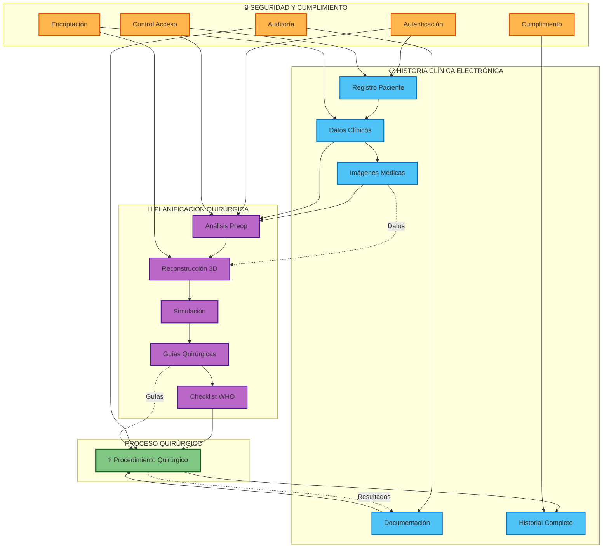

## Canvas Detallado por Fases

### FASE 1: CONSULTA Y REGISTRO INICIAL

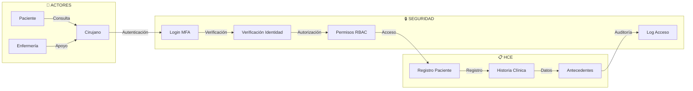

### FASE 2: EVALUACIÓN Y PLANIFICACIÓN

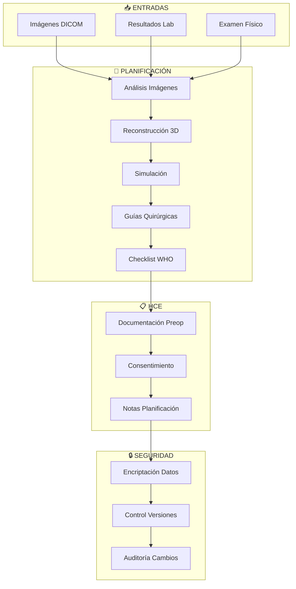

### FASE 3: PROCEDIMIENTO QUIRÚRGICO

```mermaid
graph LR
    subgraph PRE["⏰ PRE-QUIRÚRGICO"]
        P1[Checklist Pre-inducción]
        P2[Checklist Pre-incisión]
    end
    
    subgraph DURANTE["⚕️ DURANTE CIRUGÍA"]
        D1[Procedimiento]
        D2[Documentación Tiempo Real]
        D3[Navegación AR/VR]
    end
    
    subgraph POST["📝 POST-QUIRÚRGICO"]
        PO1[Checklist Final]
        PO2[Documentación Completa]
        PO3[Conteo Instrumentos]
    end
    
    subgraph HCE3["📋 HCE"]
        H1[Notas Intraoperatorias]
        H2[Procedimiento Realizado]
        H3[Complicaciones]
    end
    
    subgraph SEG3["🔒 SEGURIDAD"]
        S1[Log Tiempo Real]
        S2[Integridad Datos]
        S3[No Repudio]
    end
    
    P1 --> D1
    P2 --> D1
    D1 --> D2
    D1 --> D3
    D2 --> PO1
    D3 --> PO1
    PO1 --> PO2
    PO2 --> PO3
    PO3 --> H1
    H1 --> H2
    H2 --> H3
    H3 --> S1
    S1 --> S2
    S2 --> S3
```

### FASE 4: SEGUIMIENTO Y ALTA

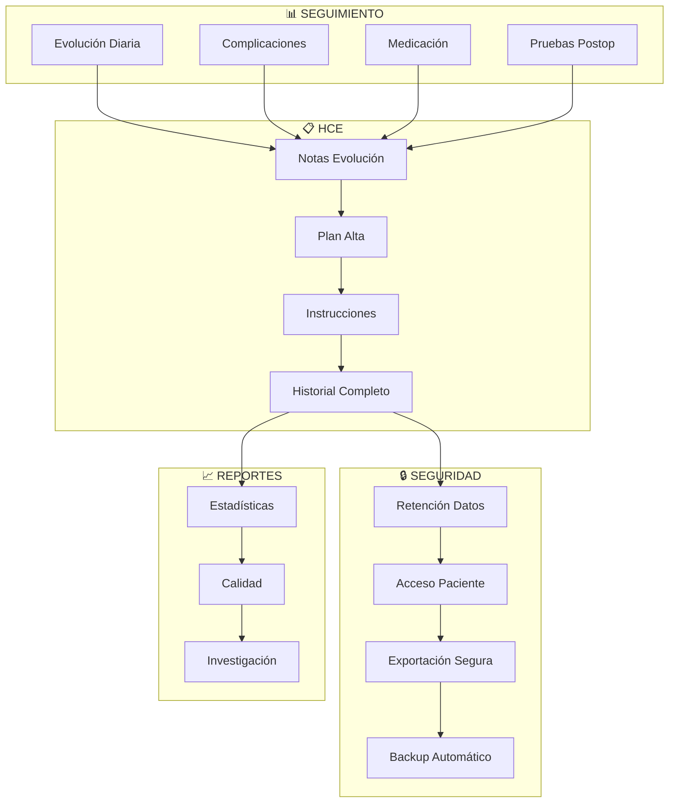

## Matriz de Integración de Áreas

| Fase del Proceso | HCE | Planificación Quirúrgica | Seguridad y Cumplimiento |
|-----------------|-----|-------------------------|-------------------------|
| **Consulta Inicial** | Registro paciente, antecedentes, examen físico | - | Autenticación, control de acceso, logging |
| **Evaluación Preop** | Integración lab/radiología, documentación | Análisis imágenes, evaluación riesgo | Encriptación datos, auditoría cambios |
| **Planificación** | Consentimiento, notas planificación | Reconstrucción 3D, simulación, guías | Control versiones, integridad datos |
| **Pre-quirúrgico** | Checklist preop en HCE | Checklist WHO, asignación recursos | Logging acceso, verificación identidad |
| **Intraoperatorio** | Notas tiempo real, procedimiento | Navegación AR/VR, guías | Log tiempo real, no repudio |
| **Postoperatorio** | Evolución, complicaciones, medicación | - | Retención datos, acceso controlado |
| **Alta y Seguimiento** | Plan alta, instrucciones, historial completo | - | Exportación segura, backup, cumplimiento GDPR |

## Puntos Críticos de Integración

### 1. **Punto de Integración HCE ↔ Planificación**
- **Momento**: Evaluación preoperatoria
- **Datos compartidos**: Imágenes médicas, antecedentes, evaluación de riesgo
- **Seguridad**: Encriptación en tránsito, control de acceso granular

### 2. **Punto de Integración Planificación ↔ Seguridad**
- **Momento**: Generación de guías y simulación
- **Datos compartidos**: Modelos 3D, planificación quirúrgica
- **Seguridad**: Integridad de datos, control de versiones, auditoría

### 3. **Punto de Integración HCE ↔ Seguridad**
- **Momento**: Todo el proceso
- **Datos compartidos**: Toda la información del paciente
- **Seguridad**: Encriptación, logging, cumplimiento normativo

## Métricas y KPIs del Proceso

### Métricas de HCE
- Tiempo de registro de datos
- Completitud de historias clínicas
- Tasa de integración con sistemas externos
- Disponibilidad del sistema

### Métricas de Planificación
- Tiempo de planificación preoperatoria
- Precisión de simulaciones
- Reducción de complicaciones
- Tiempo quirúrgico vs planificado

### Métricas de Seguridad
- Tiempo de respuesta a incidentes
- Tasa de accesos no autorizados detectados
- Cumplimiento de normativas (%)
- Disponibilidad de backups

## Flujo de Datos y Seguridad

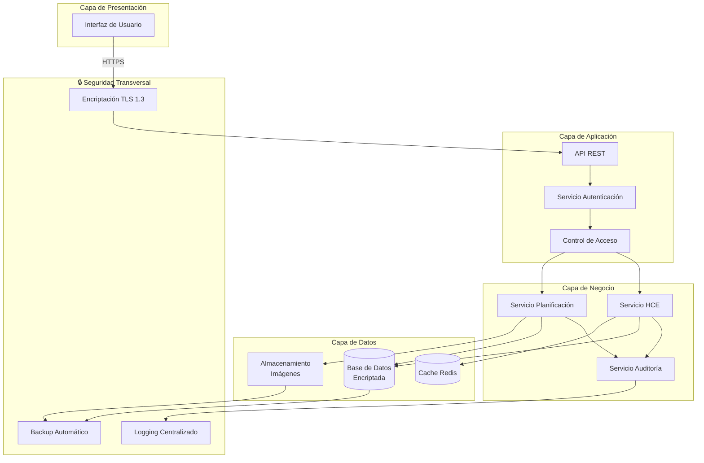

## 📐 Canvas Visual Simplificado - Vista de Proceso

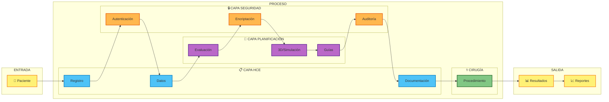

## 🎨 Canvas de Integración - Vista de Capas

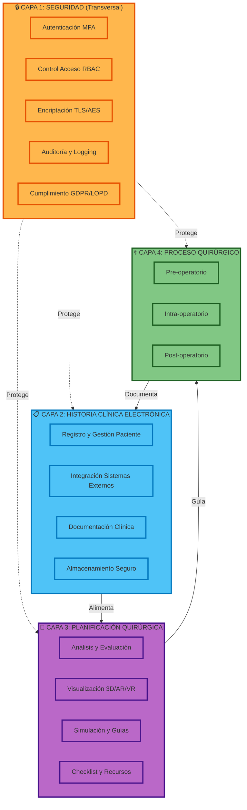

## Conclusión

Este canvas muestra cómo las tres áreas (HCE, Planificación Quirúrgica y Seguridad) se integran a lo largo de todo el proceso quirúrgico, desde la consulta inicial hasta el alta y seguimiento, garantizando:

1. **Trazabilidad completa** del proceso
2. **Seguridad en cada etapa** del flujo
3. **Planificación precisa** basada en datos completos
4. **Cumplimiento normativo** en todo momento
5. **Eficiencia operativa** mediante integración de sistemas

### 📌 Notas para Visualización

Los diagramas están diseñados para visualizarse en:
- **GitHub/GitLab**: Los diagramas Mermaid se renderizan automáticamente
- **VS Code**: Con extensión "Markdown Preview Mermaid Support"
- **Herramientas online**: [Mermaid Live Editor](https://mermaid.live/)
- **Documentación**: Cualquier visor de Markdown con soporte Mermaid

### 🎯 Leyenda de Colores

- 🔵 **Azul**: Historia Clínica Electrónica (HCE)
- 🟣 **Morado**: Planificación Quirúrgica
- 🟠 **Naranja**: Seguridad y Cumplimiento
- 🟢 **Verde**: Proceso Quirúrgico
- 🟡 **Amarillo**: Puntos de Entrada/Salida
