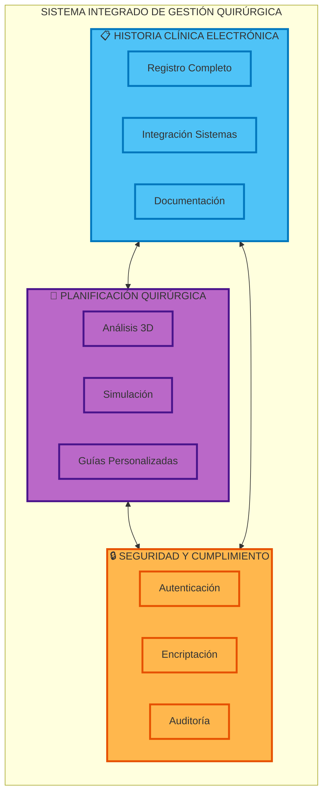
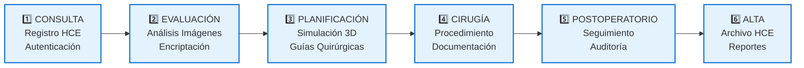
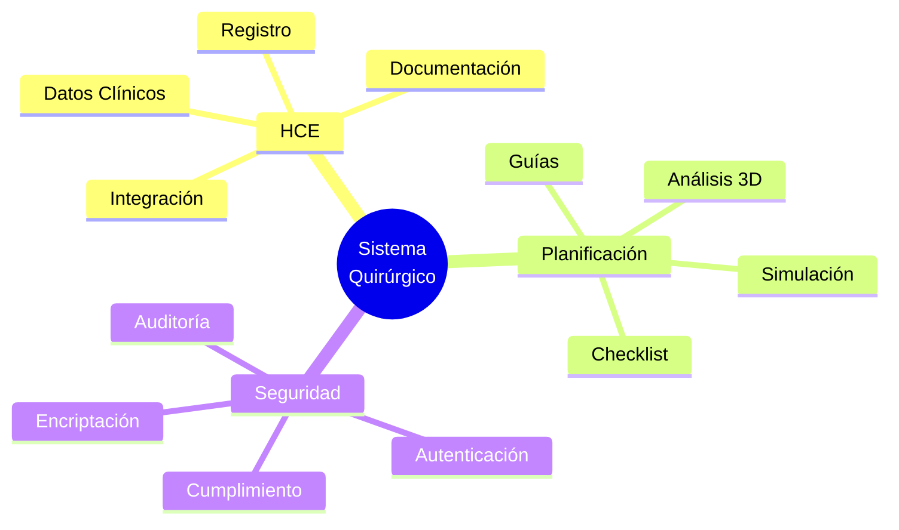
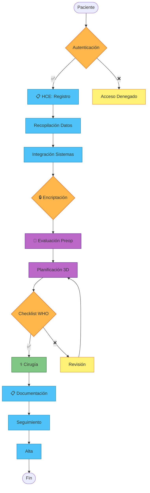
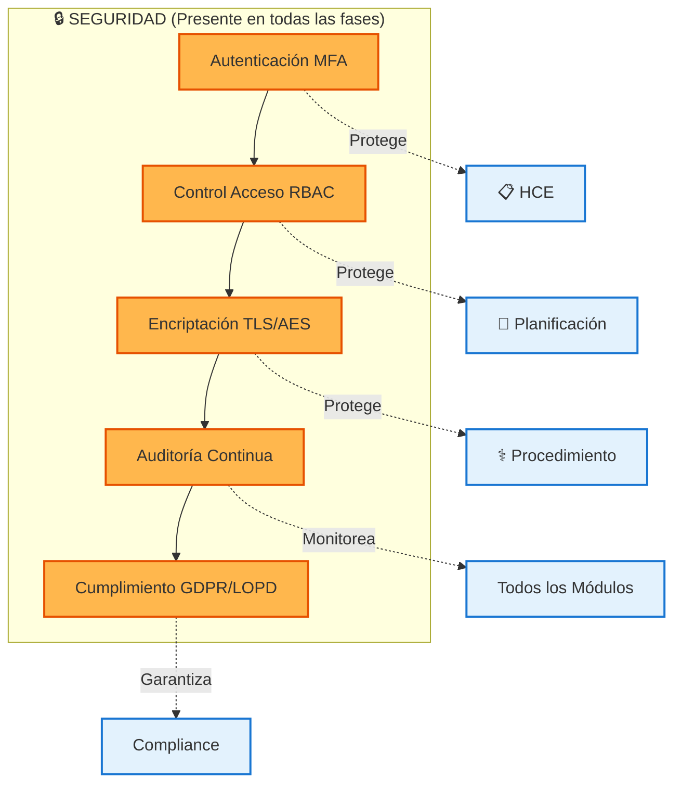
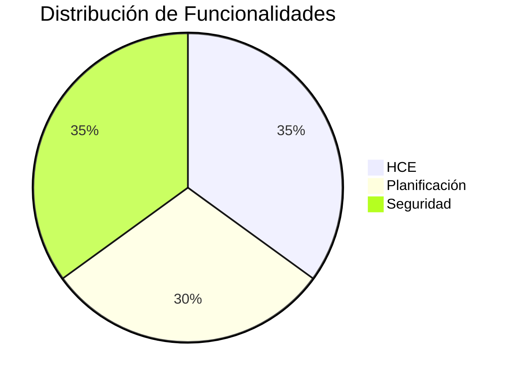
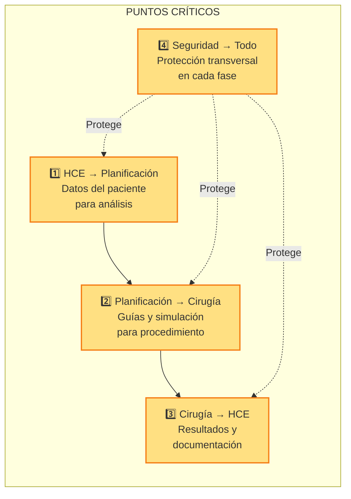

# Canvas del Proceso Quirúrgico - Resumen Ejecutivo

## 🎯 Vista General del Sistema

## 📊 Flujo del Proceso en 6 Pasos

## 🔄 Integración de las 3 Áreas

## 📋 Matriz de Responsabilidades por Fase

| Fase | 📋 HCE | 🎯 Planificación | 🔒 Seguridad |
|------|--------|-------------------|--------------|
| **1. Consulta** | ✅ Registro completo | ❌ | ✅ Autenticación |
| **2. Evaluación** | ✅ Integración datos | ✅ Análisis imágenes | ✅ Encriptación |
| **3. Planificación** | ✅ Consentimiento | ✅ Simulación 3D | ✅ Control versiones |
| **4. Cirugía** | ✅ Notas tiempo real | ✅ Navegación AR/VR | ✅ Logging |
| **5. Postoperatorio** | ✅ Evolución | ❌ | ✅ Retención datos |
| **6. Alta** | ✅ Historial completo | ❌ | ✅ Backup/GDPR |

## 🎨 Diagrama de Flujo Simplificado

## 🔐 Seguridad Transversal

## 📈 Métricas Clave por Área

## 🎯 Puntos Críticos de Integración

## ✅ Checklist de Implementación

- [ ] **HCE**: Sistema de registro completo implementado
- [ ] **HCE**: Integración con sistemas externos (Lab, PACS, Farmacia)
- [ ] **Planificación**: Módulo de análisis de imágenes 3D
- [ ] **Planificación**: Sistema de simulación y guías
- [ ] **Seguridad**: Autenticación MFA configurada
- [ ] **Seguridad**: Encriptación end-to-end implementada
- [ ] **Seguridad**: Sistema de auditoría y logging activo
- [ ] **Seguridad**: Cumplimiento GDPR/LOPD verificado
- [ ] **Integración**: APIs entre módulos funcionando
- [ ] **Testing**: Pruebas de seguridad completadas

## 📝 Notas Finales

Este canvas ejecutivo proporciona una visión rápida y clara de cómo las tres áreas principales (HCE, Planificación Quirúrgica y Seguridad) se integran para crear un sistema completo de gestión quirúrgica.

**Beneficios principales:**
- ✅ Trazabilidad completa del proceso
- ✅ Seguridad en cada etapa
- ✅ Planificación precisa y personalizada
- ✅ Cumplimiento normativo garantizado
- ✅ Eficiencia operativa mejorada
