# Evidencias — EyeMaster V2

Capturas de pantalla de la aplicación funcionando (backend + frontend,
`ERP_MODE=mock`), tomadas con el usuario administrador
(`admin@eyemaster.local`). Las imágenes viven en `evidencias/` y se
referencian también desde `readme.md` §1.3.

## 1. Login

Pantalla de acceso: tarjeta centrada sobre fondo azul marino, con el ojito
para mostrar/ocultar la contraseña.

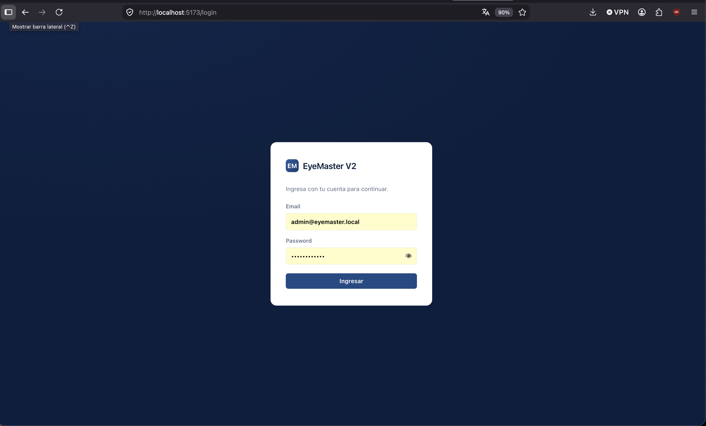

## 2. Inicio (dashboard)

Vista tras iniciar sesión: saludo, estado del backend, accesos rápidos a
cada módulo.

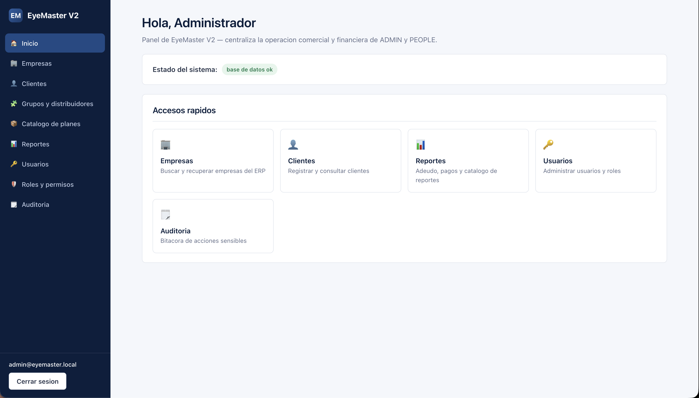

## 3. Empresas — listado de recuperadas

Tabla de empresas ya recuperadas del ERP, con estado y última
sincronización.

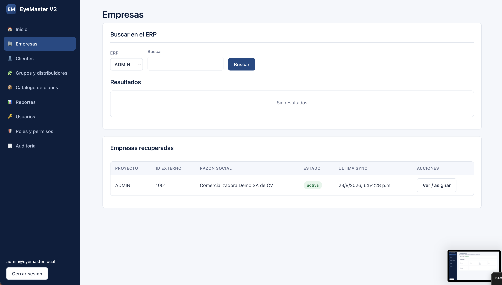

## 4. Empresas — búsqueda en el ERP

Búsqueda contra el ERP simulado (ADMIN) y resultado con el botón
"Recuperar".

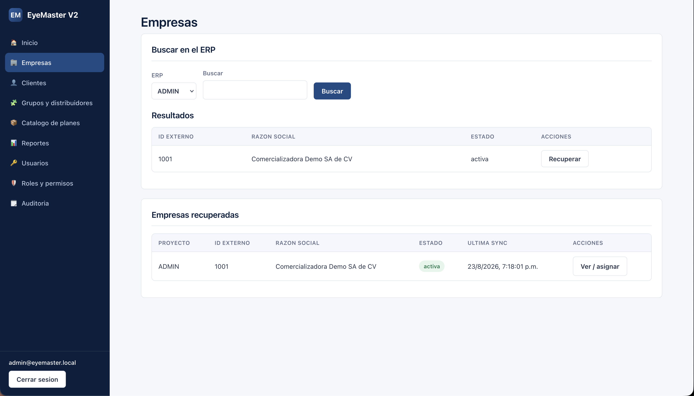

## 5. Detalle de empresa — distribuidor, planes y pagos

Distribuidor efectivo asignado, tabla de planes (con la columna "Origen"
distinguiendo ERP vs. EyeMaster) y el formulario para asignar un nuevo plan
del catálogo.

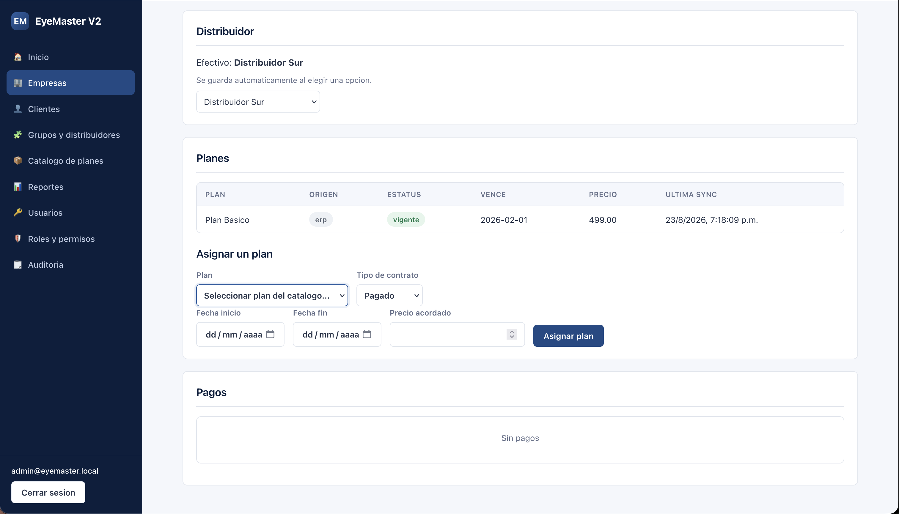

## 6. Clientes

Listado de clientes con su estado de sincronización y el formulario de
alta.

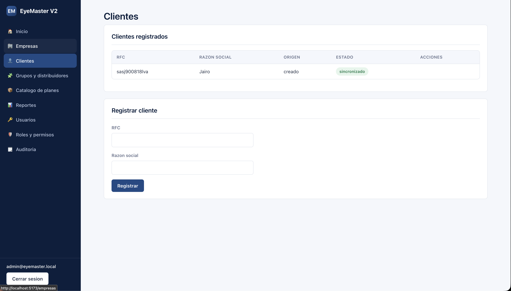

## 7. Grupos y distribuidores

Listado de grupos con su distribuidor asignado, y los formularios para
crear ambos.

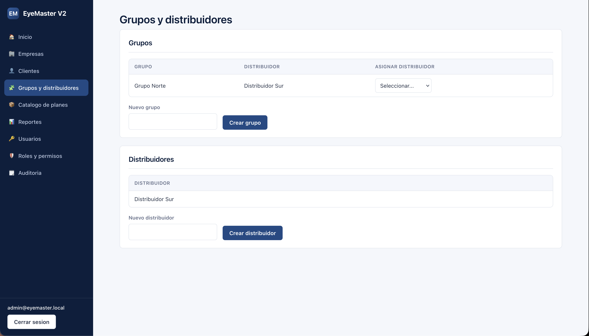

## 8. Catálogo de planes

Listado de complementos y planes (con sus límites de consumo), y los
formularios de creación.

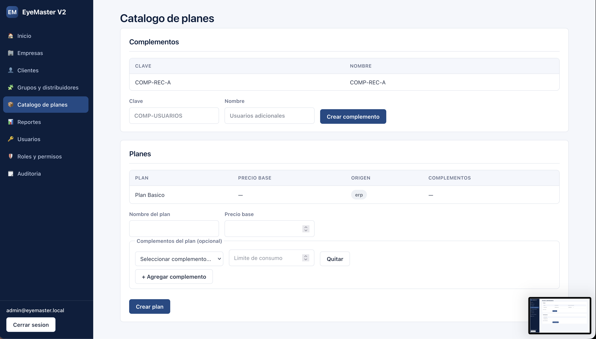

## 9. Reportes

Catálogo de reportes predefinidos, constructor de consulta personalizada, y
resultados mostrando nombres (no IDs).

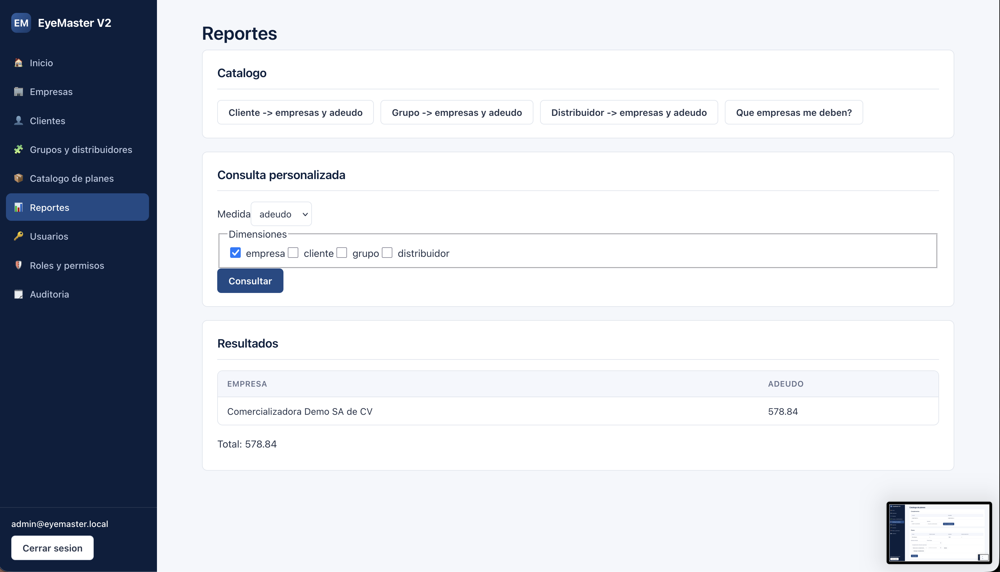

## 10. Usuarios

Listado de usuarios con acciones para activar/desactivar y cambiar de rol,
más el formulario de alta.

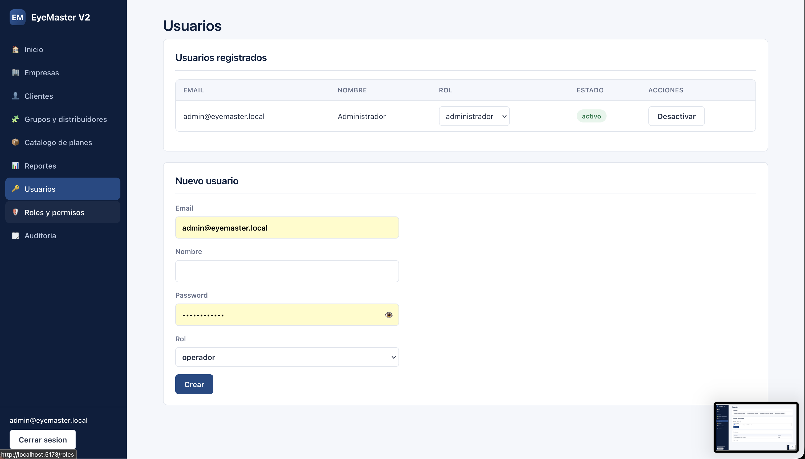

## 11. Roles y permisos

Checkboxes de permisos por rol (administrador, ejecutivo, operador).

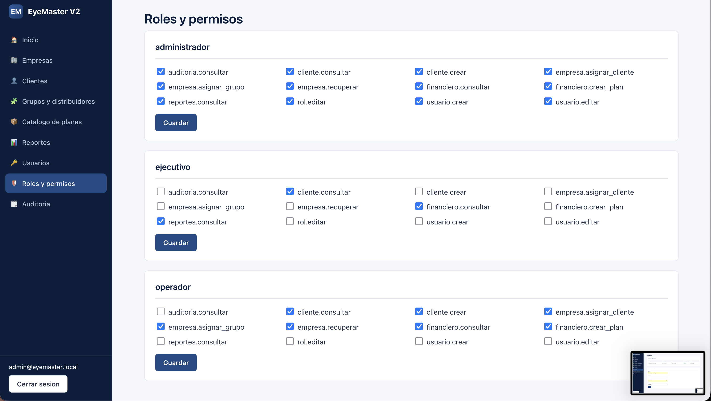

## 12. Auditoría

Bitácora de acciones sensibles (login, registro de cliente, asignaciones).

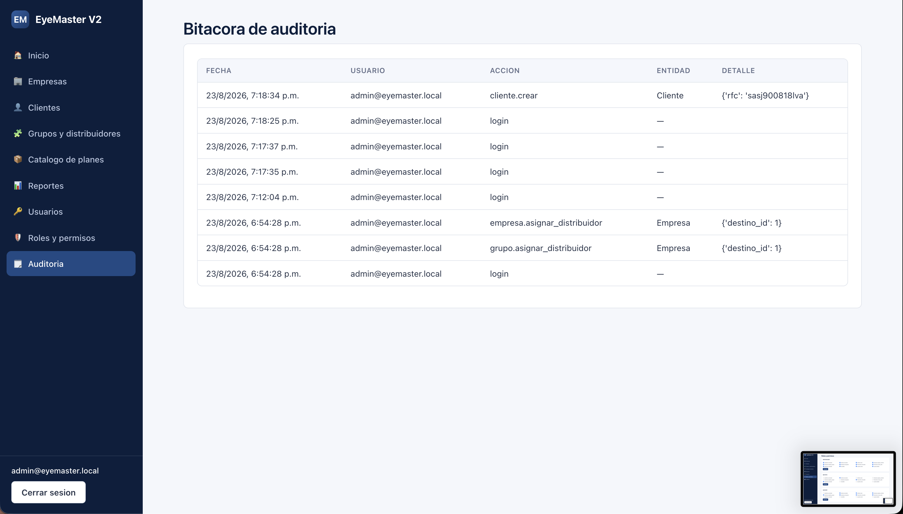

---

## Cómo se tomaron

1. Backend + frontend corriendo localmente (ver `docs/getting-started.md`).
2. Sesión iniciada como `admin@eyemaster.local`.
3. Se recuperó la empresa demo (`ADMIN` / `1001`), se creó un grupo, un
   distribuidor y un plan antes de capturar, para que ninguna pantalla se
   viera vacía.
